# Flow360 仿真组件UML类图文档

本文档展示了Flow360仿真组件的核心架构和类关系图，帮助理解整个框架的结构和设计模式。

## 1. 核心框架架构

### 1.1 基础模型继承关系

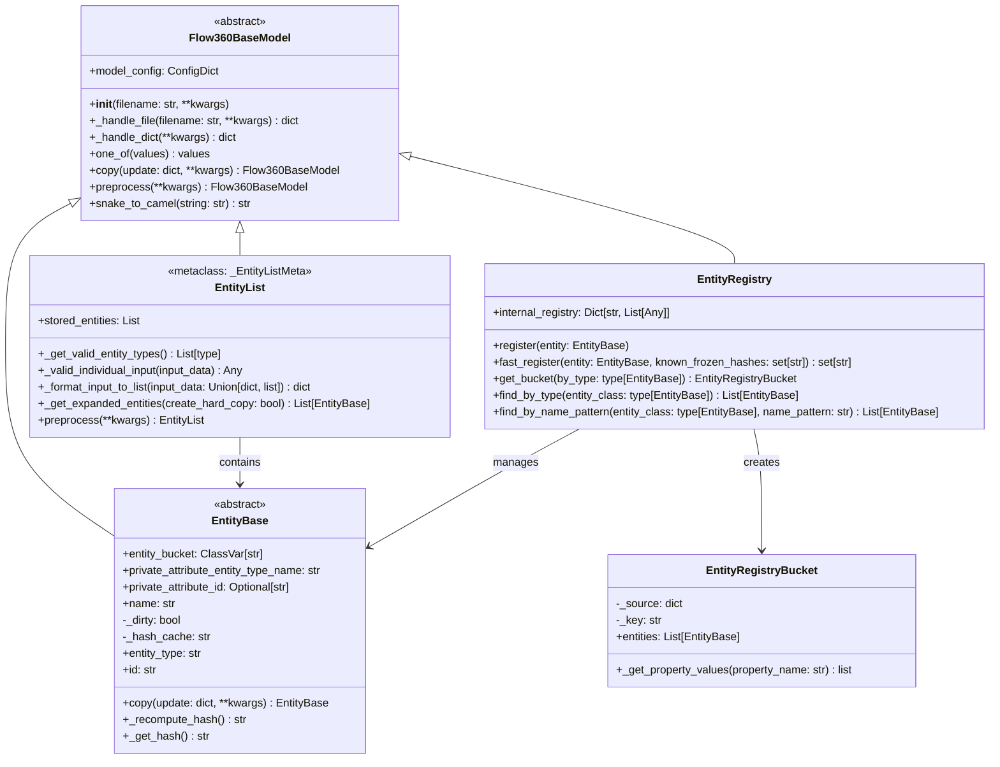

**说明：** 这个图展示了Flow360框架的核心继承关系。`Flow360BaseModel`是所有模型的基类，提供了JSON/YAML文件处理、验证和序列化功能。`EntityBase`是所有实体的抽象基类，实现了命名、哈希缓存和类型管理。`EntityRegistry`提供实体注册和查找功能，而`EntityList`处理实体集合的管理。

### 1.2 实体系统架构

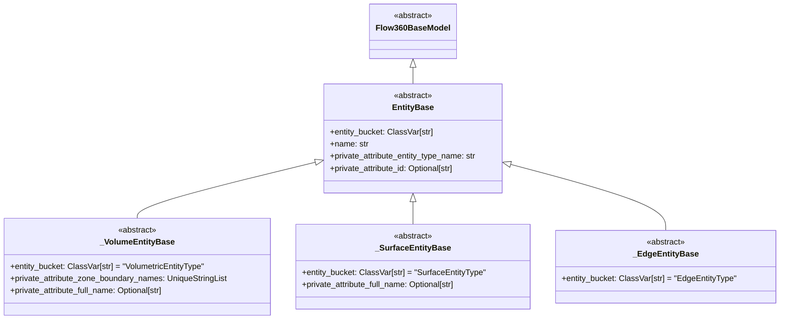

**说明：** 这个图展示了实体系统的真实架构。`EntityBase`继承自`Flow360BaseModel`，然后根据几何类型分为体实体（`_VolumeEntityBase`）、面实体（`_SurfaceEntityBase`）和边实体（`_EdgeEntityBase`）。每个基类定义了自己的`entity_bucket`来进行分组管理和特定的属性。

## 2. 材料模型系统

### 2.1 材料类继承关系

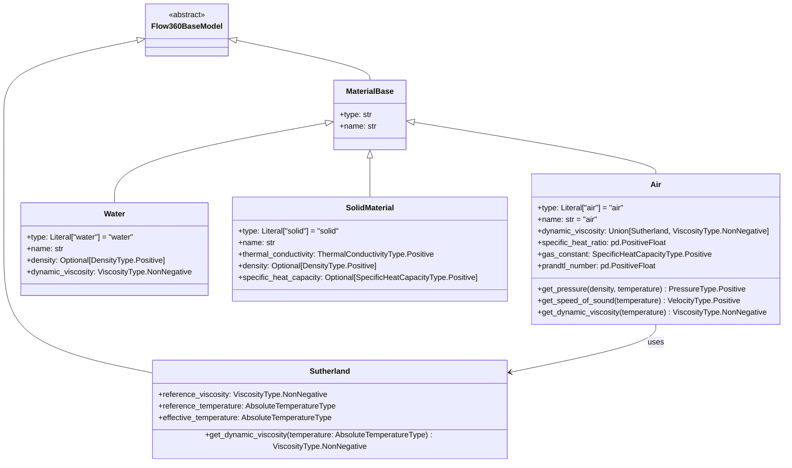

**说明：** 材料模型系统定义了不同类型的材料属性。`MaterialBase`继承自`Flow360BaseModel`，提供了基本的材料标识符（type和name）。`Air`类实现了空气的热力学性质，包括粘度、比热比、气体常数等，并可以使用Sutherland定律计算温度相关的粘度。`Water`和`SolidMaterial`分别处理液体和固体材料的属性。`Sutherland`是一个独立的辅助类，用于计算基于温度的动态粘度。

## 3. 网格参数系统

### 3.1 网格参数类继承关系

```mermaid
classDiagram
    class Flow360BaseModel {
        <<abstract>>
    }
    
    class MeshingDefaults {
        +geometry_accuracy: Optional[LengthType.Positive]
        +surface_edge_growth_rate: float
        +boundary_layer_growth_rate: float
        +boundary_layer_first_layer_thickness: LengthType.Positive
        +curvature_resolution_angle: AngleType.Positive
    }
    
    class SurfaceEdgeRefinement {
        +refinement_type: Literal["SurfaceEdgeRefinement"] = "SurfaceEdgeRefinement"
        +entities: EdgeList
        +max_edge_length: LengthType.Positive
    }
    
    class SurfaceRefinement {
        +refinement_type: Literal["SurfaceRefinement"] = "SurfaceRefinement" 
        +entities: SurfaceList
        +max_edge_length: LengthType.Positive
    }
    
    class BoundaryLayer {
        +refinement_type: Literal["BoundaryLayer"] = "BoundaryLayer"
        +entities: SurfaceList
        +first_layer_thickness: LengthType.Positive
        +number_of_layers: pd.PositiveInt
        +growth_rate: float
    }
    
    class UniformRefinement {
        +refinement_type: Literal["UniformRefinement"] = "UniformRefinement"
        +entities: VolumeList
        +max_edge_length: LengthType.Positive
    }
    
    class StructuredBoxRefinement {
        +refinement_type: Literal["StructuredBoxRefinement"] = "StructuredBoxRefinement"
        +entities: BoxList
        +spacing: List[LengthType.Positive]
    }

    Flow360BaseModel <|-- MeshingDefaults
    Flow360BaseModel <|-- SurfaceEdgeRefinement
    Flow360BaseModel <|-- SurfaceRefinement
    Flow360BaseModel <|-- BoundaryLayer
    Flow360BaseModel <|-- UniformRefinement
    Flow360BaseModel <|-- StructuredBoxRefinement
```

**说明：** 网格参数系统提供了多种网格细化策略。`MeshingDefaults`定义全局网格设置，各种细化类（如`SurfaceEdgeRefinement`、`BoundaryLayer`等）提供针对特定几何实体的网格控制。每种细化类都有特定的参数来控制网格密度和质量。

## 4. 蓝图系统（Blueprint System）

### 4.1 蓝图核心组件

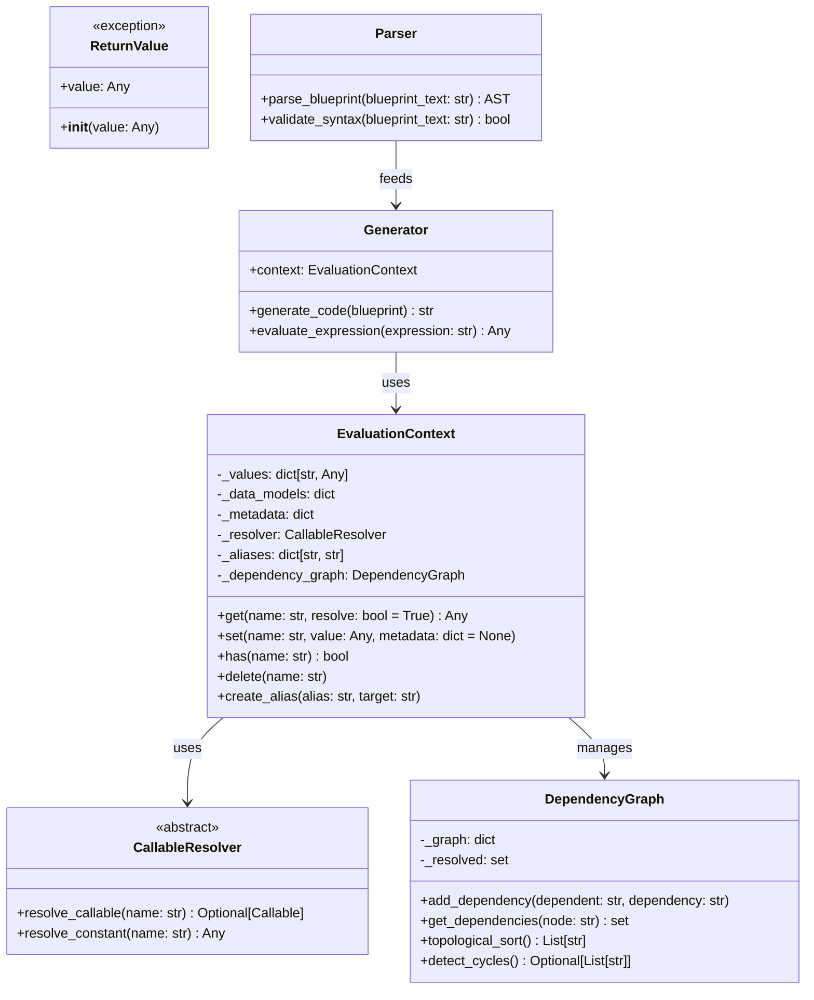

**说明：** 蓝图系统提供了一个可编程的配置框架。`EvaluationContext`管理变量作用域和解析，`CallableResolver`解析函数和常量，`DependencyGraph`处理依赖关系和拓扑排序。这个系统允许用户通过表达式和函数来动态配置仿真参数。

## 5. 体模型系统

### 5.1 体模型类层次结构

```mermaid
classDiagram
    class Flow360BaseModel {
        <<abstract>>
    }
    
    class PDEModelBase {
        <<abstract>>
        +name: Optional[str]
        +entities: EntityList[GenericVolume]
    }
    
    class Fluid {
        +type: Literal["Fluid"] = "Fluid"
        +navier_stokes_solver: NavierStokesSolver
        +turbulence_model_solver: TurbulenceModelSolverType
        +transition_model_solver: TransitionModelSolverType
        +material: FluidMaterialTypes
        +initial_condition: Union[NavierStokesModifiedRestartSolution, NavierStokesInitialCondition]
    }
    
    class Solid {
        +name: Optional[str]
        +type: Literal["Solid"] = "Solid"
        +entities: EntityList[GenericVolume]
        +material: SolidMaterialTypes
        +heat_equation_solver: HeatEquationSolver
        +volumetric_heat_source: Union[StringExpression, HeatSourceType]
        +initial_condition: Optional[HeatEquationInitialCondition]
    }
    
    class ActuatorDisk {
        +name: Optional[str]
        +type: Literal["ActuatorDisk"] = "ActuatorDisk"
        +entities: EntityListWithCustomVolume[GenericVolume, Box, CustomVolume]
        +center: LengthType.Point
        +axis: Axis
        +thickness: LengthType.Positive
        +diameter: LengthType.Positive
    }
    
    class Rotation {
        +name: Optional[str]
        +type: Literal["Rotation"] = "Rotation"
        +center: LengthType.Point
        +axis: Axis
        +spec: Union[AngularVelocity, AngleExpression, FromUserDefinedDynamics]
        +entities: EntityListWithCustomVolume[GenericVolume, Box, CustomVolume]
    }
    
    class BETDisk {
        +name: Optional[str]
        +type: Literal["BETDisk"] = "BETDisk"
        +center: LengthType.Point
        +axis: Axis  
        +inner_radius: LengthType.NonNegative
        +outer_radius: LengthType.Positive
        +number_of_blades: pd.PositiveInt
        +entities: EntityListWithCustomVolume[GenericVolume, Box, CustomVolume]
    }
    
    class PorousMedium {
        +name: Optional[str]
        +type: Literal["PorousMedium"] = "PorousMedium"
        +entities: EntityListWithCustomVolume[GenericVolume, Box, CustomVolume]
        +darcy_coefficient: InverseLengthType.PositiveVector
        +forchheimer_coefficient: InverseLengthType.PositiveVector
    }

    Flow360BaseModel <|-- PDEModelBase
    Flow360BaseModel <|-- ActuatorDisk
    Flow360BaseModel <|-- Rotation
    Flow360BaseModel <|-- BETDisk
    Flow360BaseModel <|-- PorousMedium
    PDEModelBase <|-- Fluid
    PDEModelBase <|-- Solid
```

**说明：** 体模型系统定义了不同类型的物理模型。`PDEModelBase`是偏微分方程模型的基类，`Fluid`和`Solid`分别处理流体和固体的物理求解。其他模型如`Rotation`定义旋转运动，`BETDisk`实现叶片单元理论的风机/螺旋桨模型，`ActuatorDisk`和`PorousMedium`分别处理执行器盘和多孔介质。每个模型都关联到特定的几何体实体。

## 6. 求解器数值方法

### 6.1 求解器继承关系

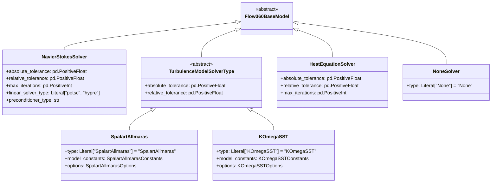

**说明：** 求解器系统定义了各种数值求解方法。`NavierStokesSolver`处理主流动方程，不同的湍流模型如`SpalartAllmaras`和`KOmegaSST`提供湍流求解能力，`HeatEquationSolver`处理传热问题。每个求解器都有自己的数值参数设置。

## 7. 输出系统

### 7.1 输出实体和字段定义

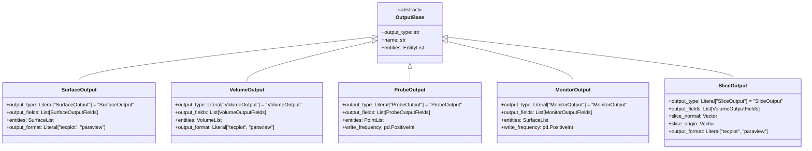

**说明：** 输出系统定义了不同类型的数据输出方式。`SurfaceOutput`和`VolumeOutput`输出面和体的流场数据，`ProbeOutput`在指定点位置输出时间历程数据，`MonitorOutput`监控面上的积分量，`SliceOutput`输出切面数据。每种输出类型都支持不同的输出格式和字段选择。

## 8. 表面模型系统（边界条件）

### 8.1 边界条件类继承关系

```mermaid
classDiagram
    class Flow360BaseModel {
        <<abstract>>
    }
    
    class BoundaryBase {
        <<abstract>>
        +name: Optional[str]
        +type: str
        +entities: EntityList[Surface]
    }
    
    class BoundaryBaseWithTurbulenceQuantities {
        <<abstract>>
        +turbulence_quantities: Optional[TurbulenceQuantities]
    }
    
    class Wall {
        +name: Optional[str]
        +type: Literal["Wall"] = "Wall"
        +use_wall_function: bool
        +velocity: Optional[Union[WallVelocityModelTypes, VelocityVectorType]]
        +heat_spec: Union[HeatFlux, Temperature]
        +roughness_height: LengthType.NonNegative
        +entities: EntityList[Surface]
    }
    
    class Freestream {
        +name: Optional[str]
        +type: Literal["Freestream"] = "Freestream"
        +velocity: Optional[VelocityVectorType]
        +entities: EntityListAllowingGhost[Surface, GhostSurface, GhostSphere, GhostCircularPlane]
        +turbulence_quantities: Optional[TurbulenceQuantities]
    }
    
    class SlipWall {
        +name: Optional[str]
        +type: Literal["SlipWall"] = "SlipWall"
        +entities: EntityListAllowingGhost[Surface, GhostSurface, GhostCircularPlane]
    }
    
    class Outflow {
        +name: Optional[str]
        +type: Literal["Outflow"] = "Outflow"
        +spec: Union[TotalPressure, Pressure, MassFlowRate, Supersonic]
        +entities: EntityList[Surface]
    }
    
    class Inflow {
        +name: Optional[str]
        +type: Literal["Inflow"] = "Inflow"
        +spec: Union[TotalPressure, MassFlowRate, Mach]
        +entities: EntityList[Surface]
        +turbulence_quantities: Optional[TurbulenceQuantities]
    }
    
    class SymmetryPlane {
        +name: Optional[str]
        +type: Literal["SymmetryPlane"] = "SymmetryPlane"
        +entities: EntityList[Surface]
    }
    
    class Periodic {
        +name: Optional[str]
        +type: Literal["Periodic"] = "Periodic"
        +spec: Union[Translational, Rotational]
        +entities: EntityList[Surface]
    }
    
    class PorousJump {
        +name: Optional[str]
        +type: Literal["PorousJump"] = "PorousJump"
        +darcy_coefficient: InverseLengthType.Positive
        +inertial_coefficient: InverseLengthType.Positive
        +entities: EntityList[Surface]
    }

    Flow360BaseModel <|-- BoundaryBase
    BoundaryBase <|-- BoundaryBaseWithTurbulenceQuantities
    BoundaryBase <|-- Wall
    BoundaryBase <|-- SlipWall
    BoundaryBase <|-- Outflow
    BoundaryBase <|-- SymmetryPlane
    BoundaryBase <|-- Periodic
    BoundaryBase <|-- PorousJump
    BoundaryBaseWithTurbulenceQuantities <|-- Freestream
    BoundaryBaseWithTurbulenceQuantities <|-- Inflow
```

**说明：** 表面模型系统定义了各种边界条件类型。`BoundaryBase`是所有边界条件的基类，`BoundaryBaseWithTurbulenceQuantities`扩展了湍流量支持。`Wall`定义壁面边界条件，支持壁函数和各种热边界条件；`Freestream`定义远场边界条件；`SlipWall`定义滑移壁面；`Outflow`和`Inflow`分别定义出流和入流边界条件。每种边界条件都关联到特定的表面实体。

### 8.2 壁面速度模型

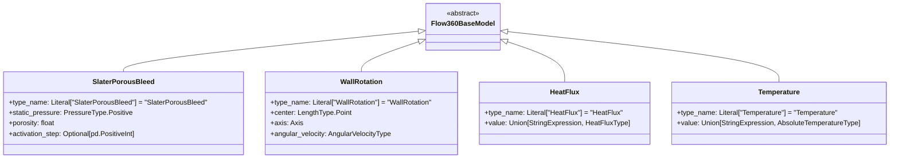

**说明：** 这个图展示了壁面边界条件的辅助模型。`SlaterPorousBleed`实现了Slater多孔出血模型，根据表面压力和密度计算法向速度；`WallRotation`定义旋转壁面模型；`HeatFlux`和`Temperature`分别定义热流和温度边界条件。

## 9. 几何实体系统

### 9.1 几何实体类继承关系

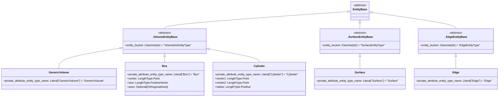

**说明：** 几何实体系统定义了不同类型的几何对象。体实体包括通用体（`GenericVolume`）、盒子（`Box`）和圆柱体（`Cylinder`）；面实体（`Surface`）用于边界条件；边实体（`Edge`）用于网格细化。每种实体都有特定的几何参数和用途。

## 10. 操作条件系统

### 10.1 操作条件类继承关系

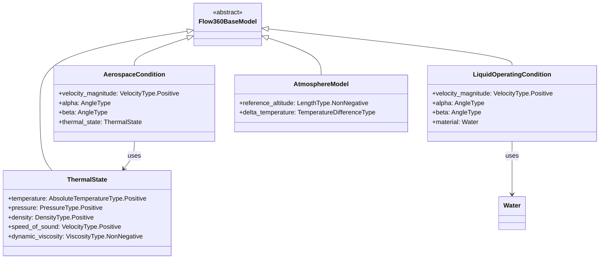

**说明：** 操作条件系统定义了仿真的流体力学环境。`AerospaceCondition`用于气体流动，包含速度、攻角、侧滑角和热力学状态；`LiquidOperatingCondition`用于液体流动；`ThermalState`定义热力学状态参数；`AtmosphereModel`定义大气模型参数。

## 总结

Flow360仿真组件采用了高度模块化和面向对象的设计模式：

1. **分层架构**：从`Flow360BaseModel`基类开始，通过继承建立了清晰的类层次结构
2. **实体系统**：通过`EntityBase`和`EntityRegistry`实现了统一的实体管理机制
3. **类型安全**：大量使用了Pydantic的类型验证和discriminated unions
4. **可扩展性**：通过抽象基类和接口设计，支持新的模型和求解器扩展
5. **配置驱动**：蓝图系统提供了灵活的配置和表达式计算能力

这种设计使得框架既保持了高度的灵活性，又确保了类型安全和代码的可维护性。