# Workbench 组件架构关系文档

## 概述

Flow360 Workbench 是一个复杂的 Angular 应用，用于CFD（计算流体动力学）仿真的设置和分析。本文档从开发者角度分析其组件架构关系。

## 组件层次结构

```mermaid
graph TD
    WB[WorkbenchComponent] --> Header[Header区域]
    WB --> Container[Container区域]
    WB --> Footer[WorkbenchFooterComponent]
    
    Header --> Logo[LogoComponent]
    Header --> Breadcrumb[EditableBreadcrumbComponent]
    Header --> RightPanel[右侧操作面板]
    
    RightPanel --> AssetBtn[AssetBtnComponent]
    RightPanel --> HelpMenu[HelpMenuComponent]
    RightPanel --> ProjectSetting[ProjectSettingBtnComponent]
    RightPanel --> CreateDraft[CreateDraftComponent]
    RightPanel --> RunButtons[运行按钮组]
    
    Container --> LeftSider[左侧边栏]
    Container --> MainContent[主内容区]
    Container --> RightSider[右侧边栏]
    
    LeftSider --> ProjectTree[ProjectTreeComponent]
    
    MainContent --> AnalysisMode{分析模式}
    AnalysisMode --> AnalysisDashboard[AnalysisDashboardComponent]
    AnalysisMode --> AnalysisMetrics[AnalysisMetricsComponent] 
    AnalysisMode --> AnalysisVisualization[AnalysisVisualizationComponent]
    AnalysisMode --> AnalysisConvergence[AnalysisConvergenceComponent]
    AnalysisMode --> AnalysisMonitor[AnalysisMonitorComponent]
    AnalysisMode --> AnalysisAeroacoustic[AnalysisAeroacousticComponent]
    AnalysisMode --> AnalysisReport[AnalysisReportComponent]
    
    MainContent --> SimulationMode{仿真模式}
    SimulationMode --> EditorPanel[EditorPanelComponent]
    SimulationMode --> EntitiesList[EntitiesListComponent]
    SimulationMode --> VisualizationArea[3D可视化区域]
    
    RightSider --> RunCenter[RunCenterComponent]
    RightSider --> SideOperationArea[SideOperationAreaComponent]
    
    VisualizationArea --> VisualizationHeader[VisualizationHeaderComponent]
    VisualizationArea --> VisualizationLegend[VisualizationLegendComponent]
    VisualizationArea --> VisualizationLoadingOverlay[VisualizationLoadingOverlayComponent]
    VisualizationArea --> GaiLoadingOverlay[GaiLoadingOverlayComponent]
    VisualizationArea --> DomOverlay[DomOverlayComponent]
    
    WB --> Modals[Modal组件群]
    Modals --> ExportSettingModal[ExportSettingModalComponent]
    Modals --> ImportSettingModal[ImportSettingModalComponent]
    Modals --> RunPreviewModal[RunPreviewModalComponent]  
    Modals --> ImportViewpointsModal[ImportViewpointsModalComponent]
    Modals --> VarSettingDrawer[VarSettingDrawerComponent]
    
    WB --> Overlays[覆盖层组件]
    Overlays --> LoadingOverlay[LoadingOverlayComponent]
    Overlays --> ContextMenu[ContextMenuComponent]
    
    style WB fill:#e1f5fe
    style AnalysisMode fill:#fff3e0
    style SimulationMode fill:#f3e5f5
    style VisualizationArea fill:#e8f5e8
```

**图表说明**: 这个层次结构图展示了 Workbench 的完整组件树。图中可以看到：
- **蓝色**的 WorkbenchComponent 是根组件，控制整个应用的状态
- **橙色**和**紫色**区域分别代表分析模式和仿真模式，体现了工作台的双模式设计
- **绿色**的可视化区域包含了多个3D渲染相关的组件
- 模态框和覆盖层组件独立于主要布局结构，可以在任何时候被触发显示

通过这个图表，开发者可以快速理解整个应用的组件组织方式，以及在添加新功能时应该将组件放置在哪个层级。

## 组件分类说明

### 1. 核心布局组件
- **WorkbenchComponent**: 主容器组件，管理整个工作台的状态和生命周期
- **Header**: 顶部导航栏，包含面包屑导航和操作按钮
- **LeftSider**: 左侧边栏，主要显示项目树结构
- **MainContent**: 主内容区域，根据模式显示不同的组件
- **RightSider**: 右侧边栏，显示运行中心和操作面板

### 2. 导航与操作组件
- **EditableBreadcrumbComponent**: 可编辑的面包屑导航
- **ProjectTreeComponent**: 项目树，展示项目层次结构
- **AssetBtnComponent**: 资产按钮，管理项目资源
- **CreateDraftComponent**: 创建草稿组件
- **ProjectSettingBtnComponent**: 项目设置按钮

### 3. 分析模式组件
当工作台处于分析模式时，主要显示以下组件：
- **AnalysisDashboardComponent**: 分析仪表板
- **AnalysisMetricsComponent**: 分析指标
- **AnalysisVisualizationComponent**: 分析可视化
- **AnalysisConvergenceComponent**: 收敛性分析
- **AnalysisMonitorComponent**: 监控分析
- **AnalysisAeroacousticComponent**: 气动声学分析
- **AnalysisReportComponent**: 分析报告

### 4. 仿真模式组件
当工作台处于仿真模式时，主要显示：
- **EditorPanelComponent**: 编辑面板，用于配置仿真参数
- **EntitiesListComponent**: 实体列表，显示几何体、网格等
- **3D可视化区域**: 包含多个可视化相关组件

### 5. 可视化相关组件
- **VisualizationHeaderComponent**: 可视化头部控制
- **VisualizationLegendComponent**: 可视化图例
- **VisualizationLoadingOverlayComponent**: 可视化加载覆盖层
- **GaiLoadingOverlayComponent**: GAI加载覆盖层
- **DomOverlayComponent**: DOM覆盖层

### 6. 模态框组件
- **ExportSettingModalComponent**: 导出设置模态框
- **ImportSettingModalComponent**: 导入设置模态框
- **RunPreviewModalComponent**: 运行预览模态框
- **ImportViewpointsModalComponent**: 导入视点模态框
- **VarSettingDrawerComponent**: 变量设置抽屉

### 7. 辅助组件
- **RunCenterComponent**: 运行中心
- **SideOperationAreaComponent**: 侧边操作区域
- **WorkbenchFooterComponent**: 工作台页脚
- **LoadingOverlayComponent**: 加载覆盖层
- **ContextMenuComponent**: 上下文菜单

## 组件通信模式

### 1. 父子组件通信
- 通过 `@Input()` 和 `@Output()` 进行数据传递
- 使用模板引用变量进行直接访问

### 2. 服务注入通信
- 所有组件都依赖 `WorkbenchService` 进行状态管理
- 通过共享服务进行组件间数据同步

### 3. 信号(Signal)通信
- 使用 Angular 17 的信号系统进行响应式状态管理
- 计算属性自动更新UI状态

## 架构特点

1. **模块化设计**: 每个功能区域都有独立的组件，便于维护和复用
2. **响应式架构**: 大量使用 Angular Signals 进行状态管理
3. **条件渲染**: 根据不同模式和状态显示不同的组件组合
4. **分层结构**: 清晰的组件层次结构，便于理解和维护
5. **服务驱动**: 核心业务逻辑通过服务层进行管理
