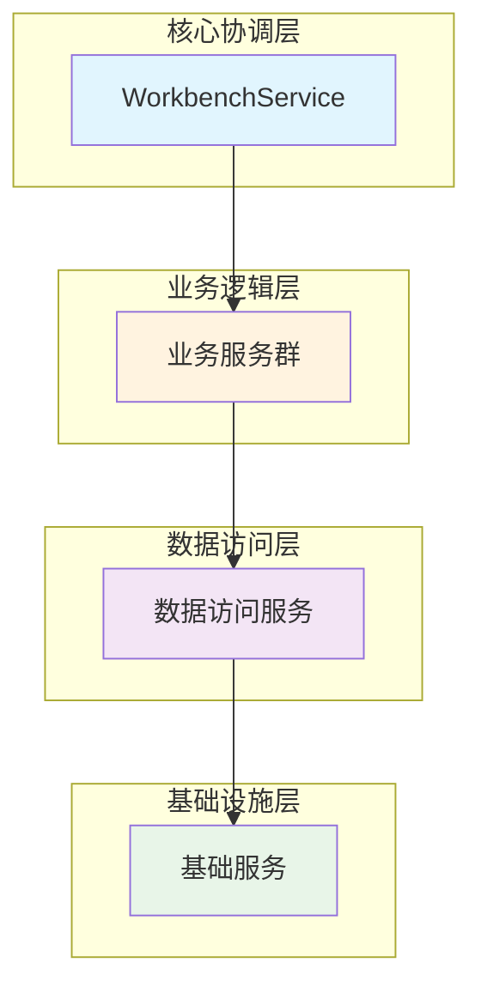
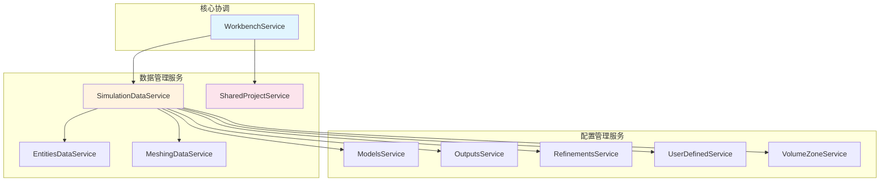
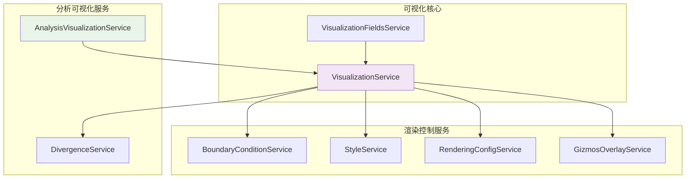
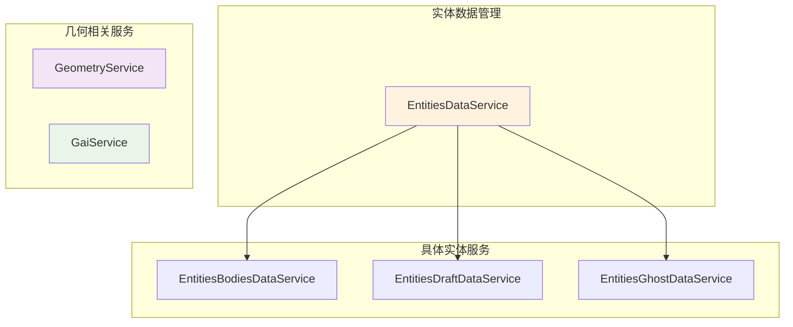
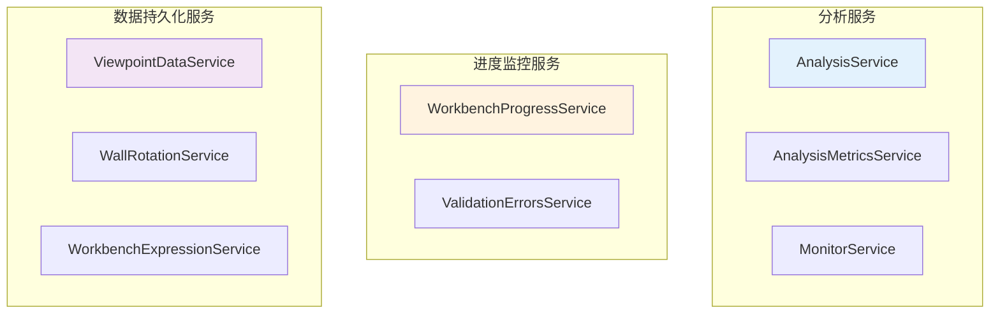
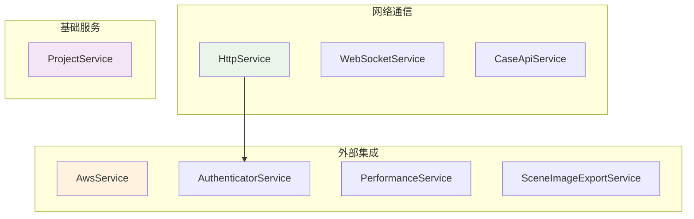
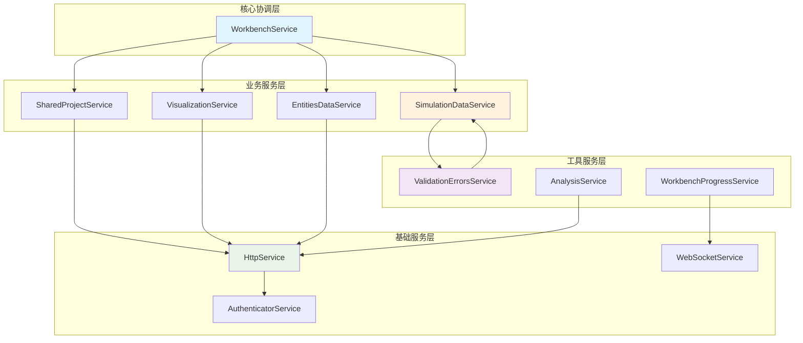
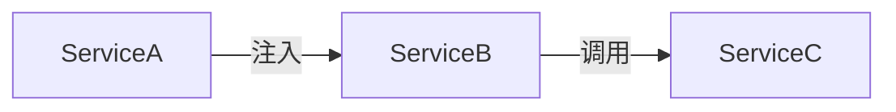
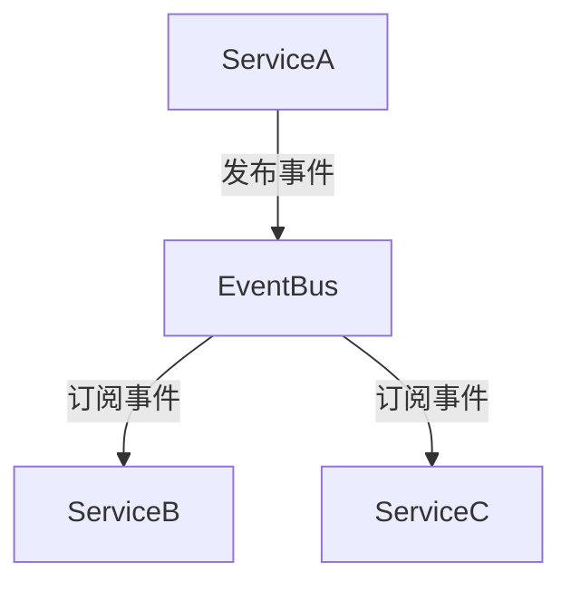
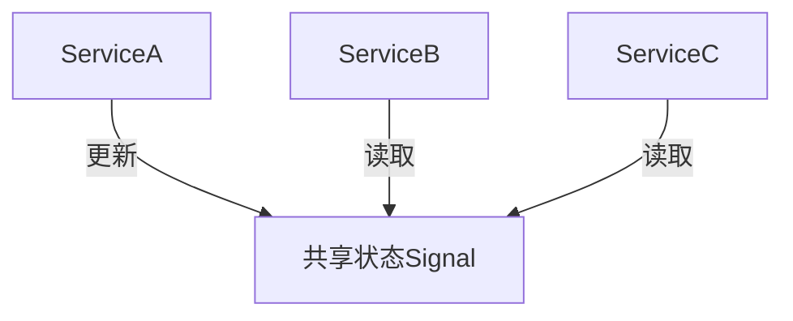

# Workbench 服务依赖关系文档

## 概述

Workbench 模块包含了大量的服务，这些服务负责数据管理、业务逻辑处理和状态管理。本文档分析这些服务之间的依赖关系。

## 服务架构总览

### 整体架构层次图



**图表说明**: 这个总览图展示了 Workbench 服务的四层架构模式。从上到下分别是：
- **核心协调层**（蓝色）：WorkbenchService 作为唯一的协调者，统筹管理整个应用状态
- **业务逻辑层**（橙色）：包含各种业务服务，处理具体的业务逻辑
- **数据访问层**（紫色）：负责与后端API交互，获取和提交数据
- **基础设施层**（绿色）：提供认证、性能监控等基础功能支撑

这种分层设计遵循了软件架构的最佳实践，确保了职责分离和系统的可维护性。

## 分类服务架构图

### 1. 核心业务服务组



**图表说明**: 核心业务服务组展示了 WorkbenchService 如何协调各个业务服务。图中显示：
- **WorkbenchService** 直接管理两个核心数据服务：SimulationDataService 和 SharedProjectService
- **SimulationDataService** 作为仿真数据的中枢，依赖多个专门的配置管理服务
- **配置管理服务组** 各自处理特定的配置项（模型、输出、细化、用户自定义、体积区域等）
- 这种设计实现了数据的集中管理和配置的模块化处理

### 2. 可视化服务组



**图表说明**: 可视化服务组展示了3D渲染相关服务的组织结构。图中可以看到：
- **VisualizationService** 是可视化的核心服务，管理 Three.js 场景
- **渲染控制服务组** 负责具体的渲染细节：边界条件显示、样式管理、渲染配置、操作控件等
- **分析可视化服务组** 专门处理分析结果的可视化和发散处理
- **VisualizationFieldsService** 提供字段数据支持
- 这种模块化设计使得可视化功能既统一管理又职责分明

### 3. 实体数据服务组



**图表说明**: 实体数据服务组展示了几何实体数据的管理架构。图中显示：
- **EntitiesDataService** 作为实体数据的抽象管理层，统一对外提供接口
- **具体实体服务组** 分别处理不同类型的实体数据：实体体数据、草稿实体数据、幽灵实体数据
- **几何相关服务组** 包含几何操作服务和GAI（几何人工智能）服务
- 这种设计实现了实体数据的分类管理，便于处理不同状态和类型的几何对象

### 4. 分析监控服务组



### 5. 基础设施服务组



**图表说明**: 基础设施服务组展示了支撑整个应用运行的底层服务架构：
- **网络通信组**: HttpService提供HTTP通信、WebSocketService提供实时通信、CaseApiService提供案例相关API
- **外部集成组**: 包含AWS服务、认证服务、性能监控服务、场景图像导出服务等外部系统集成
- **基础服务组**: ProjectService提供项目基础功能支持
- **依赖关系**: HttpService依赖AuthenticatorService进行身份验证
- 这些服务为上层业务服务提供了稳固的基础设施支撑

### 6. 跨服务组依赖关系



**图表说明**: 这个跨服务组依赖关系图展示了不同服务层之间的依赖模式：
- **核心协调层**: WorkbenchService作为最高层协调者，依赖各个业务服务
- **业务服务层**: 包含核心业务逻辑服务，它们依赖基础服务层进行数据访问
- **工具服务层**: 提供验证、进度监控、分析等辅助功能，与业务服务层相互依赖
- **基础服务层**: 提供HTTP通信、WebSocket、认证等基础功能支撑
- **依赖方向**: 总体遵循从上到下的依赖方向，避免循环依赖
- 这种分层设计实现了职责分离和依赖管理的最佳实践

## 服务分类与职责

### 1. 核心协调服务

#### WorkbenchService
- **职责**: 工作台的全局状态管理和业务协调
- **依赖**: 几乎所有业务相关服务
- **特点**: 作为服务层的协调者，管理各种状态信号

### 2. 各服务组职责概述

| 服务组 | 核心服务 | 主要职责 | 关键特点 |
|--------|----------|----------|----------|
| **核心协调** | WorkbenchService | 全局状态管理和业务协调 | 服务层协调者，管理状态信号 |
| **数据管理** | SimulationDataService<br/>SharedProjectService | 仿真数据管理<br/>项目信息管理 | JSON数据组装验证<br/>项目级共享状态 |
| **可视化** | VisualizationService<br/>VisualizationFieldsService | 3D可视化渲染<br/>可视化字段管理 | Three.js场景管理<br/>渲染流程控制 |
| **实体数据** | EntitiesDataService | 实体数据统一管理 | 实体数据抽象层 |
| **分析监控** | AnalysisService<br/>ValidationErrorsService | 分析处理<br/>验证错误管理 | 实时验证配置有效性 |
| **基础设施** | HttpService<br/>WebSocketService | 网络通信<br/>实时数据同步 | 统一API调用<br/>WebSocket管理 |

## 依赖关系特点

### 1. 分层架构
- **表现层**: WorkbenchComponent等UI组件
- **业务层**: WorkbenchService等业务服务
- **数据层**: HttpService、WebSocketService等数据服务
- **基础层**: AuthenticatorService等基础服务

### 2. 依赖注入模式
```typescript
// 典型的服务依赖注入
@Injectable({ providedIn: 'root' })
export class WorkbenchService {
  constructor(
    private http: HttpService,
    private projectService: SharedProjectService,
    private simulationService: SimulationDataService,
    // ... 其他依赖
  ) {}
}
```

### 3. 信号驱动更新
- 使用Angular 17的Signals进行响应式状态管理
- 服务间通过computed信号自动同步状态

### 4. 服务通信模式

#### a) 直接依赖注入


#### b) 事件总线模式


#### c) 状态共享模式


## 服务优化建议

1. **减少循环依赖**: 某些服务间存在潜在的循环依赖风险
2. **接口抽象**: 可以引入更多接口来解耦具体实现
3. **状态管理**: 考虑使用专门的状态管理库如NgRx
4. **缓存策略**: 为频繁调用的服务添加适当的缓存机制
