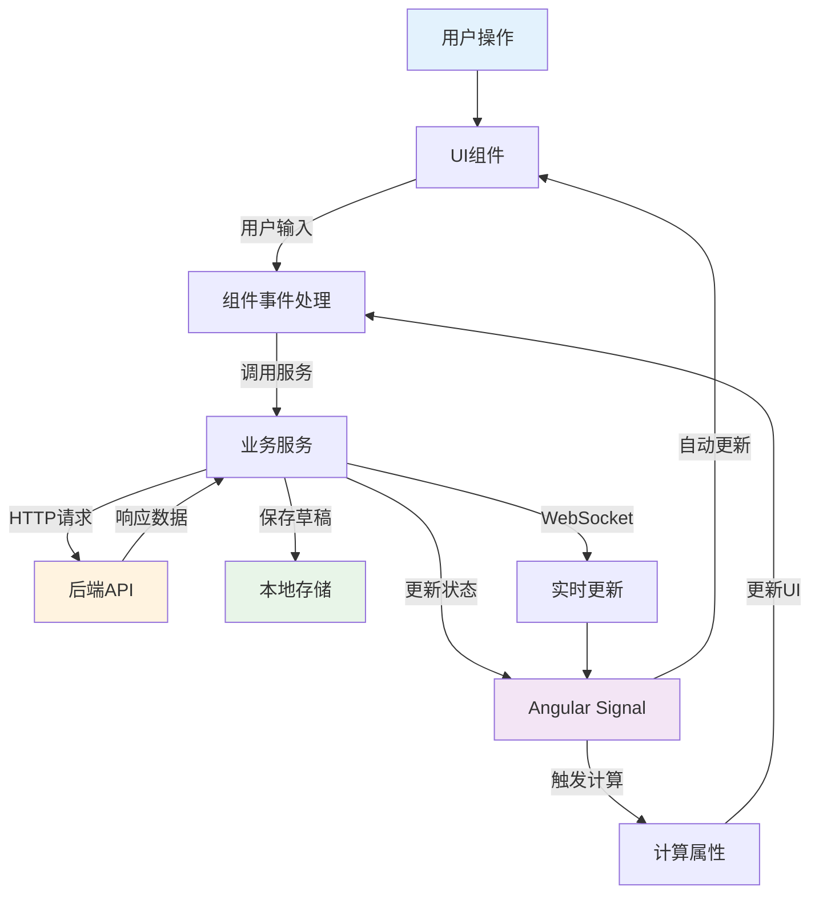
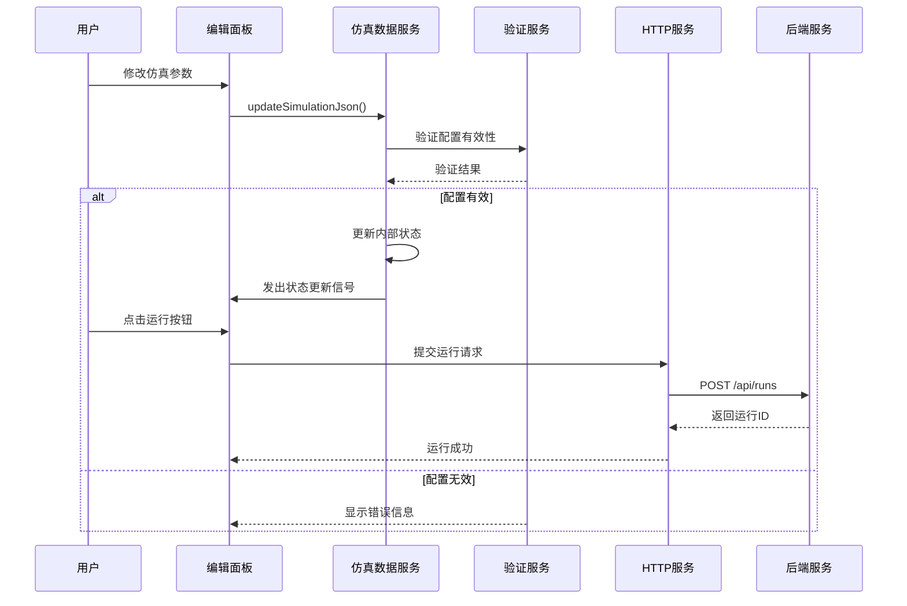
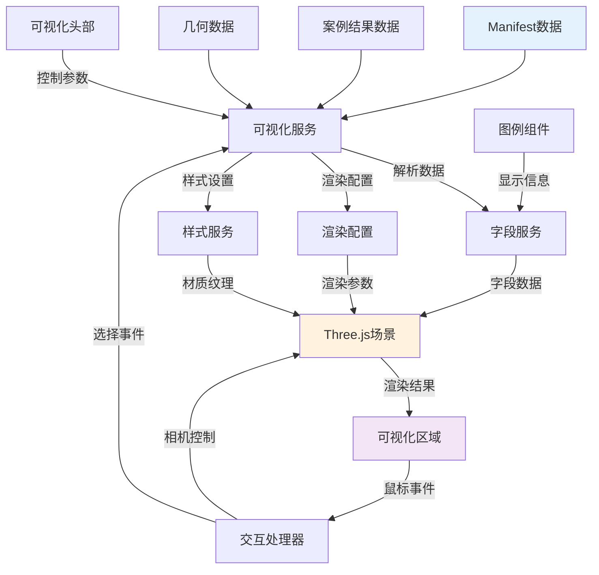
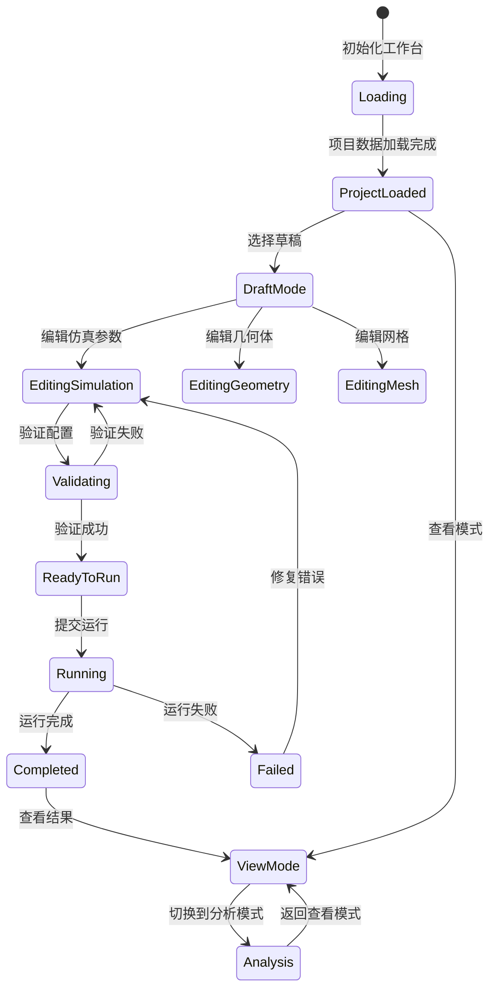
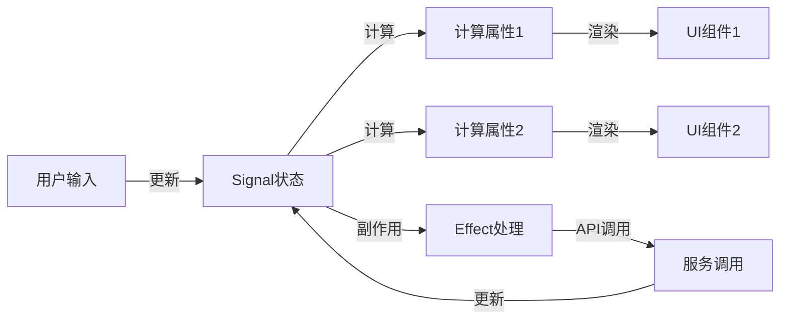
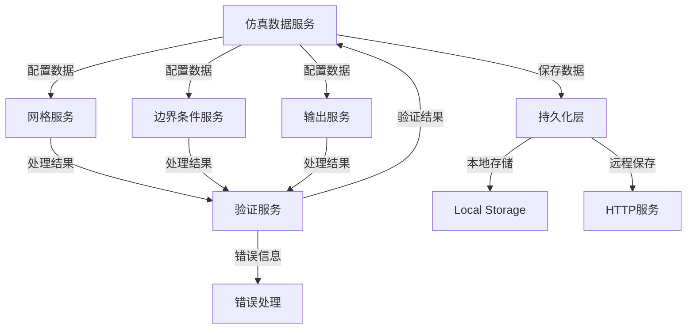
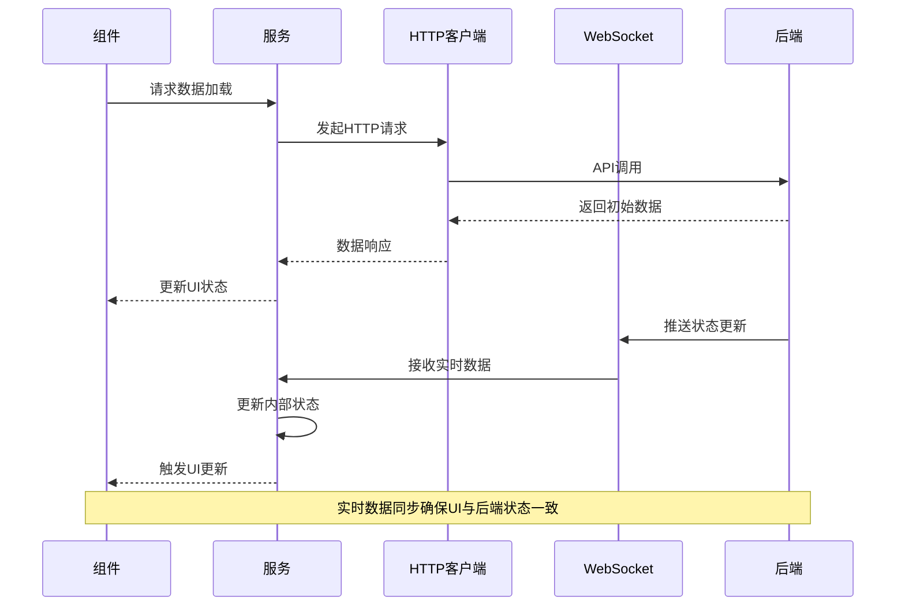
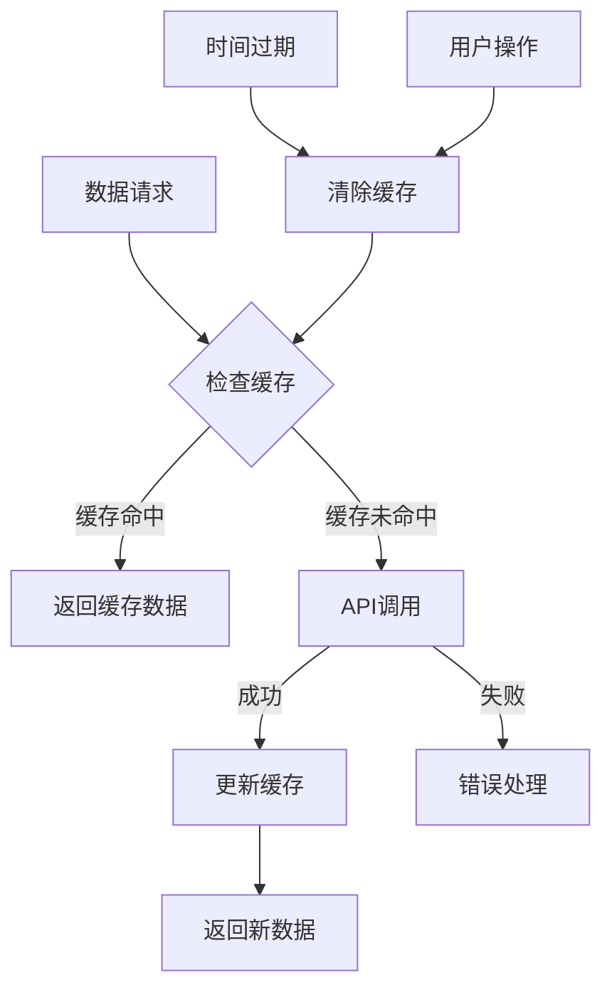
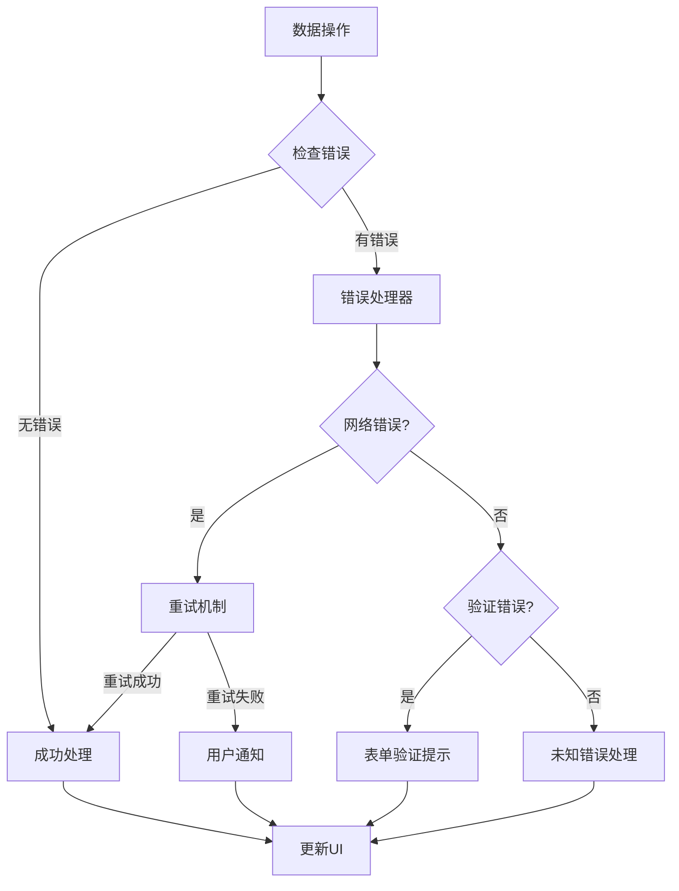
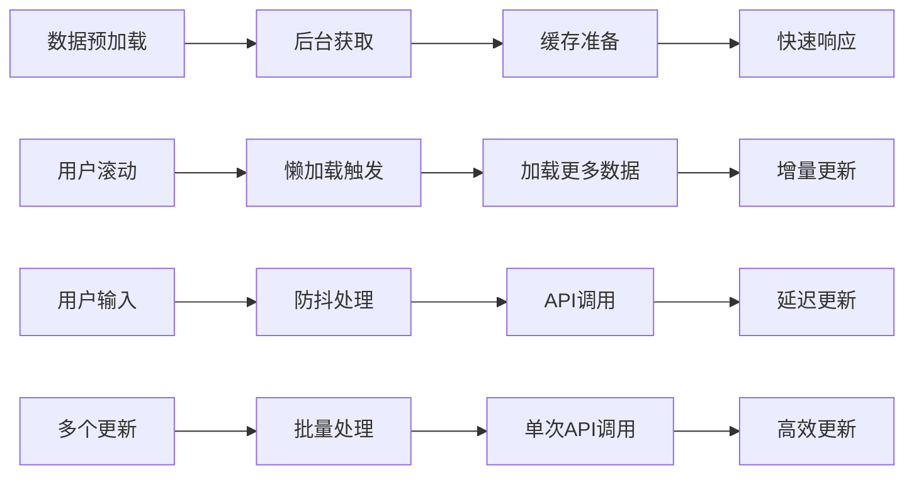

# Workbench 数据流向分析文档

## 概述

本文档分析 Flow360 Workbench 中的数据流动模式，包括用户交互触发的数据流、服务间的数据传递和状态更新机制。

## 主要数据流向图

### 1. 用户操作数据流

**图表说明**: 这个用户操作数据流图展示了 Workbench 中典型的响应式数据流模式。图中显示了完整的数据流循环：
- **用户操作** 触发UI组件事件，经过组件处理后调用业务服务
- **业务服务** 发起HTTP请求到后端API，获取响应数据后更新Angular Signal状态
- **Signal状态** 自动触发UI更新和计算属性重新计算，实现响应式更新
- **数据持久化** 通过本地存储保存草稿，通过WebSocket接收实时更新
- 这种设计确保了数据的单向流动和自动同步，提升了用户体验

### 2. 仿真配置数据流

**图表说明**: 这个时序图详细展示了仿真配置的完整数据流程。图中展现了两个关键路径：
- **成功路径**: 用户修改参数 → 验证通过 → 更新状态 → 提交运行 → 获得运行ID
- **错误路径**: 用户修改参数 → 验证失败 → 显示错误信息
- **关键特点**: 系统在提交到后端之前会进行前端验证，确保数据有效性
- **异步处理**: 运行提交是异步操作，后端返回运行ID后前端可以继续处理其他操作
- 这种设计保证了仿真配置的数据完整性和用户体验

### 3. 可视化数据流

### 4. 项目状态数据流

**图表说明**: 这个状态图展示了 Workbench 项目的完整生命周期状态转换。图中体现了：
- **初始化流程**: 从加载到项目数据载入完成
- **模式分支**: 项目载入后可以进入草稿编辑模式或查看模式
- **编辑流程**: 草稿模式下可以编辑仿真参数、几何体或网格，经过验证后可以提交运行
- **运行结果**: 运行可能成功完成或失败，完成后可以查看结果，失败后需要修复错误
- **模式切换**: 查看模式和分析模式之间可以相互切换
- 这种状态设计保证了工作流的逻辑性和用户操作的一致性

## 核心数据流模式

### 1. Signal驱动的响应式数据流

#### 关键特点：
- **自动更新**: Signal状态变化时，依赖的computed属性和UI自动更新
- **性能优化**: 只有真正变化的部分才会重新计算和渲染
- **类型安全**: TypeScript提供完整的类型检查

### 2. 服务间数据传递模式

### 3. 异步数据处理流

## 数据流优化策略

### 1. 数据缓存策略

### 2. 错误处理数据流

### 3. 性能优化数据流

## 数据一致性保证

### 1. 状态同步机制
- **单一数据源**: 每个数据类型都有明确的主要管理服务
- **信号传播**: 使用Angular Signals确保状态变化能够及时传播
- **版本控制**: 通过版本号确保数据的一致性

### 2. 冲突解决策略
- **乐观锁**: 在提交时检查数据版本
- **用户确认**: 发生冲突时让用户选择解决方案
- **自动合并**: 对于非冲突的变更自动合并

### 3. 数据验证流程
- **前端验证**: 实时验证用户输入
- **服务端验证**: 提交时进行完整性检查
- **异步验证**: 对于复杂验证使用异步模式

这种数据流设计确保了Workbench应用的数据一致性、性能和用户体验。
