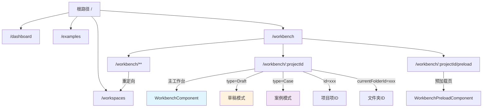
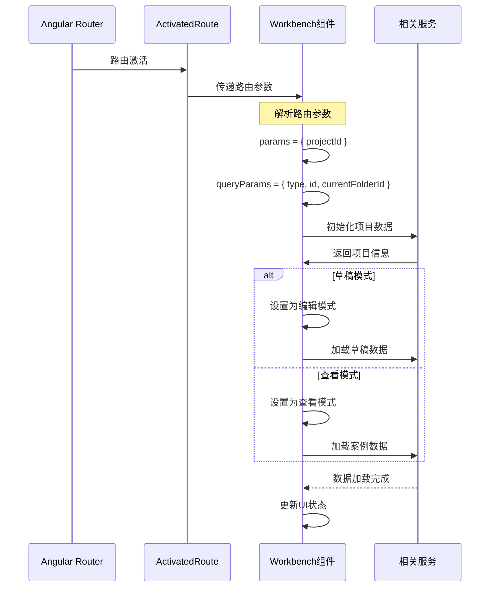
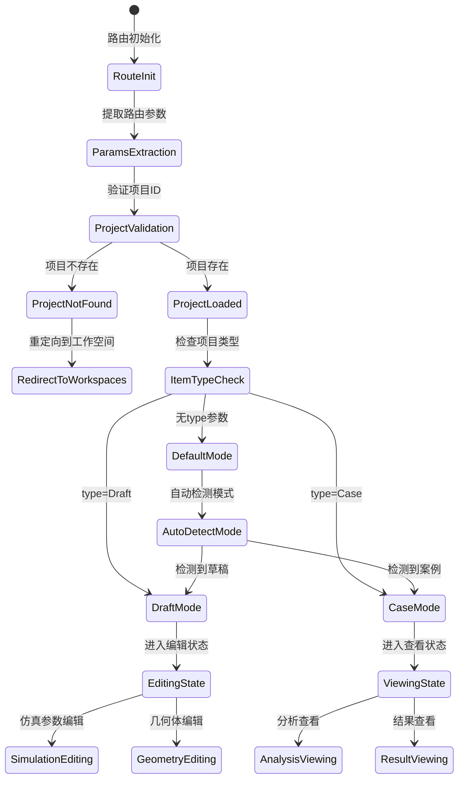
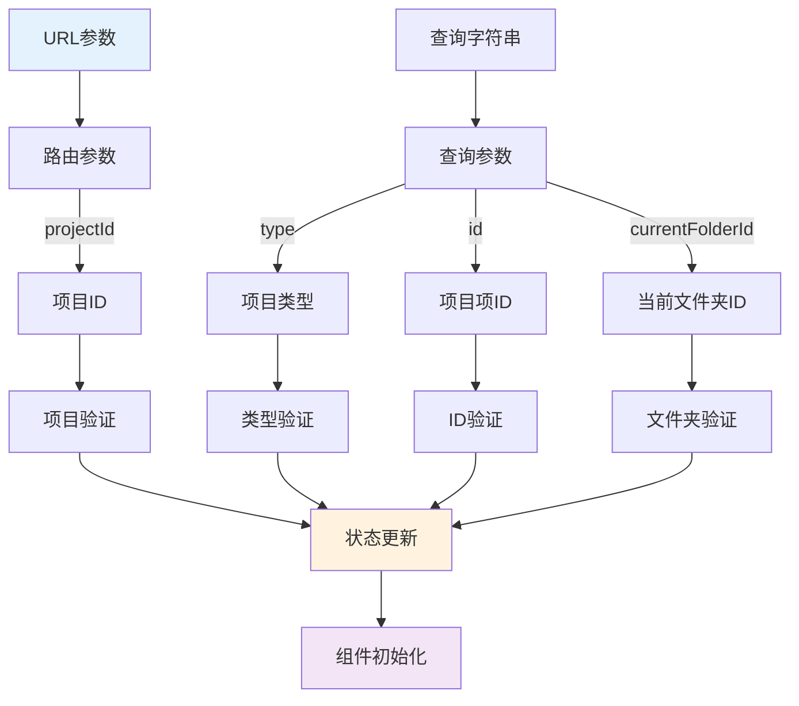
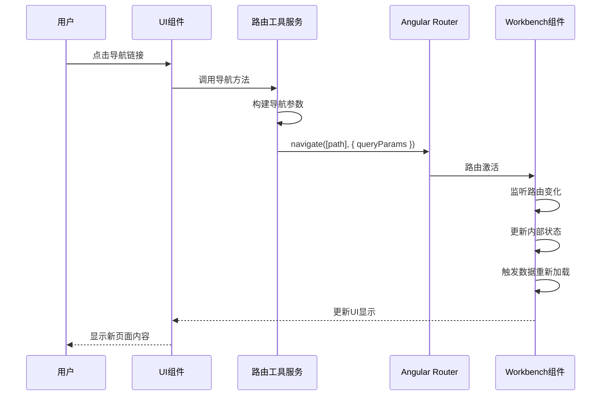
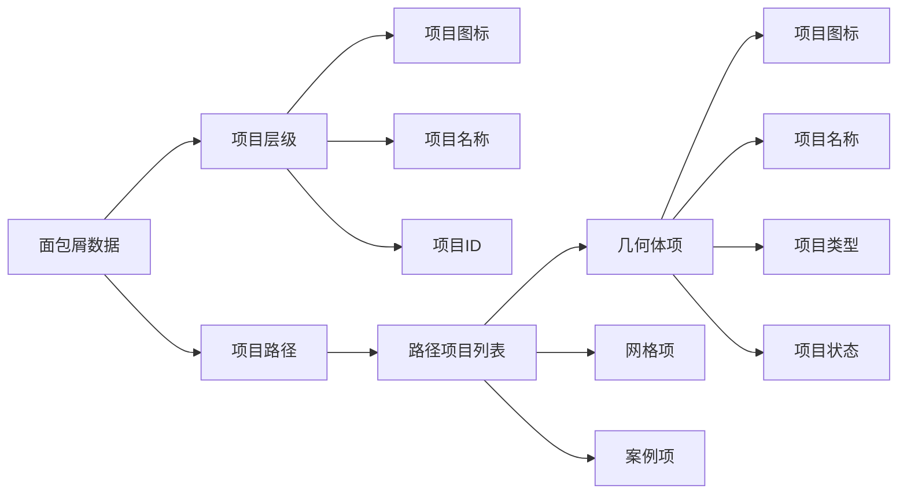
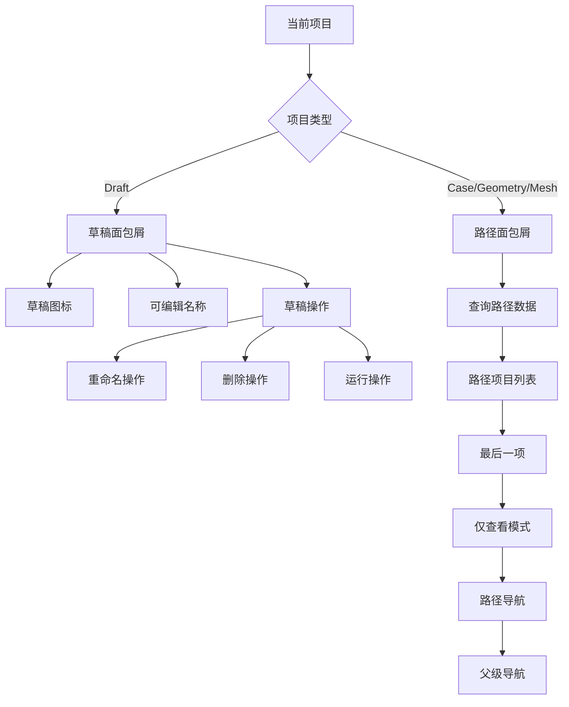
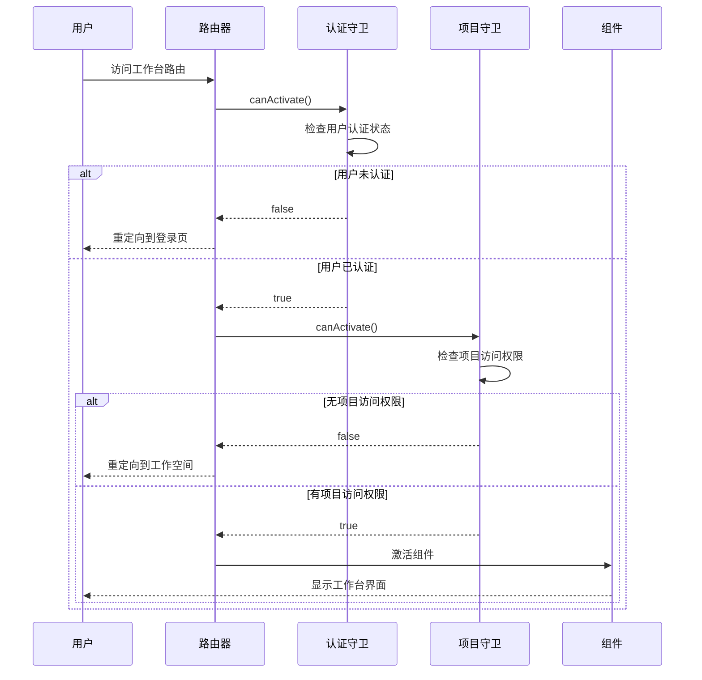
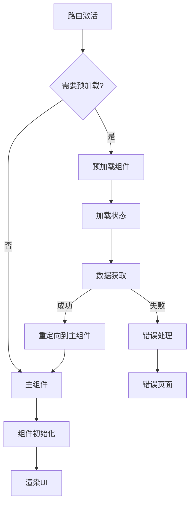
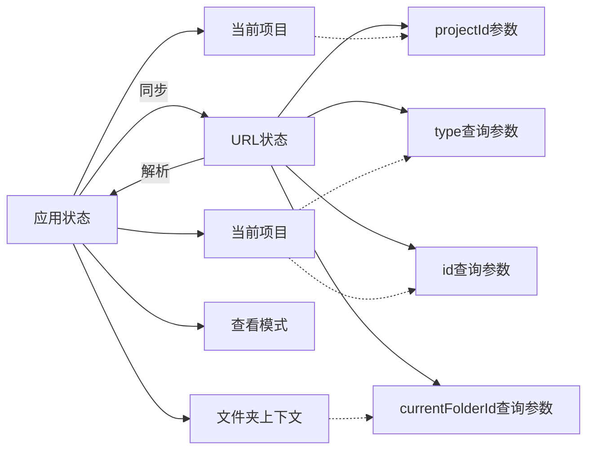

# Workbench 路由结构分析文档

## 概述

本文档分析 Flow360 Workbench 的路由配置、页面导航结构和路由守卫机制。

## 路由配置图

### 1. 主路由结构



**图表说明**: 这个路由结构图展现了 Workbench 在整个 Flow360 应用中的位置和内部路由设计：
- **主路由层级**: 从根路径分出workspaces、dashboard、examples和workbench四个主要模块
- **Workbench内部路由**: 包含项目主页面、预加载页面和失败重定向
- **查询参数控制**: 通过type、id、currentFolderId等参数控制工作台的具体显示模式
- **模式区分**: 蓝色表示主组件，橙色和紫色分别表示草稿编辑模式和案例查看模式
- 这种设计支持了灵活的页面状态管理和深度链接功能

### 2. 路由参数解析流程



### 3. 导航状态管理



**图表说明**: 这个导航状态管理图详细展示了路由激活后的状态转换流程：
- **初始化阶段**: 从路由初始化到参数提取，再到项目验证
- **错误处理**: 项目不存在时重定向到工作空间页面
- **模式判断**: 根据type参数决定进入草稿模式、案例模式或自动检测模式  
- **状态分化**: 不同模式进入相应的编辑或查看状态，支持多种操作类型
- **智能检测**: 无type参数时自动检测并选择合适的模式
- 这种状态机设计保证了路由处理的完整性和容错能力

## 路由相关组件

### 1. 路由配置文件

```typescript
// workbench.routes.ts
export const routes: Routes = [
  { path: ':projectId', component: WorkbenchComponent },
  { path: ':projectId/preload', component: WorkbenchPreloadComponent },
  {
    path: '**',
    redirectTo: '/workspaces',
  },
];
```

### 2. 路由参数处理



### 3. 导航操作流程



## 面包屑导航实现

### 1. 面包屑数据结构



### 2. 面包屑导航逻辑



## 路由守卫机制

### 1. 权限验证流程



### 2. 数据预加载机制



## URL 设计模式

### 1. RESTful 风格的URL结构

```
基础格式: /workbench/:projectId
查询参数: ?type=<ItemType>&id=<ItemId>&currentFolderId=<FolderId>

示例URLs:
- /workbench/proj_123                           # 项目默认视图
- /workbench/proj_123?type=Draft&id=draft_456   # 编辑草稿
- /workbench/proj_123?type=Case&id=case_789     # 查看案例
- /workbench/proj_123?currentFolderId=folder_abc # 指定文件夹上下文
```

### 2. URL状态同步



## 路由优化策略

### 1. 预加载策略
- **智能预加载**: 根据用户行为模式预加载可能访问的路由
- **数据预获取**: 在路由切换前预先获取必要数据
- **渐进式加载**: 优先加载关键数据，次要数据延迟加载

### 2. 缓存策略
- **路由级缓存**: 缓存路由解析结果
- **数据缓存**: 缓存API响应数据
- **状态保持**: 在路由切换时保持相关状态

### 3. 性能优化
- **懒加载**: 按需加载路由组件
- **代码分割**: 将大组件拆分为更小的块
- **预渲染**: 对静态内容进行预渲染

这种路由设计确保了良好的用户体验、清晰的URL结构和高效的页面导航。
