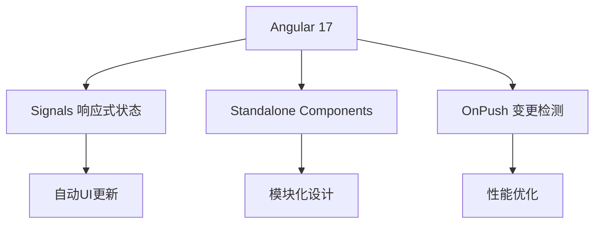
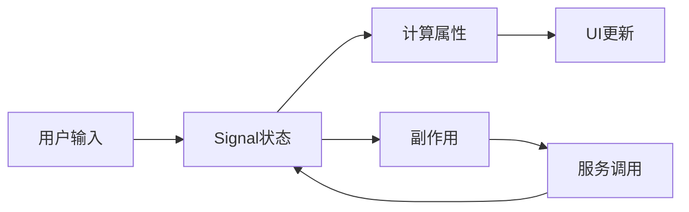
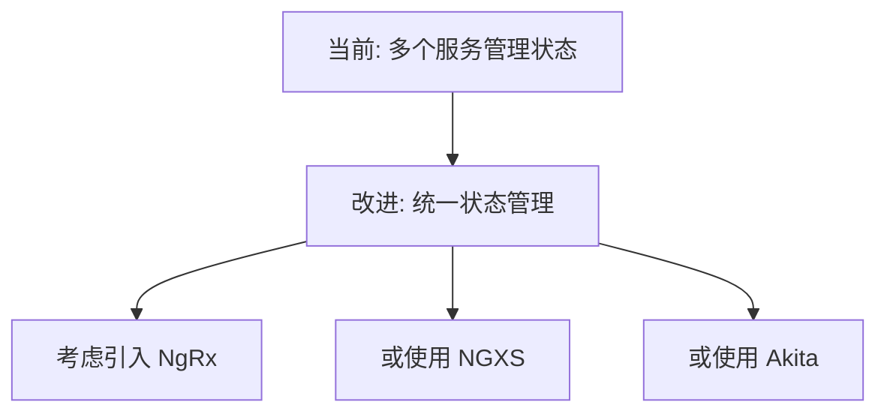

# Workbench 架构分析总结

## 文档概览

本系列文档从开发者角度全面分析了 Flow360 Workbench 的架构设计，包含以下四个方面：

1. **[组件架构关系](../01-component-architecture)** - 分析组件层次结构和依赖关系
2. **[服务依赖关系](../02-service-dependencies)** - 分析服务间的依赖和协作模式  
3. **[数据流向](../03-data-flow)** - 分析数据在系统中的流动模式
4. **[路由结构](../04-routing-structure)** - 分析路由配置和导航机制

## 核心架构特点

### 1. 现代化 Angular 架构


**图表说明**: 这个技术架构图展示了 Workbench 采用的现代化 Angular 17 特性及其带来的好处：
- **Angular 17 核心特性**: Signals响应式状态、Standalone组件、OnPush变更检测策略
- **架构优势**: 自动UI更新提升开发效率、模块化设计便于维护、性能优化提升用户体验
- 这些特性的组合使得应用具有更好的性能和开发体验

### 2. 分层架构设计
- **表现层**: Angular 组件，负责用户界面和交互
- **业务层**: 各种业务服务，处理核心业务逻辑
- **数据层**: HTTP服务、WebSocket服务等，负责数据获取
- **基础层**: 认证、工具类等基础功能服务

### 3. 响应式数据管理


**图表说明**: 这个响应式数据管理流程图展示了基于 Angular Signals 的数据流模式：
- **单向数据流**: 用户输入触发Signal状态更新，然后通过计算属性自动更新UI
- **副作用处理**: Signal变化触发Effect，调用服务进行业务处理，形成完整的数据循环
- **响应式特性**: 所有依赖Signal的组件和计算属性都会自动更新，无需手动管理
- 这种模式大大简化了状态管理，提高了应用的响应性和可维护性

## 主要技术栈

### 前端技术
- **Angular 17**: 主框架，使用最新的 Standalone 组件
- **Angular Signals**: 响应式状态管理
- **ng-zorro-antd**: UI组件库
- **Three.js**: 3D可视化渲染
- **RxJS**: 异步数据流处理
- **TypeScript**: 类型安全的开发语言

### 工程化工具
- **pnpm**: 包管理器
- **Webpack**: 模块打包
- **ESLint**: 代码质量检查
- **Formly**: 动态表单生成

## 架构优势

### 1. 可维护性
- **模块化设计**: 每个功能都有独立的组件和服务
- **清晰的分层**: 职责分离，便于理解和维护
- **类型安全**: TypeScript 提供编译时错误检查

### 2. 性能优化
- **OnPush策略**: 减少不必要的变更检测
- **信号系统**: 精确的状态更新，避免过度渲染
- **懒加载**: 按需加载组件和模块
- **缓存策略**: 数据缓存减少API调用

### 3. 用户体验
- **响应式设计**: 自动适应不同屏幕尺寸
- **实时更新**: WebSocket 保证数据同步
- **错误处理**: 完善的错误处理和用户反馈
- **加载状态**: 清晰的加载指示和进度反馈

### 4. 扩展性
- **服务注入**: 便于添加新功能和替换实现
- **组件复用**: 通用组件可以在多处使用
- **插件架构**: 支持功能扩展和定制

## 潜在改进点

### 1. 状态管理


**图表说明**: 这个状态管理改进建议图展示了当前架构的优化方向：
- **现状**: 当前使用多个服务分别管理不同的状态，虽然功能完整但管理分散
- **改进方向**: 考虑引入统一的状态管理库来集中管理应用状态
- **可选方案**: NgRx（官方推荐）、NGXS（简化版）、Akita（轻量级）等状态管理库
- 统一状态管理可以提供更好的可调试性、时间旅行功能和状态持久化能力

### 2. 代码组织
- **减少循环依赖**: 某些服务间存在循环依赖风险
- **接口抽象**: 增加接口层以提高可测试性
- **单一职责**: 某些服务职责过重，可以进一步拆分

### 3. 性能优化
- **虚拟滚动**: 对于大数据列表使用虚拟滚动
- **Web Workers**: 将复杂计算移到 Web Workers
- **Service Worker**: 添加离线支持和缓存策略

### 4. 测试覆盖
- **单元测试**: 增加服务和组件的单元测试
- **集成测试**: 添加端到端的集成测试
- **性能测试**: 监控和测试应用性能

## 开发最佳实践

### 1. 组件开发
```typescript
// 推荐的组件结构
@Component({
  selector: 'flow360-example',
  standalone: true,
  changeDetection: ChangeDetectionStrategy.OnPush,
  imports: [CommonModule, /* 其他依赖 */],
  template: `<!-- 模板 -->`,
})
export class ExampleComponent {
  // 使用 signals 进行状态管理
  private readonly state = signal(initialValue);
  readonly computedValue = computed(() => this.state().someProperty);
  
  constructor(private readonly service: ExampleService) {}
}
```

### 2. 服务开发
```typescript
// 推荐的服务结构
@Injectable({ providedIn: 'root' })
export class ExampleService {
  private readonly internalState = signal(initialValue);
  readonly publicState = this.internalState.asReadonly();
  
  constructor(private readonly http: HttpService) {}
  
  // 使用明确的方法名和返回类型
  updateState(newValue: StateType): void {
    this.internalState.set(newValue);
  }
}
```

### 3. 数据流设计
- **单向数据流**: 保持数据流向的一致性
- **不可变数据**: 使用不可变数据结构
- **错误边界**: 在适当的层级处理错误

## 总结

Flow360 Workbench 是一个架构良好的现代 Angular 应用，充分利用了 Angular 17 的新特性，特别是 Signals 系统。其分层架构、模块化设计和响应式数据管理为复杂的 CFD 仿真应用提供了solid的基础。

虽然存在一些可以改进的地方，但整体架构设计合理，代码组织清晰，为后续的功能扩展和维护奠定了良好的基础。开发者可以基于这个架构分析来理解系统设计思路，并在此基础上进行功能开发和优化。
