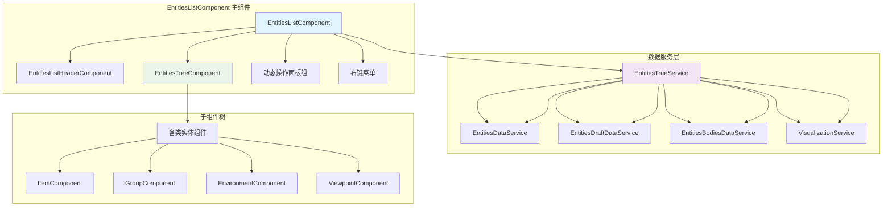
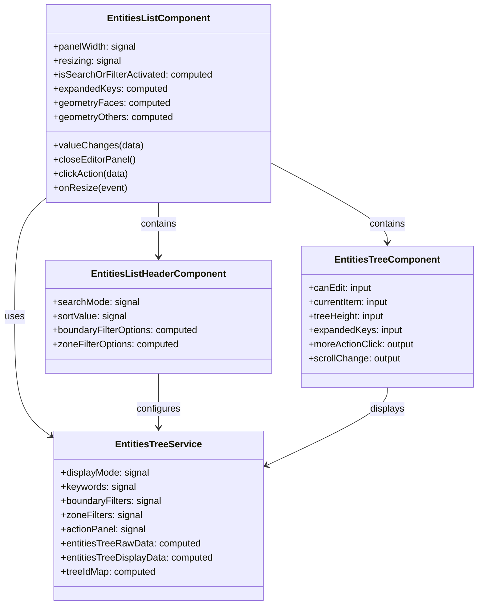
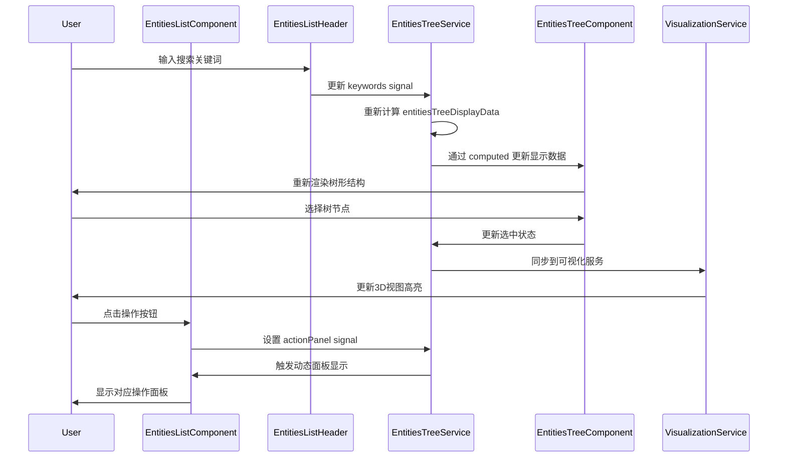
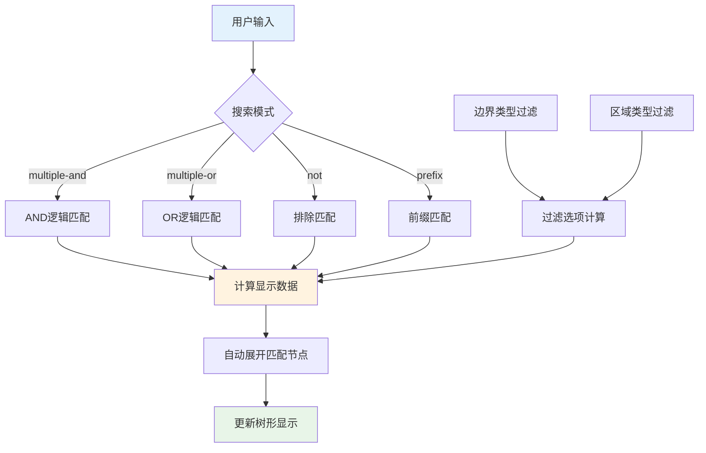
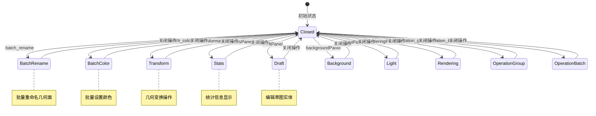
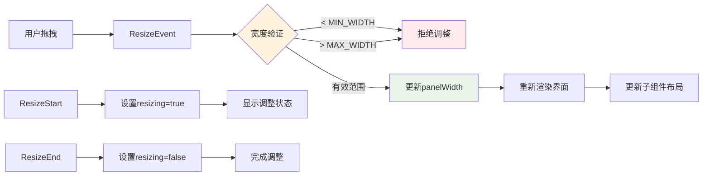
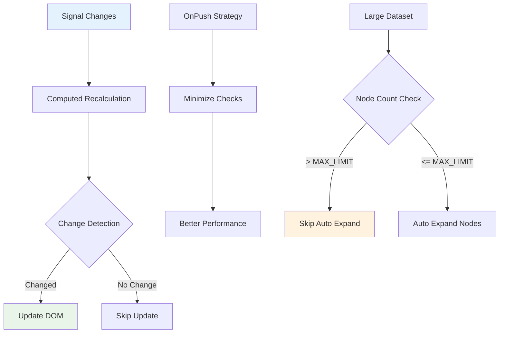
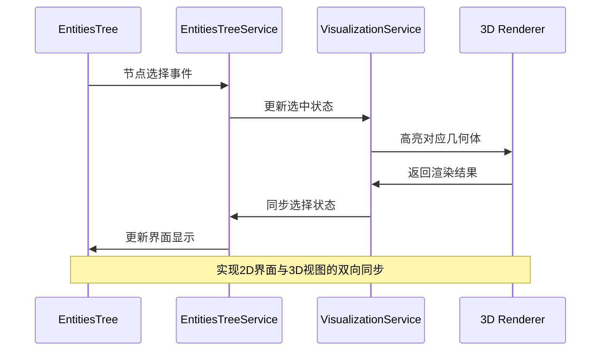
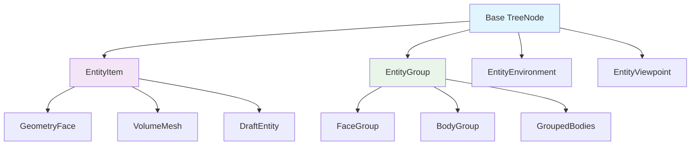
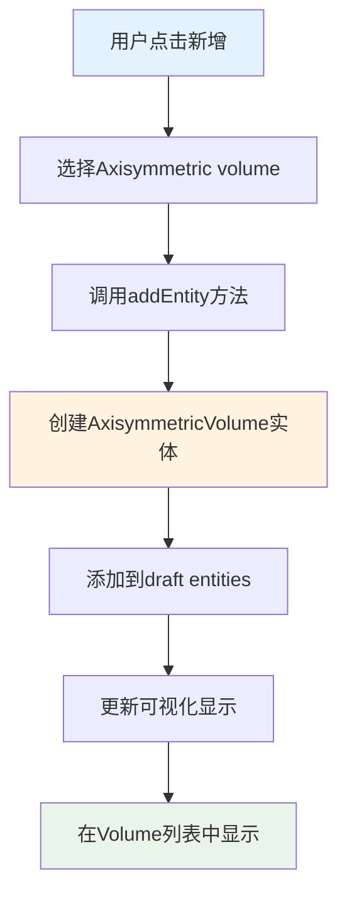

# Entities List 组件开发者文档

## 概述

`EntitiesListComponent` 是 Flow360 工作台中的核心组件，负责管理和展示三维几何体和网格的实体列表。它提供了一个可调整大小的侧边栏面板，支持多种显示模式、搜索过滤、批量操作等功能。

## 整体架构



这个架构图展示了 EntitiesListComponent 的整体结构。主组件作为容器，包含了头部控制区（搜索、过滤、排序）、核心的树形结构展示区，以及动态的操作面板。数据服务层提供了多个专门的服务来管理不同类型的实体数据，EntitiesTreeService 作为核心服务协调各种操作。子组件树负责渲染不同类型的实体节点。

## 核心组件结构



这个类图描述了主要组件类之间的关系。EntitiesListComponent 作为主控制器，依赖 EntitiesTreeService 进行状态管理，包含头部组件用于控制操作，包含树形组件用于数据展示。各组件通过信号（signals）和计算属性（computed）实现响应式数据流，确保界面与数据状态的同步。

## 数据流管理



这个序列图展示了用户交互如何在组件之间传递。当用户进行搜索时，数据从头部组件流向服务层，服务层重新计算显示数据，树形组件响应式更新。当用户选择节点时，状态同步到可视化服务以更新3D视图。操作面板的显示也是通过信号机制实现的响应式更新。

## 关键功能模块

### 1. 搜索与过滤系统



搜索与过滤系统支持多种匹配模式，用户可以通过关键词搜索、边界类型和区域类型进行复合过滤。系统会根据过滤条件动态计算显示数据，并自动展开匹配的节点以提升用户体验。当匹配节点数量超过阈值时，会跳过自动展开以保证性能。

### 2. 动态操作面板系统



动态操作面板系统通过状态机模式管理不同的操作面板。每个面板对应特定的功能，如批量重命名、颜色设置、几何变换等。系统确保同一时间只能打开一个操作面板，提供清晰的用户交互体验。

### 3. 可调整大小面板



可调整大小面板使用 angular-resizable-element 库实现。系统定义了最小宽度（290px）和最大宽度（620px）的限制，在调整过程中实时验证并更新面板宽度。调整状态通过信号管理，确保界面能够正确响应调整过程中的视觉反馈。

## 性能优化策略

### 1. 信号驱动的响应式更新



组件采用信号驱动的响应式架构，通过计算属性自动处理依赖更新，减少不必要的重新计算。当处理大量节点时（超过2000个），系统会跳过自动展开功能以维持良好的性能表现。

### 2. 虚拟滚动和延迟加载

组件实现了高度计算和滚动优化：

- 动态计算树形组件的最大高度
- 预留空间给3D立方体显示（143px）
- 根据窗口大小调整显示区域
- 通过scrollChange事件实现高效的滚动处理

## 集成接口

### 1. 与可视化服务的集成



实体列表与3D可视化视图紧密集成，实现了双向同步。用户在树形列表中的选择会实时反映到3D视图中，反之亦然。这种集成通过 VisualizationService 实现，确保用户交互的一致性。

### 2. 与工作台服务的集成

组件深度集成了工作台的各种服务：

- **WorkbenchService**: 管理整体工作台状态
- **EntitiesDataService**: 处理实体数据
- **EntitiesDraftDataService**: 管理草图数据
- **MaterialListService**: 材质管理
- **GeometryService**: 几何体处理

## 扩展性设计

### 1. 组件化架构



组件采用高度模块化的设计，每种实体类型都有对应的专门组件。这种设计使得添加新的实体类型变得简单，只需要实现对应的组件并注册到树形结构中即可。

### 2. 插件化操作面板

操作面板系统采用插件化设计，每个操作面板都是独立的组件。这使得：

- 新增操作类型时只需添加新的面板组件
- 各操作面板可以独立开发和测试
- 面板的显示逻辑通过统一的状态管理控制

## 最佳实践建议

### 1. 状态管理
- 使用信号（signals）而非传统的变更检测
- 通过计算属性（computed）处理派生状态
- 避免在模板中进行复杂计算

### 2. 性能优化
- 对大数据集实施限制策略
- 使用虚拟滚动处理长列表
- 实施适当的防抖和节流机制

### 3. 用户体验
- 提供清晰的加载状态反馈
- 实现直观的搜索和过滤功能
- 保持界面操作的一致性

### 4. 可维护性
- 保持组件职责单一
- 使用类型安全的接口定义
- 编写全面的单元测试

这个组件展示了现代 Angular 应用中复杂 UI 组件的最佳实践，通过信号驱动的响应式架构、模块化设计和性能优化策略，实现了一个功能丰富且高性能的实体管理界面。

## 新增功能实现 - Axisymmetric Volume

### 实现概述

我已经在 EntitiesListComponent 中成功添加了 **Axisymmetric volume** 新增功能。这个实现遵循了现有的架构模式，确保了代码的一致性和可维护性。

### 具体实现步骤



这个流程图展示了用户添加 Axisymmetric volume 的完整流程。用户点击新增按钮，选择 Axisymmetric volume 选项，系统创建对应的实体对象，添加到草图实体列表中，更新可视化显示，最终在Volume列表中展示新创建的轴对称体积。

### 代码修改详情

#### 1. 添加操作选项 (entities-tree.component.ts)
```typescript
actions: AddAction[] = [
  { title: 'Box', type: 'entities_box' },
  { title: 'Cylinder', type: 'entities_cylinder' },
  { title: 'Axisymmetric volume', type: 'entities_axisymmetric_volume' }, // 新增
];
```

#### 2. 扩展实体类型处理 (entities-tree.service.ts)
```typescript
// 在addEntity方法中添加新的case
case 'entities_axisymmetric_volume':
  newId = this.entitiesDraftDataService.addAxisymmetricVolume();
  break;

// 更新volumesList的类型识别逻辑
case 'AxisymmetricVolume':
  type = 'entities_axisymmetric_volume';
  title = 'Axisymmetric volume';
  break;
```

#### 3. 定义数据结构 (entities-draft-data.service.ts)
```typescript
export interface AxisymmetricVolume {
  private_attribute_entity_type_name: 'AxisymmetricVolume';
  private_attribute_registry_bucket_name: 'VolumetricEntityType';
  name: string;
  center?: { value?: [number, number, number]; units?: string };
  axis?: [number, number, number];
  inner_radius?: { value?: number; units?: string };
  outer_radius?: { value?: number; units?: string };
  height?: { value?: number; units?: string };
  private_attribute_id: string;
  _id?: string;
}
```

#### 4. 实现创建方法
```typescript
addAxisymmetricVolume() {
  const name = this.generateDefaultName('Axisymmetric volume');
  const obj: AxisymmetricVolume = {
    // 设置默认参数
    private_attribute_id: uuidv4(),
    name: name,
    private_attribute_registry_bucket_name: 'VolumetricEntityType',
    private_attribute_entity_type_name: 'AxisymmetricVolume',
    axis: [0, 0, 1],
    center: { value: [0, 0, 0], units: this.projectLengthUnits() },
    height: { value: 1, units: this.projectLengthUnits() },
    inner_radius: { value: 0, units: this.projectLengthUnits() },
    outer_radius: { value: 1, units: this.projectLengthUnits() },
  };
  this.draftEntities.set([...this.draftEntities(), obj]);
  this.addDraft(obj);
  return obj.private_attribute_id;
}
```

### 技术特性

#### 数据结构设计
- **类型安全**: 使用TypeScript接口定义确保类型安全
- **一致性**: 遵循现有Box和Cylinder的数据结构模式
- **扩展性**: 为后续功能扩展预留了接口

#### 可视化集成
- **3D渲染**: 复用Cylinder的渲染逻辑，在可视化层面表现为圆柱体
- **属性映射**: 将AxisymmetricVolume属性正确映射到CylinderProperties
- **状态同步**: 与现有的选择、隐藏、高亮等状态管理完全集成

#### 用户体验
- **直观操作**: 在Volume新增选项中添加"Axisymmetric volume"选项
- **默认参数**: 提供合理的默认几何参数（半径1，高度1，无内径）
- **命名规则**: 自动生成唯一的默认名称

### 扩展建议

虽然当前实现了基本的创建功能，但为了完善整个功能，建议后续考虑：

1. **专用编辑表单**: 为Axisymmetric volume创建专门的属性编辑界面
2. **独特的可视化**: 考虑为轴对称体积创建专门的3D表示方式
3. **验证逻辑**: 添加几何参数的合理性验证（如外径必须大于内径）
4. **计算功能**: 集成轴对称体积相关的CFD计算功能

### 测试验证

实现完成后，可以通过以下步骤验证功能：

1. 在Workbench界面打开Entities面板
2. 点击Volume组的新增按钮
3. 选择"Axisymmetric volume"选项
4. 确认新的轴对称体积出现在列表中
5. 验证在3D视图中正确显示
6. 测试选择、隐藏等基本操作功能

这个实现为Flow360平台的CFD仿真功能增加了重要的几何体类型支持，特别适用于旋转对称的流体动力学问题。
