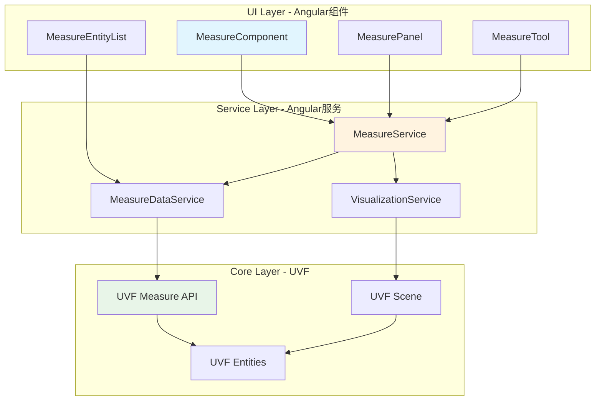
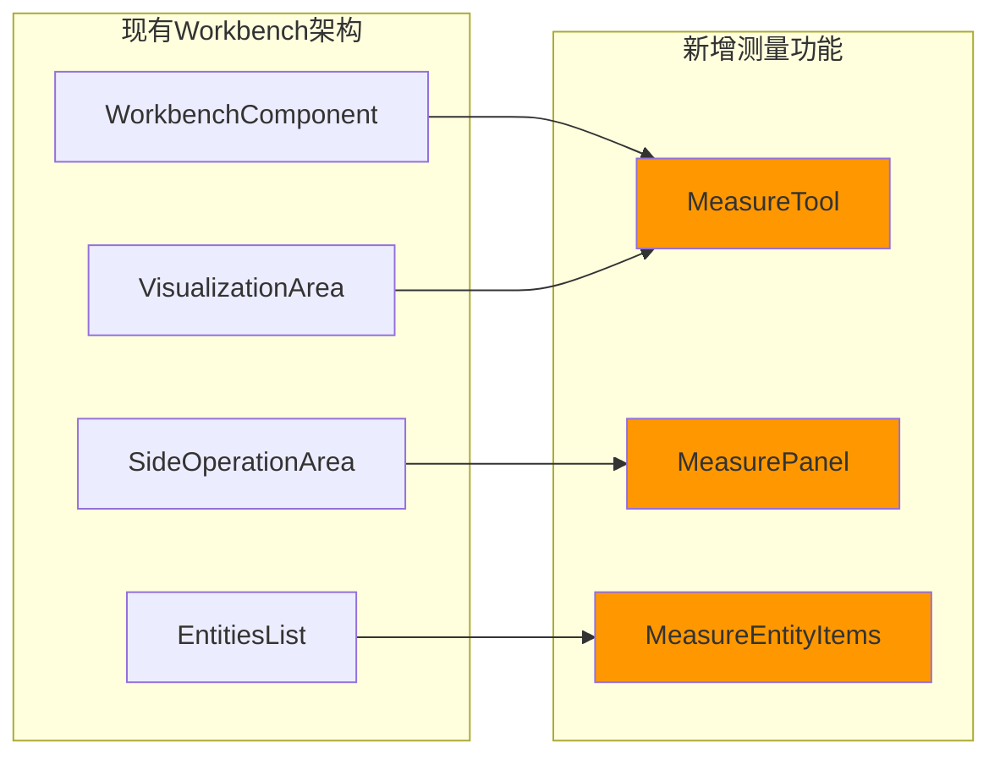
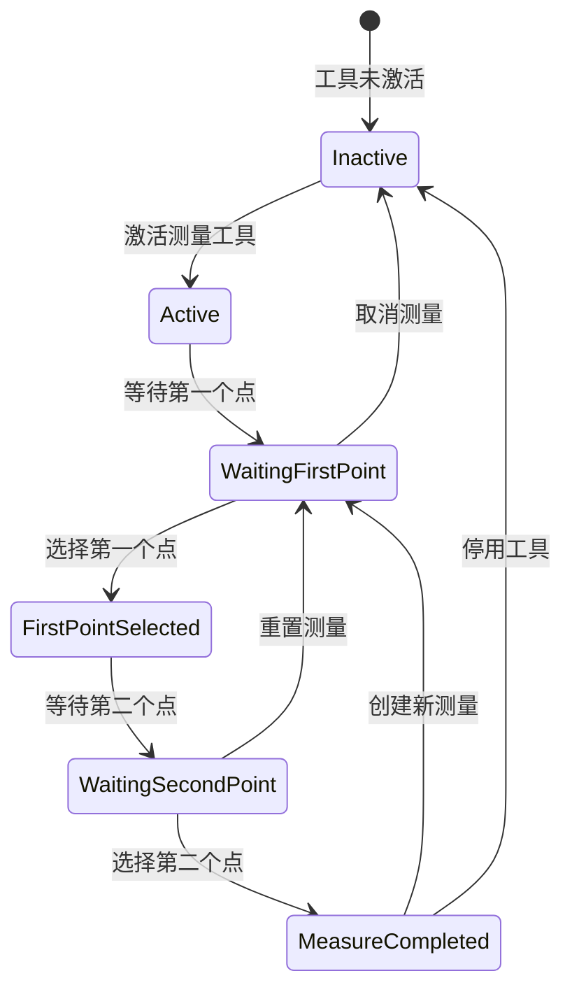
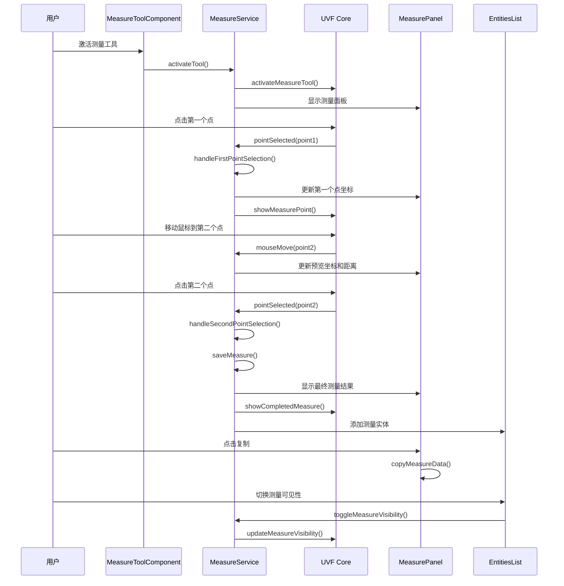
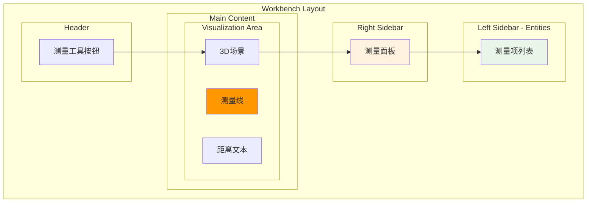
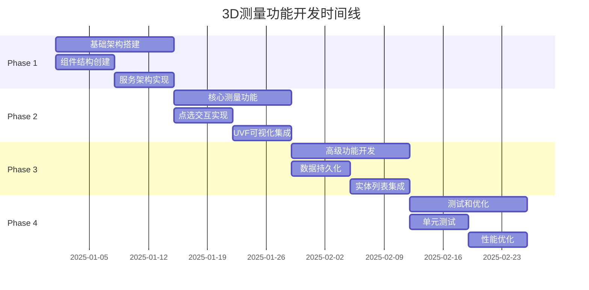
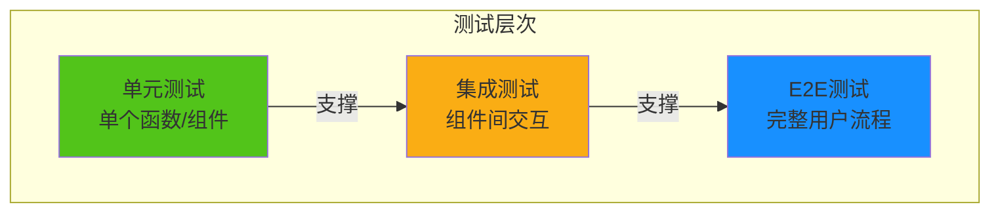
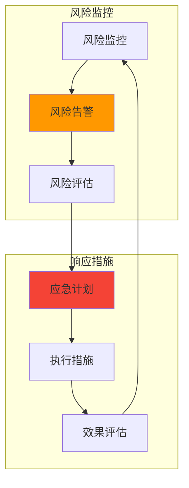

# 3D 测量功能技术设计文档 (TDD)

## 目录
1. [需求概述](#需求概述)
2. [系统架构设计](#系统架构设计)
3. [组件设计](#组件设计)
4. [数据流设计](#数据流设计)
5. [UI/UX设计](#uiux设计)
6. [技术实现细节](#技术实现细节)
7. [开发计划](#开发计划)
8. [测试策略](#测试策略)
9. [风险评估](#风险评估)

## 需求概述

### 功能描述
在Workbench的3D查看器中实现测量功能，允许用户测量两点之间的3D距离，并提供完整的空间关系分析能力。

### 用户故事
```
作为用户，我希望能够在3D查看器中测量两点之间的距离，
以便我能够分析几何体的空间关系和尺寸信息。
```

### 核心功能需求

#### 功能范围 (Scope)
- ✅ 在激活测量工具时可以点击3D查看器中的实体
- ✅ 点击第一个点时显示测量面板并捕捉到点
- ✅ 在面板中显示第一个点的X、Y、Z坐标
- ✅ 光标移动时显示第二个点的X、Y、Z坐标（未选中状态）
- ✅ 在面板中显示X距离、Y距离、Z距离和3D距离
- ✅ 在查看器中显示3D距离线符号和距离文本
- ✅ 面板中的值为只读
- ✅ 点击第二个点时显示完整的测量值
- ✅ 可以重置面板中的测量值
- ✅ 可以复制面板中的值
- ✅ 在查看模式和草稿模式下都可使用
- ✅ 可以存储测量结果并创建新的测量
- ✅ 在实体列表中存储测量结果
- ✅ 用户可以显示/隐藏、删除测量结果

### 非功能性需求
- **性能**: 测量操作响应时间 < 100ms
- **精度**: 坐标精度保持到小数点后6位
- **兼容性**: 支持View-only和Draft模式
- **可用性**: 直观的UI设计，符合现有Workbench设计规范

## 系统架构设计

### 架构概览



**架构说明**: 这个三层架构设计清晰地分离了职责：
- **UI层**: 处理用户交互和界面显示
- **Service层**: 管理业务逻辑和状态
- **Core层**: UVF提供底层测量能力

### 集成点分析

#### 与现有Workbench组件的集成



**集成说明**: 测量功能将无缝集成到现有的Workbench架构中：
- **WorkbenchComponent**: 管理测量工具的激活状态
- **VisualizationArea**: 承载测量工具的3D交互
- **EntitiesList**: 显示测量实体项
- **SideOperationArea**: 容纳测量面板

## 组件设计

### 1. MeasureToolComponent

#### 组件职责
- 管理测量工具的激活/停用状态
- 处理3D场景中的点击事件
- 协调测量流程的状态机

#### 组件接口
```typescript
@Component({
  selector: 'flow360-measure-tool',
  standalone: true,
  changeDetection: ChangeDetectionStrategy.OnPush
})
export class MeasureToolComponent {
  // Inputs
  @Input() active = signal(false);
  @Input() mode: 'view' | 'draft' = 'view';
  
  // Outputs  
  @Output() toolActivated = new EventEmitter<void>();
  @Output() toolDeactivated = new EventEmitter<void>();
  @Output() measureCompleted = new EventEmitter<MeasureResult>();
  
  // Public methods
  activateTool(): void
  deactivateTool(): void
  resetCurrentMeasure(): void
}
```

#### 状态管理



**状态说明**: 这个状态机确保了测量流程的清晰性和可控性：
- **Inactive**: 工具未激活，不响应3D场景点击
- **Active**: 工具激活，准备开始测量
- **WaitingFirstPoint**: 等待用户选择第一个测量点
- **FirstPointSelected**: 第一个点已选择，显示临时测量信息
- **WaitingSecondPoint**: 等待用户选择第二个测量点
- **MeasureCompleted**: 测量完成，显示最终结果

### 2. MeasurePanelComponent

#### 组件职责
- 显示测量结果和实时坐标信息
- 提供重置和复制功能
- 管理测量精度显示

#### 组件结构
```typescript
@Component({
  selector: 'flow360-measure-panel',
  standalone: true,
  template: `
    <nz-card nzTitle="测量" [nzExtra]="extraTemplate">
      <!-- 第一个点信息 -->
      <div class="measure-point">
        <h4>点 1</h4>
        <flow360-coordinate-display [point]="firstPoint()" />
      </div>
      
      <!-- 第二个点信息 -->
      <div class="measure-point">
        <h4>点 2 {{ isSecondPointSelected() ? '' : '(预览)' }}</h4>
        <flow360-coordinate-display [point]="secondPoint()" />
      </div>
      
      <!-- 距离信息 -->
      <div class="measure-distances">
        <flow360-distance-display [distances]="distances()" />
      </div>
      
      <!-- 操作按钮 -->
      <div class="measure-actions">
        <button nz-button (click)="reset()" [disabled]="!canReset()">
          重置
        </button>
        <button nz-button nzType="primary" (click)="copy()">
          复制
        </button>
      </div>
    </nz-card>
    
    <ng-template #extraTemplate>
      <button nz-button nzType="text" nzSize="small" (click)="close()">
        <span nz-icon nzType="close"></span>
      </button>
    </ng-template>
  `
})
export class MeasurePanelComponent {
  // 测量状态
  readonly firstPoint = signal<Point3D | null>(null);
  readonly secondPoint = signal<Point3D | null>(null);
  readonly isSecondPointSelected = signal(false);
  
  // 计算属性
  readonly distances = computed(() => {
    const p1 = this.firstPoint();
    const p2 = this.secondPoint();
    if (!p1 || !p2) return null;
    
    return {
      deltaX: Math.abs(p2.x - p1.x),
      deltaY: Math.abs(p2.y - p1.y), 
      deltaZ: Math.abs(p2.z - p1.z),
      distance3D: Math.sqrt(
        Math.pow(p2.x - p1.x, 2) + 
        Math.pow(p2.y - p1.y, 2) + 
        Math.pow(p2.z - p1.z, 2)
      )
    };
  });
}
```

### 3. CoordinateDisplayComponent

#### 组件职责  
- 格式化显示3D坐标
- 支持不同精度设置
- 提供单位转换功能

```typescript
@Component({
  selector: 'flow360-coordinate-display',
  standalone: true,
  template: `
    <div class="coordinate-display">
      <div class="coordinate-item">
        <span class="coordinate-label">X:</span>
        <span class="coordinate-value">{{ formatCoordinate(point()?.x) }}</span>
        <span class="coordinate-unit">{{ unit() }}</span>
      </div>
      <div class="coordinate-item">
        <span class="coordinate-label">Y:</span>
        <span class="coordinate-value">{{ formatCoordinate(point()?.y) }}</span>
        <span class="coordinate-unit">{{ unit() }}</span>
      </div>
      <div class="coordinate-item">
        <span class="coordinate-label">Z:</span>
        <span class="coordinate-value">{{ formatCoordinate(point()?.z) }}</span>
        <span class="coordinate-unit">{{ unit() }}</span>
      </div>
    </div>
  `
})
export class CoordinateDisplayComponent {
  @Input() point = signal<Point3D | null>(null);
  @Input() precision = signal(6);
  @Input() unit = signal('m');
  
  formatCoordinate(value?: number): string {
    if (value === undefined) return '--';
    return value.toFixed(this.precision());
  }
}
```

### 4. MeasureEntityListItemComponent

#### 组件职责
- 在实体列表中显示测量项
- 提供显示/隐藏、删除操作
- 支持测量结果的快速访问

```typescript
@Component({
  selector: 'flow360-measure-entity-item',
  standalone: true,
  template: `
    <div class="measure-entity-item" 
         [class.selected]="selected()"
         (click)="selectMeasure()">
      
      <div class="measure-icon">
        <span nz-icon nzType="fc:ruler" [style.color]="measure().color"></span>
      </div>
      
      <div class="measure-info">
        <div class="measure-name">{{ measure().name }}</div>
        <div class="measure-distance">{{ formatDistance(measure().distance3D) }}</div>
      </div>
      
      <div class="measure-actions">
        <button nz-button nzType="text" nzSize="small" 
                (click)="toggleVisibility($event)">
          <span nz-icon [nzType]="measure().visible ? 'eye' : 'eye-invisible'"></span>
        </button>
        <button nz-button nzType="text" nzSize="small" 
                (click)="deleteMeasure($event)"
                nz-popconfirm nzPopconfirmTitle="确定删除此测量？">
          <span nz-icon nzType="delete" nzTheme="outline"></span>
        </button>
      </div>
    </div>
  `
})
export class MeasureEntityListItemComponent {
  @Input() measure = signal<MeasureEntity>(null!);
  @Input() selected = signal(false);
  
  @Output() measureSelected = new EventEmitter<string>();
  @Output() visibilityToggled = new EventEmitter<{id: string, visible: boolean}>();
  @Output() measureDeleted = new EventEmitter<string>();
}
```

## 数据流设计

### 数据模型定义

```typescript
// 核心数据模型
export interface Point3D {
  x: number;
  y: number;
  z: number;
}

export interface MeasureDistance {
  deltaX: number;
  deltaY: number;
  deltaZ: number;
  distance3D: number;
}

export interface MeasureResult {
  id: string;
  name: string;
  firstPoint: Point3D;
  secondPoint: Point3D;
  distances: MeasureDistance;
  timestamp: Date;
  visible: boolean;
  color: string;
}

export interface MeasureEntity {
  id: string;
  name: string;
  type: 'measure';
  measureResult: MeasureResult;
  visible: boolean;
  selected: boolean;
}

// 测量状态
export type MeasureState = 
  | 'inactive'
  | 'waiting-first-point'
  | 'first-point-selected' 
  | 'waiting-second-point'
  | 'completed';

export interface MeasureToolState {
  state: MeasureState;
  currentMeasure: Partial<MeasureResult> | null;
  activeMeasures: MeasureResult[];
  selectedMeasureId: string | null;
}
```

### 服务层设计

#### MeasureService

```typescript
@Injectable({ providedIn: 'root' })
export class MeasureService {
  // 状态管理
  private readonly _state = signal<MeasureToolState>({
    state: 'inactive',
    currentMeasure: null,
    activeMeasures: [],
    selectedMeasureId: null
  });
  
  // 只读状态
  readonly state = this._state.asReadonly();
  
  // 计算属性
  readonly isActive = computed(() => this.state().state !== 'inactive');
  readonly currentMeasure = computed(() => this.state().currentMeasure);
  readonly activeMeasures = computed(() => this.state().activeMeasures);
  
  constructor(
    private uvfService: UvfService,
    private visualizationService: VisualizationService,
    private messageService: NzMessageService
  ) {
    // 监听UVF测量事件
    this.setupUvfMeasureListeners();
  }
  
  // 公共方法
  activateTool(): void {
    this.updateState({ state: 'waiting-first-point' });
    this.uvfService.activateMeasureTool();
  }
  
  deactivateTool(): void {
    this.updateState({ 
      state: 'inactive',
      currentMeasure: null 
    });
    this.uvfService.deactivateMeasureTool();
  }
  
  async handlePointSelection(point: Point3D): Promise<void> {
    const currentState = this.state();
    
    switch (currentState.state) {
      case 'waiting-first-point':
        this.handleFirstPointSelection(point);
        break;
      case 'waiting-second-point':
        await this.handleSecondPointSelection(point);
        break;
    }
  }
  
  resetCurrentMeasure(): void {
    this.updateState({
      state: 'waiting-first-point',
      currentMeasure: null
    });
    this.uvfService.clearTemporaryMeasure();
  }
  
  async saveMeasure(measure: MeasureResult): Promise<void> {
    const entity = this.createMeasureEntity(measure);
    await this.measureDataService.addMeasureEntity(entity);
    
    this.updateState({
      activeMeasures: [...this.state().activeMeasures, measure]
    });
  }
  
  private handleFirstPointSelection(point: Point3D): void {
    const measure: Partial<MeasureResult> = {
      id: this.generateMeasureId(),
      firstPoint: point,
      timestamp: new Date(),
      visible: true,
      color: this.getNextMeasureColor()
    };
    
    this.updateState({
      state: 'first-point-selected',
      currentMeasure: measure
    });
    
    // 通知UVF显示第一个点
    this.uvfService.showMeasurePoint(point, measure.color!);
  }
  
  private async handleSecondPointSelection(point: Point3D): Promise<void> {
    const currentMeasure = this.state().currentMeasure;
    if (!currentMeasure?.firstPoint) return;
    
    const completedMeasure: MeasureResult = {
      ...currentMeasure as MeasureResult,
      secondPoint: point,
      distances: this.calculateDistances(currentMeasure.firstPoint, point),
      name: this.generateMeasureName()
    };
    
    await this.saveMeasure(completedMeasure);
    
    this.updateState({
      state: 'completed',
      currentMeasure: completedMeasure
    });
    
    // 通知UVF显示完整测量
    this.uvfService.showCompletedMeasure(completedMeasure);
  }
}
```

### 数据流图



**数据流说明**: 这个时序图展示了完整的测量流程，从工具激活到结果保存的全过程：
- **激活阶段**: 用户激活工具，UI和UVF准备接收输入
- **第一点选择**: 用户点击产生第一个测量点，更新面板显示
- **预览阶段**: 鼠标移动时实时更新预览信息
- **完成测量**: 选择第二个点，计算并保存最终结果
- **结果管理**: 支持复制数据和控制可见性

## UI/UX设计

### 用户界面布局



**布局说明**: 测量功能无缝集成到现有Workbench布局中：
- **Header**: 测量工具激活按钮
- **3D场景**: 显示测量线和距离标注
- **右侧边栏**: 测量面板显示详细信息
- **左侧边栏**: 实体列表中显示测量项

### 交互设计

#### 测量工具激活流程
1. 用户点击工具栏中的测量按钮
2. 按钮高亮显示，3D场景准备接收点击
3. 鼠标悬浮时显示十字光标
4. 右侧显示测量面板

#### 点选交互
1. **第一个点选择**:
   - 点击3D场景中的任意位置
   - 显示第一个测量点（小圆点）
   - 面板显示第一个点的坐标
   
2. **第二个点预览**:
   - 鼠标移动时显示虚线连接
   - 实时更新第二个点坐标和距离信息
   - 距离信息为预览状态（半透明显示）

3. **第二个点确认**:
   - 点击确认第二个点
   - 显示实线测量线
   - 显示最终距离标注
   - 面板数据变为最终状态

### 视觉设计规范

#### 颜色方案
```less
// 测量相关颜色定义
@measure-primary-color: #1890ff;
@measure-success-color: #52c41a;
@measure-warning-color: #faad14;
@measure-error-color: #f5222d;

// 测量线颜色
@measure-line-color: @measure-primary-color;
@measure-line-preview-color: fade(@measure-primary-color, 50%);

// 测量点颜色
@measure-point-color: @measure-primary-color;
@measure-point-selected-color: @measure-success-color;

// 文本颜色
@measure-text-color: #333;
@measure-text-bg-color: rgba(255, 255, 255, 0.9);
```

#### 图标设计
- **测量工具图标**: `fc:ruler` - 标尺图标
- **测量点图标**: 小圆点，根据状态变色
- **测量线**: 实线（已完成）/ 虚线（预览中）
- **距离标注**: 带背景的文本标签

## 技术实现细节

### UVF集成接口

```typescript
// UVF测量API接口定义
export interface UvfMeasureAPI {
  // 激活/停用测量工具
  activateMeasureTool(): void;
  deactivateMeasureTool(): void;
  
  // 点选事件监听
  onPointSelected(callback: (point: Point3D) => void): void;
  onMouseMove(callback: (point: Point3D) => void): void;
  
  // 显示测量元素
  showMeasurePoint(point: Point3D, color: string): string; // 返回pointId
  showMeasureLine(point1: Point3D, point2: Point3D, color: string): string; // 返回lineId
  showMeasureText(position: Point3D, text: string, color: string): string; // 返回textId
  
  // 清除测量元素
  clearMeasureElement(elementId: string): void;
  clearAllMeasureElements(): void;
  
  // 更新测量元素
  updateMeasureElementVisibility(elementId: string, visible: boolean): void;
  updateMeasureElementColor(elementId: string, color: string): void;
  
  // 获取场景信息
  getSceneInfo(): SceneInfo;
  worldToScreen(point: Point3D): Point2D;
  screenToWorld(point: Point2D, depth: number): Point3D;
}
```

### Angular服务实现

```typescript
@Injectable({ providedIn: 'root' })
export class MeasureDataService {
  private readonly storageKey = 'workbench_measures';
  
  constructor(
    private entitiesDataService: EntitiesDataService,
    private storageService: StorageService
  ) {}
  
  async addMeasureEntity(measureEntity: MeasureEntity): Promise<void> {
    // 添加到实体数据服务
    await this.entitiesDataService.addEntity(measureEntity);
    
    // 保存到本地存储
    await this.saveMeasuresToStorage();
    
    // 触发实体列表更新
    this.entitiesDataService.refreshEntities();
  }
  
  async getMeasureEntities(): Promise<MeasureEntity[]> {
    const entities = await this.entitiesDataService.getEntitiesByType('measure');
    return entities as MeasureEntity[];
  }
  
  async updateMeasureEntity(id: string, updates: Partial<MeasureEntity>): Promise<void> {
    await this.entitiesDataService.updateEntity(id, updates);
    await this.saveMeasuresToStorage();
  }
  
  async deleteMeasureEntity(id: string): Promise<void> {
    await this.entitiesDataService.deleteEntity(id);
    await this.saveMeasuresToStorage();
  }
  
  private async saveMeasuresToStorage(): Promise<void> {
    const measures = await this.getMeasureEntities();
    await this.storageService.setItem(this.storageKey, measures);
  }
  
  async restoreMeasuresFromStorage(): Promise<void> {
    const measures = await this.storageService.getItem<MeasureEntity[]>(this.storageKey);
    if (measures?.length) {
      for (const measure of measures) {
        await this.entitiesDataService.addEntity(measure);
      }
    }
  }
}
```

### 工具栏集成

```typescript
// 在WorkbenchComponent中集成测量工具
@Component({
  selector: 'flow360-workbench',
  // ... 其他配置
})
export class WorkbenchComponent {
  // 测量工具状态
  readonly measureToolActive = signal(false);
  
  constructor(
    // ... 其他依赖
    private measureService: MeasureService
  ) {
    // 监听测量工具状态
    effect(() => {
      const isActive = this.measureService.isActive();
      this.measureToolActive.set(isActive);
    });
  }
  
  toggleMeasureTool(): void {
    if (this.measureToolActive()) {
      this.measureService.deactivateTool();
    } else {
      this.measureService.activateTool();
    }
  }
}
```

### 数据复制功能实现

```typescript
@Injectable({ providedIn: 'root' })
export class MeasureClipboardService {
  constructor(private clipboard: Clipboard) {}
  
  copyMeasureData(measure: MeasureResult): void {
    const data = this.formatMeasureDataForCopy(measure);
    
    this.clipboard.copy(data).then(
      () => {
        this.messageService.success('测量数据已复制到剪贴板');
      },
      (error) => {
        this.messageService.error('复制失败');
        console.error('Copy failed:', error);
      }
    );
  }
  
  private formatMeasureDataForCopy(measure: MeasureResult): string {
    const { firstPoint, secondPoint, distances } = measure;
    
    return `
测量结果: ${measure.name}
时间: ${measure.timestamp.toLocaleString()}

点 1 坐标:
  X: ${firstPoint.x.toFixed(6)}
  Y: ${firstPoint.y.toFixed(6)}
  Z: ${firstPoint.z.toFixed(6)}

点 2 坐标:
  X: ${secondPoint.x.toFixed(6)}
  Y: ${secondPoint.y.toFixed(6)}
  Z: ${secondPoint.z.toFixed(6)}

距离信息:
  X 距离: ${distances.deltaX.toFixed(6)}
  Y 距离: ${distances.deltaY.toFixed(6)}
  Z 距离: ${distances.deltaZ.toFixed(6)}
  3D 距离: ${distances.distance3D.toFixed(6)}
    `.trim();
  }
}
```

## 开发计划

### 阶段划分

#### Phase 1: 基础架构搭建 (第1-2周)

**目标**: 建立基本的组件结构和服务架构

**任务清单**:
- [ ] 创建基础组件结构
  - [ ] MeasureToolComponent
  - [ ] MeasurePanelComponent  
  - [ ] CoordinateDisplayComponent
  - [ ] DistanceDisplayComponent
- [ ] 实现核心服务
  - [ ] MeasureService基础框架
  - [ ] MeasureDataService
  - [ ] MeasureClipboardService
- [ ] 定义数据模型和接口
- [ ] 建立与UVF的基础连接

**验收标准**:
- ✅ 所有组件可以正常渲染
- ✅ 服务可以正常注入和初始化
- ✅ 基本的状态管理工作正常
- ✅ 可以激活/停用测量工具

#### Phase 2: 核心测量功能 (第3-4周)

**目标**: 实现完整的测量流程

**任务清单**:
- [ ] 实现点选交互
  - [ ] 第一个点选择和显示
  - [ ] 第二个点实时预览
  - [ ] 第二个点确认和完成
- [ ] 实现测量计算
  - [ ] 3D距离计算
  - [ ] 各轴向距离计算
  - [ ] 精度控制和格式化
- [ ] 实现UVF可视化
  - [ ] 测量点显示
  - [ ] 测量线绘制
  - [ ] 距离标注显示
- [ ] 实现测量面板
  - [ ] 实时坐标显示
  - [ ] 距离信息展示
  - [ ] 重置功能

**验收标准**:
- ✅ 可以完成完整的两点测量流程
- ✅ 测量结果准确无误
- ✅ 3D场景中正确显示测量元素
- ✅ 测量面板信息实时更新

#### Phase 3: 高级功能开发 (第5-6周)

**目标**: 实现测量结果管理和高级功能

**任务清单**:
- [ ] 实现数据持久化
  - [ ] 测量结果保存
  - [ ] 本地存储集成
  - [ ] 数据恢复机制
- [ ] 实现实体列表集成
  - [ ] MeasureEntityListItemComponent
  - [ ] 显示/隐藏功能
  - [ ] 删除功能
  - [ ] 选择和高亮
- [ ] 实现复制功能
  - [ ] 格式化输出
  - [ ] 剪贴板集成
  - [ ] 用户反馈
- [ ] 实现多测量管理
  - [ ] 创建新测量
  - [ ] 测量历史记录
  - [ ] 颜色管理

**验收标准**:
- ✅ 测量结果可以保存和恢复
- ✅ 在实体列表中正确显示测量项
- ✅ 可以复制测量数据到剪贴板
- ✅ 支持多个测量同时存在

#### Phase 4: 测试和优化 (第7-8周)

**目标**: 完善功能，优化性能，确保质量

**任务清单**:
- [ ] 单元测试
  - [ ] 服务层测试
  - [ ] 组件测试
  - [ ] 工具函数测试
- [ ] 集成测试
  - [ ] 端到端测量流程测试
  - [ ] UVF集成测试
  - [ ] 跨组件交互测试
- [ ] 性能优化
  - [ ] 内存泄漏检查
  - [ ] 渲染性能优化
  - [ ] 大量测量数据处理优化
- [ ] 用户体验优化
  - [ ] 错误处理完善
  - [ ] 加载状态优化
  - [ ] 响应性能优化

**验收标准**:
- ✅ 单元测试覆盖率 > 90%
- ✅ 所有集成测试通过
- ✅ 性能指标达到要求
- ✅ 用户体验流畅

### 开发时间线



### 资源需求

#### 人力资源
- **前端开发工程师**: 1人，8周全职
- **UVF集成工程师**: 0.5人，前4周支持
- **测试工程师**: 0.5人，后2周集中投入
- **UI/UX设计师**: 0.2人，前2周设计支持

#### 技术资源
- **开发环境**: Angular 17 + TypeScript
- **UI组件库**: ng-zorro-antd
- **3D引擎**: UVF (现有)
- **测试框架**: Jasmine + Karma + Playwright
- **CI/CD**: 现有流水线

## 测试策略

### 测试金字塔



### 单元测试策略

#### 服务测试
```typescript
describe('MeasureService', () => {
  let service: MeasureService;
  let uvfService: jasmine.SpyObj<UvfService>;
  
  beforeEach(() => {
    const uvfSpy = jasmine.createSpyObj('UvfService', [
      'activateMeasureTool',
      'deactivateMeasureTool',
      'showMeasurePoint'
    ]);
    
    TestBed.configureTestingModule({
      providers: [
        { provide: UvfService, useValue: uvfSpy }
      ]
    });
    
    service = TestBed.inject(MeasureService);
    uvfService = TestBed.inject(UvfService) as jasmine.SpyObj<UvfService>;
  });
  
  it('should activate measure tool', () => {
    service.activateTool();
    
    expect(service.isActive()).toBe(true);
    expect(uvfService.activateMeasureTool).toHaveBeenCalled();
  });
  
  it('should handle first point selection', async () => {
    const point: Point3D = { x: 1, y: 2, z: 3 };
    
    service.activateTool();
    await service.handlePointSelection(point);
    
    const currentMeasure = service.currentMeasure();
    expect(currentMeasure?.firstPoint).toEqual(point);
    expect(service.state().state).toBe('first-point-selected');
  });
  
  it('should calculate distances correctly', () => {
    const point1: Point3D = { x: 0, y: 0, z: 0 };
    const point2: Point3D = { x: 3, y: 4, z: 0 };
    
    const distances = service.calculateDistances(point1, point2);
    
    expect(distances.deltaX).toBe(3);
    expect(distances.deltaY).toBe(4);
    expect(distances.deltaZ).toBe(0);
    expect(distances.distance3D).toBe(5); // 3-4-5 triangle
  });
});
```

#### 组件测试
```typescript
describe('MeasurePanelComponent', () => {
  let component: MeasurePanelComponent;
  let fixture: ComponentFixture<MeasurePanelComponent>;
  
  beforeEach(() => {
    TestBed.configureTestingModule({
      imports: [MeasurePanelComponent]
    });
    
    fixture = TestBed.createComponent(MeasurePanelComponent);
    component = fixture.componentInstance;
  });
  
  it('should display first point coordinates', () => {
    const point: Point3D = { x: 1.123456, y: 2.789012, z: 3.456789 };
    component.firstPoint.set(point);
    fixture.detectChanges();
    
    const coordinateElements = fixture.debugElement.queryAll(
      By.css('.coordinate-value')
    );
    
    expect(coordinateElements[0].nativeElement.textContent).toContain('1.123456');
    expect(coordinateElements[1].nativeElement.textContent).toContain('2.789012');
    expect(coordinateElements[2].nativeElement.textContent).toContain('3.456789');
  });
  
  it('should copy measure data when copy button clicked', () => {
    spyOn(component, 'copy');
    
    const copyButton = fixture.debugElement.query(By.css('button[nz-button]'));
    copyButton.nativeElement.click();
    
    expect(component.copy).toHaveBeenCalled();
  });
});
```

### 集成测试策略

```typescript
describe('Measure Feature Integration', () => {
  let measureService: MeasureService;
  let uvfService: UvfService;
  let fixture: ComponentFixture<WorkbenchComponent>;
  
  beforeEach(() => {
    // 设置完整的测试环境
    TestBed.configureTestingModule({
      imports: [WorkbenchComponent, MeasureToolComponent, MeasurePanelComponent],
      providers: [MeasureService, UvfService]
    });
    
    fixture = TestBed.createComponent(WorkbenchComponent);
    measureService = TestBed.inject(MeasureService);
    uvfService = TestBed.inject(UvfService);
  });
  
  it('should complete full measure workflow', async () => {
    // 激活测量工具
    const toolButton = fixture.debugElement.query(By.css('[data-test="measure-tool-btn"]'));
    toolButton.nativeElement.click();
    
    expect(measureService.isActive()).toBe(true);
    
    // 选择第一个点
    const firstPoint: Point3D = { x: 0, y: 0, z: 0 };
    await measureService.handlePointSelection(firstPoint);
    
    expect(measureService.state().state).toBe('first-point-selected');
    
    // 选择第二个点
    const secondPoint: Point3D = { x: 1, y: 1, z: 1 };
    await measureService.handlePointSelection(secondPoint);
    
    expect(measureService.state().state).toBe('completed');
    expect(measureService.activeMeasures().length).toBe(1);
  });
});
```

### E2E测试策略

```typescript
// e2e/measure.e2e-spec.ts
describe('3D Measure Feature', () => {
  beforeEach(async () => {
    await page.goto('/workbench/test-project');
    await page.waitForSelector('[data-test="visualization-container"]');
  });
  
  it('should allow user to measure distance between two points', async () => {
    // 激活测量工具
    await page.click('[data-test="measure-tool-btn"]');
    await expect(page.locator('[data-test="measure-panel"]')).toBeVisible();
    
    // 点击第一个点
    await page.click('[data-test="visualization-container"]', { 
      position: { x: 100, y: 100 } 
    });
    
    // 验证第一个点信息显示
    await expect(page.locator('[data-test="first-point-x"]')).toContainText(/\d+\.\d+/);
    
    // 点击第二个点
    await page.click('[data-test="visualization-container"]', { 
      position: { x: 200, y: 200 } 
    });
    
    // 验证距离计算结果
    await expect(page.locator('[data-test="distance-3d"]')).toContainText(/\d+\.\d+/);
    
    // 验证测量项出现在实体列表中
    await expect(page.locator('[data-test="measure-entity-item"]')).toBeVisible();
  });
  
  it('should allow user to copy measure data', async () => {
    // ... 完成一次测量
    
    // 点击复制按钮
    await page.click('[data-test="copy-measure-btn"]');
    
    // 验证成功提示
    await expect(page.locator('.ant-message-success')).toBeVisible();
  });
});
```

## 风险评估

### 技术风险

#### 1. UVF集成复杂性 - 🔴 高风险
**风险描述**: UVF API可能不够稳定或文档不全，导致集成困难

**影响评估**: 可能导致开发延期2-3周

**缓解策略**:
- 提前与UVF团队对接，确认API稳定性
- 建立UVF集成的抽象层，便于适配API变化
- 准备fallback方案，使用Three.js直接实现基础功能

**应急预案**:
- 如果UVF API不可用，使用Three.js原生实现
- 预留额外2周开发时间用于处理集成问题

#### 2. 性能问题 - 🟡 中等风险
**风险描述**: 大量测量数据可能影响3D场景渲染性能

**影响评估**: 用户体验下降，可能需要性能优化

**缓解策略**:
- 实现测量对象的LOD (Level of Detail) 管理
- 使用虚拟化技术管理大量测量项
- 实现测量对象的自动隐藏机制

#### 3. 精度问题 - 🟡 中等风险
**风险描述**: 浮点数计算精度可能影响测量准确性

**影响评估**: 测量结果不准确，用户投诉

**缓解策略**:
- 使用高精度数学库
- 实现适当的数值舍入策略
- 提供精度设置选项

### 业务风险

#### 1. 用户体验不佳 - 🟡 中等风险
**风险描述**: 测量工具操作复杂，用户学习成本高

**影响评估**: 功能采用率低，用户满意度下降

**缓解策略**:
- 进行用户研究，优化交互设计
- 提供清晰的操作指引和帮助文档
- 实现渐进式功能引导

#### 2. 功能范围蔓延 - 🟡 中等风险
**风险描述**: 开发过程中可能出现需求变更和功能扩展

**影响评估**: 开发周期延长，资源消耗增加

**缓解策略**:
- 明确MVP (最小可行产品) 范围
- 建立需求变更评审机制
- 预留10%的缓冲时间

### 依赖风险

#### 1. 第三方库依赖 - 🟢 低风险
**风险描述**: ng-zorro-antd等第三方库版本兼容性问题

**影响评估**: 部分UI组件不可用

**缓解策略**:
- 使用稳定版本的第三方库
- 做好版本锁定和兼容性测试

### 风险监控和响应



**风险监控说明**: 建立完整的风险监控和响应机制：
- **持续监控**: 定期评估技术和业务风险
- **预警机制**: 及时发现和报告风险事件
- **快速响应**: 制定详细的应急预案
- **效果评估**: 跟踪风险缓解措施的有效性

---

## 总结

本技术设计文档为3D测量功能提供了全面的技术方案，包括：

1. **清晰的架构设计** - 三层架构确保职责分离
2. **详细的组件设计** - 模块化设计便于开发和维护  
3. **完整的数据流设计** - 响应式数据管理确保状态一致性
4. **全面的测试策略** - 多层次测试确保质量
5. **现实的开发计划** - 8周分阶段交付
6. **充分的风险评估** - 识别并制定缓解策略

通过遵循这个技术设计文档，开发团队可以高质量、按时交付3D测量功能，为用户提供优秀的空间分析工具。
