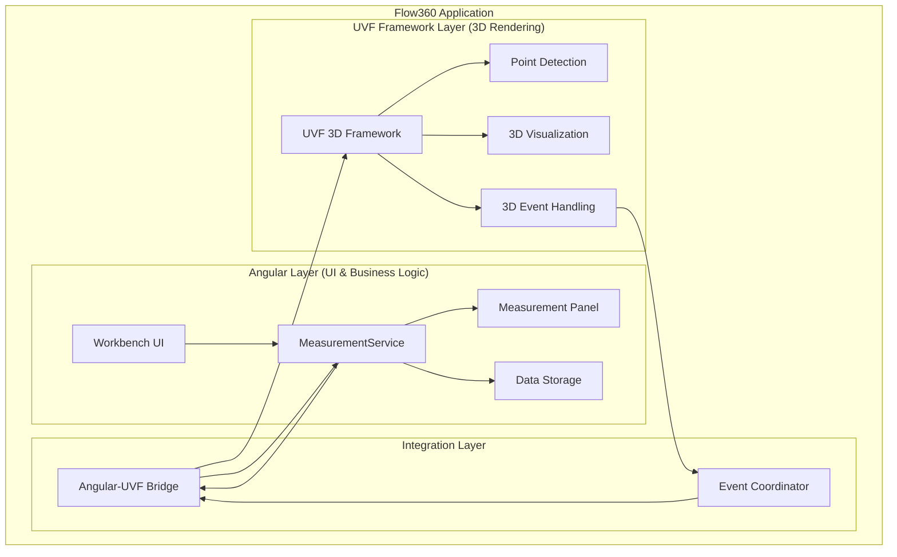
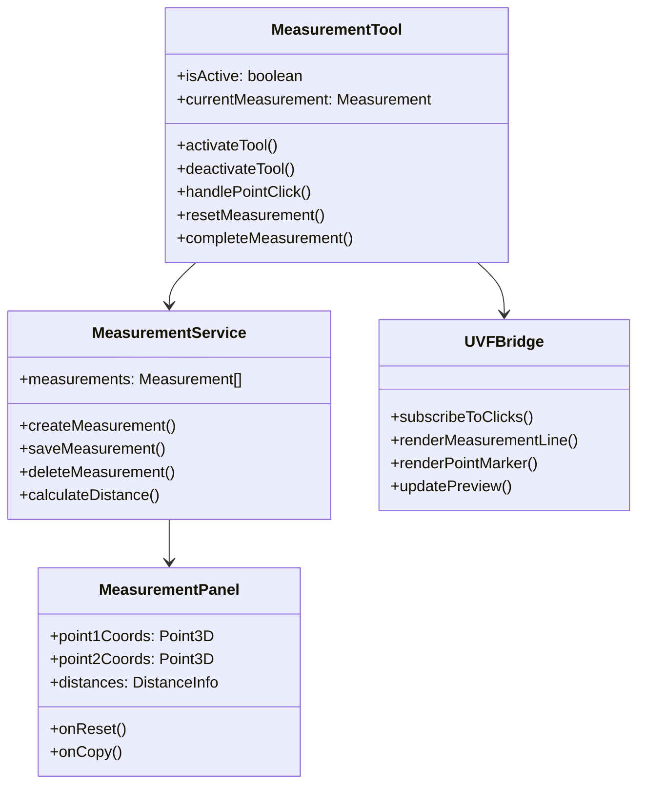
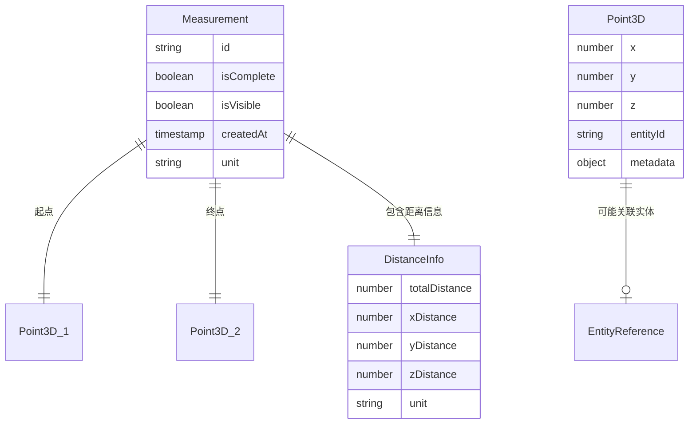
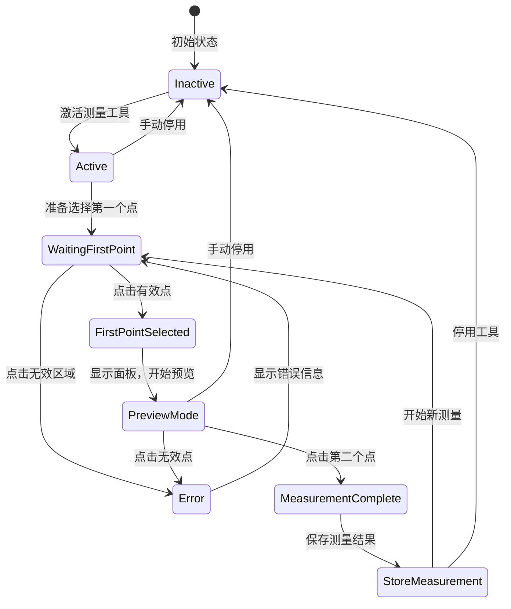

# 3D Measurement Tool - Technical Design Document

## 1. 项目概述

### 1.1 目标
实现3D距离测量工具，用户通过选择两点测量空间距离。

### 1.2 核心功能
- 两点距离测量
- 实时预览与结果显示  
- 测量数据管理（存储/删除/显示控制）
- View/Draft模式兼容

## 2. 技术架构设计

### 2.1 当前实现架构

### 2.2 职责分离

#### Angular层
- UI组件、业务逻辑、数据管理、用户交互

#### UVF框架层
- 3D渲染、点击检测、空间计算、视觉反馈

#### 集成层
- 事件桥接、数据转换、状态同步

### 2.3 当前测量工具设计

## 3. 数据模型设计

### 3.1 核心数据结构

### 3.2 主要接口

#### Point3D
- x, y, z: number (世界坐标)
- entityId?: string (实体关联)  
- metadata?: object (附加信息)

#### Measurement
- id: string
- isComplete: boolean
- isVisible: boolean
- createdAt: timestamp
- point1: Point3D
- point2: Point3D
- distances: DistanceInfo

#### DistanceInfo
- totalDistance: number
- xDistance, yDistance, zDistance: number
- unit: string
## 4. 功能流程设计

### 4.1 测量工具状态流程

### 4.2 核心模块

#### 工具生命周期
- 激活/停用、状态切换、事件监听管理

#### 点击检测
- 射线投射、实体验证、坐标转换

#### 测量计算
- 距离算法、分量计算、单位转换、精度控制

#### 可视化渲染
- 点标记、测量线、距离标签、实时预览

## 5. UI设计

### 5.1 测量面板
- 面板标题 + 关闭按钮
- 起点/终点坐标显示 
- X/Y/Z方向距离 + 3D总距离
- 重置/复制按钮

### 5.2 界面特性
- 右侧固定位置、响应式布局、实时更新、只读数据

### 5.3 工具栏集成
- 测量按钮、激活状态反馈、快捷键支持

## 6. 集成策略

### 6.1 Angular-UVF集成
- 事件通信：UVF事件 → Angular服务
- 数据转换：Angular状态 ↔ UVF场景状态
- API适配：Angular通过Bridge调用UVF API

### 6.2 数据存储
- 实体列表：集成到现有Entity系统
- 操作支持：显示/隐藏/删除/重命名

## 7. 未来扩展（当前不实现）

### 7.1 扩展工具类型
- 角度测量、面积计算、体积计算
- 智能吸附、批量操作、协作功能

### 7.2 扩展架构预留
- 通用点选择框架BasePointSelector
- 工具注册系统、插件系统

## 8. 总结

### 8.1 当前阶段重点
实现距离测量工具，职责分离（Angular-UI，UVF-3D），为扩展奠定基础。

### 8.2 成功标准
- 直观的两点选择交互
- 实时准确的距离计算
- 多测量实例管理
- 与现有系统无缝集成

