# 技术设计文档：交互操作框架

## 1. 概述

UVF（统一可视化框架）需要支持像测量这样的交互操作，这需要选择多个点或对象。本文档概述了一个灵活和可扩展的交互操作框架的设计。

## 架构流程图

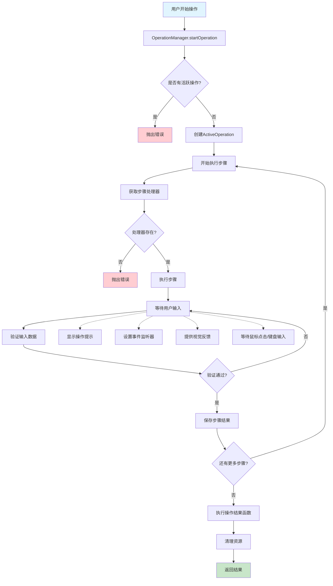

## 分层架构设计

### 概念说明

**InteractiveOperation** vs **ActiveOperation**:
- `InteractiveOperation`: 操作的**定义/配方** - 描述要做什么，需要哪些步骤
- `ActiveOperation`: 操作的**执行实例** - 记录当前正在执行的操作状态，在第几步等

类比：
- `InteractiveOperation` = 食谱（材料清单、制作步骤）
- `ActiveOperation` = 正在做饭的过程（当前做到第几步、用了什么材料）

### 第一层：UVF核心框架 (框架开发者需要实现)

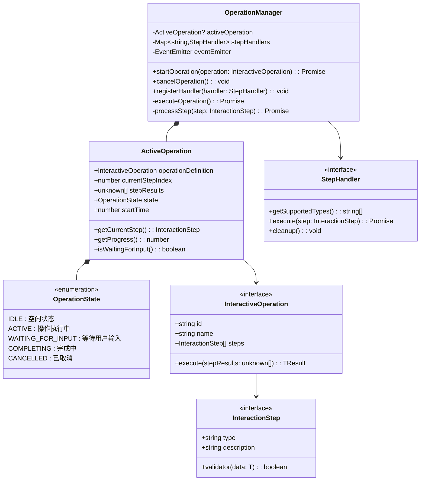

### 第二层：基础交互类型 (UVF提Supply，可选择使用)

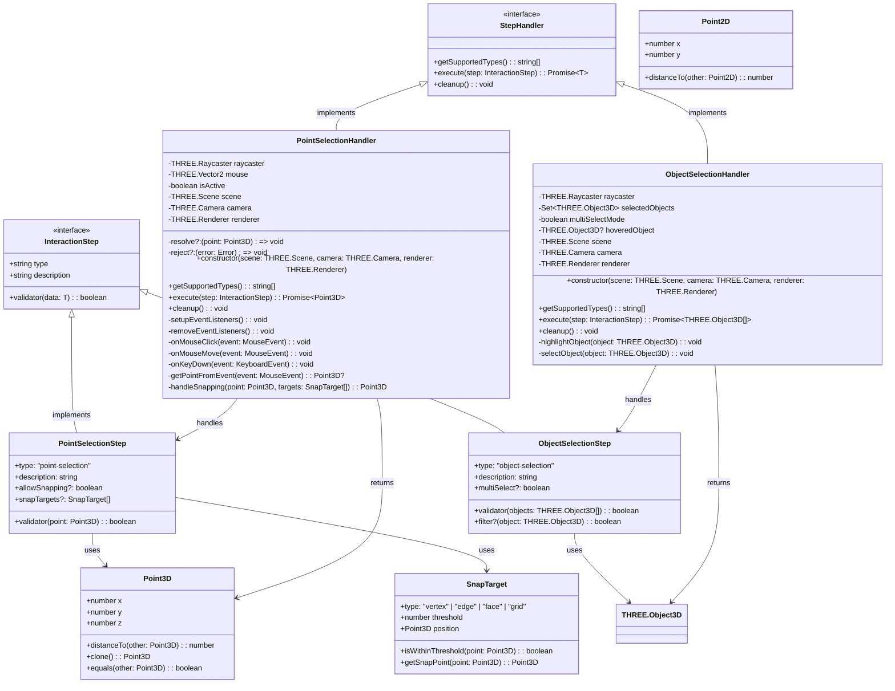

### 接口实现详解

#### StepHandler接口定义 (第一层提供)

```typescript
interface StepHandler<T = unknown> {
  // 返回此处理器支持的步骤类型
  getSupportedTypes(): string[];
  
  // 执行交互步骤，返回用户输入的结果
  execute(step: InteractionStep<T>): Promise<T>;
  
  // 清理资源，取消事件监听等
  cleanup(): void;
}
```

#### PointSelectionHandler的完整实现

```typescript
export class PointSelectionHandler implements StepHandler<Point3D> {
  private raycaster = new THREE.Raycaster();
  private mouse = new THREE.Vector2();
  private isActive = false;
  private resolve?: (point: Point3D) => void;
  private reject?: (error: Error) => void;

  constructor(
    private scene: THREE.Scene,
    private camera: THREE.Camera,
    private renderer: THREE.Renderer
  ) {}

  // 🎯 实现StepHandler接口方法1：声明支持的步骤类型
  getSupportedTypes(): string[] {
    return ['point-selection'];
  }

  // 🎯 实现StepHandler接口方法2：执行步骤
  async execute(step: InteractionStep): Promise<Point3D> {
    // 类型检查和转换
    if (step.type !== 'point-selection') {
      throw new Error(`不支持的步骤类型: ${step.type}`);
    }
    
    const pointStep = step as PointSelectionStep;
    
    return new Promise<Point3D>((resolve, reject) => {
      this.resolve = resolve;
      this.reject = reject;
      this.isActive = true;
      
      this.setupEventListeners();
      this.showInstructions(pointStep.description);
    });
  }

  // 🎯 实现StepHandler接口方法3：清理资源
  cleanup(): void {
    this.isActive = false;
    this.removeEventListeners();
    this.hideInstructions();
    this.resolve = undefined;
    this.reject = undefined;
  }

  // 私有方法实现具体逻辑
  private setupEventListeners(): void {
    this.renderer.domElement.addEventListener('click', this.onMouseClick);
    this.renderer.domElement.addEventListener('mousemove', this.onMouseMove);
    document.addEventListener('keydown', this.onKeyDown);
  }

  private onMouseClick = (event: MouseEvent): void => {
    if (!this.isActive || !this.resolve) return;

    const point = this.getPointFromEvent(event);
    if (point) {
      this.resolve(point);
      this.cleanup();
    }
  };

  // ... 其他私有方法
}
```

#### ObjectSelectionHandler的实现

```typescript
export class ObjectSelectionHandler implements StepHandler<THREE.Object3D[]> {
  private selectedObjects = new Set<THREE.Object3D>();
  
  constructor(
    private scene: THREE.Scene,
    private camera: THREE.Camera,
    private renderer: THREE.Renderer
  ) {}

  // 🎯 实现接口：支持对象选择类型
  getSupportedTypes(): string[] {
    return ['object-selection'];
  }

  // 🎯 实现接口：执行对象选择
  async execute(step: InteractionStep): Promise<THREE.Object3D[]> {
    const objectStep = step as ObjectSelectionStep;
    
    return new Promise<THREE.Object3D[]>((resolve, reject) => {
      // 设置对象选择逻辑
      this.setupObjectSelection(objectStep, resolve, reject);
    });
  }

  // 🎯 实现接口：清理资源
  cleanup(): void {
    this.selectedObjects.clear();
    this.removeEventListeners();
    this.clearHighlights();
  }

  private setupObjectSelection(
    step: ObjectSelectionStep, 
    resolve: (objects: THREE.Object3D[]) => void,
    reject: (error: Error) => void
  ): void {
    // 具体的对象选择实现逻辑
  }
}
```

#### 处理器注册和使用

```typescript
// UVF框架初始化时注册所有基础处理器
class UVFFramework {
  private operationManager: OperationManager;

  constructor(scene: THREE.Scene, camera: THREE.Camera, renderer: THREE.Renderer) {
    this.operationManager = new OperationManager(scene, camera, renderer);
    
    // 注册UVF提供的基础处理器
    this.registerBuiltinHandlers(scene, camera, renderer);
  }

  private registerBuiltinHandlers(
    scene: THREE.Scene, 
    camera: THREE.Camera, 
    renderer: THREE.Renderer
  ): void {
    // 注册点选择处理器
    const pointHandler = new PointSelectionHandler(scene, camera, renderer);
    this.operationManager.registerHandler(pointHandler);

    // 注册对象选择处理器
    const objectHandler = new ObjectSelectionHandler(scene, camera, renderer);
    this.operationManager.registerHandler(objectHandler);

  }

  getOperationManager(): OperationManager {
    return this.operationManager;
  }
}

// 使用方式
const uvf = new UVFFramework(scene, camera, renderer);
const operationManager = uvf.getOperationManager();

// 现在可以使用任何已注册的交互类型
const measureOperation = {
  steps: [
    { type: 'point-selection', description: '选择第一个点' },  // PointSelectionHandler处理
    { type: 'point-selection', description: '选择第二个点' }   // PointSelectionHandler处理
  ],
  execute: ([p1, p2]) => ({ distance: p1.distanceTo(p2) })
};
```

### 第三层：具体应用实现 (业务开发者实现)

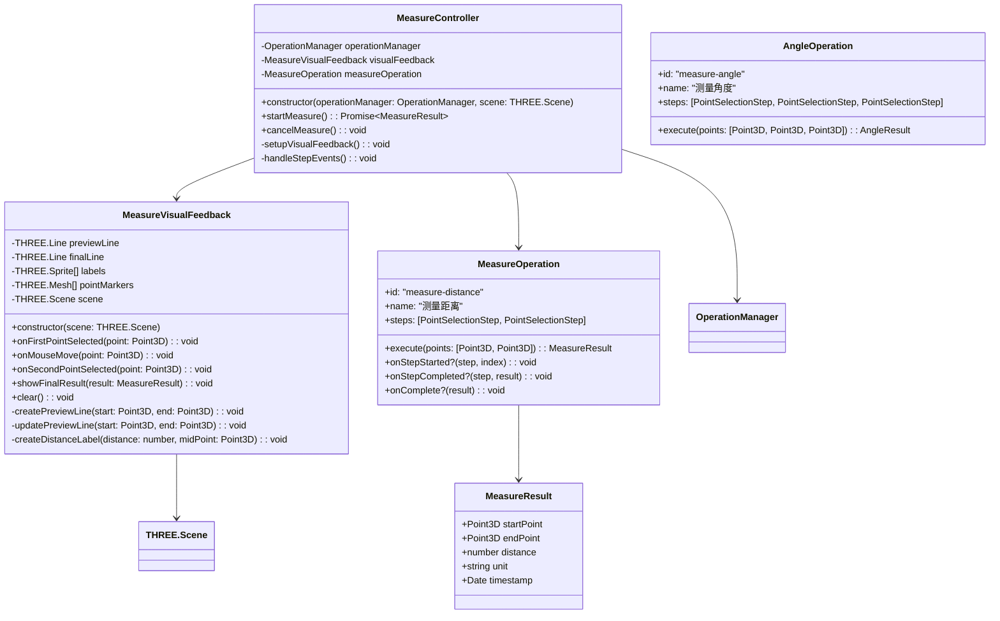

### MeasureVisualFeedback的集成流程

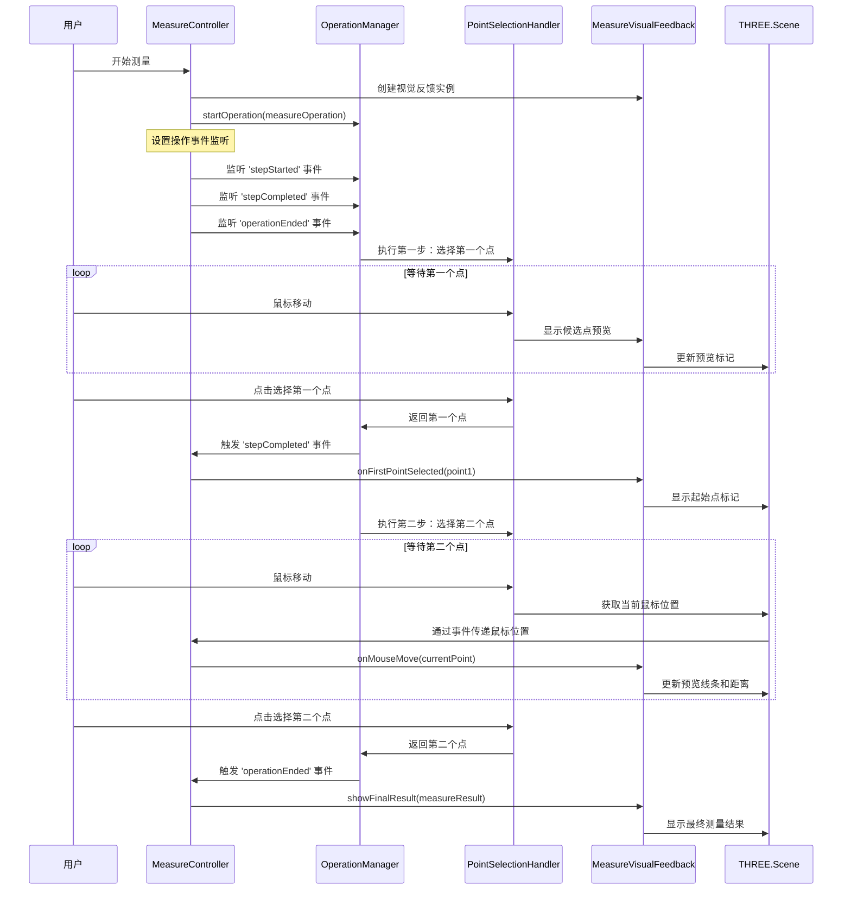

## 各层职责总结

| 层级 | 由谁实现 | 实现什么 | 实现频率 | 示例 |
|------|----------|----------|----------|------|
| **第一层：UVF核心框架** | UVF框架开发者 | 交互操作的基础设施和管理机制 | 一次性实现 | `OperationManager`, `ActiveOperation` |
| **第二层：基础交互类型** | UVF框架开发者 | 常用的交互步骤类型和处理器 | 根据需求逐步扩展 | `PointSelectionHandler`, `ObjectSelectionHandler` |
| **第三层：具体应用** | 业务开发者 | 具体的业务功能和交互逻辑 | 每个新功能都需要实现 | `MeasureOperation`, `AngleOperation` |

### 开发场景说明

#### 🏗️ **实现测量功能** (业务开发者需要做的)
```typescript
// 1. 定义测量操作
const measureOperation: InteractiveOperation = {
  id: 'measure-distance',
  name: '测量距离', 
  steps: [
    { type: 'point-selection', description: '选择第一个点' },
    { type: 'point-selection', description: '选择第二个点' }
  ],
  execute: ([p1, p2]: [Point3D, Point3D]) => ({
    distance: p1.distanceTo(p2),
    startPoint: p1,
    endPoint: p2
  })
};

// 2. 创建视觉反馈 (可选)
class MeasureVisualFeedback {
  // 实现预览线条、标签等
}

// 3. 使用
operationManager.startOperation(measureOperation);
```

#### 🔧 **添加新的角度测量功能** (业务开发者需要做的)
```typescript
// 只需要定义新的操作，复用现有的PointSelectionHandler
const angleOperation: InteractiveOperation = {
  id: 'measure-angle',
  name: '测量角度',
  steps: [
    { type: 'point-selection', description: '选择角的顶点' },
    { type: 'point-selection', description: '选择第一条边上的点' },
    { type: 'point-selection', description: '选择第二条边上的点' }
  ],
  execute: ([vertex, p1, p2]: [Point3D, Point3D, Point3D]) => {
    // 计算角度逻辑
    return { angle: calculateAngle(vertex, p1, p2) };
  }
};
```

#### ⚙️ **添加新的交互类型** (需要UVF框架扩展)
```typescript
#### 🔧 **MeasureVisualFeedback的完整集成示例**

```typescript
// 1. 创建测量控制器 - 负责协调操作和视觉反馈
class MeasureController {
  private operationManager: OperationManager;
  private visualFeedback: MeasureVisualFeedback;
  private measureOperation: InteractiveOperation;

  constructor(operationManager: OperationManager, scene: THREE.Scene) {
    this.operationManager = operationManager;
    this.visualFeedback = new MeasureVisualFeedback(scene);
    this.setupMeasureOperation();
  }

  private setupMeasureOperation() {
    this.measureOperation = {
      id: 'measure-distance',
      name: '测量距离',
      steps: [
        { type: 'point-selection', description: '选择第一个点' },
        { type: 'point-selection', description: '选择第二个点' }
      ],
      execute: ([p1, p2]: [Point3D, Point3D]) => ({
        startPoint: p1,
        endPoint: p2,
        distance: p1.distanceTo(p2),
        unit: 'units'
      }),
      
      // 关键：通过事件回调集成视觉反馈
      onStepCompleted: (step, result, index) => {
        if (index === 0) {
          // 第一个点选择完成
          this.visualFeedback.onFirstPointSelected(result as Point3D);
          this.setupPreviewForSecondPoint();
        }
      },
      
      onComplete: (result: MeasureResult) => {
        this.visualFeedback.showFinalResult(result);
      },
      
      onCancel: () => {
        this.visualFeedback.clear();
      }
    };
  }

  // 开始测量
  async startMeasure(): Promise<MeasureResult> {
    this.visualFeedback.clear();
    return await this.operationManager.startOperation(this.measureOperation);
  }

  // 设置第二个点的预览
  private setupPreviewForSecondPoint() {
    // 监听鼠标移动事件，实时更新预览线条
    const onMouseMove = (event: MouseEvent) => {
      const currentPoint = this.getPointFromMouseEvent(event);
      if (currentPoint) {
        this.visualFeedback.onMouseMove(currentPoint);
      }
    };

    // 在操作期间添加鼠标移动监听
    document.addEventListener('mousemove', onMouseMove);
    
    // 操作结束时清理监听器
    this.operationManager.once('operationEnded', () => {
      document.removeEventListener('mousemove', onMouseMove);
    });
  }
}

// 2. 视觉反馈实现
class MeasureVisualFeedback {
  private scene: THREE.Scene;
  private previewLine: THREE.Line | null = null;
  private finalLine: THREE.Line | null = null;
  private startPointMarker: THREE.Mesh | null = null;
  private distanceLabel: THREE.Sprite | null = null;
  private firstPoint: Point3D | null = null;

  constructor(scene: THREE.Scene) {
    this.scene = scene;
  }

  onFirstPointSelected(point: Point3D) {
    this.firstPoint = point;
    // 显示起始点标记
    this.startPointMarker = this.createPointMarker(point);
    this.scene.add(this.startPointMarker);
  }

  onMouseMove(currentPoint: Point3D) {
    if (!this.firstPoint) return;
    
    // 更新预览线条
    if (this.previewLine) {
      this.scene.remove(this.previewLine);
    }
    
    this.previewLine = this.createLine(this.firstPoint, currentPoint, 0xff9800); // 橙色预览
    this.scene.add(this.previewLine);
    
    // 显示实时距离
    const distance = this.firstPoint.distanceTo(currentPoint);
    this.updateDistancePreview(distance, this.getMidPoint(this.firstPoint, currentPoint));
  }

  showFinalResult(result: MeasureResult) {
    // 清除预览元素
    this.clearPreview();
    
    // 显示最终结果
    this.finalLine = this.createLine(result.startPoint, result.endPoint, 0x4caf50); // 绿色最终线条
    this.scene.add(this.finalLine);
    
    // 显示最终距离标签
    const midPoint = this.getMidPoint(result.startPoint, result.endPoint);
    this.distanceLabel = this.createDistanceLabel(result.distance, midPoint);
    this.scene.add(this.distanceLabel);
  }

  clear() {
    this.clearPreview();
    this.clearFinal();
    this.firstPoint = null;
  }

  private createLine(start: Point3D, end: Point3D, color: number): THREE.Line {
    const geometry = new THREE.BufferGeometry().setFromPoints([
      new THREE.Vector3(start.x, start.y, start.z),
      new THREE.Vector3(end.x, end.y, end.z)
    ]);
    const material = new THREE.LineBasicMaterial({ color });
    return new THREE.Line(geometry, material);
  }

  private createPointMarker(point: Point3D): THREE.Mesh {
    const geometry = new THREE.SphereGeometry(0.1, 8, 6);
    const material = new THREE.MeshBasicMaterial({ color: 0xff5722 });
    const marker = new THREE.Mesh(geometry, material);
    marker.position.set(point.x, point.y, point.z);
    return marker;
  }

  // ... 其他辅助方法
}

// 3. 使用方式
const measureController = new MeasureController(operationManager, scene);

// 开始测量
measureController.startMeasure().then(result => {
  console.log(`测量完成，距离: ${result.distance}`);
}).catch(error => {
  console.log('测量被取消或出错');
});
```

#### 🔧 **添加新的交互类型** (需要UVF框架扩展)
```typescript
// 如果需要全新的交互类型，比如"拖拽选择"
class DragSelectionHandler implements StepHandler {
  getSupportedTypes() { return ['drag-selection']; }
  
  async execute(step: DragSelectionStep): Promise<DragArea> {
    // 实现拖拽选择逻辑
  }
}

// 然后业务开发者就可以使用
const dragOperation: InteractiveOperation = {
  steps: [{ type: 'drag-selection', description: '拖拽选择区域' }],
  execute: (area: DragArea) => { /* 处理选中区域 */ }
};
```
```

## 2. 架构设计

### 2.1 核心抽象

```typescript
// 基础交互步骤
interface InteractionStep<T = unknown> {
  type: string;
  validator: (data: T) => boolean;
  description: string;
}

// 点选择步骤
interface PointSelectionStep extends InteractionStep<Point3D> {
  type: 'point-selection';
  allowSnapping?: boolean; // 是否允许吸附
  snapTargets?: SnapTarget[]; // 吸附目标
}

// 交互操作定义
interface InteractiveOperation<TSteps extends InteractionStep[], TResult> {
  id: string;
  name: string;
  steps: TSteps;
  execute: (stepResults: StepResults<TSteps>) => TResult;
  onCancel?: () => void;
  onComplete?: (result: TResult) => void;
}
```

### "等待用户输入"详解

"等待用户输入"是交互操作框架的核心环节，它处理以下关键任务：

#### 异步交互管理
```typescript
// 系统进入等待状态，Promise保持pending
const userInput = await stepHandler.execute(step);

// 在等待期间，系统会：
// 1. 显示操作指引 - "请选择第一个点"
// 2. 设置事件监听器 - 监听鼠标点击、键盘ESC等
// 3. 提供视觉反馈 - 高亮可选择区域、显示光标样式
// 4. 处理中断逻辑 - 用户按ESC取消操作
```

#### 用户体验优化
- **操作指引**: 清晰告知用户当前需要执行的操作
- **视觉反馈**: 实时显示鼠标悬停效果、可选择区域高亮
- **进度显示**: 显示当前是第几步，总共几步
- **取消机制**: 支持ESC键或按钮取消操作

### 测量操作状态图

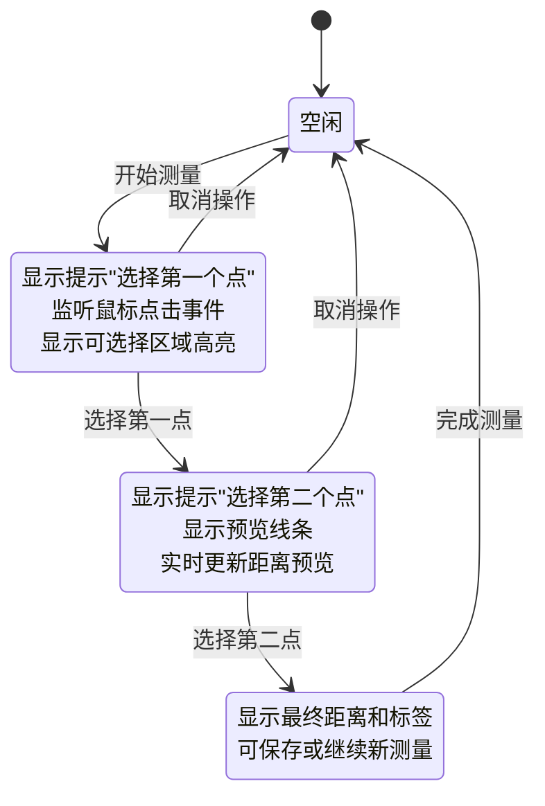

### 2.2 操作管理器

`OperationManager` 将协调交互操作的执行：

```typescript
class OperationManager {
  private activeOperation: ActiveOperation | null = null;
  private stepHandlers: Map<string, StepHandler>;

  startOperation<T>(operation: InteractiveOperation): Promise<T>;
  cancelOperation(): void;
  completeCurrentStep(data: unknown): void;
  
  private processStep(step: InteractionStep): Promise<unknown>;
  private validateStepData(step: InteractionStep, data: unknown): boolean;
}
```

### 2.3 步骤处理器

不同类型的交互步骤将有专门的处理器：

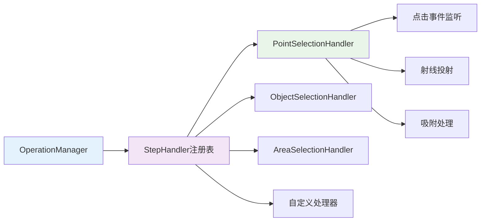

```typescript
interface StepHandler<T = unknown> {
  canHandle(step: InteractionStep): boolean;
  execute(step: InteractionStep<T>): Promise<T>;
  cleanup(): void;
}

class PointSelectionHandler implements StepHandler<Point3D> {
  execute(step: PointSelectionStep): Promise<Point3D>;
  private setupClickListener(): void;
  private handleSnappping(point: Point3D, targets: SnapTarget[]): Point3D;
}
```

## 3. 测量操作实现

### 3.1 测量操作定义

```typescript
const measureOperation: InteractiveOperation = {
  id: 'measure-distance',
  name: '测量距离',
  steps: [
    {
      type: 'point-selection',
      validator: (point: Point3D) => isValidPoint(point),
      description: '选择第一个点',
      allowSnapping: true
    },
    {
      type: 'point-selection', 
      validator: (point: Point3D) => isValidPoint(point),
      description: '选择第二个点',
      allowSnapping: true
    }
  ],
  execute: ([point1, point2]: [Point3D, Point3D]) => {
    return calculateDistance(point1, point2);
  }
};
```

### 3.2 视觉反馈

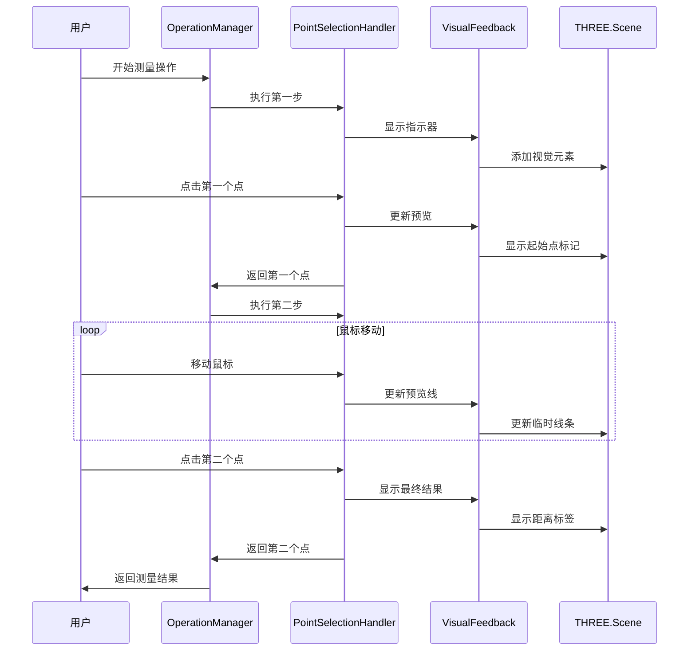

```typescript
class MeasureVisualFeedback {
  private line: THREE.Line;
  private labels: THREE.Sprite[];
  
  updatePreview(startPoint: Point3D, currentPoint?: Point3D): void;
  showResult(point1: Point3D, point2: Point3D, distance: number): void;
  clear(): void;
}
```

## 4. 详细架构

### 4.1 类型定义

```typescript
// 通用类型
interface Point3D {
  x: number;
  y: number;
  z: number;
}

interface SnapTarget {
  type: 'vertex' | 'edge' | 'face' | 'grid'; // 顶点、边、面、网格
  threshold: number; // 吸附阈值
}

// 操作状态
enum OperationState {
  IDLE = 'idle',                    // 空闲
  ACTIVE = 'active',                // 活跃
  WAITING_FOR_INPUT = 'waiting_for_input', // 等待输入
  COMPLETING = 'completing',        // 完成中
  CANCELLED = 'cancelled'           // 已取消
}

// 活跃操作跟踪
interface ActiveOperation {
  operation: InteractiveOperation;
  currentStepIndex: number;         // 当前步骤索引
  stepResults: unknown[];           // 步骤结果
  state: OperationState;           // 操作状态
  startTime: number;               // 开始时间
}

// 步骤结果工具类型
type StepResults<T extends InteractionStep[]> = {
  [K in keyof T]: T[K] extends InteractionStep<infer U> ? U : never;
};
```

### 系统架构组件图

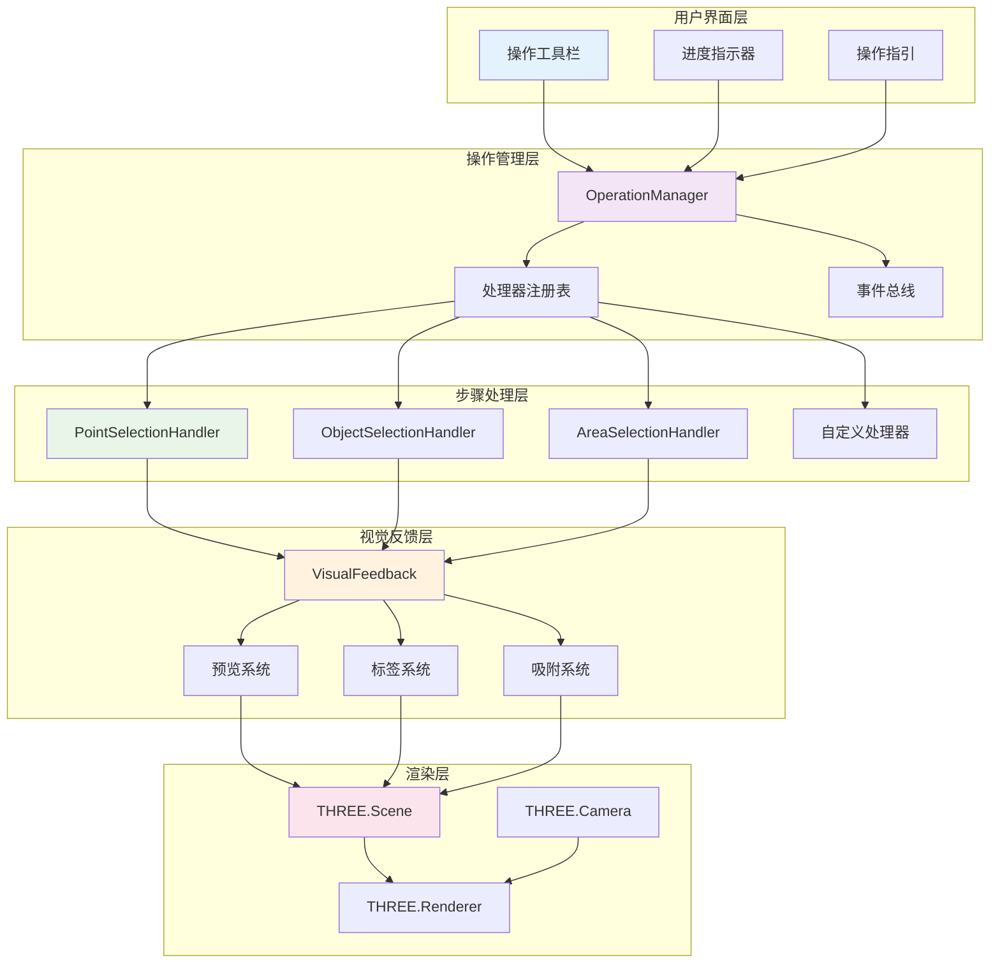

### 4.2 操作管理器实现

```typescript
export class OperationManager {
  private activeOperation: ActiveOperation | null = null;
  private stepHandlers = new Map<string, StepHandler>();
  private eventEmitter = new EventEmitter();
  
  constructor(
    private scene: THREE.Scene,
    private camera: THREE.Camera,
    private renderer: THREE.Renderer
  ) {}

  // 注册步骤处理器
  registerHandler(handler: StepHandler): void {
    const supportedTypes = handler.getSupportedTypes();
    supportedTypes.forEach(type => {
      this.stepHandlers.set(type, handler);
    });
  }

  // 开始操作
  async startOperation<T>(operation: InteractiveOperation): Promise<T> {
    if (this.activeOperation) {
      throw new Error('另一个操作已经在运行中');
    }

    this.activeOperation = {
      operation,
      currentStepIndex: 0,
      stepResults: [],
      state: OperationState.ACTIVE,
      startTime: Date.now()
    };

    try {
      return await this.executeOperation();
    } catch (error) {
      this.cleanup();
      throw error;
    }
  }

  // 取消操作
  cancelOperation(): void {
    if (!this.activeOperation) return;
    
    this.activeOperation.state = OperationState.CANCELLED;
    this.activeOperation.operation.onCancel?.();
    this.cleanup();
  }

  // 执行操作
  private async executeOperation<T>(): Promise<T> {
    const { operation, stepResults } = this.activeOperation!;
    
    for (let i = 0; i < operation.steps.length; i++) {
      this.activeOperation!.currentStepIndex = i;
      const step = operation.steps[i];
      
      this.eventEmitter.emit('stepStarted', { step, index: i });
      
      const result = await this.processStep(step);
      stepResults.push(result);
      
      this.eventEmitter.emit('stepCompleted', { step, result, index: i });
    }

    this.activeOperation!.state = OperationState.COMPLETING;
    const finalResult = operation.execute(stepResults as any);
    
    operation.onComplete?.(finalResult);
    this.cleanup();
    
    return finalResult;
  }

  // 处理步骤
  private async processStep(step: InteractionStep): Promise<unknown> {
    const handler = this.stepHandlers.get(step.type);
    if (!handler) {
      throw new Error(`未找到步骤类型的处理器: ${step.type}`);
    }

    this.activeOperation!.state = OperationState.WAITING_FOR_INPUT;
    return await handler.execute(step);
  }

  // 清理资源
  private cleanup(): void {
    if (this.activeOperation) {
      // 清理活跃处理器
      const currentStep = this.activeOperation.operation.steps[
        this.activeOperation.currentStepIndex
      ];
      if (currentStep) {
        const handler = this.stepHandlers.get(currentStep.type);
        handler?.cleanup();
      }
    }
    
    this.activeOperation = null;
    this.eventEmitter.emit('operationEnded');
  }
}
```

### 4.3 点选择处理器

```typescript
export class PointSelectionHandler implements StepHandler<Point3D> {
  private raycaster = new THREE.Raycaster();
  private mouse = new THREE.Vector2();
  private isActive = false;
  private resolve: ((point: Point3D) => void) | null = null;
  private reject: ((error: Error) => void) | null = null;

  constructor(
    private scene: THREE.Scene,
    private camera: THREE.Camera,
    private renderer: THREE.Renderer
  ) {}

  getSupportedTypes(): string[] {
    return ['point-selection'];
  }

  canHandle(step: InteractionStep): boolean {
    return step.type === 'point-selection';
  }

  // 执行点选择步骤 - 这里就是"等待用户输入"的实现
  async execute(step: PointSelectionStep): Promise<Point3D> {
    return new Promise((resolve, reject) => {
      this.resolve = resolve;
      this.reject = reject;
      this.isActive = true;
      
      // 1. 设置事件监听器，准备接收用户输入
      this.setupEventListeners();
      
      // 2. 显示操作指引给用户
      this.showInstructions(step.description);
      
      // 3. Promise在这里保持pending状态
      // 直到用户点击(resolve)或按ESC取消(reject)
      // 这就是"等待用户输入"的核心机制
    });
  }

  // 清理资源
  cleanup(): void {
    this.isActive = false;
    this.removeEventListeners();
    this.hideInstructions();
    this.resolve = null;
    this.reject = null;
  }

  // 设置事件监听器
  private setupEventListeners(): void {
    this.renderer.domElement.addEventListener('click', this.onMouseClick);
    this.renderer.domElement.addEventListener('mousemove', this.onMouseMove);
    document.addEventListener('keydown', this.onKeyDown);
  }

  // 移除事件监听器
  private removeEventListeners(): void {
    this.renderer.domElement.removeEventListener('click', this.onMouseClick);
    this.renderer.domElement.removeEventListener('mousemove', this.onMouseMove);
    document.removeEventListener('keydown', this.onKeyDown);
  }

  // 鼠标点击处理
  private onMouseClick = (event: MouseEvent): void => {
    if (!this.isActive) return;

    const point = this.getPointFromEvent(event);
    if (point && this.resolve) {
      this.resolve(point);
      this.cleanup();
    }
  };

  // 鼠标移动处理
  private onMouseMove = (event: MouseEvent): void => {
    if (!this.isActive) return;
    
    const point = this.getPointFromEvent(event);
    if (point) {
      this.showPreview(point);
    }
  };

  // 键盘按键处理
  private onKeyDown = (event: KeyboardEvent): void => {
    if (event.key === 'Escape' && this.reject) {
      this.reject(new Error('用户取消操作'));
      this.cleanup();
    }
  };

  // 从事件获取3D点
  private getPointFromEvent(event: MouseEvent): Point3D | null {
    const rect = this.renderer.domElement.getBoundingClientRect();
    this.mouse.x = ((event.clientX - rect.left) / rect.width) * 2 - 1;
    this.mouse.y = -((event.clientY - rect.top) / rect.height) * 2 + 1;

    this.raycaster.setFromCamera(this.mouse, this.camera);
    const intersects = this.raycaster.intersectObjects(this.scene.children, true);

    if (intersects.length > 0) {
      const point = intersects[0].point;
      return { x: point.x, y: point.y, z: point.z };
    }

    return null;
  }

  // 显示操作指引
  private showInstructions(description: string): void {
    // 显示UI指引的实现
  }

  // 隐藏操作指引
  private hideInstructions(): void {
    // 隐藏UI指引的实现
  }

  // 显示预览
  private showPreview(point: Point3D): void {
    // 显示悬停预览的实现
  }
}
```

## 5. 实施计划

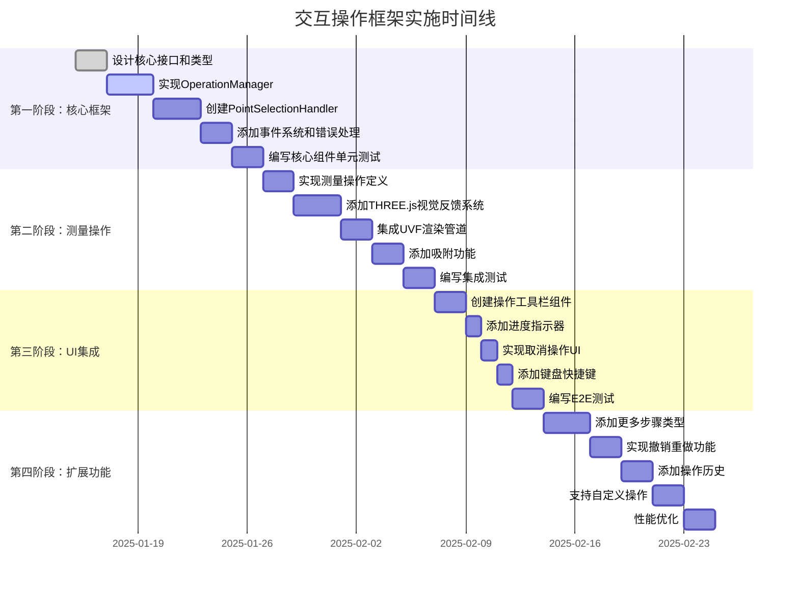

### 第一阶段：核心框架 (第1-2周)
1. ✅ 设计核心接口和类型
2. ⏳ 实现 `OperationManager` 类
3. ⏳ 创建 `PointSelectionHandler`
4. ⏳ 添加事件系统和错误处理
5. ⏳ 编写核心组件单元测试

### 第二阶段：测量操作 (第3周)
1. ⏳ 实现测量操作定义
2. ⏳ 添加THREE.js视觉反馈系统
3. ⏳ 集成现有UVF渲染管道
4. ⏳ 添加吸附功能
5. ⏳ 编写集成测试

### 第三阶段：UI集成 (第4周)
1. ⏳ 创建操作工具栏组件
2. ⏳ 添加进度指示器
3. ⏳ 实现取消操作UI
4. ⏳ 添加键盘快捷键
5. ⏳ 编写E2E测试

### 第四阶段：扩展功能 (第5-6周)
1. ⏳ 添加更多步骤类型（对象选择、区域选择）
2. ⏳ 实现撤销/重做功能
3. ⏳ 添加操作历史
4. ⏳ 支持自定义操作
5. ⏳ 性能优化

## 6. API使用示例

### 6.1 基础用法

```typescript
// 初始化操作管理器
const operationManager = new OperationManager(scene, camera, renderer);

// 注册步骤处理器
operationManager.registerHandler(new PointSelectionHandler(scene, camera, renderer));

// 开始测量操作
try {
  const result = await operationManager.startOperation(measureOperation);
  console.log(`距离: ${result.distance} 单位`);
} catch (error) {
  console.error('操作失败:', error);
}
```

### 6.2 自定义操作

```typescript
// 创建自定义面积测量操作
const measureAreaOperation: InteractiveOperation = {
  id: 'measure-area',
  name: '测量面积',
  steps: [
    {
      type: 'point-selection',
      description: '选择第一个角点',
      validator: (point: Point3D) => isValidPoint(point)
    },
    {
      type: 'point-selection',
      description: '选择第二个角点',
      validator: (point: Point3D) => isValidPoint(point)
    },
    {
      type: 'point-selection',
      description: '选择第三个角点',
      validator: (point: Point3D) => isValidPoint(point)
    }
  ],
  execute: ([p1, p2, p3]: [Point3D, Point3D, Point3D]) => {
    return calculateTriangleArea(p1, p2, p3);
  }
};
```

### 6.3 带事件的操作

```typescript
operationManager.on('stepStarted', ({ step, index }) => {
  showStepInstructions(step.description);
});

operationManager.on('stepCompleted', ({ step, result, index }) => {
  updateProgressBar(index + 1, totalSteps);
});

operationManager.on('operationEnded', () => {
  hideInstructions();
  resetUI();
});
```

## 7. 测试策略

### 7.1 单元测试

```typescript
describe('OperationManager', () => {
  let operationManager: OperationManager;
  let mockHandler: StepHandler;

  beforeEach(() => {
    operationManager = new OperationManager(scene, camera, renderer);
    mockHandler = createMockHandler();
    operationManager.registerHandler(mockHandler);
  });

  test('应该执行简单操作', async () => {
    const operation = createTestOperation();
    const result = await operationManager.startOperation(operation);
    expect(result).toBeDefined();
  });

  test('应该取消活跃操作', () => {
    operationManager.startOperation(testOperation);
    operationManager.cancelOperation();
    expect(operationManager.getActiveOperation()).toBeNull();
  });
});
```

### 7.2 集成测试

```typescript
describe('测量操作集成测试', () => {
  test('应该测量两点间距离', async () => {
    const handler = new PointSelectionHandler(scene, camera, renderer);
    operationManager.registerHandler(handler);
    
    // 模拟用户点击
    const operationPromise = operationManager.startOperation(measureOperation);
    
    // 模拟第一次点击
    fireEvent.click(canvas, { clientX: 100, clientY: 100 });
    await waitFor(() => expect(getCurrentStep()).toBe(1));
    
    // 模拟第二次点击
    fireEvent.click(canvas, { clientX: 200, clientY: 200 });
    
    const result = await operationPromise;
    expect(result.distance).toBeGreaterThan(0);
  });
});
```

### 测试金字塔

```mermaid
pyramid
    title 测试策略金字塔
    
    "E2E测试" : 10
    "集成测试" : 25
    "单元测试" : 65
```

## 8. 性能考虑

### 8.1 内存管理
- 操作完成时清理事件监听器
- 释放临时THREE.js对象
- 对频繁创建的对象使用对象池

### 8.2 渲染优化
- 交互期间批量视觉更新
- 使用requestAnimationFrame实现流畅预览
- 为复杂场景实现细节层次(LOD)

### 8.3 事件处理
- 防抖鼠标移动事件
- 尽可能使用被动事件监听器
- 使用空间索引实现高效射线投射

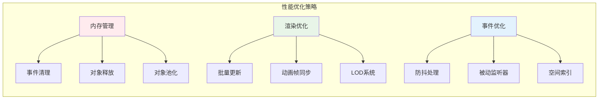

## 9. 未来扩展

### 9.1 高级步骤类型
```typescript
interface ObjectSelectionStep extends InteractionStep<THREE.Object3D> {
  type: 'object-selection';
  filter?: (object: THREE.Object3D) => boolean; // 对象过滤器
  multiSelect?: boolean; // 多选支持
}

interface AreaSelectionStep extends InteractionStep<Area2D> {
  type: 'area-selection';
  shape: 'rectangle' | 'circle' | 'polygon'; // 区域形状
}
```

### 9.2 操作模板
```typescript
class OperationTemplate {
  static distance(): InteractiveOperation {
    return createTwoPointOperation('measure-distance', calculateDistance);
  }

  static angle(): InteractiveOperation {
    return createThreePointOperation('measure-angle', calculateAngle);
  }
}
```

### 9.3 协作操作
```typescript
interface CollaborativeOperation extends InteractiveOperation {
  allowCollaboration: boolean; // 允许协作
  syncSteps: boolean; // 同步步骤
  participants: string[]; // 参与者列表
}
```

### 扩展路线图

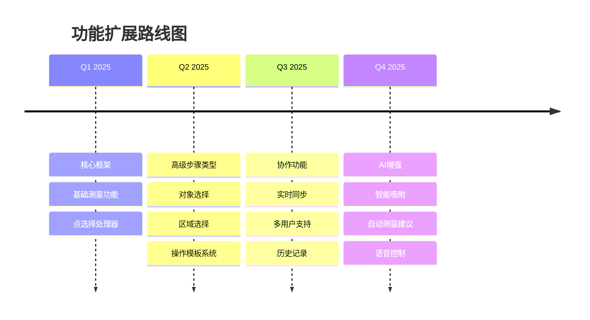

## 10. 总结

本设计为UVF提供了一个灵活且可扩展的交互操作框架。测量功能作为第一个实现，但架构支持轻松添加新的操作类型和步骤处理器。框架保持了关注点分离，提供了良好的错误处理，并包含了全面的测试策略。

模块化设计允许增量实现和测试，确保每个组件都可以独立开发和验证，同时保持与整体系统的集成。

### 核心优势

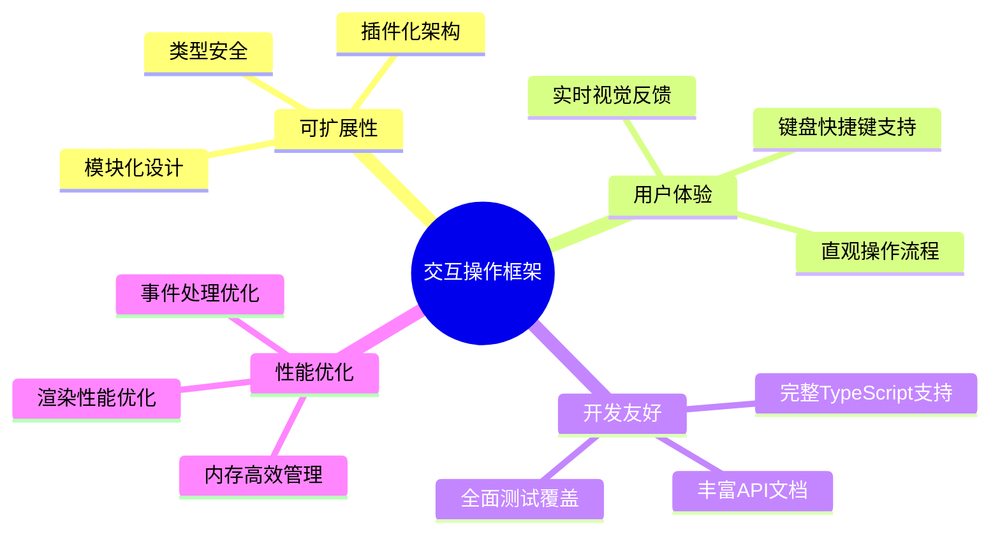

这个框架不仅满足当前的测量需求，还为未来的功能扩展奠定了坚实的基础，确保UVF能够持续演进以满足用户不断增长的交互需求。
