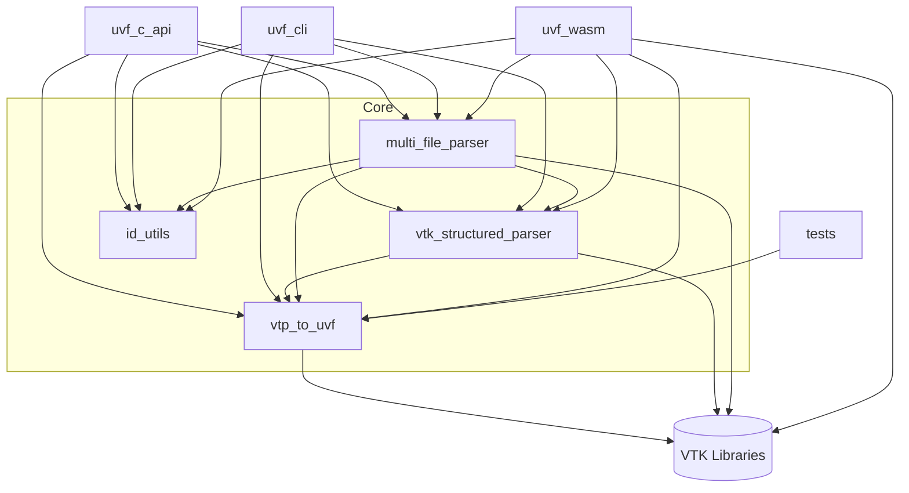
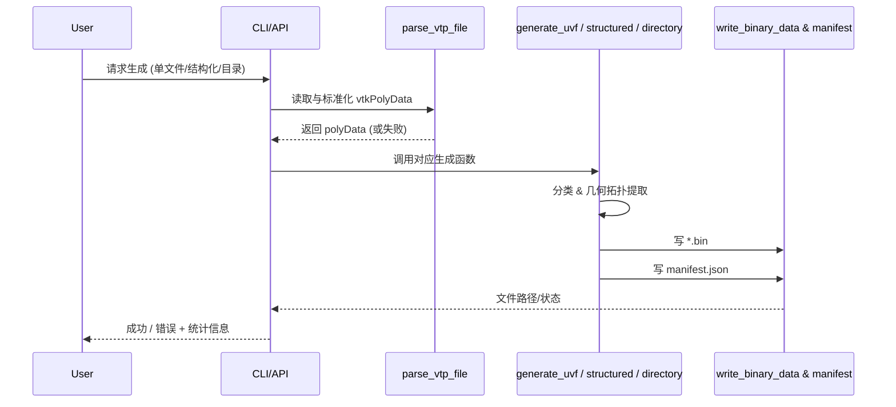
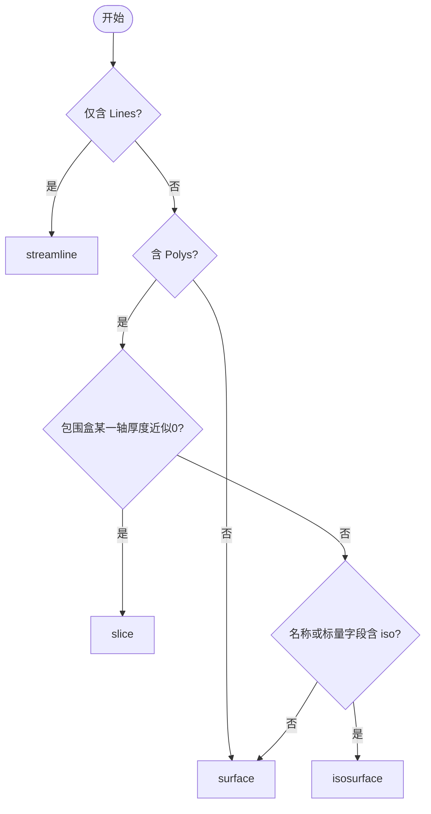

# 模块与架构概览

本文件从开发者角度梳理 `uvf-c` 的核心模块、职责与依赖关系，并给出后续可演进方向。

## 顶层目标 (CMake)

- 静态库: `uvf` (native)
- 可执行: `uvf_cli` (可选, 由 `UVF_BUILD_CLI` 控制)
- WebAssembly: `uvf_wasm` (Emscripten 交叉构建)
- 测试: `uvf_tests`, `uvf_file_tests` (由 `UVF_ENABLE_TESTS` 控制)

## 主要源码模块

| 模块 | 主要文件 | 作用 | 关键对外符号 |
|------|----------|------|--------------|
| 基础解析 & UVF 生成 | `vtp_to_uvf.cpp/h` | 解析 `.vtp/.vtk` -> `vtkPolyData`，抽取几何/标量，分类 geomKind，写二进制 + manifest | `parse_vtp_file`, `generate_uvf` |
| 结构化解析 | `vtk_structured_parser.cpp/h` | 基于字段命名规则做分组（slices/surfaces/isosurfaces/streamlines），多数据项写多个 bin & manifest 层级 | `generate_structured_uvf` |
| 多文件目录解析 | `multi_file_parser.cpp/h` | 扫描目录下多个 VTK 文件，按文件名/标签归类并批量生成 | `process_directory_structure`, `generate_multi_file_uvf` |
| C 语言 API | `uvf_c_api.cpp/h` | 暴露稳定 C 接口（基础/增强/状态/工具），线程安全记录最近一次操作统计 | `generate_uvf_*`, `uvf_get_last_*` |
| ID 工具 | `id_utils.cpp/h` | 目前简单保留文件 stem，后续可扩展清洗策略 | `clean_id` |
| JS / Wasm 绑定 | `uvf_js_bindings.js` (占位) & 构建脚本 | 通过 Emscripten 导出 C API (`EXPORTED_FUNCTIONS` 设置) | N/A |

## 依赖关系图

### 图说明
- `vtp_to_uvf` 是最低层直接操纵 VTK 数据结构与文件的核心模块；其它高层结构化 / 多文件模块复用其数据抽取和二进制写入函数。
- `vtk_structured_parser` 与 `multi_file_parser` 都依赖 `write_binary_data` / `extract_geometry_data` 等通用逻辑（在当前实现中通过重复声明/定义共享，后续可考虑抽出 `uvf_io.h/cpp`）。
- C API 封装线程安全统计（使用 mutex），并对异常/错误字符串进行集中管理。
- WebAssembly 目标通过链接同一套源文件 + Emscripten 链接 flags 导出函数。

## 数据/控制流高层时序

### 时序说明
- `parse_vtp_file` 封装多种格式读取 (XML PolyData, Legacy PolyData, UnstructuredGrid -> GeometryFilter)。
- 核心生成函数执行：点 / 索引提取、标量数组搬运、几何分类、Face 分段（可选 segmentation 支持）。
- 输出产物：随机命名或按数据名命名的 `.bin` + 结构化层级的 `manifest.json`。

## 几何分类策略 (geomKind)

说明：
1. 线数据优先被识别为 `streamline`。
2. 平面性通过包围盒最长对角线 1% 阈值判断任一轴厚度是否近似 0。
3. “iso” 关键词出现在文件基础名或任意标量字段名时 => `isosurface`。
4. 其余默认 `surface`。

## 线程安全与状态
- 使用内部匿名命名空间全局变量 + `std::mutex` 保护最近一次操作统计与错误文本。
- API 返回的 `const char*` 指针在下次任意 API 调用前有效，适合立即复制。

## 设计亮点与改进建议

| 方面 | 当前做法 | 改进建议 |
|------|----------|----------|
| 模块边界 | 解析与生成逻辑集中在 `vtp_to_uvf.cpp` | 拆分为 `uvf_reader.cpp`, `uvf_writer.cpp`, `uvf_classify.cpp` 以降低文件体积与耦合 |
| 重复函数 | `extract_geometry_data`, `write_binary_data` 在多个单元声明 | 抽公共头/实现，减少重复与潜在偏差风险 |
| Manifest 生成 | 手工字符串拼接 | 引入 JSON 库 (`nlohmann_json`)（已有依赖路径）增强可维护性与校验 |
| 错误处理 | 失败返回 bool/int + 全局 last_error | 提供错误码枚举 + 分级日志（INFO/WARN/ERROR），便于前端反馈 |
| 几何分类 | 简单启发式 | 支持用户可插拔策略或配置 JSON |
| Face Segmentation | 支持 `FaceIndex`/`FaceIdMapping` | 文档化字段契约，添加测试覆盖多段 segmentation |
| 并发 | 全局状态互斥 | 允许并行任务：使用线程局部存储 (TLS) 或返回 handle 对象 |
| WASM 构建 flags | 内联在 CMake | 拆出工具链/flags 模块化，便于升级 Emscripten 参数 |
| Test 覆盖 | 几何分类与基本文件写出 | 增加: 结构化解析、多文件目录、错误路径、segmentation、WASM smoke test |

## 后续演进路线 (概要)
1. 抽象 IO & Manifest 生成层，统一写入 API 与校验逻辑。
2. 引入 JSON 库构建 manifest（自动 range 统计与 schema 验证）。
3. 扩充测试矩阵（多线程调用 C API, segmentation, 目录混合类型）。
4. 增加 `uvf_inspect` CLI 子命令用于读取并验证生成结果。
5. 提供可选并行解析（目录模式下多文件并行 -> 线程池）。
6. WASM: 提供 Promise 包装与 TypeScript 类型声明。

---
*本文档为开发内部分析，更新日期：2025-10-10*
