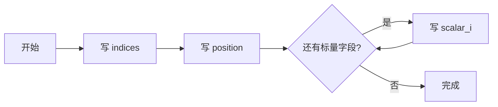
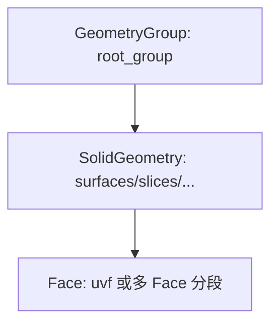
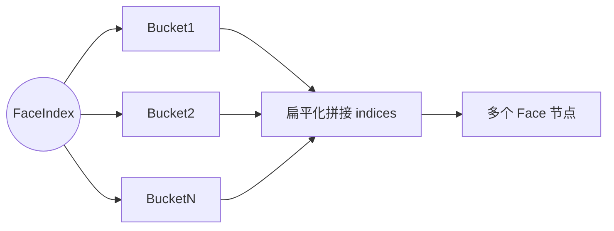
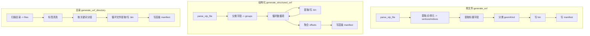

# 数据格式与处理流程

本文件描述 UVF 生成的二进制 / manifest 结构、字段含义以及从 VTK 输入到 UVF 输出的处理管线。

## 二进制 `.bin` 文件布局
当前实现按以下顺序顺序写入：
1. `indices` (uint32 * N) — 三角形/退化线段索引，以三元组序列表示
2. `position` (float32 * 3 * vertexCount)
3. 逐个标量字段（float32）

写入时为每段记录 offset & length，用于 manifest sections。

### 偏移记录 (UVFOffsets)
- key: 字段名 (`indices`/`position`/标量字段名)
- value: `{offset, length, dType, dimension}`
  - `dimension` 尝试推断标量数组的分量数（通过数据长度 / 顶点数）。

## Manifest 基本结构 (单文件 basic / segmentation)
Manifest 是一个 JSON 数组，由多层对象组成：
1. 根 `GeometryGroup` (`id: root_group`) 引用第二层 SolidGeometry ID
2. 第二层 `SolidGeometry`：
   - `attributions.faces` 或 `edges` 指向具体 Face 集合
   - `resources.buffers` 指向 `.bin` 文件及 `sections`
   - `properties.geomKind` 指定几何类型
3. Face 层：
   - `bufferLocations.indices` 包含 `startIndex` / `endIndex`（索引 triplet 范围）

### 多 Face 分段 (可选)
若输入带 `FaceIndex` CellData + `FaceIdMapping` FieldData：
- 先按 FaceIndex 聚类三角索引
- 为每个段生成独立 Face 对象（`id = mappingName 或 uvf_Face<idx>`）
- `SolidGeometry.attributions.faces = [faceIds...]`

## Structured / Multi-file Manifest 差异
| 模式 | Face 命名 | Binary 命名 | 层级策略 | 分组依据 |
|------|-----------|-------------|----------|----------|
| basic | 单一 `uvf` | 随机 token `.bin` | 3 层 | 几何 heuristics |
| segmentation | 多个 Face | 同一随机 bin | 3 层 | CellData FaceIndex |
| structured (字段分组) | `<data_name>_face` | `<data_name>.bin` | root -> group -> SolidGeometry -> Face | 字段名分类规则 |
| multi-file (目录) | `<label>` | `<label>.bin` | root -> group -> SolidGeometry -> Face | 文件名标签清洗 + 关键词 |

## 几何/字段分类规则
详见 `01_architecture_modules.md` 的 geomKind 流程图。结构化 / 多文件模式额外通过名称关键词映射到组：
- slices: slice, plane, _xy_, _xz_, _yz_
- isosurfaces: iso, value, level
- streamlines: stream, line, seed
- surfaces: surface, boundary, internal, 其他默认

## 处理主流程对比

## 错误与回退策略
| 环节 | 失败条件 | 当前行为 | 建议改进 |
|------|----------|----------|----------|
| 解析 | reader 不能读取 / 空点集 | 返回 null | 区分文件不存在/格式错误/空数据
| 分类 | 无有效字段或文件 | 使用默认 surfaces 组 | 日志说明回退原因
| Segmentation | FaceIndex 存在但 buckets 为空 | 退回单面 | 增加 warning 采集
| 写文件 | 打开 bin/manifest 失败 | 返回 false | 提供 errno & 路径建议

## 版本与兼容性
- C API `uvf_get_version()` 当前返回 `0.1.4`
- Manifest schema 尚未版本化；建议添加 `version` 字段与 `schema` URL 以便前端一致性校验。

## 演进建议（数据层）
1. 引入 schema 校验：生成后使用 JSON Schema 自动校验（开发期 assertion）。
2. 增加压缩选项：为标量大数组提供 gzip/wasm 中 zstd 支持。
3. bin 分段对齐：按 64/128 字节对齐，提升内存映射与 GPU 传输效率。
4. Range 统计：统一封装，避免重复代码；支持 Nan/Inf 过滤。
5. Face segmentation：支持属性色彩 / 透明度 / 自定义字段。

---
*更新日期：2025-10-10*
