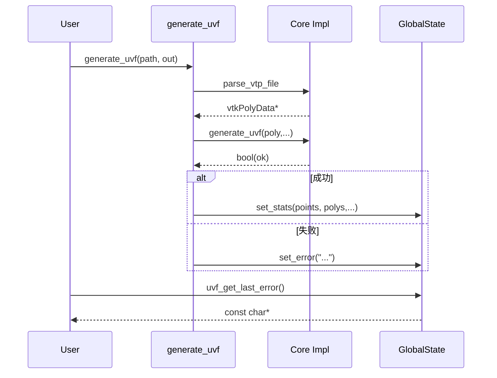

# C API 设计分析

## API 分层

| 类别 | 函数 | 描述 |
|------|------|------|
| 基础 | `parse_vtp` | 仅进行解析合法性检查并统计点/三角数 |
| 生成 (单文件) | `generate_uvf` | 基础模式，写单一 UVF 输出目录 |
| 生成 (增强) | `generate_uvf_structured` | 基于字段分组结构化输出 |
| 生成 (目录) | `generate_uvf_directory` | 扫描目录多个文件批量生成 |
| 状态 | `uvf_get_last_error` / `uvf_get_last_*` | 最近一次操作统计（点/三角/文件/组/操作类型）|
| 工具 | `uvf_is_directory`, `uvf_count_vtk_files`, `uvf_get_version` | 文件系统判断 / 版本查询 |

## 状态生命周期
- 所有生成/解析函数结束时调用内部 `set_stats` 更新全局状态。
- 若失败调用 `set_error` 记录人类可读字符串。
- 读取函数持锁返回值指针或拷贝基本类型。



## 操作类型标识
| 操作 | set_stats op_type |
|------|-------------------|
| parse_vtp | `parse_check` |
| generate_uvf | `basic_uvf` |
| generate_uvf_structured | `structured_uvf` |
| generate_uvf_directory | `directory_multi` |

## 线程安全评估
- 使用单一 `std::mutex` 包裹所有读写；避免数据竞争。
- 缺点：并发高吞吐时成为全局瓶颈；并行多任务间状态串扰（后写覆盖前写）。

### 改进方案
| 方案 | 描述 | 优点 | 缺点 |
|------|------|------|------|
| TLS 状态 | 每线程维护 last_* | 并发无锁读取 | 线程 ID 变化/任务队列复杂 |
| Handle 模式 | 生成函数返回句柄 ID，后续查询 | 无全局共享冲突 | 需要句柄表/释放逻辑 |
| 回调/结构返回 | 直接返回结构体统计信息 | 无共享状态 | 破坏现有 C API 简洁性 |

## 错误语义改进建议
| 当前 | 问题 | 建议 |
|------|------|------|
| 字符串模糊描述 | 无法程序化判断 | 增加 `uvf_get_last_error_code()` + 枚举 |
| 无日志级别 | 难以调试 | 引入可选回调 `uvf_set_logger(level, fn)` |
| 失败点散落 | 粒度粗 | 统一错误宏包装（含文件/行） |

## 典型用法示例

```c
if(!generate_uvf("model.vtp", "out_uvf")) {
    fprintf(stderr, "UVF failed: %s\n", uvf_get_last_error());
    return -1;
}
printf("pts=%d tris=%d\n", uvf_get_last_point_count(), uvf_get_last_triangle_count());
```

## API 稳定性建议
1. 给所有新增函数添加 `UVF_API` 宏（控制导出/可见性）。
2. 为结构/常量引入版本常量：`#define UVF_API_VERSION 0x000104`. 
3. 维护 `CHANGELOG.md`，突出破坏性改动。

## FFI / 绑定注意事项
| 平台 | 要点 |
|------|------|
| Wasm | `EXPORTED_FUNCTIONS` 中需添加新符号；注意字符串编码 UTF-8 传递与内存释放策略 |
| Python (潜在) | 建议使用 CFFI/pybind11 包装，返回结构而非全局状态 |
| Node.js (NAPI) | 异步目录模式可放入 worker 线程，避免阻塞 event loop |

## 未来扩展点
- `uvf_generate_from_memory(const void* buffer, size_t len, const char* virtualPath, ...)` 支持内存输入。
- 统一 `uvf_generate_params` 结构体，包含：分类策略指针、压缩选项、并行度、日志回调。
- 引入 `uvf_inspect` API 反向读取 manifest/bin 校验。

---
*更新日期：2025-10-10*
