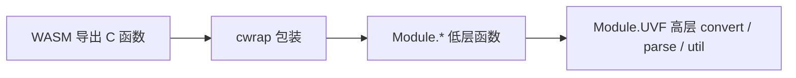
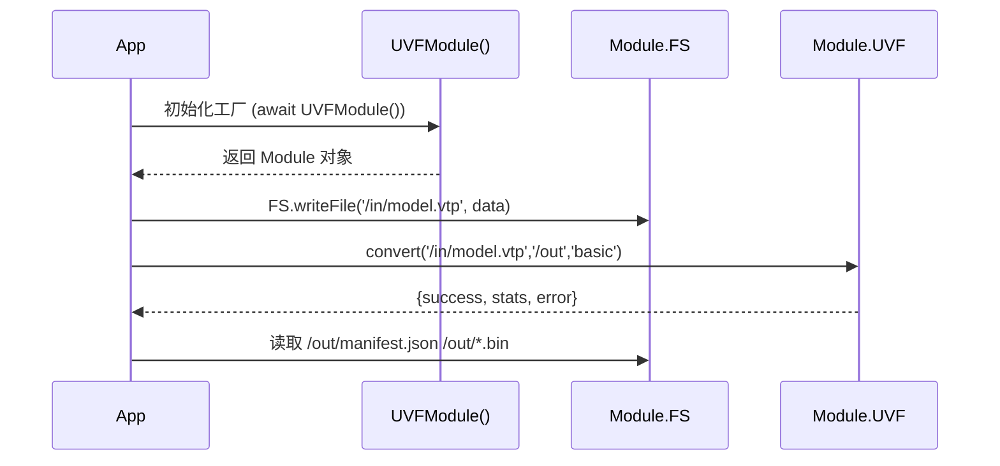

# WebAssembly 集成分析

## 构建路径概览

CMake 针对 `Emscripten` 平台分支：
- 目标: `uvf_wasm` (最终产物重命名为 `uvf` => 生成 `uvf.js` + `uvf.wasm`)
- 源文件与原生静态库一致：`vtp_to_uvf.cpp`, `vtk_structured_parser.cpp`, `multi_file_parser.cpp`, `id_utils.cpp`, `uvf_c_api.cpp`
- 通过链接 flag 指定导出函数集合与运行时方法。

### 链接 Flags 解析

```text
--bind                       使用 embind (当前未见 C++ embind 代码, 可考虑移除)
-s MODULARIZE=1              生成可按需实例化的工厂函数 (UVFModule)
-s EXPORT_NAME=\"UVFModule\"   自定义模块工厂名称
-s ALLOW_MEMORY_GROWTH=1     动态内存增长以避免 OOM
-s FORCE_FILESYSTEM=1        启用虚拟 FS (允许读取 pack 的输入)
-s ENVIRONMENT=web,worker    允许在浏览器主线程与 worker 中使用
-s EXPORTED_FUNCTIONS=[...]  导出底层 C 函数符号 (下列 API)
-s EXPORTED_RUNTIME_METHODS=[ccall,cwrap,FS,lengthBytesUTF8,stringToUTF8,UTF8ToString]
```

导出函数列表：
`parse_vtp`, `generate_uvf`, `generate_uvf_structured`, `generate_uvf_directory`, `uvf_get_last_error`, `uvf_get_last_point_count`, `uvf_get_last_triangle_count`, `uvf_get_last_file_count`, `uvf_get_last_group_count`, `uvf_get_last_operation_type`, `uvf_is_directory`, `uvf_count_vtk_files`, `uvf_get_version`。

## JS 绑定层 (`uvf_js_bindings.js`)

采用 `Module.cwrap` 将 C 函数包装为 JS 函数，并进一步提供 `Module.UVF` 高级对象：



### 高层接口 `UVF.convert`
| 参数 | 说明 |
|------|------|
| input | 输入文件或目录（需事先通过 MEMFS/IDBFS 挂载）|
| output | 输出目录路径 (在 WASM FS 中) |
| mode | basic / structured / directory |

返回对象包含：`success`, `error`, `stats(points, triangles, files, groups, operation)`。

### 内部文件系统
- 由于启用 `FORCE_FILESYSTEM=1`，可以使用 `Module.FS` 写入虚拟文件。
- 建议提供辅助函数：`UVF.writeFile(path, Uint8Array)` / `UVF.readFile(path)` 封装。

## 典型浏览器集成流程



## 风险与改进建议
| 领域 | 当前状态 | 改进 |
|------|----------|------|
| Embind 使用 | 未使用 C++ 类绑定 | 移除 `--bind` 减少大小或真正引入结构化类接口 |
| 输出文件命名 | basic 模式随机 bin | 在 Wasm 场景可返回文件名方便前端直接加载 |
| 错误传播 | 只读字符串 | 增加错误码并导出 `uvf_get_last_error_code` |
| 大文件内存 | 全量读入/写出 | 支持流式/分块写 (WASM FS 可能占内存翻倍) |
| 性能 | 单线程 | 使用 `-s PTHREADS=1` (需 COOP/COEP headers) 以并行解析多文件 |
| 类型定义 | 手工 JS | 生成 TypeScript d.ts 增强 DX |
| 构建脚本 | 单一脚本 `build_wasm.sh` | 添加缓存/VTK 预构建检查与版本锁定 |

## 建议的最小 TS 类型声明示例
```ts
interface UVFStats { points:number; triangles:number; files:number; groups:number; operation:string; }
interface UVFResult { success:boolean; error:string; stats:UVFStats; }
interface UVFModuleType {
  UVF: {
    convert(input:string, output:string, mode?:'basic'|'structured'|'directory'): UVFResult;
    parseVTP(path:string): {success:boolean; error:string; points:number; triangles:number};
    isDirectory(path:string): boolean;
    countVTKFiles(path:string): number;
    getVersion(): string;
  };
  FS: any;
}
```

## 构建改进路线图
1. 去除未使用 flag (`--bind`) 或加入 embind 类型封装。
2. 增加 `scripts/bootstrap_wasm.sh` 校验 emsdk 版本 & VTK wasm 构建先决条件。
3. CI 加入 wasm 构建 smoke test：加载模块，执行 `getVersion()` 与空目录错误路径。
4. 输出统计结构 JSON 化：额外写 `stats.json` 便于前端异步获取。
5. 研究压缩：编译选项 `-s WASM_BIGINT=1`（若未来需要 64bit offset）。

---
*更新日期：2025-10-10*
