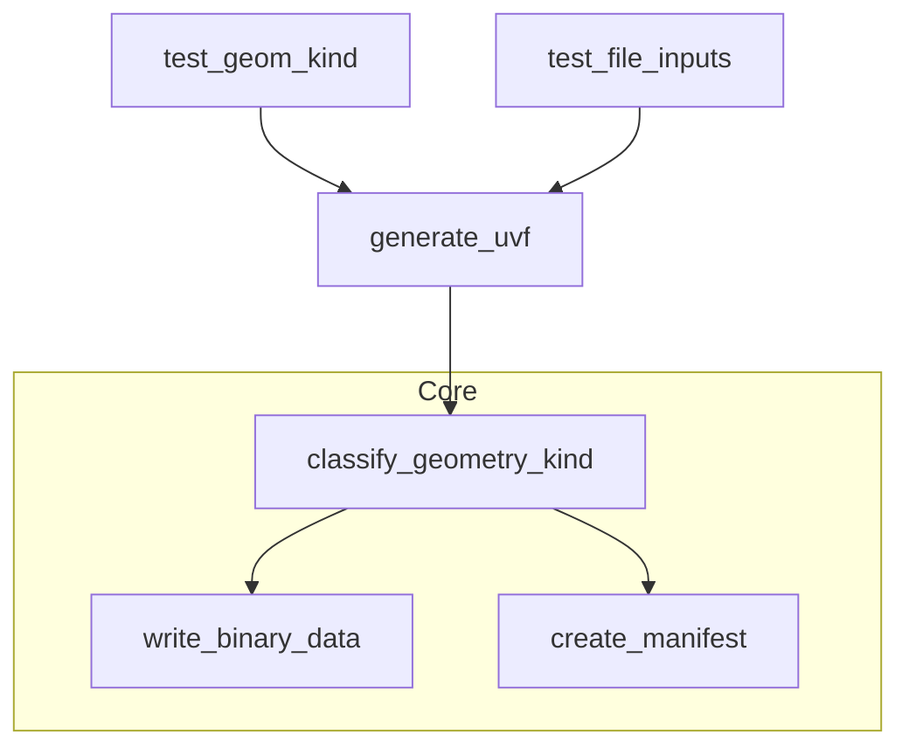
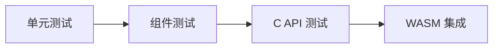

# 测试策略分析

## 现有测试概览

| 可执行 | 源文件 | 关注点 |
|--------|--------|--------|
| `uvf_tests` | `tests/test_geom_kind.cpp` | 构造三种最小几何 (streamline/slice/surface) 验证分类与 manifest 输出 `geomKind` |
| `uvf_file_tests` | `tests/test_file_inputs.cpp` | 读取真实测试数据样本 (slice/line/surface) 验证输出目录 manifest 中 `geomKind` |

### 覆盖路径 (Mermaid)


## 已覆盖的功能点
- 基础 UVF 生成 (单文件)
- 几何分类核心 heuristics (slice, streamline, surface)
- Manifest 读取最小验证 (字符串查找 `geomKind`)

## 未覆盖 / 风险区域
| 区域 | 风险 | 建议测试 |
|------|------|----------|
| isosurface 分类 | 关键字分支未验证 | 构造含 `isoValue` 字段数据 |
| segmentation (FaceIndex) | 多 Face manifest 逻辑 | 伪造带 CellData=FaceIndex + FieldData=FaceIdMapping polydata |
| structured 模式 | 字段分组、多个 bin | 调用 `generate_structured_uvf` 校验层级与 faces 数量 |
| multi-file 目录 | 分组依据标签命名 | 临时创建含混合前缀文件目录运行 `process_directory_structure` |
| 错误路径 | 无文件/空数据/写入失败 | 传递不存在路径, 空 polydata, 只读输出目录 |
| C API 状态 | 统计正确性/串扰 | 多次调用不同 API 验证 last_* 字段更新 |
| WASM 绑定 | JS 包装函数映射 | 轻量 node (wasm) smoke test getVersion & 错误处理 |
| 性能回归 | 大数据集 | 基准/时间上限 (后续) |
| 文件计数工具 | 混合扩展名目录 | 构造含 .txt/.vtk/.vtp 目录校验数量 |

## 建议测试分层


### 单元 (Unit)
- classify_geometry_kind: 抽取逻辑为纯函数后进行多案例输入测试
- Face segmentation: 构造 FaceIndex 映射数组

### 组件 (Component)
- generate_structured_uvf: 对合成包含特定字段名 polydata 输出 manifest 解析校验组 ID
- generate_multi_file_uvf: 临时目录 + 三个不同命名文件

### C API 层
- 依次调用 parse_vtp -> generate_uvf -> generate_uvf_structured -> directory, 验证 op_type 演变

### WASM Smoke
- 在 CI 中下载预编译 wasm 模块 (`build_wasm.sh`) 后执行 Node.js 脚本：装载 -> 断言 UVF.UVF.getVersion()

## Manifest 校验辅助
引入 JSON 库后可定义 schema：
```json
{
  "type":"array",
  "items": {"type":"object","required":["id","type"]}
}
```
并在测试中加载解析并快速验证关键字段存在。

## 示例新增测试想法 (伪代码)
```cpp
TEST(StructuredGroups, SliceAndIso){
  auto poly = makePolyWithFields({"slice_XY", "isoValue"});
  ASSERT_TRUE(generate_structured_uvf(poly, "out_struct"));
  auto manifest = readFile("out_struct/manifest.json");
  ASSERT_NE(manifest.find("slices"), std::string::npos);
  ASSERT_NE(manifest.find("isosurfaces"), std::string::npos);
}
```

## 评估维度矩阵
| 维度 | 当前 | 目标 |
|------|------|------|
| 功能覆盖 | 约 30% (核心 happy path) | >85% 关键分支 & 错误路径 |
| 失败注入 | 无 | 临时目录权限 / 空数据 / 非法扩展名 |
| 回归稳定性 | 手动 | CI 自动作业 (GitHub Actions) |
| 代码度量 | 未启用 | 行/分支覆盖 (gcov/llvm-cov) |

## 落地路线
1. 抽取分类函数 -> 增加独立单元测试。
2. 新增 segmentation 用例；构造含 FaceIndex 的 polydata builder 工具函数。
3. 增加 structured & directory 模式测试。
4. 引入 nlohmann_json 解析 manifest 验证结构，而非 substring 搜索。
5. 配置 CI：构建 native + wasm + 运行测试。

---
*更新日期：2025-10-10*
