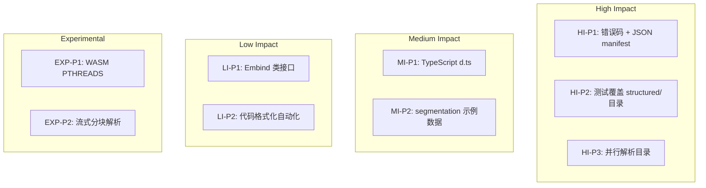

# 路线图 (建议草案)

## 版本阶段
| 阶段 | 目标 | 关键交付 |
|------|------|----------|
| 0.2.x | 稳定基础 API + 测试扩充 | 分类单元测试、structured & directory 覆盖、Manifest schema 初版 |
| 0.3.x | 数据/结构改进 | JSON 库接入、错误码、segmentation 完整文档 |
| 0.4.x | 性能与并行 | 目录模式并行、FaceIndex 优化、对齐写入、压缩选项 |
| 0.5.x | Wasm 增强 | TypeScript 定义、Promise 封装、并行 (PTHREADS) 试验 |
| 0.6.x | 生态与扩展 | Python 绑定、`uvf_inspect`、CI 覆盖报告稳定 |
| 1.0.0 | API 稳定 | 版本化 manifest schema、错误语义冻结、性能基线文档 |

## 优先级四象限

## 关键史诗 (Epics)
| Epic | 描述 | 交付指标 |
|------|------|----------|
| Manifest 标准化 | 统一 JSON 结构 + Schema | schema.json + 校验工具 + 100% 测试通过 |
| 稳定 C API | 引入错误码/版本宏/Handle | API 文档 + 样例 + 向后兼容策略 |
| 多文件性能 | 并行和 I/O 优化 | 目录处理时间下降 >50% (10 文件基准) |
| Wasm DX 提升 | JS/TS 类型与工具 | d.ts + npm 包示例 + 文档 |
| 生态拓展 | Python & Inspect 工具 | pip 包 + uvf_inspect CLI |

## 依赖与风险
| 风险 | 描述 | 缓解措施 |
|------|------|----------|
| VTK wasm 构建复杂 | 编译耗时 & 体积大 | 缓存构建产物 / 文档化步骤 / CI 缓存 |
| Manifest 变更破坏兼容 | 前端加载失败 | schema 版本 + 向后兼容转换器 |
| 并发引入竞态 | 数据损坏/崩溃 | 单元 + TSAN 构建 / handle 隔离 |
| 大文件内存峰值 | Wasm FS 占用翻倍 | 分块写入 + 流式 API 设计 |

## 指标 (Metrics) 建议
| 指标 | 说明 | 基线 | 目标 |
|------|------|------|------|
| 目录模式吞吐 | N 文件 -> UVF 时间 | TBD | -50% (并行) |
| Manifest 解析失败率 | CI 解析错误数量 | 0 | 0 |
| 测试覆盖 (行/分支) | llvm-cov | ~30% | >80% 行, >70% 分支 |
| Wasm 包大小 | gzip 后 KB | TBD | 控制增长 (< +15% 每版本) |

## 退出准则 (1.0.0)
- 所有公共 API 有文档与示例。
- Manifest schema 有版本与迁移工具。
- 覆盖率达标且无未解决 CRITICAL 级别静态分析告警。
- 性能基准（10 多文件目录）较初始版本提升显著。

---
*更新日期：2025-10-10*
