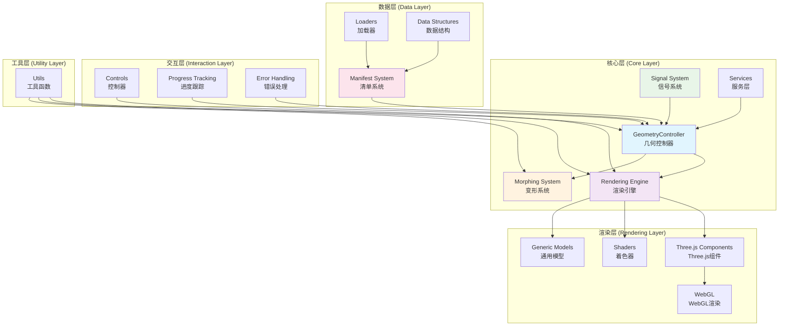
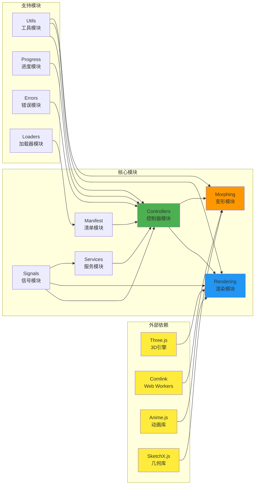
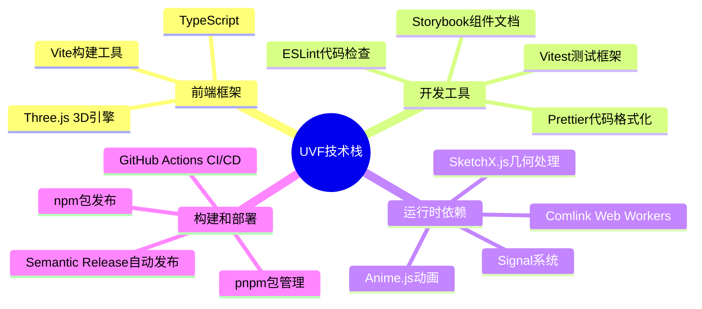

# 统一可视化框架 - 项目架构分析

## 项目概述
**统一可视化框架 (UVF)** 是一个用于在Web上展示3D可视化的通用框架，主要为科学计算和工程可视化提供支持。

## 整体架构图

**整体架构图说明：**
这个架构图展示了UVF框架的五层架构设计。核心层包含GeometryController作为主要业务逻辑控制器，它协调渲染引擎和变形系统，并接受信号系统和服务层的支持。数据层由清单系统管理数据描述，加载器负责数据获取，数据结构提供基础数据类型。渲染层基于Three.js构建，包含组件、着色器、通用模型，最终输出到WebGL。交互层提供用户控制接口、进度跟踪和错误处理机制。工具层为各个层级提供通用工具函数。整个架构体现了清晰的分层设计和关注点分离原则。

## 模块依赖关系图

**模块依赖关系图说明：**
这个依赖关系图清晰地展示了UVF框架中外部依赖、核心模块和支持模块之间的关系。外部依赖包括Three.js作为底层3D引擎、Comlink提供Web Workers支持、Anime.js提供动画能力、SketchX.js提供几何计算功能。核心模块之间形成了明确的依赖层次：信号模块为控制器、渲染和服务提供响应式能力；清单模块和服务模块为控制器提供数据和服务支持；控制器模块统一协调渲染和变形模块。支持模块为核心功能提供辅助：工具模块为多个核心模块提供通用函数，进度和错误模块为控制器提供状态管理，加载器模块为清单系统提供数据获取能力。

## 技术栈概览

## 代码组织结构

```mermaid
graph TD
    A[src/] --> B[controllers/]
    A --> C[rendering/]
    A --> D[morphing/]
    A --> E[manifest/]
    A --> F[signals/]
    A --> G[services/]
    A --> H[utils/]
    A --> I[progress/]
    A --> J[errors/]
    A --> K[loaders/]
    
    B --> B1[GeometryController.ts<br/>主控制器]
    B --> B2[GroupManager.ts<br/>组管理器]
    
    C --> C1[components/<br/>渲染组件]
    C --> C2[adapters/<br/>适配器]
    C --> C3[genericModels/<br/>通用模型]
    C --> C4[renderers/<br/>渲染器]
    C --> C5[shaders/<br/>着色器]
    
    D --> D1[core/<br/>核心变形逻辑]
    D --> D2[constraints/<br/>约束系统]
    D --> D3[transformers/<br/>变换器]
    D --> D4[interaction/<br/>交互处理]
    
    E --> E1[models/<br/>模型定义]
    E --> E2[properties/<br/>属性系统]
    E --> E3[signals/<br/>信号集成]
    
    style A fill:#e3f2fd
    style B fill:#f1f8e9
    style C fill:#fce4ec
    style D fill:#fff3e0
    style E fill:#f3e5f5
```

## 架构特点总结

### 🏗️ 分层架构
- **控制层**: 负责整体业务逻辑和状态管理
- **渲染层**: 处理3D图形渲染和视觉效果
- **数据层**: 管理几何数据和模型信息
- **交互层**: 处理用户交互和系统响应

### 🔄 响应式设计
- 基于Signal系统的响应式状态管理
- 自动的依赖追踪和更新传播
- 高效的变更检测和渲染优化

### 🧩 模块化设计
- 清晰的模块边界和职责分离
- 可插拔的组件架构
- 支持按需加载和扩展

### ⚡ 性能优化
- Web Workers支持并行计算
- 几何数据的高效打包和传输
- GPU加速的渲染管道

### 🛠️ 开发体验
- 完整的TypeScript类型支持
- 全面的测试覆盖
- 详细的文档和示例