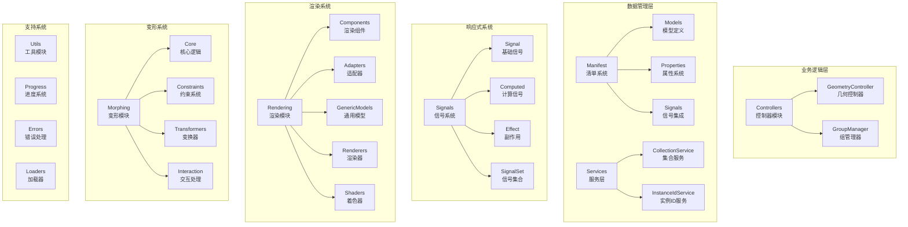
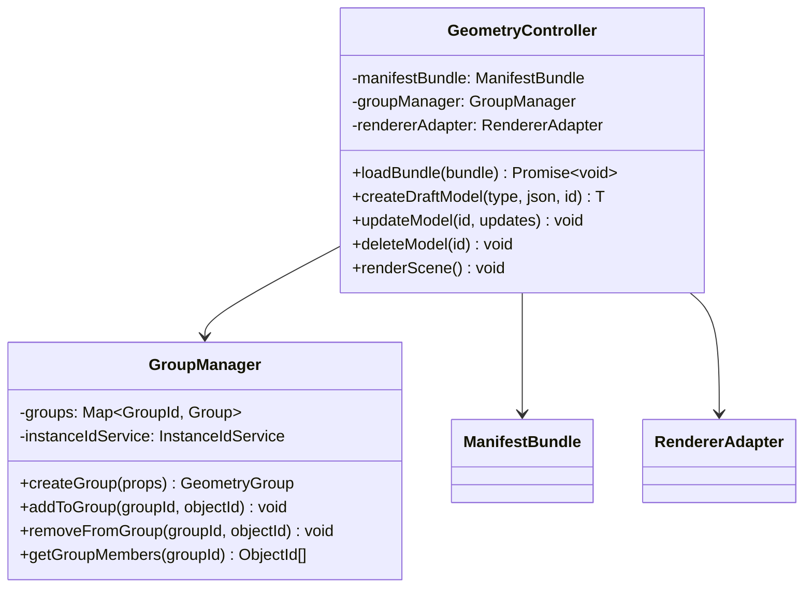
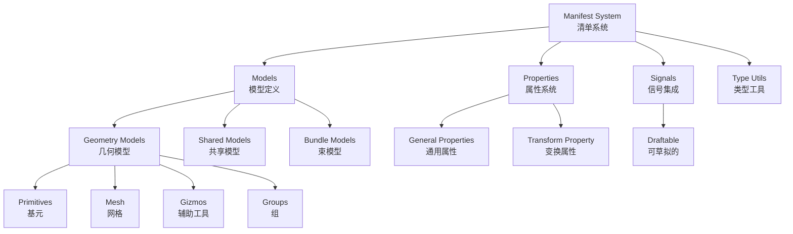
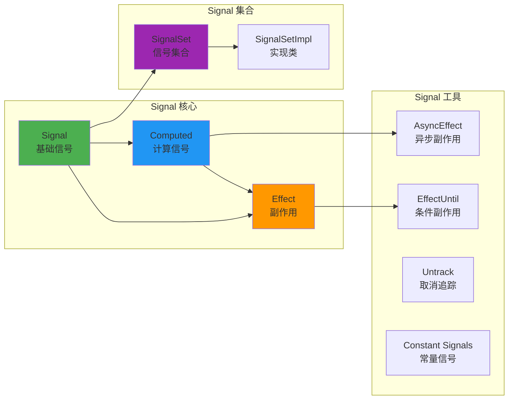
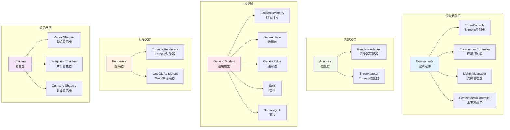
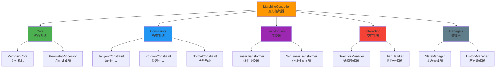
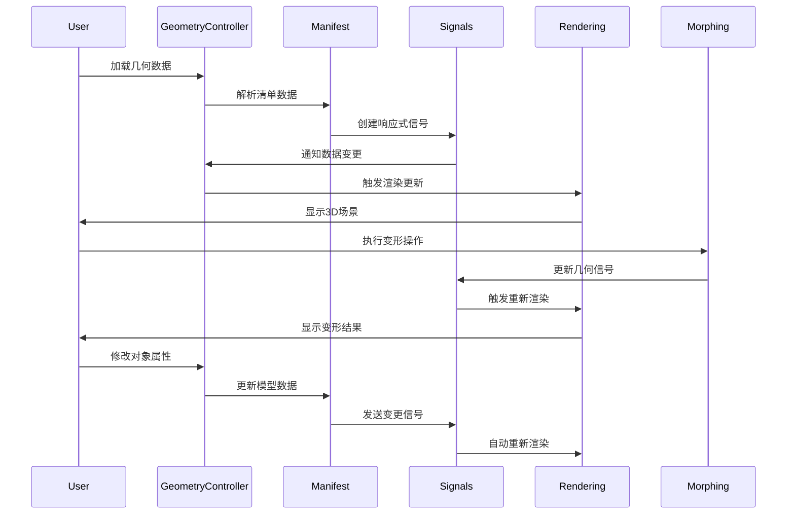

# 统一可视化框架 - 代码组织与模块职责分析

## 模块职责概览



**模块职责概览说明：**
这个组织结构图展示了UVF框架的六大功能模块及其内部组织。业务逻辑层包含Controllers模块，其中GeometryController负责几何对象的生命周期管理，GroupManager处理对象分组逻辑。数据管理层分为Manifest清单系统和Services服务层，前者定义模型、属性和信号集成，后者提供集合服务和实例ID管理。响应式系统通过Signals模块实现，包含基础信号、计算信号、副作用和信号集合等核心概念。渲染系统是最复杂的模块，包含渲染组件、适配器、通用模型、渲染器和着色器五个子系统。变形系统支持动态几何变换，包含核心逻辑、约束系统、变换器和交互处理。支持系统提供横切关注点，包括工具函数、进度跟踪、错误处理和数据加载功能。
    
    style A fill:#e1f5fe
    style B fill:#f3e5f5
    style D fill:#e8f5e8
    style E fill:#fff3e0
    style F fill:#fce4ec
    style G fill:#f1f8e9
```

## 核心模块详细分析

### 🎮 Controllers (控制器模块)



**Controllers模块类图说明：**
这个类图展示了控制器模块的核心类结构。GeometryController作为主控制器，维护着清单束(ManifestBundle)、组管理器(GroupManager)和渲染适配器(RendererAdapter)的引用，提供了完整的几何对象生命周期管理接口：从加载数据束、创建草稿模型、更新模型、删除模型到渲染场景。GroupManager专门负责对象分组功能，维护组到对象的映射关系，并依赖实例ID服务来管理唯一标识。两个类之间的组合关系体现了单一职责原则，GeometryController专注于几何逻辑，GroupManager专注于分组逻辑。

**职责**:
- 🎯 **GeometryController**: 核心业务逻辑控制器，管理整个几何场景的生命周期
- 👥 **GroupManager**: 管理几何对象的分组和层次结构

### 📊 Manifest (清单系统)



**Manifest系统结构说明：**
这个树状图展示了清单系统的完整组织结构。Models模块包含三大类模型定义：几何模型(包括基元、网格、辅助工具、组)、共享模型和束模型，形成了完整的几何对象类型体系。Properties模块管理通用属性和变换属性，为所有几何对象提供标准化的属性接口。Signals模块提供可草拟的信号支持，使得清单对象可以与响应式系统无缝集成。Type Utils模块提供类型检查和验证功能，确保数据的正确性。整个清单系统为上层控制器提供了完整的数据模型定义和类型安全保障。

**职责**:
    D --> D2[Manifest Object Signal<br/>清单对象信号]
    
    style A fill:#f3e5f5
    style B fill:#e8f5e8
    style C fill:#fff3e0
    style D fill:#fce4ec
```

**职责**:
- 📋 **Models**: 定义所有几何对象的数据结构和类型
- ⚙️ **Properties**: 管理对象属性和变换信息
- 📡 **Signals**: 将清单系统与响应式系统集成
- 🔧 **Type Utils**: 提供类型检查和验证工具

### 🚀 Signals (响应式系统)



**Signals响应式系统说明：**
这个模块化图展示了信号系统的完整架构。Signal核心包含三个基础组件：基础信号负责存储和通知状态变化，计算信号基于其他信号派生新值，副作用系统响应信号变化执行相应操作。Signal集合提供了集合类型的响应式支持，通过SignalSet接口和SignalSetImpl实现类来管理。Signal工具扩展了基础功能，提供异步副作用、条件副作用、取消追踪和常量信号等高级特性。整个系统通过清晰的依赖关系连接，形成了完整的响应式编程基础设施。

**职责**:
- 📊 **Signal**: 响应式状态的基础实现
- 🧮 **Computed**: 自动计算的派生状态
- ⚡ **Effect**: 处理副作用和自动更新
- 📦 **SignalSet**: 管理信号集合和批量操作

### 🎨 Rendering (渲染系统)



**职责**:
- 🎮 **Components**: 提供渲染相关的UI组件和控制器
- 🔌 **Adapters**: 抽象不同渲染引擎的接口差异
- 📐 **Generic Models**: 定义与渲染引擎无关的几何模型
- 🖼️ **Renderers**: 具体的渲染引擎实现
- 🎨 **Shaders**: GPU着色器程序

### 🔄 Morphing (变形系统)



**职责**:
- 🎯 **MorphingController**: 变形操作的主控制器
- ⚙️ **Core**: 变形算法的核心实现
- 🔒 **Constraints**: 变形过程中的约束条件
- 🔄 **Transformers**: 各种几何变换算法
- 🖱️ **Interaction**: 用户交互和操作处理
- 📊 **Managers**: 状态和历史管理

## 模块间交互流程



## 代码质量特点

### 🏗️ 架构优势
- **职责清晰**: 每个模块都有明确的职责边界
- **低耦合**: 模块间通过接口和信号系统通信
- **高内聚**: 相关功能集中在同一模块内
- **可扩展**: 支持插件化的渲染器和变换器

### 📏 设计原则
- **单一职责原则**: 每个类和模块专注于单一功能
- **开闭原则**: 对扩展开放，对修改封闭
- **依赖倒置**: 依赖抽象而非具体实现
- **组合优于继承**: 通过组合构建复杂功能

### 🔧 技术特色
- **类型安全**: 完整的TypeScript类型定义
- **响应式**: 基于Signal的自动更新机制
- **异步友好**: 支持Promise和Web Workers
- **性能优化**: GPU加速和数据打包传输