# 统一可视化框架 - 数据流与状态管理分析

## 响应式系统架构

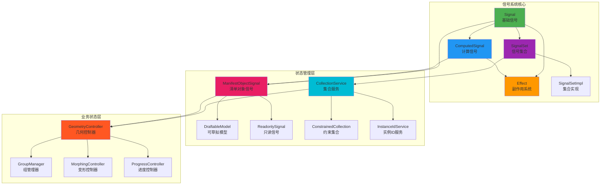

**响应式系统架构说明：**
这个架构图展示了UVF框架中完整的响应式状态管理体系。最底层是信号系统核心，包含基础Signal、计算信号ComputedSignal、副作用系统Effect和信号集合SignalSet，它们构成了响应式编程的基础设施。中间层是状态管理层，通过ManifestObjectSignal管理清单对象状态，CollectionService处理集合数据。最上层是业务状态层，由GeometryController统领几何数据管理、GroupManager处理分组逻辑、MorphingController控制变形动画、ProgressController跟踪操作进度。整个架构体现了从基础响应式能力到具体业务逻辑的分层设计思想。

## 数据流向分析

### 📊 自顶向下的数据流

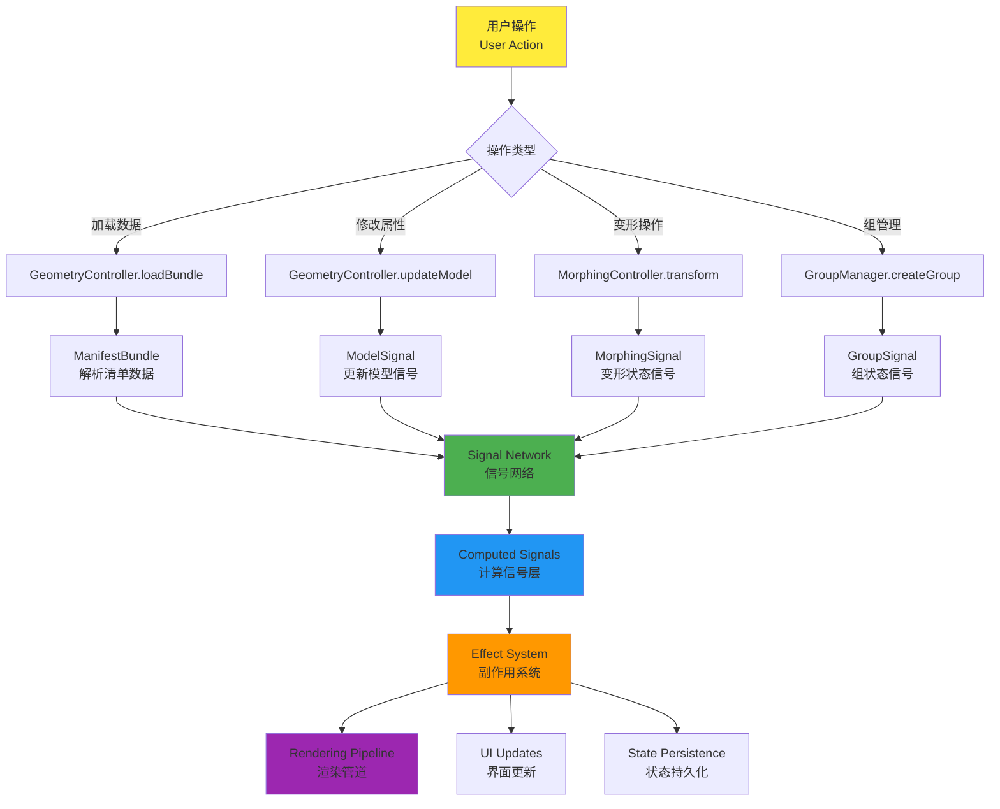

**自顶向下数据流说明：**
此流程图描述了从用户操作到最终渲染的完整数据流路径。用户操作首先被分类处理，不同类型的操作（加载数据、修改属性、变形操作、组管理）会触发相应的控制器方法。这些操作产生的数据变化会被转换为特定的信号（ManifestBundle、ModelSignal、MorphingSignal、GroupSignal），所有信号汇聚到信号网络中心。通过计算信号层进行数据转换和派生，最终通过副作用系统触发渲染管道更新、界面刷新和状态持久化。这种单向数据流确保了状态变化的可预测性和调试的便利性。

### 🔄 响应式更新循环

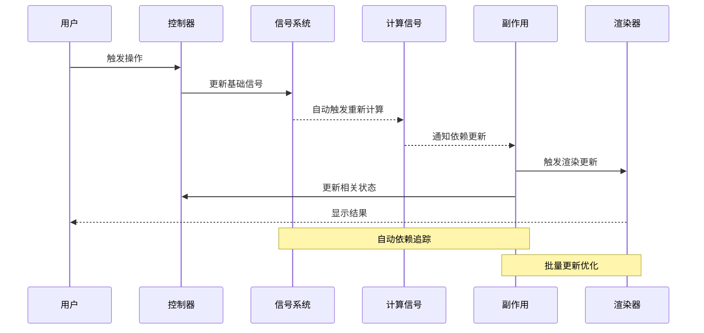

**响应式更新循环说明：**
这个时序图展示了响应式系统中一次完整的更新循环。当用户触发操作时，控制器立即更新相关的基础信号，信号系统通过自动依赖追踪机制触发所有依赖的计算信号重新计算，计算信号的变化进一步通知副作用系统执行相应的副作用函数。副作用系统会触发渲染器更新视觉显示，同时可能更新控制器中的相关状态。整个过程通过批量更新优化来避免不必要的重复计算，确保性能的同时保持状态的一致性。

## 状态管理模式

### 🏗️ 分层状态架构

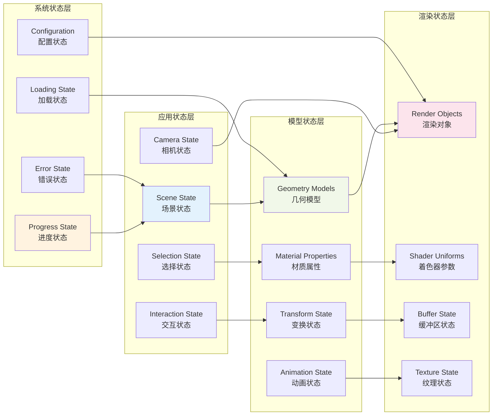

**分层状态架构说明：**
这个架构图展示了UVF框架中四层状态管理结构。应用状态层处理场景级别的全局状态，包括场景状态、相机状态、选择状态和交互状态。模型状态层管理具体的3D对象状态，包含几何模型、材质属性、变换状态和动画状态。渲染状态层直接对应GPU渲染资源，管理渲染对象、着色器参数、缓冲区和纹理状态。系统状态层提供横切关注点，管理进度、错误、加载状态和配置信息。各层之间通过明确的依赖关系连接，形成了从高级抽象到底层实现的清晰分层。

### 📡 信号系统详解

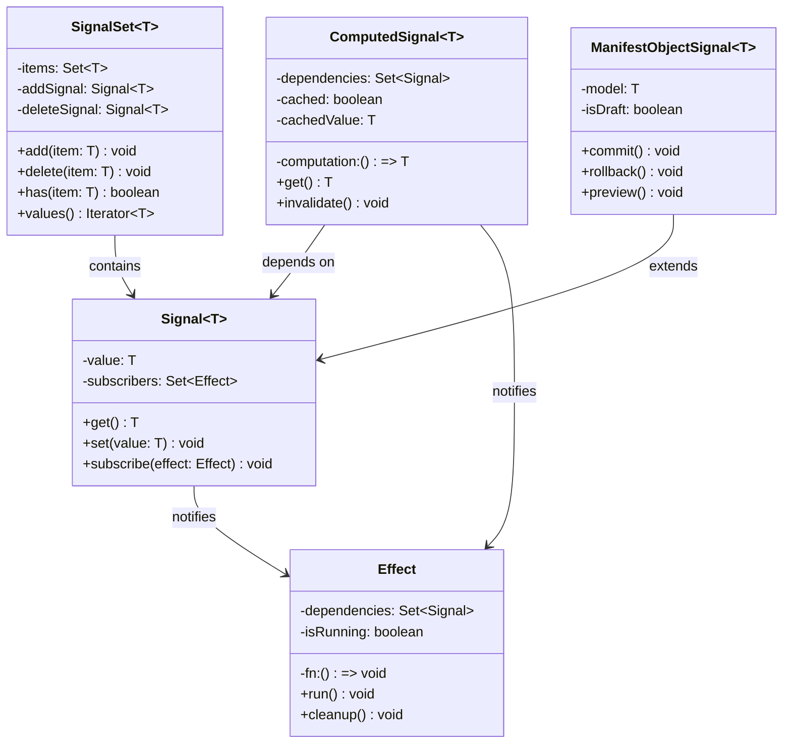

**信号系统详解说明：**
这个类图详细展示了信号系统的核心类结构和它们之间的关系。Signal是基础信号类，维护值和订阅者列表，提供基本的get/set/subscribe操作。ComputedSignal是计算信号，通过computation函数从其他信号派生值，支持缓存和失效机制。Effect类封装副作用函数，当依赖的信号变化时自动执行。SignalSet提供信号化的集合操作，内部使用addSignal和deleteSignal来通知集合变化。ManifestObjectSignal扩展了基础Signal，增加了草稿模式支持，允许commit/rollback/preview操作。这些类共同构成了一个完整的响应式编程框架。

## 数据变更传播机制

### ⚡ 变更传播流程

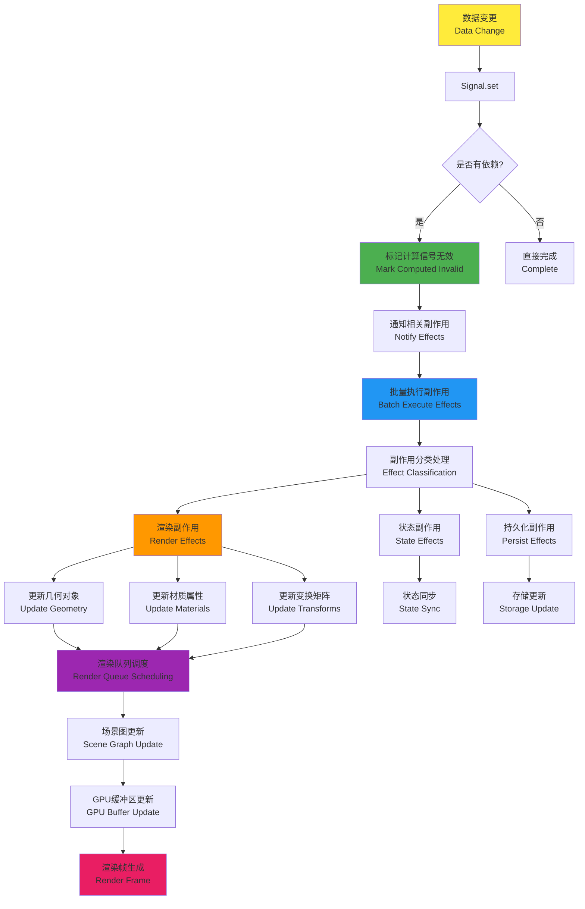

### 🔄 依赖追踪机制

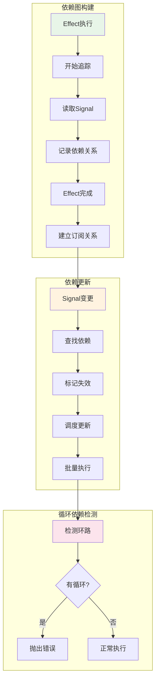

**变更传播流程说明：**
这个垂直流程图详细展示了从数据变更到最终渲染的完整传播路径。当数据发生变更时，首先调用Signal.set()更新信号值，系统检查是否有依赖的计算信号需要标记为无效。如果存在依赖关系，会通知所有相关的副作用函数并批量执行。副作用按类型分为三个并行分支：渲染副作用、状态副作用和持久化副作用。

**渲染分支的详细处理**：渲染副作用进一步细分为几何对象更新、材质属性更新和变换矩阵更新三个子流程。这些更新汇聚到渲染队列调度器，然后依次进行场景图更新、GPU缓冲区更新，最终生成渲染帧。这种分层处理确保了3D渲染的高效性和准确性，同时保持了状态变更的一致性传播。

## 状态持久化策略

### 💾 数据持久化层次

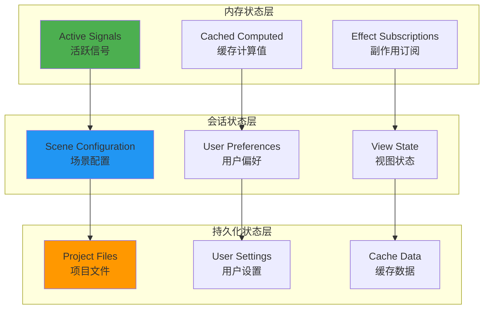

**数据持久化层次说明：**
这个图表展示了三层数据持久化架构。内存状态层包含运行时的活跃信号、缓存的计算值和副作用订阅关系，这些数据存在于内存中，提供最快的访问速度。会话状态层管理会话级别的数据，如场景配置、用户偏好和视图状态，这些数据在会话期间保持，但可能在应用重启后丢失。持久化状态层存储需要长期保存的数据，包括项目文件、用户设置和缓存数据，这些数据保存在磁盘或远程存储中。三层之间有明确的数据流向，从内存到会话再到持久化，确保了数据的合理分层和性能优化。

### 🔄 状态同步机制

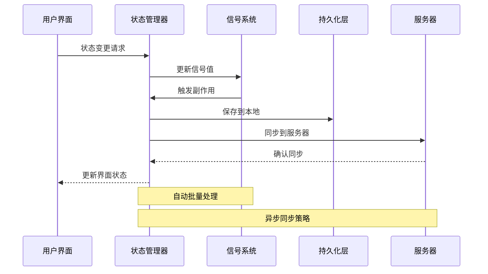

**状态同步机制说明：**
这个时序图展示了状态同步的完整流程。当用户界面发起状态变更请求时，状态管理器负责更新信号系统中的相应信号值。信号变更会触发相关的副作用函数，状态管理器接收到副作用通知后，会同时进行本地持久化和服务器同步。本地持久化确保数据的即时保存，而服务器同步则通过异步方式确保数据的远程备份和多端同步。整个过程中，信号系统提供自动批量处理能力，避免频繁的小量更新，状态管理器采用异步同步策略，确保用户界面的响应性不受网络延迟影响。

## 性能优化特性

### ⚡ 批量更新优化

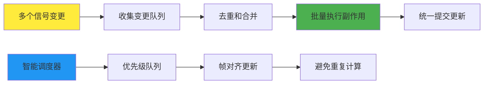

### 🚀 内存管理策略

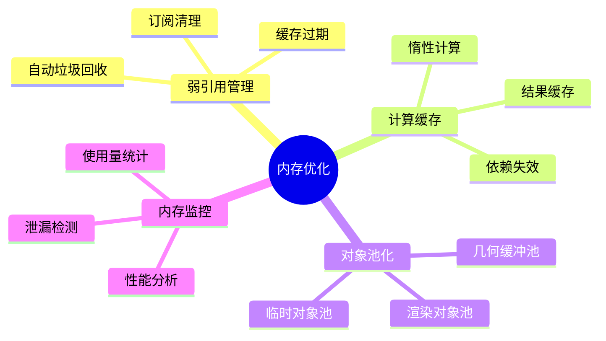

## 状态管理最佳实践

### ✅ 设计原则
- **单向数据流**: 数据从上到下流动，事件从下到上传播
- **不可变状态**: 通过信号系统保证状态的一致性和可预测性
- **最小化状态**: 只存储必要的状态，其他通过计算得出
- **清晰的边界**: 明确的状态管理边界和职责分离

### 🎯 关键特性
- **自动依赖追踪**: Signal系统自动管理依赖关系
- **批量更新**: 优化性能，避免不必要的重复计算
- **类型安全**: 完整的TypeScript类型支持
- **调试友好**: 清晰的状态变更追踪和调试工具