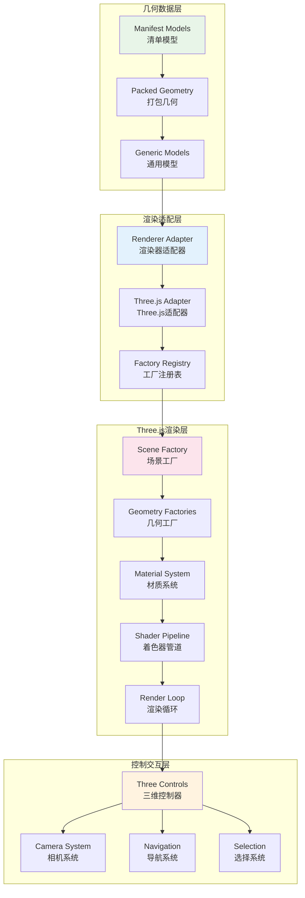
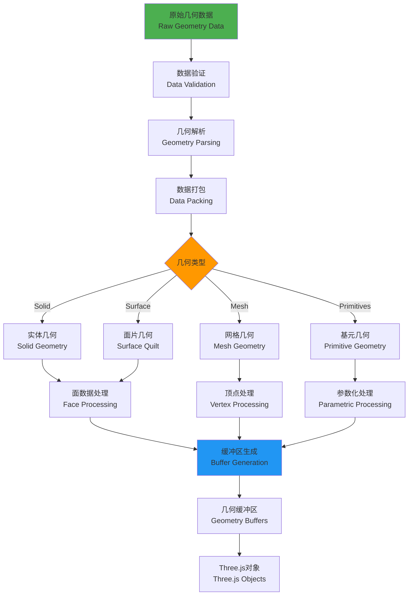
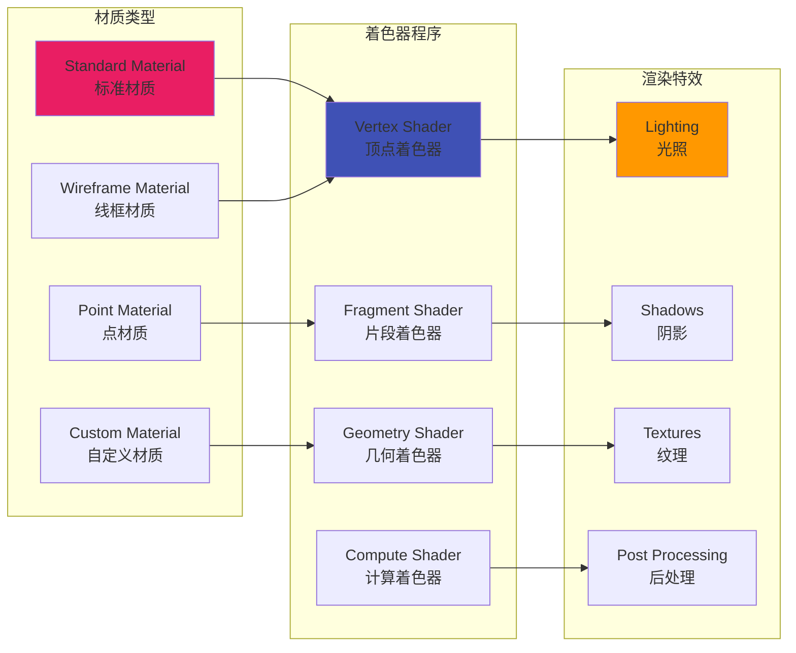
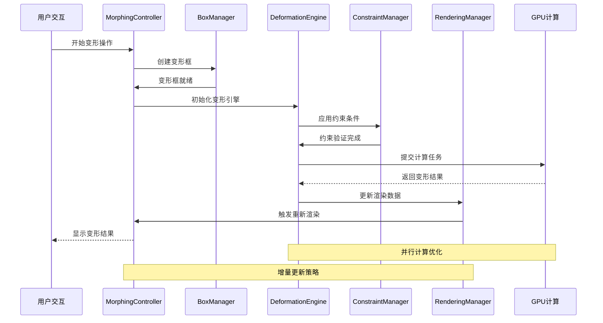
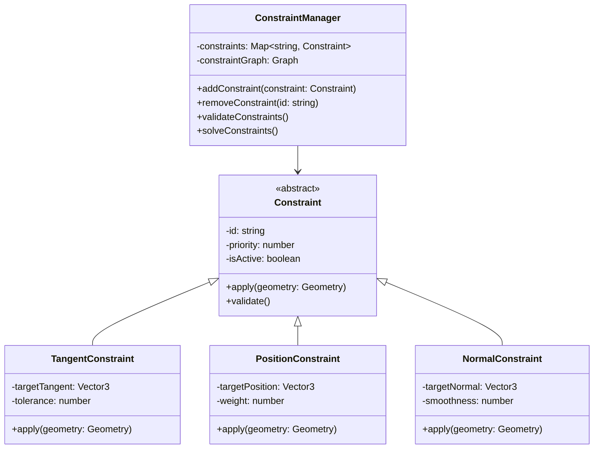
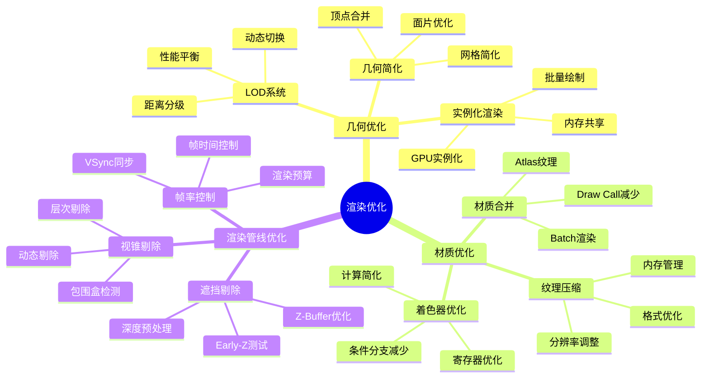
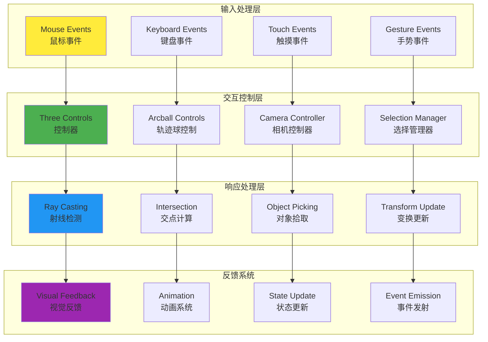
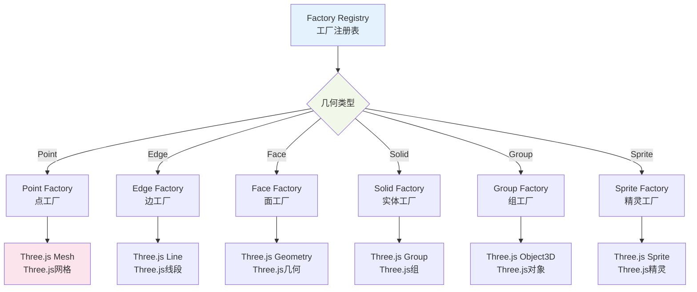
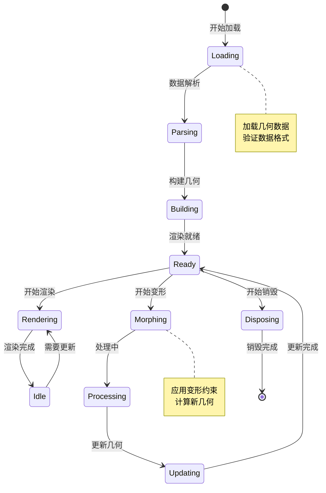

# 统一可视化框架 - 3D渲染管道与处理流程分析

## 渲染系统架构

**渲染系统架构说明：**
这个四层渲染架构展示了从数据到最终显示的完整处理流程。几何数据层将清单模型通过打包几何转换为通用模型，实现了数据的标准化表示。渲染适配层通过渲染器适配器和Three.js适配器将框架无关的几何数据适配到具体的渲染引擎，工厂注册表管理各种几何类型的创建策略。Three.js渲染层包含完整的渲染管道：场景工厂负责3D场景构建，几何工厂处理各种几何对象创建，材质系统管理视觉外观，着色器管道实现GPU渲染，渲染循环驱动持续的画面更新。控制交互层提供用户交互能力，包括三维控制器、相机系统、导航系统和选择系统，让用户可以与3D场景进行丰富的交互。

## 3D渲染管道详解

### 🏗️ 几何处理管道

**几何处理管道说明：**
这个流程图展示了从原始几何数据到可渲染对象的完整处理管道。首先对原始几何数据进行验证和解析，然后根据不同的几何类型(实体、面片、网格、基元)采用不同的处理策略。实体几何和面片几何通过面数据处理，网格几何通过顶点处理，基元几何通过参数化处理。最终所有处理后的数据都转换为几何缓冲区，创建对应的Three.js对象。这种分类处理的方式确保了不同类型几何数据的高效处理和优化。

### 🎨 材质与着色器系统

## 变形系统架构

### 🔄 变形处理流程

### 🎯 变形约束系统

## 渲染性能优化

### ⚡ 渲染优化策略

### 🎮 交互系统架构

## Three.js集成架构

### 🏭 工厂模式系统

### 📊 渲染状态管理

## 渲染管道关键特性

### 🎯 核心优势
- **模块化设计**: 清晰的渲染管道分层，支持不同渲染引擎
- **GPU加速**: 充分利用GPU并行计算能力，提升渲染性能
- **响应式更新**: 基于Signal系统的自动渲染更新机制
- **交互友好**: 丰富的3D交互控制和用户反馈

### ⚡ 性能特色
- **批量渲染**: 合并Draw Call，减少GPU状态切换
- **增量更新**: 只重新渲染变化的部分，避免全量更新
- **内存优化**: 智能的几何数据缓存和复用机制
- **异步计算**: 变形计算在Web Workers中并行执行

### 🔧 技术亮点
- **类型安全**: 完整的TypeScript类型定义和检查
- **可扩展性**: 支持自定义渲染器和着色器
- **调试友好**: 完善的错误处理和性能监控
- **跨平台**: 支持WebGL和WebGPU渲染后端