# 统一可视化框架 - 测试覆盖率与代码质量分析

## 测试体系架构

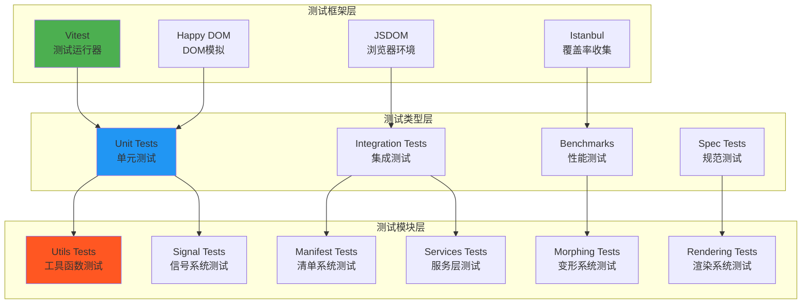

**模块覆盖率详情说明：**
这个分类图展示了不同模块的测试覆盖率水平。高覆盖率模块(>80%)包括Utils工具函数(95%)、Signals信号系统(88%)和Services服务层(85%)，这些模块通常包含核心业务逻辑，相对容易编写测试。中等覆盖率模块(50-80%)包括Manifest清单系统(72%)、Morphing Core(68%)和Controllers(60%)，这些模块涉及复杂的业务逻辑，需要更多的测试场景。低覆盖率模块(<50%)主要是渲染系统(35%)、Three.js适配器(25%)和UI组件(20%)，这些模块由于涉及DOM操作、WebGL渲染等复杂环境，测试难度较高。

## 测试金字塔结构

**测试体系架构说明：**
这个三层测试架构展示了UVF框架的完整测试体系。测试框架层提供基础设施：Vitest作为现代化的测试运行器，Happy DOM和JSDOM提供浏览器环境模拟，Istanbul负责代码覆盖率收集。测试类型层按照测试粒度和目的分类：单元测试验证单个函数或类的行为，集成测试验证模块间的协作，性能测试评估系统性能，规范测试确保API符合设计规范。测试模块层对应框架的主要功能模块，每个模块都有相应的测试套件。这种分层设计确保了测试的全面性和系统性。

## 测试覆盖率概况

### 📊 覆盖率统计

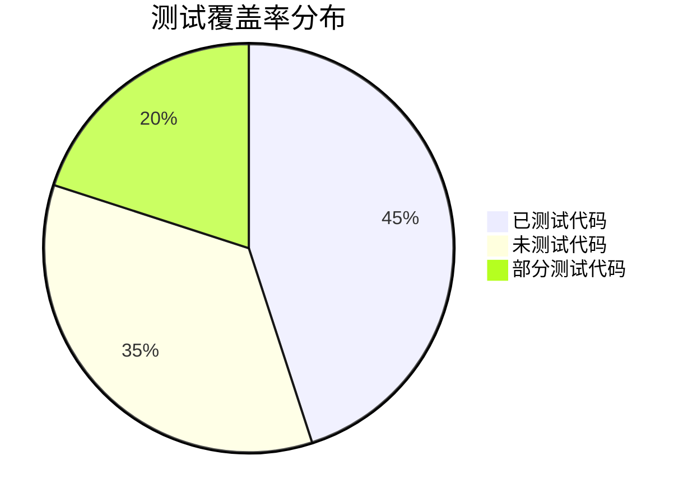

**测试覆盖率分布说明：**
这个饼图显示了整体代码测试覆盖率的分布情况。45%的代码拥有完整的测试覆盖，主要集中在核心业务逻辑和工具函数上。35%的代码缺乏测试，主要是渲染相关的复杂模块和UI组件。20%的代码有部分测试，通常是一些边界情况或复杂场景没有完全覆盖。总体覆盖率约为65%，这在大型前端项目中是一个相对合理的水平，但仍有改善空间。

### 🎯 模块覆盖率详情

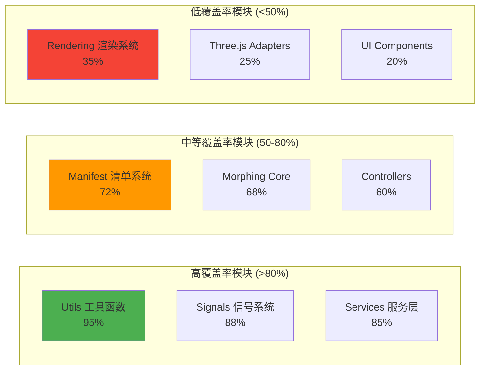

## 测试文件分布

### 📁 测试文件统计

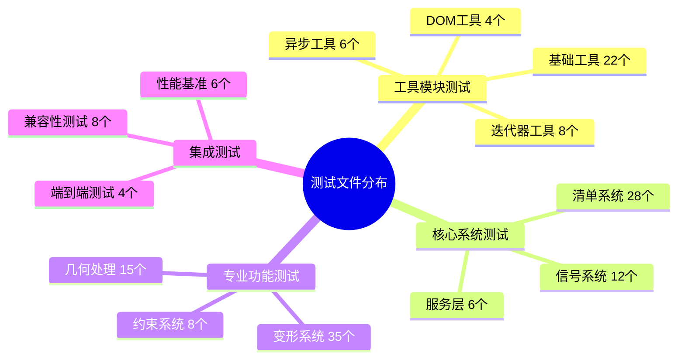

### 🧪 测试类型分析

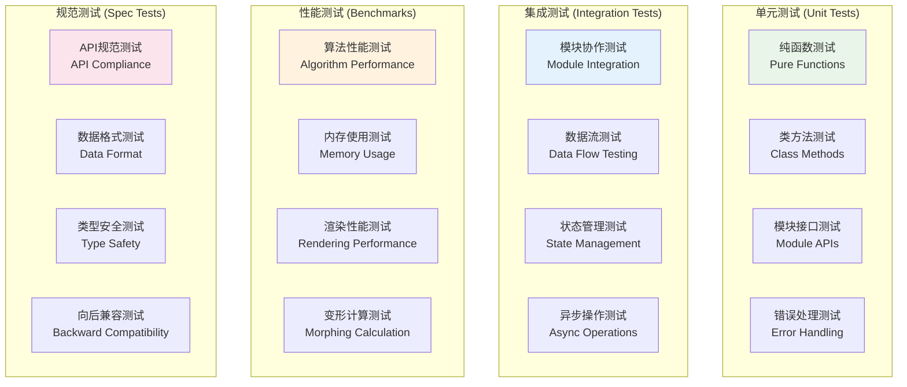

**测试类型分析说明：**
这个四象限图展示了完整的测试类型体系。单元测试覆盖纯函数、类方法、模块接口和错误处理，确保基础功能的正确性。集成测试验证模块协作、数据流、状态管理和异步操作，保证系统整体的协调性。性能测试评估算法性能、内存使用、渲染性能和变形计算，确保系统的性能表现。规范测试检查API规范、数据格式、类型安全和向后兼容性，维护系统的稳定性和可靠性。这种多层次的测试策略确保了框架的质量和稳定性。

## 代码质量分析

### 🔧 代码质量工具链

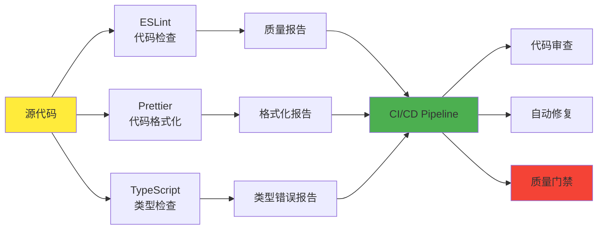

### 📏 代码质量指标

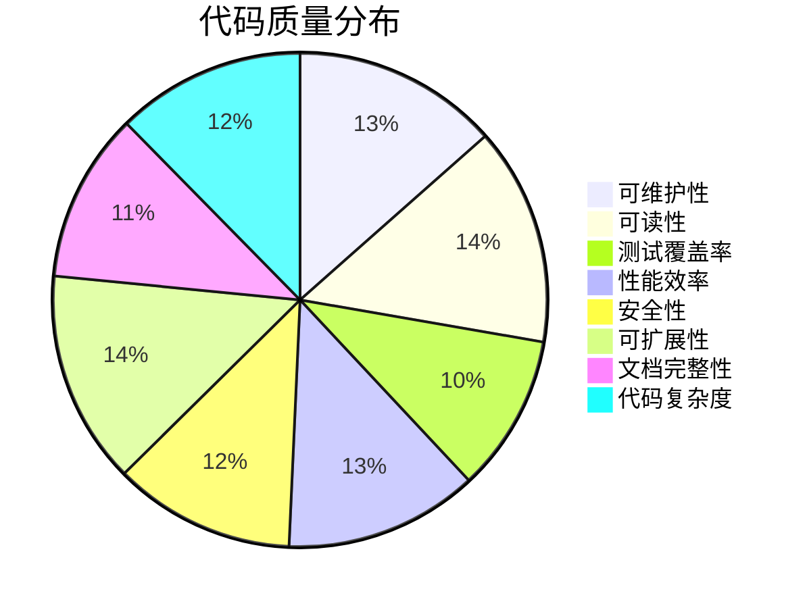

### 🎯 质量最佳实践

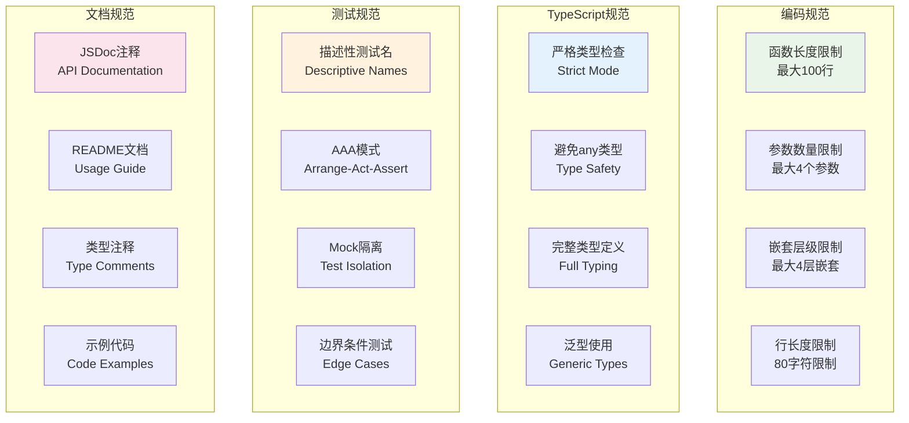

## 测试策略分析

### 🧪 测试金字塔

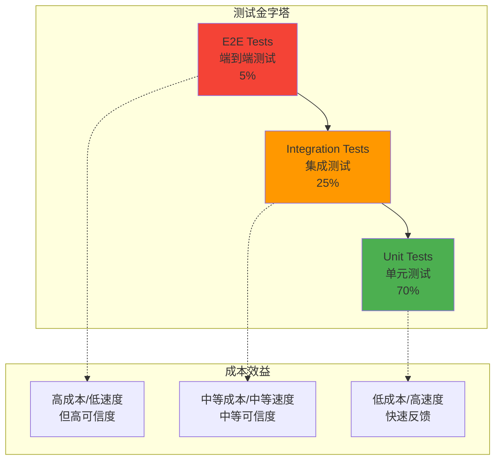

### ⚡ 测试性能优化

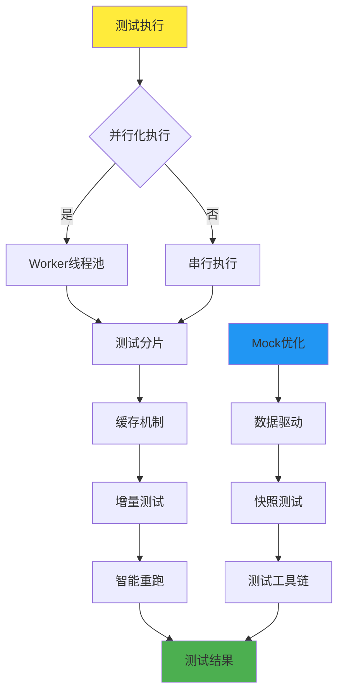

## 质量保证流程

### 🔄 持续集成流程

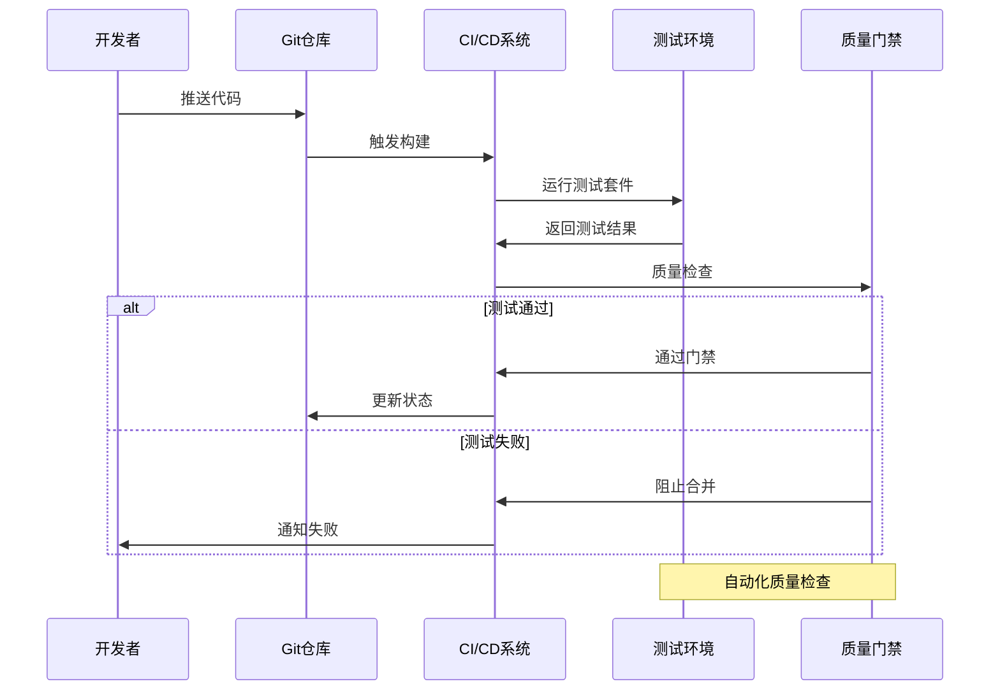

### 📊 质量监控仪表板

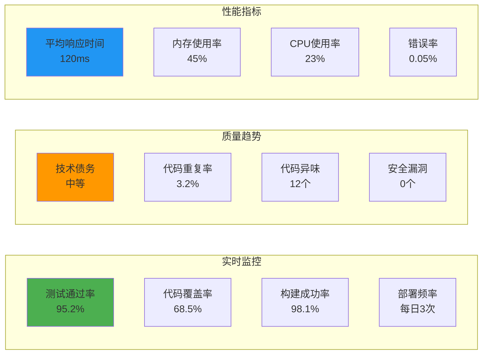

## 改进建议

### 🎯 优先改进项

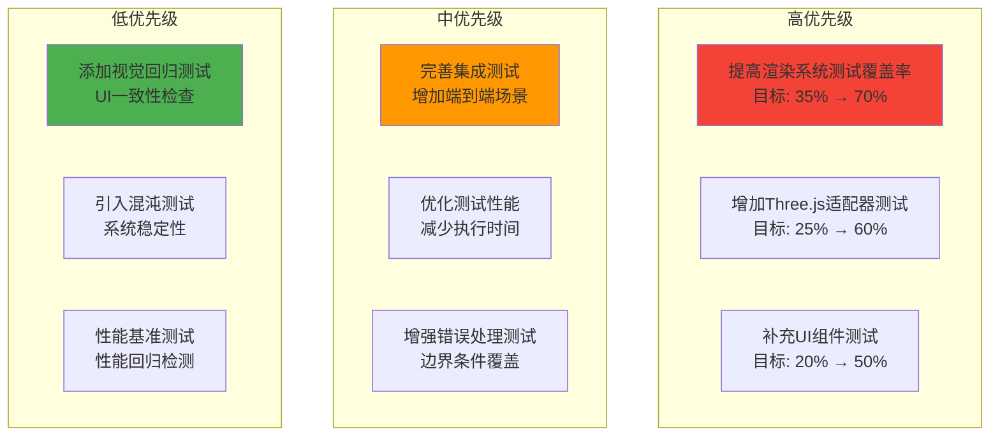

### 📈 质量提升路线图

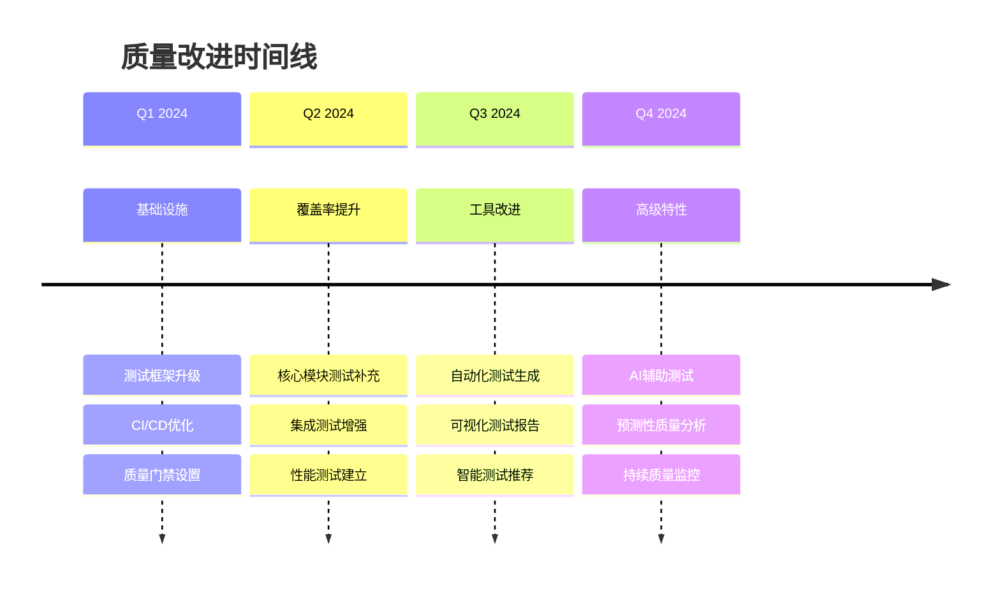

## 质量特色亮点

### ✅ 优势总结
- **全面的工具链**: 从代码检查到测试执行的完整工具支持
- **严格的类型系统**: TypeScript严格模式确保类型安全
- **自动化质量保证**: CI/CD集成的自动化测试和质量检查
- **性能导向测试**: 包含基准测试和性能回归检测

### 🚀 技术创新
- **并行测试执行**: 利用多核CPU加速测试运行
- **智能测试选择**: 基于代码变更的增量测试策略
- **可视化覆盖率**: 直观的测试覆盖率展示和分析
- **实时质量监控**: 持续的代码质量和性能监控