# 统一可视化框架 - 技术栈与依赖分析

## 技术栈概览

```mermaid
graph TB
    subgraph "前端技术栈"
        A1[TypeScript<br/>类型安全语言]
        A2[Vite<br/>构建工具]
        A3[Three.js<br/>3D图形引擎]
        A4[Signal Polyfill<br/>响应式系统]
    end
    
    subgraph "开发工具链"
        B1[ESLint<br/>代码检查]
        B2[Prettier<br/>代码格式化]
        B3[Vitest<br/>测试框架]
        B4[Storybook<br/>组件文档]
    end
    
    subgraph "运行时依赖"
        C1[Three.js<br/>3D渲染]
        C2[Anime.js<br/>动画库]
        C3[Comlink<br/>Web Workers]
        C4[SketchX.js<br/>几何处理]
    end
    
    subgraph "构建部署"
        D1[pnpm<br/>包管理器]
        D2[GitHub Actions<br/>CI/CD]
        D3[Semantic Release<br/>自动发布]
        D4[npm Registry<br/>包发布]
    end
    
    style A1 fill:#3178c6
    style A2 fill:#646cff
    style A3 fill:#000000
    style B1 fill:#4b32c3
    style C1 fill:#000000
    style D1 fill:#f69220
```

**技术栈概览说明：**
这个四象限技术栈图展示了UVF框架的完整技术生态系统。前端技术栈构成了框架的核心基础：TypeScript提供类型安全保障，Vite提供现代化构建能力，Three.js提供强大的3D图形渲染能力，Signal Polyfill实现响应式状态管理。开发工具链确保了代码质量和开发效率：ESLint进行代码静态分析，Prettier统一代码格式，Vitest提供现代化测试环境，Storybook支持组件文档化。运行时依赖提供了专业化能力：Three.js作为底层渲染引擎，Anime.js提供流畅动画效果，Comlink实现Web Workers通信，SketchX.js处理复杂几何计算。构建部署工具链支持自动化流程：pnpm提供高效包管理，GitHub Actions实现CI/CD自动化，Semantic Release自动化版本发布，npm Registry作为包分发平台。

## 依赖关系分析

### 📦 核心依赖架构

```mermaid
graph TD
    subgraph "生产依赖 (Dependencies)"
        A1["@flexcompute/sketchx.js<br/>几何计算引擎"]
        A2["three (peer)<br/>3D渲染引擎"]
        A3["animejs<br/>动画库"]
        A4["comlink<br/>Web Worker通信"]
        A5["signal-polyfill<br/>响应式信号"]
        A6["deep-equal<br/>深度比较"]
        A7["fp-ts<br/>函数式编程"]
        A8["troika-three-text<br/>3D文本渲染"]
    end
    
    subgraph "开发依赖 (DevDependencies)"
        B1["typescript<br/>类型系统"]
        B2["vite<br/>构建工具"]
        B3["vitest<br/>测试框架"]
        B4["eslint<br/>代码检查"]
        B5["prettier<br/>代码格式化"]
        B6["storybook<br/>组件文档"]
    end
    
    A1 --> C[UVF Framework]
    A2 --> C
    A3 --> C
    A4 --> C
    A5 --> C
    A6 --> C
    A7 --> C
    A8 --> C
    
    B1 -.-> C
    B2 -.-> C
    B3 -.-> C
    B4 -.-> C
    B5 -.-> C
    B6 -.-> C
    
    style A1 fill:#e8f5e8
    style B1 fill:#e3f2fd
    style C fill:#fff3e0
```

**核心依赖架构说明：**
这个依赖关系图清晰地展示了UVF框架的依赖结构。生产依赖包含了运行时必需的核心库：@flexcompute/sketchx.js提供专业的几何计算能力，three作为peer dependency避免版本冲突，animejs提供流畅的动画效果，comlink实现Web Worker通信，signal-polyfill提供响应式编程基础，deep-equal提供深度比较功能，fp-ts引入函数式编程范式，troika-three-text实现3D文本渲染。开发依赖包含了开发和构建过程中使用的工具：typescript提供类型系统，vite提供构建工具，vitest提供测试环境，eslint和prettier保证代码质量，storybook支持组件文档。实线箭头表示运行时依赖，虚线箭头表示开发时依赖，这种清晰的依赖分离有助于产出包的大小优化。

### 🔗 依赖版本管理

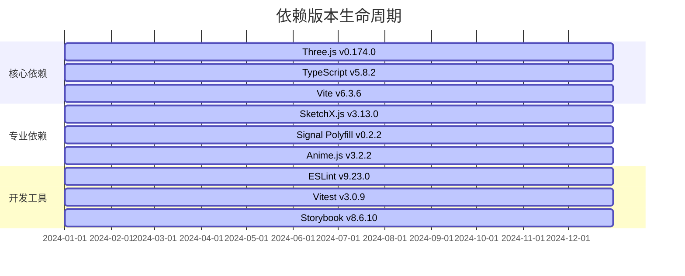

**依赖版本生命周期说明：**
这个甘特图展示了主要依赖库的版本生命周期管理。核心依赖部分包含最关键的基础技术：Three.js v0.174.0作为3D渲染核心，TypeScript v5.8.2提供类型系统支持，Vite v6.3.6作为现代化构建工具。专业依赖部分包含特定领域的专业库：SketchX.js v3.13.0处理复杂几何计算，Signal Polyfill v0.2.2实现响应式编程，Anime.js v3.2.2提供动画能力。开发工具部分包含开发过程中的支持工具：ESLint v9.23.0进行代码检查，Vitest v3.0.9提供测试环境，Storybook v8.6.10支持组件文档。所有依赖都维持在相对新的版本，体现了对现代化技术栈的追求和对安全性的重视。

## 技术选型分析

### 🎯 核心技术决策

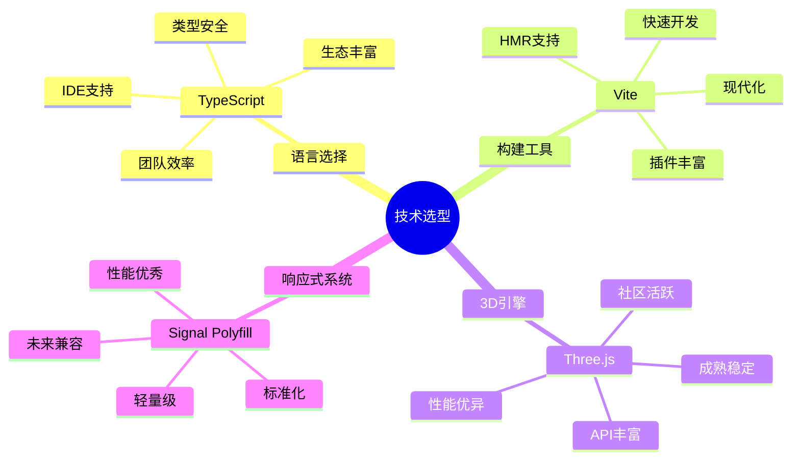

### ⚖️ 技术权衡分析

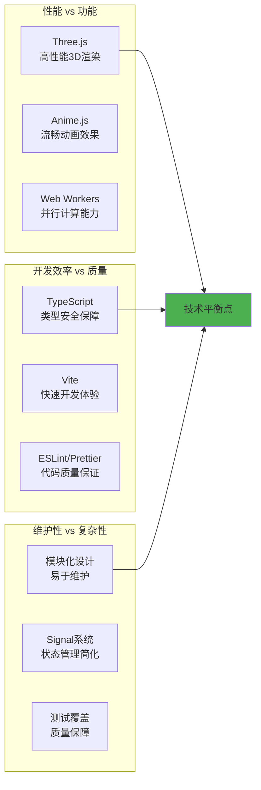

## 包管理策略

### 📋 包管理配置

```mermaid
graph TB
    subgraph "pnpm配置"
        A1[pnpm-workspace.yaml<br/>工作空间配置]
        A2[.npmrc<br/>注册表配置]
        A3[pnpm-lock.yaml<br/>锁定文件]
    end
    
    subgraph "依赖覆盖"
        B1[three: ^0.174.0<br/>固定Three.js版本]
        B2[brace-expansion: 2.0.2<br/>安全修复]
        B3[@eslint/plugin-kit: ^0.3.4<br/>插件兼容]
    end
    
    subgraph "发布配置"
        C1[GitHub Packages<br/>私有注册表]
        C2[npm Public<br/>公开发布]
        C3[Semantic Versioning<br/>版本管理]
    end
    
    A1 --> D[包管理系统]
    B1 --> D
    C1 --> D
    
    style D fill:#f69220
```

### 🔒 安全依赖管理

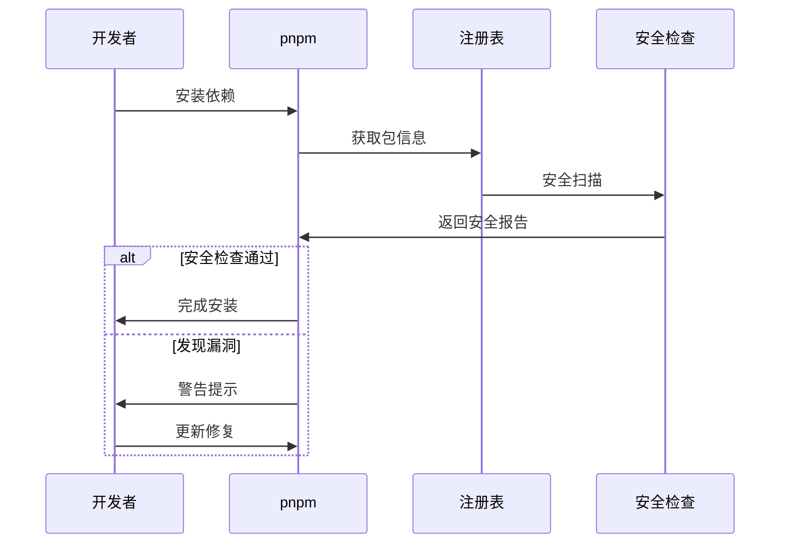

## 构建和部署架构

### 🏗️ 构建流水线

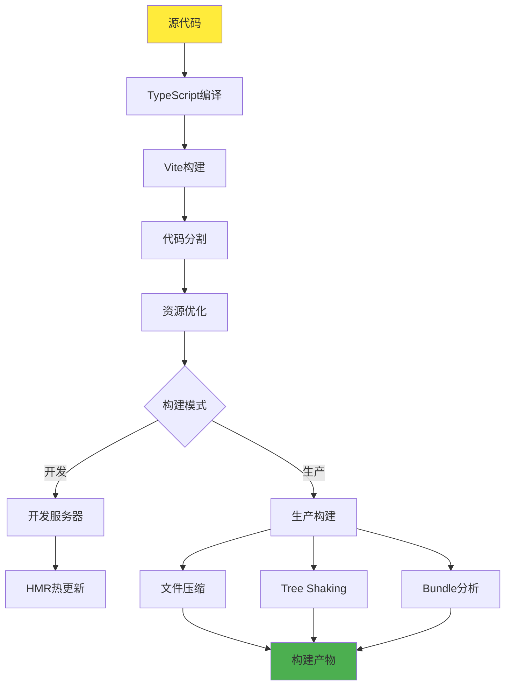

### 🚀 部署策略

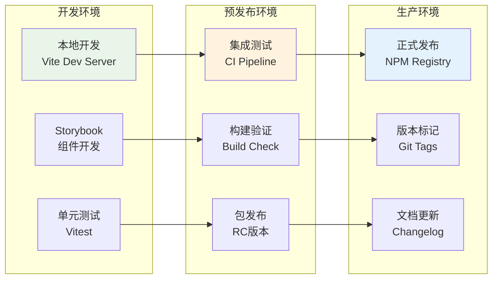

## CI/CD自动化

### 🔄 持续集成流程

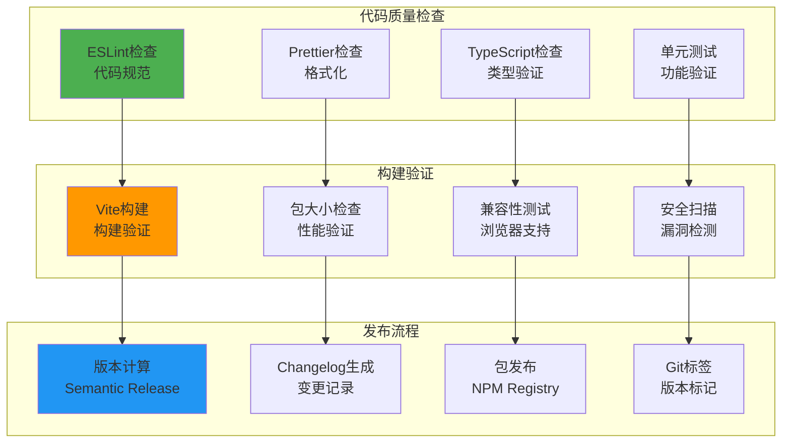

### 📊 性能监控

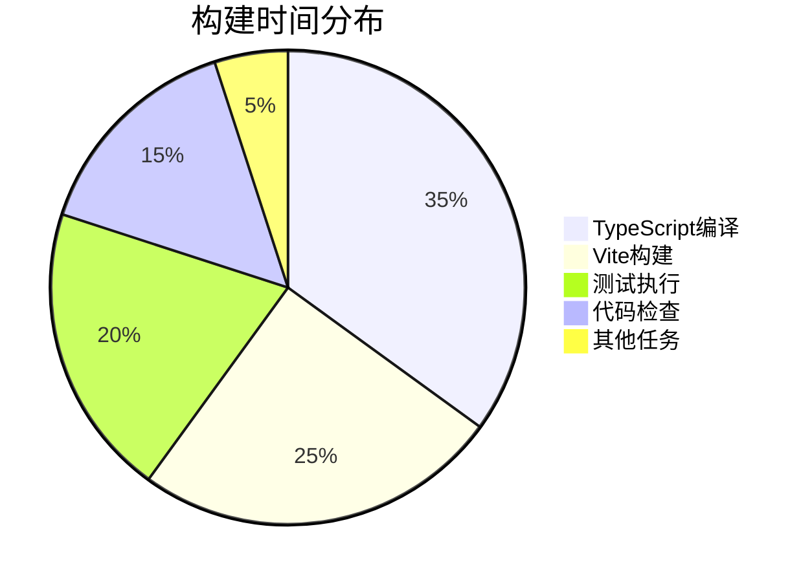

## 技术债务管理

### 📈 技术债务分析

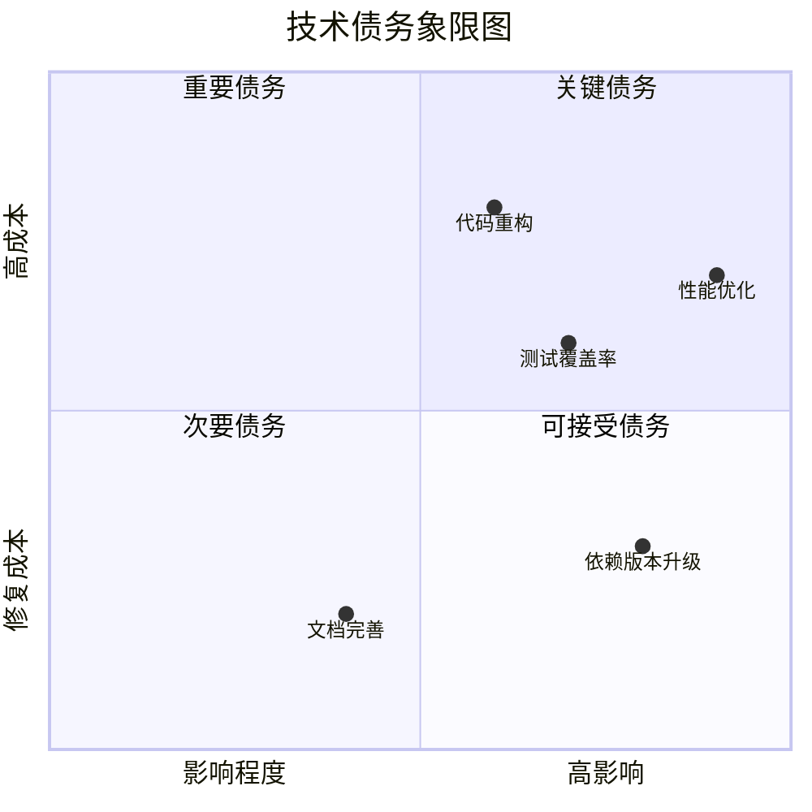

### 🎯 优化路线图

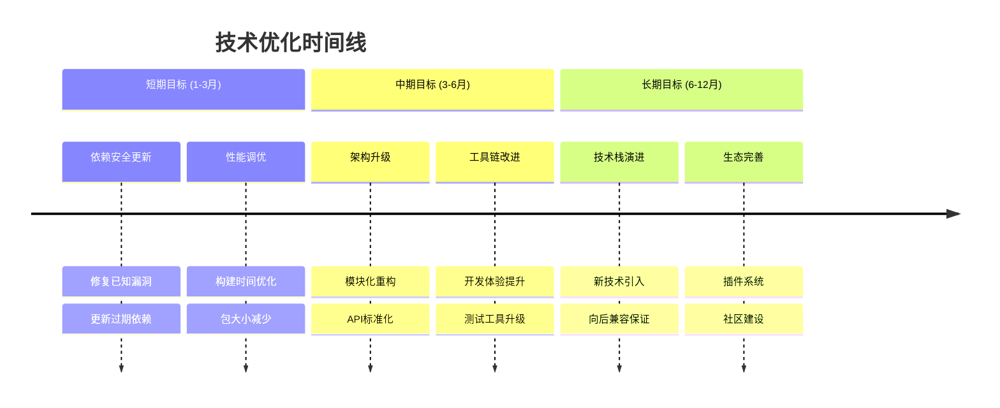

## 生态系统集成

### 🌐 外部集成

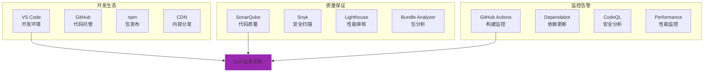

## 技术特色总结

### ✨ 核心优势
- **现代化技术栈**: 采用最新的前端技术和工具
- **类型安全保障**: 完整的TypeScript类型系统
- **高性能3D渲染**: 基于Three.js的优化渲染管道
- **响应式架构**: 基于Signal的现代状态管理

### 🚀 创新特点
- **Web Workers并行计算**: 复杂几何计算的性能优化
- **模块化设计**: 可插拔的架构设计
- **自动化工具链**: 完整的CI/CD和质量保证流程
- **开发者友好**: 优秀的开发体验和调试工具

### 🔮 技术展望
- **WebGPU支持**: 下一代GPU计算API
- **WebAssembly集成**: 高性能计算模块
- **微前端架构**: 模块化部署和扩展
- **AI辅助开发**: 智能代码生成和优化