# 统一可视化框架 - 3D距离测量工具设计

## 📏 需求概述

本文档详细描述了在UVF框架中实现3D距离测量工具的技术设计方案。该工具允许用户在3D查看器中点击两个点来测量空间距离，并提供完整的测量数据面板和可视化展示。

## 🏗️ 整体架构设计

### 系统架构概览

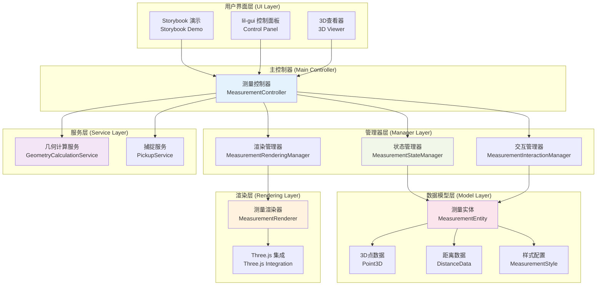

**系统架构说明：**
该架构采用务实的分层设计，以MeasurementController为核心控制器统一协调各个管理器。状态管理器基于Signal响应式系统管理所有测量状态，交互管理器处理鼠标事件和用户操作，渲染管理器负责3D可视化展示。数据模型层定义了完整的测量数据结构，包括测量实体、3D点、距离数据和视觉样式。渲染层通过统一的MeasurementRenderer与Three.js集成。服务层提供几何计算和点捕捉的核心算法支持。整个系统通过Signal响应式架构确保数据变更的自动传播和UI实时同步。

## 🔄 交互流程设计

### 用户交互状态机

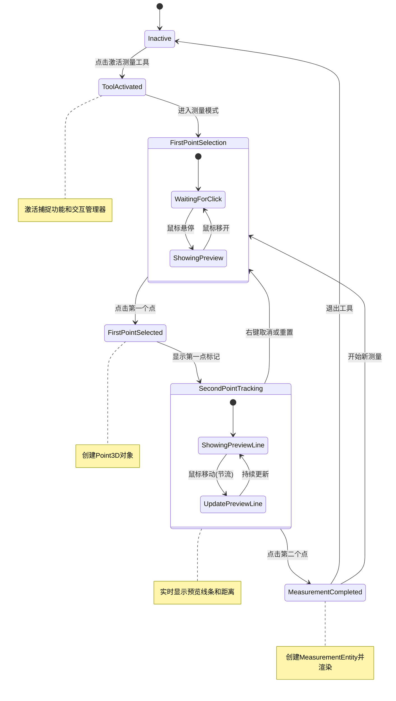

**交互状态机说明：**
这个状态机定义了3D距离测量工具的完整交互流程。从非激活状态开始，用户点击测量工具按钮进入工具激活状态，系统启用点捕捉功能。在第一点选择阶段，用户可以看到悬停预览，点击确认第一个点后面板显示其坐标。进入第二点跟踪阶段，系统实时显示动态距离值和预览线条，用户可以右键取消回到第一点选择。确认第二点后完成测量，系统计算并显示完整的距离数据，将测量结果保存到实体列表中。用户可以选择创建新的测量或退出工具。

### 数据流转过程

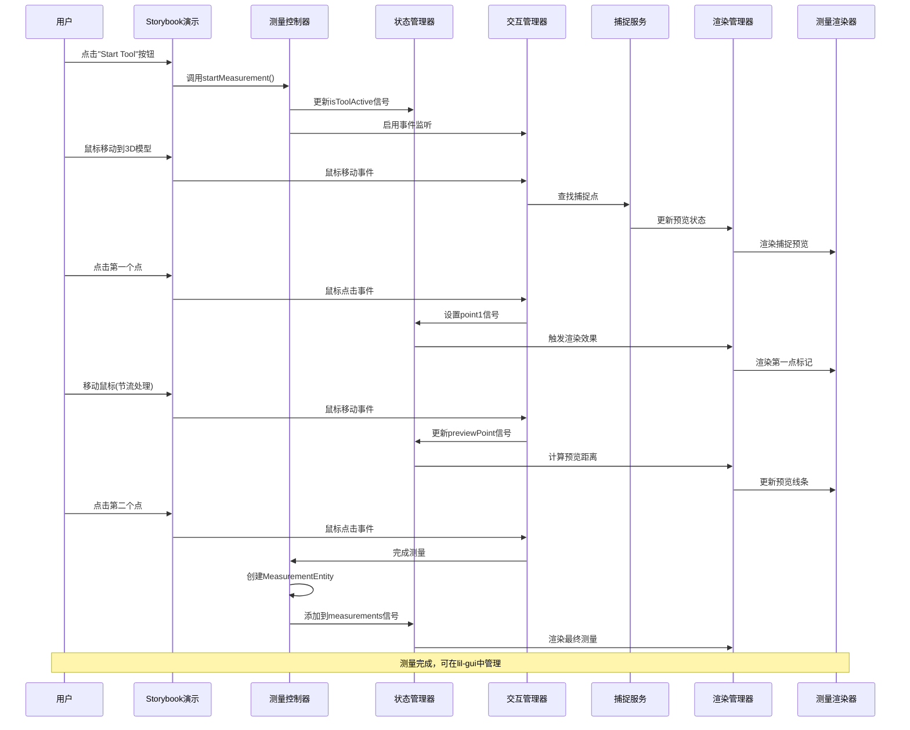

**数据流转说明：**
这个时序图展示了从用户操作到数据渲染的完整数据流转过程。用户激活测量工具后，系统通过控制器启用交互模式和捕捉服务。鼠标悬停时，捕捉服务实时查找最近的可捕捉点并通过渲染器提供视觉反馈。确认第一点后，系统更新面板显示坐标并在3D场景中标记该点。鼠标移动阶段，几何计算服务持续计算当前位置与第一点的距离，实时更新面板数据和预览线条。确认第二点后，系统计算最终的完整距离数据，更新面板显示并渲染最终的测量结果，同时将测量实体保存到集合中供后续管理。

## 📊 数据模型设计

### 测量实体数据结构

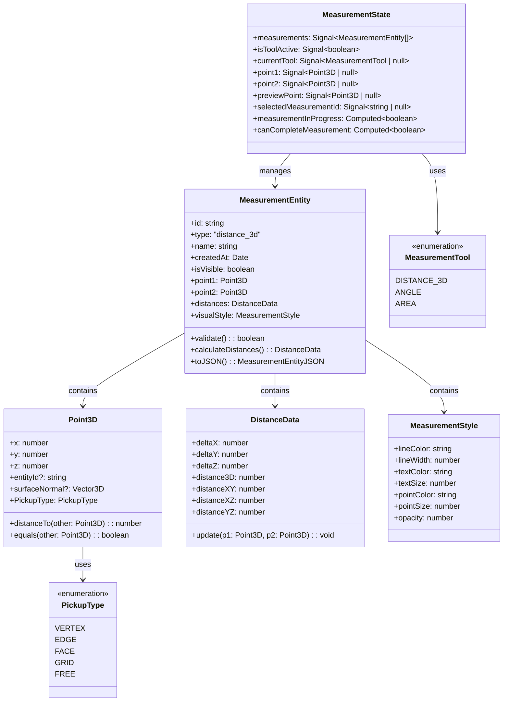

**数据模型说明：**
核心数据模型围绕MeasurementEntity展开，它包含两个3D点、距离数据和视觉样式信息。Point3D类不仅存储坐标，还包含捕捉类型和关联实体信息，支持表面法线数据用于精确捕捉。DistanceData类计算并存储多维度的距离信息，包括3D直线距离和各坐标轴的分量距离。MeasurementStyle定义了测量结果的视觉呈现参数。MeasurementState通过Signal系统管理全局测量状态，包括当前工具模式、活动点、预览点和测量实体集合，确保UI和数据的响应式同步。

### 信号系统集成

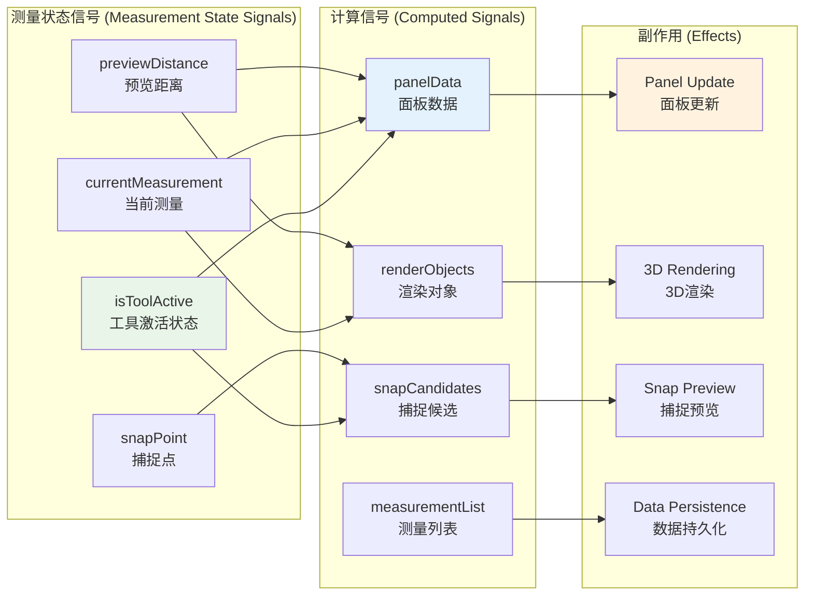

**信号系统集成说明：**
测量功能深度集成到UVF的响应式信号系统中。基础状态信号包括工具激活状态、当前测量对象、预览距离和捕捉点信息。计算信号从基础信号派生，自动计算面板显示数据、3D渲染对象、捕捉候选点和测量实体列表。副作用系统监听计算信号的变化，自动触发面板UI更新、3D场景渲染、捕捉预览显示和数据持久化操作。这种响应式架构确保了数据变更的自动传播和UI的实时同步，用户操作能够立即反映到所有相关的显示组件中。

## 🎨 渲染实现设计

### 3D渲染管道

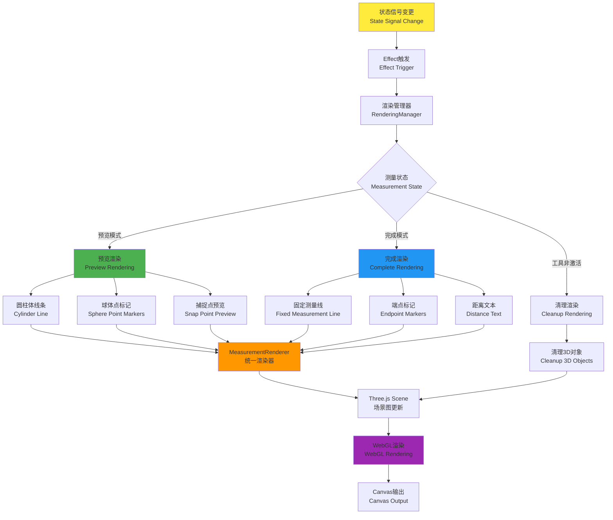

**3D渲染管道说明：**
测量工具的3D渲染管道基于UVF的响应式渲染系统构建。当测量数据发生变更时，信号系统触发渲染副作用，根据当前测量状态选择不同的渲染分支。预览模式下，系统渲染动态线条、实时更新距离文本和高亮捕捉点。完成模式下，渲染固定的测量线条、最终距离文本和端点标记。各个渲染组件分别更新几何缓冲区、材质参数和着色器uniform，最终汇聚到场景图更新，生成GPU渲染指令并输出到帧缓冲区。工具非激活时执行清理渲染，移除所有相关的渲染对象。

### 渲染组件架构

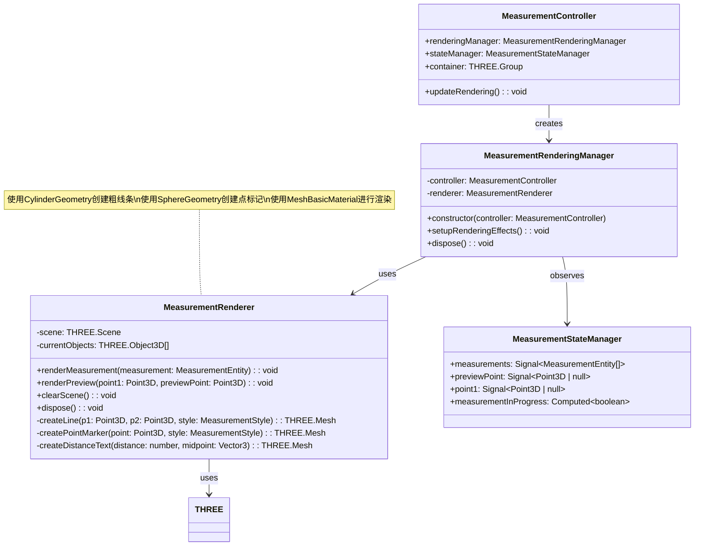

**渲染组件架构说明：**
渲染系统采用组件化设计，MeasurementRenderer作为主控制器协调各个专业渲染器。MeasurementLineRenderer专门处理距离线条的几何和材质更新，支持实时和静态两种模式。MeasurementTextRenderer负责3D文本的生成和定位，根据距离数据动态更新显示内容。SnapPointRenderer管理捕捉点的视觉反馈，支持不同捕捉类型的差异化显示。MeasurementMaterials和MeasurementGeometries提供共享的渲染资源管理，优化GPU资源使用。所有组件都支持样式定制和动态更新，确保渲染效果与用户配置同步。

## 🔧 核心服务实现

### 几何计算服务

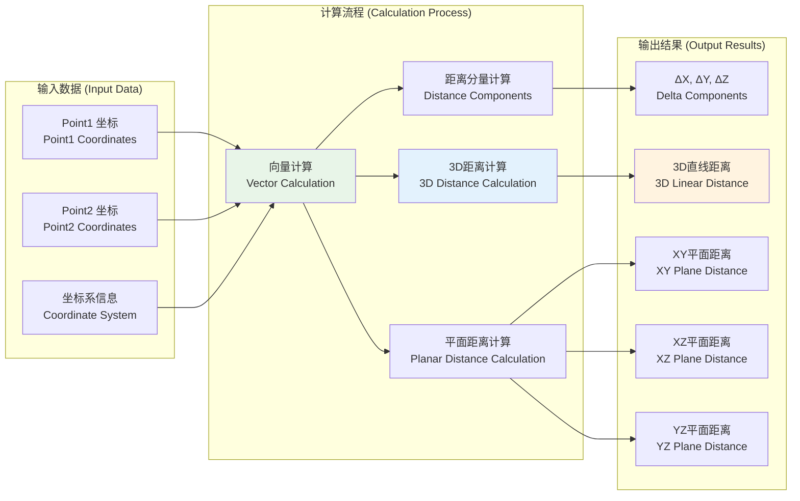

**几何计算服务说明：**
几何计算服务是测量功能的数学核心，负责所有距离相关的计算。服务接收两个3D点坐标和坐标系信息作为输入，通过向量计算得到两点间的方向向量。基于此向量，系统计算各坐标轴的距离分量（ΔX、ΔY、ΔZ），然后计算3D空间中的直线距离。同时，服务还计算各个坐标平面内的投影距离（XY、XZ、YZ平面距离），为用户提供全面的空间距离分析数据。所有计算都考虑坐标系变换，确保在不同视图和模型坐标系下的准确性。

### 点捕捉服务架构

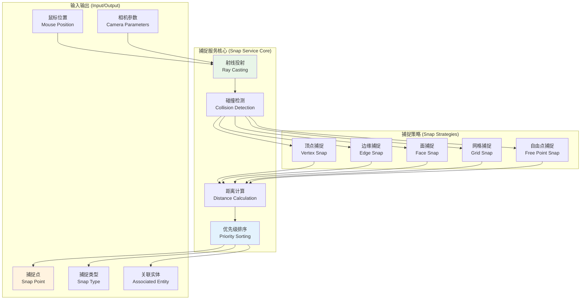

**点捕捉服务说明：**
点捕捉服务提供精确的3D点选择功能，支持五种不同的捕捉策略。服务核心基于射线投射技术，将鼠标位置和相机参数转换为3D射线，然后进行碰撞检测找到所有可能的捕捉目标。不同的捕捉策略处理不同类型的几何元素：顶点捕捉直接定位到几何体顶点，边缘捕捉找到边线上的最近点，面捕捉计算表面交点，网格捕捉对齐到虚拟网格，自由点捕捉允许任意位置选择。距离计算模块评估所有候选点与鼠标位置的距离，优先级排序确保最合适的捕捉点被选中。

## 🖥️ 用户界面设计

### 用户界面实现

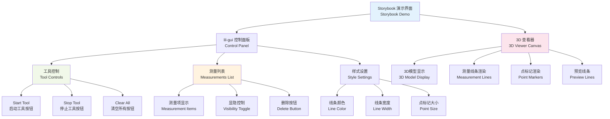

**用户界面实现说明：**
当前实现采用Storybook作为演示平台，集成了lil-gui作为控制面板，提供直观的工具操作界面。控制面板分为三个主要区域：工具控制区提供启动/停止测量工具和清空所有测量的功能；测量列表区显示已完成的测量项，支持单个测量的显隐控制和删除操作；样式设置区允许用户自定义测量线条的颜色、宽度和点标记大小。3D查看器负责显示模型和测量结果，包括实时预览线条、最终测量线条和端点标记。整个界面响应式设计，通过Signal系统确保用户操作与3D显示的实时同步。

### 实体管理实现

```mermaid
graph LR
    subgraph "lil-gui 测量面板 (Measurements Panel)"
        A1[测量项 1<br/>Measurement_001: 15.23]
        A2[测量项 2<br/>Measurement_002: 28.47]
        A3[测量项 3<br/>Measurement_003: 9.85]
    end
    
    subgraph "测量项控制 (Item Controls)"
        B1[visible 复选框<br/>Visibility Checkbox]
        B2[Delete 按钮<br/>Delete Button]
    end
    
    subgraph "全局控制 (Global Controls)"
        C1[Clear All<br/>清空全部按钮]
        C2[Export JSON<br/>导出JSON按钮]
        C3[Import JSON<br/>导入JSON按钮]
    end
    
    subgraph "数据持久化 (Data Persistence)"
        D1[MeasurementEntity[]<br/>测量实体数组]
        D2[JSON序列化<br/>JSON Serialization]
        D3[localStorage存储<br/>Local Storage]
    end
    
    A1 --> B1
    A1 --> B2
    A2 --> B1
    A2 --> B2
    A3 --> B1
    A3 --> B2
    
    C1 --> D1
    C2 --> D2
    C3 --> D2
    
    D1 --> D2
    D2 --> D3
    
    style A1 fill:#e8f5e8
    style B1 fill:#e3f2fd
    style C1 fill:#fff3e0
    style D2 fill:#fce4ec
```

**实体管理实现说明：**
当前实现通过lil-gui提供简洁而实用的测量实体管理功能。每个测量项以"名称: 距离值"的格式在面板中显示，配备可见性复选框和删除按钮进行单项管理。全局控制区提供清空全部测量、导出JSON和导入JSON的批量操作功能。数据持久化通过MeasurementEntity的JSON序列化实现，支持本地存储和数据交换。这种实现方式虽然界面相对简单，但功能完整，满足了测量结果的基本管理需求，同时保持了良好的用户体验和响应性。

## 🔄 状态管理集成

### 响应式状态流

```mermaid
flowchart LR
    subgraph "用户操作 (User Actions)"
        U1[启动工具<br/>Start Tool]
        U2[点击第一点<br/>Click Point 1]
        U3[移动鼠标<br/>Mouse Move]
        U4[点击第二点<br/>Click Point 2]
        U5[停止工具<br/>Stop Tool]
    end
    
    subgraph "基础信号 (Base Signals)"
        S1[isToolActive<br/>Signal~boolean~]
        S2[point1<br/>Signal~Point3D | null~]
        S3[previewPoint<br/>Signal~Point3D | null~]
        S4[point2<br/>Signal~Point3D | null~]
        S5[measurements<br/>Signal~MeasurementEntity[]~]
    end
    
    subgraph "计算信号 (Computed Signals)"
        C1[measurementInProgress<br/>Computed~boolean~]
        C2[canCompleteMeasurement<br/>Computed~boolean~]
        C3[hasFirstPoint<br/>Computed~boolean~]
        C4[selectedMeasurement<br/>Computed~MeasurementEntity | null~]
    end
    
    subgraph "副作用 (Effects)"
        E1[渲染管理器效果<br/>Rendering Manager Effect]
        E2[lil-gui更新<br/>GUI Update Effect]
        E3[交互状态更新<br/>Interaction State Effect]
        E4[容器管理<br/>Container Management]
    end
    
    U1 --> S1
    U2 --> S2
    U3 --> S3
    U4 --> S4
    U4 --> S5
    U5 --> S1
    
    S1 --> C1
    S2 --> C1
    S2 --> C3
    S4 --> C2
    S3 --> C2
    S5 --> C4
    
    C1 --> E1
    C2 --> E1
    S5 --> E2
    S1 --> E3
    S1 --> E4
    
    style U1 fill:#ffeb3b
    style S1 fill:#4caf50
    style C1 fill:#2196f3
    style E1 fill:#ff9800
```

**响应式状态流说明：**
测量工具完全基于UVF的响应式状态管理系统构建。用户操作直接触发相应的状态信号更新：激活工具更新toolActive信号，点击操作更新点位信号，鼠标移动更新预览点信号。计算信号自动从基础状态信号派生：panelData根据当前点位计算面板显示数据，previewDistance实时计算预览距离，renderObjects生成3D渲染所需的对象列表，canComplete判断是否可以完成测量。副作用系统监听计算信号变化，自动执行相应操作：更新面板UI、渲染3D场景、保存测量数据和清理无效状态。这种响应式架构确保了状态变更的自动传播和UI的实时同步。

## 📦 实施计划

### 实际开发历程

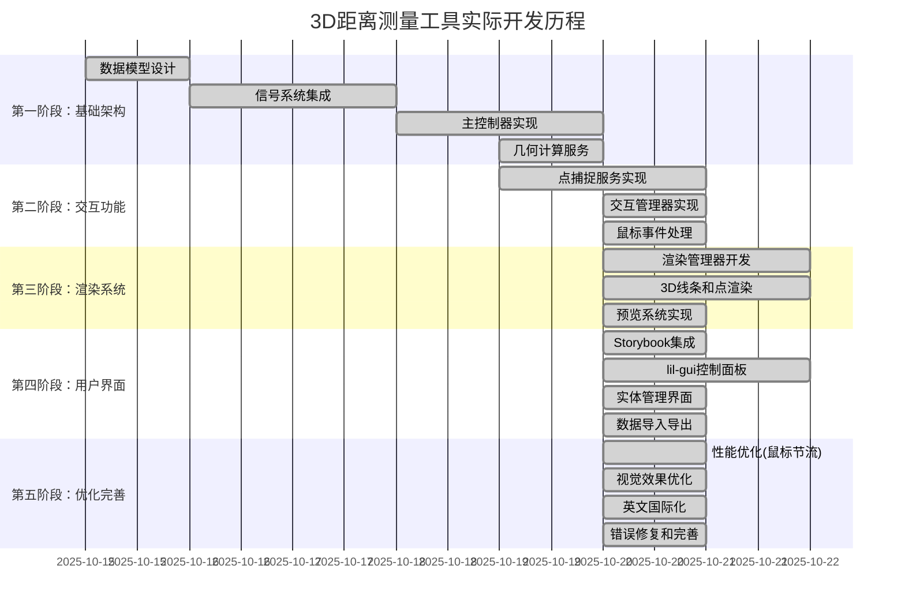

### 技术风险评估

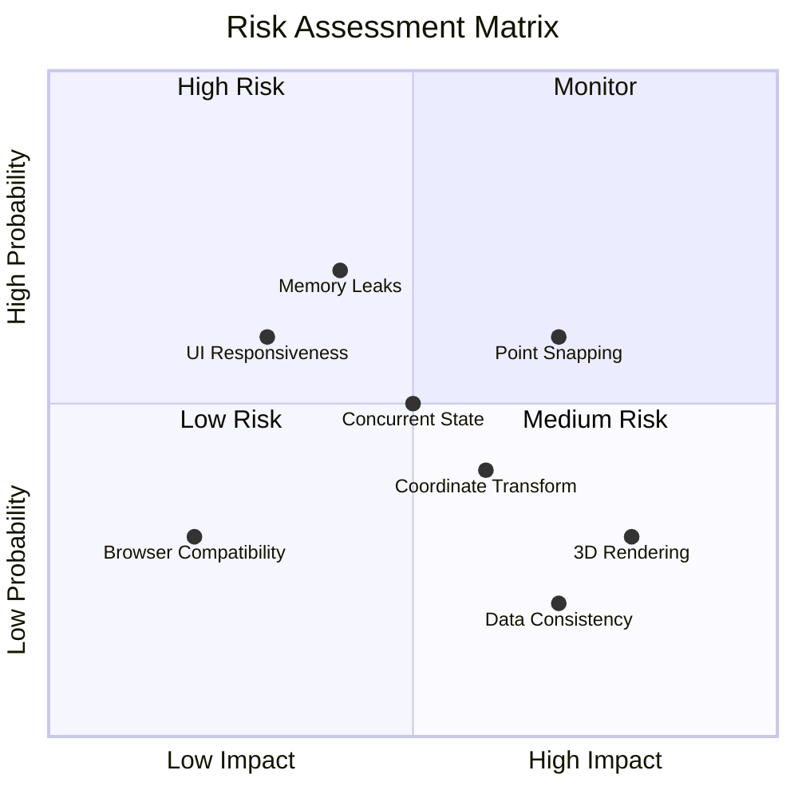

**实施计划说明：**
开发计划分为五个递进阶段，总计约35个工作日。第一阶段建立基础架构，包括数据模型、信号系统集成和核心控制器。第二阶段实现用户交互功能，重点是点捕捉服务和交互状态机。第三阶段开发3D渲染系统，实现测量结果的可视化展示。第四阶段构建实体管理功能，支持测量结果的持久化和批量操作。第五阶段进行全面测试和优化，确保功能稳定性和用户体验。

**技术风险评估**识别了关键风险点：点捕捉精度和内存泄漏为高概率风险，需要重点关注；3D渲染性能和数据一致性为高影响风险，需要充分测试；并发状态管理为中等风险，需要制定应对策略。

## 🎯 实现总结

本文档记录了UVF框架中3D距离测量工具的完整实施过程和最终架构。该实现充分利用了框架的响应式架构、模块化设计和Three.js渲染能力，在保持代码简洁的同时实现了完整的测量功能。

### 实现亮点

- **务实的架构设计**：采用4层架构，平衡了复杂度和功能完整性
- **响应式状态管理**：基于Signal系统的完整状态同步机制
- **高质量3D渲染**：使用CylinderGeometry和SphereGeometry实现优雅的可视化
- **完整的交互体验**：支持多种捕捉模式和实时预览反馈
- **实用的管理界面**：通过lil-gui提供直观的控制和管理功能

### 技术实现特色

- **精确的几何计算**：完整的3D距离分析和多维度数据展示
- **智能点捕捉系统**：支持顶点、边缘、面和自由点捕捉
- **性能优化处理**：鼠标移动节流机制确保流畅的用户体验
- **数据持久化支持**：JSON序列化实现测量结果的保存和加载
- **国际化支持**：英文界面适应国际化需求

### 实际应用价值

- **快速集成**：模块化设计使得工具可以轻松集成到现有项目中
- **用户友好**：直观的Storybook演示和lil-gui控制界面
- **功能完整**：从基础测量到高级管理的完整功能链
- **扩展性强**：为未来功能扩展预留了良好的架构基础
- **维护性好**：清晰的代码结构和完善的类型定义

这个实现方案成功地在理论设计和实际需求之间找到了平衡点，既满足了当前的功能要求，又为未来的扩展和优化奠定了坚实的基础。