# 统一可视化框架 - 3D距离测量工具设计

## 📏 需求概述

本文档详细描述了在UVF框架中实现3D距离测量工具的技术设计方案。该工具允许用户在3D查看器中点击两个点来测量空间距离，并提供完整的测量数据面板和可视化展示。

## 🏗️ 整体架构设计

### 系统架构概览

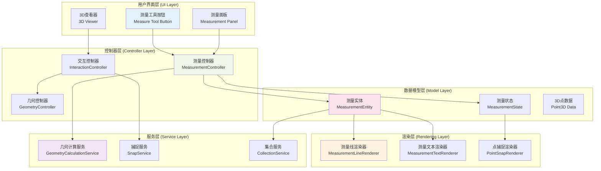

**系统架构说明：**
该架构采用分层设计，将3D距离测量功能分为五个核心层次。用户界面层包含测量工具激活按钮、实时数据显示面板和3D交互查看器。控制器层通过MeasurementController统一管理测量逻辑，与InteractionController和GeometryController协同工作。数据模型层定义了测量实体的数据结构和状态管理。渲染层负责3D场景中的线条、文本和捕捉点的可视化显示。服务层提供核心算法支持，包括几何计算、点捕捉和数据持久化功能。各层间通过信号系统进行响应式通信。

## 🔄 交互流程设计

### 用户交互状态机

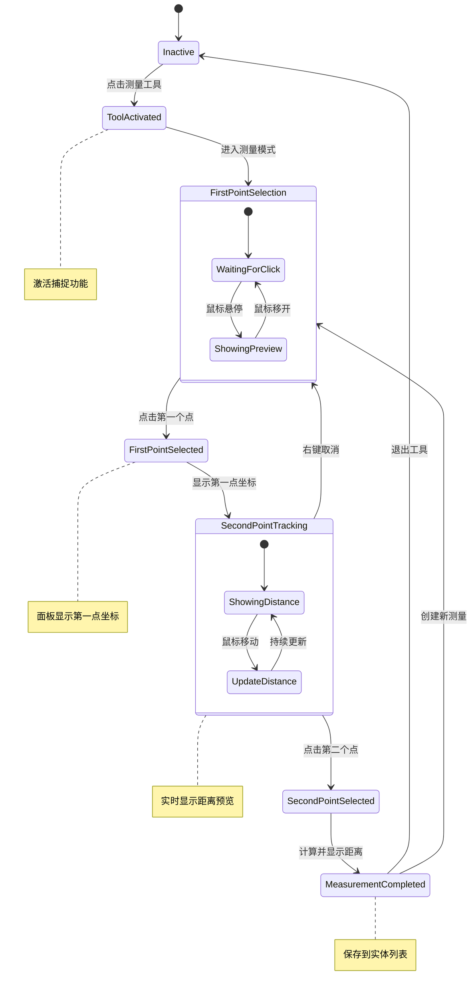

**交互状态机说明：**
这个状态机定义了3D距离测量工具的完整交互流程。从非激活状态开始，用户点击测量工具按钮进入工具激活状态，系统启用点捕捉功能。在第一点选择阶段，用户可以看到悬停预览，点击确认第一个点后面板显示其坐标。进入第二点跟踪阶段，系统实时显示动态距离值和预览线条，用户可以右键取消回到第一点选择。确认第二点后完成测量，系统计算并显示完整的距离数据，将测量结果保存到实体列表中。用户可以选择创建新的测量或退出工具。

### 数据流转过程

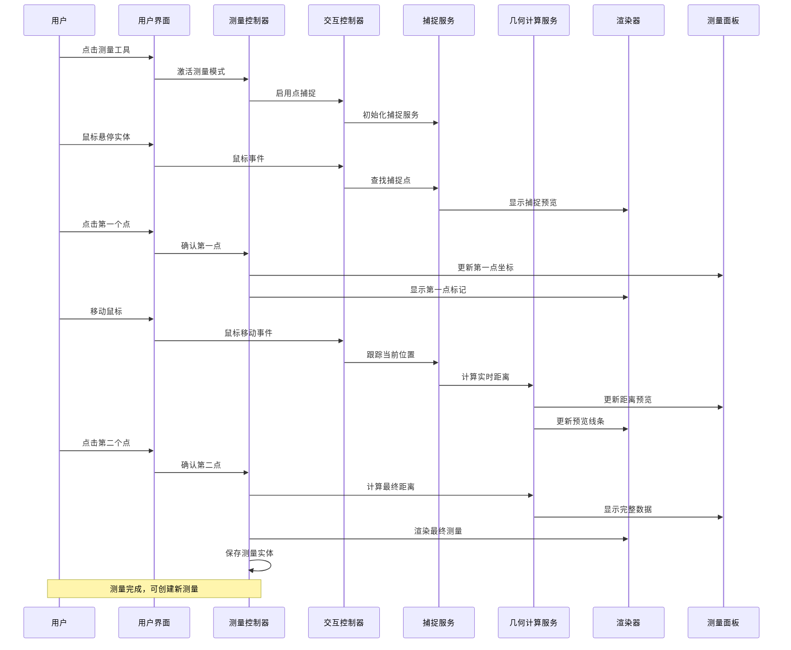

**数据流转说明：**
这个时序图展示了从用户操作到数据渲染的完整数据流转过程。用户激活测量工具后，系统通过控制器启用交互模式和捕捉服务。鼠标悬停时，捕捉服务实时查找最近的可捕捉点并通过渲染器提供视觉反馈。确认第一点后，系统更新面板显示坐标并在3D场景中标记该点。鼠标移动阶段，几何计算服务持续计算当前位置与第一点的距离，实时更新面板数据和预览线条。确认第二点后，系统计算最终的完整距离数据，更新面板显示并渲染最终的测量结果，同时将测量实体保存到集合中供后续管理。

## 📊 数据模型设计

### 测量实体数据结构

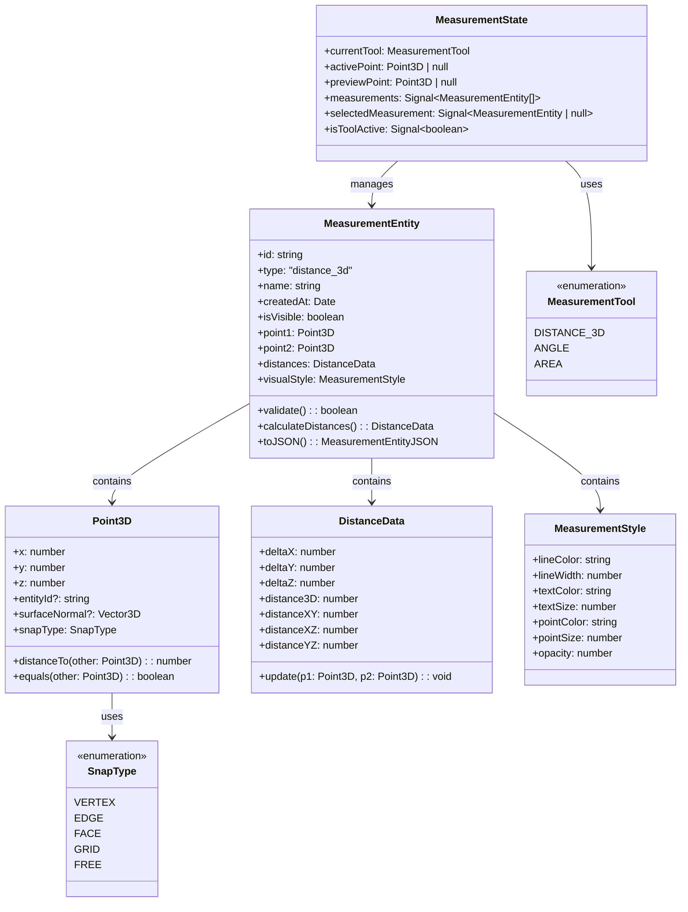

**数据模型说明：**
核心数据模型围绕MeasurementEntity展开，它包含两个3D点、距离数据和视觉样式信息。Point3D类不仅存储坐标，还包含捕捉类型和关联实体信息，支持表面法线数据用于精确捕捉。DistanceData类计算并存储多维度的距离信息，包括3D直线距离和各坐标轴的分量距离。MeasurementStyle定义了测量结果的视觉呈现参数。MeasurementState通过Signal系统管理全局测量状态，包括当前工具模式、活动点、预览点和测量实体集合，确保UI和数据的响应式同步。

### 信号系统集成

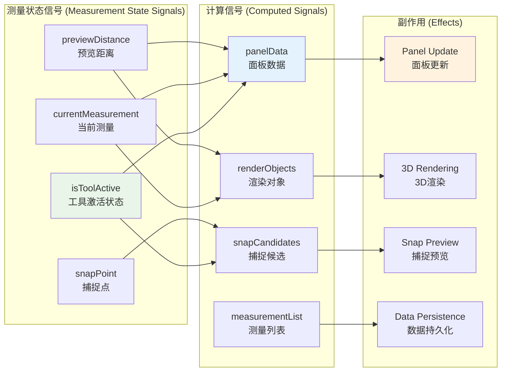

**信号系统集成说明：**
测量功能深度集成到UVF的响应式信号系统中。基础状态信号包括工具激活状态、当前测量对象、预览距离和捕捉点信息。计算信号从基础信号派生，自动计算面板显示数据、3D渲染对象、捕捉候选点和测量实体列表。副作用系统监听计算信号的变化，自动触发面板UI更新、3D场景渲染、捕捉预览显示和数据持久化操作。这种响应式架构确保了数据变更的自动传播和UI的实时同步，用户操作能够立即反映到所有相关的显示组件中。

## 🎨 渲染实现设计

### 3D渲染管道

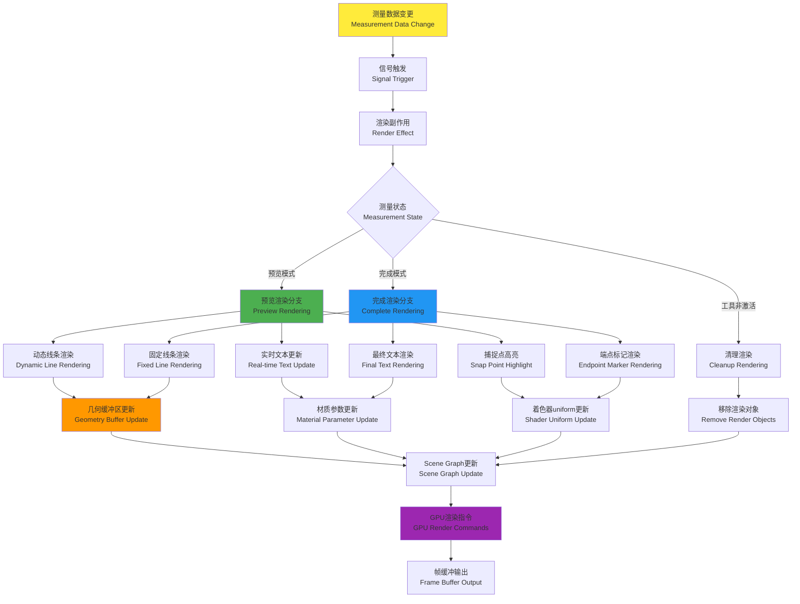

**3D渲染管道说明：**
测量工具的3D渲染管道基于UVF的响应式渲染系统构建。当测量数据发生变更时，信号系统触发渲染副作用，根据当前测量状态选择不同的渲染分支。预览模式下，系统渲染动态线条、实时更新距离文本和高亮捕捉点。完成模式下，渲染固定的测量线条、最终距离文本和端点标记。各个渲染组件分别更新几何缓冲区、材质参数和着色器uniform，最终汇聚到场景图更新，生成GPU渲染指令并输出到帧缓冲区。工具非激活时执行清理渲染，移除所有相关的渲染对象。

### 渲染组件架构

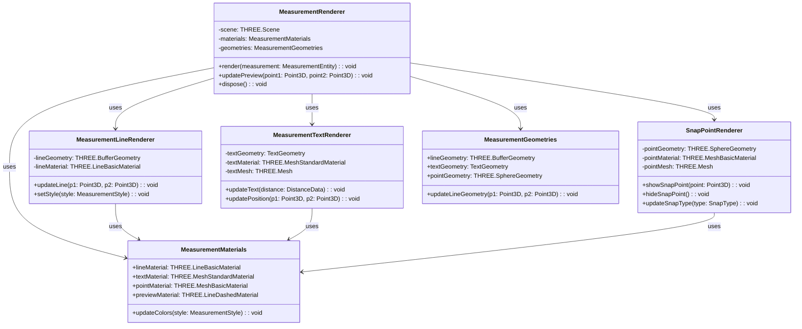

**渲染组件架构说明：**
渲染系统采用组件化设计，MeasurementRenderer作为主控制器协调各个专业渲染器。MeasurementLineRenderer专门处理距离线条的几何和材质更新，支持实时和静态两种模式。MeasurementTextRenderer负责3D文本的生成和定位，根据距离数据动态更新显示内容。SnapPointRenderer管理捕捉点的视觉反馈，支持不同捕捉类型的差异化显示。MeasurementMaterials和MeasurementGeometries提供共享的渲染资源管理，优化GPU资源使用。所有组件都支持样式定制和动态更新，确保渲染效果与用户配置同步。

## 🔧 核心服务实现

### 几何计算服务

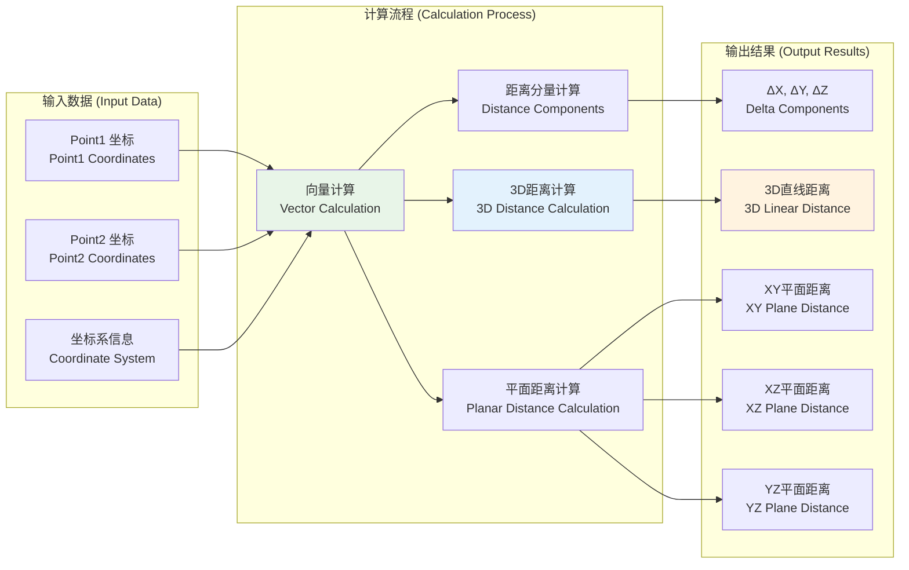

**几何计算服务说明：**
几何计算服务是测量功能的数学核心，负责所有距离相关的计算。服务接收两个3D点坐标和坐标系信息作为输入，通过向量计算得到两点间的方向向量。基于此向量，系统计算各坐标轴的距离分量（ΔX、ΔY、ΔZ），然后计算3D空间中的直线距离。同时，服务还计算各个坐标平面内的投影距离（XY、XZ、YZ平面距离），为用户提供全面的空间距离分析数据。所有计算都考虑坐标系变换，确保在不同视图和模型坐标系下的准确性。

### 点捕捉服务架构

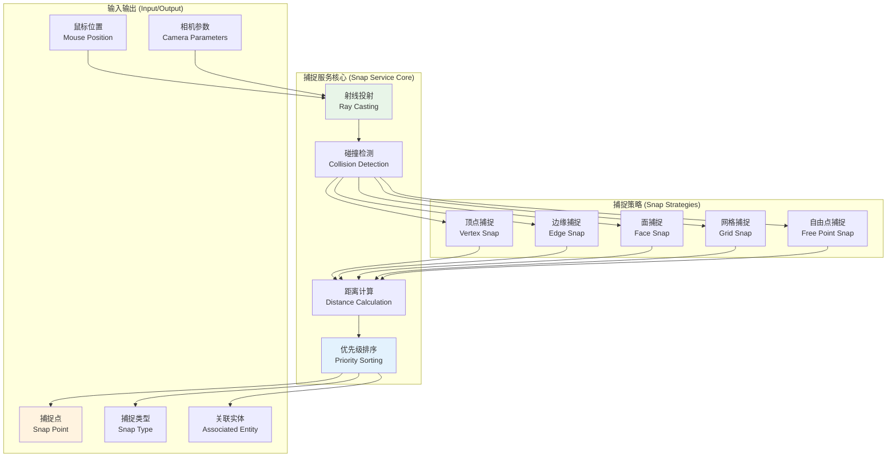

**点捕捉服务说明：**
点捕捉服务提供精确的3D点选择功能，支持五种不同的捕捉策略。服务核心基于射线投射技术，将鼠标位置和相机参数转换为3D射线，然后进行碰撞检测找到所有可能的捕捉目标。不同的捕捉策略处理不同类型的几何元素：顶点捕捉直接定位到几何体顶点，边缘捕捉找到边线上的最近点，面捕捉计算表面交点，网格捕捉对齐到虚拟网格，自由点捕捉允许任意位置选择。距离计算模块评估所有候选点与鼠标位置的距离，优先级排序确保最合适的捕捉点被选中。

## 🖥️ 用户界面设计

### 测量面板组件

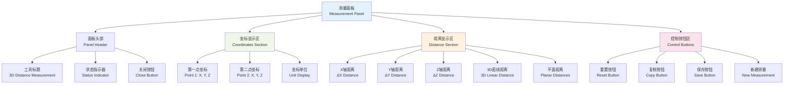

**测量面板组件说明：**
测量面板采用分区设计，提供清晰的信息层次结构。面板头部包含工具标题、当前状态指示器（显示"选择第一点"、"选择第二点"、"测量完成"等状态）和关闭按钮。坐标显示区实时显示两个测量点的精确3D坐标，包含单位信息和数值精度控制。距离显示区展示完整的距离分析数据，包括各坐标轴分量和3D直线距离，以及XY、XZ、YZ三个平面的投影距离。控制按钮区提供测量操作功能：重置清空当前测量、复制将数据复制到剪贴板、保存将测量添加到实体列表、新建开始下一个测量。所有数值显示都是只读的，确保数据完整性。

### 实体管理界面

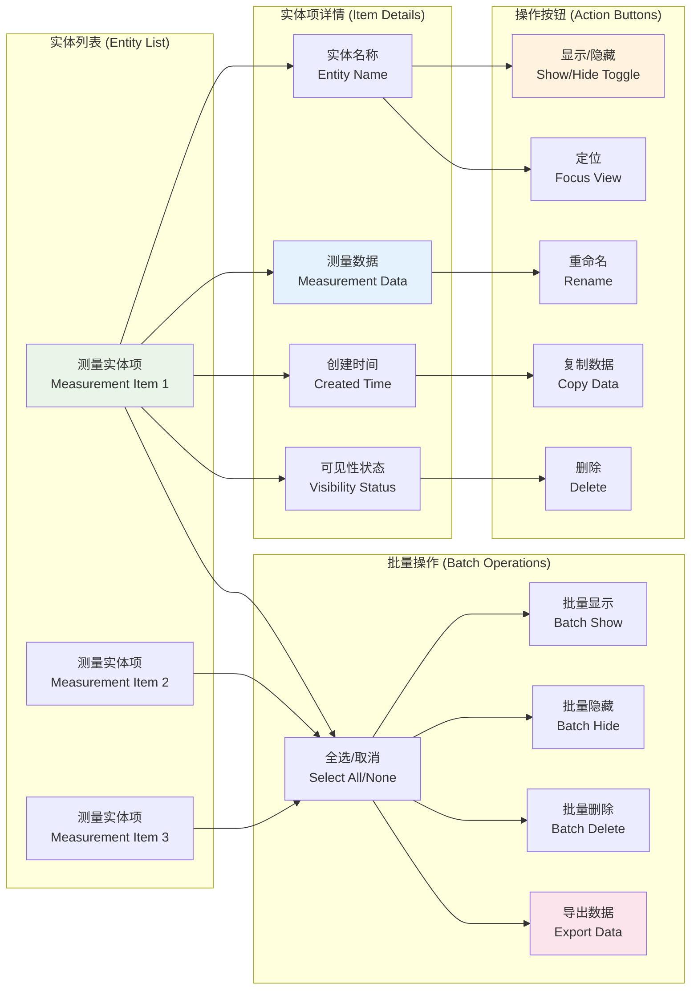

**实体管理界面说明：**
实体管理界面为用户提供完整的测量结果管理功能。每个测量实体项显示实体名称、关键测量数据（如3D距离）、创建时间和当前可见性状态。单个实体的操作包括显示/隐藏切换、重命名、数据复制、删除和视图定位功能。批量操作支持多选模式，用户可以同时管理多个测量实体：全选或取消选择、批量显示或隐藏、批量删除和数据导出功能。界面设计注重用户体验，提供清晰的视觉反馈和直观的操作流程，支持View模式和Draft模式下的一致性操作体验。

## 🔄 状态管理集成

### 响应式状态流

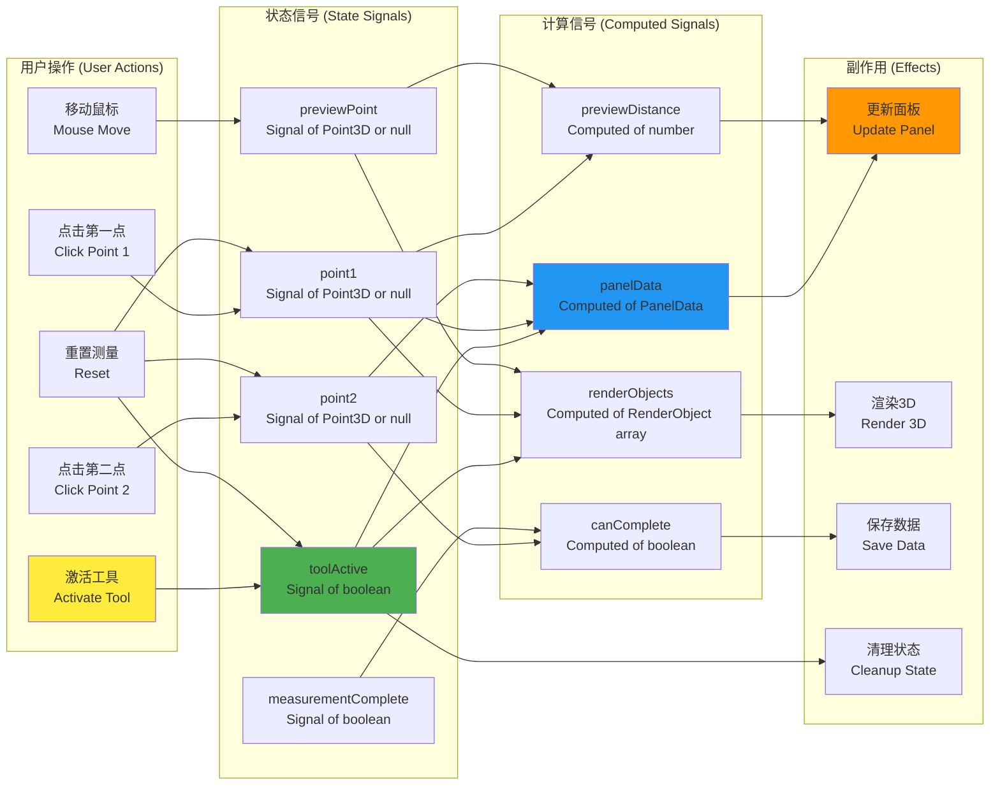

**响应式状态流说明：**
测量工具完全基于UVF的响应式状态管理系统构建。用户操作直接触发相应的状态信号更新：激活工具更新toolActive信号，点击操作更新点位信号，鼠标移动更新预览点信号。计算信号自动从基础状态信号派生：panelData根据当前点位计算面板显示数据，previewDistance实时计算预览距离，renderObjects生成3D渲染所需的对象列表，canComplete判断是否可以完成测量。副作用系统监听计算信号变化，自动执行相应操作：更新面板UI、渲染3D场景、保存测量数据和清理无效状态。这种响应式架构确保了状态变更的自动传播和UI的实时同步。

## 📦 实施计划

### 开发阶段规划

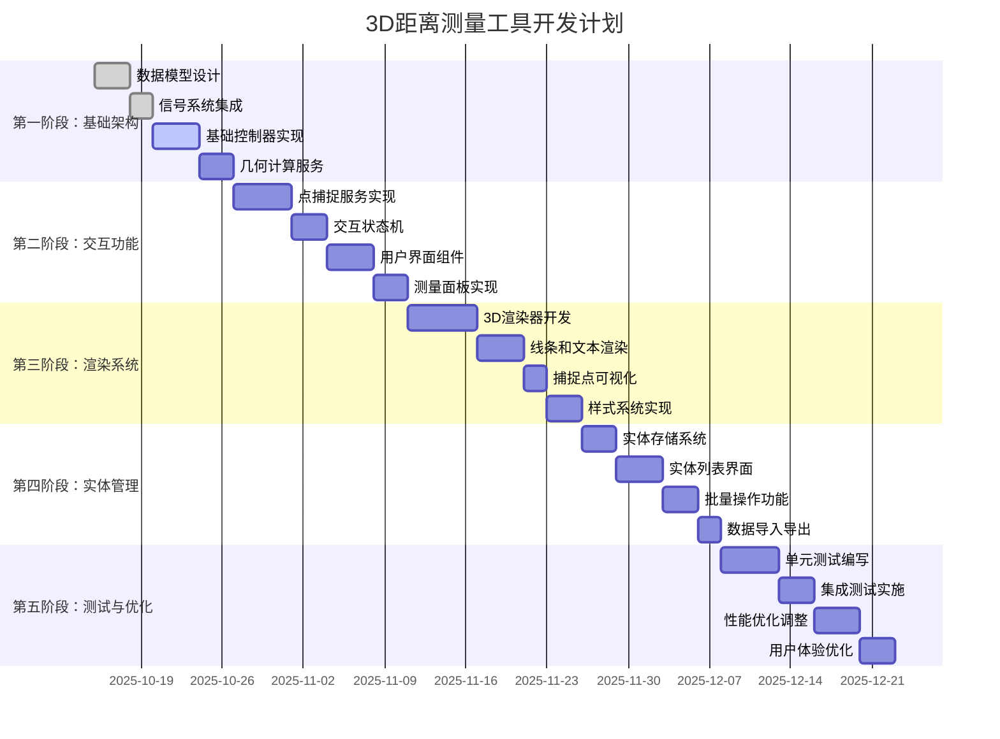

### 技术风险评估

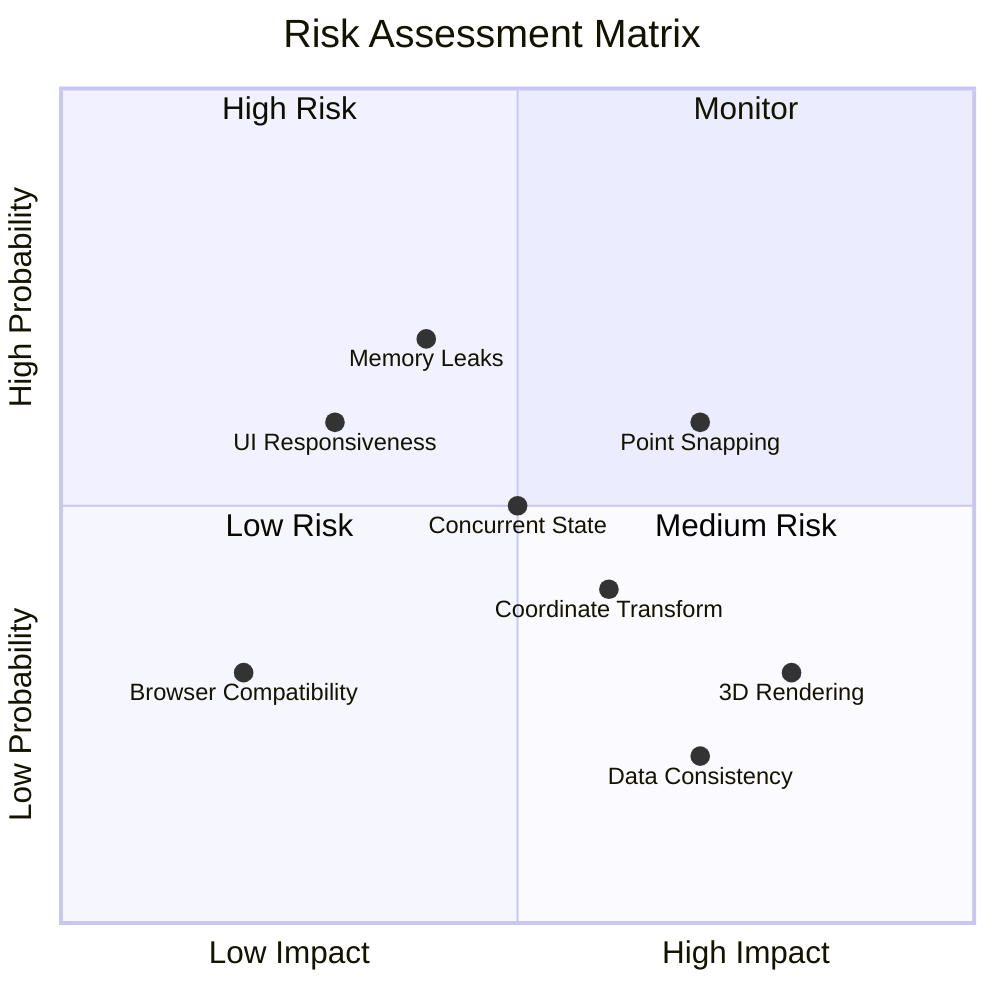

**实施计划说明：**
开发计划分为五个递进阶段，总计约35个工作日。第一阶段建立基础架构，包括数据模型、信号系统集成和核心控制器。第二阶段实现用户交互功能，重点是点捕捉服务和交互状态机。第三阶段开发3D渲染系统，实现测量结果的可视化展示。第四阶段构建实体管理功能，支持测量结果的持久化和批量操作。第五阶段进行全面测试和优化，确保功能稳定性和用户体验。

**技术风险评估**识别了关键风险点：点捕捉精度和内存泄漏为高概率风险，需要重点关注；3D渲染性能和数据一致性为高影响风险，需要充分测试；并发状态管理为中等风险，需要制定应对策略。

## 🎯 总结

本设计文档为UVF框架中的3D距离测量工具提供了完整的技术实施方案。设计充分利用了框架的响应式架构、模块化设计和Three.js渲染能力，确保功能的高质量实现和良好的用户体验。

### 核心优势

- **响应式架构集成**：深度集成信号系统，确保状态同步和UI响应性
- **模块化设计**：清晰的职责分离，便于维护和扩展
- **专业3D渲染**：基于Three.js的高质量可视化展示
- **完善的交互体验**：直观的点捕捉和实时预览功能
- **数据管理完整**：支持测量结果的完整生命周期管理

### 技术特色

- **精确的几何计算**：多维度距离分析和坐标系支持
- **智能点捕捉**：多策略捕捉系统，提供精确的点选择
- **实时渲染反馈**：动态预览和即时视觉反馈
- **状态管理一致性**：基于Signal系统的可靠状态同步
- **扩展性设计**：为未来功能扩展预留充足接口

这个设计方案为开发团队提供了清晰的实施路径，确保3D距离测量工具能够无缝集成到UVF框架中，为用户提供专业级的空间分析能力。