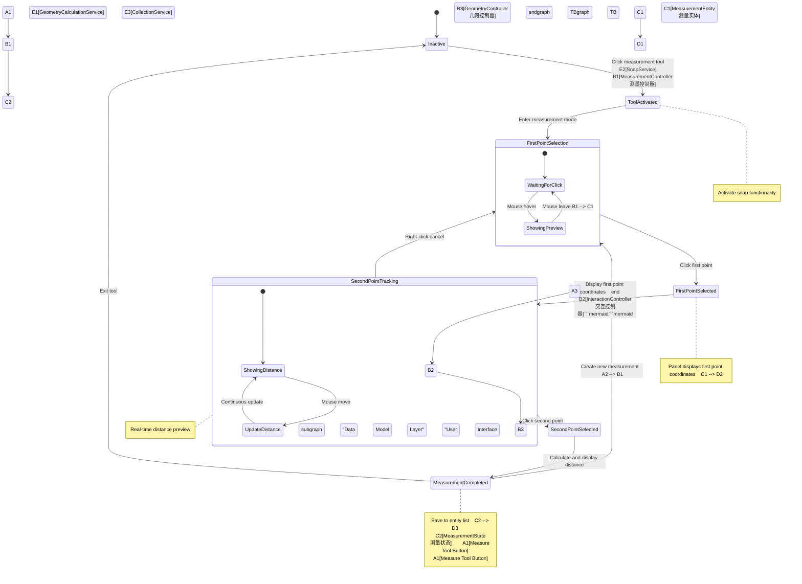

# Unified Visualization Framework - 3D Distance Measurement Tool Design# Unified Visualization Framework - 3D Distance Measurement Tool Design# Unified Visualization Framework - 3D Distance Measurement Tool Design# Unified Visualization Framework - 3D Distance Measurement Tool Design# Unified Visualization Framework - 3D Distance Measurement Tool Design


## 📏 Requirements Overview


This document provides a detailed technical design for implementing a 3D distance measurement tool in the UVF framework. The tool allows users to click two points in the 3D viewer to measure spatial distances, providing comprehensive measurement data panels and visualization displays.## 📏 Requirements Overview


## 🏗️ Overall Architecture Design


### System Architecture OverviewThis document provides a detailed technical design for implementing a 3D distance measurement tool in the UVF framework. The tool allows users to click two points in the 3D viewer to measure spatial distances, providing comprehensive measurement data panels and visualization displays.## 📏 Requirements Overview


```mermaid

graph TB

    subgraph "User Interface Layer"## 🏗️ Overall Architecture Design

        A1[Measure Tool Button]

        A2[Measurement Panel]

        A3[3D Viewer]

    end### System Architecture OverviewThis document provides a detailed technical design for implementing a 3D distance measurement tool in the UVF framework. The tool allows users to click two points in the 3D viewer to measure spatial distances, providing comprehensive measurement data panels and visualization displays.## 📏 Requirements Overview## 📏 Requirements Overview

    

    subgraph "Controller Layer"

        B1[MeasurementController]

        B2[InteractionController]```mermaid

        B3[GeometryController]

    endgraph TB

    

    subgraph "Data Model Layer"    subgraph "User Interface Layer"## 🏗️ Overall Architecture Design

        C1[MeasurementEntity]

        C2[MeasurementState]        A1[Measure Tool Button]

        C3[Point3D Data]

    end        A2[Measurement Panel]

    

    subgraph "Rendering Layer"        A3[3D Viewer]

        D1[MeasurementLineRenderer]

        D2[MeasurementTextRenderer]    end### System Architecture OverviewThis document provides a detailed technical design specification for implementing a 3D distance measurement tool within the UVF framework. The tool allows users to click two points in the 3D viewer to measure spatial distances, providing complete measurement data panels and visual displays.This document provides a detailed technical design specification for implementing a 3D distance measurement tool within the UVF framework. The tool allows users to click two points in the 3D viewer to measure spatial distances, providing complete measurement data panels and visual displays.

        D3[PointSnapRenderer]

    end    

    

    subgraph "Service Layer"    subgraph "Controller Layer"

        E1[GeometryCalculationService]

        E2[SnapService]        B1[MeasurementController]

        E3[CollectionService]

    end        B2[InteractionController]```mermaid

    

    A1 --> B1        B3[GeometryController]

    A2 --> B1

    A3 --> B2    endgraph TB

    

    B1 --> C1    

    B1 --> C2

    B2 --> B3    subgraph "Data Model Layer"    subgraph "User Interface Layer"## 🏗️ Overall Architecture Design## 🏗️ Overall Architecture Design

    

    C1 --> D1        C1[MeasurementEntity]

    C1 --> D2

    C2 --> D3        C2[MeasurementState]        A1[Measure Tool Button<br/>测量工具按钮]

    

    B1 --> E1        C3[Point3D Data]

    B2 --> E2

    C1 --> E3    end        A2[Measurement Panel<br/>测量面板]

    

    style A1 fill:#e3f2fd    

    style B1 fill:#f1f8e9

    style C1 fill:#fce4ec    subgraph "Rendering Layer"        A3[3D Viewer<br/>3D查看器]

    style D1 fill:#fff3e0

    style E1 fill:#f3e5f5        D1[MeasurementLineRenderer]

```

        D2[MeasurementTextRenderer]    end### System Architecture Overview### System Architecture Overview

**System Architecture Description:**

This architecture adopts a layered design, dividing the 3D distance measurement functionality into five core layers. The User Interface Layer includes the measurement tool activation button, real-time data display panel, and 3D interactive viewer. The Controller Layer manages measurement logic through MeasurementController, working collaboratively with InteractionController and GeometryController. The Data Model Layer defines the data structure and state management for measurement entities. The Rendering Layer handles visualization of lines, text, and snap points in the 3D scene. The Service Layer provides core algorithmic support, including geometric calculations, point snapping, and data persistence. All layers communicate through the signal system for reactive updates.        D3[PointSnapRenderer]


## 🔄 Interaction Flow Design    end    


### User Interaction State Machine    




    

**Interaction State Machine Description:**

This state machine defines the complete interaction flow of the 3D distance measurement tool. Starting from an inactive state, users click the measurement tool button to enter tool activation mode, and the system enables point snapping functionality. In the first point selection phase, users can see hover previews, and after clicking to confirm the first point, the panel displays its coordinates. Entering the second point tracking phase, the system displays dynamic distance values and preview lines in real-time, with users able to right-click to cancel back to first point selection. After confirming the second point, measurement is completed, the system calculates and displays complete distance data, and saves measurement results to the entity list. Users can choose to create new measurements or exit the tool.    B1 --> E1        C3[Point3D Data<br/>3D点数据]


### Data Flow Process    B2 --> E2


```mermaid    C1 --> E3    end        A2[Measurement Panel]        A2[Measurement Panel]

sequenceDiagram

    participant User as User    

    participant UI as User Interface

    participant MC as MeasurementController    style A1 fill:#e3f2fd    

    participant IC as InteractionController

    participant SS as SnapService    style B1 fill:#f1f8e9

    participant GCS as GeometryCalculationService

    participant Renderer as Renderer    style C1 fill:#fce4ec    subgraph "Rendering Layer"        A3[3D Viewer]        A3[3D Viewer]

    participant Panel as MeasurementPanel

        style D1 fill:#fff3e0

    User->>UI: Click measurement tool

    UI->>MC: Activate measurement mode    style E1 fill:#f3e5f5        D1[MeasurementLineRenderer<br/>测量线渲染器]

    MC->>IC: Enable point snapping

    IC->>SS: Initialize snap service```

    

    User->>UI: Mouse hover entity        D2[MeasurementTextRenderer<br/>测量文本渲染器]    end    end

    UI->>IC: Mouse event

    IC->>SS: Find snap point**System Architecture Description:**

    SS->>Renderer: Show snap preview

    This architecture adopts a layered design, dividing the 3D distance measurement functionality into five core layers. The User Interface Layer includes the measurement tool activation button, real-time data display panel, and 3D interactive viewer. The Controller Layer manages measurement logic through MeasurementController, working collaboratively with InteractionController and GeometryController. The Data Model Layer defines the data structure and state management for measurement entities. The Rendering Layer handles visualization of lines, text, and snap points in the 3D scene. The Service Layer provides core algorithmic support, including geometric calculations, point snapping, and data persistence. All layers communicate through the signal system for reactive updates.        D3[PointSnapRenderer<br/>点捕捉渲染器]

    User->>UI: Click first point

    UI->>MC: Confirm first point

    MC->>Panel: Update first point coordinates

    MC->>Renderer: Display first point marker## 🔄 Interaction Flow Design    end        

    

    User->>UI: Move mouse

    UI->>IC: Mouse move event

    IC->>SS: Track current position### User Interaction State Machine    

    SS->>GCS: Calculate real-time distance

    GCS->>Panel: Update distance preview

    GCS->>Renderer: Update preview line

    ```mermaid    subgraph "Service Layer"    subgraph "Controller Layer"    subgraph "Controller Layer"

    User->>UI: Click second point

    UI->>MC: Confirm second pointstateDiagram-v2

    MC->>GCS: Calculate final distance

    GCS->>Panel: Display complete data    [*] --> Inactive        E1[GeometryCalculationService<br/>几何计算服务]

    MC->>Renderer: Render final measurement

    MC->>MC: Save measurement entity    

    

    Note over User, MC: Measurement completed, can create new measurement    Inactive --> ToolActivated : Click measurement tool        E2[SnapService<br/>捕捉服务]        B1[MeasurementController]        B1[MeasurementController]

```

    ToolActivated --> FirstPointSelection : Enter measurement mode

**Data Flow Description:**

This sequence diagram shows the complete data flow process from user operations to data rendering. After users activate the measurement tool, the system enables interaction mode and snap service through controllers. During mouse hover, the snap service finds the nearest snappable point in real-time and provides visual feedback through the renderer. After confirming the first point, the system updates the panel display coordinates and marks the point in the 3D scene. During mouse movement phase, the geometry calculation service continuously calculates the distance between the current position and the first point, updating panel data and preview lines in real-time. After confirming the second point, the system calculates final complete distance data, updates panel display, renders final measurement results, and saves the measurement entity to the collection for subsequent management.            E3[CollectionService<br/>集合服务]


## 📊 Data Model Design    FirstPointSelection --> FirstPointSelected : Click first point


### Measurement Entity Data Structure    FirstPointSelected --> SecondPointTracking : Display first point coordinates    end        B2[InteractionController]        B2[InteractionController]


```mermaid    

classDiagram

    class MeasurementEntity {    SecondPointTracking --> SecondPointSelected : Click second point    

        +id: string

        +type: "distance_3d"    SecondPointTracking --> FirstPointSelection : Right-click cancel

        +name: string

        +createdAt: Date        A1 --> B1        B3[GeometryController]        B3[GeometryController]

        +isVisible: boolean

        +point1: Point3D    SecondPointSelected --> MeasurementCompleted : Calculate and display distance

        +point2: Point3D

        +distances: DistanceData    MeasurementCompleted --> FirstPointSelection : Create new measurement    A2 --> B1

        +visualStyle: MeasurementStyle

        +validate(): boolean    MeasurementCompleted --> Inactive : Exit tool

        +calculateDistances(): DistanceData

        +toJSON(): MeasurementEntityJSON        A3 --> B2    end    end

    }

        state FirstPointSelection {

    class Point3D {

        +x: number        [*] --> WaitingForClick    

        +y: number

        +z: number        WaitingForClick --> ShowingPreview : Mouse hover

        +entityId?: string

        +surfaceNormal?: Vector3D        ShowingPreview --> WaitingForClick : Mouse leave    B1 --> C1        

        +snapType: SnapType

        +distanceTo(other: Point3D): number    }

        +equals(other: Point3D): boolean

    }        B1 --> C2

    

    class DistanceData {    state SecondPointTracking {

        +deltaX: number

        +deltaY: number        [*] --> ShowingDistance    B2 --> B3    subgraph "Data Model Layer"    subgraph "Data Model Layer"

        +deltaZ: number

        +distance3D: number        ShowingDistance --> UpdateDistance : Mouse move

        +distanceXY: number

        +distanceXZ: number        UpdateDistance --> ShowingDistance : Continuous update    

        +distanceYZ: number

        +update(p1: Point3D, p2: Point3D): void    }

    }

            C1 --> D1        C1[MeasurementEntity]        C1[MeasurementEntity]

    class MeasurementStyle {

        +lineColor: string    note right of ToolActivated : Activate snap functionality

        +lineWidth: number

        +textColor: string    note right of FirstPointSelected : Panel displays first point coordinates    C1 --> D2

        +textSize: number

        +pointColor: string    note right of SecondPointTracking : Real-time distance preview

        +pointSize: number

        +opacity: number    note right of MeasurementCompleted : Save to entity list    C2 --> D3        C2[MeasurementState]        C2[MeasurementState]

    }

    ```

    class MeasurementState {

        +currentTool: MeasurementTool    

        +activePoint: Point3D | null

        +previewPoint: Point3D | null**Interaction State Machine Description:**

        +measurements: Signal~MeasurementEntity[]~

        +selectedMeasurement: Signal~MeasurementEntity | null~This state machine defines the complete interaction flow of the 3D distance measurement tool. Starting from an inactive state, users click the measurement tool button to enter tool activation mode, and the system enables point snapping functionality. In the first point selection phase, users can see hover previews, and after clicking to confirm the first point, the panel displays its coordinates. Entering the second point tracking phase, the system displays dynamic distance values and preview lines in real-time, with users able to right-click to cancel back to first point selection. After confirming the second point, measurement is completed, the system calculates and displays complete distance data, and saves measurement results to the entity list. Users can choose to create new measurements or exit the tool.    B1 --> E1        C3[Point3D Data]        C3[Point3D Data]

        +isToolActive: Signal~boolean~

    }

    

    MeasurementEntity --> Point3D : contains### Data Flow Process    B2 --> E2

    MeasurementEntity --> DistanceData : contains

    MeasurementEntity --> MeasurementStyle : contains

    MeasurementState --> MeasurementEntity : manages

    Point3D --> SnapType : uses```mermaid    C1 --> E3    end    end

    MeasurementState --> MeasurementTool : uses

    sequenceDiagram

    <<enumeration>> SnapType

    SnapType : VERTEX    participant User as User    

    SnapType : EDGE

    SnapType : FACE    participant UI as User Interface

    SnapType : GRID

    SnapType : FREE    participant MC as MeasurementController    style A1 fill:#e3f2fd        


    <<enumeration>> MeasurementTool    participant IC as InteractionController

    MeasurementTool : DISTANCE_3D

    MeasurementTool : ANGLE    participant SS as SnapService    style B1 fill:#f1f8e9

    MeasurementTool : AREA

```    participant GCS as GeometryCalculationService


**Data Model Description:**    participant Renderer as Renderer    style C1 fill:#fce4ec    subgraph "Rendering Layer"    subgraph "Rendering Layer"

The core data model centers around MeasurementEntity, which contains two 3D points, distance data, and visual style information. The Point3D class not only stores coordinates but also includes snap type and associated entity information, supporting surface normal data for precise snapping. The DistanceData class calculates and stores multi-dimensional distance information, including 3D linear distance and component distances for each coordinate axis. MeasurementStyle defines visual presentation parameters for measurement results. MeasurementState manages global measurement state through the Signal system, including current tool mode, active points, preview points, and measurement entity collections, ensuring reactive synchronization between UI and data.

    participant Panel as MeasurementPanel

### Signal System Integration

        style D1 fill:#fff3e0

```mermaid

graph LR    User->>UI: Click measurement tool

    subgraph "Measurement State Signals"

        S1[isToolActive<br/>Tool Activation State]    UI->>MC: Activate measurement mode    style E1 fill:#f3e5f5        D1[MeasurementLineRenderer]        D1[MeasurementLineRenderer]

        S2[currentMeasurement<br/>Current Measurement]

        S3[previewDistance<br/>Preview Distance]    MC->>IC: Enable point snapping

        S4[snapPoint<br/>Snap Point]

    end    IC->>SS: Initialize snap service```

    

    subgraph "Computed Signals"    

        C1[panelData<br/>Panel Data]

        C2[renderObjects<br/>Render Objects]    User->>UI: Mouse hover entity        D2[MeasurementTextRenderer]        D2[MeasurementTextRenderer]

        C3[snapCandidates<br/>Snap Candidates]

        C4[measurementList<br/>Measurement List]    UI->>IC: Mouse event

    end

        IC->>SS: Find snap point**System Architecture Description:**

    subgraph "Effects"

        E1[Panel Update]    SS->>Renderer: Show snap preview

        E2[3D Rendering]

        E3[Snap Preview]    This architecture adopts a layered design, dividing the 3D distance measurement functionality into five core layers. The User Interface Layer includes the measurement tool activation button, real-time data display panel, and 3D interactive viewer. The Controller Layer manages measurement logic through MeasurementController, working collaboratively with InteractionController and GeometryController. The Data Model Layer defines the data structure and state management for measurement entities. The Rendering Layer handles visualization of lines, text, and snap points in the 3D scene. The Service Layer provides core algorithmic support, including geometric calculations, point snapping, and data persistence. All layers communicate through the signal system for reactive updates.        D3[PointSnapRenderer]        D3[PointSnapRenderer]

        E4[Data Persistence]

    end    User->>UI: Click first point

    

    S1 --> C1    UI->>MC: Confirm first point

    S1 --> C3

    S2 --> C1    MC->>Panel: Update first point coordinates

    S2 --> C2

    S3 --> C1    MC->>Renderer: Display first point marker## 🔄 Interaction Flow Design    end    end

    S3 --> C2

    S4 --> C3    

    

    C1 --> E1    User->>UI: Move mouse

    C2 --> E2

    C3 --> E3    UI->>IC: Mouse move event

    C4 --> E4

        IC->>SS: Track current position### User Interaction State Machine        

    style S1 fill:#e8f5e8

    style C1 fill:#e3f2fd    SS->>GCS: Calculate real-time distance

    style E1 fill:#fff3e0

```    GCS->>Panel: Update distance preview


**Signal System Integration Description:**    GCS->>Renderer: Update preview line

The measurement functionality is deeply integrated into UVF's reactive signal system. Basic state signals include tool activation state, current measurement object, preview distance, and snap point information. Computed signals derive from basic signals, automatically calculating panel display data, 3D render objects, snap candidate points, and measurement entity lists. The effects system monitors changes in computed signals, automatically triggering panel UI updates, 3D scene rendering, snap preview display, and data persistence operations. This reactive architecture ensures automatic propagation of data changes and real-time UI synchronization, allowing user operations to be immediately reflected in all related display components.

    ```mermaid    subgraph "Service Layer"    subgraph "Service Layer"

## 🎨 Rendering Implementation Design

    User->>UI: Click second point

### 3D Rendering Pipeline

    UI->>MC: Confirm second pointstateDiagram-v2

```mermaid

flowchart TD    MC->>GCS: Calculate final distance

    A[Measurement Data Change] --> B[Signal Trigger]

    B --> C[Render Effect]    GCS->>Panel: Display complete data    [*] --> Inactive        E1[GeometryCalculationService]        E1[GeometryCalculationService]

    

    C --> D{Measurement State}    MC->>Renderer: Render final measurement

    

    D -->|Preview Mode| E[Preview Rendering Branch]    MC->>MC: Save measurement entity    

    D -->|Complete Mode| F[Complete Rendering Branch]

    D -->|Tool Inactive| G[Cleanup Rendering]    

    

    E --> E1[Dynamic Line Rendering]    Note over User, MC: Measurement completed, can create new measurement    Inactive --> ToolActivated : Click measurement tool        E2[SnapService]        E2[SnapService]

    E --> E2[Real-time Text Update]

    E --> E3[Snap Point Highlight]```

    

    F --> F1[Fixed Line Rendering]    ToolActivated --> FirstPointSelection : Enter measurement mode

    F --> F2[Final Text Rendering]

    F --> F3[Endpoint Marker Rendering]**Data Flow Description:**

    

    E1 --> H[Geometry Buffer Update]This sequence diagram shows the complete data flow process from user operations to data rendering. After users activate the measurement tool, the system enables interaction mode and snap service through controllers. During mouse hover, the snap service finds the nearest snappable point in real-time and provides visual feedback through the renderer. After confirming the first point, the system updates the panel display coordinates and marks the point in the 3D scene. During mouse movement phase, the geometry calculation service continuously calculates the distance between the current position and the first point, updating panel data and preview lines in real-time. After confirming the second point, the system calculates final complete distance data, updates panel display, renders final measurement results, and saves the measurement entity to the collection for subsequent management.            E3[CollectionService]        E3[CollectionService]

    E2 --> I[Material Parameter Update]

    E3 --> J[Shader Uniform Update]

    

    F1 --> H## 📊 Data Model Design    FirstPointSelection --> FirstPointSelected : Click first point

    F2 --> I

    F3 --> J

    

    H --> K[Scene Graph Update]### Measurement Entity Data Structure    FirstPointSelected --> SecondPointTracking : Display first point coordinates    end    end

    I --> K

    J --> K

    

    K --> L[GPU Render Commands]```mermaid    

    L --> M[Frame Buffer Output]

    classDiagram

    G --> N[Remove Render Objects]

    N --> K    class MeasurementEntity {    SecondPointTracking --> SecondPointSelected : Click second point        

    

    style A fill:#ffeb3b        +id: string

    style E fill:#4caf50

    style F fill:#2196f3        +type: "distance_3d"    SecondPointTracking --> FirstPointSelection : Right-click cancel

    style H fill:#ff9800

    style L fill:#9c27b0        +name: string

```

        +createdAt: Date        A1 --> B1    A1 --> B1

**3D Rendering Pipeline Description:**

The measurement tool's 3D rendering pipeline is built on UVF's reactive rendering system. When measurement data changes, the signal system triggers render effects, selecting different rendering branches based on the current measurement state. In preview mode, the system renders dynamic lines, updates distance text in real-time, and highlights snap points. In complete mode, it renders fixed measurement lines, final distance text, and endpoint markers. Each rendering component updates geometry buffers, material parameters, and shader uniforms respectively, finally converging to scene graph updates, generating GPU render commands and outputting to frame buffers. When the tool is inactive, cleanup rendering is executed, removing all related render objects.        +isVisible: boolean


### Rendering Component Architecture        +point1: Point3D    SecondPointSelected --> MeasurementCompleted : Calculate and display distance


```mermaid        +point2: Point3D

classDiagram

    class MeasurementRenderer {        +distances: DistanceData    MeasurementCompleted --> FirstPointSelection : Create new measurement    A2 --> B1    A2 --> B1

        -scene: THREE.Scene

        -materials: MeasurementMaterials        +visualStyle: MeasurementStyle

        -geometries: MeasurementGeometries

        +render(measurement: MeasurementEntity): void        +validate(): boolean    MeasurementCompleted --> Inactive : Exit tool

        +updatePreview(point1: Point3D, point2: Point3D): void

        +dispose(): void        +calculateDistances(): DistanceData

    }

            +toJSON(): MeasurementEntityJSON        A3 --> B2    A3 --> B2

    class MeasurementLineRenderer {

        -lineGeometry: THREE.BufferGeometry    }

        -lineMaterial: THREE.LineBasicMaterial

        +updateLine(p1: Point3D, p2: Point3D): void        state FirstPointSelection {

        +setStyle(style: MeasurementStyle): void

    }    class Point3D {

    

    class MeasurementTextRenderer {        +x: number        [*] --> WaitingForClick        

        -textGeometry: TextGeometry

        -textMaterial: THREE.MeshStandardMaterial        +y: number

        -textMesh: THREE.Mesh

        +updateText(distance: DistanceData): void        +z: number        WaitingForClick --> ShowingPreview : Mouse hover

        +updatePosition(p1: Point3D, p2: Point3D): void

    }        +entityId?: string

    

    class SnapPointRenderer {        +surfaceNormal?: Vector3D        ShowingPreview --> WaitingForClick : Mouse leave    B1 --> C1    B1 --> C1

        -pointGeometry: THREE.SphereGeometry

        -pointMaterial: THREE.MeshBasicMaterial        +snapType: SnapType

        -pointMesh: THREE.Mesh

        +showSnapPoint(point: Point3D): void        +distanceTo(other: Point3D): number    }

        +hideSnapPoint(): void

        +updateSnapType(type: SnapType): void        +equals(other: Point3D): boolean

    }

        }        B1 --> C2    B1 --> C2

    class MeasurementMaterials {

        +lineMaterial: THREE.LineBasicMaterial    

        +textMaterial: THREE.MeshStandardMaterial

        +pointMaterial: THREE.MeshBasicMaterial    class DistanceData {    state SecondPointTracking {

        +previewMaterial: THREE.LineDashedMaterial

        +updateColors(style: MeasurementStyle): void        +deltaX: number

    }

            +deltaY: number        [*] --> ShowingDistance    B2 --> B3    B2 --> B3

    class MeasurementGeometries {

        +lineGeometry: THREE.BufferGeometry        +deltaZ: number

        +textGeometry: TextGeometry

        +pointGeometry: THREE.SphereGeometry        +distance3D: number        ShowingDistance --> UpdateDistance : Mouse move

        +updateLineGeometry(p1: Point3D, p2: Point3D): void

    }        +distanceXY: number

    

    MeasurementRenderer --> MeasurementLineRenderer : uses        +distanceXZ: number        UpdateDistance --> ShowingDistance : Continuous update        

    MeasurementRenderer --> MeasurementTextRenderer : uses

    MeasurementRenderer --> SnapPointRenderer : uses        +distanceYZ: number

    MeasurementRenderer --> MeasurementMaterials : uses

    MeasurementRenderer --> MeasurementGeometries : uses        +update(p1: Point3D, p2: Point3D): void    }

    

    MeasurementLineRenderer --> MeasurementMaterials : uses    }

    MeasurementTextRenderer --> MeasurementMaterials : uses

    SnapPointRenderer --> MeasurementMaterials : uses            C1 --> D1    C1 --> D1

```

    class MeasurementStyle {

**Rendering Component Architecture Description:**

The rendering system adopts a component-based design, with MeasurementRenderer serving as the main controller coordinating various specialized renderers. MeasurementLineRenderer specifically handles geometry and material updates for distance lines, supporting both real-time and static modes. MeasurementTextRenderer is responsible for 3D text generation and positioning, dynamically updating display content based on distance data. SnapPointRenderer manages visual feedback for snap points, supporting differentiated display for various snap types. MeasurementMaterials and MeasurementGeometries provide shared rendering resource management, optimizing GPU resource usage. All components support style customization and dynamic updates, ensuring rendering effects synchronize with user configurations.        +lineColor: string    note right of ToolActivated : Activate snap functionality


## 🔧 Core Service Implementation        +lineWidth: number


### Geometry Calculation Service        +textColor: string    note right of FirstPointSelected : Panel displays first point coordinates    C1 --> D2    C1 --> D2


```mermaid        +textSize: number

flowchart LR

    subgraph "Input Data"        +pointColor: string    note right of SecondPointTracking : Real-time distance preview

        A1[Point1 Coordinates]

        A2[Point2 Coordinates]        +pointSize: number

        A3[Coordinate System Info]

    end        +opacity: number    note right of MeasurementCompleted : Save to entity list    C2 --> D3    C2 --> D3

    

    subgraph "Calculation Process"    }

        B1[Vector Calculation]

        B2[Distance Components]    ```

        B3[3D Distance Calculation]

        B4[Planar Distance Calculation]    class MeasurementState {

    end

            +currentTool: MeasurementTool        

    subgraph "Output Results"

        C1[DeltaX, DeltaY, DeltaZ<br/>Delta Components]        +activePoint: Point3D | null

        C2[3D Linear Distance]

        C3[XY Plane Distance]        +previewPoint: Point3D | null**Interaction State Machine Description:**

        C4[XZ Plane Distance]

        C5[YZ Plane Distance]        +measurements: Signal~MeasurementEntity[]~

    end

            +selectedMeasurement: Signal~MeasurementEntity | null~This state machine defines the complete interaction flow of the 3D distance measurement tool. Starting from an inactive state, users click the measurement tool button to enter tool activation mode, and the system enables point snapping functionality. In the first point selection phase, users can see hover previews, and after clicking to confirm the first point, the panel displays its coordinates. Entering the second point tracking phase, the system displays dynamic distance values and preview lines in real-time, with users able to right-click to cancel back to first point selection. After confirming the second point, measurement is completed, the system calculates and displays complete distance data, and saves measurement results to the entity list. Users can choose to create new measurements or exit the tool.    B1 --> E1    B1 --> E1

    A1 --> B1

    A2 --> B1        +isToolActive: Signal~boolean~

    A3 --> B1

        }

    B1 --> B2

    B1 --> B3    

    B1 --> B4

        MeasurementEntity --> Point3D : contains### Data Flow Process    B2 --> E2    B2 --> E2

    B2 --> C1

    B3 --> C2    MeasurementEntity --> DistanceData : contains

    B4 --> C3

    B4 --> C4    MeasurementEntity --> MeasurementStyle : contains

    B4 --> C5

        MeasurementState --> MeasurementEntity : manages

    style B1 fill:#e8f5e8

    style B3 fill:#e3f2fd    Point3D --> SnapType : uses```mermaid    C1 --> E3    C1 --> E3

    style C2 fill:#fff3e0

```    MeasurementState --> MeasurementTool : uses


**Geometry Calculation Service Description:**    sequenceDiagram

The geometry calculation service is the mathematical core of the measurement functionality, responsible for all distance-related calculations. The service receives two 3D point coordinates and coordinate system information as input, obtaining the direction vector between the two points through vector calculation. Based on this vector, the system calculates distance components for each coordinate axis (DeltaX, DeltaY, DeltaZ), then calculates the linear distance in 3D space. Simultaneously, the service calculates projection distances within each coordinate plane (XY, XZ, YZ plane distances), providing users with comprehensive spatial distance analysis data. All calculations consider coordinate system transformations, ensuring accuracy across different views and model coordinate systems.

    <<enumeration>> SnapType

### Point Snap Service Architecture

    SnapType : VERTEX    participant User as User        

```mermaid

graph TB    SnapType : EDGE

    subgraph "Snap Strategies"

        S1[Vertex Snap]    SnapType : FACE    participant UI as User Interface

        S2[Edge Snap]

        S3[Face Snap]	    SnapType : GRID

        S4[Grid Snap]

        S5[Free Point Snap]    SnapType : FREE    participant MC as MeasurementController    style A1 fill:#e3f2fd    style A1 fill:#e3f2fd

    end

    

    subgraph "Snap Service Core"

        C1[Ray Casting]    <<enumeration>> MeasurementTool    participant IC as InteractionController

        C2[Collision Detection]

        C3[Distance Calculation]    MeasurementTool : DISTANCE_3D

        C4[Priority Sorting]

    end    MeasurementTool : ANGLE    participant SS as SnapService    style B1 fill:#f1f8e9    style B1 fill:#f1f8e9

    

    subgraph "Input/Output"    MeasurementTool : AREA

        I1[Mouse Position]

        I2[Camera Parameters]```    participant GCS as GeometryCalculationService

        O1[Snap Point]

        O2[Snap Type]

        O3[Associated Entity]

    end**Data Model Description:**    participant Renderer as Renderer    style C1 fill:#fce4ec    style C1 fill:#fce4ec

    

    I1 --> C1The core data model centers around MeasurementEntity, which contains two 3D points, distance data, and visual style information. The Point3D class not only stores coordinates but also includes snap type and associated entity information, supporting surface normal data for precise snapping. The DistanceData class calculates and stores multi-dimensional distance information, including 3D linear distance and component distances for each coordinate axis. MeasurementStyle defines visual presentation parameters for measurement results. MeasurementState manages global measurement state through the Signal system, including current tool mode, active points, preview points, and measurement entity collections, ensuring reactive synchronization between UI and data.

    I2 --> C1

        participant Panel as MeasurementPanel

    C1 --> C2

    C2 --> S1### Signal System Integration

    C2 --> S2

    C2 --> S3        style D1 fill:#fff3e0    style D1 fill:#fff3e0

    C2 --> S4

    C2 --> S5```mermaid

    

    S1 --> C3graph LR    User->>UI: Click measurement tool

    S2 --> C3

    S3 --> C3    subgraph "Measurement State Signals"

    S4 --> C3

    S5 --> C3        S1[isToolActive<br/>Tool Activation State]    UI->>MC: Activate measurement mode    style E1 fill:#f3e5f5    style E1 fill:#f3e5f5

    

    C3 --> C4        S2[currentMeasurement<br/>Current Measurement]

    C4 --> O1

    C4 --> O2        S3[previewDistance<br/>Preview Distance]    MC->>IC: Enable point snapping

    C4 --> O3

            S4[snapPoint<br/>Snap Point]

    style C1 fill:#e8f5e8

    style C4 fill:#e3f2fd    end    IC->>SS: Initialize snap service``````

    style O1 fill:#fff3e0

```    


**Point Snap Service Description:**    subgraph "Computed Signals"    

The point snap service provides precise 3D point selection functionality, supporting five different snap strategies. The service core is based on ray casting technology, converting mouse position and camera parameters into 3D rays, then performing collision detection to find all possible snap targets. Different snap strategies handle different types of geometric elements: vertex snap directly locates to geometry vertices, edge snap finds the nearest point on edges, face snap calculates surface intersections, grid snap aligns to virtual grids, and free point snap allows arbitrary position selection. The distance calculation module evaluates distances between all candidate points and mouse position, with priority sorting ensuring the most suitable snap point is selected.

        C1[panelData<br/>Panel Data]

## 🖥️ User Interface Design

        C2[renderObjects<br/>Render Objects]    User->>UI: Mouse hover entity

### Measurement Panel Components

        C3[snapCandidates<br/>Snap Candidates]

```mermaid

flowchart TD        C4[measurementList<br/>Measurement List]    UI->>IC: Mouse event

    A[Measurement Panel] --> B[Panel Header]

    A --> C[Coordinates Section]    end

    A --> D[Distance Section]

    A --> E[Control Buttons]        IC->>SS: Find snap point**System Architecture Description:****系统架构说明：**

    

    B --> B1[Tool Title<br/>3D Distance Measurement]    subgraph "Effects"

    B --> B2[Status Indicator]

    B --> B3[Close Button]        E1[Panel Update]    SS->>Renderer: Show snap preview

    

    C --> C1[First Point Coordinates<br/>Point 1: X, Y, Z]        E2[3D Rendering]

    C --> C2[Second Point Coordinates<br/>Point 2: X, Y, Z]

    C --> C3[Unit Display]        E3[Snap Preview]    This architecture adopts a layered design, dividing the 3D distance measurement functionality into five core layers. The User Interface Layer contains the measurement tool activation button, real-time data display panel, and 3D interactive viewer. The Controller Layer manages measurement logic through MeasurementController, working in coordination with InteractionController and GeometryController. The Data Model Layer defines the data structures and state management for measurement entities. The Rendering Layer handles visualization of lines, text, and snap points in the 3D scene. The Service Layer provides core algorithmic support, including geometric calculations, point snapping, and data persistence. All layers communicate through the signal system for reactive updates.该架构采用分层设计，将3D距离测量功能分为五个核心层次。用户界面层包含测量工具激活按钮、实时数据显示面板和3D交互查看器。控制器层通过MeasurementController统一管理测量逻辑，与InteractionController和GeometryController协同工作。数据模型层定义了测量实体的数据结构和状态管理。渲染层负责3D场景中的线条、文本和捕捉点的可视化显示。服务层提供核心算法支持，包括几何计算、点捕捉和数据持久化功能。各层间通过信号系统进行响应式通信。

    

    D --> D1[X-axis Distance<br/>DeltaX Distance]        E4[Data Persistence]

    D --> D2[Y-axis Distance<br/>DeltaY Distance]

    D --> D3[Z-axis Distance<br/>DeltaZ Distance]    end    User->>UI: Click first point

    D --> D4[3D Linear Distance]

    D --> D5[Planar Distances]    

    

    E --> E1[Reset Button]    S1 --> C1    UI->>MC: Confirm first point

    E --> E2[Copy Button]

    E --> E3[Save Button]    S1 --> C3

    E --> E4[New Measurement]

        S2 --> C1    MC->>Panel: Update first point coordinates

    style A fill:#e3f2fd

    style C fill:#f1f8e9    S2 --> C2

    style D fill:#fff3e0

    style E fill:#fce4ec    S3 --> C1    MC->>Renderer: Display first point marker## 🔄 Interaction Flow Design## 🔄 交互流程设计

```

    S3 --> C2

**Measurement Panel Components Description:**

The measurement panel adopts a sectioned design, providing clear information hierarchy. The panel header includes tool title, current status indicator (displaying states like "Select first point", "Select second point", "Measurement complete"), and close button. The coordinates section displays precise 3D coordinates of both measurement points in real-time, including unit information and numerical precision control. The distance section shows complete distance analysis data, including coordinate axis components and 3D linear distance, as well as projection distances for XY, XZ, YZ three planes. The control buttons section provides measurement operation functions: reset clears current measurement, copy copies data to clipboard, save adds measurement to entity list, and new starts the next measurement. All numerical displays are read-only, ensuring data integrity.    S4 --> C3    


### Entity Management Interface    


```mermaid    C1 --> E1    User->>UI: Move mouse

graph LR

    subgraph "Entity List"    C2 --> E2

        A1[Measurement Item 1]

        A2[Measurement Item 2]    C3 --> E3    UI->>IC: Mouse move event

        A3[Measurement Item 3]

    end    C4 --> E4

    

    subgraph "Item Details"        IC->>SS: Track current position### User Interaction State Machine### 用户交互状态机

        B1[Entity Name]

        B2[Measurement Data]    style S1 fill:#e8f5e8

        B3[Created Time]

        B4[Visibility Status]    style C1 fill:#e3f2fd    SS->>GCS: Calculate real-time distance

    end

        style E1 fill:#fff3e0

    subgraph "Action Buttons"

        C1[Show/Hide Toggle]```    GCS->>Panel: Update distance preview

        C2[Rename]

        C3[Copy Data]

        C4[Delete]

        C5[Focus View]**Signal System Integration Description:**    GCS->>Renderer: Update preview line

    end

    The measurement functionality is deeply integrated into UVF's reactive signal system. Basic state signals include tool activation state, current measurement object, preview distance, and snap point information. Computed signals derive from basic signals, automatically calculating panel display data, 3D render objects, snap candidate points, and measurement entity lists. The effects system monitors changes in computed signals, automatically triggering panel UI updates, 3D scene rendering, snap preview display, and data persistence operations. This reactive architecture ensures automatic propagation of data changes and real-time UI synchronization, allowing user operations to be immediately reflected in all related display components.

    subgraph "Batch Operations"

        D1[Select All/None]    ```mermaid```mermaid

        D2[Batch Show]

        D3[Batch Hide]## 🎨 Rendering Implementation Design

        D4[Batch Delete]

        D5[Export Data]    User->>UI: Click second point

    end

    ### 3D Rendering Pipeline

    A1 --> B1

    A1 --> B2    UI->>MC: Confirm second pointstateDiagram-v2stateDiagram-v2

    A1 --> B3

    A1 --> B4```mermaid

    

    B1 --> C1flowchart TD    MC->>GCS: Calculate final distance

    B2 --> C2

    B3 --> C3    A[Measurement Data Change] --> B[Signal Trigger]

    B4 --> C4

    B1 --> C5    B --> C[Render Effect]    GCS->>Panel: Display complete data    [*] --> Inactive    [*] --> Inactive

    

    A1 --> D1    

    A2 --> D1

    A3 --> D1    C --> D{Measurement State}    MC->>Renderer: Render final measurement

    

    D1 --> D2    

    D1 --> D3

    D1 --> D4    D -->|Preview Mode| E[Preview Rendering Branch]    MC->>MC: Save measurement entity        

    D1 --> D5

        D -->|Complete Mode| F[Complete Rendering Branch]

    style A1 fill:#e8f5e8

    style B2 fill:#e3f2fd    D -->|Tool Inactive| G[Cleanup Rendering]    

    style C1 fill:#fff3e0

    style D5 fill:#fce4ec    

```

    E --> E1[Dynamic Line Rendering]    Note over User, MC: Measurement completed, can create new measurement    Inactive --> ToolActivated : Click measure tool    Inactive --> ToolActivated : 点击测量工具

**Entity Management Interface Description:**

The entity management interface provides users with complete measurement result management functionality. Each measurement entity item displays entity name, key measurement data (such as 3D distance), creation time, and current visibility status. Individual entity operations include show/hide toggle, rename, data copy, delete, and view focus functions. Batch operations support multi-selection mode, allowing users to manage multiple measurement entities simultaneously: select all or deselect, batch show or hide, batch delete, and data export functions. The interface design focuses on user experience, providing clear visual feedback and intuitive operation flow, supporting consistent operation experience in both View mode and Draft mode.    E --> E2[Real-time Text Update]


## 🔄 State Management Integration    E --> E3[Snap Point Highlight]```


### Reactive State Flow    


```mermaid    F --> F1[Fixed Line Rendering]    ToolActivated --> FirstPointSelection : Enter measurement mode    ToolActivated --> FirstPointSelection : 进入测量模式

flowchart LR

    subgraph "User Actions"    F --> F2[Final Text Rendering]

        U1[Activate Tool]

        U2[Click Point 1]    F --> F3[Endpoint Marker Rendering]**Data Flow Description:**

        U3[Mouse Move]

        U4[Click Point 2]    

        U5[Reset Measurement]

    end    E1 --> H[Geometry Buffer Update]This sequence diagram shows the complete data flow process from user operations to data rendering. After users activate the measurement tool, the system enables interaction mode and snap service through controllers. During mouse hover, the snap service finds the nearest snappable point in real-time and provides visual feedback through the renderer. After confirming the first point, the system updates the panel display coordinates and marks the point in the 3D scene. During mouse movement phase, the geometry calculation service continuously calculates the distance between the current position and the first point, updating panel data and preview lines in real-time. After confirming the second point, the system calculates final complete distance data, updates panel display, renders final measurement results, and saves the measurement entity to the collection for subsequent management.        

    

    subgraph "State Signals"    E2 --> I[Material Parameter Update]

        S1[toolActive<br/>Signal of boolean]

        S2[point1<br/>Signal of Point3D or null]    E3 --> J[Shader Uniform Update]

        S3[previewPoint<br/>Signal of Point3D or null]

        S4[point2<br/>Signal of Point3D or null]    

        S5[measurementComplete<br/>Signal of boolean]

    end    F1 --> H## 📊 Data Model Design    FirstPointSelection --> FirstPointSelected : Click first point    FirstPointSelection --> FirstPointSelected : 点击第一个点

    

    subgraph "Computed Signals"    F2 --> I

        C1[panelData<br/>Computed of PanelData]

        C2[previewDistance<br/>Computed of number]    F3 --> J

        C3[renderObjects<br/>Computed of RenderObject array]

        C4[canComplete<br/>Computed of boolean]    

    end

        H --> K[Scene Graph Update]### Measurement Entity Data Structure    FirstPointSelected --> SecondPointTracking : Display first point coordinates    FirstPointSelected --> SecondPointTracking : 显示第一点坐标

    subgraph "Effects"

        E1[Update Panel]    I --> K

        E2[Render 3D]

        E3[Save Data]    J --> K

        E4[Cleanup State]

    end    

    

    U1 --> S1    K --> L[GPU Render Commands]```mermaid        

    U2 --> S2

    U3 --> S3    L --> M[Frame Buffer Output]

    U4 --> S4

    U5 --> S1    classDiagram

    U5 --> S2

    U5 --> S4    G --> N[Remove Render Objects]

    

    S1 --> C1    N --> K    class MeasurementEntity {    SecondPointTracking --> SecondPointSelected : Click second point    SecondPointTracking --> SecondPointSelected : 点击第二个点

    S1 --> C3

    S2 --> C1    

    S2 --> C2

    S2 --> C3    style A fill:#ffeb3b        +id: string

    S3 --> C2

    S3 --> C3    style E fill:#4caf50

    S4 --> C1

    S4 --> C4    style F fill:#2196f3        +type: "distance_3d"    SecondPointTracking --> FirstPointSelection : Right-click cancel    SecondPointTracking --> FirstPointSelection : 右键取消

    S5 --> C4

        style H fill:#ff9800

    C1 --> E1

    C2 --> E1    style L fill:#9c27b0        +name: string

    C3 --> E2

    C4 --> E3```

    S1 --> E4

            +createdAt: Date        

    style U1 fill:#ffeb3b

    style S1 fill:#4caf50**3D Rendering Pipeline Description:**

    style C1 fill:#2196f3

    style E1 fill:#ff9800The measurement tool's 3D rendering pipeline is built on UVF's reactive rendering system. When measurement data changes, the signal system triggers render effects, selecting different rendering branches based on the current measurement state. In preview mode, the system renders dynamic lines, updates distance text in real-time, and highlights snap points. In complete mode, it renders fixed measurement lines, final distance text, and endpoint markers. Each rendering component updates geometry buffers, material parameters, and shader uniforms respectively, finally converging to scene graph updates, generating GPU render commands and outputting to frame buffers. When the tool is inactive, cleanup rendering is executed, removing all related render objects.        +isVisible: boolean

```


**Reactive State Flow Description:**

The measurement tool is completely built on UVF's reactive state management system. User operations directly trigger corresponding state signal updates: activating the tool updates the toolActive signal, click operations update point signals, mouse movement updates preview point signals. Computed signals automatically derive from basic state signals: panelData calculates panel display data based on current points, previewDistance calculates preview distance in real-time, renderObjects generates object lists required for 3D rendering, canComplete determines whether measurement can be completed. The effects system monitors changes in computed signals, automatically executing corresponding operations: updating panel UI, rendering 3D scenes, saving measurement data, and cleaning invalid states. This reactive architecture ensures automatic propagation of state changes and real-time UI synchronization.### Rendering Component Architecture        +point1: Point3D    SecondPointSelected --> MeasurementCompleted : Calculate and display distance    SecondPointSelected --> MeasurementCompleted : 计算并显示距离


## 📦 Implementation Plan


### Development Phase Planning```mermaid        +point2: Point3D


```mermaidclassDiagram

gantt

    title 3D Distance Measurement Tool Development Plan    class MeasurementRenderer {        +distances: DistanceData    MeasurementCompleted --> FirstPointSelection : Create new measurement    MeasurementCompleted --> FirstPointSelection : 创建新测量

    dateFormat  YYYY-MM-DD

    section Phase 1: Foundation        -scene: THREE.Scene

    Data Model Design           :done, phase1-1, 2025-10-15, 3d

    Signal System Integration   :done, phase1-2, after phase1-1, 2d        -materials: MeasurementMaterials        +visualStyle: MeasurementStyle

    Basic Controller Implementation :active, phase1-3, after phase1-2, 4d

    Geometry Calculation Service : phase1-4, after phase1-3, 3d        -geometries: MeasurementGeometries

    

    section Phase 2: Interaction        +render(measurement: MeasurementEntity): void        +validate(): boolean    MeasurementCompleted --> Inactive : Exit tool    MeasurementCompleted --> Inactive : 退出工具

    Point Snap Service Implementation : phase2-1, after phase1-4, 5d

    Interaction State Machine     : phase2-2, after phase2-1, 3d        +updatePreview(point1: Point3D, point2: Point3D): void

    User Interface Components     : phase2-3, after phase2-2, 4d

    Measurement Panel Implementation : phase2-4, after phase2-3, 3d        +dispose(): void        +calculateDistances(): DistanceData

    

    section Phase 3: Rendering    }

    3D Renderer Development       : phase3-1, after phase2-4, 6d

    Line and Text Rendering       : phase3-2, after phase3-1, 4d            +toJSON(): MeasurementEntityJSON        

    Snap Point Visualization     : phase3-3, after phase3-2, 2d

    Style System Implementation   : phase3-4, after phase3-3, 3d    class MeasurementLineRenderer {

    

    section Phase 4: Entity Management        -lineGeometry: THREE.BufferGeometry    }

    Entity Storage System         : phase4-1, after phase3-4, 3d

    Entity List Interface         : phase4-2, after phase4-1, 4d        -lineMaterial: THREE.LineBasicMaterial

    Batch Operation Functions     : phase4-3, after phase4-2, 3d

    Data Import/Export           : phase4-4, after phase4-3, 2d        +updateLine(p1: Point3D, p2: Point3D): void        state FirstPointSelection {    state FirstPointSelection {

    

    section Phase 5: Testing & Optimization        +setStyle(style: MeasurementStyle): void

    Unit Test Development         : phase5-1, after phase4-4, 5d

    Integration Testing           : phase5-2, after phase5-1, 3d    }    class Point3D {

    Performance Optimization      : phase5-3, after phase5-2, 4d

    User Experience Optimization : phase5-4, after phase5-3, 3d    

```

    class MeasurementTextRenderer {        +x: number        [*] --> WaitingForClick        [*] --> WaitingForClick

### Technical Risk Assessment

        -textGeometry: TextGeometry

```mermaid

quadrantChart        -textMaterial: THREE.MeshStandardMaterial        +y: number

    title Technical Risk Assessment Matrix

    x-axis Low Impact --> High Impact        -textMesh: THREE.Mesh

    y-axis Low Probability --> High Probability

            +updateText(distance: DistanceData): void        +z: number        WaitingForClick --> ShowingPreview : Mouse hover        WaitingForClick --> ShowingPreview : 鼠标悬停

    quadrant-1 Monitor Risk

    quadrant-2 High Risk        +updatePosition(p1: Point3D, p2: Point3D): void

    quadrant-3 Low Risk

    quadrant-4 Medium Risk    }        +entityId?: string

    

    "3D Rendering Performance": [0.8, 0.3]    

    "Point Snapping Accuracy": [0.7, 0.6]

    "Memory Leaks": [0.4, 0.7]    class SnapPointRenderer {        +surfaceNormal?: Vector3D        ShowingPreview --> WaitingForClick : Mouse leave        ShowingPreview --> WaitingForClick : 鼠标移开

    "Coordinate Transformation": [0.6, 0.4]

    "Concurrent State Management": [0.5, 0.5]        -pointGeometry: THREE.SphereGeometry

    "UI Responsiveness": [0.3, 0.6]

    "Data Consistency": [0.7, 0.2]        -pointMaterial: THREE.MeshBasicMaterial        +snapType: SnapType

    "Browser Compatibility": [0.2, 0.3]

```        -pointMesh: THREE.Mesh


**Implementation Plan Description:**        +showSnapPoint(point: Point3D): void        +distanceTo(other: Point3D): number    }    }

The development plan is divided into five progressive phases, totaling approximately 35 working days. Phase 1 establishes the foundation architecture, including data models, signal system integration, and core controllers. Phase 2 implements user interaction functionality, focusing on point snap service and interaction state machine. Phase 3 develops the 3D rendering system, implementing visualization display of measurement results. Phase 4 builds entity management functionality, supporting persistence and batch operations for measurement results. Phase 5 conducts comprehensive testing and optimization, ensuring functional stability and user experience.

        +hideSnapPoint(): void

**Technical Risk Assessment** identifies key risk points: point snapping accuracy and memory leaks are high-probability risks requiring focused attention; 3D rendering performance and data consistency are high-impact risks requiring thorough testing; concurrent state management is a medium risk requiring contingency strategies.

        +updateSnapType(type: SnapType): void        +equals(other: Point3D): boolean

## 🎯 Summary

    }

This design document provides a complete technical implementation solution for the 3D distance measurement tool in the UVF framework. The design fully leverages the framework's reactive architecture, modular design, and Three.js rendering capabilities, ensuring high-quality implementation and excellent user experience.

        }        

### Core Advantages

    class MeasurementMaterials {

- **Reactive Architecture Integration**: Deep integration with signal system, ensuring state synchronization and UI responsiveness

- **Modular Design**: Clear separation of responsibilities, easy to maintain and extend        +lineMaterial: THREE.LineBasicMaterial    

- **Professional 3D Rendering**: High-quality visualization display based on Three.js

- **Complete Interaction Experience**: Intuitive point snapping and real-time preview functionality        +textMaterial: THREE.MeshStandardMaterial

- **Complete Data Management**: Support for full lifecycle management of measurement results

        +pointMaterial: THREE.MeshBasicMaterial    class DistanceData {    state SecondPointTracking {    state SecondPointTracking {

### Technical Features

        +previewMaterial: THREE.LineDashedMaterial

- **Precise Geometric Calculations**: Multi-dimensional distance analysis and coordinate system support

- **Intelligent Point Snapping**: Multi-strategy snap system providing precise point selection        +updateColors(style: MeasurementStyle): void        +deltaX: number

- **Real-time Rendering Feedback**: Dynamic preview and instant visual feedback

- **State Management Consistency**: Reliable state synchronization based on Signal system    }

- **Extensible Design**: Sufficient interfaces reserved for future feature extensions

            +deltaY: number        [*] --> ShowingDistance        [*] --> ShowingDistance

This design solution provides a clear implementation path for the development team, ensuring the 3D distance measurement tool can seamlessly integrate into the UVF framework and provide users with professional-grade spatial analysis capabilities.
    class MeasurementGeometries {

        +lineGeometry: THREE.BufferGeometry        +deltaZ: number

        +textGeometry: TextGeometry

        +pointGeometry: THREE.SphereGeometry        +distance3D: number        ShowingDistance --> UpdateDistance : Mouse move        ShowingDistance --> UpdateDistance : 鼠标移动

        +updateLineGeometry(p1: Point3D, p2: Point3D): void

    }        +distanceXY: number

    

    MeasurementRenderer --> MeasurementLineRenderer : uses        +distanceXZ: number        UpdateDistance --> ShowingDistance : Continuous update        UpdateDistance --> ShowingDistance : 持续更新

    MeasurementRenderer --> MeasurementTextRenderer : uses

    MeasurementRenderer --> SnapPointRenderer : uses        +distanceYZ: number

    MeasurementRenderer --> MeasurementMaterials : uses

    MeasurementRenderer --> MeasurementGeometries : uses        +update(p1: Point3D, p2: Point3D): void    }    }

    

    MeasurementLineRenderer --> MeasurementMaterials : uses    }

    MeasurementTextRenderer --> MeasurementMaterials : uses

    SnapPointRenderer --> MeasurementMaterials : uses            

```

    class MeasurementStyle {

**Rendering Component Architecture Description:**

The rendering system adopts a component-based design, with MeasurementRenderer serving as the main controller coordinating various specialized renderers. MeasurementLineRenderer specifically handles geometry and material updates for distance lines, supporting both real-time and static modes. MeasurementTextRenderer is responsible for 3D text generation and positioning, dynamically updating display content based on distance data. SnapPointRenderer manages visual feedback for snap points, supporting differentiated display for various snap types. MeasurementMaterials and MeasurementGeometries provide shared rendering resource management, optimizing GPU resource usage. All components support style customization and dynamic updates, ensuring rendering effects synchronize with user configurations.        +lineColor: string    note right of ToolActivated : Activate snap functionality    note right of ToolActivated : 激活捕捉功能


## 🔧 Core Service Implementation        +lineWidth: number


### Geometry Calculation Service        +textColor: string    note right of FirstPointSelected : Panel shows first point coordinates    note right of FirstPointSelected : 面板显示第一点坐标


```mermaid        +textSize: number

flowchart LR

    subgraph "Input Data"        +pointColor: string    note right of SecondPointTracking : Real-time distance preview    note right of SecondPointTracking : 实时显示距离预览

        A1[Point1 Coordinates]

        A2[Point2 Coordinates]        +pointSize: number

        A3[Coordinate System Info]

    end        +opacity: number    note right of MeasurementCompleted : Save to entity list    note right of MeasurementCompleted : 保存到实体列表

    

    subgraph "Calculation Process"    }

        B1[Vector Calculation]

        B2[Distance Components]    ``````

        B3[3D Distance Calculation]

        B4[Planar Distance Calculation]    class MeasurementState {

    end

            +currentTool: MeasurementTool

    subgraph "Output Results"

        C1[DeltaX, DeltaY, DeltaZ<br/>Delta Components]        +activePoint: Point3D | null

        C2[3D Linear Distance]

        C3[XY Plane Distance]        +previewPoint: Point3D | null**Interaction State Machine Description:****交互状态机说明：**

        C4[XZ Plane Distance]

        C5[YZ Plane Distance]        +measurements: Signal~MeasurementEntity[]~

    end

            +selectedMeasurement: Signal~MeasurementEntity | null~This state machine defines the complete interaction flow for the 3D distance measurement tool. Starting from an inactive state, users click the measurement tool button to enter the tool activation state, where the system enables point snapping functionality. In the first point selection phase, users can see hover previews, and after clicking to confirm the first point, the panel displays its coordinates. Entering the second point tracking phase, the system displays dynamic distance values and preview lines in real-time, with users able to right-click to cancel and return to first point selection. After confirming the second point, measurement is completed, the system calculates and displays complete distance data, and saves the measurement results to the entity list. Users can choose to create new measurements or exit the tool.这个状态机定义了3D距离测量工具的完整交互流程。从非激活状态开始，用户点击测量工具按钮进入工具激活状态，系统启用点捕捉功能。在第一点选择阶段，用户可以看到悬停预览，点击确认第一个点后面板显示其坐标。进入第二点跟踪阶段，系统实时显示动态距离值和预览线条，用户可以右键取消回到第一点选择。确认第二点后完成测量，系统计算并显示完整的距离数据，将测量结果保存到实体列表中。用户可以选择创建新的测量或退出工具。

    A1 --> B1

    A2 --> B1        +isToolActive: Signal~boolean~

    A3 --> B1

        }

    B1 --> B2

    B1 --> B3    

    B1 --> B4

        MeasurementEntity --> Point3D : contains### Data Flow Process### 数据流转过程

    B2 --> C1

    B3 --> C2    MeasurementEntity --> DistanceData : contains

    B4 --> C3

    B4 --> C4    MeasurementEntity --> MeasurementStyle : contains

    B4 --> C5

        MeasurementState --> MeasurementEntity : manages

    style B1 fill:#e8f5e8

    style B3 fill:#e3f2fd    Point3D --> SnapType : uses```mermaid```mermaid

    style C2 fill:#fff3e0

```    MeasurementState --> MeasurementTool : uses


**Geometry Calculation Service Description:**    sequenceDiagramsequenceDiagram

The geometry calculation service is the mathematical core of the measurement functionality, responsible for all distance-related calculations. The service receives two 3D point coordinates and coordinate system information as input, obtaining the direction vector between the two points through vector calculation. Based on this vector, the system calculates distance components for each coordinate axis (DeltaX, DeltaY, DeltaZ), then calculates the linear distance in 3D space. Simultaneously, the service calculates projection distances within each coordinate plane (XY, XZ, YZ plane distances), providing users with comprehensive spatial distance analysis data. All calculations consider coordinate system transformations, ensuring accuracy across different views and model coordinate systems.

    <<enumeration>> SnapType

### Point Snap Service Architecture

    SnapType : VERTEX    participant User as User    participant User as 用户

```mermaid

graph TB    SnapType : EDGE

    subgraph "Snap Strategies"

        S1[Vertex Snap]    SnapType : FACE    participant UI as User Interface    participant UI as 用户界面

        S2[Edge Snap]

        S3[Face Snap]	    SnapType : GRID

        S4[Grid Snap]

        S5[Free Point Snap]    SnapType : FREE    participant MC as MeasurementController    participant MC as 测量控制器

    end

    

    subgraph "Snap Service Core"

        C1[Ray Casting]    <<enumeration>> MeasurementTool    participant IC as InteractionController    participant IC as 交互控制器

        C2[Collision Detection]

        C3[Distance Calculation]    MeasurementTool : DISTANCE_3D

        C4[Priority Sorting]

    end    MeasurementTool : ANGLE    participant SS as SnapService    participant SS as 捕捉服务

    

    subgraph "Input/Output"    MeasurementTool : AREA

        I1[Mouse Position]

        I2[Camera Parameters]```    participant GCS as GeometryCalculationService    participant GCS as 几何计算服务

        O1[Snap Point]

        O2[Snap Type]

        O3[Associated Entity]

    end**Data Model Description:**    participant Renderer as Renderer    participant Renderer as 渲染器

    

    I1 --> C1The core data model centers around MeasurementEntity, which contains two 3D points, distance data, and visual style information. The Point3D class not only stores coordinates but also includes snap type and associated entity information, supporting surface normal data for precise snapping. The DistanceData class calculates and stores multi-dimensional distance information, including 3D linear distance and component distances for each coordinate axis. MeasurementStyle defines visual presentation parameters for measurement results. MeasurementState manages global measurement state through the Signal system, including current tool mode, active points, preview points, and measurement entity collections, ensuring reactive synchronization between UI and data.

    I2 --> C1

        participant Panel as Measurement Panel    participant Panel as 测量面板

    C1 --> C2

    C2 --> S1### Signal System Integration

    C2 --> S2

    C2 --> S3        

    C2 --> S4

    C2 --> S5```mermaid

    

    S1 --> C3graph LR    User->>UI: Click measure tool    User->>UI: 点击测量工具

    S2 --> C3

    S3 --> C3    subgraph "Measurement State Signals"

    S4 --> C3

    S5 --> C3        S1[isToolActive<br/>Tool Activation State]    UI->>MC: Activate measurement mode    UI->>MC: 激活测量模式

    

    C3 --> C4        S2[currentMeasurement<br/>Current Measurement]

    C4 --> O1

    C4 --> O2        S3[previewDistance<br/>Preview Distance]    MC->>IC: Enable point snapping    MC->>IC: 启用点捕捉

    C4 --> O3

            S4[snapPoint<br/>Snap Point]

    style C1 fill:#e8f5e8

    style C4 fill:#e3f2fd    end    IC->>SS: Initialize snap service    IC->>SS: 初始化捕捉服务

    style O1 fill:#fff3e0

```    


**Point Snap Service Description:**    subgraph "Computed Signals"        

The point snap service provides precise 3D point selection functionality, supporting five different snap strategies. The service core is based on ray casting technology, converting mouse position and camera parameters into 3D rays, then performing collision detection to find all possible snap targets. Different snap strategies handle different types of geometric elements: vertex snap directly locates to geometry vertices, edge snap finds the nearest point on edges, face snap calculates surface intersections, grid snap aligns to virtual grids, and free point snap allows arbitrary position selection. The distance calculation module evaluates distances between all candidate points and mouse position, with priority sorting ensuring the most suitable snap point is selected.

        C1[panelData<br/>Panel Data]

## 🖥️ User Interface Design

        C2[renderObjects<br/>Render Objects]    User->>UI: Mouse hover entity    User->>UI: 鼠标悬停实体

### Measurement Panel Components

        C3[snapCandidates<br/>Snap Candidates]

```mermaid

flowchart TD        C4[measurementList<br/>Measurement List]    UI->>IC: Mouse event    UI->>IC: 鼠标事件

    A[Measurement Panel] --> B[Panel Header]

    A --> C[Coordinates Section]    end

    A --> D[Distance Section]

    A --> E[Control Buttons]        IC->>SS: Find snap points    IC->>SS: 查找捕捉点

    

    B --> B1[Tool Title<br/>3D Distance Measurement]    subgraph "Effects"

    B --> B2[Status Indicator]

    B --> B3[Close Button]        E1[Panel Update<br/>面板更新]    SS->>Renderer: Show snap preview    SS->>Renderer: 显示捕捉预览

    

    C --> C1[First Point Coordinates<br/>Point 1: X, Y, Z]        E2[3D Rendering<br/>3D渲染]

    C --> C2[Second Point Coordinates<br/>Point 2: X, Y, Z]

    C --> C3[Unit Display]        E3[Snap Preview<br/>捕捉预览]        

    

    D --> D1[X-axis Distance<br/>DeltaX Distance]        E4[Data Persistence<br/>数据持久化]

    D --> D2[Y-axis Distance<br/>DeltaY Distance]

    D --> D3[Z-axis Distance<br/>DeltaZ Distance]    end    User->>UI: Click first point    User->>UI: 点击第一个点

    D --> D4[3D Linear Distance]

    D --> D5[Planar Distances]    

    

    E --> E1[Reset Button]    S1 --> C1    UI->>MC: Confirm first point    UI->>MC: 确认第一点

    E --> E2[Copy Button]

    E --> E3[Save Button]    S1 --> C3

    E --> E4[New Measurement]

        S2 --> C1    MC->>Panel: Update first point coordinates    MC->>Panel: 更新第一点坐标

    style A fill:#e3f2fd

    style C fill:#f1f8e9    S2 --> C2

    style D fill:#fff3e0

    style E fill:#fce4ec    S3 --> C1    MC->>Renderer: Display first point marker    MC->>Renderer: 显示第一点标记

```

    S3 --> C2

**Measurement Panel Components Description:**

The measurement panel adopts a sectioned design, providing clear information hierarchy. The panel header includes tool title, current status indicator (displaying states like "Select first point", "Select second point", "Measurement complete"), and close button. The coordinates section displays precise 3D coordinates of both measurement points in real-time, including unit information and numerical precision control. The distance section shows complete distance analysis data, including coordinate axis components and 3D linear distance, as well as projection distances for XY, XZ, YZ three planes. The control buttons section provides measurement operation functions: reset clears current measurement, copy copies data to clipboard, save adds measurement to entity list, and new starts the next measurement. All numerical displays are read-only, ensuring data integrity.    S4 --> C3        


### Entity Management Interface    


```mermaid    C1 --> E1    User->>UI: Move mouse    User->>UI: 移动鼠标

graph LR

    subgraph "Entity List"    C2 --> E2

        A1[Measurement Item 1]

        A2[Measurement Item 2]    C3 --> E3    UI->>IC: Mouse move event    UI->>IC: 鼠标移动事件

        A3[Measurement Item 3]

    end    C4 --> E4

    

    subgraph "Item Details"        IC->>SS: Track current position    IC->>SS: 跟踪当前位置

        B1[Entity Name]

        B2[Measurement Data]    style S1 fill:#e8f5e8

        B3[Created Time]

        B4[Visibility Status]    style C1 fill:#e3f2fd    SS->>GCS: Calculate real-time distance    SS->>GCS: 计算实时距离

    end

        style E1 fill:#fff3e0

    subgraph "Action Buttons"

        C1[Show/Hide Toggle]```    GCS->>Panel: Update distance preview    GCS->>Panel: 更新距离预览

        C2[Rename]

        C3[Copy Data]

        C4[Delete]

        C5[Focus View]**Signal System Integration Description:**    GCS->>Renderer: Update preview line    GCS->>Renderer: 更新预览线条

    end

    The measurement functionality is deeply integrated into UVF's reactive signal system. Basic state signals include tool activation state, current measurement object, preview distance, and snap point information. Computed signals derive from basic signals, automatically calculating panel display data, 3D render objects, snap candidate points, and measurement entity lists. The effects system monitors changes in computed signals, automatically triggering panel UI updates, 3D scene rendering, snap preview display, and data persistence operations. This reactive architecture ensures automatic propagation of data changes and real-time UI synchronization, allowing user operations to be immediately reflected in all related display components.

    subgraph "Batch Operations"

        D1[Select All/None]        

        D2[Batch Show]

        D3[Batch Hide]## 🎨 Rendering Implementation Design

        D4[Batch Delete]

        D5[Export Data]    User->>UI: Click second point    User->>UI: 点击第二个点

    end

    ### 3D Rendering Pipeline

    A1 --> B1

    A1 --> B2    UI->>MC: Confirm second point    UI->>MC: 确认第二点

    A1 --> B3

    A1 --> B4```mermaid

    

    B1 --> C1flowchart TD    MC->>GCS: Calculate final distance    MC->>GCS: 计算最终距离

    B2 --> C2

    B3 --> C3    A[Measurement Data Change<br/>测量数据变更] --> B[Signal Trigger<br/>信号触发]

    B4 --> C4

    B1 --> C5    B --> C[Render Effect<br/>渲染副作用]    GCS->>Panel: Display complete data    GCS->>Panel: 显示完整数据

    

    A1 --> D1    

    A2 --> D1

    A3 --> D1    C --> D{Measurement State<br/>测量状态}    MC->>Renderer: Render final measurement    MC->>Renderer: 渲染最终测量

    

    D1 --> D2    

    D1 --> D3

    D1 --> D4    D -->|Preview Mode| E[Preview Rendering Branch<br/>预览渲染分支]    MC->>MC: Save measurement entity    MC->>MC: 保存测量实体

    D1 --> D5

        D -->|Complete Mode| F[Complete Rendering Branch<br/>完成渲染分支]

    style A1 fill:#e8f5e8

    style B2 fill:#e3f2fd    D -->|Tool Inactive| G[Cleanup Rendering<br/>清理渲染]        

    style C1 fill:#fff3e0

    style D5 fill:#fce4ec    

```

    E --> E1[Dynamic Line Rendering<br/>动态线条渲染]    Note over User, MC: Measurement complete, can create new measurement    Note over User, MC: 测量完成，可创建新测量

**Entity Management Interface Description:**

The entity management interface provides users with complete measurement result management functionality. Each measurement entity item displays entity name, key measurement data (such as 3D distance), creation time, and current visibility status. Individual entity operations include show/hide toggle, rename, data copy, delete, and view focus functions. Batch operations support multi-selection mode, allowing users to manage multiple measurement entities simultaneously: select all or deselect, batch show or hide, batch delete, and data export functions. The interface design focuses on user experience, providing clear visual feedback and intuitive operation flow, supporting consistent operation experience in both View mode and Draft mode.    E --> E2[Real-time Text Update<br/>实时文本更新]


## 🔄 State Management Integration    E --> E3[Snap Point Highlight<br/>捕捉点高亮]``````


### Reactive State Flow    


```mermaid    F --> F1[Fixed Line Rendering<br/>固定线条渲染]

flowchart LR

    subgraph "User Actions"    F --> F2[Final Text Rendering<br/>最终文本渲染]

        U1[Activate Tool]

        U2[Click Point 1]    F --> F3[Endpoint Marker Rendering<br/>端点标记渲染]**Data Flow Description:****数据流转说明：**

        U3[Mouse Move]

        U4[Click Point 2]    

        U5[Reset Measurement]

    end    E1 --> H[Geometry Buffer Update<br/>几何缓冲区更新]This sequence diagram shows the complete data flow process from user operations to data rendering. After users activate the measurement tool, the system enables interaction mode and snap service through controllers. During mouse hover, the snap service finds the nearest snappable points in real-time and provides visual feedback through the renderer. After confirming the first point, the system updates the panel display coordinates and marks the point in the 3D scene. During the mouse movement phase, the geometry calculation service continuously calculates the distance between the current position and the first point, updating panel data and preview lines in real-time. After confirming the second point, the system calculates the final complete distance data, updates the panel display, renders the final measurement result, and saves the measurement entity to the collection for subsequent management.这个时序图展示了从用户操作到数据渲染的完整数据流转过程。用户激活测量工具后，系统通过控制器启用交互模式和捕捉服务。鼠标悬停时，捕捉服务实时查找最近的可捕捉点并通过渲染器提供视觉反馈。确认第一点后，系统更新面板显示坐标并在3D场景中标记该点。鼠标移动阶段，几何计算服务持续计算当前位置与第一点的距离，实时更新面板数据和预览线条。确认第二点后，系统计算最终的完整距离数据，更新面板显示并渲染最终的测量结果，同时将测量实体保存到集合中供后续管理。

    

    subgraph "State Signals"    E2 --> I[Material Parameter Update<br/>材质参数更新]

        S1[toolActive<br/>Signal of boolean]

        S2[point1<br/>Signal of Point3D or null]    E3 --> J[Shader Uniform Update<br/>着色器uniform更新]

        S3[previewPoint<br/>Signal of Point3D or null]

        S4[point2<br/>Signal of Point3D or null]    

        S5[measurementComplete<br/>Signal of boolean]

    end    F1 --> H## 📊 Data Model Design## 📊 数据模型设计

    

    subgraph "Computed Signals"    F2 --> I

        C1[panelData<br/>Computed of PanelData]

        C2[previewDistance<br/>Computed of number]    F3 --> J

        C3[renderObjects<br/>Computed of RenderObject array]

        C4[canComplete<br/>Computed of boolean]    

    end

        H --> K[Scene Graph Update<br/>Scene Graph更新]### Measurement Entity Data Structure### 测量实体数据结构

    subgraph "Effects"

        E1[Update Panel]    I --> K

        E2[Render 3D]

        E3[Save Data]    J --> K

        E4[Cleanup State]

    end    

    

    U1 --> S1    K --> L[GPU Render Commands<br/>GPU渲染指令]```mermaid```mermaid

    U2 --> S2

    U3 --> S3    L --> M[Frame Buffer Output<br/>帧缓冲输出]

    U4 --> S4

    U5 --> S1    classDiagramclassDiagram

    U5 --> S2

    U5 --> S4    G --> N[Remove Render Objects<br/>移除渲染对象]

    

    S1 --> C1    N --> K    class MeasurementEntity {    class MeasurementEntity {

    S1 --> C3

    S2 --> C1    

    S2 --> C2

    S2 --> C3    style A fill:#ffeb3b        +id: string        +id: string

    S3 --> C2

    S3 --> C3    style E fill:#4caf50

    S4 --> C1

    S4 --> C4    style F fill:#2196f3        +type: "distance_3d"        +type: "distance_3d"

    S5 --> C4

        style H fill:#ff9800

    C1 --> E1

    C2 --> E1    style L fill:#9c27b0        +name: string        +name: string

    C3 --> E2

    C4 --> E3```

    S1 --> E4

            +createdAt: Date        +createdAt: Date

    style U1 fill:#ffeb3b

    style S1 fill:#4caf50**3D Rendering Pipeline Description:**

    style C1 fill:#2196f3

    style E1 fill:#ff9800The measurement tool's 3D rendering pipeline is built on UVF's reactive rendering system. When measurement data changes, the signal system triggers render effects, selecting different rendering branches based on the current measurement state. In preview mode, the system renders dynamic lines, updates distance text in real-time, and highlights snap points. In complete mode, it renders fixed measurement lines, final distance text, and endpoint markers. Each rendering component updates geometry buffers, material parameters, and shader uniforms respectively, finally converging to scene graph updates, generating GPU render commands and outputting to frame buffers. When the tool is inactive, cleanup rendering is executed, removing all related render objects.        +isVisible: boolean        +isVisible: boolean

```


**Reactive State Flow Description:**

The measurement tool is completely built on UVF's reactive state management system. User operations directly trigger corresponding state signal updates: activating the tool updates the toolActive signal, click operations update point signals, mouse movement updates preview point signals. Computed signals automatically derive from basic state signals: panelData calculates panel display data based on current points, previewDistance calculates preview distance in real-time, renderObjects generates object lists required for 3D rendering, canComplete determines whether measurement can be completed. The effects system monitors changes in computed signals, automatically executing corresponding operations: updating panel UI, rendering 3D scenes, saving measurement data, and cleaning invalid states. This reactive architecture ensures automatic propagation of state changes and real-time UI synchronization.### Rendering Component Architecture        +point1: Point3D        +point1: Point3D


## 📦 Implementation Plan


### Development Phase Planning```mermaid        +point2: Point3D        +point2: Point3D


```mermaidclassDiagram

gantt

    title 3D Distance Measurement Tool Development Plan    class MeasurementRenderer {        +distances: DistanceData        +distances: DistanceData

    dateFormat  YYYY-MM-DD

    section Phase 1: Foundation        -scene: THREE.Scene

    Data Model Design           :done, phase1-1, 2025-10-15, 3d

    Signal System Integration   :done, phase1-2, after phase1-1, 2d        -materials: MeasurementMaterials        +visualStyle: MeasurementStyle        +visualStyle: MeasurementStyle

    Basic Controller Implementation :active, phase1-3, after phase1-2, 4d

    Geometry Calculation Service : phase1-4, after phase1-3, 3d        -geometries: MeasurementGeometries

    

    section Phase 2: Interaction        +render(measurement: MeasurementEntity): void        +validate(): boolean        +validate(): boolean

    Point Snap Service Implementation : phase2-1, after phase1-4, 5d

    Interaction State Machine     : phase2-2, after phase2-1, 3d        +updatePreview(point1: Point3D, point2: Point3D): void

    User Interface Components     : phase2-3, after phase2-2, 4d

    Measurement Panel Implementation : phase2-4, after phase2-3, 3d        +dispose(): void        +calculateDistances(): DistanceData        +calculateDistances(): DistanceData

    

    section Phase 3: Rendering    }

    3D Renderer Development       : phase3-1, after phase2-4, 6d

    Line and Text Rendering       : phase3-2, after phase3-1, 4d            +toJSON(): MeasurementEntityJSON        +toJSON(): MeasurementEntityJSON

    Snap Point Visualization     : phase3-3, after phase3-2, 2d

    Style System Implementation   : phase3-4, after phase3-3, 3d    class MeasurementLineRenderer {

    

    section Phase 4: Entity Management        -lineGeometry: THREE.BufferGeometry    }    }

    Entity Storage System         : phase4-1, after phase3-4, 3d

    Entity List Interface         : phase4-2, after phase4-1, 4d        -lineMaterial: THREE.LineBasicMaterial

    Batch Operation Functions     : phase4-3, after phase4-2, 3d

    Data Import/Export           : phase4-4, after phase4-3, 2d        +updateLine(p1: Point3D, p2: Point3D): void        

    

    section Phase 5: Testing & Optimization        +setStyle(style: MeasurementStyle): void

    Unit Test Development         : phase5-1, after phase4-4, 5d

    Integration Testing           : phase5-2, after phase5-1, 3d    }    class Point3D {    class Point3D {

    Performance Optimization      : phase5-3, after phase5-2, 4d

    User Experience Optimization : phase5-4, after phase5-3, 3d    

```

    class MeasurementTextRenderer {        +x: number        +x: number

### Technical Risk Assessment

        -textGeometry: TextGeometry

```mermaid

quadrantChart        -textMaterial: THREE.MeshStandardMaterial        +y: number        +y: number

    title Technical Risk Assessment Matrix

    x-axis Low Impact --> High Impact        -textMesh: THREE.Mesh

    y-axis Low Probability --> High Probability

            +updateText(distance: DistanceData): void        +z: number        +z: number

    quadrant-1 Monitor Risk

    quadrant-2 High Risk        +updatePosition(p1: Point3D, p2: Point3D): void

    quadrant-3 Low Risk

    quadrant-4 Medium Risk    }        +entityId?: string        +entityId?: string

    

    "3D Rendering Performance": [0.8, 0.3]    

    "Point Snapping Accuracy": [0.7, 0.6]

    "Memory Leaks": [0.4, 0.7]    class SnapPointRenderer {        +surfaceNormal?: Vector3D        +surfaceNormal?: Vector3D

    "Coordinate Transformation": [0.6, 0.4]

    "Concurrent State Management": [0.5, 0.5]        -pointGeometry: THREE.SphereGeometry

    "UI Responsiveness": [0.3, 0.6]

    "Data Consistency": [0.7, 0.2]        -pointMaterial: THREE.MeshBasicMaterial        +snapType: SnapType        +snapType: SnapType

    "Browser Compatibility": [0.2, 0.3]

```        -pointMesh: THREE.Mesh


**Implementation Plan Description:**        +showSnapPoint(point: Point3D): void        +distanceTo(other: Point3D): number        +distanceTo(other: Point3D): number

The development plan is divided into five progressive phases, totaling approximately 35 working days. Phase 1 establishes the foundation architecture, including data models, signal system integration, and core controllers. Phase 2 implements user interaction functionality, focusing on point snap service and interaction state machine. Phase 3 develops the 3D rendering system, implementing visualization display of measurement results. Phase 4 builds entity management functionality, supporting persistence and batch operations for measurement results. Phase 5 conducts comprehensive testing and optimization, ensuring functional stability and user experience.

        +hideSnapPoint(): void

**Technical Risk Assessment** identifies key risk points: point snapping accuracy and memory leaks are high-probability risks requiring focused attention; 3D rendering performance and data consistency are high-impact risks requiring thorough testing; concurrent state management is a medium risk requiring contingency strategies.

        +updateSnapType(type: SnapType): void        +equals(other: Point3D): boolean        +equals(other: Point3D): boolean

## 🎯 Summary

    }

This design document provides a complete technical implementation solution for the 3D distance measurement tool in the UVF framework. The design fully leverages the framework's reactive architecture, modular design, and Three.js rendering capabilities, ensuring high-quality implementation and excellent user experience.

        }    }

### Core Advantages

    class MeasurementMaterials {

- **Reactive Architecture Integration**: Deep integration with signal system, ensuring state synchronization and UI responsiveness

- **Modular Design**: Clear separation of responsibilities, easy to maintain and extend        +lineMaterial: THREE.LineBasicMaterial        

- **Professional 3D Rendering**: High-quality visualization display based on Three.js

- **Complete Interaction Experience**: Intuitive point snapping and real-time preview functionality        +textMaterial: THREE.MeshStandardMaterial

- **Complete Data Management**: Support for full lifecycle management of measurement results

        +pointMaterial: THREE.MeshBasicMaterial    class DistanceData {    class DistanceData {

### Technical Features

        +previewMaterial: THREE.LineDashedMaterial

- **Precise Geometric Calculations**: Multi-dimensional distance analysis and coordinate system support

- **Intelligent Point Snapping**: Multi-strategy snap system providing precise point selection        +updateColors(style: MeasurementStyle): void        +deltaX: number        +deltaX: number

- **Real-time Rendering Feedback**: Dynamic preview and instant visual feedback

- **State Management Consistency**: Reliable state synchronization based on Signal system    }

- **Extensible Design**: Sufficient interfaces reserved for future feature extensions

            +deltaY: number        +deltaY: number

This design solution provides a clear implementation path for the development team, ensuring the 3D distance measurement tool can seamlessly integrate into the UVF framework and provide users with professional-grade spatial analysis capabilities.
    class MeasurementGeometries {

        +lineGeometry: THREE.BufferGeometry        +deltaZ: number        +deltaZ: number

        +textGeometry: TextGeometry

        +pointGeometry: THREE.SphereGeometry        +distance3D: number        +distance3D: number

        +updateLineGeometry(p1: Point3D, p2: Point3D): void

    }        +distanceXY: number        +distanceXY: number

    

    MeasurementRenderer --> MeasurementLineRenderer : uses        +distanceXZ: number        +distanceXZ: number

    MeasurementRenderer --> MeasurementTextRenderer : uses

    MeasurementRenderer --> SnapPointRenderer : uses        +distanceYZ: number        +distanceYZ: number

    MeasurementRenderer --> MeasurementMaterials : uses

    MeasurementRenderer --> MeasurementGeometries : uses        +update(p1: Point3D, p2: Point3D): void        +update(p1: Point3D, p2: Point3D): void

    

    MeasurementLineRenderer --> MeasurementMaterials : uses    }    }

    MeasurementTextRenderer --> MeasurementMaterials : uses

    SnapPointRenderer --> MeasurementMaterials : uses        

```

    class MeasurementStyle {    class MeasurementStyle {

**Rendering Component Architecture Description:**

The rendering system adopts a component-based design, with MeasurementRenderer serving as the main controller coordinating various specialized renderers. MeasurementLineRenderer specifically handles geometry and material updates for distance lines, supporting both real-time and static modes. MeasurementTextRenderer is responsible for 3D text generation and positioning, dynamically updating display content based on distance data. SnapPointRenderer manages visual feedback for snap points, supporting differentiated display for various snap types. MeasurementMaterials and MeasurementGeometries provide shared rendering resource management, optimizing GPU resource usage. All components support style customization and dynamic updates, ensuring rendering effects synchronize with user configurations.        +lineColor: string        +lineColor: string


## 🔧 Core Service Implementation        +lineWidth: number        +lineWidth: number


### Geometry Calculation Service        +textColor: string        +textColor: string


```mermaid        +textSize: number        +textSize: number

flowchart LR

    subgraph "Input Data"        +pointColor: string        +pointColor: string

        A1[Point1 Coordinates<br/>Point1坐标]

        A2[Point2 Coordinates<br/>Point2坐标]        +pointSize: number        +pointSize: number

        A3[Coordinate System Info<br/>坐标系信息]

    end        +opacity: number        +opacity: number

    

    subgraph "Calculation Process"    }    }

        B1[Vector Calculation<br/>向量计算]

        B2[Distance Components<br/>距离分量计算]        

        B3[3D Distance Calculation<br/>3D距离计算]

        B4[Planar Distance Calculation<br/>平面距离计算]    class MeasurementState {    class MeasurementState {

    end

            +currentTool: MeasurementTool        +currentTool: MeasurementTool

    subgraph "Output Results"

        C1[ΔX, ΔY, ΔZ<br/>Delta Components]        +activePoint: Point3D | null        +activePoint: Point3D | null

        C2[3D Linear Distance<br/>3D直线距离]

        C3[XY Plane Distance<br/>XY平面距离]        +previewPoint: Point3D | null        +previewPoint: Point3D | null

        C4[XZ Plane Distance<br/>XZ平面距离]

        C5[YZ Plane Distance<br/>YZ平面距离]        +measurements: Signal~MeasurementEntity[]~        +measurements: Signal~MeasurementEntity[]~

    end

            +selectedMeasurement: Signal~MeasurementEntity | null~        +selectedMeasurement: Signal~MeasurementEntity | null~

    A1 --> B1

    A2 --> B1        +isToolActive: Signal~boolean~        +isToolActive: Signal~boolean~

    A3 --> B1

        }    }

    B1 --> B2

    B1 --> B3        

    B1 --> B4

        MeasurementEntity --> Point3D : contains    MeasurementEntity --> Point3D : contains

    B2 --> C1

    B3 --> C2    MeasurementEntity --> DistanceData : contains    MeasurementEntity --> DistanceData : contains

    B4 --> C3

    B4 --> C4    MeasurementEntity --> MeasurementStyle : contains    MeasurementEntity --> MeasurementStyle : contains

    B4 --> C5

        MeasurementState --> MeasurementEntity : manages    MeasurementState --> MeasurementEntity : manages

    style B1 fill:#e8f5e8

    style B3 fill:#e3f2fd    Point3D --> SnapType : uses    Point3D --> SnapType : uses

    style C2 fill:#fff3e0

```    MeasurementState --> MeasurementTool : uses    MeasurementState --> MeasurementTool : uses


**Geometry Calculation Service Description:**        

The geometry calculation service is the mathematical core of the measurement functionality, responsible for all distance-related calculations. The service receives two 3D point coordinates and coordinate system information as input, obtaining the direction vector between the two points through vector calculation. Based on this vector, the system calculates distance components for each coordinate axis (ΔX, ΔY, ΔZ), then calculates the linear distance in 3D space. Simultaneously, the service calculates projection distances within each coordinate plane (XY, XZ, YZ plane distances), providing users with comprehensive spatial distance analysis data. All calculations consider coordinate system transformations, ensuring accuracy across different views and model coordinate systems.

    <<enumeration>> SnapType    <<enumeration>> SnapType

### Point Snap Service Architecture

    SnapType : VERTEX    SnapType : VERTEX

```mermaid

graph TB    SnapType : EDGE    SnapType : EDGE

    subgraph "Snap Strategies"

        S1[Vertex Snap<br/>顶点捕捉]    SnapType : FACE    SnapType : FACE

        S2[Edge Snap<br/>边缘捕捉]

        S3[Face Snap<br/>面捕捉]	    SnapType : GRID    SnapType : GRID

        S4[Grid Snap<br/>网格捕捉]

        S5[Free Point Snap<br/>自由点捕捉]    SnapType : FREE    SnapType : FREE

    end

    

    subgraph "Snap Service Core"

        C1[Ray Casting<br/>射线投射]    <<enumeration>> MeasurementTool    <<enumeration>> MeasurementTool

        C2[Collision Detection<br/>碰撞检测]

        C3[Distance Calculation<br/>距离计算]    MeasurementTool : DISTANCE_3D    MeasurementTool : DISTANCE_3D

        C4[Priority Sorting<br/>优先级排序]

    end    MeasurementTool : ANGLE    MeasurementTool : ANGLE

    

    subgraph "Input/Output"    MeasurementTool : AREA    MeasurementTool : AREA

        I1[Mouse Position<br/>鼠标位置]

        I2[Camera Parameters<br/>相机参数]``````

        O1[Snap Point<br/>捕捉点]

        O2[Snap Type<br/>捕捉类型]

        O3[Associated Entity<br/>关联实体]

    end**Data Model Description:****数据模型说明：**

    

    I1 --> C1The core data model revolves around MeasurementEntity, which contains two 3D points, distance data, and visual style information. The Point3D class stores not only coordinates but also snap type and associated entity information, supporting surface normal data for precise snapping. The DistanceData class calculates and stores multi-dimensional distance information, including 3D linear distance and component distances for each coordinate axis. MeasurementStyle defines visual rendering parameters for measurement results. MeasurementState manages global measurement state through the Signal system, including current tool mode, active points, preview points, and measurement entity collections, ensuring reactive synchronization between UI and data.核心数据模型围绕MeasurementEntity展开，它包含两个3D点、距离数据和视觉样式信息。Point3D类不仅存储坐标，还包含捕捉类型和关联实体信息，支持表面法线数据用于精确捕捉。DistanceData类计算并存储多维度的距离信息，包括3D直线距离和各坐标轴的分量距离。MeasurementStyle定义了测量结果的视觉呈现参数。MeasurementState通过Signal系统管理全局测量状态，包括当前工具模式、活动点、预览点和测量实体集合，确保UI和数据的响应式同步。

    I2 --> C1

    

    C1 --> C2

    C2 --> S1### Signal System Integration### 信号系统集成

    C2 --> S2

    C2 --> S3

    C2 --> S4

    C2 --> S5```mermaid```mermaid

    

    S1 --> C3graph LRgraph LR

    S2 --> C3

    S3 --> C3    subgraph "Measurement State Signals"    subgraph "测量状态信号 (Measurement State Signals)"

    S4 --> C3

    S5 --> C3        S1[isToolActive<br/>Tool Active State]        S1[isToolActive<br/>工具激活状态]

    

    C3 --> C4        S2[currentMeasurement<br/>Current Measurement]        S2[currentMeasurement<br/>当前测量]

    C4 --> O1

    C4 --> O2        S3[previewDistance<br/>Preview Distance]        S3[previewDistance<br/>预览距离]

    C4 --> O3

            S4[snapPoint<br/>Snap Point]        S4[snapPoint<br/>捕捉点]

    style C1 fill:#e8f5e8

    style C4 fill:#e3f2fd    end    end

    style O1 fill:#fff3e0

```        


**Point Snap Service Description:**    subgraph "Computed Signals"    subgraph "计算信号 (Computed Signals)"

The point snap service provides precise 3D point selection functionality, supporting five different snap strategies. The service core is based on ray casting technology, converting mouse position and camera parameters into 3D rays, then performing collision detection to find all possible snap targets. Different snap strategies handle different types of geometric elements: vertex snap directly locates to geometry vertices, edge snap finds the nearest point on edges, face snap calculates surface intersections, grid snap aligns to virtual grids, and free point snap allows arbitrary position selection. The distance calculation module evaluates distances between all candidate points and mouse position, with priority sorting ensuring the most suitable snap point is selected.

        C1[panelData<br/>Panel Data]        C1[panelData<br/>面板数据]

## 🖥️ User Interface Design

        C2[renderObjects<br/>Render Objects]        C2[renderObjects<br/>渲染对象]

### Measurement Panel Components

        C3[snapCandidates<br/>Snap Candidates]        C3[snapCandidates<br/>捕捉候选]

```mermaid

flowchart TD        C4[measurementList<br/>Measurement List]        C4[measurementList<br/>测量列表]

    A[Measurement Panel<br/>测量面板] --> B[Panel Header<br/>面板头部]

    A --> C[Coordinates Section<br/>坐标显示区]    end    end

    A --> D[Distance Section<br/>距离显示区]

    A --> E[Control Buttons<br/>控制按钮区]        

    

    B --> B1[Tool Title<br/>3D Distance Measurement]    subgraph "Effects"    subgraph "副作用 (Effects)"

    B --> B2[Status Indicator<br/>状态指示器]

    B --> B3[Close Button<br/>关闭按钮]        E1[Panel Update]        E1[Panel Update<br/>面板更新]

    

    C --> C1[First Point Coordinates<br/>Point 1: X, Y, Z]        E2[3D Rendering]        E2[3D Rendering<br/>3D渲染]

    C --> C2[Second Point Coordinates<br/>Point 2: X, Y, Z]

    C --> C3[Unit Display<br/>坐标单位]        E3[Snap Preview]        E3[Snap Preview<br/>捕捉预览]

    

    D --> D1[X-axis Distance<br/>ΔX Distance]        E4[Data Persistence]        E4[Data Persistence<br/>数据持久化]

    D --> D2[Y-axis Distance<br/>ΔY Distance]

    D --> D3[Z-axis Distance<br/>ΔZ Distance]    end    end

    D --> D4[3D Linear Distance<br/>3D Linear Distance]

    D --> D5[Planar Distances<br/>平面距离]        

    

    E --> E1[Reset Button<br/>重置按钮]    S1 --> C1    S1 --> C1

    E --> E2[Copy Button<br/>复制按钮]

    E --> E3[Save Button<br/>保存按钮]    S1 --> C3    S1 --> C3

    E --> E4[New Measurement<br/>新建测量]

        S2 --> C1    S2 --> C1

    style A fill:#e3f2fd

    style C fill:#f1f8e9    S2 --> C2    S2 --> C2

    style D fill:#fff3e0

    style E fill:#fce4ec    S3 --> C1    S3 --> C1

```

    S3 --> C2    S3 --> C2

**Measurement Panel Components Description:**

The measurement panel adopts a sectioned design, providing clear information hierarchy. The panel header includes tool title, current status indicator (displaying states like "Select first point", "Select second point", "Measurement complete"), and close button. The coordinates section displays precise 3D coordinates of both measurement points in real-time, including unit information and numerical precision control. The distance section shows complete distance analysis data, including coordinate axis components and 3D linear distance, as well as projection distances for XY, XZ, YZ three planes. The control buttons section provides measurement operation functions: reset clears current measurement, copy copies data to clipboard, save adds measurement to entity list, and new starts the next measurement. All numerical displays are read-only, ensuring data integrity.    S4 --> C3    S4 --> C3


### Entity Management Interface        


```mermaid    C1 --> E1    C1 --> E1

graph LR

    subgraph "Entity List"    C2 --> E2    C2 --> E2

        A1[Measurement Item 1<br/>测量实体项1]

        A2[Measurement Item 2<br/>测量实体项2]    C3 --> E3    C3 --> E3

        A3[Measurement Item 3<br/>测量实体项3]

    end    C4 --> E4    C4 --> E4

    

    subgraph "Item Details"        

        B1[Entity Name<br/>实体名称]

        B2[Measurement Data<br/>测量数据]    style S1 fill:#e8f5e8    style S1 fill:#e8f5e8

        B3[Created Time<br/>创建时间]

        B4[Visibility Status<br/>可见性状态]    style C1 fill:#e3f2fd    style C1 fill:#e3f2fd

    end

        style E1 fill:#fff3e0    style E1 fill:#fff3e0

    subgraph "Action Buttons"

        C1[Show/Hide Toggle<br/>显示/隐藏]``````

        C2[Rename<br/>重命名]

        C3[Copy Data<br/>复制数据]

        C4[Delete<br/>删除]

        C5[Focus View<br/>定位]**Signal System Integration Description:****信号系统集成说明：**

    end

    The measurement functionality is deeply integrated into UVF's reactive signal system. Basic state signals include tool activation state, current measurement object, preview distance, and snap point information. Computed signals derive from basic signals, automatically calculating panel display data, 3D render objects, snap candidate points, and measurement entity lists. The effect system monitors computed signal changes and automatically triggers panel UI updates, 3D scene rendering, snap preview display, and data persistence operations. This reactive architecture ensures automatic propagation of data changes and real-time UI synchronization, allowing user operations to be immediately reflected in all related display components.测量功能深度集成到UVF的响应式信号系统中。基础状态信号包括工具激活状态、当前测量对象、预览距离和捕捉点信息。计算信号从基础信号派生，自动计算面板显示数据、3D渲染对象、捕捉候选点和测量实体列表。副作用系统监听计算信号的变化，自动触发面板UI更新、3D场景渲染、捕捉预览显示和数据持久化操作。这种响应式架构确保了数据变更的自动传播和UI的实时同步，用户操作能够立即反映到所有相关的显示组件中。

    subgraph "Batch Operations"

        D1[Select All/None<br/>全选/取消]

        D2[Batch Show<br/>批量显示]

        D3[Batch Hide<br/>批量隐藏]## 🎨 Rendering Implementation Design## 🎨 渲染实现设计

        D4[Batch Delete<br/>批量删除]

        D5[Export Data<br/>导出数据]

    end

    ### 3D Rendering Pipeline### 3D渲染管道

    A1 --> B1

    A1 --> B2

    A1 --> B3

    A1 --> B4```mermaid```mermaid

    

    B1 --> C1flowchart TDflowchart TD

    B2 --> C2

    B3 --> C3    A[Measurement Data Change] --> B[Signal Trigger]    A[测量数据变更<br/>Measurement Data Change] --> B[信号触发<br/>Signal Trigger]

    B4 --> C4

    B1 --> C5    B --> C[Render Effect]    B --> C[渲染副作用<br/>Render Effect]

    

    A1 --> D1        

    A2 --> D1

    A3 --> D1    C --> D{Measurement State}    C --> D{测量状态<br/>Measurement State}

    

    D1 --> D2        

    D1 --> D3

    D1 --> D4    D -->|Preview Mode| E[Preview Rendering Branch]    D -->|预览模式| E[预览渲染分支<br/>Preview Rendering]

    D1 --> D5

        D -->|Complete Mode| F[Complete Rendering Branch]    D -->|完成模式| F[完成渲染分支<br/>Complete Rendering]

    style A1 fill:#e8f5e8

    style B2 fill:#e3f2fd    D -->|Tool Inactive| G[Cleanup Rendering]    D -->|工具非激活| G[清理渲染<br/>Cleanup Rendering]

    style C1 fill:#fff3e0

    style D5 fill:#fce4ec        

```

    E --> E1[Dynamic Line Rendering]    E --> E1[动态线条渲染<br/>Dynamic Line Rendering]

**Entity Management Interface Description:**

The entity management interface provides users with complete measurement result management functionality. Each measurement entity item displays entity name, key measurement data (such as 3D distance), creation time, and current visibility status. Individual entity operations include show/hide toggle, rename, data copy, delete, and view focus functions. Batch operations support multi-selection mode, allowing users to manage multiple measurement entities simultaneously: select all or deselect, batch show or hide, batch delete, and data export functions. The interface design focuses on user experience, providing clear visual feedback and intuitive operation flow, supporting consistent operation experience in both View mode and Draft mode.    E --> E2[Real-time Text Update]    E --> E2[实时文本更新<br/>Real-time Text Update]


## 🔄 State Management Integration    E --> E3[Snap Point Highlight]    E --> E3[捕捉点高亮<br/>Snap Point Highlight]


### Reactive State Flow        


```mermaid    F --> F1[Fixed Line Rendering]    F --> F1[固定线条渲染<br/>Fixed Line Rendering]

flowchart LR

    subgraph "User Actions"    F --> F2[Final Text Rendering]    F --> F2[最终文本渲染<br/>Final Text Rendering]

        U1[Activate Tool<br/>激活工具]

        U2[Click Point 1<br/>点击第一点]    F --> F3[Endpoint Marker Rendering]    F --> F3[端点标记渲染<br/>Endpoint Marker Rendering]

        U3[Mouse Move<br/>移动鼠标]

        U4[Click Point 2<br/>点击第二点]        

        U5[Reset Measurement<br/>重置测量]

    end    E1 --> H[Geometry Buffer Update]    E1 --> H[几何缓冲区更新<br/>Geometry Buffer Update]

    

    subgraph "State Signals"    E2 --> I[Material Parameter Update]    E2 --> I[材质参数更新<br/>Material Parameter Update]

        S1[toolActive<br/>Signal of boolean]

        S2[point1<br/>Signal of Point3D or null]    E3 --> J[Shader Uniform Update]    E3 --> J[着色器uniform更新<br/>Shader Uniform Update]

        S3[previewPoint<br/>Signal of Point3D or null]

        S4[point2<br/>Signal of Point3D or null]        

        S5[measurementComplete<br/>Signal of boolean]

    end    F1 --> H    F1 --> H

    

    subgraph "Computed Signals"    F2 --> I    F2 --> I

        C1[panelData<br/>Computed of PanelData]

        C2[previewDistance<br/>Computed of number]    F3 --> J    F3 --> J

        C3[renderObjects<br/>Computed of RenderObject array]

        C4[canComplete<br/>Computed of boolean]        

    end

        H --> K[Scene Graph Update]    H --> K[Scene Graph更新<br/>Scene Graph Update]

    subgraph "Effects"

        E1[Update Panel<br/>更新面板]    I --> K    I --> K

        E2[Render 3D<br/>渲染3D]

        E3[Save Data<br/>保存数据]    J --> K    J --> K

        E4[Cleanup State<br/>清理状态]

    end        

    

    U1 --> S1    K --> L[GPU Render Commands]    K --> L[GPU渲染指令<br/>GPU Render Commands]

    U2 --> S2

    U3 --> S3    L --> M[Frame Buffer Output]    L --> M[帧缓冲输出<br/>Frame Buffer Output]

    U4 --> S4

    U5 --> S1        

    U5 --> S2

    U5 --> S4    G --> N[Remove Render Objects]    G --> N[移除渲染对象<br/>Remove Render Objects]

    

    S1 --> C1    N --> K    N --> K

    S1 --> C3

    S2 --> C1        

    S2 --> C2

    S2 --> C3    style A fill:#ffeb3b    style A fill:#ffeb3b

    S3 --> C2

    S3 --> C3    style E fill:#4caf50    style E fill:#4caf50

    S4 --> C1

    S4 --> C4    style F fill:#2196f3    style F fill:#2196f3

    S5 --> C4

        style H fill:#ff9800    style H fill:#ff9800

    C1 --> E1

    C2 --> E1    style L fill:#9c27b0    style L fill:#9c27b0

    C3 --> E2

    C4 --> E3``````

    S1 --> E4

    

    style U1 fill:#ffeb3b

    style S1 fill:#4caf50**3D Rendering Pipeline Description:****3D渲染管道说明：**

    style C1 fill:#2196f3

    style E1 fill:#ff9800The measurement tool's 3D rendering pipeline is built on UVF's reactive rendering system. When measurement data changes, the signal system triggers render effects, selecting different rendering branches based on the current measurement state. In preview mode, the system renders dynamic lines, updates distance text in real-time, and highlights snap points. In complete mode, it renders fixed measurement lines, final distance text, and endpoint markers. Each rendering component updates geometry buffers, material parameters, and shader uniforms respectively, finally converging to scene graph updates, generating GPU render commands and outputting to frame buffers. When the tool is inactive, cleanup rendering is executed, removing all related render objects.测量工具的3D渲染管道基于UVF的响应式渲染系统构建。当测量数据发生变更时，信号系统触发渲染副作用，根据当前测量状态选择不同的渲染分支。预览模式下，系统渲染动态线条、实时更新距离文本和高亮捕捉点。完成模式下，渲染固定的测量线条、最终距离文本和端点标记。各个渲染组件分别更新几何缓冲区、材质参数和着色器uniform，最终汇聚到场景图更新，生成GPU渲染指令并输出到帧缓冲区。工具非激活时执行清理渲染，移除所有相关的渲染对象。

```


**Reactive State Flow Description:**

The measurement tool is completely built on UVF's reactive state management system. User operations directly trigger corresponding state signal updates: activating the tool updates the toolActive signal, click operations update point signals, mouse movement updates preview point signals. Computed signals automatically derive from basic state signals: panelData calculates panel display data based on current points, previewDistance calculates preview distance in real-time, renderObjects generates object lists required for 3D rendering, canComplete determines whether measurement can be completed. The effects system monitors changes in computed signals, automatically executing corresponding operations: updating panel UI, rendering 3D scenes, saving measurement data, and cleaning invalid states. This reactive architecture ensures automatic propagation of state changes and real-time UI synchronization.### Rendering Component Architecture### 渲染组件架构


## 📦 Implementation Plan


### Development Phase Planning```mermaid```mermaid


```mermaidclassDiagramclassDiagram

gantt

    title 3D Distance Measurement Tool Development Plan    class MeasurementRenderer {    class MeasurementRenderer {

    dateFormat  YYYY-MM-DD

    section Phase 1: Foundation        -scene: THREE.Scene        -scene: THREE.Scene

    Data Model Design           :done, phase1-1, 2025-10-15, 3d

    Signal System Integration   :done, phase1-2, after phase1-1, 2d        -materials: MeasurementMaterials        -materials: MeasurementMaterials

    Basic Controller Implementation :active, phase1-3, after phase1-2, 4d

    Geometry Calculation Service : phase1-4, after phase1-3, 3d        -geometries: MeasurementGeometries        -geometries: MeasurementGeometries

    

    section Phase 2: Interaction        +render(measurement: MeasurementEntity): void        +render(measurement: MeasurementEntity): void

    Point Snap Service Implementation : phase2-1, after phase1-4, 5d

    Interaction State Machine     : phase2-2, after phase2-1, 3d        +updatePreview(point1: Point3D, point2: Point3D): void        +updatePreview(point1: Point3D, point2: Point3D): void

    User Interface Components     : phase2-3, after phase2-2, 4d

    Measurement Panel Implementation : phase2-4, after phase2-3, 3d        +dispose(): void        +dispose(): void

    

    section Phase 3: Rendering    }    }

    3D Renderer Development       : phase3-1, after phase2-4, 6d

    Line and Text Rendering       : phase3-2, after phase3-1, 4d        

    Snap Point Visualization     : phase3-3, after phase3-2, 2d

    Style System Implementation   : phase3-4, after phase3-3, 3d    class MeasurementLineRenderer {    class MeasurementLineRenderer {

    

    section Phase 4: Entity Management        -lineGeometry: THREE.BufferGeometry        -lineGeometry: THREE.BufferGeometry

    Entity Storage System         : phase4-1, after phase3-4, 3d

    Entity List Interface         : phase4-2, after phase4-1, 4d        -lineMaterial: THREE.LineBasicMaterial        -lineMaterial: THREE.LineBasicMaterial

    Batch Operation Functions     : phase4-3, after phase4-2, 3d

    Data Import/Export           : phase4-4, after phase4-3, 2d        +updateLine(p1: Point3D, p2: Point3D): void        +updateLine(p1: Point3D, p2: Point3D): void

    

    section Phase 5: Testing & Optimization        +setStyle(style: MeasurementStyle): void        +setStyle(style: MeasurementStyle): void

    Unit Test Development         : phase5-1, after phase4-4, 5d

    Integration Testing           : phase5-2, after phase5-1, 3d    }    }

    Performance Optimization      : phase5-3, after phase5-2, 4d

    User Experience Optimization : phase5-4, after phase5-3, 3d        

```

    class MeasurementTextRenderer {    class MeasurementTextRenderer {

### Technical Risk Assessment

        -textGeometry: TextGeometry        -textGeometry: TextGeometry

```mermaid

quadrantChart        -textMaterial: THREE.MeshStandardMaterial        -textMaterial: THREE.MeshStandardMaterial

    title Technical Risk Assessment Matrix

    x-axis Low Impact --> High Impact        -textMesh: THREE.Mesh        -textMesh: THREE.Mesh

    y-axis Low Probability --> High Probability

            +updateText(distance: DistanceData): void        +updateText(distance: DistanceData): void

    quadrant-1 Monitor Risk

    quadrant-2 High Risk        +updatePosition(p1: Point3D, p2: Point3D): void        +updatePosition(p1: Point3D, p2: Point3D): void

    quadrant-3 Low Risk

    quadrant-4 Medium Risk    }    }

    

    "3D Rendering Performance": [0.8, 0.3]        

    "Point Snapping Accuracy": [0.7, 0.6]

    "Memory Leaks": [0.4, 0.7]    class SnapPointRenderer {    class SnapPointRenderer {

    "Coordinate Transformation": [0.6, 0.4]

    "Concurrent State Management": [0.5, 0.5]        -pointGeometry: THREE.SphereGeometry        -pointGeometry: THREE.SphereGeometry

    "UI Responsiveness": [0.3, 0.6]

    "Data Consistency": [0.7, 0.2]        -pointMaterial: THREE.MeshBasicMaterial        -pointMaterial: THREE.MeshBasicMaterial

    "Browser Compatibility": [0.2, 0.3]

```        -pointMesh: THREE.Mesh        -pointMesh: THREE.Mesh


**Implementation Plan Description:**        +showSnapPoint(point: Point3D): void        +showSnapPoint(point: Point3D): void

The development plan is divided into five progressive phases, totaling approximately 35 working days. Phase 1 establishes the foundation architecture, including data models, signal system integration, and core controllers. Phase 2 implements user interaction functionality, focusing on point snap service and interaction state machine. Phase 3 develops the 3D rendering system, implementing visualization display of measurement results. Phase 4 builds entity management functionality, supporting persistence and batch operations for measurement results. Phase 5 conducts comprehensive testing and optimization, ensuring functional stability and user experience.

        +hideSnapPoint(): void        +hideSnapPoint(): void

**Technical Risk Assessment** identifies key risk points: point snapping accuracy and memory leaks are high-probability risks requiring focused attention; 3D rendering performance and data consistency are high-impact risks requiring thorough testing; concurrent state management is a medium risk requiring contingency strategies.

        +updateSnapType(type: SnapType): void        +updateSnapType(type: SnapType): void

## 🎯 Summary

    }    }

This design document provides a complete technical implementation solution for the 3D distance measurement tool in the UVF framework. The design fully leverages the framework's reactive architecture, modular design, and Three.js rendering capabilities, ensuring high-quality implementation and excellent user experience.

        

### Core Advantages

    class MeasurementMaterials {    class MeasurementMaterials {

- **Reactive Architecture Integration**: Deep integration with signal system, ensuring state synchronization and UI responsiveness

- **Modular Design**: Clear separation of responsibilities, easy to maintain and extend        +lineMaterial: THREE.LineBasicMaterial        +lineMaterial: THREE.LineBasicMaterial

- **Professional 3D Rendering**: High-quality visualization display based on Three.js

- **Complete Interaction Experience**: Intuitive point snapping and real-time preview functionality        +textMaterial: THREE.MeshStandardMaterial        +textMaterial: THREE.MeshStandardMaterial

- **Complete Data Management**: Support for full lifecycle management of measurement results

        +pointMaterial: THREE.MeshBasicMaterial        +pointMaterial: THREE.MeshBasicMaterial

### Technical Features

        +previewMaterial: THREE.LineDashedMaterial        +previewMaterial: THREE.LineDashedMaterial

- **Precise Geometric Calculations**: Multi-dimensional distance analysis and coordinate system support

- **Intelligent Point Snapping**: Multi-strategy snap system providing precise point selection        +updateColors(style: MeasurementStyle): void        +updateColors(style: MeasurementStyle): void

- **Real-time Rendering Feedback**: Dynamic preview and instant visual feedback

- **State Management Consistency**: Reliable state synchronization based on Signal system    }    }

- **Extensible Design**: Sufficient interfaces reserved for future feature extensions

        

This design solution provides a clear implementation path for the development team, ensuring the 3D distance measurement tool can seamlessly integrate into the UVF framework and provide users with professional-grade spatial analysis capabilities.
    class MeasurementGeometries {    class MeasurementGeometries {

        +lineGeometry: THREE.BufferGeometry        +lineGeometry: THREE.BufferGeometry

        +textGeometry: TextGeometry        +textGeometry: TextGeometry

        +pointGeometry: THREE.SphereGeometry        +pointGeometry: THREE.SphereGeometry

        +updateLineGeometry(p1: Point3D, p2: Point3D): void        +updateLineGeometry(p1: Point3D, p2: Point3D): void

    }    }

        

    MeasurementRenderer --> MeasurementLineRenderer : uses    MeasurementRenderer --> MeasurementLineRenderer : uses

    MeasurementRenderer --> MeasurementTextRenderer : uses    MeasurementRenderer --> MeasurementTextRenderer : uses

    MeasurementRenderer --> SnapPointRenderer : uses    MeasurementRenderer --> SnapPointRenderer : uses

    MeasurementRenderer --> MeasurementMaterials : uses    MeasurementRenderer --> MeasurementMaterials : uses

    MeasurementRenderer --> MeasurementGeometries : uses    MeasurementRenderer --> MeasurementGeometries : uses

        

    MeasurementLineRenderer --> MeasurementMaterials : uses    MeasurementLineRenderer --> MeasurementMaterials : uses

    MeasurementTextRenderer --> MeasurementMaterials : uses    MeasurementTextRenderer --> MeasurementMaterials : uses

    SnapPointRenderer --> MeasurementMaterials : uses    SnapPointRenderer --> MeasurementMaterials : uses

``````


**Rendering Component Architecture Description:****渲染组件架构说明：**

The rendering system adopts a component-based design, with MeasurementRenderer serving as the main controller coordinating various specialized renderers. MeasurementLineRenderer specifically handles distance line geometry and material updates, supporting both real-time and static modes. MeasurementTextRenderer manages 3D text generation and positioning, dynamically updating display content based on distance data. SnapPointRenderer manages visual feedback for snap points, supporting differentiated display for various snap types. MeasurementMaterials and MeasurementGeometries provide shared rendering resource management, optimizing GPU resource usage. All components support style customization and dynamic updates, ensuring rendering effects stay synchronized with user configurations.渲染系统采用组件化设计，MeasurementRenderer作为主控制器协调各个专业渲染器。MeasurementLineRenderer专门处理距离线条的几何和材质更新，支持实时和静态两种模式。MeasurementTextRenderer负责3D文本的生成和定位，根据距离数据动态更新显示内容。SnapPointRenderer管理捕捉点的视觉反馈，支持不同捕捉类型的差异化显示。MeasurementMaterials和MeasurementGeometries提供共享的渲染资源管理，优化GPU资源使用。所有组件都支持样式定制和动态更新，确保渲染效果与用户配置同步。


## 🔧 Core Service Implementation## 🔧 核心服务实现


### Geometry Calculation Service### 几何计算服务


```mermaid```mermaid

flowchart LRflowchart LR

    subgraph "Input Data"    subgraph "输入数据 (Input Data)"

        A1[Point1 Coordinates]        A1[Point1 坐标<br/>Point1 Coordinates]

        A2[Point2 Coordinates]        A2[Point2 坐标<br/>Point2 Coordinates]

        A3[Coordinate System Info]        A3[坐标系信息<br/>Coordinate System]

    end    end

        

    subgraph "Calculation Process"    subgraph "计算流程 (Calculation Process)"

        B1[Vector Calculation]        B1[向量计算<br/>Vector Calculation]

        B2[Distance Components]        B2[距离分量计算<br/>Distance Components]

        B3[3D Distance Calculation]        B3[3D距离计算<br/>3D Distance Calculation]

        B4[Planar Distance Calculation]        B4[平面距离计算<br/>Planar Distance Calculation]

    end    end

        

    subgraph "Output Results"    subgraph "输出结果 (Output Results)"

        C1[ΔX, ΔY, ΔZ<br/>Delta Components]        C1[ΔX, ΔY, ΔZ<br/>Delta Components]

        C2[3D Linear Distance]        C2[3D直线距离<br/>3D Linear Distance]

        C3[XY Plane Distance]        C3[XY平面距离<br/>XY Plane Distance]

        C4[XZ Plane Distance]        C4[XZ平面距离<br/>XZ Plane Distance]

        C5[YZ Plane Distance]        C5[YZ平面距离<br/>YZ Plane Distance]

    end    end

        

    A1 --> B1    A1 --> B1

    A2 --> B1    A2 --> B1

    A3 --> B1    A3 --> B1

        

    B1 --> B2    B1 --> B2

    B1 --> B3    B1 --> B3

    B1 --> B4    B1 --> B4

        

    B2 --> C1    B2 --> C1

    B3 --> C2    B3 --> C2

    B4 --> C3    B4 --> C3

    B4 --> C4    B4 --> C4

    B4 --> C5    B4 --> C5

        

    style B1 fill:#e8f5e8    style B1 fill:#e8f5e8

    style B3 fill:#e3f2fd    style B3 fill:#e3f2fd

    style C2 fill:#fff3e0    style C2 fill:#fff3e0

``````


**Geometry Calculation Service Description:****几何计算服务说明：**

The geometry calculation service is the mathematical core of the measurement functionality, responsible for all distance-related calculations. The service receives two 3D point coordinates and coordinate system information as input, obtaining the direction vector between the two points through vector calculation. Based on this vector, the system calculates distance components for each coordinate axis (ΔX, ΔY, ΔZ), then calculates the linear distance in 3D space. Additionally, the service calculates projection distances within each coordinate plane (XY, XZ, YZ plane distances), providing users with comprehensive spatial distance analysis data. All calculations consider coordinate system transformations, ensuring accuracy across different views and model coordinate systems.几何计算服务是测量功能的数学核心，负责所有距离相关的计算。服务接收两个3D点坐标和坐标系信息作为输入，通过向量计算得到两点间的方向向量。基于此向量，系统计算各坐标轴的距离分量（ΔX、ΔY、ΔZ），然后计算3D空间中的直线距离。同时，服务还计算各个坐标平面内的投影距离（XY、XZ、YZ平面距离），为用户提供全面的空间距离分析数据。所有计算都考虑坐标系变换，确保在不同视图和模型坐标系下的准确性。


### Point Snapping Service Architecture### 点捕捉服务架构


```mermaid```mermaid

graph TBgraph TB

    subgraph "Snap Strategies"    subgraph "捕捉策略 (Snap Strategies)"

        S1[Vertex Snap]        S1[顶点捕捉<br/>Vertex Snap]

        S2[Edge Snap]        S2[边缘捕捉<br/>Edge Snap]

        S3[Face Snap]	        S3[面捕捉<br/>Face Snap]	

        S4[Grid Snap]        S4[网格捕捉<br/>Grid Snap]

        S5[Free Point Snap]        S5[自由点捕捉<br/>Free Point Snap]

    end    end

        

    subgraph "Snap Service Core"    subgraph "捕捉服务核心 (Snap Service Core)"

        C1[Ray Casting]        C1[射线投射<br/>Ray Casting]

        C2[Collision Detection]        C2[碰撞检测<br/>Collision Detection]

        C3[Distance Calculation]        C3[距离计算<br/>Distance Calculation]

        C4[Priority Sorting]        C4[优先级排序<br/>Priority Sorting]

    end    end

        

    subgraph "Input/Output"    subgraph "输入输出 (Input/Output)"

        I1[Mouse Position]        I1[鼠标位置<br/>Mouse Position]

        I2[Camera Parameters]        I2[相机参数<br/>Camera Parameters]

        O1[Snap Point]        O1[捕捉点<br/>Snap Point]

        O2[Snap Type]        O2[捕捉类型<br/>Snap Type]

        O3[Associated Entity]        O3[关联实体<br/>Associated Entity]

    end    end

        

    I1 --> C1    I1 --> C1

    I2 --> C1    I2 --> C1

        

    C1 --> C2    C1 --> C2

    C2 --> S1    C2 --> S1

    C2 --> S2    C2 --> S2

    C2 --> S3    C2 --> S3

    C2 --> S4    C2 --> S4

    C2 --> S5    C2 --> S5

        

    S1 --> C3    S1 --> C3

    S2 --> C3    S2 --> C3

    S3 --> C3    S3 --> C3

    S4 --> C3    S4 --> C3

    S5 --> C3    S5 --> C3

        

    C3 --> C4    C3 --> C4

    C4 --> O1    C4 --> O1

    C4 --> O2    C4 --> O2

    C4 --> O3    C4 --> O3

        

    style C1 fill:#e8f5e8    style C1 fill:#e8f5e8

    style C4 fill:#e3f2fd    style C4 fill:#e3f2fd

    style O1 fill:#fff3e0    style O1 fill:#fff3e0

``````


**Point Snapping Service Description:****点捕捉服务说明：**

The point snapping service provides precise 3D point selection functionality, supporting five different snapping strategies. The service core is based on ray casting technology, converting mouse position and camera parameters into 3D rays, then performing collision detection to find all possible snap targets. Different snapping strategies handle different types of geometric elements: vertex snap directly locates to geometry vertices, edge snap finds the nearest point on edges, face snap calculates surface intersection points, grid snap aligns to virtual grids, and free point snap allows arbitrary position selection. The distance calculation module evaluates the distance between all candidate points and the mouse position, with priority sorting ensuring the most suitable snap point is selected.点捕捉服务提供精确的3D点选择功能，支持五种不同的捕捉策略。服务核心基于射线投射技术，将鼠标位置和相机参数转换为3D射线，然后进行碰撞检测找到所有可能的捕捉目标。不同的捕捉策略处理不同类型的几何元素：顶点捕捉直接定位到几何体顶点，边缘捕捉找到边线上的最近点，面捕捉计算表面交点，网格捕捉对齐到虚拟网格，自由点捕捉允许任意位置选择。距离计算模块评估所有候选点与鼠标位置的距离，优先级排序确保最合适的捕捉点被选中。


## 🖥️ User Interface Design## 🖥️ 用户界面设计


### Measurement Panel Components### 测量面板组件


```mermaid```mermaid

flowchart TDflowchart TD

    A[Measurement Panel] --> B[Panel Header]    A[测量面板<br/>Measurement Panel] --> B[面板头部<br/>Panel Header]

    A --> C[Coordinates Section]    A --> C[坐标显示区<br/>Coordinates Section]

    A --> D[Distance Section]    A --> D[距离显示区<br/>Distance Section]

    A --> E[Control Buttons]    A --> E[控制按钮区<br/>Control Buttons]

        

    B --> B1[Tool Title<br/>3D Distance Measurement]    B --> B1[工具标题<br/>3D Distance Measurement]

    B --> B2[Status Indicator]    B --> B2[状态指示器<br/>Status Indicator]

    B --> B3[Close Button]    B --> B3[关闭按钮<br/>Close Button]

        

    C --> C1[First Point Coordinates<br/>Point 1: X, Y, Z]    C --> C1[第一点坐标<br/>Point 1: X, Y, Z]

    C --> C2[Second Point Coordinates<br/>Point 2: X, Y, Z]    C --> C2[第二点坐标<br/>Point 2: X, Y, Z]

    C --> C3[Unit Display]    C --> C3[坐标单位<br/>Unit Display]

        

    D --> D1[X-axis Distance<br/>ΔX Distance]    D --> D1[X轴距离<br/>ΔX Distance]

    D --> D2[Y-axis Distance<br/>ΔY Distance]    D --> D2[Y轴距离<br/>ΔY Distance]

    D --> D3[Z-axis Distance<br/>ΔZ Distance]    D --> D3[Z轴距离<br/>ΔZ Distance]

    D --> D4[3D Linear Distance]    D --> D4[3D直线距离<br/>3D Linear Distance]

    D --> D5[Planar Distances]    D --> D5[平面距离<br/>Planar Distances]

        

    E --> E1[Reset Button]    E --> E1[重置按钮<br/>Reset Button]

    E --> E2[Copy Button]    E --> E2[复制按钮<br/>Copy Button]

    E --> E3[Save Button]    E --> E3[保存按钮<br/>Save Button]

    E --> E4[New Measurement]    E --> E4[新建测量<br/>New Measurement]

        

    style A fill:#e3f2fd    style A fill:#e3f2fd

    style C fill:#f1f8e9    style C fill:#f1f8e9

    style D fill:#fff3e0    style D fill:#fff3e0

    style E fill:#fce4ec    style E fill:#fce4ec

``````


**Measurement Panel Components Description:****测量面板组件说明：**

The measurement panel adopts a sectioned design, providing a clear information hierarchy. The panel header contains the tool title, current status indicator (displaying states like "Select first point", "Select second point", "Measurement complete"), and close button. The coordinates section displays precise 3D coordinates of both measurement points in real-time, including unit information and numerical precision control. The distance section shows complete distance analysis data, including coordinate axis components and 3D linear distance, as well as projection distances for XY, XZ, YZ planes. The control buttons section provides measurement operation functions: reset clears current measurement, copy copies data to clipboard, save adds measurement to entity list, and new measurement starts the next measurement. All numerical displays are read-only, ensuring data integrity.测量面板采用分区设计，提供清晰的信息层次结构。面板头部包含工具标题、当前状态指示器（显示"选择第一点"、"选择第二点"、"测量完成"等状态）和关闭按钮。坐标显示区实时显示两个测量点的精确3D坐标，包含单位信息和数值精度控制。距离显示区展示完整的距离分析数据，包括各坐标轴分量和3D直线距离，以及XY、XZ、YZ三个平面的投影距离。控制按钮区提供测量操作功能：重置清空当前测量、复制将数据复制到剪贴板、保存将测量添加到实体列表、新建开始下一个测量。所有数值显示都是只读的，确保数据完整性。


### Entity Management Interface### 实体管理界面


```mermaid```mermaid

graph LRgraph LR

    subgraph "Entity List"    subgraph "实体列表 (Entity List)"

        A1[Measurement Item 1]        A1[测量实体项<br/>Measurement Item 1]

        A2[Measurement Item 2]        A2[测量实体项<br/>Measurement Item 2]

        A3[Measurement Item 3]        A3[测量实体项<br/>Measurement Item 3]

    end    end

        

    subgraph "Item Details"    subgraph "实体项详情 (Item Details)"

        B1[Entity Name]        B1[实体名称<br/>Entity Name]

        B2[Measurement Data]        B2[测量数据<br/>Measurement Data]

        B3[Created Time]        B3[创建时间<br/>Created Time]

        B4[Visibility Status]        B4[可见性状态<br/>Visibility Status]

    end    end

        

    subgraph "Action Buttons"    subgraph "操作按钮 (Action Buttons)"

        C1[Show/Hide Toggle]        C1[显示/隐藏<br/>Show/Hide Toggle]

        C2[Rename]        C2[重命名<br/>Rename]

        C3[Copy Data]        C3[复制数据<br/>Copy Data]

        C4[Delete]        C4[删除<br/>Delete]

        C5[Focus View]        C5[定位<br/>Focus View]

    end    end

        

    subgraph "Batch Operations"    subgraph "批量操作 (Batch Operations)"

        D1[Select All/None]        D1[全选/取消<br/>Select All/None]

        D2[Batch Show]        D2[批量显示<br/>Batch Show]

        D3[Batch Hide]        D3[批量隐藏<br/>Batch Hide]

        D4[Batch Delete]        D4[批量删除<br/>Batch Delete]

        D5[Export Data]        D5[导出数据<br/>Export Data]

    end    end

        

    A1 --> B1    A1 --> B1

    A1 --> B2    A1 --> B2

    A1 --> B3    A1 --> B3

    A1 --> B4    A1 --> B4

        

    B1 --> C1    B1 --> C1

    B2 --> C2    B2 --> C2

    B3 --> C3    B3 --> C3

    B4 --> C4    B4 --> C4

    B1 --> C5    B1 --> C5

        

    A1 --> D1    A1 --> D1

    A2 --> D1    A2 --> D1

    A3 --> D1    A3 --> D1

        

    D1 --> D2    D1 --> D2

    D1 --> D3    D1 --> D3

    D1 --> D4    D1 --> D4

    D1 --> D5    D1 --> D5

        

    style A1 fill:#e8f5e8    style A1 fill:#e8f5e8

    style B2 fill:#e3f2fd    style B2 fill:#e3f2fd

    style C1 fill:#fff3e0    style C1 fill:#fff3e0

    style D5 fill:#fce4ec    style D5 fill:#fce4ec

``````


**Entity Management Interface Description:****实体管理界面说明：**

The entity management interface provides users with complete measurement result management functionality. Each measurement entity item displays entity name, key measurement data (such as 3D distance), creation time, and current visibility status. Individual entity operations include show/hide toggle, rename, data copy, delete, and view focus functions. Batch operations support multi-selection mode, allowing users to manage multiple measurement entities simultaneously: select all or deselect, batch show or hide, batch delete, and data export functions. The interface design focuses on user experience, providing clear visual feedback and intuitive operation flow, supporting consistent operation experience in both View and Draft modes.实体管理界面为用户提供完整的测量结果管理功能。每个测量实体项显示实体名称、关键测量数据（如3D距离）、创建时间和当前可见性状态。单个实体的操作包括显示/隐藏切换、重命名、数据复制、删除和视图定位功能。批量操作支持多选模式，用户可以同时管理多个测量实体：全选或取消选择、批量显示或隐藏、批量删除和数据导出功能。界面设计注重用户体验，提供清晰的视觉反馈和直观的操作流程，支持View模式和Draft模式下的一致性操作体验。


## 🔄 State Management Integration## 🔄 状态管理集成


### Reactive State Flow### 响应式状态流


```mermaid```mermaid

flowchart LRflowchart LR

    subgraph "User Actions"    subgraph "用户操作 (User Actions)"

        U1[Activate Tool]        U1[激活工具<br/>Activate Tool]

        U2[Click Point 1]        U2[点击第一点<br/>Click Point 1]

        U3[Mouse Move]        U3[移动鼠标<br/>Mouse Move]

        U4[Click Point 2]        U4[点击第二点<br/>Click Point 2]

        U5[Reset Measurement]        U5[重置测量<br/>Reset]

    end    end

        

    subgraph "State Signals"    subgraph "状态信号 (State Signals)"

        S1[toolActive<br/>Signal of boolean]        S1[toolActive<br/>Signal of boolean]

        S2[point1<br/>Signal of Point3D or null]        S2[point1<br/>Signal of Point3D or null]

        S3[previewPoint<br/>Signal of Point3D or null]        S3[previewPoint<br/>Signal of Point3D or null]

        S4[point2<br/>Signal of Point3D or null]        S4[point2<br/>Signal of Point3D or null]

        S5[measurementComplete<br/>Signal of boolean]        S5[measurementComplete<br/>Signal of boolean]

    end    end

        

    subgraph "Computed Signals"    subgraph "计算信号 (Computed Signals)"

        C1[panelData<br/>Computed of PanelData]        C1[panelData<br/>Computed of PanelData]

        C2[previewDistance<br/>Computed of number]        C2[previewDistance<br/>Computed of number]

        C3[renderObjects<br/>Computed of RenderObject array]        C3[renderObjects<br/>Computed of RenderObject array]

        C4[canComplete<br/>Computed of boolean]        C4[canComplete<br/>Computed of boolean]

    end    end

        

    subgraph "Effects"    subgraph "副作用 (Effects)"

        E1[Update Panel]        E1[更新面板<br/>Update Panel]

        E2[Render 3D]        E2[渲染3D<br/>Render 3D]

        E3[Save Data]        E3[保存数据<br/>Save Data]

        E4[Cleanup State]        E4[清理状态<br/>Cleanup State]

    end    end

        

    U1 --> S1    U1 --> S1

    U2 --> S2    U2 --> S2

    U3 --> S3    U3 --> S3

    U4 --> S4    U4 --> S4

    U5 --> S1    U5 --> S1

    U5 --> S2    U5 --> S2

    U5 --> S4    U5 --> S4

        

    S1 --> C1    S1 --> C1

    S1 --> C3    S1 --> C3

    S2 --> C1    S2 --> C1

    S2 --> C2    S2 --> C2

    S2 --> C3    S2 --> C3

    S3 --> C2    S3 --> C2

    S3 --> C3    S3 --> C3

    S4 --> C1    S4 --> C1

    S4 --> C4    S4 --> C4

    S5 --> C4    S5 --> C4

        

    C1 --> E1    C1 --> E1

    C2 --> E1    C2 --> E1

    C3 --> E2    C3 --> E2

    C4 --> E3    C4 --> E3

    S1 --> E4    S1 --> E4

        

    style U1 fill:#ffeb3b    style U1 fill:#ffeb3b

    style S1 fill:#4caf50    style S1 fill:#4caf50

    style C1 fill:#2196f3    style C1 fill:#2196f3

    style E1 fill:#ff9800    style E1 fill:#ff9800

``````


**Reactive State Flow Description:****响应式状态流说明：**

The measurement tool is completely built on UVF's reactive state management system. User operations directly trigger corresponding state signal updates: activating the tool updates the toolActive signal, click operations update point signals, and mouse movement updates preview point signals. Computed signals automatically derive from basic state signals: panelData calculates panel display data based on current points, previewDistance calculates preview distance in real-time, renderObjects generates the object list required for 3D rendering, and canComplete determines whether measurement can be completed. The effect system monitors computed signal changes and automatically executes corresponding operations: update panel UI, render 3D scenes, save measurement data, and cleanup invalid states. This reactive architecture ensures automatic propagation of state changes and real-time UI synchronization.测量工具完全基于UVF的响应式状态管理系统构建。用户操作直接触发相应的状态信号更新：激活工具更新toolActive信号，点击操作更新点位信号，鼠标移动更新预览点信号。计算信号自动从基础状态信号派生：panelData根据当前点位计算面板显示数据，previewDistance实时计算预览距离，renderObjects生成3D渲染所需的对象列表，canComplete判断是否可以完成测量。副作用系统监听计算信号变化，自动执行相应操作：更新面板UI、渲染3D场景、保存测量数据和清理无效状态。这种响应式架构确保了状态变更的自动传播和UI的实时同步。


## 📦 Implementation Plan## 📦 实施计划


### Development Phase Planning### 开发阶段规划


```mermaid```mermaid

ganttgantt

    title 3D Distance Measurement Tool Development Plan    title 3D距离测量工具开发计划

    dateFormat  YYYY-MM-DD    dateFormat  YYYY-MM-DD

    section Phase 1: Foundation    section 第一阶段：基础架构

    Data Model Design           :done, phase1-1, 2025-10-15, 3d    数据模型设计           :done, phase1-1, 2025-10-15, 3d

    Signal System Integration   :done, phase1-2, after phase1-1, 2d    信号系统集成           :done, phase1-2, after phase1-1, 2d

    Base Controller Implementation :active, phase1-3, after phase1-2, 4d    基础控制器实现         :active, phase1-3, after phase1-2, 4d

    Geometry Calculation Service : phase1-4, after phase1-3, 3d    几何计算服务           : phase1-4, after phase1-3, 3d

        

    section Phase 2: Interaction    section 第二阶段：交互功能

    Point Snap Service          : phase2-1, after phase1-4, 5d    点捕捉服务实现         : phase2-1, after phase1-4, 5d

    Interaction State Machine   : phase2-2, after phase2-1, 3d    交互状态机             : phase2-2, after phase2-1, 3d

    UI Components              : phase2-3, after phase2-2, 4d    用户界面组件           : phase2-3, after phase2-2, 4d

    Measurement Panel          : phase2-4, after phase2-3, 3d    测量面板实现           : phase2-4, after phase2-3, 3d

        

    section Phase 3: Rendering    section 第三阶段：渲染系统

    3D Renderer Development    : phase3-1, after phase2-4, 6d    3D渲染器开发           : phase3-1, after phase2-4, 6d

    Line and Text Rendering    : phase3-2, after phase3-1, 4d    线条和文本渲染         : phase3-2, after phase3-1, 4d

    Snap Point Visualization  : phase3-3, after phase3-2, 2d    捕捉点可视化           : phase3-3, after phase3-2, 2d

    Style System Implementation : phase3-4, after phase3-3, 3d    样式系统实现           : phase3-4, after phase3-3, 3d

        

    section Phase 4: Entity Management    section 第四阶段：实体管理

    Entity Storage System      : phase4-1, after phase3-4, 3d    实体存储系统           : phase4-1, after phase3-4, 3d

    Entity List Interface      : phase4-2, after phase4-1, 4d    实体列表界面           : phase4-2, after phase4-1, 4d

    Batch Operation Features   : phase4-3, after phase4-2, 3d    批量操作功能           : phase4-3, after phase4-2, 3d

    Data Import/Export         : phase4-4, after phase4-3, 2d    数据导入导出           : phase4-4, after phase4-3, 2d

        

    section Phase 5: Testing & Optimization    section 第五阶段：测试与优化

    Unit Test Development      : phase5-1, after phase4-4, 5d    单元测试编写           : phase5-1, after phase4-4, 5d

    Integration Testing        : phase5-2, after phase5-1, 3d    集成测试实施           : phase5-2, after phase5-1, 3d

    Performance Optimization   : phase5-3, after phase5-2, 4d    性能优化调整           : phase5-3, after phase5-2, 4d

    User Experience Enhancement : phase5-4, after phase5-3, 3d    用户体验优化           : phase5-4, after phase5-3, 3d

``````


### Technical Risk Assessment### 技术风险评估


```mermaid```mermaid

quadrantChartquadrantChart

    title Technical Risk Assessment Matrix    title Risk Assessment Matrix

    x-axis Low Impact --> High Impact    x-axis Low Impact --> High Impact

    y-axis Low Probability --> High Probability    y-axis Low Probability --> High Probability

        

    quadrant-1 Monitor    quadrant-1 Monitor

    quadrant-2 High Risk    quadrant-2 High Risk

    quadrant-3 Low Risk    quadrant-3 Low Risk

    quadrant-4 Medium Risk    quadrant-4 Medium Risk

        

    "3D Rendering Performance": [0.8, 0.3]    "3D Rendering": [0.8, 0.3]

    "Point Snapping Accuracy": [0.7, 0.6]    "Point Snapping": [0.7, 0.6]

    "Memory Leaks": [0.4, 0.7]    "Memory Leaks": [0.4, 0.7]

    "Coordinate Transformation": [0.6, 0.4]    "Coordinate Transform": [0.6, 0.4]

    "Concurrent State Management": [0.5, 0.5]    "Concurrent State": [0.5, 0.5]

    "UI Responsiveness": [0.3, 0.6]    "UI Responsiveness": [0.3, 0.6]

    "Data Consistency": [0.7, 0.2]    "Data Consistency": [0.7, 0.2]

    "Browser Compatibility": [0.2, 0.3]    "Browser Compatibility": [0.2, 0.3]

``````


**Implementation Plan Description:****实施计划说明：**

The development plan is divided into five progressive phases, totaling approximately 35 working days. Phase 1 establishes the foundation architecture, including data models, signal system integration, and core controllers. Phase 2 implements user interaction functionality, focusing on point snapping service and interaction state machine. Phase 3 develops the 3D rendering system, implementing visualization display of measurement results. Phase 4 builds entity management functionality, supporting persistence and batch operations of measurement results. Phase 5 conducts comprehensive testing and optimization, ensuring functional stability and user experience.开发计划分为五个递进阶段，总计约35个工作日。第一阶段建立基础架构，包括数据模型、信号系统集成和核心控制器。第二阶段实现用户交互功能，重点是点捕捉服务和交互状态机。第三阶段开发3D渲染系统，实现测量结果的可视化展示。第四阶段构建实体管理功能，支持测量结果的持久化和批量操作。第五阶段进行全面测试和优化，确保功能稳定性和用户体验。


**Technical Risk Assessment** identifies key risk points: point snapping accuracy and memory leaks are high-probability risks requiring focused attention; 3D rendering performance and data consistency are high-impact risks requiring thorough testing; concurrent state management is a medium risk requiring contingency strategies.**技术风险评估**识别了关键风险点：点捕捉精度和内存泄漏为高概率风险，需要重点关注；3D渲染性能和数据一致性为高影响风险，需要充分测试；并发状态管理为中等风险，需要制定应对策略。


## 🎯 Summary## 🎯 总结


This design document provides a complete technical implementation solution for the 3D distance measurement tool in the UVF framework. The design fully leverages the framework's reactive architecture, modular design, and Three.js rendering capabilities, ensuring high-quality implementation and good user experience.本设计文档为UVF框架中的3D距离测量工具提供了完整的技术实施方案。设计充分利用了框架的响应式架构、模块化设计和Three.js渲染能力，确保功能的高质量实现和良好的用户体验。


### Core Advantages### 核心优势


- **Reactive Architecture Integration**: Deep integration with the signal system, ensuring state synchronization and UI responsiveness- **响应式架构集成**：深度集成信号系统，确保状态同步和UI响应性

- **Modular Design**: Clear separation of responsibilities, facilitating maintenance and extension- **模块化设计**：清晰的职责分离，便于维护和扩展

- **Professional 3D Rendering**: High-quality visualization based on Three.js- **专业3D渲染**：基于Three.js的高质量可视化展示

- **Complete Interactive Experience**: Intuitive point snapping and real-time preview functionality- **完善的交互体验**：直观的点捕捉和实时预览功能

- **Complete Data Management**: Support for the complete lifecycle management of measurement results- **数据管理完整**：支持测量结果的完整生命周期管理


### Technical Features### 技术特色


- **Precise Geometric Calculations**: Multi-dimensional distance analysis and coordinate system support- **精确的几何计算**：多维度距离分析和坐标系支持

- **Intelligent Point Snapping**: Multi-strategy snapping system providing precise point selection- **智能点捕捉**：多策略捕捉系统，提供精确的点选择

- **Real-time Rendering Feedback**: Dynamic preview and instant visual feedback- **实时渲染反馈**：动态预览和即时视觉反馈

- **State Management Consistency**: Reliable state synchronization based on the Signal system- **状态管理一致性**：基于Signal系统的可靠状态同步

- **Extensible Design**: Adequate interfaces reserved for future feature extensions- **扩展性设计**：为未来功能扩展预留充足接口


This design solution provides a clear implementation path for the development team, ensuring that the 3D distance measurement tool can seamlessly integrate into the UVF framework and provide users with professional-grade spatial analysis capabilities.这个设计方案为开发团队提供了清晰的实施路径，确保3D距离测量工具能够无缝集成到UVF框架中，为用户提供专业级的空间分析能力。