# Unified Visualization Framework - 3D Distance Measurement Tool Design

## 📏 Requirement Overview

This document details the technical design for implementing a 3D distance measurement tool within the UVF framework. This tool allows users to measure the spatial distance between two points by clicking in the 3D viewer, providing a complete measurement data panel and visual representation.

## 🏗️ Overall Architecture Design

### System Architecture Overview

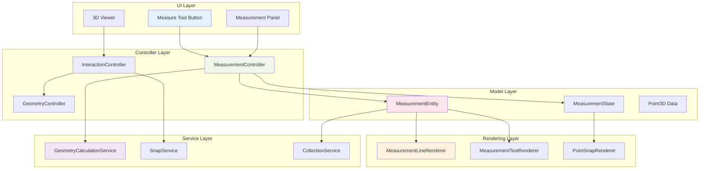

**System Architecture Description:**
This architecture uses a layered design, dividing the 3D distance measurement functionality into five core layers. The UI Layer contains the measurement tool activation button, a real-time data display panel, and the 3D interactive viewer. The Controller Layer uses the `MeasurementController` to manage the overall measurement logic, coordinating with the `InteractionController` and `GeometryController`. The Model Layer defines the data structure and state management for measurement entities. The Rendering Layer is responsible for the visual display of lines, text, and snap points in the 3D scene. The Service Layer provides core algorithm support, including geometry calculation, point snapping, and data persistence functions. Communication between layers is handled reactively through a signal system.

## 🔄 Interaction Flow Design

### User Interaction State Machine

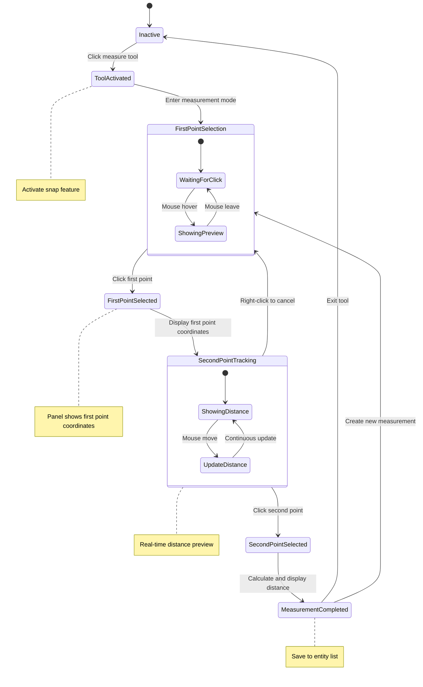

**Interaction State Machine Description:**
This state machine defines the complete interaction flow for the 3D distance measurement tool. Starting from an inactive state, the user clicks the measure tool button to enter the `ToolActivated` state, where the system enables the point snapping feature. In the `FirstPointSelection` stage, the user sees a hover preview. After clicking to confirm the first point, the panel displays its coordinates. The flow then enters the `SecondPointTracking` stage, where the system shows a dynamic distance value and a preview line; the user can right-click to cancel and return to `FirstPointSelection`. After confirming the second point, the measurement is completed. The system calculates and displays the full distance data and saves the measurement result to the entity list. The user can then choose to create a new measurement or exit the tool.

### Data Flow Process

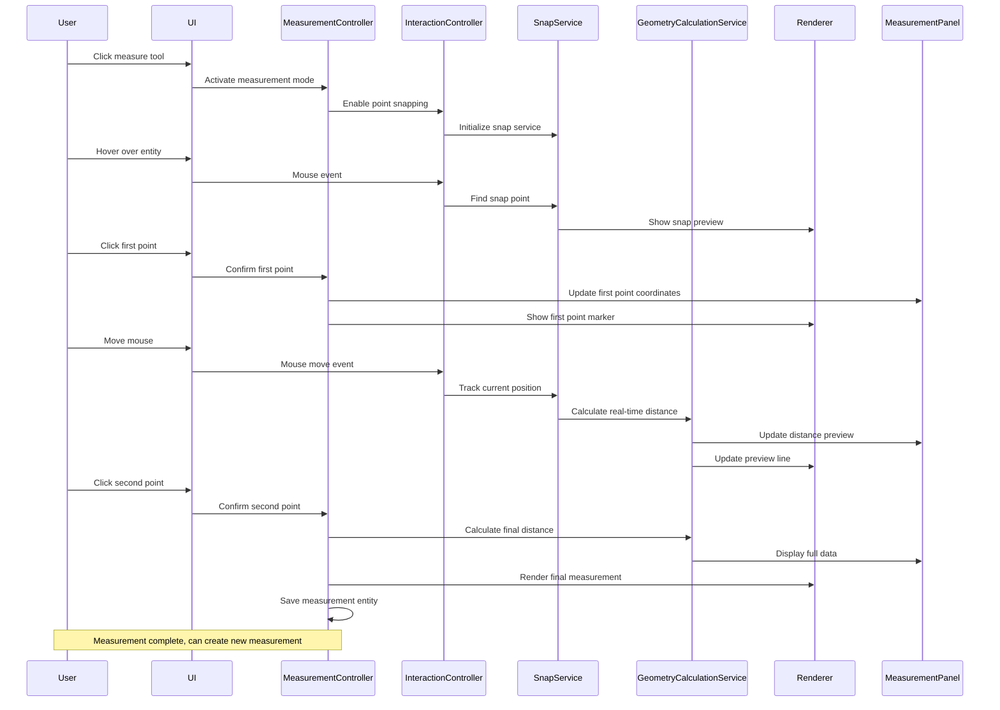

**Data Flow Description:**
This sequence diagram illustrates the complete data flow from user action to data rendering. When the user activates the measurement tool, the system enables interaction mode and the snap service via the controllers. On mouse hover, the snap service finds the nearest snappable point and provides visual feedback through the renderer. After the first point is confirmed, the system updates the panel with its coordinates and marks the point in the 3D scene. During mouse movement, the geometry calculation service continuously computes the distance from the current position to the first point, updating the panel data and preview line in real-time. Once the second point is confirmed, the system calculates the final, complete distance data, updates the panel display, renders the final measurement, and saves the measurement entity to a collection for later management.

## 📊 Data Model Design

### Measurement Entity Data Structure

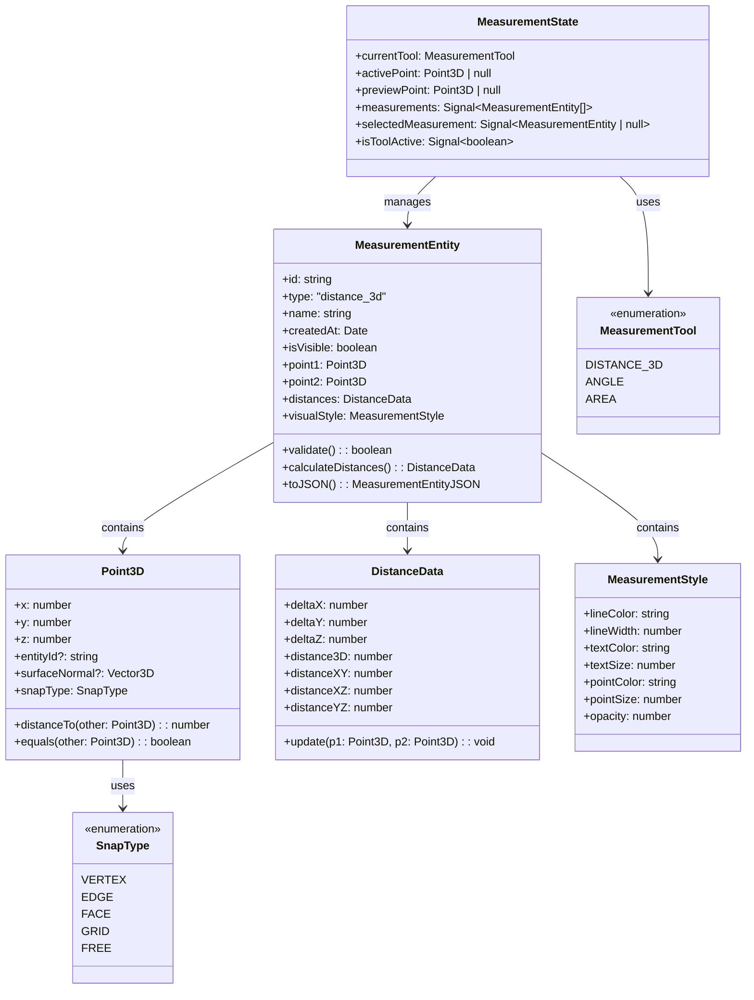

**Data Model Description:**
The core data model is centered around the `MeasurementEntity`, which contains two 3D points, distance data, and visual style information. The `Point3D` class stores not only coordinates but also the snap type and associated entity information, supporting surface normal data for precise snapping. The `DistanceData` class calculates and stores multi-dimensional distance information, including the 3D linear distance and component distances along each axis. `MeasurementStyle` defines the visual presentation parameters for the measurement result. `MeasurementState` manages the global measurement state via the Signal system, including the current tool mode, active point, preview point, and the collection of measurement entities, ensuring reactive synchronization between UI and data.

### Signal System Integration

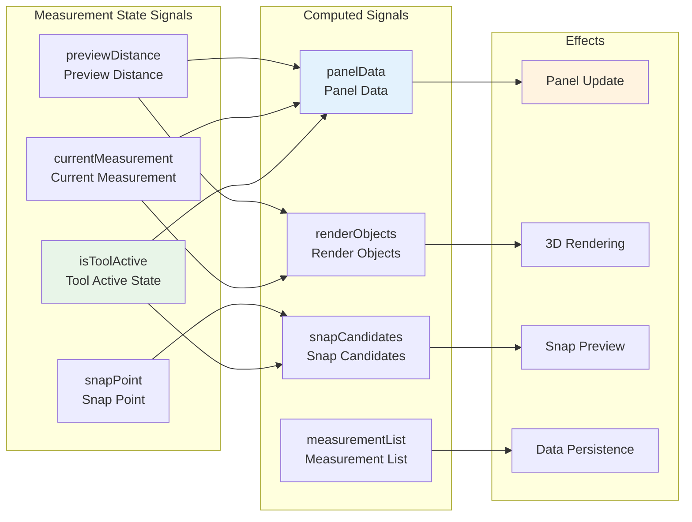

**Signal System Integration Description:**
The measurement functionality is deeply integrated into UVF's reactive signal system. Base state signals include the tool's active state, the current measurement object, the preview distance, and snap point information. Computed signals are derived from these base signals, automatically calculating panel display data, 3D render objects, snap candidates, and the list of measurement entities. The effect system listens for changes in computed signals and automatically triggers panel UI updates, 3D scene rendering, snap preview display, and data persistence operations. This reactive architecture ensures automatic propagation of data changes and real-time synchronization of the UI, so user actions are immediately reflected in all relevant display components.

## 🎨 Rendering Implementation Design

### 3D Rendering Pipeline

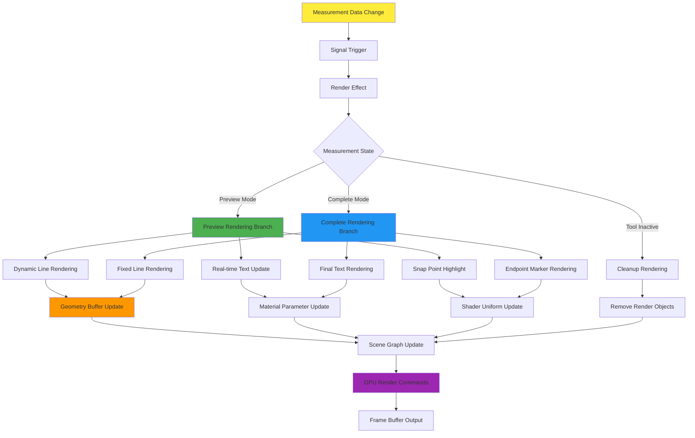

**3D Rendering Pipeline Description:**
The measurement tool's 3D rendering pipeline is built on UVF's reactive rendering system. When measurement data changes, the signal system triggers a render effect, which selects a different rendering branch based on the current measurement state. In preview mode, the system renders a dynamic line, updates the distance text in real-time, and highlights the snap point. In complete mode, it renders a fixed measurement line, the final distance text, and endpoint markers. Each rendering component updates its respective geometry buffers, material parameters, and shader uniforms, which are then consolidated in a scene graph update to generate GPU render commands and output to the frame buffer. When the tool is deactivated, a cleanup render is performed to remove all related render objects.

### Rendering Component Architecture

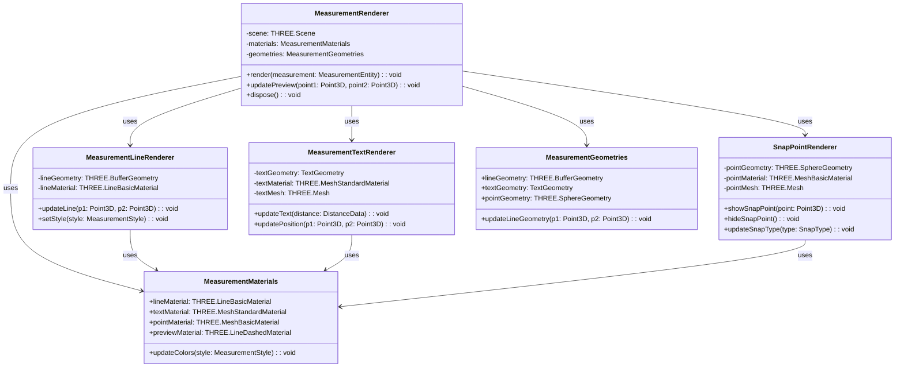

**Rendering Component Architecture Description:**
The rendering system uses a component-based design, with `MeasurementRenderer` acting as the main controller that coordinates various specialized renderers. `MeasurementLineRenderer` handles geometry and material updates for the distance line, supporting both real-time and static modes. `MeasurementTextRenderer` is responsible for generating and positioning 3D text, dynamically updating its content based on distance data. `SnapPointRenderer` manages the visual feedback for snap points, supporting different displays for various snap types. `MeasurementMaterials` and `MeasurementGeometries` provide shared management of rendering resources to optimize GPU usage. All components support style customization and dynamic updates to ensure the rendering effect is synchronized with user configurations.

## 🔧 Core Service Implementation

### Geometry Calculation Service

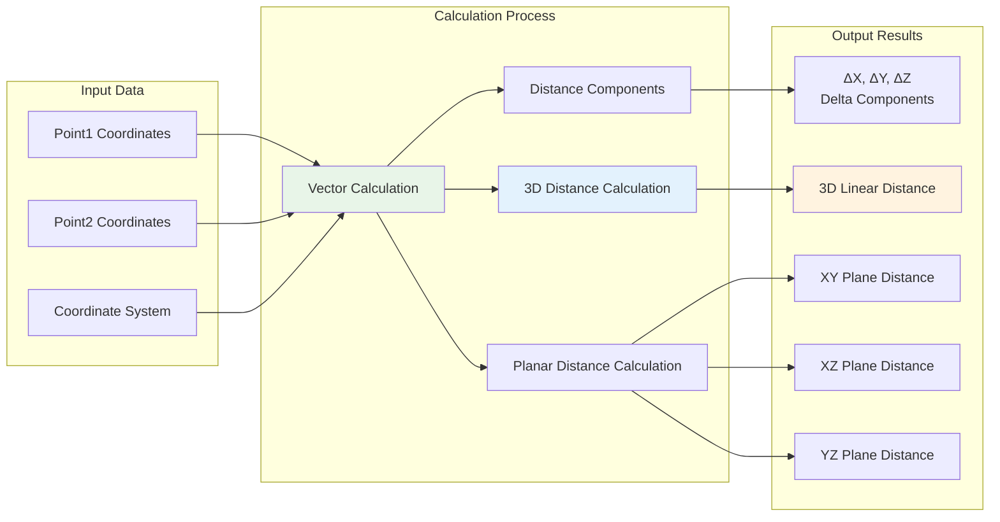

**Geometry Calculation Service Description:**
The geometry calculation service is the mathematical core of the measurement feature, responsible for all distance-related computations. The service takes two 3D point coordinates and coordinate system information as input, calculating the direction vector between the two points. Based on this vector, the system computes the distance components for each axis (ΔX, ΔY, ΔZ) and then calculates the linear distance in 3D space. Additionally, the service calculates the projected distances within each coordinate plane (XY, XZ, and YZ planes) to provide the user with comprehensive spatial distance analysis data. All calculations account for coordinate system transformations to ensure accuracy across different views and model coordinate systems.

### Point Snap Service Architecture

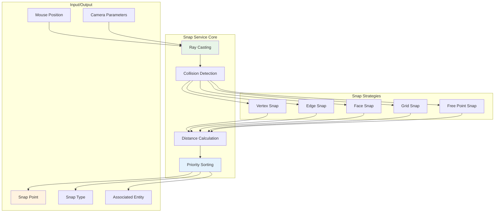

**Point Snap Service Description:**
The point snap service provides precise 3D point selection functionality, supporting five different snapping strategies. The service core is based on ray casting technology, converting the mouse position and camera parameters into a 3D ray, and then performing collision detection to find all possible snap targets. Different snap strategies handle different types of geometric elements: vertex snapping directly targets geometry vertices, edge snapping finds the nearest point on an edge, face snapping calculates the intersection point on a surface, grid snapping aligns to a virtual grid, and free point snapping allows selection at any position. The distance calculation module evaluates the distance of all candidate points from the mouse position, and priority sorting ensures that the most appropriate snap point is selected.

## 🖥️ User Interface Design

### Measurement Panel Component

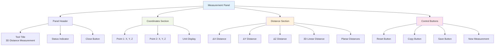

**Measurement Panel Component Description:**
The measurement panel uses a sectioned design to provide a clear information hierarchy. The panel header contains the tool title, a current status indicator (displaying states like "Select first point", "Select second point", "Measurement complete"), and a close button. The coordinates section displays the precise 3D coordinates of the two measurement points in real-time, including unit information and numerical precision control. The distance section shows a complete analysis of distance data, including components for each axis, the 3D linear distance, and projected distances on the XY, XZ, and YZ planes. The control buttons section provides measurement operations: Reset clears the current measurement, Copy copies the data to the clipboard, Save adds the measurement to the entity list, and New starts the next measurement. All numerical displays are read-only to ensure data integrity.

### Entity Management Interface

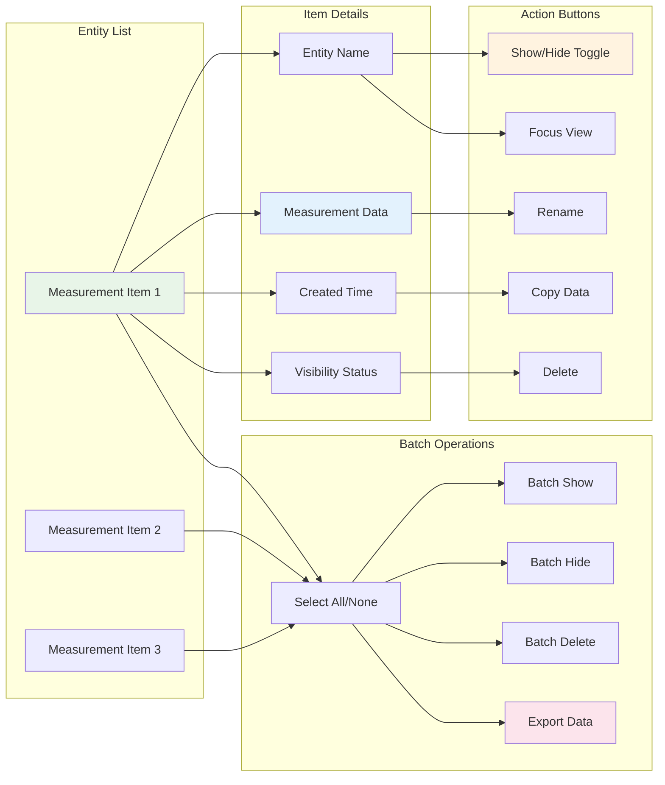

**Entity Management Interface Description:**
The entity management interface provides users with complete control over their measurement results. Each measurement entity item displays the entity name, key measurement data (like 3D distance), creation time, and current visibility status. Operations for a single entity include a show/hide toggle, rename, copy data, delete, and focus view. Batch operations support a multi-select mode, allowing users to manage multiple measurement entities simultaneously: select all or none, batch show or hide, batch delete, and export data. The interface design focuses on user experience, providing clear visual feedback and an intuitive workflow, supporting a consistent experience in both View and Draft modes.

## 🔄 State Management Integration

### Reactive State Flow

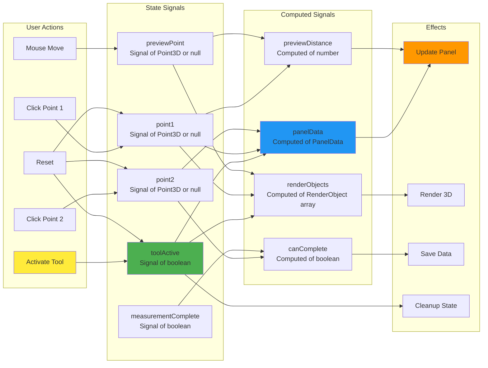

**Reactive State Flow Description:**
The measurement tool is built entirely on UVF's reactive state management system. User actions directly trigger corresponding state signal updates: activating the tool updates the `toolActive` signal, click actions update point signals, and mouse movement updates the preview point signal. Computed signals are automatically derived from the base state signals: `panelData` calculates the panel display data based on the current points, `previewDistance` calculates the preview distance in real-time, `renderObjects` generates the list of objects needed for 3D rendering, and `canComplete` determines if a measurement can be finalized. The effect system listens for changes in computed signals and automatically executes corresponding actions: updating the panel UI, rendering the 3D scene, saving measurement data, and cleaning up invalid states. This reactive architecture ensures automatic propagation of state changes and real-time UI synchronization.

## 📦 Implementation Plan

### Development Phase Planning

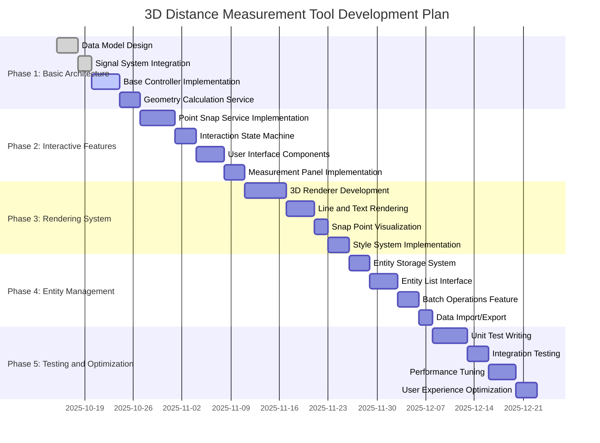

### Technical Risk Assessment

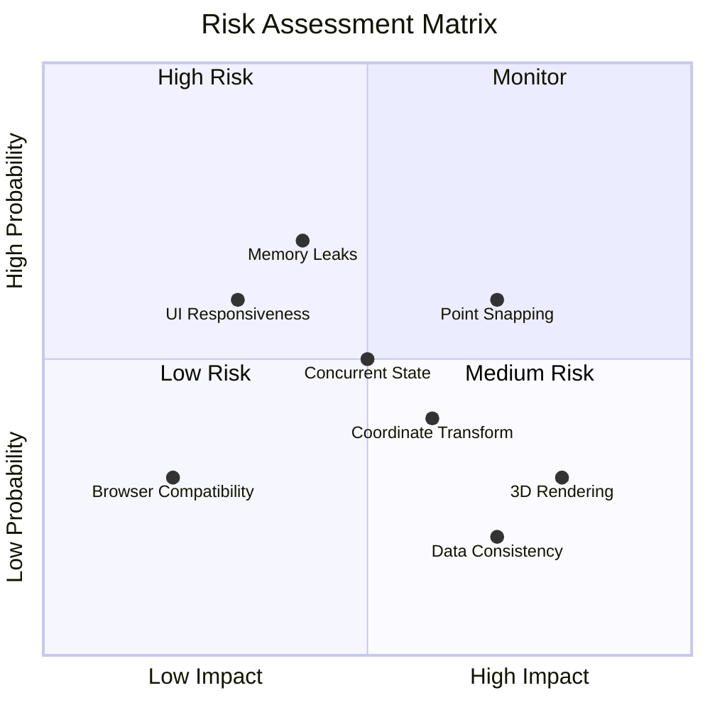

**Implementation Plan Description:**
The development plan is divided into five progressive phases, totaling approximately 35 working days. Phase 1 establishes the basic architecture, including the data model, signal system integration, and core controllers. Phase 2 implements user interaction features, focusing on the point snap service and interaction state machine. Phase 3 develops the 3D rendering system to visualize measurement results. Phase 4 builds entity management functionality, supporting persistence and batch operations for measurement results. Phase 5 involves comprehensive testing and optimization to ensure functional stability and a good user experience.

**Technical Risk Assessment** identifies key risk points: point snapping accuracy and memory leaks are high-probability risks requiring special attention; 3D rendering performance and data consistency are high-impact risks that need thorough testing; concurrent state management is a medium risk that requires a mitigation strategy.

## 🎯 Summary

This design document provides a complete technical implementation plan for the 3D distance measurement tool in the UVF framework. The design fully leverages the framework's reactive architecture, modular design, and Three.js rendering capabilities to ensure a high-quality implementation and a great user experience.

### Core Advantages

- **Reactive Architecture Integration**: Deep integration with the signal system ensures state synchronization and UI responsiveness.
- **Modular Design**: Clear separation of responsibilities facilitates maintenance and extension.
- **Professional 3D Rendering**: High-quality visual representation based on Three.js.
- **Refined Interaction Experience**: Intuitive point snapping and real-time preview functionality.
- **Complete Data Management**: Supports the full lifecycle management of measurement results.

### Technical Features

- **Precise Geometric Calculations**: Multi-dimensional distance analysis and coordinate system support.
- **Intelligent Point Snapping**: Multi-strategy snapping system for precise point selection.
- **Real-time Rendering Feedback**: Dynamic previews and immediate visual feedback.
- **Consistent State Management**: Reliable state synchronization based on the Signal system.
- **Extensible Design**: Ample interfaces reserved for future feature extensions.

This design plan provides a clear implementation path for the development team, ensuring that the 3D distance measurement tool can be seamlessly integrated into the UVF framework to provide users with professional-grade spatial analysis capabilities.