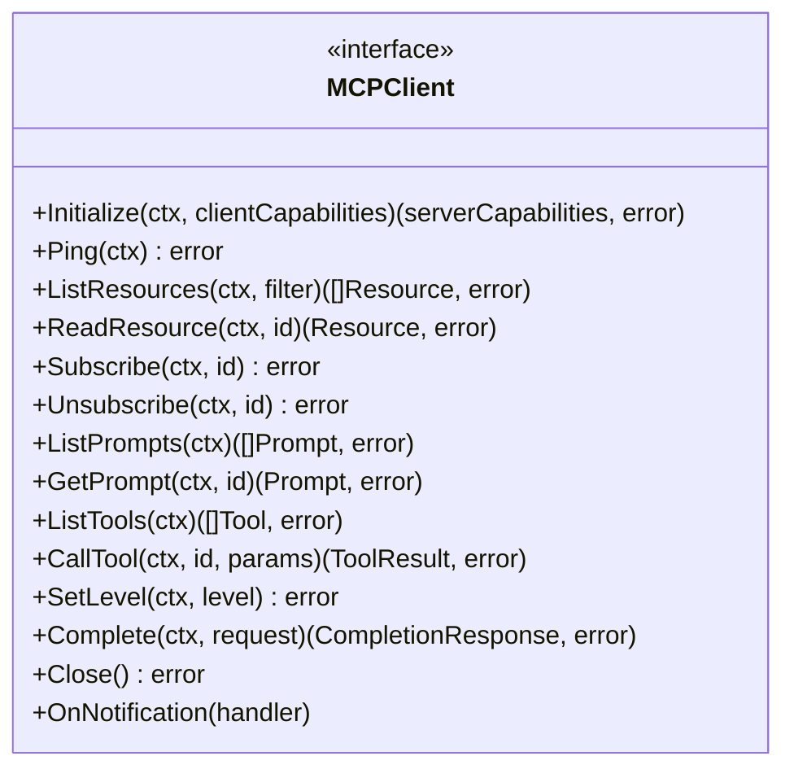
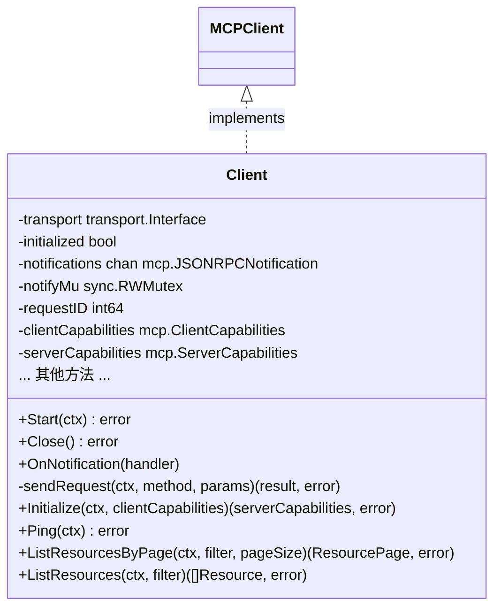
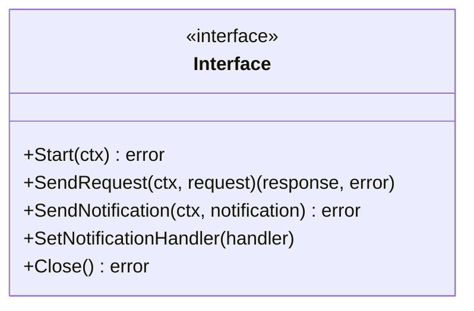
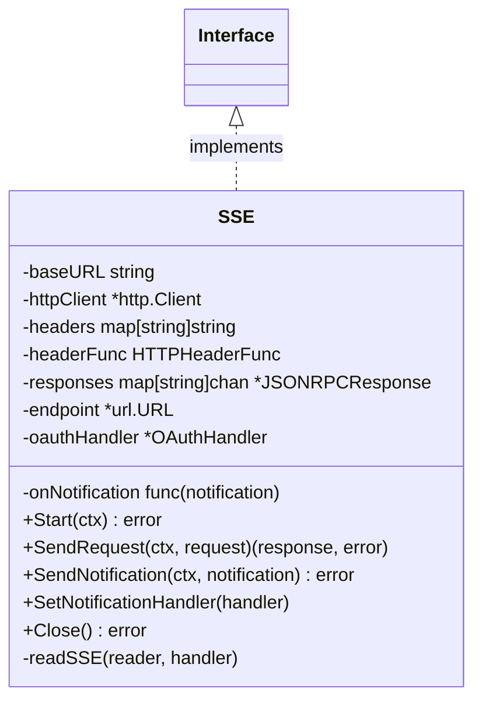
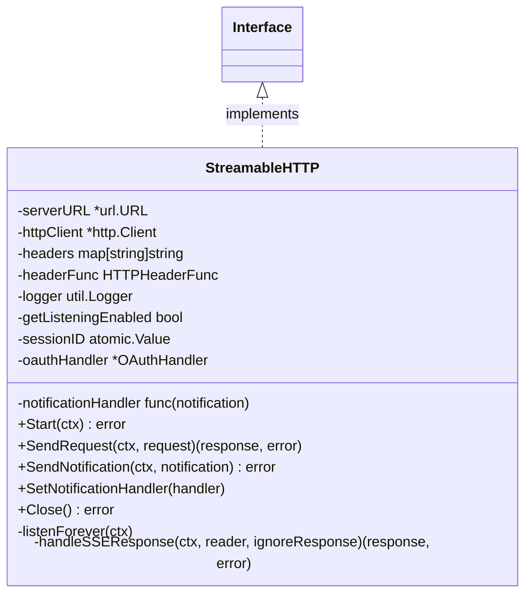
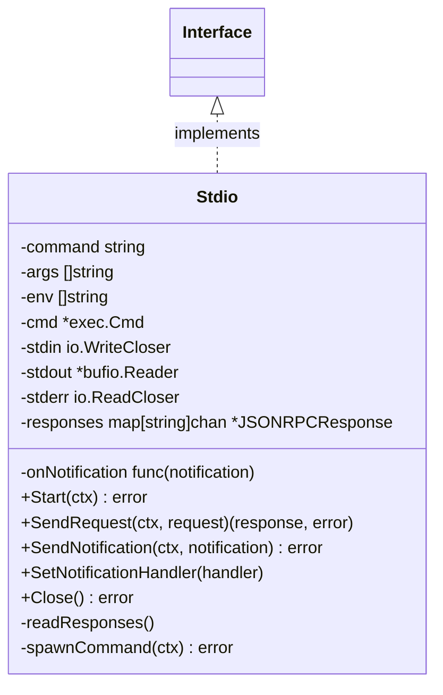
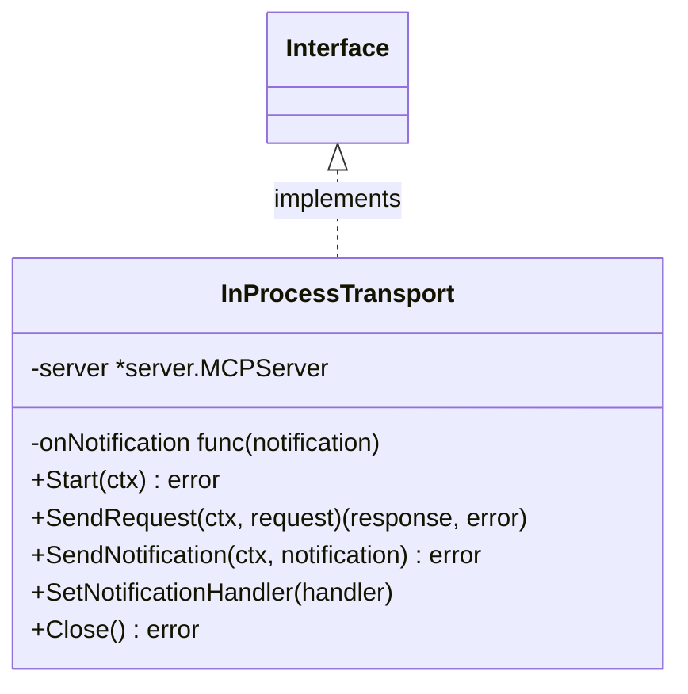
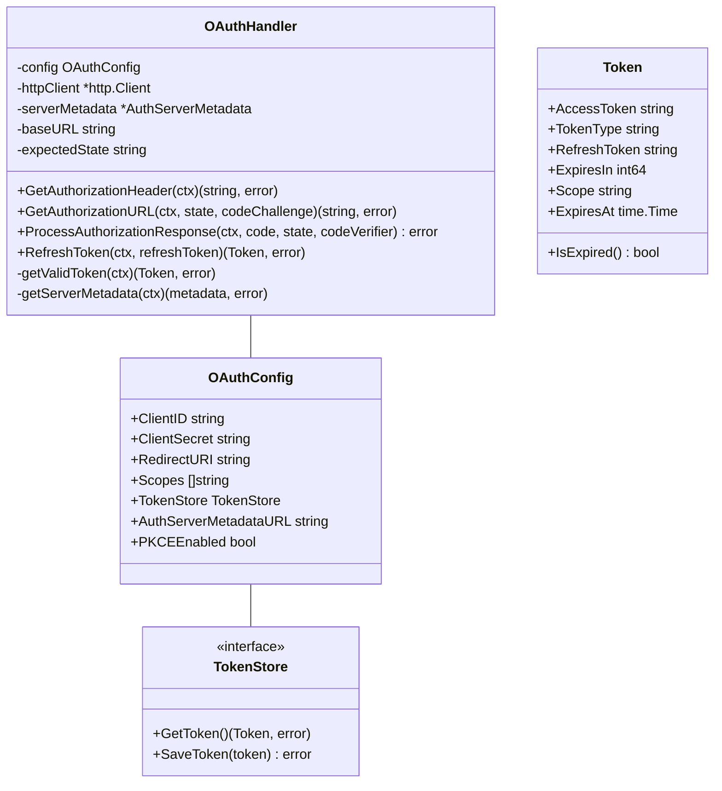

# MCP-Go Client 包架构分析

## 概述

MCP-Go Client 包是 Model Context Protocol (MCP) 的 Go 语言客户端实现，提供了与 MCP 服务器进行通信的功能。该包采用了模块化设计，通过接口抽象和多种传输层实现，使客户端能够灵活地适应不同的通信场景。

## 目录

- [接口定义](#接口定义)
- [核心客户端实现](#核心客户端实现)
- [传输层实现](#传输层实现)
  - [SSE 传输](#sse-传输)
  - [Streamable HTTP 传输](#streamable-http-传输)
  - [Stdio 传输](#stdio-传输)
  - [InProcess 传输](#inprocess-传输)
- [认证机制](#认证机制)
- [便捷客户端创建](#便捷客户端创建)
- [架构分析](#架构分析)
  - [设计模式](#设计模式)
  - [架构优势](#架构优势)
  - [潜在改进](#潜在改进)
- [总结](#总结)

## 接口定义

MCP-Go Client 包的核心是 `MCPClient` 接口，定义在 `interface.go` 文件中。该接口定义了客户端与 MCP 服务器交互的所有方法：

这个接口涵盖了：
- 连接初始化和管理（Initialize、Ping、Close）
- 资源管理（ListResources、ReadResource、Subscribe、Unsubscribe）
- 提示管理（ListPrompts、GetPrompt）
- 工具管理（ListTools、CallTool）
- 日志级别设置（SetLevel）
- 完成请求（Complete）
- 通知处理（OnNotification）

## 核心客户端实现

`Client` 结构体（定义在 `client.go` 文件中）是 `MCPClient` 接口的主要实现：

`Client` 结构体的主要特点：
1. 使用传输层接口（`transport.Interface`）进行通信，支持多种传输方式
2. 维护客户端状态（初始化状态、请求ID、能力等）
3. 处理通知的异步传递
4. 实现所有 `MCPClient` 接口定义的方法

## 传输层实现

传输层是 MCP-Go Client 包的核心组件之一，定义在 `transport` 子包中。传输层通过 `transport.Interface` 接口进行抽象：

该包提供了多种传输层实现，以适应不同的通信场景：

### SSE 传输

`SSE`（Server-Sent Events）传输实现使用 HTTP 长连接接收服务器推送的事件，并通过 HTTP POST 发送请求：

### Streamable HTTP 传输

`StreamableHTTP` 传输实现通过单独的 HTTP 请求传输 JSON-RPC 消息，每个请求一条消息：

### Stdio 传输

`Stdio` 传输实现通过标准输入/输出流与子进程通信：

### InProcess 传输

`InProcessTransport` 实现允许在同一进程内直接与 MCP 服务器通信，主要用于测试和集成场景：

## 认证机制

MCP-Go Client 包支持 OAuth 2.0 认证，通过 `OAuthHandler` 类实现：

## 便捷客户端创建

MCP-Go Client 包提供了多个便捷函数，用于创建不同类型的客户端：

```mermaid
classDiagram
    class Client
    class NewClient {
        <<function>>
        NewClient(transport) *Client
    }
    class NewSSEMCPClient {
        <<function>>
        NewSSEMCPClient(baseURL, options) (*Client, error)
    }
    class NewStreamableHttpClient {
        <<function>>
        NewStreamableHttpClient(baseURL, options) (*Client, error)
    }
    class NewStdioMCPClient {
        <<function>>
        NewStdioMCPClient(command, env, args) (*Client, error)
    }
    class NewInProcessClient {
        <<function>>
        NewInProcessClient(server) (*Client, error)
    }
    class NewOAuthStreamableHttpClient {
        <<function>>
        NewOAuthStreamableHttpClient(baseURL, oauthConfig, options) (*Client, error)
    }
    class NewOAuthSSEClient {
        <<function>>
        NewOAuthSSEClient(baseURL, oauthConfig, options) (*Client, error)
    }

    NewClient --> Client : creates
    NewSSEMCPClient --> Client : creates
    NewStreamableHttpClient --> Client : creates
    NewStdioMCPClient --> Client : creates
    NewInProcessClient --> Client : creates
    NewOAuthStreamableHttpClient --> Client : creates
    NewOAuthSSEClient --> Client : creates
```

## 架构分析

### 设计模式

MCP-Go Client 包中使用了多种设计模式：

1. **策略模式**：通过 `transport.Interface` 接口抽象不同的传输策略，客户端可以根据需要选择不同的传输实现。

2. **工厂方法模式**：提供了多个工厂函数（如 `NewSSEMCPClient`、`NewStdioMCPClient` 等）来创建不同类型的客户端实例。

3. **装饰器模式**：OAuth 认证功能作为一种装饰，可以添加到不同的传输实现上。

4. **观察者模式**：通知处理机制使用了观察者模式，客户端可以注册处理函数来接收服务器发送的通知。

5. **选项模式**：使用函数选项模式（如 `WithHeaders`、`WithHTTPClient` 等）来配置客户端和传输层。

### 架构优势

1. **高度模块化**：传输层与客户端逻辑分离，使代码更易于维护和扩展。

2. **接口驱动设计**：通过接口抽象，实现了不同组件之间的松耦合。

3. **可扩展性**：可以轻松添加新的传输实现或认证机制。

4. **灵活配置**：使用选项模式，允许灵活配置客户端和传输层的行为。

5. **完整的错误处理**：提供了详细的错误信息和错误处理机制。

### 潜在改进

1. **上下文管理**：可以更一致地使用 `context.Context` 来管理请求的生命周期和取消。

2. **重试机制**：添加自动重试机制，处理临时网络故障。

3. **连接池**：对于 HTTP 传输，可以实现连接池以提高性能。

4. **指标收集**：添加指标收集功能，以便监控客户端性能和行为。

5. **更强大的类型安全**：使用泛型（Go 1.18+）改进类型安全性。

6. **更完善的测试覆盖**：增加更多的单元测试和集成测试。

## 总结

MCP-Go Client 包是一个设计良好的客户端库，通过接口抽象和多种传输实现，提供了灵活且可扩展的 MCP 客户端功能。该包使用了多种设计模式，实现了高度模块化和松耦合的架构，同时提供了便捷的客户端创建函数和完善的错误处理机制。

通过分析，我们可以看到该包在设计上注重了灵活性、可扩展性和易用性，同时也有一些潜在的改进空间，如增强上下文管理、添加重试机制和指标收集等。总体而言，MCP-Go Client 包是一个功能完善、设计合理的客户端库，适合用于与 MCP 服务器进行通信的各种场景。