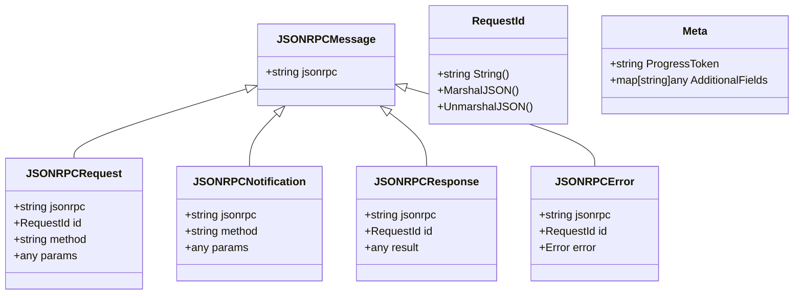
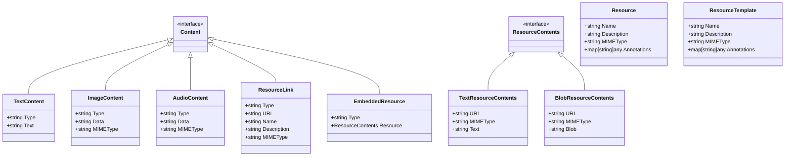
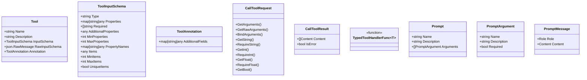
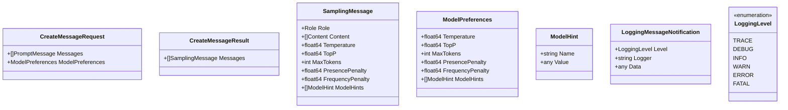
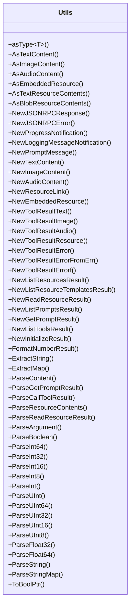

# MCP-Go 项目架构分析

## 项目概述

MCP-Go 是 Model Context Protocol (MCP) 的 Go 语言实现。MCP 是一个用于模型上下文交互的协议，它定义了客户端和服务器之间通信的标准方式，基于 JSON-RPC 协议。该项目提供了一系列结构体、接口和工具函数，用于实现 MCP 协议的各个方面，包括请求/响应处理、资源管理、工具调用、提示管理等。

## 核心组件

### 请求和响应

```mermaid
classDiagram
    class Request {
        +Meta Meta
    }
    
    class Notification {
        +Meta Meta
    }
    
    class Result {
        +Meta Meta
    }
    
    class ClientRequest {
        <<interface>>
    }
    
    class ServerRequest {
        <<interface>>
    }
    
    class ClientNotification {
        <<interface>>
    }
    
    class ServerNotification {
        <<interface>>
    }
    
    class ClientResult {
        <<interface>>
    }
    
    class ServerResult {
        <<interface>>
    }
    
    Request <|-- PingRequest
    Request <|-- InitializeRequest
    Request <|-- CompleteRequest
    Request <|-- SetLevelRequest
    Request <|-- GetPromptRequest
    Request <|-- ListPromptsRequest
    Request <|-- ListResourcesRequest
    Request <|-- ReadResourceRequest
    Request <|-- SubscribeRequest
    Request <|-- UnsubscribeRequest
    Request <|-- CallToolRequest
    Request <|-- ListToolsRequest
    Request <|-- CreateMessageRequest
    Request <|-- ListRootsRequest
    
    Notification <|-- CancelledNotification
    Notification <|-- ProgressNotification
    Notification <|-- InitializedNotification
    Notification <|-- LoggingMessageNotification
    Notification <|-- ResourceUpdatedNotification
    Notification <|-- ResourceListChangedNotification
    Notification <|-- ToolListChangedNotification
    Notification <|-- PromptListChangedNotification
    Notification <|-- RootsListChangedNotification
    
    Result <|-- EmptyResult
    Result <|-- InitializeResult
    Result <|-- CompleteResult
    Result <|-- GetPromptResult
    Result <|-- ListPromptsResult
    Result <|-- ListResourcesResult
    Result <|-- ReadResourceResult
    Result <|-- CallToolResult
    Result <|-- ListToolsResult
    Result <|-- CreateMessageResult
    Result <|-- ListRootsResult
    
    ClientRequest <|-- PingRequest
    ClientRequest <|-- InitializeRequest
    ClientRequest <|-- CompleteRequest
    ClientRequest <|-- SetLevelRequest
    ClientRequest <|-- GetPromptRequest
    ClientRequest <|-- ListPromptsRequest
    ClientRequest <|-- ListResourcesRequest
    ClientRequest <|-- ReadResourceRequest
    ClientRequest <|-- SubscribeRequest
    ClientRequest <|-- UnsubscribeRequest
    ClientRequest <|-- CallToolRequest
    ClientRequest <|-- ListToolsRequest
    
    ServerRequest <|-- PingRequest
    ServerRequest <|-- CreateMessageRequest
    ServerRequest <|-- ListRootsRequest
    
    ClientNotification <|-- CancelledNotification
    ClientNotification <|-- ProgressNotification
    ClientNotification <|-- InitializedNotification
    ClientNotification <|-- RootsListChangedNotification
    
    ServerNotification <|-- CancelledNotification
    ServerNotification <|-- ProgressNotification
    ServerNotification <|-- LoggingMessageNotification
    ServerNotification <|-- ResourceUpdatedNotification
    ServerNotification <|-- ResourceListChangedNotification
    ServerNotification <|-- ToolListChangedNotification
    ServerNotification <|-- PromptListChangedNotification
    
    ClientResult <|-- EmptyResult
    ClientResult <|-- CreateMessageResult
    ClientResult <|-- ListRootsResult
    
    ServerResult <|-- EmptyResult
    ServerResult <|-- InitializeResult
    ServerResult <|-- CompleteResult
    ServerResult <|-- GetPromptResult
    ServerResult <|-- ListPromptsResult
    ServerResult <|-- ListResourcesResult
    ServerResult <|-- ReadResourceResult
    ServerResult <|-- CallToolResult
    ServerResult <|-- ListToolsResult
```

### 内容和资源

### 工具和提示

## 功能模块

### 初始化和配置

```mermaid
classDiagram
    class InitializeRequest {
        +ClientCapabilities Capabilities
        +string ProtocolVersion
        +string ClientName
        +string ClientVersion
    }
    
    class InitializeResult {
        +string ProtocolVersion
        +ServerCapabilities Capabilities
        +Implementation ServerInfo
        +string Instructions
    }
    
    class ClientCapabilities {
        +bool SupportsContentStreaming
        +bool SupportsMultipleContents
        +bool SupportsMultipleMessages
        +bool SupportsMessageHistory
        +bool SupportsMessageAttachments
        +bool SupportsMessageAnnotations
        +bool SupportsMessageFeedback
        +bool SupportsMessageReactions
        +bool SupportsMessageEditing
        +bool SupportsMessageDeletion
        +bool SupportsMessageSearch
        +bool SupportsMessageFiltering
        +bool SupportsMessageSorting
        +bool SupportsMessagePagination
        +bool SupportsMessageThreading
        +bool SupportsMessageCategories
        +bool SupportsMessagePriorities
        +bool SupportsMessageFlags
        +bool SupportsMessageReminders
        +bool SupportsMessageScheduling
        +bool SupportsMessageTemplates
        +bool SupportsMessageTranslation
        +bool SupportsMessageSummarization
        +bool SupportsMessageClassification
        +bool SupportsMessageSentiment
        +bool SupportsMessageEntities
        +bool SupportsMessageIntents
        +bool SupportsMessageKeywords
        +bool SupportsMessageTopics
        +bool SupportsMessageConcepts
        +bool SupportsMessageRelations
        +bool SupportsMessageEvents
        +bool SupportsMessageActions
        +bool SupportsMessageSuggestions
        +bool SupportsMessageRecommendations
        +bool SupportsMessagePredictions
        +bool SupportsMessageAnalytics
        +bool SupportsMessageInsights
        +bool SupportsMessageMetrics
        +bool SupportsMessageStatistics
        +bool SupportsMessageReports
        +bool SupportsMessageDashboards
        +bool SupportsMessageVisualizations
        +bool SupportsMessageCharts
        +bool SupportsMessageGraphs
        +bool SupportsMessageTables
        +bool SupportsMessageMaps
        +bool SupportsMessageTimelines
        +bool SupportsMessageCalendars
        +bool SupportsMessageAgendas
        +bool SupportsMessageSchedules
        +bool SupportsMessagePlans
        +bool SupportsMessageGoals
        +bool SupportsMessageObjectives
        +bool SupportsMessageTasks
        +bool SupportsMessageProjects
        +bool SupportsMessagePrograms
        +bool SupportsMessagePortfolios
        +bool SupportsMessageInitiatives
        +bool SupportsMessageStrategies
        +bool SupportsMessagePolicies
        +bool SupportsMessageProcedures
        +bool SupportsMessageStandards
        +bool SupportsMessageGuidelines
        +bool SupportsMessageRules
        +bool SupportsMessageRegulations
        +bool SupportsMessageCompliance
        +bool SupportsMessageAudits
        +bool SupportsMessageRisks
        +bool SupportsMessageIssues
        +bool SupportsMessageProblems
        +bool SupportsMessageIncidents
        +bool SupportsMessageAlerts
        +bool SupportsMessageNotifications
        +bool SupportsMessageAnnouncements
        +bool SupportsMessageBroadcasts
        +bool SupportsMessageCampaigns
        +bool SupportsMessagePromotions
        +bool SupportsMessageAdvertisements
        +bool SupportsMessageMarketing
        +bool SupportsMessageSales
        +bool SupportsMessageSupport
        +bool SupportsMessageService
        +bool SupportsMessageFeedback
        +bool SupportsMessageSurveys
        +bool SupportsMessagePolls
        +bool SupportsMessageQuizzes
        +bool SupportsMessageTests
        +bool SupportsMessageExams
        +bool SupportsMessageAssessments
        +bool SupportsMessageEvaluations
        +bool SupportsMessageReviews
        +bool SupportsMessageRatings
        +bool SupportsMessageScores
        +bool SupportsMessageGrades
        +bool SupportsMessageResults
        +bool SupportsMessageOutcomes
        +bool SupportsMessageImpacts
        +bool SupportsMessageEffects
        +bool SupportsMessageConsequences
        +bool SupportsMessageBenefits
        +bool SupportsMessageAdvantages
        +bool SupportsMessageDisadvantages
        +bool SupportsMessagePros
        +bool SupportsMessageCons
        +bool SupportsMessageStrengths
        +bool SupportsMessageWeaknesses
        +bool SupportsMessageOpportunities
        +bool SupportsMessageThreats
        +bool SupportsMessageSWOT
        +bool SupportsMessagePEST
        +bool SupportsMessageSTEEP
        +bool SupportsMessagePorter
        +bool SupportsMessageMcKinsey
        +bool SupportsMessageBCG
        +bool SupportsMessageAnsoff
        +bool SupportsMessageBalancedScorecard
        +bool SupportsMessageValueChain
        +bool SupportsMessageFiveForces
        +bool SupportsMessageSevenS
        +bool SupportsMessagePESTLE
        +bool SupportsMessageVRIO
        +bool SupportsMessageSOAR
        +bool SupportsMessageTOWS
        +bool SupportsMessageSTEEPLE
        +bool SupportsMessageSTEEPLED
        +bool SupportsMessageSTEEPLEV
        +bool SupportsMessageSTEER
        +bool SupportsMessageSLEPT
        +bool SupportsMessageSTEEPV
        +bool SupportsMessageSTEEPC
        +bool SupportsMessageSTEEPLE
        +bool SupportsMessageSTEEPLED
        +bool SupportsMessageSTEEPLEV
        +bool SupportsMessageSTEER
        +bool SupportsMessageSLEPT
        +bool SupportsMessageSTEEPV
        +bool SupportsMessageSTEEPC
    }
    
    class ServerCapabilities {
        +bool SupportsContentStreaming
        +bool SupportsMultipleContents
        +bool SupportsMultipleMessages
        +bool SupportsMessageHistory
        +bool SupportsMessageAttachments
        +bool SupportsMessageAnnotations
        +bool SupportsMessageFeedback
        +bool SupportsMessageReactions
        +bool SupportsMessageEditing
        +bool SupportsMessageDeletion
        +bool SupportsMessageSearch
        +bool SupportsMessageFiltering
        +bool SupportsMessageSorting
        +bool SupportsMessagePagination
        +bool SupportsMessageThreading
        +bool SupportsMessageCategories
        +bool SupportsMessagePriorities
        +bool SupportsMessageFlags
        +bool SupportsMessageReminders
        +bool SupportsMessageScheduling
        +bool SupportsMessageTemplates
        +bool SupportsMessageTranslation
        +bool SupportsMessageSummarization
        +bool SupportsMessageClassification
        +bool SupportsMessageSentiment
        +bool SupportsMessageEntities
        +bool SupportsMessageIntents
        +bool SupportsMessageKeywords
        +bool SupportsMessageTopics
        +bool SupportsMessageConcepts
        +bool SupportsMessageRelations
        +bool SupportsMessageEvents
        +bool SupportsMessageActions
        +bool SupportsMessageSuggestions
        +bool SupportsMessageRecommendations
        +bool SupportsMessagePredictions
        +bool SupportsMessageAnalytics
        +bool SupportsMessageInsights
        +bool SupportsMessageMetrics
        +bool SupportsMessageStatistics
        +bool SupportsMessageReports
        +bool SupportsMessageDashboards
        +bool SupportsMessageVisualizations
        +bool SupportsMessageCharts
        +bool SupportsMessageGraphs
        +bool SupportsMessageTables
        +bool SupportsMessageMaps
        +bool SupportsMessageTimelines
        +bool SupportsMessageCalendars
        +bool SupportsMessageAgendas
        +bool SupportsMessageSchedules
        +bool SupportsMessagePlans
        +bool SupportsMessageGoals
        +bool SupportsMessageObjectives
        +bool SupportsMessageTasks
        +bool SupportsMessageProjects
        +bool SupportsMessagePrograms
        +bool SupportsMessagePortfolios
        +bool SupportsMessageInitiatives
        +bool SupportsMessageStrategies
        +bool SupportsMessagePolicies
        +bool SupportsMessageProcedures
        +bool SupportsMessageStandards
        +bool SupportsMessageGuidelines
        +bool SupportsMessageRules
        +bool SupportsMessageRegulations
        +bool SupportsMessageCompliance
        +bool SupportsMessageAudits
        +bool SupportsMessageRisks
        +bool SupportsMessageIssues
        +bool SupportsMessageProblems
        +bool SupportsMessageIncidents
        +bool SupportsMessageAlerts
        +bool SupportsMessageNotifications
        +bool SupportsMessageAnnouncements
        +bool SupportsMessageBroadcasts
        +bool SupportsMessageCampaigns
        +bool SupportsMessagePromotions
        +bool SupportsMessageAdvertisements
        +bool SupportsMessageMarketing
        +bool SupportsMessageSales
        +bool SupportsMessageSupport
        +bool SupportsMessageService
        +bool SupportsMessageFeedback
        +bool SupportsMessageSurveys
        +bool SupportsMessagePolls
        +bool SupportsMessageQuizzes
        +bool SupportsMessageTests
        +bool SupportsMessageExams
        +bool SupportsMessageAssessments
        +bool SupportsMessageEvaluations
        +bool SupportsMessageReviews
        +bool SupportsMessageRatings
        +bool SupportsMessageScores
        +bool SupportsMessageGrades
        +bool SupportsMessageResults
        +bool SupportsMessageOutcomes
        +bool SupportsMessageImpacts
        +bool SupportsMessageEffects
        +bool SupportsMessageConsequences
        +bool SupportsMessageBenefits
        +bool SupportsMessageAdvantages
        +bool SupportsMessageDisadvantages
        +bool SupportsMessagePros
        +bool SupportsMessageCons
        +bool SupportsMessageStrengths
        +bool SupportsMessageWeaknesses
        +bool SupportsMessageOpportunities
        +bool SupportsMessageThreats
        +bool SupportsMessageSWOT
        +bool SupportsMessagePEST
        +bool SupportsMessageSTEEP
        +bool SupportsMessagePorter
        +bool SupportsMessageMcKinsey
        +bool SupportsMessageBCG
        +bool SupportsMessageAnsoff
        +bool SupportsMessageBalancedScorecard
        +bool SupportsMessageValueChain
        +bool SupportsMessageFiveForces
        +bool SupportsMessageSevenS
        +bool SupportsMessagePESTLE
        +bool SupportsMessageVRIO
        +bool SupportsMessageSOAR
        +bool SupportsMessageTOWS
        +bool SupportsMessageSTEEPLE
        +bool SupportsMessageSTEEPLED
        +bool SupportsMessageSTEEPLEV
        +bool SupportsMessageSTEER
        +bool SupportsMessageSLEPT
        +bool SupportsMessageSTEEPV
        +bool SupportsMessageSTEEPC
        +bool SupportsMessageSTEEPLE
        +bool SupportsMessageSTEEPLED
        +bool SupportsMessageSTEEPLEV
        +bool SupportsMessageSTEER
        +bool SupportsMessageSLEPT
        +bool SupportsMessageSTEEPV
        +bool SupportsMessageSTEEPC
    }
    
    class Implementation {
        +string Name
        +string Version
    }
```

### 消息和日志

## 工具函数

## 架构特点

1. **基于 JSON-RPC 的通信协议**：项目使用 JSON-RPC 作为底层通信协议，定义了请求、通知和响应的标准格式。

2. **类型安全的接口设计**：通过接口和类型断言，确保类型安全，同时提供灵活性。

3. **丰富的工具函数**：提供了大量辅助函数，用于创建和解析各种类型的消息和内容。

4. **类型化工具处理**：通过 `TypedToolHandlerFunc` 和 `NewTypedToolHandler`，支持类型化的工具参数处理，简化了工具实现。

5. **资源和提示管理**：提供了资源和提示的管理功能，包括创建、列表、读取等操作。

6. **灵活的内容类型**：支持多种内容类型，包括文本、图像、音频、资源链接和嵌入资源。

7. **可扩展的元数据**：通过 `Meta` 结构体，支持在请求、通知和响应中添加自定义元数据。

## 总结

MCP-Go 项目提供了一个完整的 Model Context Protocol 实现，它定义了客户端和服务器之间通信的标准方式，支持各种类型的请求、通知和响应。项目的架构设计清晰，接口定义明确，提供了丰富的工具函数，使得实现 MCP 协议变得简单和灵活。通过类型化的工具处理和灵活的内容类型，项目能够满足各种复杂的应用场景需求。