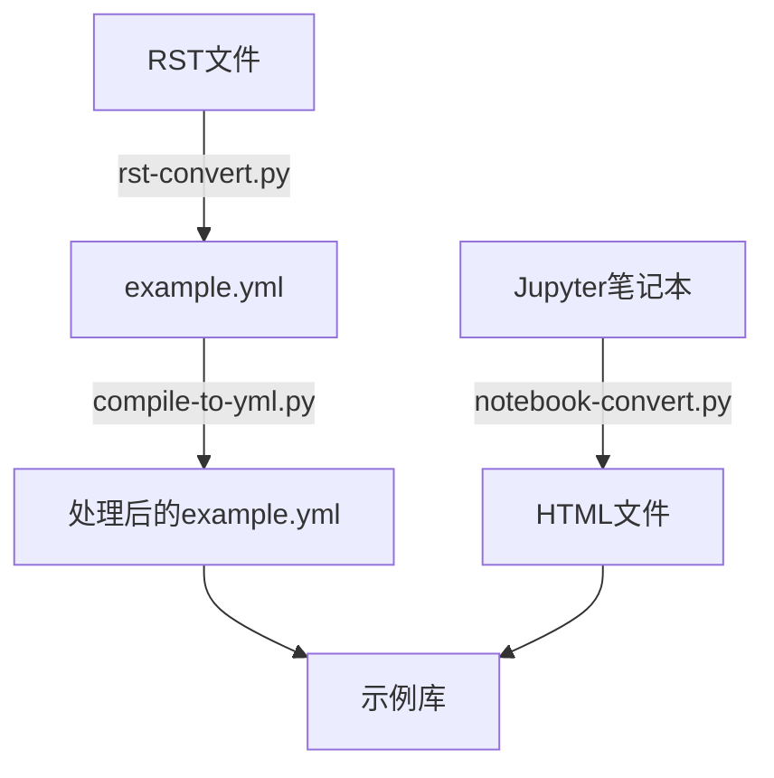
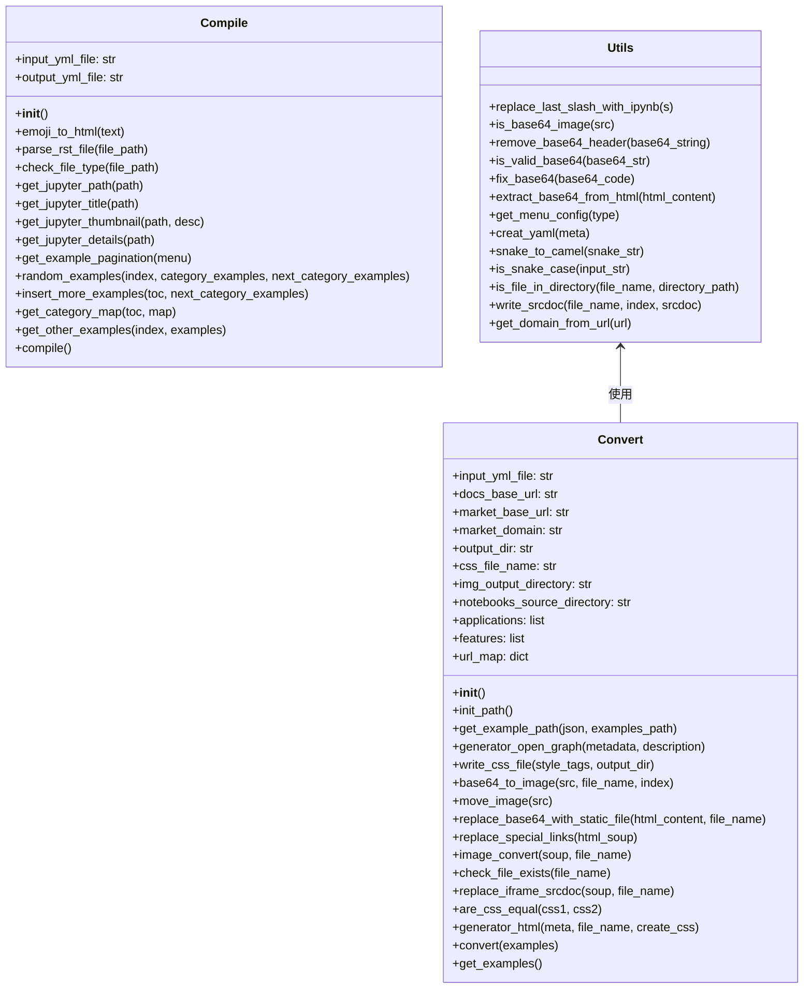
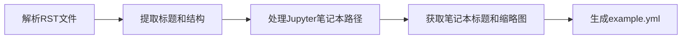
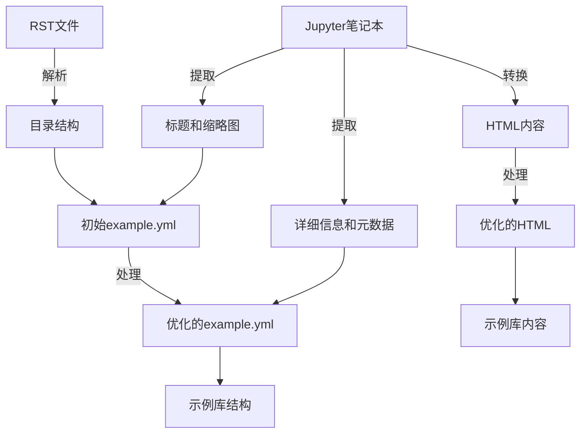

---
title: "Tidy3D 示例库代码架构分析"
date: 2023-11-15T10:00:00+08:00
author: "Tidy3D团队"
description: "对Tidy3D示例库代码的架构分析，包括compile-to-yml.py、notebook-convert.py和rst-convert.py三个核心文件的功能和关系"
tags: ["架构分析", "代码解析", "Tidy3D", "示例库"]
categories: ["技术文档", "架构设计"]
draft: false
---

# Tidy3D 示例库代码架构分析

本文档提供了对Tidy3D示例库代码的架构分析，主要关注三个核心文件：`compile-to-yml.py`、`notebook-convert.py`和`rst-convert.py`。这些文件共同构成了一个处理和转换Jupyter笔记本和RST文件的工作流程，用于生成结构化的示例库。

## 系统概述

这三个文件组成了一个完整的工作流程，用于将RST文件和Jupyter笔记本转换为结构化的示例库：

## 类图

以下是三个主要文件中定义的类及其关系：

## 功能模块分析

### rst-convert.py

这个文件主要负责解析RST文件并生成初始的YAML结构。

主要功能：
- 解析RST文件中的标题层次结构（H1、H2、H3）
- 提取Jupyter笔记本的路径信息
- 从Jupyter笔记本中获取标题和缩略图
- 构建目录结构并生成example.yml文件
- 为示例添加分页和"更多示例"功能

### compile-to-yml.py

这个文件进一步处理由rst-convert.py生成的example.yml文件，添加更多元数据和结构。

主要功能：
- 将自定义表情符号转换为HTML实体
- 从Jupyter笔记本中提取详细信息（标题、缩略图、应用和特性）
- 为示例添加分页功能
- 随机选择相关示例作为"更多示例"
- 更新和优化example.yml文件结构

### notebook-convert.py

这个文件负责将Jupyter笔记本转换为HTML文件，并进行各种处理以优化显示效果。

主要功能：
- 将Jupyter笔记本转换为HTML
- 处理和优化图片（Base64解码、移动到静态目录）
- 替换特殊链接和URL
- 处理iframe内容
- 生成带有元数据的HTML文件
- 添加CSS样式和Open Graph元数据

## 数据流分析

## 总结

这三个文件共同构成了一个完整的工作流程，用于将RST文件和Jupyter笔记本转换为结构化的示例库：

1. **rst-convert.py** 解析RST文件，提取目录结构和Jupyter笔记本路径，生成初始的example.yml文件。

2. **compile-to-yml.py** 进一步处理example.yml文件，添加更多元数据和结构，如分页信息和随机示例。

3. **notebook-convert.py** 将Jupyter笔记本转换为HTML文件，处理图片和链接，添加CSS样式和元数据。

这个工作流程的最终目标是生成一个结构良好、易于导航的示例库，包含丰富的元数据和交叉引用。