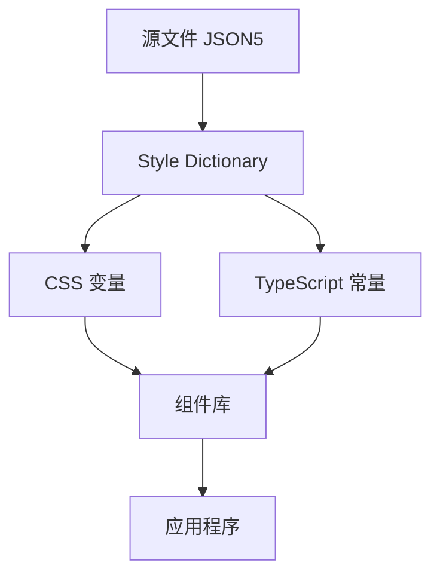
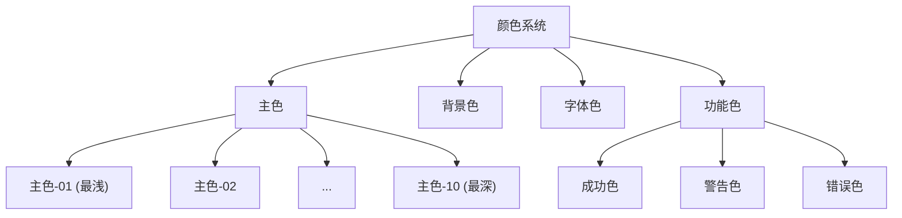
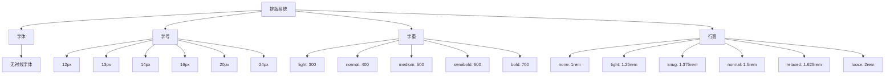

---
title: "设计令牌系统分析与实践"
date: 2023-11-15
description: "深入分析 @flex/design-tokens 包的实现原理与最佳实践"
tags: ["设计系统", "设计令牌", "Style Dictionary", "前端架构"]
categories: ["前端技术", "设计系统"]
author: "前端架构团队"
draft: false
---

# 设计令牌系统分析与实践

## 1. 概述

设计令牌（Design Tokens）是设计系统的基础构建块，它们将设计决策编码为可在各种平台和技术栈中使用的变量。`@flex/design-tokens` 包是一个基于 Style Dictionary 的设计令牌管理系统，它提供了一种统一、可维护和可扩展的方式来管理设计系统中的视觉属性。

## 2. 技术架构

### 2.1 核心技术栈

- **Style Dictionary**: 用于将设计令牌从源格式转换为各种平台可用的格式
- **JSON5**: 用于定义设计令牌，支持注释和更灵活的语法
- **TypeScript**: 用于构建脚本和类型定义

### 2.2 架构图



### 2.3 工作流程

1. 设计师和开发人员协作定义设计令牌
2. 令牌以 JSON5 格式存储在 `src/` 目录中
3. Style Dictionary 处理这些文件并生成输出
4. 输出文件（CSS 变量和 TypeScript 常量）被导入到组件和应用程序中

## 3. 设计令牌结构

### 3.1 分类体系

设计令牌按照语义化的方式组织，主要包括以下几个类别：

- **边框 (border)**: 边框相关的令牌，如圆角半径
- **颜色 (color)**: 颜色相关的令牌，包括主色、中性色和功能色
- **阴影 (shadow)**: 阴影效果相关的令牌
- **间距 (spacing)**: 间距相关的令牌，用于边距和内边距
- **系统 (system)**: 系统级别的通用令牌
- **排版 (typography)**: 排版相关的令牌，如字体、字号、字重和行高

### 3.2 命名规范

设计令牌采用层次化的命名方式，反映了它们的分类和用途：

```
<namespace>-<category>-<subcategory>-<state>-<property>-<scale>
```

例如：
- `--ref-color-primary-01`: 主色调的第一级
- `--ref-space-m`: 中等大小的间距
- `--sys-color-primary-hover`: 系统主色在悬停状态下的颜色

## 4. 实现细节

### 4.1 源文件结构

源文件采用 JSON5 格式，按照功能分类存储在 `src/` 目录中：

```
src/
├── border.json5    # 边框相关令牌
├── colors.json5    # 颜色相关令牌
├── shadow.json5    # 阴影相关令牌
├── spacing.json5   # 间距相关令牌
├── system.json5    # 系统级令牌
└── typography.json5 # 排版相关令牌
```

### 4.2 构建过程

构建过程由 `build-tokens.ts` 文件定义，主要步骤包括：

1. 注册自定义格式（如 TypeScript ES6 格式）
2. 配置 Style Dictionary 实例，指定源文件和输出平台
3. 执行构建过程，生成 CSS 变量和 TypeScript 常量

```typescript
// 注册自定义格式
StyleDictionary.registerFormat({
  name: 'typescript/es6',
  format: function ({ dictionary }) {
    return dictionary.allTokens
      .map(token => {
        const value = JSON.stringify(token.value);
        return `export const ${token.name}: ${typeof token.value === 'string' ? 'string' : 'number'} = ${value};`;
      })
      .join('\n');
  },
});

// 配置和构建
async function buildAllPlatforms() {
  const sd = await new StyleDictionary().extend({
    source: ['src/**/*.json', 'src/**/*.json5'],
    platforms: {
      css: { /* CSS 输出配置 */ },
      ts: { /* TypeScript 输出配置 */ },
    },
  });

  await sd.buildAllPlatforms();
}
```

### 4.3 输出文件

构建过程生成两种类型的输出文件：

1. **CSS 变量** (`dist/variables.css`)：
   ```css
   :root {
     --ref-color-primary-01: #E6F0EC;
     --ref-space-m: 12px;
     /* 其他变量... */
   }
   ```

2. **TypeScript 常量** (`dist/tokens.ts`)：
   ```typescript
   export const RefColorPrimary01: string = "#E6F0EC";
   export const RefSpaceM: string = "12px";
   // 其他常量...
   ```

## 5. 使用方法

### 5.1 在 CSS 中使用

```css
@import '@flex/design-tokens/css';

.button {
  background-color: var(--ref-color-primary-01);
  padding: var(--ref-space-m);
  border-radius: var(--ref-border-radius-m);
  box-shadow: var(--ref-shadow-sDown);
}
```

### 5.2 在 TypeScript 中使用

```typescript
import { RefColorPrimary01, RefSpaceM } from '@flex/design-tokens/typescript';

const buttonStyle = {
  backgroundColor: RefColorPrimary01,
  padding: RefSpaceM,
};
```

## 6. 设计令牌详解

### 6.1 颜色系统

颜色系统包括主色、背景色、字体色和功能色（如成功、警告、错误）等。每种颜色通常有多个色阶，从 01 到 10，数字越大颜色越深。



### 6.2 排版系统

排版系统定义了字体、字号、字重和行高等属性。



### 6.3 间距系统

间距系统定义了不同大小的间距，用于组件内部和组件之间的间距控制。

```
xxs: 2px
xs: 4px
s: 8px
m: 12px
l: 16px
xl: 24px
xxl: 32px
```

### 6.4 阴影系统

阴影系统定义了不同层级的阴影效果，用于表达元素的层次感。

```
thinDown: 轻微阴影
sDown: 小阴影
mDown: 中等阴影
lDown: 大阴影
```

## 7. 最佳实践

### 7.1 设计令牌的定义原则

1. **语义化命名**：使用描述性的名称，而不是具体的值
2. **层次化组织**：按照功能和用途组织令牌
3. **一致性**：保持命名和值的一致性
4. **可扩展性**：设计令牌系统应该能够轻松扩展

### 7.2 设计令牌的使用原则

1. **直接使用令牌**：避免硬编码值，始终使用设计令牌
2. **组合使用**：将基础令牌组合成更复杂的样式
3. **响应式设计**：利用设计令牌实现响应式设计
4. **主题切换**：利用设计令牌实现主题切换

## 8. 与其他设计系统工具的比较

### 8.1 Style Dictionary vs. Theo

| 特性 | Style Dictionary | Theo |
|------|-----------------|-------|
| 维护者 | Amazon | Salesforce |
| 格式支持 | 多种格式 | 较少格式 |
| 自定义转换 | 强大 | 有限 |
| 社区活跃度 | 高 | 中等 |
| 文档质量 | 优秀 | 良好 |

### 8.2 Style Dictionary vs. CSS 变量

| 特性 | Style Dictionary | 纯 CSS 变量 |
|------|-----------------|------------|
| 平台支持 | 多平台 | 仅 Web |
| 类型安全 | 支持 | 不支持 |
| 转换能力 | 强大 | 有限 |
| 维护成本 | 中等 | 低 |
| 学习曲线 | 陡峭 | 平缓 |

## 9. 未来发展方向

### 9.1 潜在改进

1. **主题支持**：增强对多主题的支持
2. **响应式令牌**：添加针对不同屏幕尺寸的令牌
3. **动画令牌**：添加动画和过渡相关的令牌
4. **文档生成**：自动生成设计令牌文档

### 9.2 集成方向

1. **设计工具集成**：与 Figma、Sketch 等设计工具集成
2. **组件库集成**：深度集成到组件库中
3. **构建工具集成**：与 Webpack、Vite 等构建工具集成

## 10. 结论

`@flex/design-tokens` 包提供了一个强大而灵活的设计令牌管理系统，它通过 Style Dictionary 将设计决策转换为各种平台可用的格式。这种方法确保了设计系统的一致性、可维护性和可扩展性，使设计师和开发人员能够更有效地协作。

通过采用设计令牌系统，团队可以：

1. **提高一致性**：确保整个产品的视觉语言一致
2. **加速开发**：减少设计决策的实现时间
3. **简化维护**：集中管理设计属性，减少重复代码
4. **促进协作**：为设计师和开发人员提供共同的语言

随着设计系统的不断发展，设计令牌将继续发挥核心作用，帮助团队构建更一致、更高质量的用户界面。