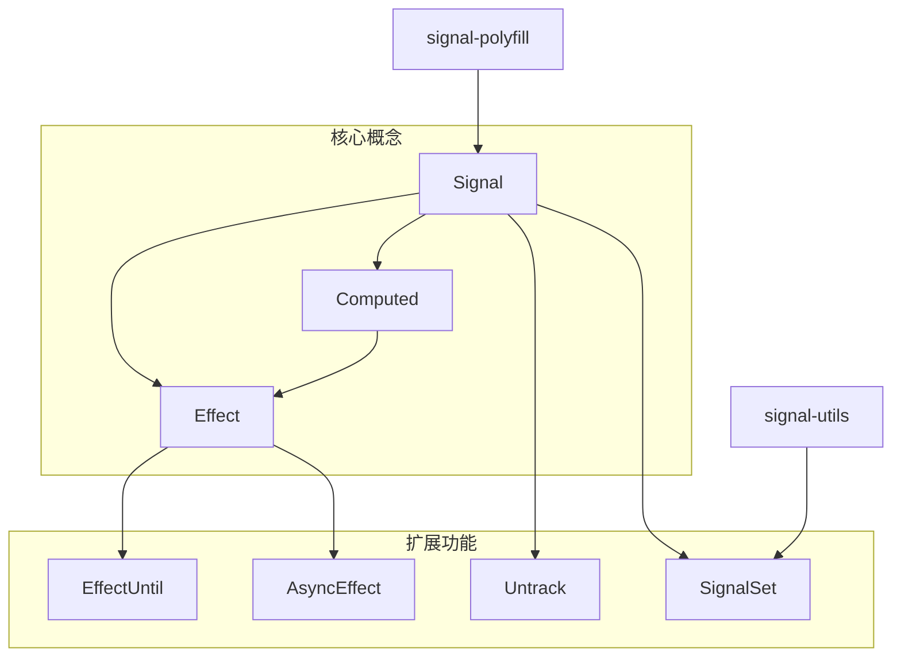
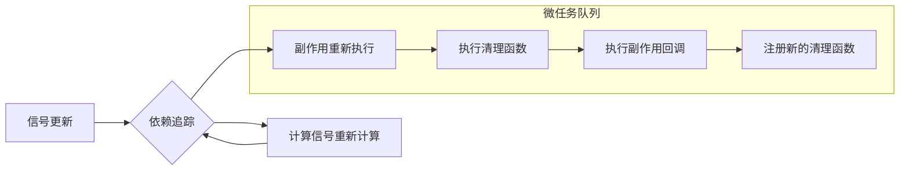

---
title: "@flex/signals 信号库分析"
date: 2023-11-15T10:00:00+08:00
description: "深入解析 @flex/signals 响应式编程库的设计与实现"
tags: ["signals", "响应式编程", "前端架构", "状态管理"]
categories: ["技术分析", "前端开发"]
author: "前端架构团队"
draft: false
---

# @flex/signals 信号库分析

## 概述

@flex/signals 是一个轻量级的响应式编程库，它是对 [TC39 Signals 提案](https://github.com/tc39/proposal-signals) 的封装。该库提供了一套简洁的 API，用于创建和管理响应式状态，实现了细粒度的响应式更新机制。

## 核心概念

信号（Signals）是一种响应式编程模式，它允许我们声明式地定义数据依赖关系，并在数据变化时自动触发相关的计算或副作用。与传统的状态管理方案相比，信号具有以下优势：

- **细粒度更新**：只有依赖变化的部分会重新计算，避免不必要的更新
- **自动依赖追踪**：系统自动追踪数据依赖关系，无需手动声明
- **简洁的 API**：提供直观且易于使用的接口
- **高性能**：通过精确的依赖追踪减少不必要的计算

## 主要组件

### 1. Signal（信号）

信号是最基本的响应式数据单元，它包装了一个值，并提供了读取和更新这个值的方法。

```typescript
const count = signal(0); // 创建一个初始值为 0 的信号
count.get(); // 读取信号的值
count.set(1); // 更新信号的值
```

信号还提供了只读视图，可以防止外部修改：

```typescript
const readonlyCount = count.readonly;
readonlyCount.get(); // 可以读取
// readonlyCount.set(2); // 错误：只读视图没有 set 方法
```

### 2. Computed（计算信号）

计算信号是基于其他信号计算得出的信号，当依赖的信号发生变化时，计算信号会自动重新计算。

```typescript
const count = signal(0);
const doubleCount = computed(() => count.get() * 2);

count.set(2);
doubleCount.get(); // 返回 4
```

计算信号具有缓存特性，只有当依赖的信号发生变化时才会重新计算，多次读取同一个计算信号不会导致重复计算。

### 3. Effect（副作用）

副作用用于执行依赖于信号的操作，当依赖的信号发生变化时，副作用会自动重新执行。

```typescript
const count = signal(0);

const unwatch = effect(() => {
  console.log(`Count changed: ${count.get()}`);
});

count.set(1); // 控制台输出："Count changed: 1"

// 停止监听
unwatch();
```

副作用函数可以返回一个清理函数，该函数会在副作用重新执行前或停止监听时被调用，用于清理资源。

### 4. EffectUntil（条件副作用）

条件副作用是一种特殊的副作用，它会一直执行直到满足特定条件。

```typescript
const count = signal(0);

const unwatch = effectUntil((done, error) => {
  const value = count.get();
  console.log(`Current count: ${value}`);
  
  if (value >= 5) {
    done(); // 当 count 大于等于 5 时停止监听
  }
});

// 当 count 达到 5 时，副作用会自动停止
```

### 5. AsyncEffect（异步副作用）

异步副作用用于处理异步操作，它会在信号变化时执行异步回调。

```typescript
const userId = signal(1);

const unwatch = asyncEffect(
  () => userId.get(), // 获取信号状态
  async (id) => {
    const response = await fetch(`https://api.example.com/users/${id}`);
    const data = await response.json();
    console.log(data);
  }
);

// 当 userId 变化时，会重新获取用户数据
```

### 6. Untrack（取消追踪）

取消追踪用于在副作用中读取信号的值而不建立依赖关系。

```typescript
const width = signal(150);
const height = signal(50);

effect(() => {
  // height 信号不会被追踪，即使 height 变化也不会触发此副作用
  const h = untrack(() => height.get());
  
  // width 信号会被追踪，width 变化会触发此副作用
  console.log(`Width: ${width.get()}, Height: ${h}`);
});
```

### 7. SignalSet（信号集合）

信号集合是一个响应式的 Set 集合，它提供了标准 Set 的所有方法，并且在集合变化时会触发相关的副作用。

```typescript
const users = signalSet(['Alice', 'Bob']);

effect(() => {
  console.log(`Users: ${Array.from(users.values()).join(', ')}`);
});

users.add('Charlie'); // 触发副作用，输出："Users: Alice, Bob, Charlie"
```

## 技术实现

@flex/signals 库是对底层信号实现的封装，主要依赖于以下两个库：

- **signal-polyfill**：提供了符合 TC39 提案的信号基础实现
- **signal-utils**：提供了额外的工具函数和数据结构

库的核心实现包括：

1. **依赖追踪**：使用 Signal.subtle.Watcher 来追踪信号之间的依赖关系
2. **微任务调度**：使用 queueMicrotask 来调度副作用的执行，确保在当前事件循环结束前处理所有待处理的更新
3. **缓存机制**：计算信号使用缓存来避免不必要的重复计算
4. **清理机制**：提供清理函数接口，确保资源能够被正确释放

## 使用场景

@flex/signals 库适用于需要细粒度响应式更新的场景，特别是：

1. **UI 组件状态管理**：管理组件内部状态，实现高效的 UI 更新
2. **数据依赖关系**：处理复杂的数据依赖关系，自动计算派生值
3. **异步数据处理**：结合 asyncEffect 处理异步数据流
4. **事件处理**：响应用户交互和系统事件

## 与其他状态管理方案的比较

### 与 React 的 useState/useEffect 比较

- **细粒度**：Signals 提供更细粒度的更新，只有依赖变化的部分会重新计算
- **自动依赖追踪**：无需手动在依赖数组中列出依赖项
- **无需 Hook 规则**：不受 React Hook 规则的限制，可以在条件语句中使用

### 与 Redux/Vuex 比较

- **简化的 API**：无需 actions、reducers 或 mutations
- **本地状态**：更适合管理组件本地状态
- **细粒度更新**：不需要手动优化选择器或计算属性

### 与 MobX 比较

- **更轻量**：API 更简洁，库体积更小
- **更接近标准**：基于 TC39 提案，未来可能成为 JavaScript 标准
- **无装饰器**：不依赖装饰器语法

## 总结

@flex/signals 库提供了一套简洁、高效的响应式编程 API，它通过细粒度的依赖追踪和自动更新机制，简化了状态管理和数据流处理。作为 TC39 Signals 提案的实现，它代表了 JavaScript 响应式编程的未来发展方向。

该库的设计理念是提供最小但完整的 API 集合，使开发者能够构建复杂的响应式应用，同时保持代码的简洁和可维护性。

## 示例代码

```typescript
import { signal, computed, effect } from '@flex/signals';

// 创建基本信号
const count = signal(0);
const name = signal('Guest');

// 创建计算信号
const greeting = computed(() => `Hello, ${name.get()}! Count: ${count.get()}`);

// 创建副作用
const unwatch = effect(() => {
  console.log(greeting.get());
});

// 更新信号
name.set('Alice'); // 输出: "Hello, Alice! Count: 0"
count.set(1);      // 输出: "Hello, Alice! Count: 1"

// 停止监听
unwatch();

// 更新不会再触发副作用
count.set(2);      // 没有输出
```

## 架构图



## 数据流图

