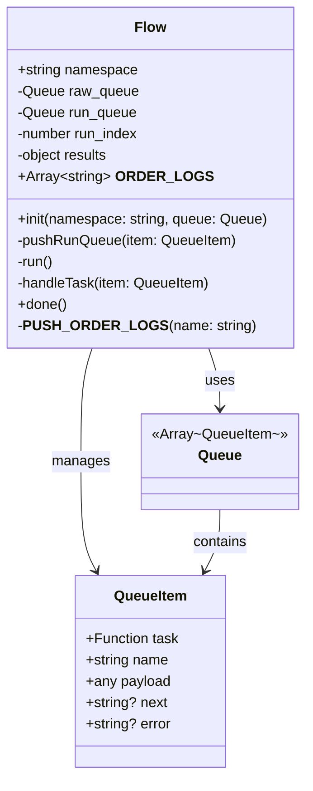
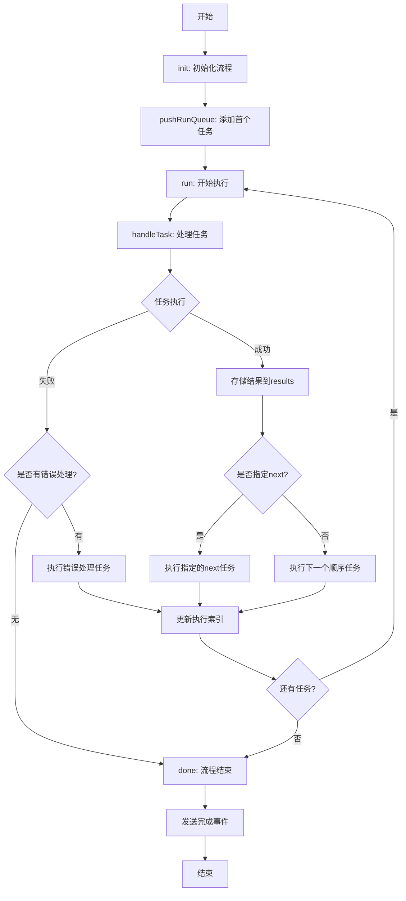
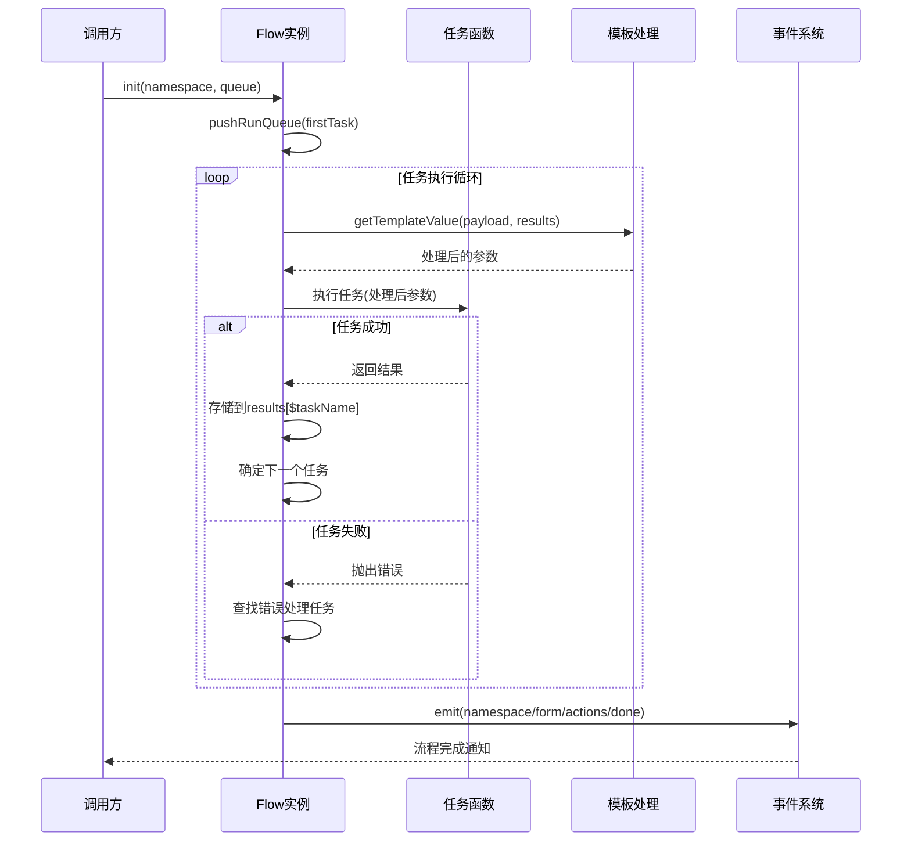

# ActionFlow 动作流管理库深度解读

## 项目概述

**ActionFlow** 是CUI框架中的核心包之一，专门用于管理事件驱动的动作流。它提供了一个强大的任务队列执行引擎，支持异步任务的有序执行、错误处理和结果传递。

### 基本信息
- **包名**: @yaoapp/actionflow
- **版本**: v1.0.0
- **作者**: Wendao
- **许可证**: Apache-2.0
- **描述**: 事件驱动的动作流管理库

## 核心功能特性

### 🎯 主要功能
1. **动作流编排**: 支持复杂的任务执行流程
2. **异步任务管理**: 基于Promise的异步任务处理
3. **错误处理机制**: 完善的错误捕获和处理流程
4. **模板数据传递**: 支持任务间的数据传递和模板渲染
5. **执行顺序控制**: 灵活的任务执行顺序管理

### 🔧 技术特点
- **ES模块支持**: 采用现代ES Module规范
- **TypeScript**: 完整的类型定义
- **轻量级**: 核心依赖少，体积小
- **高性能**: 基于SWC编译器优化

## 架构设计

### 项目结构
```
actionflow/
├── src/
│   ├── utils/                 # 工具函数
│   │   ├── getTemplateValue.ts   # 模板值处理
│   │   └── index.ts             # 工具导出
│   ├── flow.ts               # 核心流程控制类
│   ├── index.ts              # 主入口文件
│   └── types.ts              # 类型定义
├── rollup.*.ts               # 构建配置
├── package.json              # 包配置
└── tsconfig.json             # TypeScript配置
```

### 核心类图



## 核心模块详解

### 1. Flow 核心流程控制类

**职责**: 管理任务队列的执行流程和状态

#### 关键属性
- `namespace`: 流程命名空间，用于事件标识
- `raw_queue`: 原始任务队列
- `run_queue`: 运行时任务队列
- `run_index`: 当前执行索引
- `results`: 任务执行结果存储
- `__ORDER_LOGS__`: 执行顺序日志

#### 核心方法

##### init(namespace, queue)
初始化流程，设置命名空间和任务队列
```typescript
public init(namespace: string, queue: Queue) {
    this.namespace = namespace
    this.raw_queue = queue
    this.pushRunQueue(queue[0])  // 启动第一个任务
}
```

##### handleTask(item)
异步任务处理器，核心执行逻辑：
1. 执行任务函数
2. 处理执行结果或错误
3. 决定下一步执行流程
4. 更新执行状态

### 2. 类型定义系统

```typescript
// QueueItem: 队列项目定义
type QueueItem = {
    task: (...args: any) => Promise<any>  // 异步任务函数
    name: string                          // 任务名称
    payload: any                          // 任务参数
    next?: string                         // 下一个任务名称
    error?: string                        // 错误处理任务名称
}

// Queue: 任务队列定义
type Queue = Array<QueueItem>
```

### 3. 模板值处理工具

**getTemplateValue** 函数提供强大的数据模板处理能力：

#### 功能特性
- **Mustache模板**: 支持`{{variable}}`语法
- **扩展语法**: 支持`[[variable]]`和`[[[variable]]]`语法
- **递归处理**: 支持嵌套对象和数组的模板渲染
- **类型保持**: 保持原数据类型不变

#### 模板语法转换
```typescript
// 语法转换规则
'[[[variable]]]' → '{{{variable}}}' // 无转义输出
'[[variable]]'   → '{{variable}}'   // 转义输出
```

## 执行流程图

### 任务执行流程


### 数据流转图


## 技术实现亮点

### 1. 异步任务管理
```typescript
// 使用await-to-js优雅处理异步错误
const [err, res] = await to(task(getTemplateValue(payload, this.results)))

if (!isNull(err)) {
    // 错误处理逻辑
} else {
    // 成功处理逻辑
    this.results[`$${name}`] = res
}
```

### 2. 动态任务调度
- **顺序执行**: 默认按队列顺序执行
- **跳转执行**: 通过`next`指定下一个任务
- **错误重定向**: 通过`error`指定错误处理任务

### 3. 结果传递机制
```typescript
// 结果以 $taskName 格式存储
this.results[`$${name}`] = res

// 在模板中可以引用前面任务的结果
// payload: { userId: "{{$getUserTask}}" }
```

## 构建配置

### Rollup构建系统
```typescript
// 支持三种构建模式
- rollup.dev.ts    // 开发模式：SWC转译
- rollup.build.ts  // 生产模式：压缩+清理
- rollup.common.ts // 公共配置：ES模块输出
```

### 代码分割策略
```typescript
manualChunks: {
    to: ['await-to-js'],      // 异步处理库
    lodash: ['lodash-es'],    // 工具函数库
    mustache: ['mustache']    // 模板引擎
}
```

## 使用场景与最佳实践

### 适用场景
1. **表单提交流程**: 验证 → 提交 → 成功/失败处理
2. **数据处理管道**: 获取 → 转换 → 存储 → 通知
3. **工作流引擎**: 复杂的业务流程编排
4. **异步任务链**: 有依赖关系的任务序列

### 使用示例
```typescript
import Flow from '@yaoapp/actionflow'

const flow = new Flow()

const queue = [
    {
        name: 'validate',
        task: async (data) => { /* 验证逻辑 */ },
        payload: { formData: '{{input}}' },
        next: 'submit',
        error: 'handleError'
    },
    {
        name: 'submit',
        task: async (data) => { /* 提交逻辑 */ },
        payload: { validated: '{{$validate}}' }
    },
    {
        name: 'handleError',
        task: async (error) => { /* 错误处理 */ },
        payload: { error: '{{error}}' }
    }
]

flow.init('form-submit', queue)
```

## 性能特性

### 优化策略
1. **懒执行**: 任务按需执行，不预加载
2. **内存管理**: 及时清理执行队列
3. **事件驱动**: 基于事件的松耦合架构
4. **类型安全**: TypeScript提供编译时检查

### 监控调试
- `__ORDER_LOGS__`: 记录任务执行顺序
- 事件通知: 流程完成时发送事件
- 结果跟踪: 完整的执行结果链

## 总结

ActionFlow是一个设计精良的动作流管理库，具有以下核心价值：

### 🎯 设计优势
- **简洁API**: 直观的配置式编程
- **灵活控制**: 支持条件跳转和错误处理
- **数据传递**: 强大的模板系统
- **类型安全**: 完整的TypeScript支持

### 🚀 技术亮点
- **现代化构建**: Rollup + SWC + TypeScript
- **ES模块**: 支持tree-shaking优化
- **异步优先**: 原生Promise支持
- **轻量级**: 核心功能精简，依赖少

### 💡 应用价值
ActionFlow特别适合构建复杂的业务流程，如表单处理、数据管道、工作流等场景。通过声明式的配置和强大的模板系统，大大简化了异步任务编排的复杂性，是构建AI Native应用中不可或缺的基础设施组件。