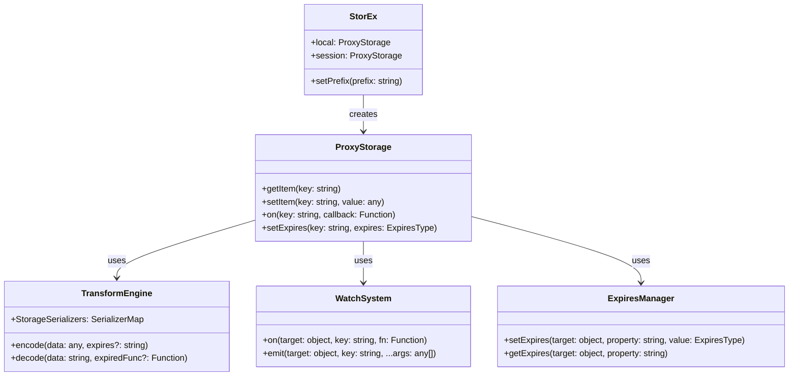
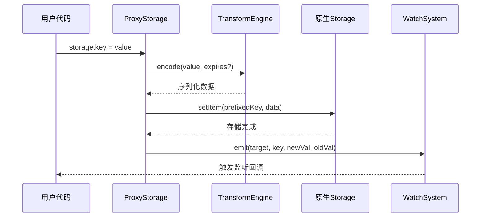
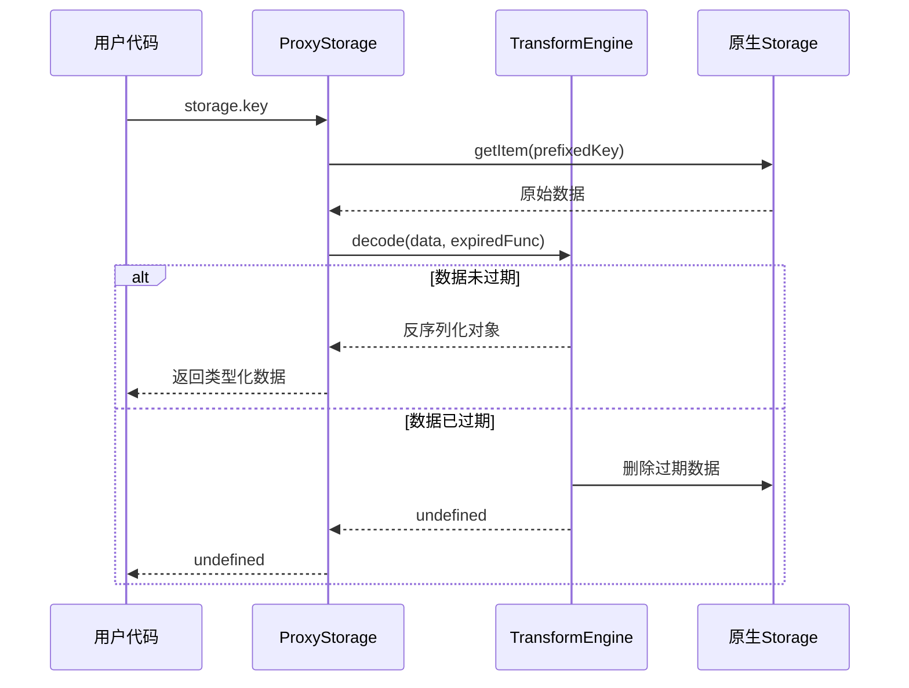

# StorEx 增强型存储库深度解读

## 项目概述

**StorEx** 是CUI框架中的核心存储解决方案，它通过JavaScript Proxy技术对浏览器原生存储（localStorage/sessionStorage）进行了革命性的增强。StorEx不仅保持了存储值的类型不变性，还支持对数组和对象的直接修改，并提供了变更监听和过期时间设置等企业级功能。

### 基本信息
- **包名**: @yaoapp/storex
- **版本**: v1.1.4
- **作者**: Wendao
- **许可证**: Apache-2.0
- **描述**: 保持存储值类型不变且支持直接修改数组和对象，支持变更监听和过期设置

## 核心功能特性

### 🎯 主要功能
1. **类型保持**: 自动保持存储值的原始数据类型
2. **直接修改**: 支持对复杂对象和数组的直接操作
3. **变更监听**: 完整的事件驱动变更通知系统
4. **过期管理**: 灵活的数据过期时间设置和自动清理
5. **跨标签页同步**: 自动处理多标签页间的数据同步

### 🔧 技术特点
- **ES Proxy**: 基于ES6 Proxy实现透明代理
- **TypeScript**: 完整的类型安全支持
- **零依赖**: 纯原生JavaScript实现
- **内存映射**: 智能的内存-存储映射管理
- **序列化增强**: 支持复杂数据类型的序列化/反序列化

## 架构设计

### 项目结构
```
storex/
├── src/
│   ├── proxy/                  # 代理层实现
│   │   ├── storage.ts         # 存储代理核心
│   │   ├── object.ts          # 对象代理处理
│   │   └── transform.ts       # 数据转换引擎
│   ├── extends/               # 扩展功能
│   │   ├── watch.ts          # 事件监听系统
│   │   └── expires.ts        # 过期时间管理
│   ├── shared.ts             # 共享类型和工具
│   ├── utils.ts              # 工具函数库
│   └── index.ts              # 主入口文件
├── __tests__/                 # 单元测试
└── rollup.*.ts               # 构建配置
```

### 核心架构图



## 核心模块详解

### 1. ProxyStorage 存储代理核心

**职责**: 作为localStorage/sessionStorage的代理层，提供增强的存储接口

#### 核心实现
```typescript
export function createProxyStorage(storage: StorageLike) {
    return new Proxy(storage, {
        get,      // 读取时自动解码和类型恢复
        set,      // 写入时自动编码和事件触发
        has,      // 检查键存在性（支持前缀）
        deleteProperty  // 删除时清理和事件通知
    })
}
```

### 2. TransformEngine 数据转换引擎

**职责**: 处理复杂数据类型的序列化和反序列化

#### 支持的数据类型
- **基础类型**: String, Number, BigInt, Boolean, Null, Undefined
- **复杂类型**: Object, Array, Set, Map, Date, RegExp, Function
- **特殊处理**: 为Object和Array创建代理对象

### 3. WatchSystem 事件监听系统

**职责**: 提供完整的变更监听和事件通知机制

#### API设计
```typescript
// 持续监听
storage.on('user.name', (newVal, oldVal) => {
    console.log(`Name changed: ${oldVal} -> ${newVal}`)
})

// 一次性监听
storage.once('config', (newVal, oldVal) => {
    console.log('Config initialized')
})

// 取消监听
storage.off('user.name', specificCallback)
```

## 数据流转图

### 写入流程


### 读取流程


## 技术实现亮点

### 1. 智能类型推断
```typescript
// 通过Object.prototype.toString精确识别类型
export const getRawType = (value: unknown): string => {
    return Object.prototype.toString.call(value).slice(8, -1)
}
```

### 2. 内存安全的WeakMap设计
```typescript
// 防止内存泄漏的对象映射
export const proxyMap = new WeakMap<object, object>()
// 事件监听的WeakMap存储
let targetMap = new WeakMap<Object, EffectMap>()
```

### 3. 跨标签页同步
```typescript
// 监听storage事件实现跨标签页同步
window.addEventListener('storage', (e: StorageEvent) => {
    if (e.key && e.key.startsWith(prefix)) {
        // 解码新值和旧值，触发本地监听器
        let newValue = decode(e.newValue, createExpiredFunc(localStorage, e.key))
        emit(localStorage, e.key.slice(prefix.length), newValue, oldValue)
    }
})
```

## 使用场景与最佳实践

### 适用场景
1. **用户设置管理**: 复杂配置对象的持久化
2. **表单状态保存**: 表单数据的自动保存和恢复
3. **购物车状态**: 商品列表的实时同步
4. **缓存管理**: 带过期时间的API数据缓存
5. **多标签页状态**: 跨标签页的状态同步

### 使用示例
```javascript
import { local, session } from '@yaoapp/storex'

// 基础类型自动保持
local.userId = 12345
console.log(typeof local.userId) // 'number'

// 复杂对象直接修改
local.userProfile = { name: 'John', age: 30 }
local.userProfile.age = 31 // 直接修改，自动保存

// 数组操作
local.todoList = ['Task 1', 'Task 2']
local.todoList.push('Task 3') // 自动保存

// 监听变更
local.on('userProfile.name', (newName, oldName) => {
    console.log(`Name changed: ${oldName} -> ${newName}`)
})

// 设置过期时间
local.tempData = { token: 'abc123' }
local.setExpires('tempData', Date.now() + 3600000) // 1小时后过期
```

## 性能特性

### 优化策略
1. **惰性代理**: 只有访问时才创建对象代理
2. **变更检测**: 使用Object.is进行精确的变更检测
3. **内存管理**: WeakMap确保垃圾回收
4. **序列化优化**: 最小化JSON字符串大小
5. **事件去重**: 避免重复触发相同事件

## 总结

StorEx是一个设计精巧的增强型存储库，具有以下核心价值：

### 🎯 设计优势
- **类型安全**: 完整保持JavaScript数据类型
- **直观操作**: 像操作普通对象一样操作存储
- **响应式**: 完整的变更监听和通知机制
- **企业级**: 过期管理、跨标签页同步等高级功能

### 🚀 技术亮点
- **Proxy代理**: 透明的存储增强，无侵入性
- **智能序列化**: 支持所有JavaScript内置类型
- **内存安全**: WeakMap设计防止内存泄漏
- **零依赖**: 纯原生实现，体积小巧

### 💡 应用价值
StorEx解决了原生Web Storage的诸多痛点：
- ✅ 自动类型转换 vs ❌ 只支持字符串
- ✅ 对象直接修改 vs ❌ 需要重新赋值
- ✅ 变更监听 vs ❌ 无监听机制
- ✅ 过期管理 vs ❌ 永久存储
- ✅ 跨标签页同步 vs ❌ 手动同步

**StorEx为现代Web应用提供了企业级的客户端存储解决方案，是构建复杂前端应用不可或缺的基础设施组件。**