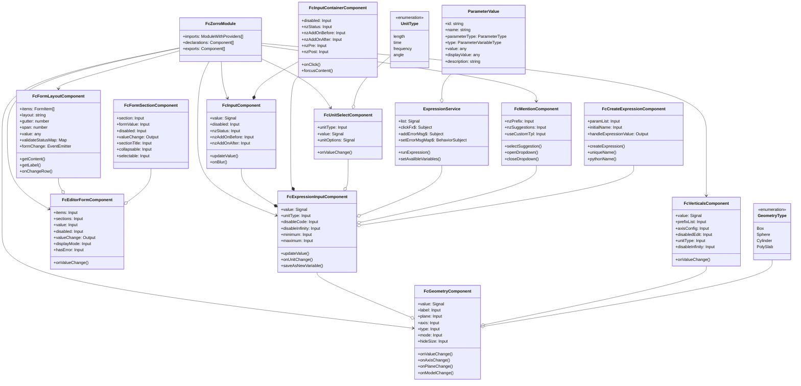
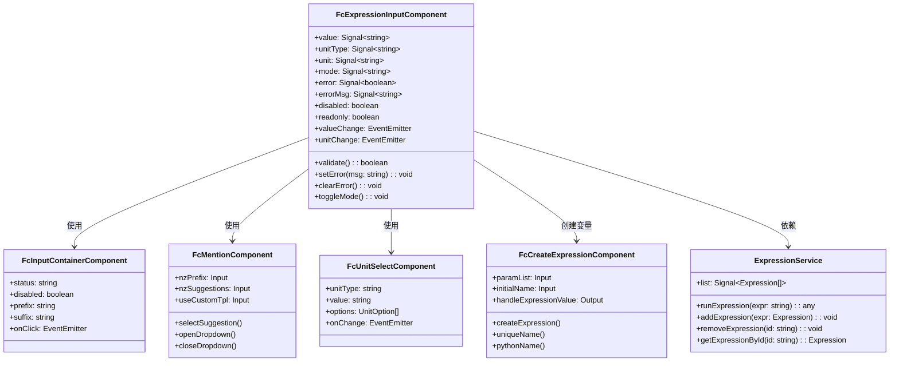
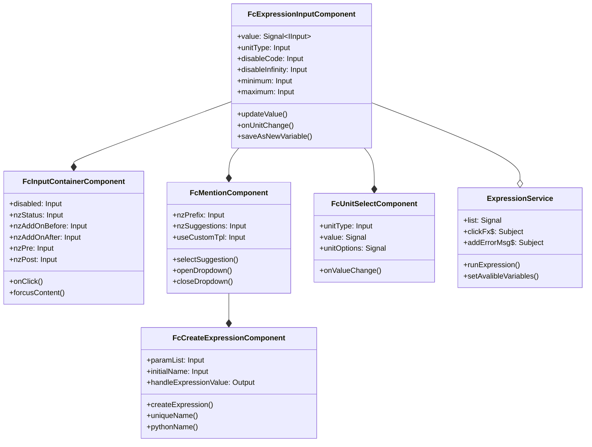
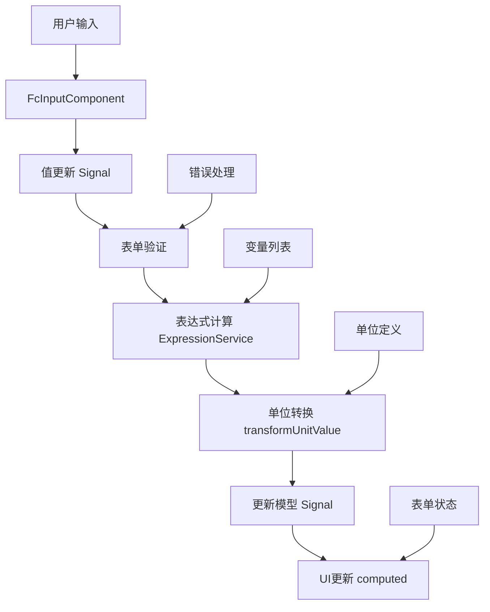
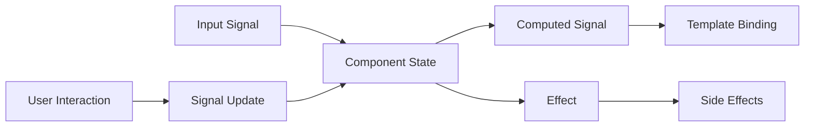

---
title: "FC-Zorro 组件库架构分析"
date: 2023-11-15T10:00:00+08:00
author: "架构师"
description: "基于Angular和NG-Zorro的科学计算组件库架构分析"
categories: ["前端", "架构设计"]
tags: ["Angular", "组件库", "架构分析", "NG-Zorro", "科学计算"]
draft: false
---

# FC-Zorro 组件库架构分析

## 项目概述

FC-Zorro 是一个基于 Angular 和 NG-Zorro 的组件库，提供了一系列高级表单组件和输入控件，专注于科学计算和工程领域的应用场景。该组件库支持表达式计算、单位转换、几何图形编辑等功能，为复杂的科学计算应用提供了丰富的UI组件。

## 技术栈

- **Angular**: 基于 Angular 的信号（Signal）API开发，使用最新的Angular特性
- **NG-Zorro**: 基于阿里的 NG-Zorro 组件库扩展，提供了丰富的UI组件
- **MathJS**: 用于数学表达式计算，支持复杂的数学表达式和单位转换
- **FC-Icons**: 自定义图标库，提供了专业领域的图标
- **FC-Model**: 数据模型库，定义了参数、变量等数据结构

## 架构设计

### 整体架构



### 表达式输入组件架构



## 核心组件

### 1. 基础输入组件

#### FcInputContainerComponent

这是所有输入组件的基础容器，提供了统一的样式和布局，支持前缀、后缀、状态等配置。

#### FcInputComponent

基础输入组件，继承自Angular的ControlValueAccessor，实现了表单控件的基本功能，支持禁用、只读、状态等配置。

### 2. 表达式输入组件

#### FcExpressionInputComponent

`FcExpressionInputComponent` 是一个功能强大的表达式输入组件，支持数学表达式输入、计算和单位转换。它是 FC-Zorro 组件库中的核心组件之一，为科学计算应用提供了关键的用户界面元素。

**核心功能：**

1. **多模式输入**：
   - 支持纯数值输入
   - 支持复杂数学表达式输入
   - 支持变量引用和创建
   - 支持无穷大值（Infinity）

2. **单位系统集成**：
   - 与 `FcUnitSelectComponent` 集成，提供单位选择功能
   - 自动进行单位转换和显示
   - 支持不同类型的物理单位（长度、时间、频率、角度等）

3. **表达式验证与错误处理**：
   - 实时验证表达式的有效性
   - 提供详细的错误提示和错误图标
   - 支持最小值/最大值验证
   - 支持整数验证

4. **变量系统**：
   - 通过 `FcMentionComponent` 提供变量引用功能
   - 支持创建新变量（通过 `FcCreateExpressionComponent`）
   - 变量自动补全和提示

5. **UI 交互**：
   - 提供公式编辑器图标，快速访问方程编辑器
   - 支持禁用状态和只读模式
   - 提供悬停提示显示完整表达式
   - 支持不同的显示模式（view/default）

**组件架构：**



**实现细节：**

1. **信号（Signal）驱动**：
   - 使用 Angular 的信号 API 管理组件状态
   - 通过计算信号（computed）实现响应式 UI 更新
   - 使用效果（effect）监听状态变化并执行副作用

2. **表达式处理流程**：
   - 用户输入 → 解析表达式 → 验证 → 计算 → 单位转换 → UI 更新
   - 支持表达式中的变量引用（使用 ID 替换）
   - 通过 `ExpressionService` 进行表达式计算

3. **错误处理机制**：
   - 实时验证表达式语法
   - 检查变量引用的有效性
   - 提供创建新变量的快捷方式
   - 显示详细的错误提示和错误图标

#### ExpressionService

`ExpressionService` 是表达式系统的核心服务，负责管理表达式变量列表和计算表达式的值。

**主要功能：**

1. **变量管理**：
   - 维护可用变量列表
   - 支持变量的添加、更新和引用

2. **表达式计算**：
   - 通过 `calculate` 函数计算表达式的值
   - 处理表达式中的变量引用
   - 提供错误处理和报告

3. **组件通信**：
   - 使用 RxJS Subject 进行组件间通信
   - 支持表达式编辑器的打开和关闭
   - 管理错误消息的传递

#### FcCreateExpressionComponent

`FcCreateExpressionComponent` 是用于创建新表达式变量的组件，提供了一个简洁的表单界面。

**主要功能：**

1. **变量创建表单**：
   - 名称输入（自动生成默认名称）
   - 值/方程输入
   - 描述输入（可选）

2. **验证功能**：
   - 验证变量名的唯一性
   - 验证变量名符合 Python 命名规范
   - 提供详细的错误提示

3. **自动化功能**：
   - 自动生成唯一的默认变量名
   - 支持键盘快捷键（Enter 提交，Escape 取消）

### 3. 单位选择组件

#### FcUnitSelectComponent

`FcUnitSelectComponent` 是一个专门用于物理单位选择的组件，支持多种物理量的单位系统，为科学计算应用提供了关键的单位转换功能。

**核心功能：**

1. **多种单位类型支持**：
   - 长度单位（nm, μm, mm, cm, m, km 等）
   - 时间单位（fs, ps, ns, μs, ms, s 等）
   - 频率单位（Hz, kHz, MHz, GHz, THz 等）
   - 角度单位（度, 弧度 等）
   - 其他物理量单位

2. **响应式设计**：
   - 使用 Angular 信号 API 实现响应式状态管理
   - 通过计算信号自动更新 UI 状态
   - 使用效果（effect）监听单位类型变化并更新选项

3. **表单集成**：
   - 实现 ControlValueAccessor 接口，支持表单控件集成
   - 支持禁用状态和只读模式
   - 支持不同尺寸（small, default, large）

4. **UI 特性**：
   - 基于 NzSelectModule 构建，提供下拉选择界面
   - 自定义图标和样式
   - 支持测试 ID 属性，便于自动化测试

**实现细节：**

```typescript
// 单位选项生成
effect(() => {
  const unitType = this.unitType() || getUnitTypeByValue(this.value());
  this.unitOptions.set(getUnitOptions(unitType || '').map(item => ({ nzLabel: item, nzValue: item })));
  if (!this.value() && this.unitOptions().length > 0) {
    // default to first option when no value is provided
    this.value.set(this.unitOptions()[0].nzValue);
  }
}, { allowSignalWrites: true });
```

组件通过 `getUnitOptions` 函数获取特定单位类型的所有可用单位，并自动设置默认值。当单位类型变化时，组件会自动更新可用的单位选项。

### 4. 变量引用与提及组件

#### FcMentionComponent

`FcMentionComponent` 是一个用于变量引用和提及的高级组件，基于 NG-Zorro 的 Mention 组件扩展，为表达式输入提供变量引用和创建功能。

**核心功能：**

1. **变量引用系统**：
   - 支持通过特定前缀（如 @）触发变量引用
   - 支持多种触发前缀（如 @, ,, **, +, -, *, /, (）
   - 提供变量列表下拉选择
   - 支持变量搜索和过滤

2. **自定义模板**：
   - 支持自定义下拉项模板
   - 支持自定义创建变量模板
   - 支持无结果时的自定义模板

3. **交互功能**：
   - 键盘导航（上下箭头选择）
   - 回车键确认选择
   - 点击选择变量
   - 支持创建新变量的快捷入口

4. **定位系统**：
   - 使用 Angular CDK Overlay 实现下拉菜单定位
   - 支持不同的放置位置（顶部/底部）
   - 自动调整位置以适应视口

**实现细节：**

1. **变量解析**：
   ```typescript
   resetCursorMention(): void {
     // 解析当前光标位置的变量引用
     const value = this.triggerNativeElement.value.replace(/[\r\n]/g, NZ_MENTION_CONFIG.split) || '';
     const selectionStart = this.triggerNativeElement.selectionStart!;
     
     // 处理不同的触发模式（输入触发或前缀触发）
     if (this.mentionTriggerByInput) {
       // 输入触发模式的处理逻辑
     } else {
       // 前缀触发模式的处理逻辑
       const prefix = typeof this.nzPrefix === 'string' ? [this.nzPrefix] : this.nzPrefix;
       // 查找匹配的前缀和变量名
     }
   }
   ```

2. **下拉菜单定位**：
   ```typescript
   private getOverlayPosition(): PositionStrategy {
     const positions = [
       new ConnectionPositionPair({ originX: 'start', originY: 'bottom' }, { overlayX: 'start', overlayY: 'top' }),
       new ConnectionPositionPair({ originX: 'start', originY: 'top' }, { overlayX: 'start', overlayY: 'bottom' }),
     ];
     // 创建灵活的连接策略
     this.positionStrategy = this.overlay
       .position()
       .flexibleConnectedTo(this.trigger.el)
       .withPositions(positions)
       .withFlexibleDimensions(false)
       .withPush(false);
     return this.positionStrategy;
   }
   ```

### 5. 表单布局组件

#### FcFormLayoutComponent

`FcFormLayoutComponent` 是一个灵活的表单布局组件，提供了丰富的布局选项和配置，使表单的排版更加灵活和美观。

**核心功能：**

1. **多种布局模式**：
   - 水平布局（标签和控件在同一行）
   - 垂直布局（标签在控件上方）
   - 内联布局（紧凑型布局）

2. **栅格系统**：
   - 基于 24 列栅格系统
   - 支持不同的列宽配置
   - 支持响应式布局

3. **表单项配置**：
   - 支持标签宽度和对齐方式配置
   - 支持表单项间距配置
   - 支持必填标记和帮助提示

4. **状态管理**：
   - 支持表单验证状态显示
   - 支持禁用状态
   - 支持只读状态

#### FcEditorFormComponent

`FcEditorFormComponent` 是一个高级表单编辑器组件，支持分区域的表单布局，为复杂表单提供了更好的组织结构。

**核心功能：**

1. **分区域表单**：
   - 支持将表单分为多个区域
   - 每个区域可以有自己的标题和描述
   - 支持区域的折叠和展开

2. **动态表单项**：
   - 支持动态配置表单项
   - 支持不同类型的表单控件
   - 支持表单项的条件显示

3. **表单值管理**：
   - 集中管理表单值
   - 支持表单值的双向绑定
   - 支持表单值的验证

4. **显示模式**：
   - 支持编辑模式和查看模式
   - 支持禁用状态
   - 支持错误状态

#### FcFormSectionComponent

`FcFormSectionComponent` 是表单区域组件，用于在 `FcEditorFormComponent` 中创建可折叠和可选择的区域。

**核心功能：**

1. **区域管理**：
   - 支持区域标题和描述
   - 支持区域的折叠和展开
   - 支持区域的选择和取消选择

2. **嵌套结构**：
   - 支持子区域
   - 支持区域内的表单项
   - 支持复杂的嵌套结构

3. **状态管理**：
   - 支持区域的禁用状态
   - 支持区域的错误状态
   - 支持区域值的双向绑定

### 5. 几何组件

#### FcGeometryComponent

几何图形编辑组件，支持不同类型的几何图形（如盒子、圆柱体、球体等）的编辑，可以设置中心点、尺寸、半径等参数。

### 6. 输入容器组件

#### FcInputContainerComponent

`FcInputContainerComponent` 是一个通用的输入容器组件，为各种输入控件提供统一的外观和行为，是 `fc-expression-input` 等组件的基础容器。

**核心功能：**

1. **统一的输入框容器**：
   - 提供一致的样式和布局
   - 支持前缀和后缀内容
   - 支持图标和附加组件

2. **状态管理**：
   - 支持错误状态显示
   - 支持禁用状态
   - 支持只读状态
   - 支持聚焦状态

3. **内容投影**：
   - 使用 Angular 的内容投影机制
   - 支持多种内容插槽
   - 灵活的内容组合

4. **交互功能**：
   - 支持点击事件
   - 支持聚焦事件
   - 支持输入事件

**实现细节：**

1. **内容投影**：
   ```typescript
   @ContentChild(NzInputDirective, { static: false }) inputDirective?: NzInputDirective;
   @ContentChild('input') inputElement?: ElementRef;
   ```

2. **状态管理**：
   ```typescript
   @Input() nzStatus: NzStatus = '';
   @Input() disabled = false;
   ```

3. **布局结构**：
   ```html
   <div class="fc-input-container" [ngClass]="containerClass" (click)="clickContainer($event)">
     <span *ngIf="nzAddOnBefore || nzAddOnBeforeIcon" class="fc-input-group-addon">
       <i *ngIf="nzAddOnBeforeIcon" nz-icon [nzType]="nzAddOnBeforeIcon"></i>
       <ng-container *ngIf="nzAddOnBefore">{{ nzAddOnBefore }}</ng-container>
     </span>
     <span class="fc-input-prefix" *ngIf="nzPrefix || nzPrefixIcon || nzPre">
       <ng-container *ngIf="nzPre">{{ nzPre }}</ng-container>
       <i *ngIf="nzPrefixIcon" nz-icon [nzType]="nzPrefixIcon"></i>
       <ng-container *ngIf="nzPrefix">{{ nzPrefix }}</ng-container>
     </span>
     <ng-content></ng-content>
     <span class="fc-input-suffix" *ngIf="nzSuffix || nzSuffixIcon || nzPost">
       <ng-container *ngIf="nzPost">{{ nzPost }}</ng-container>
       <i *ngIf="nzSuffixIcon" nz-icon [nzType]="nzSuffixIcon"></i>
       <ng-container *ngIf="nzSuffix">{{ nzSuffix }}</ng-container>
     </span>
     <span *ngIf="nzAddOnAfter || nzAddOnAfterIcon" class="fc-input-group-addon">
       <i *ngIf="nzAddOnAfterIcon" nz-icon [nzType]="nzAddOnAfterIcon"></i>
       <ng-container *ngIf="nzAddOnAfter">{{ nzAddOnAfter }}</ng-container>
     </span>
   </div>
   ```

`FcInputContainerComponent` 是 FC-Zorro 组件库中的基础容器组件，为各种输入控件提供了统一的外观和行为，使得整个组件库的输入控件具有一致的用户体验。它被广泛应用于 `FcExpressionInputComponent`、`FcInputComponent` 等组件中，是组件库的重要基础设施。

## 数据流



### 信号（Signal）数据流



## 特色功能

### 1. 表达式系统

FC-Zorro 组件库的表达式系统是一个强大的功能，允许用户在输入框中输入数学表达式，并自动计算结果。这个系统由 `FcExpressionInputComponent` 和 `ExpressionService` 共同实现。

#### 表达式计算

表达式计算支持以下功能：

1. **基本数学运算**：
   - 加减乘除（+, -, *, /）
   - 幂运算（**）
   - 括号优先级
   - 三角函数（sin, cos, tan 等）
   - 对数函数（log, ln）
   - 常量（π, e）

2. **变量引用**：
   - 使用 @ 符号引用已定义的变量
   - 支持变量嵌套引用
   - 实时更新依赖变量变化

3. **错误处理**：
   - 语法错误检测
   - 未定义变量检测
   - 循环引用检测
   - 友好的错误提示

4. **实时计算**：
   - 输入时实时计算
   - 依赖变化时自动重新计算
   - 支持异步计算

#### 变量管理

`ExpressionService` 提供了完整的变量管理功能：

1. **变量创建**：
   ```typescript
   addExpression(expression: Expression): void {
     // 验证变量名的唯一性和合法性
     if (this.isValidExpression(expression)) {
       // 添加到变量列表
       this.list.update(list => [...list, expression]);
       // 通知变量创建成功
       this.addSuccessMsg$.next(expression);
     }
   }
   ```

2. **变量引用**：
   ```typescript
   runExpression(expr: string): any {
     try {
       // 解析表达式中的变量引用
       const parsedExpr = this.parseVariables(expr);
       // 计算表达式的值
       return this.evaluateExpression(parsedExpr);
     } catch (error) {
       // 处理计算错误
       this.handleExpressionError(error, expr);
       return null;
     }
   }
   ```

3. **变量依赖追踪**：
   - 自动检测变量之间的依赖关系
   - 当依赖变量更新时，自动更新引用变量
   - 防止循环依赖

4. **变量作用域**：
   - 支持全局变量
   - 支持局部变量
   - 支持变量覆盖

### 2. 单位系统

FC-Zorro 组件库内置了强大的单位系统，由 `FcUnitSelectComponent` 和相关服务实现，支持多种单位类型和单位转换。

#### 单位类型

支持的单位类型包括：

1. **长度单位**：
   - 公制：毫米(mm)、厘米(cm)、米(m)、千米(km)
   - 英制：英寸(in)、英尺(ft)、码(yd)、英里(mi)

2. **面积单位**：
   - 平方毫米(mm²)、平方厘米(cm²)、平方米(m²)、公顷(ha)
   - 平方英寸(in²)、平方英尺(ft²)、平方码(yd²)、英亩(acre)

3. **体积单位**：
   - 立方毫米(mm³)、立方厘米(cm³)、立方米(m³)
   - 立方英寸(in³)、立方英尺(ft³)、加仑(gal)

4. **角度单位**：
   - 度(°)、弧度(rad)、梯度(grad)

5. **时间单位**：
   - 秒(s)、分钟(min)、小时(h)、天(d)

6. **质量单位**：
   - 毫克(mg)、克(g)、千克(kg)、吨(t)
   - 盎司(oz)、磅(lb)、英石(st)

#### 单位转换

单位系统支持以下功能：

1. **自动单位转换**：
   - 在同类型单位之间自动转换
   - 保持数值的精确性
   - 支持复合单位转换

2. **单位选择**：
   - 根据单位类型动态生成单位选项
   - 支持单位搜索和过滤
   - 支持自定义单位

3. **单位格式化**：
   - 自动格式化带单位的值
   - 支持不同的显示格式
   - 支持国际化单位显示

### 3. 几何编辑系统

- **多种几何类型**：支持盒子、球体、圆柱体等多种几何类型的编辑。
- **坐标系切换**：支持不同坐标系和平面的切换，如XY平面、YZ平面、XZ平面。
- **顶点编辑**：通过`FcVerticalsComponent`实现顶点的编辑，支持表达式输入和单位转换。
- **模式切换**：支持中心点+尺寸和边界两种编辑模式的切换。

### 4. 表单系统

- **灵活的布局**：支持水平和垂直两种表单布局，以及不同的间距和列宽。
- **分区域表单**：通过`FcEditorFormComponent`和`FcFormSectionComponent`实现分区域的表单布局。
- **表单验证**：支持丰富的表单验证功能，包括最小值、最大值、整数验证等。
- **状态管理**：使用Angular的信号API管理表单状态，实现响应式的表单交互。

### 5. 工具函数

- **信号增强**：通过`createRefreshSignal`函数增强Angular的信号API，添加刷新功能。
- **复制粘贴**：提供了复制粘贴功能，方便用户在不同组件间传递数据。
- **辅助函数**：提供了一系列辅助函数，如`isInfinity`、`canParseToNumber`、`generateUid`等。

## 设计模式

### 1. 组件设计模式

- **组合模式**：通过组合不同的基础组件构建复杂的表单控件，如`FcGeometryComponent`组合了`FcExpressionInputComponent`和`FcVerticalsComponent`。
- **装饰器模式**：使用装饰器扩展组件的功能，如`FcInputContainerComponent`为输入组件添加前缀、后缀等装饰。
- **策略模式**：使用不同的策略处理不同类型的输入和验证，如根据`unitType`选择不同的单位转换策略。
- **模板方法模式**：在基础组件中定义算法的骨架，如`FcFormLayoutComponent`定义了表单布局的基本结构，而具体的表单项渲染由子组件实现。

### 2. 状态管理模式

- **信号模式（Signal Pattern）**：使用Angular的信号API管理组件状态，实现响应式数据流。
  ```typescript
  // 示例：使用信号管理组件状态
  value = model<GeometryValue>(); // 可写信号
  isBox = computed<boolean>(() => { // 计算信号
    return this.type() === GeometryType.Box;
  });
  ```

- **观察者模式**：使用Angular的信号（Signal）、事件发射器（EventEmitter）和RxJS的Subject实现组件间的通信。
  ```typescript
  // 示例：使用Subject进行组件间通信
  clickFx$ = new Subject<string>();
  addErrorMsg$ = new Subject<{id: string; msg: string}>();
  ```

### 3. 服务设计模式

- **单例模式**：使用Angular的依赖注入系统确保服务是单例的，如`ExpressionService`。
- **工厂模式**：使用工厂函数创建复杂对象，如`createRefreshSignal`函数创建带有刷新功能的信号。

### 4. 功能实现模式

- **代理模式**：使用JavaScript的Proxy对象创建数学计算环境，如`createProxy`函数。
- **适配器模式**：通过适配器函数转换不同格式的数据，如`transformUnitValue`函数适配不同单位的值。
- **命令模式**：将请求封装为对象，如表达式计算命令，使得可以参数化操作。

## 总结

FC-Zorro组件库是一个专为科学计算和工程应用设计的Angular组件库，它基于最新的Angular信号API构建，提供了丰富的表单组件和输入控件，支持表达式计算、单位转换、几何编辑等功能。

该组件库的架构设计有以下几个特点：

1. **组件化设计**：通过组合不同的基础组件构建复杂的表单控件，实现了高度的复用性和可维护性。

2. **响应式数据流**：使用Angular的信号API实现响应式的数据流，使得组件状态的管理更加简洁和高效。

3. **领域驱动设计**：针对科学计算和工程领域的特定需求，设计了专门的组件和服务，如表达式计算、单位转换、几何编辑等。

4. **可扩展性**：通过合理的接口设计和依赖注入，使得组件库可以方便地扩展和定制。

5. **性能优化**：使用Angular的信号API和计算属性，减少了不必要的重渲染，提高了应用的性能。

通过这些设计，FC-Zorro组件库使得复杂的科学计算应用的前端开发变得更加简单和高效，为科学计算和工程领域的Web应用提供了强大的UI支持。
