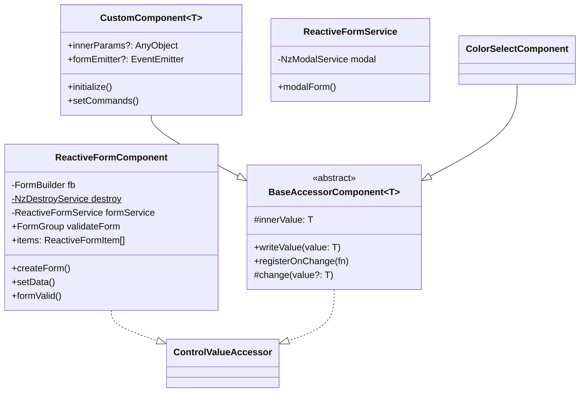

---
title: "Reactive Form 模块架构分析"
date: 2023-07-15T10:00:00+08:00
author: "PhotonForge Team"
description: "Angular动态表单系统的架构设计与实现分析"
tags: ["Angular", "表单", "架构设计", "组件化"]
categories: ["前端开发", "架构设计"]
---

# Reactive Form 模块架构分析

## 1. 模块概述

Reactive Form 是一个基于 Angular 的动态表单系统，提供了丰富的表单控件和灵活的配置选项，用于构建复杂的表单界面。该模块采用了 Angular 的响应式表单（Reactive Forms）技术，实现了数据驱动的表单渲染和验证。

## 2. 架构图

### 2.1 模块结构图



## 3. 核心组件分析

### 3.1 ReactiveFormComponent

ReactiveFormComponent 是整个模块的核心组件，负责表单的创建、渲染、数据绑定和验证。它实现了 ControlValueAccessor 接口，可以与 Angular 的表单系统无缝集成。

主要功能：
- 根据配置项（ReactiveFormItem[]）动态创建表单控件
- 处理表单数据的双向绑定
- 管理表单的验证规则
- 支持嵌套表单和子表单
- 提供表单控制器（FormController）进行动态控制

### 3.2 BaseAccessorComponent

BaseAccessorComponent 是一个抽象基类，为所有表单控件组件提供了基础的 ControlValueAccessor 实现。它简化了自定义表单控件的开发，处理了与 Angular 表单系统的集成。

主要功能：
- 实现 ControlValueAccessor 接口
- 提供数据变更和触摸事件的处理
- 简化子类的实现

### 3.3 CustomComponent

CustomComponent 扩展了 BaseAccessorComponent，为自定义组件提供了更多功能，如参数注入和命令处理。它是模块可扩展性的核心，允许开发者创建完全自定义的表单控件。

主要功能：
- 支持参数注入：通过 FORM_PARAMS 令牌注入外部参数
- 提供命令处理机制：通过 setCommands 方法订阅和处理组件命令
- 与父表单的通信：通过 FORM_EMITTER 令牌实现与父表单的双向通信
- 泛型支持：使用泛型 T 确保类型安全
- 初始化机制：提供 initialize 方法进行组件初始化


### 3.4 ReactiveFormService

ReactiveFormService 提供了表单相关的服务，如模态表单的创建和管理。

主要功能：
- 创建模态表单
- 管理表单验证
- 处理表单提交和取消

## 4. 当前常用的表单控件组件

模块提供了多种表单控件组件，每个组件都继承自 BaseAccessorComponent，实现了特定的表单控件功能：

1. **ColorSelectComponent**: 颜色选择器
2. **RangeComponent**: 范围输入控件
3. **ExpressionComponent**: 表达式输入控件
4. **ArrayFormComponent**: 数组表单控件
5. **SliderComponent**: 滑块控件
6. **CheckboxGroupComponent**: 复选框组控件
7. **FormArrayComponent**: 表单数组控件
8. **TabFormComponent**: 标签页表单控件
9. **CodeMirrorEditorComponent**: 代码编辑器控件
10. **MarkdownEditorComponent**: Markdown编辑器控件
11. **SortedSelectComponent**: 排序选择控件
12. **UploadComponent**: 文件上传控件

## 5. 表单配置和类型

### 5.1 ReactiveFormItem

ReactiveFormItem 是表单项的配置接口，定义了表单项的各种属性和行为：

```typescript
interface ReactiveFormItem {
  name: string;           // 表单项名称
  type?: string;          // 表单项类型
  label?: string;         // 表单项标签
  tooltip?: string;       // 提示信息
  defaults?: any;         // 默认值
  required?: boolean;     // 是否必填
  disabled?: boolean;     // 是否禁用
  validates?: string[];   // 验证规则
  options?: any[];        // 选项（用于选择类控件）
  children?: ReactiveFormItem[]; // 子表单项
  // ... 其他属性
}
```

### 5.2 FormController

FormController 提供了对表单行为的动态控制，包括隐藏/显示字段、启用/禁用字段、重置字段和更新字段：

```typescript
interface FormController {
  hides?: FormHide[];                    // 控制字段隐藏
  disableds?: (FormDisabled | string)[]; // 控制字段禁用
  resets?: FormResets[];                 // 控制字段重置
  updates?: FormUpdates[];               // 控制字段更新
}

// 控制规则
interface ControlRules {
  value: any;       // 触发条件的值
  columns: string[]; // 受影响的字段
  values?: any[];   // 设置的值（用于禁用规则）
}

// 字段隐藏控制
interface FormHide {
  field: string;    // 触发字段
  rules: ControlRules[]; // 控制规则
}

// 字段禁用控制
interface FormDisabled {
  field: string;    // 触发字段
  rules: ControlRules[]; // 控制规则
}

// 字段重置控制
interface FormResets {
  field: string;    // 触发字段
  columns: string[]; // 需要重置的字段
}

// 字段更新控制
interface FormUpdates {
  field: string;    // 触发字段
  callback: (value: any, formGroup: FormGroup<any>, items: ReactiveFormItem[]) => void; // 更新回调
}
```
## 6. 表单验证

模块提供了丰富的表单验证功能，包括：

1. 内置验证器：required、exclude、regexp、json等
2. 自定义验证器：expression、requiredSubform等
3. 异步验证器支持

验证器通过 getValidator 和 getAsyncValidator 函数进行管理和应用。

### 6.1 验证器系统架构

表单验证系统采用了可扩展的架构设计，主要包括以下组件：

1. **验证器存储**：使用 `validatorStore` 和 `asyncValidatorStore` 对象存储同步和异步验证器
2. **验证器注册**：通过 `registerValidator` 和 `registerAsyncValidator` 函数注册新的验证器
3. **验证器获取**：通过 `getValidator` 和 `getAsyncValidator` 函数获取验证器
4. **表单数据验证**：通过 `ValidateReactiveFormData` 函数验证整个表单数据

### 6.2 内置验证器

系统提供了丰富的内置验证器：

```typescript
export const validatorStore: ValidateStore = {
  // Angular 内置验证器
  required: Validators.required,
  min: Validators.min,
  max: Validators.max,
  minLength: Validators.minLength,
  maxLength: Validators.maxLength,
  
  // 自定义验证器
  nonZero,           // 确保值不为零
  integer,           // 确保值为整数
  allNumber,         // 确保所有值都是数字
  minCount,          // 确保数组长度不小于指定值
  requiredSubform,   // 子表单必填验证
  exclude,           // 排除特定值
  regexp,            // 正则表达式验证
  compare,           // 与其他字段比较
  expression,        // 表达式验证
  json,              // JSON格式验证
  exclusiveMin,      // 严格大于指定值
  exclusiveMax,      // 严格小于指定值
};
```

### 6.3 验证器实现示例

以下是几个关键验证器的实现示例：

```typescript

// 排除特定值验证器
function exclude(stringArr: string[]): ValidatorFn {
  return (control: AbstractControl): ValidationErrors | null => {
    return stringArr.includes(control.value)
      ? { exclude: 'the {label} should be unique' }
      : null;
  };
}

// 字段比较验证器
function compare(
  target: string,
  type: '>' | '==' | '>=' | '<' | '<=',
): ValidatorFn {
  return (control: AbstractControl): ValidationErrors | null => {
    const targetControl = getControl(control, target);
    if (
      !targetControl ||
      (!targetControl.value && targetControl.value !== 0) ||
      (!control.value && control.value !== 0)
    ) {
      return null;
    }
    const tval = Number(targetControl.value);
    const sval = Number(control.value);
    switch (type) {
      case '>':
        return sval > tval
          ? null
          : { compare: `the {label} should be greater than the ${target}` };
      // 其他比较类型...
    }
  };
}
```

### 6.4 验证器获取和应用

验证器通过 `getValidator` 和 `getAsyncValidator` 函数获取并应用到表单控件：


### 6.5 表单数据验证

`ValidateReactiveFormData` 函数用于验证整个表单数据，支持嵌套表单和数组表单：

### 6.6 使用示例

在表单配置中使用验证器：

```typescript
const formItems: ReactiveFormItem[] = [
  {
    name: 'username',
    type: 'input',
    label: '用户名',
    required: true,
    validates: ['minLength', 'regexp'],
    validatesArgs: {
      minLength: [3],
      regexp: [/^[a-zA-Z0-9_]+$/]
    }
  },
  {
    name: 'age',
    type: 'inputNumber',
    label: '年龄',
    validates: ['min', 'max', 'integer'],
    validatesArgs: {
      min: [18],
      max: [120]
    }
  },
  {
    name: 'endDate',
    type: 'datePicker',
    label: '结束日期',
    validates: ['compare'],
    validatesArgs: {
      compare: ['startDate', '>']
    }
  },
  {
    name: 'config',
    type: 'textarea',
    label: '配置',
    validates: ['json']
  }
];
```

### 6.7 验证系统的设计亮点

1. **可扩展性**：通过注册机制轻松添加新的验证器
2. **组合性**：支持多个验证器组合使用
3. **参数化**：验证器可以接受参数，增强灵活性
4. **嵌套验证**：支持嵌套表单和数组表单的验证
5. **自定义错误消息**：支持自定义错误消息，并支持标签替换
6. **异步验证**：支持异步验证器，适用于需要远程验证的场景

## 7. 扩展表单系统的方式

表单系统设计了两种主要的扩展方式，使开发者可以根据需求的复杂度选择合适的方法：

### 7.1 实现BaseAccessorComponent抽象类

这是创建新表单控件的基础方法，适合实现相对标准的表单控件：

```typescript
@Component({
  selector: 'app-new-control',
  templateUrl: './new-control.component.html',
  providers: [{ provide: NG_VALUE_ACCESSOR, useExisting: NewControlComponent, multi: true }]
})
export class NewControlComponent extends BaseAccessorComponent<string> {
  // 实现必要的方法
  override writeValue(value: string): void {
    this.innerValue = value;
    // 更新视图
  }
  
  // 处理用户输入
  onUserInput(event: any): void {
    this.change(event.target.value);
  }
}
```

在ReactiveFormComponent模板中，需要添加对应的case判断：

```html
<ng-container [ngSwitch]="item.type">
  <!-- 现有控件 -->
  <ng-container *ngSwitchCase="'input'">
    <app-input-component [formControlName]="item.name"></app-input-component>
  </ng-container>
  
  <!-- 新增控件 -->
  <ng-container *ngSwitchCase="'new-control'">
    <app-new-control [formControlName]="item.name"></app-new-control>
  </ng-container>
</ng-container>
```

### 7.2 继承CustomComponent

这是创建高度自定义控件的高级方法，适合需要复杂交互和特殊功能的控件。CustomComponent提供了以下核心功能：

1. 参数注入：通过`writeParams`方法接收配置参数
2. 命令处理：通过`setCommands`方法处理外部命令
3. 表单事件发射：通过`formEmitter`与父表单通信

#### 7.2.1 基本用法

使用自定义组件时，在表单配置中设置type为'custom'：

```typescript
const formItems: ReactiveFormItem[] = [
  {
    name: 'customField',
    type: 'custom',
    component: AdvancedControlComponent, // 指定自定义组件类
    params: { // 传递给组件的参数
      api: 'https://api.example.com',
      config: { maxItems: 10 }
    }
  }
];
```

#### 7.2.2 实际案例：PhotonFreqsComponent

PhotonFreqsComponent是一个典型的CustomComponent实现案例，它处理光子频率的输入，支持多种单位转换和输入方式：

```typescript
@Component({
  selector: 'app-photon-freqs',
  templateUrl: './photon-freqs.component.html',
  providers: [
    {
      provide: NG_VALUE_ACCESSOR,
      useExisting: forwardRef(() => PhotonFreqsComponent),
      multi: true,
    },
  ],
})
export class PhotonFreqsComponent
  extends CustomComponent<Frequencies>
  implements OnInit
{
  // 组件内部状态管理
  @Input() noCustom = false;
  unit?: Frequencies['unit'];
  type?: Frequencies['type'];
  row?: Frequencies;
  
  // 内嵌的表单定义
  formItems: ReactiveFormItem[] = [
    {
      name: 'method',
      type: 'radioGroup',
      hideLabel: true,
      options: ['Enter range', 'Custom'],
    },
    {
      name: 'range',
      hideLabel: true,
      type: 'custom',
      componentInstance: ArithmeticProgressionComponent,
      injector: newInjector(this.injector),
      params: { config: { precision: 10 } },
    },
    // 其他表单项...
  ];
  
  // 表单控制逻辑
  control: FormController = {
    hides: [
      {
        field: 'method',
        rules: [
          { value: 'Enter range', columns: ['range'] },
          { value: 'Custom', columns: ['custom'] },
        ],
      },
    ],
  };
  
  constructor(private cdr: ChangeDetectorRef, private injector: Injector) {
    super();
    this.setCommands.call(this); // 设置命令处理
  }
  
  // 处理值变化和单位转换
  typeChange(type: Frequencies['type']) {
    // 处理类型变化逻辑
  }
  
  unitChange(unit: Frequencies['unit']) {
    // 处理单位变化逻辑
  }
  
  // 重写CustomComponent的方法
  override change(value?: Frequencies): void {
    if (this.onChange) {
      this.onChange(value);
    }
    if (!this.noCustom) {
      this.formEmitter?.emit(value); // 发送事件到父表单
    }
  }
}
```

组件的模板实现：

```html
<div class="freq-wrap">
  <div class="wave-freq-select">
    <div class="label">
      <nz-radio-group
        [ngModel]="type"
        (ngModelChange)="typeChange($event)"
        [ngModelOptions]="{ standalone: true }"
      >
        @for (item of types; track trackByValue($index, item)) {
          <label nz-radio-button [nzValue]="item.value">{{ item.label }}</label>
        }
      </nz-radio-group>
    </div>
    <div class="unit-switch">unit:</div>
    <nz-select
      class="select"
      nzDropdownClassName="photon-freq-dropdown"
      [nzSize]="'small'"
      [ngModel]="typeData?.unit"
      (ngModelChange)="unitChange($event)"
      [ngModelOptions]="{ standalone: true }"
    >
      @for (option of getUnits(typeData); track trackBySelf($index, option)) {
        <nz-option [nzLabel]="option" [nzValue]="option" />
      }
    </nz-select>
  </div>
  <div class="others">
    <!-- 嵌套使用ReactiveForm组件 -->
    <app-reactive-form
      [noOnChange]="triggerChange"
      [items]="formItems"
      [control]="control"
      [row]="initRow"
      (rowChange)="onRowChange($event)"
    />
  </div>
</div>
```

使用方式：

```typescript
// 在父表单中使用PhotonFreqsComponent
const formItems: ReactiveFormItem[] = [
  {
    name: 'frequencies',
    label: '频率设置',
    type: 'custom',
    component: PhotonFreqsComponent,
    params: {
      // 可选的参数配置
    }
  }
];
```

这个组件展示了CustomComponent的强大功能：

1. **复合表单**：内部包含子表单项，形成复杂的表单结构
2. **状态管理**：管理内部状态并处理复杂的数据转换
3. **双向绑定**：实现与父表单的双向数据绑定
4. **命令响应**：通过`setCommands`处理外部命令
5. **条件显示**：使用FormController控制子表单项的显示逻辑
6. **嵌套表单**：在自定义组件内部再次使用ReactiveForm，实现表单的嵌套
7. **单位转换**：处理不同单位间的转换，提供友好的用户界面

### 7.3 两种方式的比较

| 特性 | BaseAccessorComponent | CustomComponent |
|------|----------------------|----------------|
| 复杂度 | 低 | 高 |
| 灵活性 | 中等 | 高 |
| 适用场景 | 标准表单控件 | 复杂交互控件 |
| 参数注入 | 不支持 | 支持 |
| 命令处理 | 不支持 | 支持 |
| 集成难度 | 需修改模板 | 配置即可使用 |

## 8. 架构优势

1. **高度可配置性**：通过 ReactiveFormItem 配置，可以灵活定义表单结构和行为
2. **组件化设计**：每个表单控件都是独立的组件，便于维护和扩展
3. **数据驱动**：采用数据驱动的方式创建和更新表单
4. **类型安全**：利用 TypeScript 提供类型安全
5. **可扩展性**：通过 BaseAccessorComponent 和 CustomComponent，可以轻松创建新的表单控件
6. **响应式设计**：与 Angular 的响应式表单系统无缝集成
7. **双路径扩展**：提供两种扩展方式（BaseAccessorComponent和CustomComponent），满足不同复杂度的需求

## 9. 总结

Reactive Form 模块是一个功能强大、灵活且可扩展的表单系统，适用于构建复杂的表单界面。它采用了组件化和数据驱动的设计理念，与 Angular 的响应式表单系统无缝集成，提供了丰富的表单控件和验证功能。通过合理的抽象和接口设计，该模块实现了高度的可配置性和可扩展性，能够满足各种表单需求。

特别值得强调的是，模块提供了两种扩展路径：通过实现BaseAccessorComponent创建标准控件，以及通过继承CustomComponent创建高度自定义的复杂控件。开发者可以根据需求的复杂度选择合适的扩展方式，创建自定义控件，大大提高了表单系统的灵活性和适应性。
