# React JSON Schema Form - Ant Design 主题架构分析

## 1. 总体架构概述

Ant Design 主题是 React JSON Schema Form (RJSF) 的一个主题实现，它将 RJSF 的表单组件与 Ant Design 的 UI 组件进行集成，提供符合 Ant Design 设计规范的表单渲染方式。本文从架构师角度分析这个库的设计与实现。

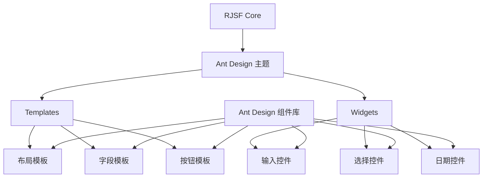

## 2. 设计原则与模式

### 2.1 适配器模式

Ant Design 主题采用适配器设计模式，将 RJSF 的核心功能与 Ant Design 的 UI 组件进行适配。这种模式允许两个不兼容的接口能够在一起工作。

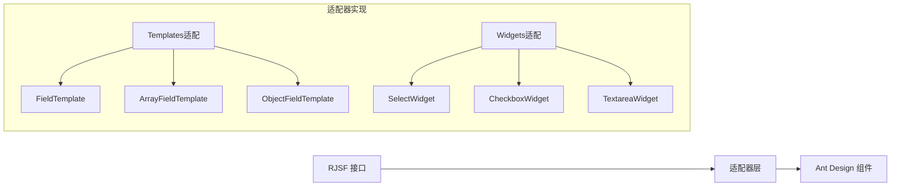

### 2.2 组合模式

主题实现采用组合模式，通过组合不同的小组件来构建复杂的表单界面。

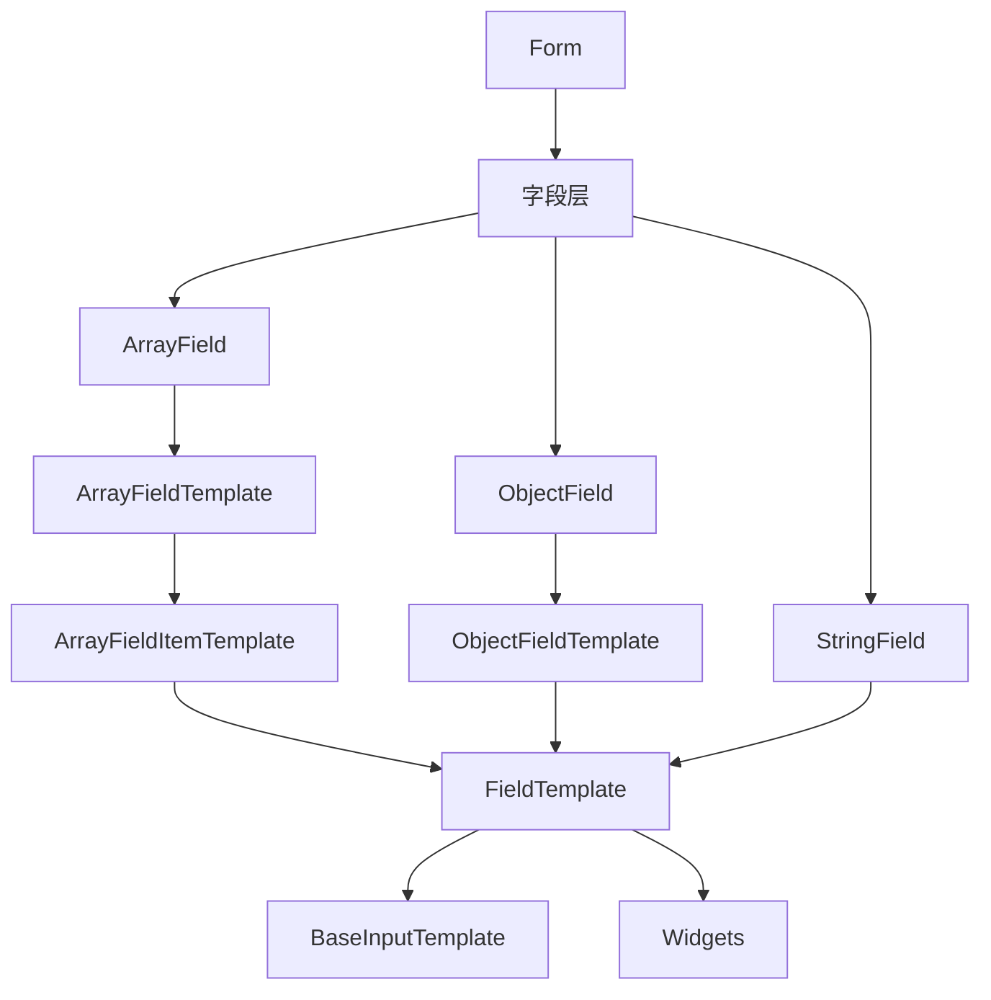

### 2.3 工厂模式

主题使用工厂模式创建所需的组件集合，通过 `generateTemplates` 和 `generateWidgets` 函数生成模板和小部件。

## 3. 核心组件结构

### 3.1 入口设计

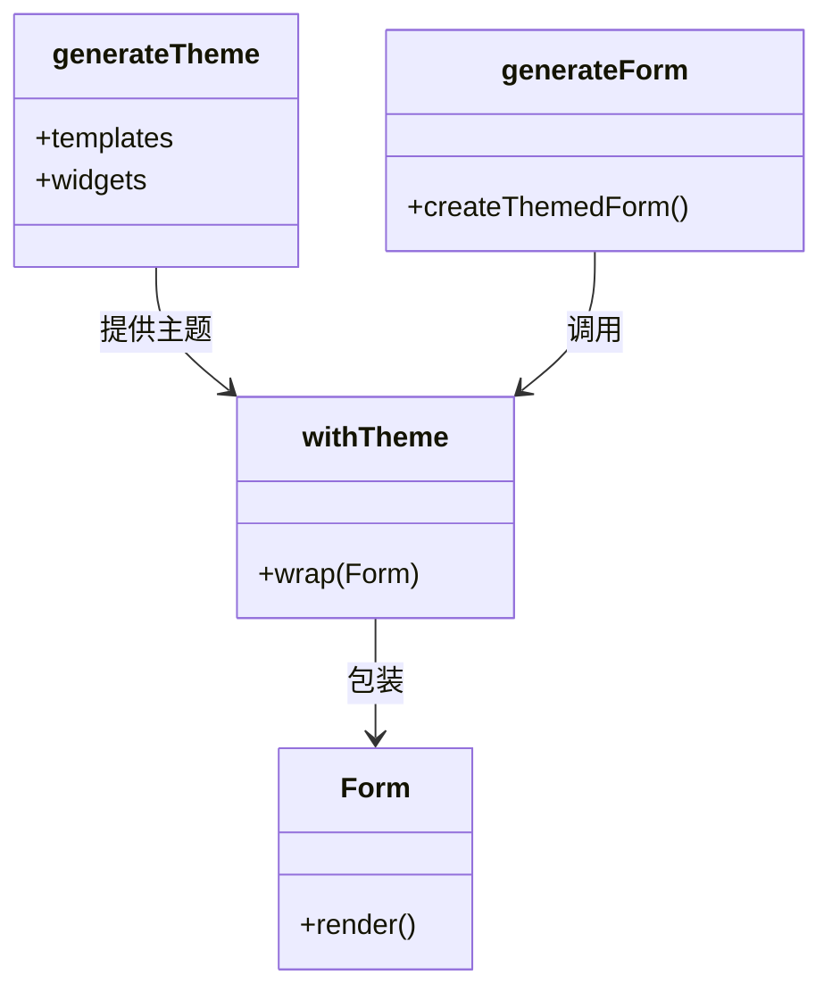

主入口文件 `index.ts` 负责:
1. 导出 `generateTheme` 函数，用于创建主题配置
2. 导出 `generateForm` 函数，生成带有 Ant Design 主题的表单组件
3. 导出预生成的 Form 组件、Templates 和 Widgets

### 3.2 模板系统

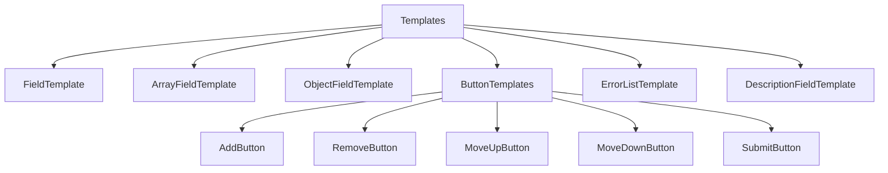

模板组件负责处理表单的布局和结构，包括:
- FieldTemplate: 字段的基本布局，使用 Ant Design 的 Form.Item
- ArrayFieldTemplate: 数组字段的布局，处理项的添加、删除和排序
- ObjectFieldTemplate: 对象字段的布局，处理属性的布局
- ButtonTemplates: 表单按钮，如添加、删除、上移、下移等

### 3.3 小部件系统

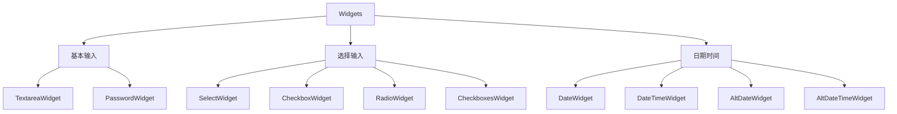

小部件组件负责处理具体的数据输入，每个小部件封装了一个 Ant Design 的输入组件，如:
- SelectWidget: 封装 Ant Design 的 Select 组件
- CheckboxWidget: 封装 Ant Design 的 Checkbox 组件
- DateWidget: 封装 Ant Design 的 DatePicker 组件

## 4. 关键实现机制

### 4.1 主题注册机制

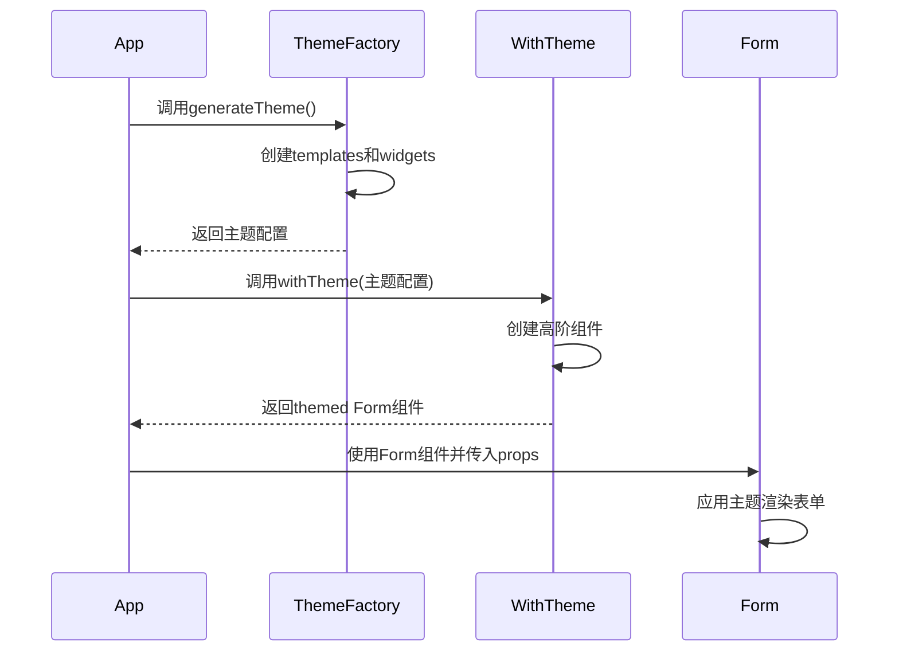

主题注册通过 `withTheme` 高阶组件完成，它接收一个主题配置对象，然后返回一个包装了主题配置的 Form 组件。

### 4.2 与 Ant Design 组件的集成

集成方式主要体现在以下几个方面:

1. **样式与布局适配**:
   ```mermaid
   graph LR
       A[RJSF FieldTemplate] --> B[Form.Item包装]
       B --> C[label处理]
       B --> D[error处理]
       B --> E[help处理]
       B --> F[描述处理]
   ```

2. **事件处理适配**:
   ```mermaid
   graph LR
       A[RJSF事件] --> B[适配层]
       B --> C[Ant Design事件]
       
       D[onChange] --> E[处理值转换]
       E --> F[调用Ant Design组件onChange]
   ```

3. **属性映射**:
   ```mermaid
   graph LR
       A[RJSF属性] --> B[属性映射层]
       B --> C[Ant Design属性]
       
       D[readonly] --> E[转换为disabled]
       F[options] --> G[转换为Select选项]
   ```

### 4.3 表单状态与验证

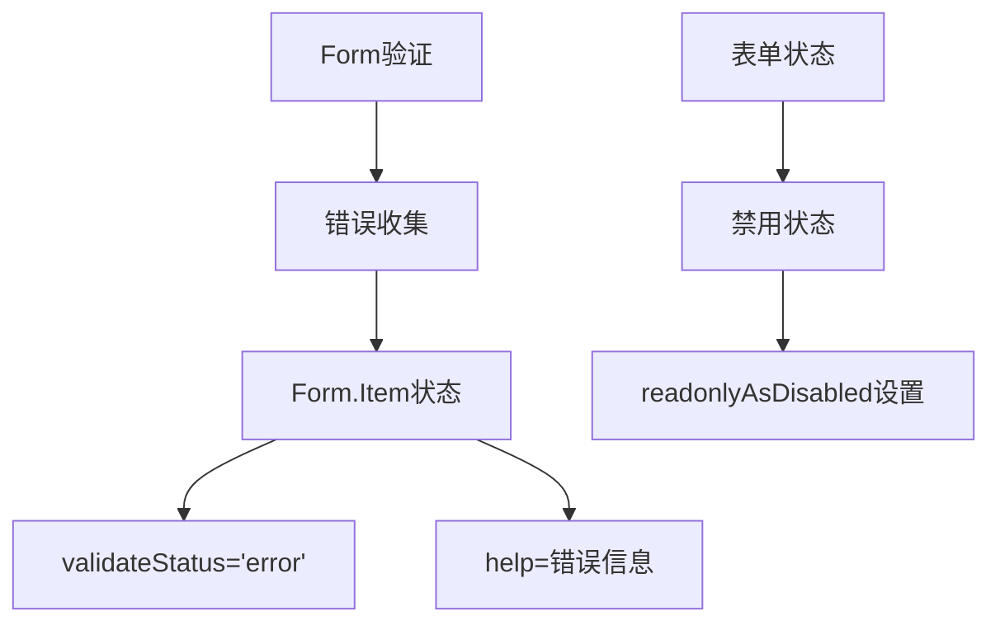

## 5. 扩展性设计

### 5.1 泛型支持

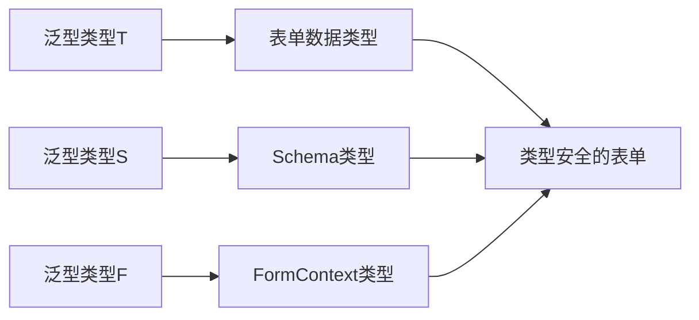

主题实现中广泛使用泛型，以支持类型安全的表单构建。主要的泛型参数包括:
- T: 表单数据类型
- S: Schema类型，扩展自StrictRJSFSchema
- F: FormContext类型，用于表单上下文

### 5.2 可配置性

主题提供了丰富的配置选项，可以通过 formContext 和 uiSchema 进行配置:

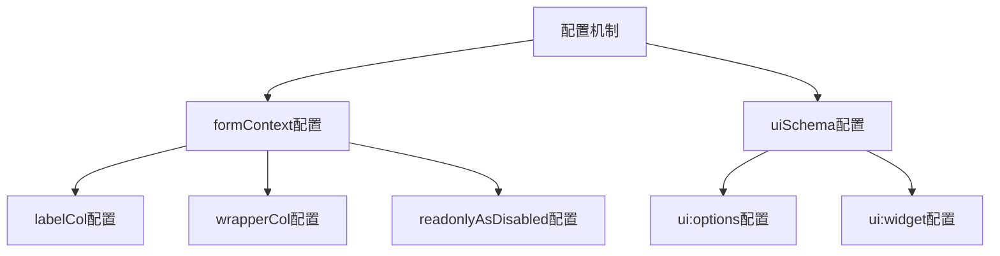

### 5.3 组合式API

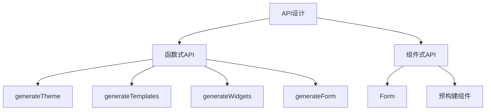

主题提供了函数式API和组件式API两种使用方式，函数式API允许更灵活的定制，而组件式API则提供了开箱即用的体验。

## 6. 优势与挑战

### 6.1 优势

1. **完整的Ant Design集成**: 充分利用Ant Design组件的功能和样式
2. **类型安全**: 全面的TypeScript支持，提供类型检查和自动补全
3. **可扩展性**: 灵活的API设计，支持多种使用场景
4. **声明式配置**: 通过uiSchema和formContext进行配置，减少代码量

### 6.2 挑战

1. **性能优化**: 组件层次较深可能带来性能挑战
2. **版本兼容**: 需要处理Ant Design版本变更的兼容问题
3. **功能覆盖**: 需要为所有RJSF功能提供Ant Design实现

## 7. 架构最佳实践

### 7.1 组件设计

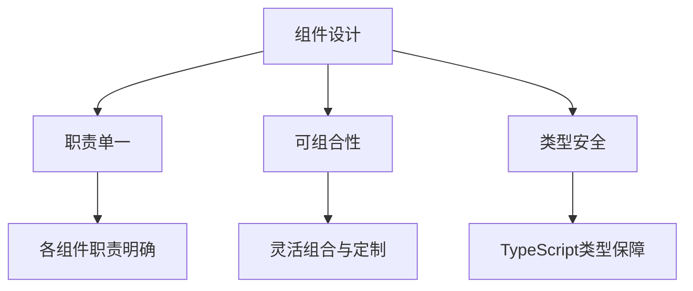

### 7.2 测试策略

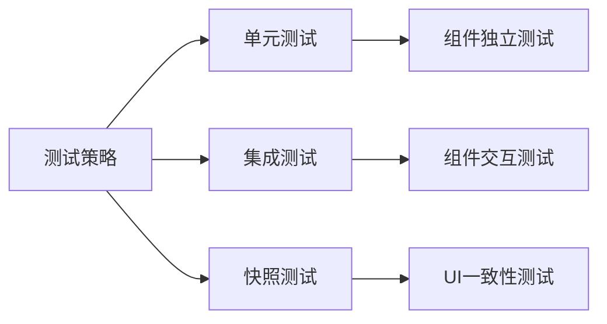

## 8. 总结

Ant Design主题是RJSF的一个精心设计的扩展，它遵循了良好的软件架构原则，包括:

1. **关注点分离**: 清晰地将模板、小部件和表单逻辑分开
2. **适配器模式**: 优雅地连接RJSF和Ant Design生态系统
3. **组合式设计**: 通过组合小组件构建复杂UI
4. **工厂模式**: 使用工厂函数创建组件集合
5. **类型安全**: 全面的TypeScript支持

这些设计使得Ant Design主题既能提供开箱即用的体验，又保持了高度的可定制性和扩展性，是一个值得学习的架构示例。
