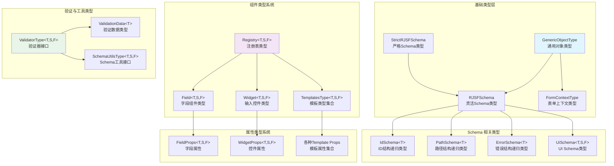
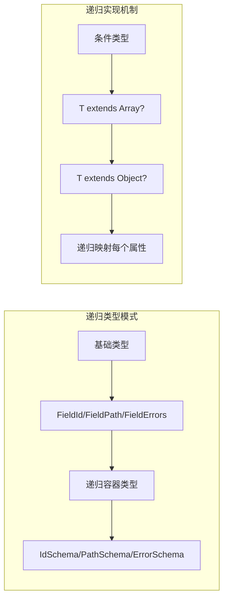
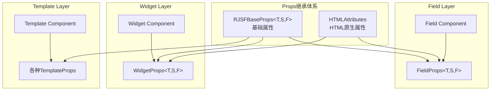
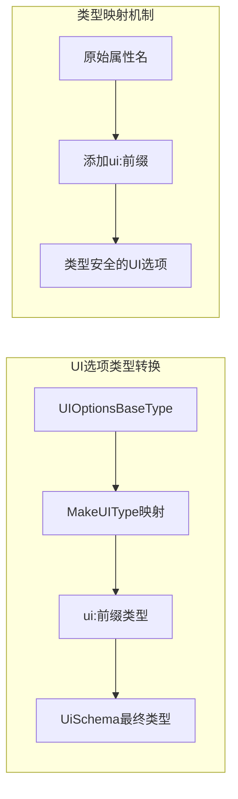
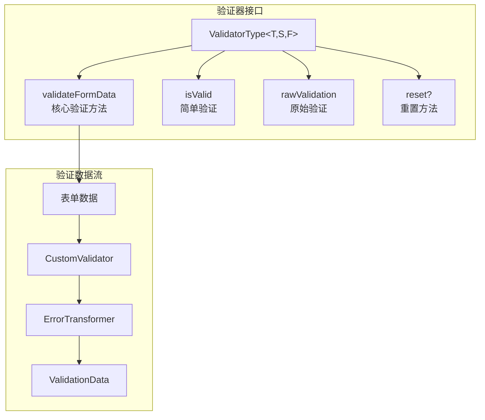
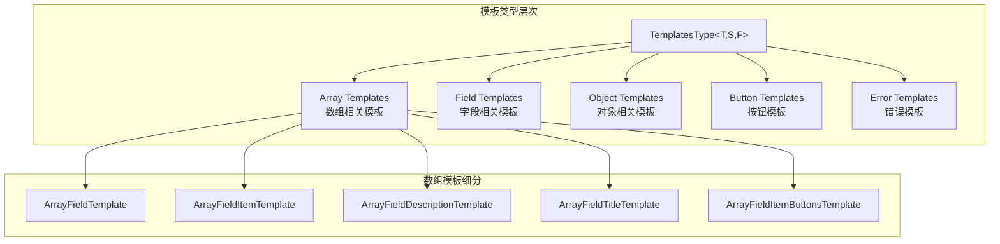
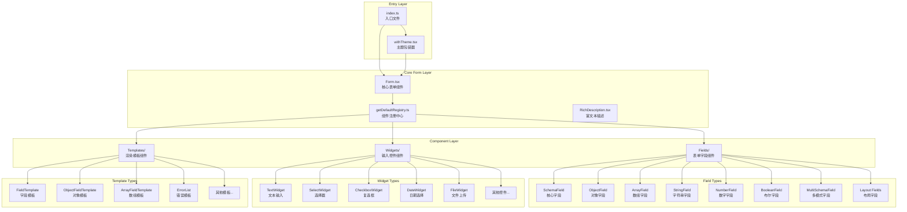
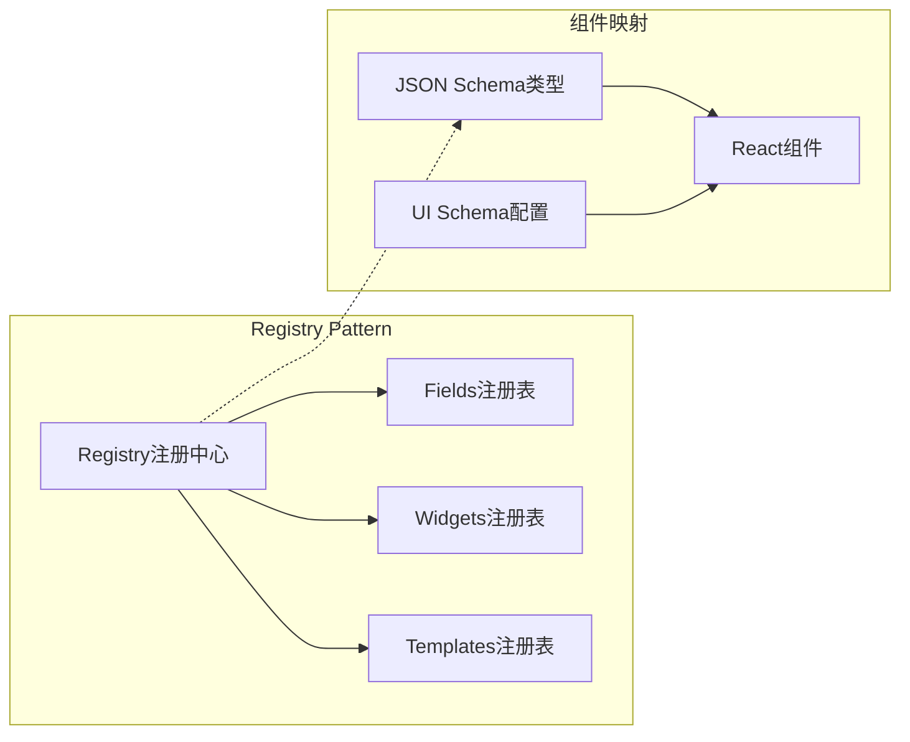
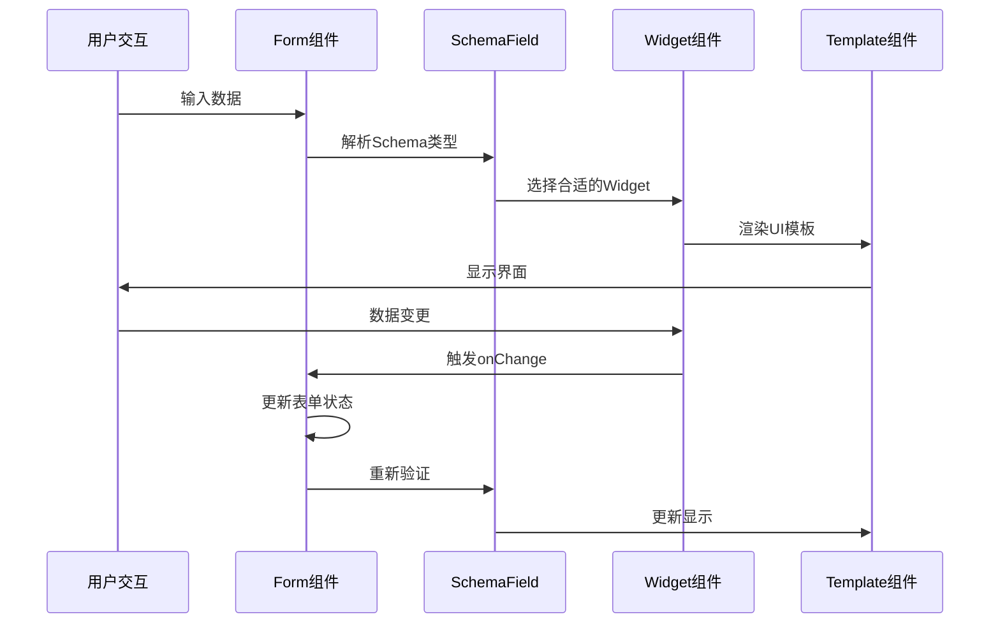
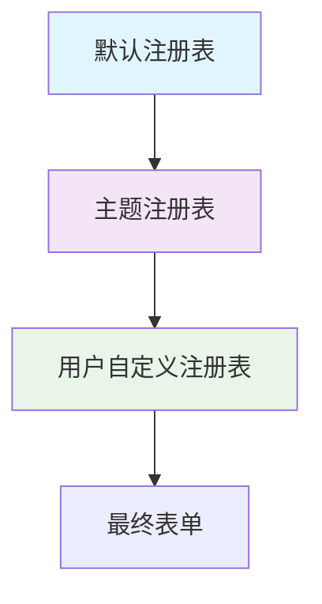

# React JSON Schema Form Core 架构分析

## 概述

React JSON Schema Form (RJSF) Core 是一个基于 JSON Schema 的表单生成库的核心模块。本文档从架构师角度分析其 `src` 目录结构，揭示其设计模式和架构原理。

## RJSF 类型系统深度解析

### 类型系统整体架构

RJSF 构建了一个高度复杂且类型安全的类型系统，其核心围绕三个泛型参数展开：

```typescript
// 核心泛型约束
T = any                           // 表单数据类型
S extends StrictRJSFSchema = RJSFSchema  // Schema类型约束
F extends FormContextType = any   // 表单上下文类型
```

### 类型层次结构图



### 核心基础类型分析

#### 1. Schema 类型体系

```typescript
// 基础Schema类型映射
export type StrictRJSFSchema = JSONSchema7;  // 严格遵循JSON Schema 7标准
export type RJSFSchema = StrictRJSFSchema & GenericObjectType;  // 扩展的灵活Schema

// 类型特点分析：
// 1. 版本控制友好 - 通过类型别名便于未来升级
// 2. 向后兼容 - RJSFSchema 支持额外属性
// 3. 类型安全 - 基于标准JSON Schema规范
```

#### 2. 递归类型结构



```typescript
// IdSchema 递归类型设计
type IdSchema<T = any> = T extends GenericObjectType
  ? FieldId & {
      [key in keyof T]?: IdSchema<T[key]>;  // 递归映射
    }
  : FieldId;

// 设计优势：
// 1. 类型安全的递归结构
// 2. 保持与数据结构的映射关系
// 3. 编译时错误检查
```

### 组件类型系统架构

#### 1. 三层组件类型架构



#### 2. Props 类型继承设计

```typescript
// 基础Props设计模式
export type RJSFBaseProps<T = any, S extends StrictRJSFSchema = RJSFSchema, F extends FormContextType = any> = {
  schema: S;                    // Schema 定义
  uiSchema?: UiSchema<T, S, F>; // UI Schema 配置
  registry: Registry<T, S, F>;  // 组件注册表
};

// Field Props 扩展
export interface FieldProps<T, S, F> 
  extends GenericObjectType,           // 支持任意扩展属性
          RJSFBaseProps<T, S, F>,      // 基础RJSF属性
          Pick<HTMLAttributes<HTMLElement>, ...> // 选择性HTML属性继承
{
  // Field特有属性
  formData?: T;
  onChange: (newFormData: T | undefined, es?: ErrorSchema<T>, id?: string) => any;
  // ... 其他属性
}
```

### UI Schema 类型系统

#### UI Schema 的高级类型映射



```typescript
// 高级类型映射设计
type MakeUIType<Type> = {
  [Property in keyof Type as `ui:${string & Property}`]: Type[Property];
};

// UiSchema 类型组合
export type UiSchema<T, S, F> = 
  GenericObjectType &                    // 支持用户自定义属性
  MakeUIType<UIOptionsBaseType<T, S, F>> & // UI选项类型映射
  {
    'ui:globalOptions'?: GlobalUISchemaOptions;
    'ui:options'?: UIOptionsType<T, S, F>;
    // ... 其他特殊UI选项
  };

// 设计优势：
// 1. 类型安全的UI配置
// 2. 智能的属性提示
// 3. 编译时验证
```

### 验证器类型接口

#### ValidatorType 接口设计



```typescript
// 验证器接口的函数式设计
export interface ValidatorType<T, S, F> {
  validateFormData(
    formData: T | undefined,
    schema: S,
    customValidate?: CustomValidator<T, S, F>,     // 自定义验证函数
    transformErrors?: ErrorTransformer<T, S, F>,   // 错误转换函数
    uiSchema?: UiSchema<T, S, F>,
  ): ValidationData<T>;
  
  // 其他验证方法...
}

// 函数式验证器设计
export type CustomValidator<T, S, F> = (
  formData: T | undefined,
  errors: FormValidation<T>,
  uiSchema?: UiSchema<T, S, F>,
) => FormValidation<T>;
```

### 模板类型系统

#### 完整的模板类型定义



```typescript
// 模板类型的组合设计
export type TemplatesType<T, S, F> = {
  // 核心模板
  ArrayFieldTemplate: ComponentType<ArrayFieldTemplateProps<T, S, F>>;
  FieldTemplate: ComponentType<FieldTemplateProps<T, S, F>>;
  ObjectFieldTemplate: ComponentType<ObjectFieldTemplateProps<T, S, F>>;
  
  // 按钮模板子系统
  ButtonTemplates: {
    SubmitButton: ComponentType<SubmitButtonProps<T, S, F>>;
    AddButton: ComponentType<IconButtonProps<T, S, F>>;
    RemoveButton: ComponentType<IconButtonProps<T, S, F>>;
    // ... 其他按钮
  };
} & {
  // 支持用户自定义模板
  [key: string]: ComponentType<any> | { [key: string]: ComponentType<any> } | undefined;
};
```

### 实验性功能类型设计

#### 渐进式功能增强

```typescript
// 实验性功能的类型安全设计
export type Experimental_DefaultFormStateBehavior = {
  arrayMinItems?: Experimental_ArrayMinItems;           // 数组最小项配置
  emptyObjectFields?: 'populateAllDefaults' |           // 空对象字段处理策略
                      'populateRequiredDefaults' | 
                      'skipDefaults' | 
                      'skipEmptyDefaults';
  allOf?: 'populateDefaults' | 'skipDefaults';         // allOf处理策略
  mergeDefaultsIntoFormData?: 'useFormDataIfPresent' |  // 默认值合并策略
                              'useDefaultIfFormDataUndefined';
  constAsDefaults?: 'always' | 'skipOneOf' | 'never';  // 常量作为默认值策略
};

// 设计特点：
// 1. 向后兼容的实验性功能
// 2. 类型安全的配置选项
// 3. 渐进式增强机制
```

### 类型系统的设计模式

#### 1. 泛型约束模式

```typescript
// 一致的泛型约束设计
interface SomeInterface<
  T = any,                                    // 数据类型，默认any保证兼容性
  S extends StrictRJSFSchema = RJSFSchema,   // Schema类型，有约束确保合法性
  F extends FormContextType = any             // 上下文类型，默认any保证灵活性
> {
  // 接口定义
}
```

#### 2. 条件类型模式

```typescript
// 递归条件类型的应用
type PathSchema<T = any> =
  T extends Array<infer U>              // 数组类型处理
    ? FieldPath & { [i: number]: PathSchema<U>; }
    : T extends GenericObjectType       // 对象类型处理  
      ? FieldPath & { [key in keyof T]?: PathSchema<T[key]>; }
      : FieldPath;                      // 基础类型处理
```

#### 3. 映射类型模式

```typescript
// 属性转换的映射类型
type MakeUIType<Type> = {
  [Property in keyof Type as `ui:${string & Property}`]: Type[Property];
};

// 选择性属性继承
Pick<HTMLAttributes<HTMLElement>, Exclude<keyof HTMLAttributes<HTMLElement>, 'onBlur' | 'onFocus' | 'onChange'>>
```

### 类型系统的架构优势

#### 1. 类型安全性

- **编译时检查**: 所有类型错误在编译阶段被发现
- **智能提示**: IDE 提供准确的代码补全和文档
- **重构安全**: 类型变更时自动检查影响范围

#### 2. 可扩展性

- **泛型设计**: 支持用户自定义数据类型
- **接口继承**: 清晰的类型继承层次
- **条件类型**: 根据条件动态生成类型

#### 3. 开发体验

- **渐进式增强**: 从any类型开始，逐步增加类型约束
- **向后兼容**: 新类型不破坏已有代码
- **文档化**: 类型本身就是最好的文档

## 整体架构设计

### 核心设计原则

1. **组合优于继承** - 通过 Registry 模式组合 Fields、Widgets 和 Templates
2. **关注分离** - 明确区分表单字段逻辑、渲染模板和用户输入控件
3. **可扩展性** - 支持主题定制和组件覆盖
4. **类型安全** - 广泛使用 TypeScript 泛型确保类型安全

### 架构层次图



## 核心组件分析

### 1. Form.tsx - 核心表单组件

**职责**: 
- 表单状态管理
- Schema 解析和验证
- 事件处理 (onChange, onSubmit, onError)
- 组件注册表管理

**关键特性**:
- 支持受控和非受控模式
- 自动表单验证
- 错误处理和显示
- 表单数据格式化

### 2. Registry 系统



**设计优势**:
- **解耦**: Schema 类型与具体实现分离
- **可扩展**: 支持自定义组件注册
- **主题化**: 通过覆盖注册表实现主题

### 3. 三层组件架构

#### Fields Layer (表单字段层)
- **SchemaField**: 核心字段，负责根据 Schema 类型选择合适的字段组件
- **ObjectField**: 处理对象类型数据
- **ArrayField**: 处理数组类型数据
- **StringField/NumberField/BooleanField**: 基础数据类型字段
- **MultiSchemaField**: 处理 anyOf/oneOf 等复杂 Schema

#### Widgets Layer (输入控件层)
- 负责用户交互和数据输入
- 每个控件专注于特定的输入方式
- 支持丰富的输入类型：文本、日期、文件、选择器等

#### Templates Layer (模板层)
- 负责组件的渲染布局
- 提供统一的样式接口
- 支持错误显示、帮助文本、标题等

## 数据流分析



## 扩展机制

### 1. 主题系统 (withTheme)



**特点**:
- 层层覆盖机制
- 支持部分覆盖
- 保持向后兼容

### 2. 组件自定义

用户可以通过以下方式扩展:
- 自定义 Fields
- 自定义 Widgets  
- 自定义 Templates
- 创建主题包

## 设计模式应用

### 1. Registry Pattern (注册表模式)
- **目的**: 管理组件映射关系
- **优势**: 动态组件选择，易于扩展

### 2. Template Method Pattern (模板方法模式)
- **应用**: Template 组件中的渲染逻辑
- **优势**: 统一渲染流程，可定制细节

### 3. Strategy Pattern (策略模式)
- **应用**: 不同 Widget 的选择策略
- **优势**: 算法族可互换

### 4. Composite Pattern (组合模式)
- **应用**: Fields 的嵌套结构
- **优势**: 树形结构统一处理

## 性能考虑

### 1. 懒加载组件
- 按需导入减少包大小
- 树摇优化支持

### 2. React 优化
- 使用 React.memo 优化重渲染
- 合理的 key 设计
- 状态提升策略

### 3. 缓存机制
- Schema 解析结果缓存
- 组件实例复用

## 类型安全设计

```typescript
// 泛型设计保证类型安全
export interface FormProps<
  T = any,                    // 表单数据类型
  S extends StrictRJSFSchema = RJSFSchema,  // Schema类型
  F extends FormContextType = any           // 表单上下文类型
> {
  // ...属性定义
}
```

**优势**:
- 编译时类型检查
- 更好的 IDE 支持
- 减少运行时错误

## 总结

RJSF Core 的架构设计体现了以下核心优势:

1. **模块化设计**: 清晰的职责分离和模块边界
2. **高度可扩展**: 通过注册表和主题系统支持深度定制
3. **类型安全**: 全面的 TypeScript 支持
4. **性能优化**: 合理的组件拆分和优化策略
5. **设计模式**: 恰当运用多种设计模式解决复杂问题

这种架构使得 RJSF 能够在保持核心功能稳定的同时，为不同的 UI 框架和使用场景提供灵活的扩展能力。

### 类型系统的核心价值

RJSF 的类型系统是其架构成功的关键因素：

1. **完整的类型覆盖**: 从基础数据类型到复杂组件属性的全面类型定义
2. **灵活的泛型设计**: 支持用户自定义的数据结构和扩展需求
3. **渐进式类型增强**: 从宽松到严格的类型约束选择
4. **优秀的开发体验**: 智能提示、编译时检查和重构安全

这种精心设计的类型系统为 RJSF 提供了坚实的技术基础，确保了代码的健壮性、可维护性和开发效率。

