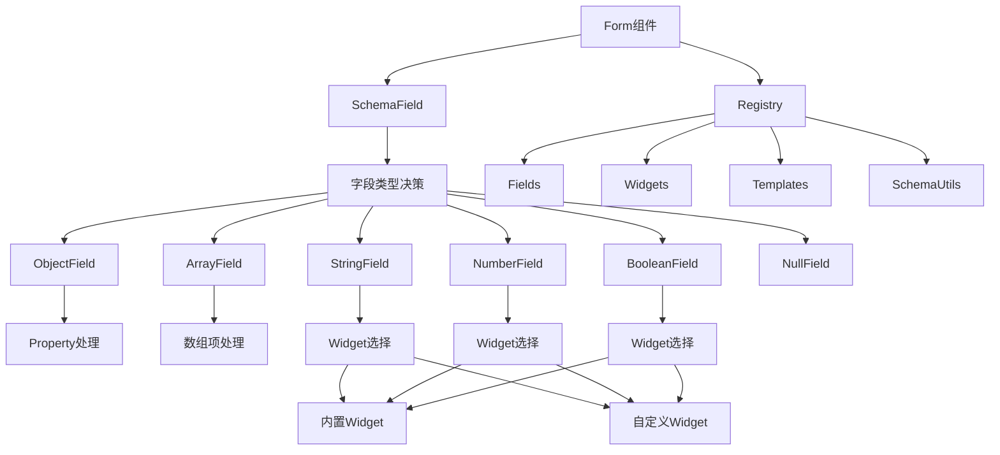
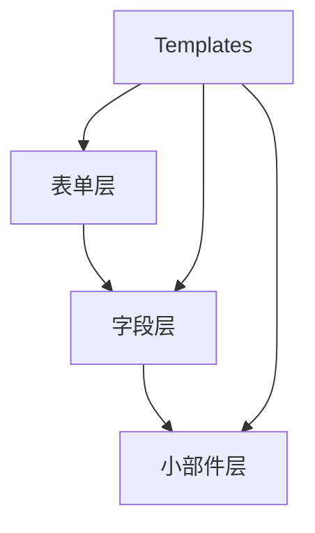
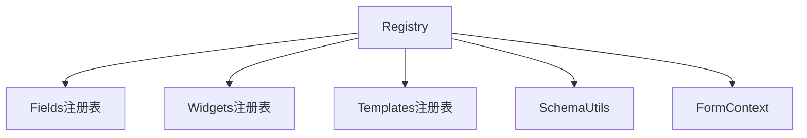
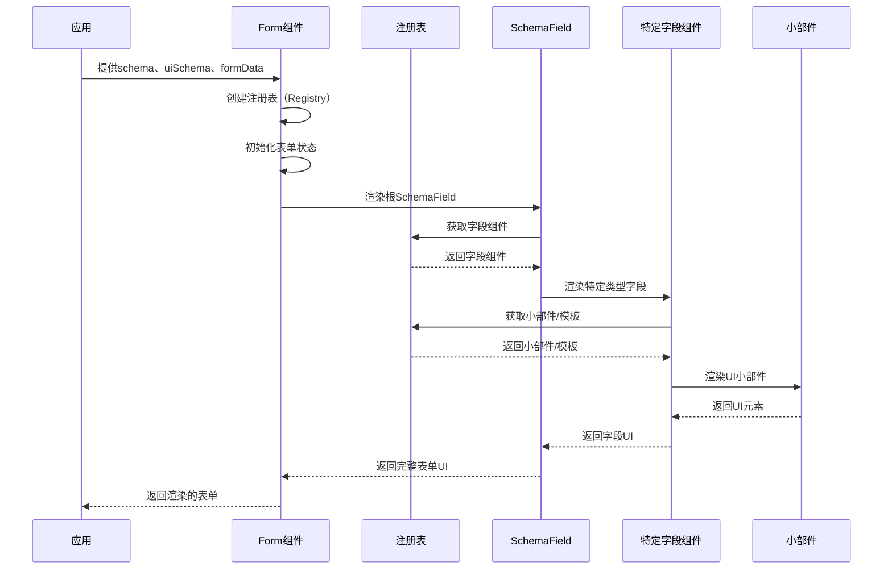
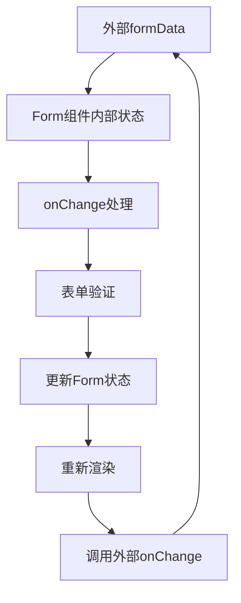
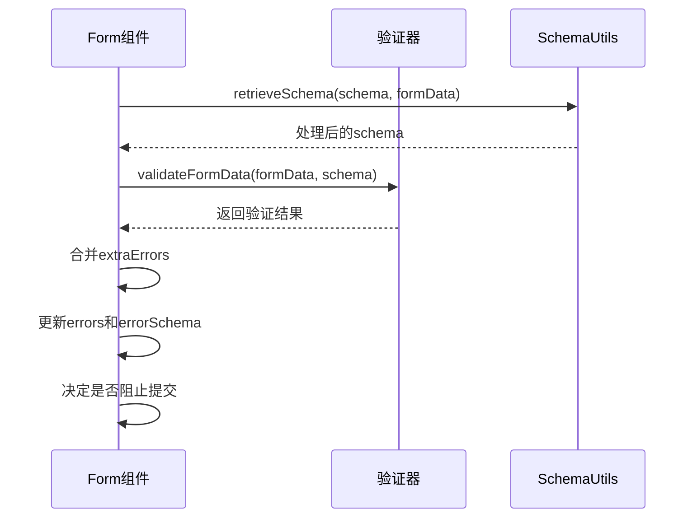
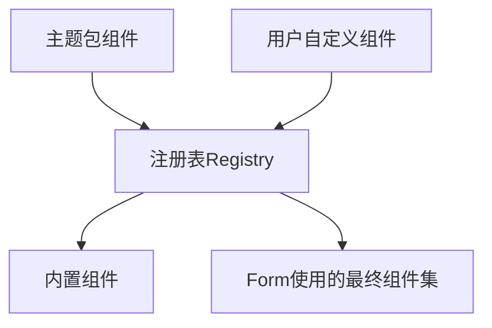
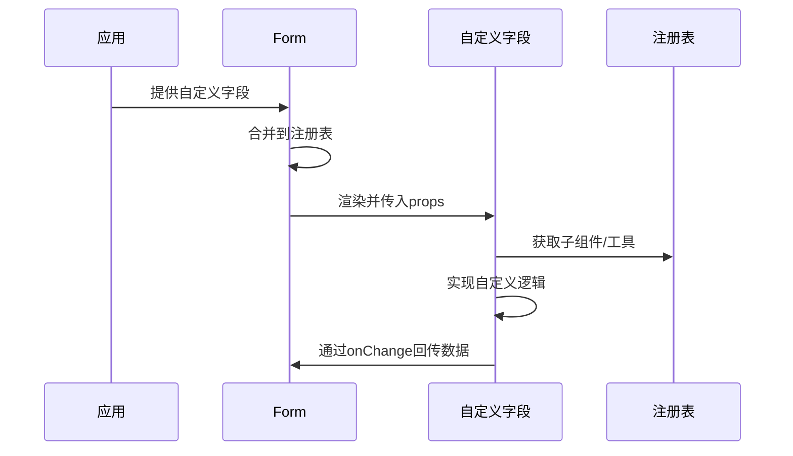

# React JSON Schema Form (RJSF) 详细分析与工作原理

## 1. 项目概述

React JSON Schema Form（RJSF）是一个用于根据JSON Schema规范生成表单的React库。它允许开发者通过JSON Schema定义表单结构，并通过UI Schema自定义表单的外观和行为。RJSF的核心功能包括：

- 根据JSON Schema生成表单UI
- 支持表单数据验证
- 提供可扩展的主题系统
- 支持自定义字段、小部件和模板
- 处理复杂的表单逻辑（如条件字段、依赖关系等）

## 2. 架构设计

RJSF采用模块化的架构设计，主要分为以下几个核心部分：



### 2.1 分层架构

RJSF采用三层架构模式：



1. **表单层（Form）**：处理整体表单状态、验证和提交
2. **字段层（Fields）**：处理特定类型的字段逻辑，如对象、数组、字符串等
3. **小部件层（Widgets）**：实际的UI输入组件，如文本框、复选框、下拉菜单等

### 2.2 注册表模式（Registry Pattern）

RJSF使用注册表模式来管理和扩展组件：



这种模式允许：
- 主题包提供默认组件集
- 应用开发者覆盖或扩展特定组件
- 通过上下文在组件间共享功能

## 3. 核心工作原理

### 3.1 表单渲染过程



### 3.2 SchemaField组件的工作原理

SchemaField是RJSF的核心组件，负责根据schema类型决定渲染哪种字段组件：

1. **类型决策**：通过schema.type或推断类型确定使用哪个字段组件
2. **组件选择**：从注册表中获取适当的字段组件（如ObjectField、ArrayField等）
3. **模板应用**：使用FieldTemplate包装实际字段组件
4. **递归渲染**：对于复杂类型（如对象、数组），递归处理子字段

关键代码逻辑如下：

```typescript
// 根据schema类型决定使用哪个字段组件
function getFieldComponent(schema, uiOptions, idSchema, registry) {
  // 检查UI选项中是否指定了字段组件
  const field = uiOptions.field;
  if (typeof field === 'function') {
    return field;
  }
  if (typeof field === 'string' && field in fields) {
    return fields[field];
  }

  // 获取schema类型
  const schemaType = getSchemaType(schema);
  const type = Array.isArray(schemaType) ? schemaType[0] : schemaType || '';

  // 检查是否有通过$id指定的字段组件
  const schemaId = schema.$id;
  let componentName = COMPONENT_TYPES[type];
  if (schemaId && schemaId in fields) {
    componentName = schemaId;
  }

  // 返回对应的字段组件或不支持类型的占位符
  return componentName in fields
    ? fields[componentName]
    : () => <UnsupportedFieldTemplate />;
}
```

### 3.3 数据流和状态管理

RJSF的数据流如下：



Form组件维护内部状态，包括：
- formData：当前表单数据
- errors：验证错误
- errorSchema：结构化的错误信息
- idSchema：用于生成唯一ID的schema

### 3.4 验证流程



## 4. 自定义组件实现原理

RJSF的自定义组件系统是其最强大的特性之一，允许开发者扩展和定制表单行为。

### 4.1 自定义组件的注册机制



自定义组件可以通过以下方式提供：

1. **全局注册**：通过Form的props（fields、widgets、templates）
2. **主题集成**：通过withTheme高阶组件
3. **局部覆盖**：通过uiSchema的ui:field、ui:widget属性

### 4.2 自定义字段（Field）实现

自定义字段组件需要符合FieldProps接口，接收以下关键属性：

```typescript
interface FieldProps<T = any, S extends StrictRJSFSchema = RJSFSchema, F extends FormContextType = any> {
  schema: S;
  uiSchema?: UiSchema<T, S, F>;
  idSchema: IdSchema<T>;
  formData?: T;
  errorSchema?: ErrorSchema<T>;
  registry: Registry<T, S, F>;
  onChange: (formData: T, errorSchema?: ErrorSchema<T>, id?: string) => void;
  // 其他属性...
}
```

#### 4.2.1 使用自定义字段的方式

自定义字段可以通过三种方式使用：

1. **全局注册**：

```jsx
import Form from "@rjsf/core";
import MyCustomField from "./MyCustomField";

const fields = {
  StringField: MyCustomField // 替换所有字符串字段
};

// 在表单中使用
<Form 
  schema={schema} 
  uiSchema={uiSchema} 
  fields={fields} 
/>
```

2. **通过uiSchema局部指定**：

```jsx
const uiSchema = {
  "myField": {
    "ui:field": "MyCustomField" // 需要先在fields中注册
  }
};

// 或直接提供组件
const uiSchema = {
  "myField": {
    "ui:field": MyCustomField // 直接使用组件引用
  }
};
```

3. **通过schema的$id属性**：

```jsx
const schema = {
  type: "object",
  properties: {
    myField: {
      type: "string",
      $id: "MyCustomField" // 需要先在fields中注册这个ID
    }
  }
};
```

#### 4.2.2 自定义字段实现示例

```jsx
// 自定义字段实现示例
function MyCustomField(props) {
  const {
    schema,
    uiSchema,
    idSchema,
    formData,
    errorSchema,
    registry,
    onChange
  } = props;
  
  const { fields, widgets } = registry;
  
  // 可以使用registry中的其他组件
  const { SchemaField } = fields;
  
  // 自定义处理逻辑
  const handleChange = (value) => {
    // 对数据进行处理
    const processedValue = someProcessing(value);
    // 调用原始onChange
    onChange(processedValue);
  };
  
  return (
    <div className="my-custom-field">
      {/* 自定义UI或组合其他字段 */}
      <SchemaField
        {...props}
        onChange={handleChange}
      />
      <div className="custom-field-addon">
        {/* 添加额外UI元素 */}
      </div>
    </div>
  );
}
```

自定义字段实现示例流程：



### 4.3 自定义小部件（Widget）实现

小部件是最基础的UI输入组件，实现WidgetProps接口：

```typescript
interface WidgetProps<T = any, S extends StrictRJSFSchema = RJSFSchema, F extends FormContextType = any> {
  id: string;
  schema: S;
  value: any;
  required: boolean;
  disabled: boolean;
  readonly: boolean;
  onChange: (value: any) => void;
  options: WidgetOptions<T, S, F>;
  // 其他属性...
}
```

#### 4.3.1 使用自定义Widget的方式

自定义Widget可以通过以下方式使用：

1. **全局注册**：

```jsx
import Form from "@rjsf/core";
import MyCustomWidget from "./MyCustomWidget";

const widgets = {
  TextWidget: MyCustomWidget // 替换所有文本输入
};

<Form 
  schema={schema} 
  uiSchema={uiSchema} 
  widgets={widgets} 
/>
```

2. **通过uiSchema指定**：

```jsx
const uiSchema = {
  "myField": {
    "ui:widget": "myCustomWidget" // 需要在widgets中注册
  }
};

// 或直接提供组件
const uiSchema = {
  "myField": {
    "ui:widget": MyCustomWidget // 直接使用组件引用
  }
};
```

3. **根据字段类型选择适当的Widget**：

```jsx
// schema指定format
const schema = {
  type: "string",
  format: "email" // 可以通过自定义EmailWidget响应此format
};
```

#### 4.3.2 自定义Widget实现示例

```jsx
// 自定义Widget实现
function MyCustomWidget(props) {
  const {
    id,
    value,
    required,
    disabled,
    readonly,
    onChange,
    options,
    schema
  } = props;
  
  // 处理值变化
  const handleChange = (event) => {
    const newValue = event.target.value;
    onChange(newValue);
  };
  
  // 可以访问schema和options中的配置
  const placeholder = options.placeholder || schema.examples?.[0] || "";
  const enumOptions = options.enumOptions || [];
  
  return (
    <input
      id={id}
      value={value || ""}
      required={required}
      disabled={disabled || readonly}
      onChange={handleChange}
      placeholder={placeholder}
      className="custom-widget"
    />
  );
}
```

### 4.4 自定义模板（Template）实现

模板用于控制UI布局和结构，RJSF支持多种模板类型：

- FieldTemplate：字段容器模板
- ArrayFieldTemplate：数组字段模板
- ObjectFieldTemplate：对象字段模板
- DescriptionFieldTemplate：描述信息模板
- ErrorListTemplate：错误列表模板
- 等等

#### 4.4.1 使用自定义Template的方式

```jsx
import Form from "@rjsf/core";
import MyFieldTemplate from "./MyFieldTemplate";
import MyArrayFieldTemplate from "./MyArrayFieldTemplate";

const templates = {
  FieldTemplate: MyFieldTemplate,
  ArrayFieldTemplate: MyArrayFieldTemplate
};

<Form 
  schema={schema} 
  uiSchema={uiSchema} 
  templates={templates} 
/>
```

#### 4.4.2 自定义FieldTemplate实现示例

```jsx
function MyFieldTemplate(props) {
  const {
    id,
    label,
    children,
    errors,
    help,
    description,
    hidden,
    required,
    displayLabel,
    classNames,
    style
  } = props;
  
  if (hidden) {
    return children;
  }
  
  return (
    <div className={`custom-field ${classNames}`} style={style}>
      {displayLabel && (
        <label htmlFor={id}>
          {label}
          {required && <span className="required">*</span>}
        </label>
      )}
      {description && <div className="field-description">{description}</div>}
      {children}
      {errors && <div className="field-error">{errors}</div>}
      {help && <div className="field-help">{help}</div>}
    </div>
  );
}
```

#### 4.4.3 自定义ArrayFieldTemplate实现示例

```jsx
function MyArrayFieldTemplate(props) {
  const {
    items,
    canAdd,
    onAddClick,
    title,
    description
  } = props;
  
  return (
    <div className="custom-array-field">
      {title && <h3>{title}</h3>}
      {description && <p>{description}</p>}
      
      <div className="array-items">
        {items.map(item => (
          <div key={item.key} className="array-item">
            {item.children}
            {item.hasToolbar && (
              <div className="array-item-toolbar">
                {item.hasMoveUp && (
                  <button onClick={item.onReorderClick(item.index, item.index - 1)}>
                    上移
                  </button>
                )}
                {item.hasMoveDown && (
                  <button onClick={item.onReorderClick(item.index, item.index + 1)}>
                    下移
                  </button>
                )}
                {item.hasRemove && (
                  <button onClick={item.onDropIndexClick(item.index)}>
                    删除
                  </button>
                )}
              </div>
            )}
          </div>
        ))}
      </div>
      
      {canAdd && (
        <button className="array-add-button" onClick={onAddClick}>
          添加项目
        </button>
      )}
    </div>
  );
}

## 5. 主题扩展机制

RJSF通过withTheme高阶组件实现主题系统：

```typescript
// withTheme.tsx核心实现
export default function withTheme<T = any, S extends StrictRJSFSchema = RJSFSchema, F extends FormContextType = any>(
  themeProps: ThemeProps<T, S, F>,
): ComponentType<FormProps<T, S, F>> {
  return forwardRef<Form<T, S, F>, FormProps<T, S, F>>(
    ({ fields, widgets, templates, ...directProps }, ref) => {
      // 合并主题提供的组件和用户自定义组件
      fields = { ...themeProps?.fields, ...fields };
      widgets = { ...themeProps?.widgets, ...widgets };
      templates = {
        ...themeProps?.templates,
        ...templates,
        ButtonTemplates: {
          ...themeProps?.templates?.ButtonTemplates,
          ...templates?.ButtonTemplates,
        },
      };

      // 使用合并后的组件渲染Form
      return (
        <Form
          {...themeProps}
          {...directProps}
          fields={fields}
          widgets={widgets}
          templates={templates}
          ref={ref}
        />
      );
    },
  );
}
```

这种机制允许创建不同的UI框架适配，如Material UI、Bootstrap、Ant Design等。

## 6. 设计模式分析

RJSF使用多种设计模式来实现其架构：

### 6.1 组合模式（Composite Pattern）

用于构建表单的层次结构，特别是在处理对象和数组字段时。

### 6.2 策略模式（Strategy Pattern）

通过不同的字段和小部件实现，为不同类型的数据提供不同的处理策略。

### 6.3 模板方法模式（Template Method Pattern）

基础字段组件定义流程骨架，具体实现由子类完成。

### 6.4 装饰器模式（Decorator Pattern）

通过withTheme等高阶组件扩展功能。

### 6.5 工厂模式（Factory Pattern）

通过注册表和getFieldComponent等函数创建适当的组件实例。

## 7. 总结

React JSON Schema Form是一个设计精良的表单生成库，其核心优势在于：

1. **声明式API**：通过JSON Schema和UI Schema声明表单结构和行为
2. **高度可扩展**：提供全面的自定义机制
3. **分层架构**：清晰的责任分离使代码易于理解和维护
4. **主题支持**：易于与不同UI框架集成

这种架构设计允许开发者快速构建复杂表单，同时保持灵活性和可扩展性。通过注册表模式和组件层次结构，RJSF实现了关注点分离，使其成为处理复杂表单需求的强大工具。
