# React JSON Schema Form Utils 架构分析

## 概述

RJSF Utils 是 React JSON Schema Form 生态系统的核心工具库，提供了JSON Schema处理、表单状态管理、类型定义和各种实用工具函数。本文档从架构师角度分析其设计模式和核心功能。

## 整体架构设计

### 核心设计理念

1. **函数式编程** - 大量纯函数，易于测试和复用
2. **类型安全** - 完整的 TypeScript 类型定义体系
3. **模块化设计** - 功能清晰分离，高内聚低耦合
4. **Schema 中心** - 围绕 JSON Schema 标准构建的工具集
5. **插件化架构** - 支持验证器、解析器等插件扩展

### 架构分层图

```mermaid
graph TB
    subgraph "Entry Layer"
        Index[index.ts<br/>导出入口]
        Types[types.ts<br/>类型定义]
        Constants[constants.ts<br/>常量定义]
        Enums[enums.ts<br/>枚举定义]
    end
    
    subgraph "Core Utilities Layer"
        SchemaUtils[createSchemaUtils.ts<br/>Schema工具类]
        ErrorHandler[createErrorHandler.ts<br/>错误处理器]
        Translator[englishStringTranslator.ts<br/>国际化]
        IdGenerators[idGenerators.ts<br/>ID生成器]
    end
    
    subgraph "Schema Processing Layer"
        SchemaModule[schema/<br/>Schema处理模块]
        Parser[parser/<br/>Schema解析器]
        Retriever[retrieveSchema.ts<br/>Schema解析]
        Merger[mergeSchemas.ts<br/>Schema合并]
        Validator[ParserValidator.ts<br/>解析验证]
    end
    
    subgraph "Widget & Template Layer"
        WidgetUtils[getWidget.tsx<br/>Widget选择器]
        TemplateUtils[getTemplate.ts<br/>Template选择器]
        UIOptions[getUiOptions.ts<br/>UI选项处理]
        InputProps[getInputProps.ts<br/>输入属性]
    end
    
    subgraph "Form State Layer"
        DefaultState[getDefaultFormState.ts<br/>默认状态]
        StateValidation[validationDataMerge.ts<br/>状态验证]
        ErrorSchema[ErrorSchemaBuilder.ts<br/>错误Schema构建]
        FieldChanges[getChangedFields.ts<br/>字段变更检测]
    end
    
    subgraph "Data Processing Layer"
        TypeUtils[Type Utilities<br/>类型判断工具]
        DataUtils[Data Utilities<br/>数据处理工具]
        EnumUtils[Enum Utilities<br/>枚举处理工具]
        DateUtils[Date Utilities<br/>日期处理工具]
    end
    
    Index --> SchemaUtils
    Index --> ErrorHandler
    SchemaUtils --> SchemaModule
    SchemaUtils --> Parser
    WidgetUtils --> TypeUtils
    TemplateUtils --> TypeUtils
    DefaultState --> SchemaModule
    ErrorSchema --> SchemaModule
    
    style SchemaUtils fill:#e1f5fe
    style SchemaModule fill:#f3e5f5
    style Parser fill:#e8f5e8
    style WidgetUtils fill:#fff3e0
```

## 核心模块分析

### 1. SchemaUtils - 核心工具类

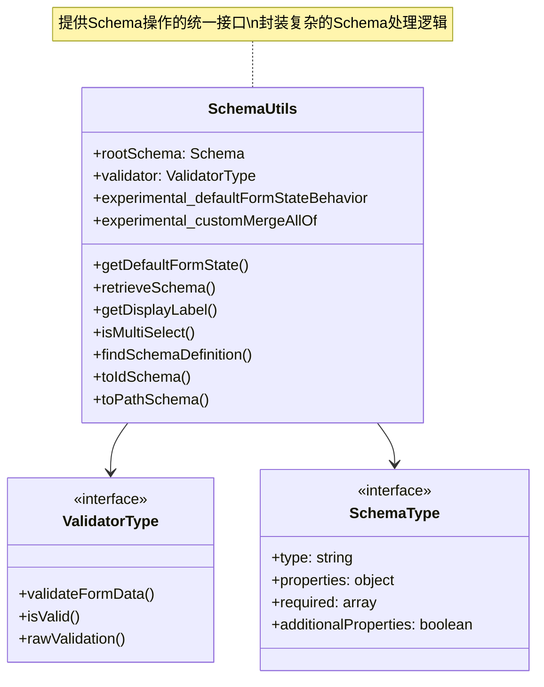

**职责**:
- 提供 Schema 操作的统一接口
- 封装验证器和根 Schema
- 简化复杂 Schema 处理逻辑

### 2. Schema 处理模块

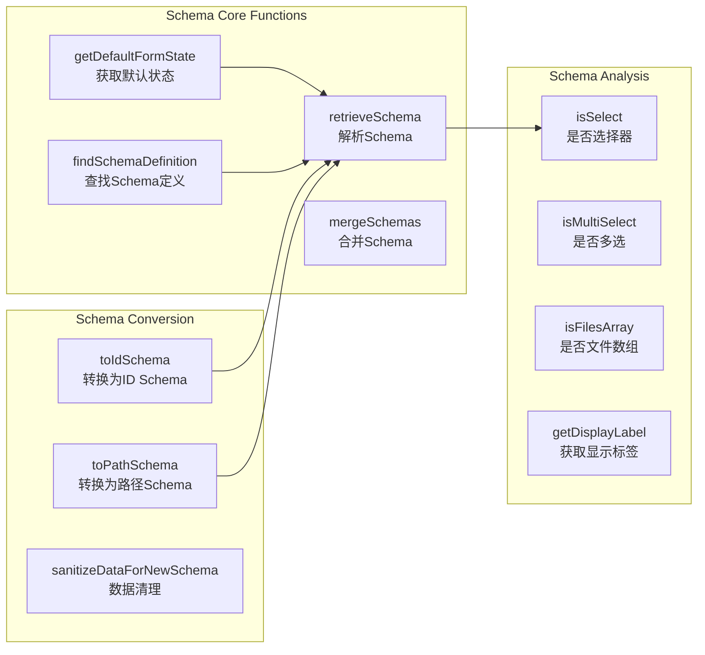

**核心功能**:
- **Schema 解析**: 处理 $ref、allOf、oneOf、anyOf 等复杂结构
- **默认值计算**: 根据 Schema 生成表单默认状态
- **Schema 转换**: 生成 ID Schema 和路径 Schema
- **条件处理**: 处理条件 Schema 和依赖关系

### 3. Widget 选择机制

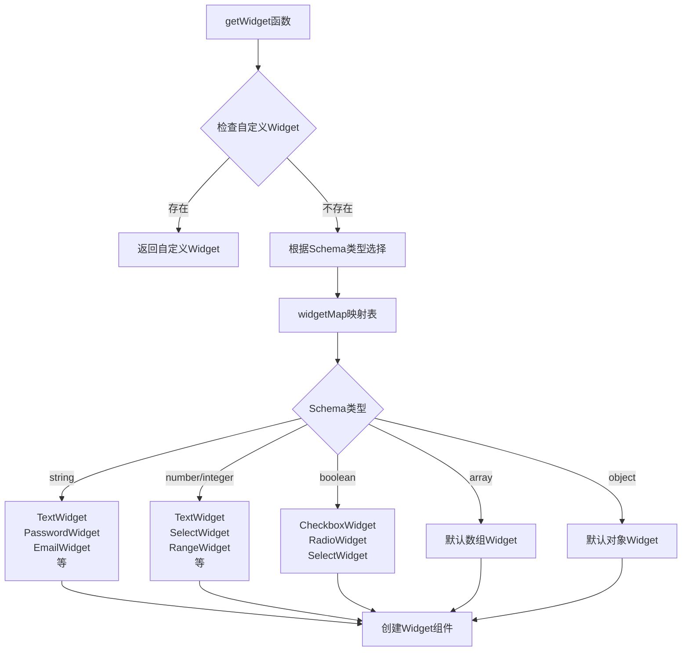

**选择策略**:
1. 优先使用自定义 Widget
2. 根据 Schema 类型和 UI Schema 选择
3. 支持格式化字段 (email, date, color 等)
4. 提供回退机制

### 4. 错误处理架构

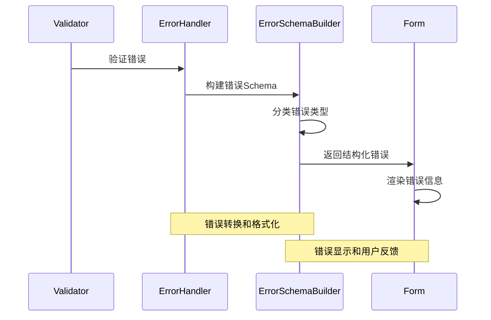

**特点**:
- **错误分类**: 字段错误、全局错误、警告等
- **错误转换**: 将验证器错误转换为表单错误
- **国际化支持**: 支持错误信息翻译
- **用户友好**: 提供清晰的错误提示

## 数据流处理

### 表单状态管理流程

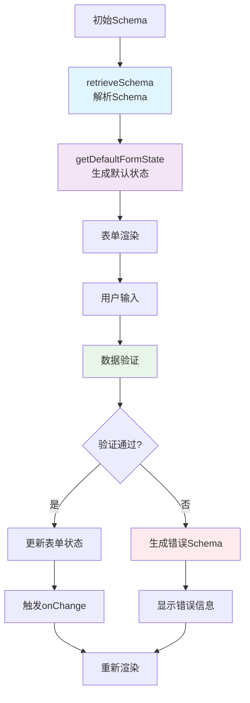

### 数据转换管道

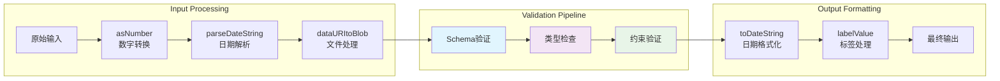

## 实用工具函数分类

### 1. 类型判断工具

```typescript
// 核心类型判断函数
isObject()          // 对象类型判断
isConstant()        // 常量判断
isFixedItems()      // 固定项判断
guessType()         // 类型推断
getSchemaType()     // Schema类型获取
```

### 2. 数据处理工具

```typescript
// 数据操作函数
deepEquals()        // 深度相等比较
mergeObjects()      // 对象合并
orderProperties()   // 属性排序
getChangedFields()  // 变更字段检测
mergeDefaultsWithFormData() // 默认值合并
```

### 3. 枚举处理工具

```typescript
// 枚举操作函数
enumOptionsSelectValue()    // 选择枚举值
enumOptionsDeselectValue()  // 取消选择
enumOptionsIsSelected()     // 判断是否选中
enumOptionsIndexForValue()  // 获取值索引
optionsList()              // 选项列表生成
```

### 4. 日期时间工具

```typescript
// 日期处理函数
parseDateString()   // 日期字符串解析
toDateString()      // 转换为日期字符串
localToUTC()        // 本地时间转UTC
utcToLocal()        // UTC转本地时间
dateRangeOptions()  // 日期范围选项
```

## 扩展性设计

### 1. 验证器插件架构

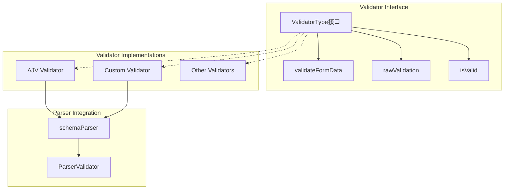

### 2. 国际化扩展

```typescript
// 翻译函数接口
type TranslateString = (
  stringToTranslate: TranslatableString,
  params?: string[]
) => string;

// 支持的可翻译字符串
enum TranslatableString {
  ArrayItemTitle = 'Item',
  MissingItems = 'Missing items definition',
  EmptyArray = 'No items yet...',
  // ... 更多字符串
}
```

## 性能优化策略

### 1. 缓存机制

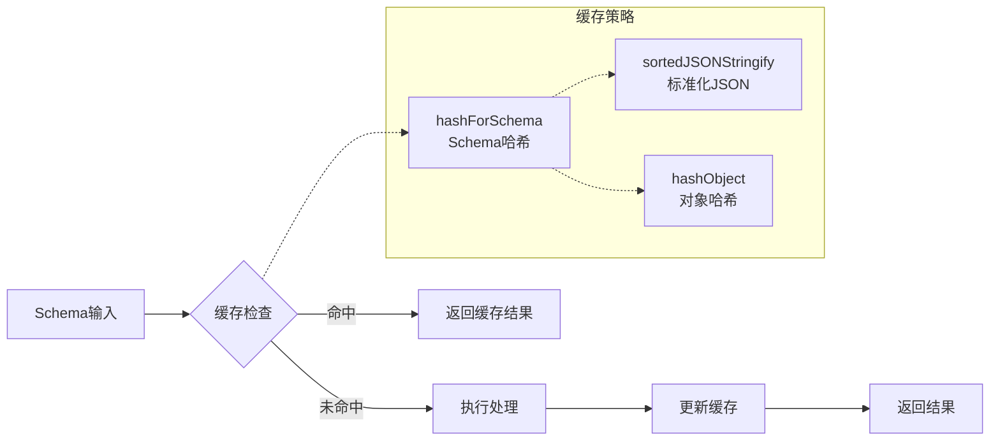

### 2. 惰性计算

- **按需解析**: 只在需要时解析复杂 Schema
- **增量更新**: 只更新变更的字段
- **记忆化**: 缓存昂贵的计算结果

## 错误处理和调试

### 错误分类体系

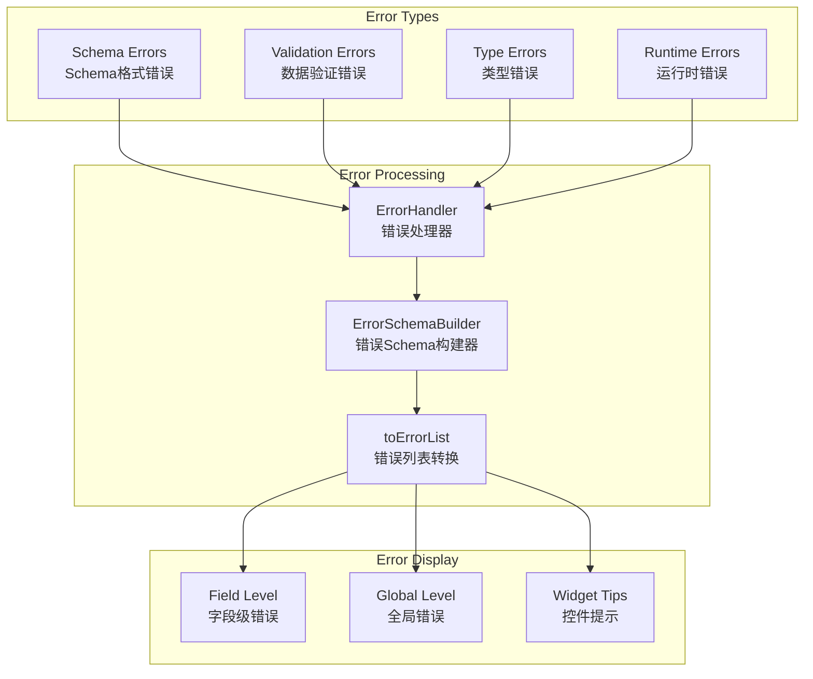

## 类型安全设计

### 泛型类型系统

```typescript
// 核心泛型约束
interface SchemaUtilsType<
  T = any,                           // 表单数据类型
  S extends StrictRJSFSchema = RJSFSchema,  // Schema类型
  F extends FormContextType = any     // 表单上下文类型
> {
  // 类型安全的方法定义
  getDefaultFormState(
    schema: S,
    formData?: T,
    rootSchema?: S
  ): T | T[] | undefined;
}
```

**优势**:
- **编译时检查**: 在编译阶段发现类型错误
- **智能提示**: 提供准确的代码补全
- **重构安全**: 类型变更时自动检查影响范围

## 测试策略

### 单元测试覆盖

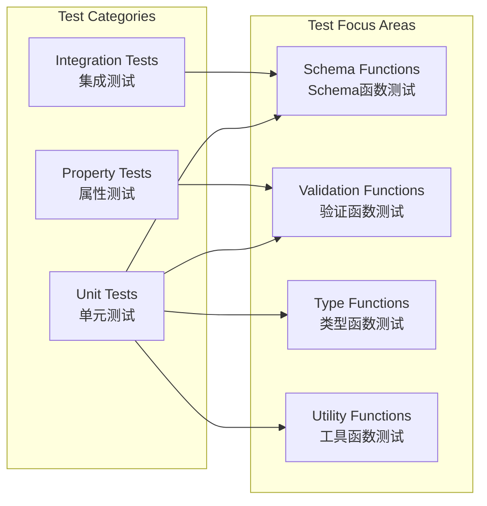

## 总结

RJSF Utils 包体现了以下优秀的架构设计原则:

### 核心优势

1. **模块化设计** - 功能清晰分离，易于维护和扩展
2. **类型安全** - 完整的 TypeScript 类型体系
3. **函数式编程** - 纯函数设计，易于测试和调试
4. **高度可扩展** - 支持自定义验证器、解析器和转换器
5. **性能优化** - 缓存机制和惰性计算
6. **错误友好** - 完善的错误处理和用户反馈机制

### 设计模式应用

- **工厂模式**: createSchemaUtils 创建工具实例
- **策略模式**: 不同验证器的可插拔设计
- **建造者模式**: ErrorSchemaBuilder 构建复杂错误结构
- **适配器模式**: 不同数据格式的转换适配

### 架构影响

这种设计使得 RJSF 能够:
- 支持复杂的 JSON Schema 规范
- 提供一致的开发体验
- 保持高性能和类型安全
- 便于第三方扩展和定制

Utils 包作为整个 RJSF 生态系统的基础，为其他包提供了稳定可靠的工具集，是整个架构成功的关键因素。