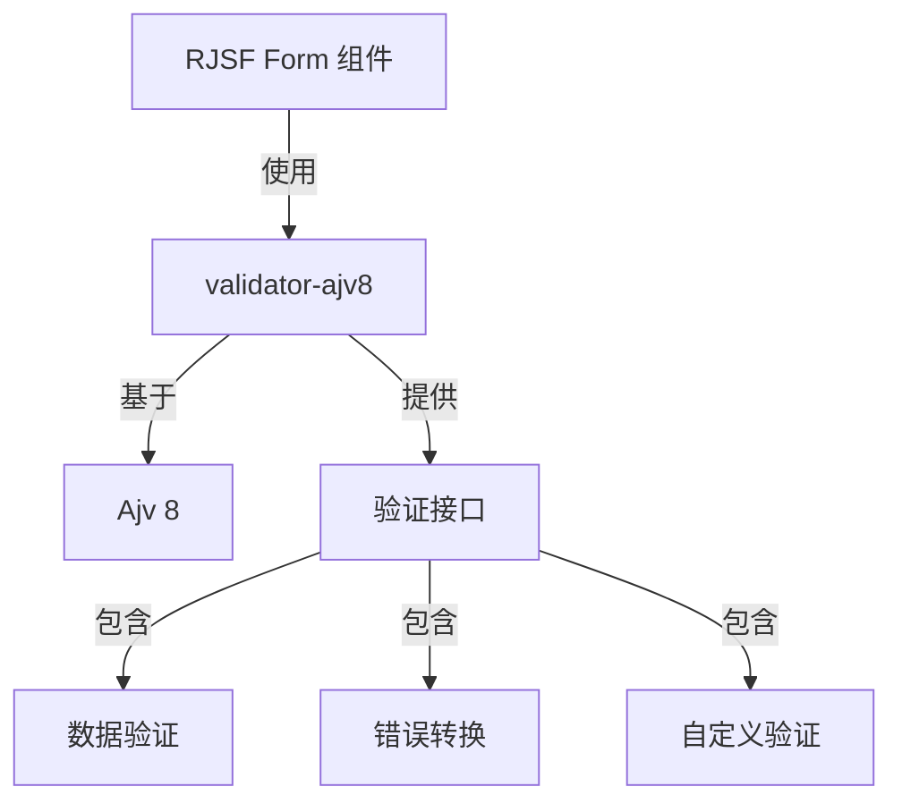
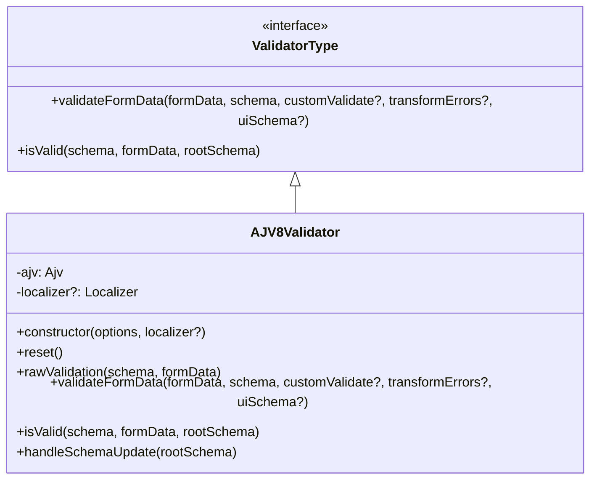
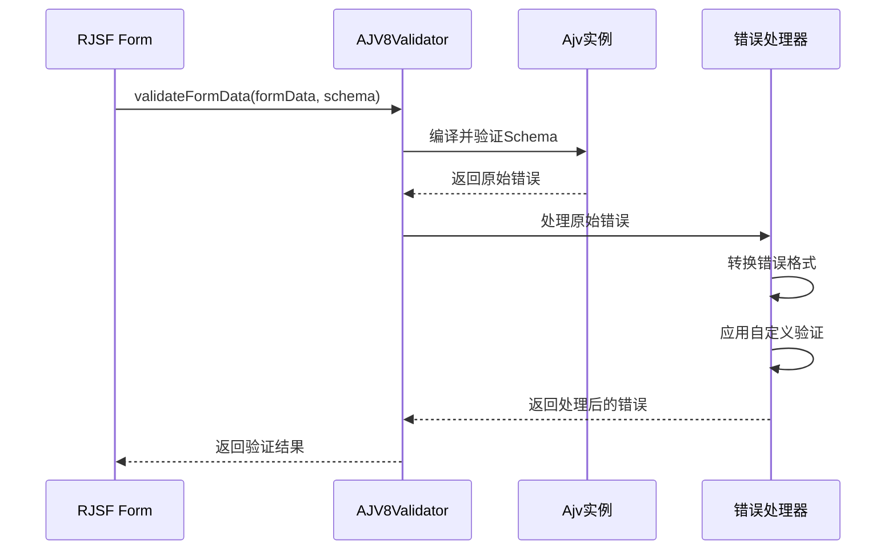
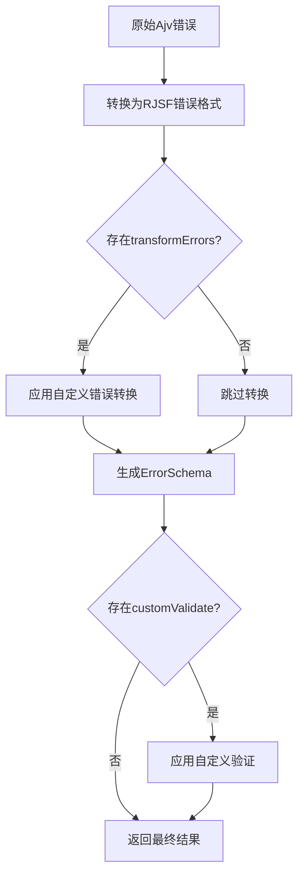
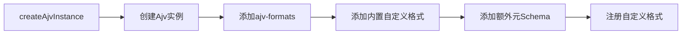
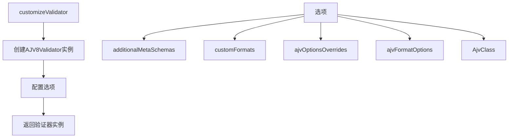
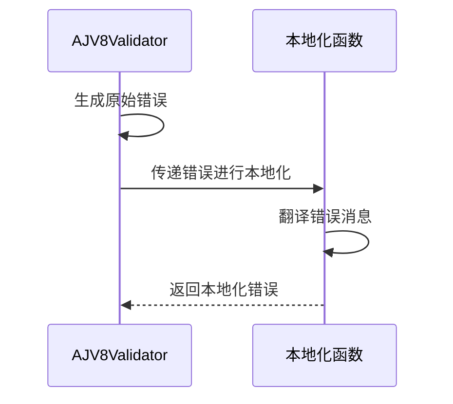
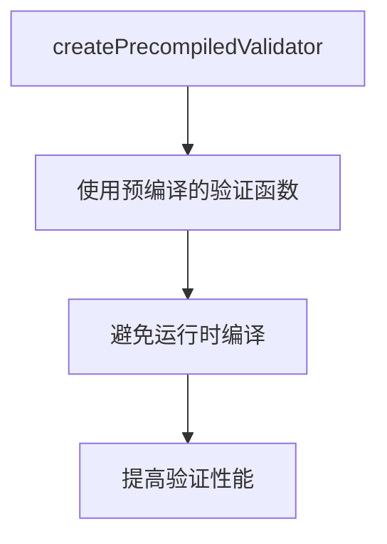
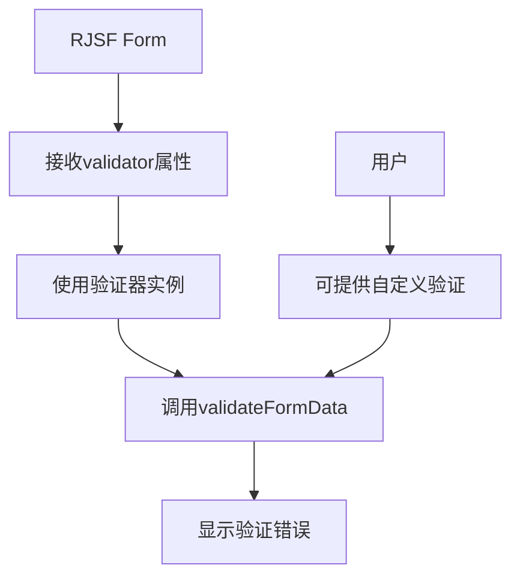
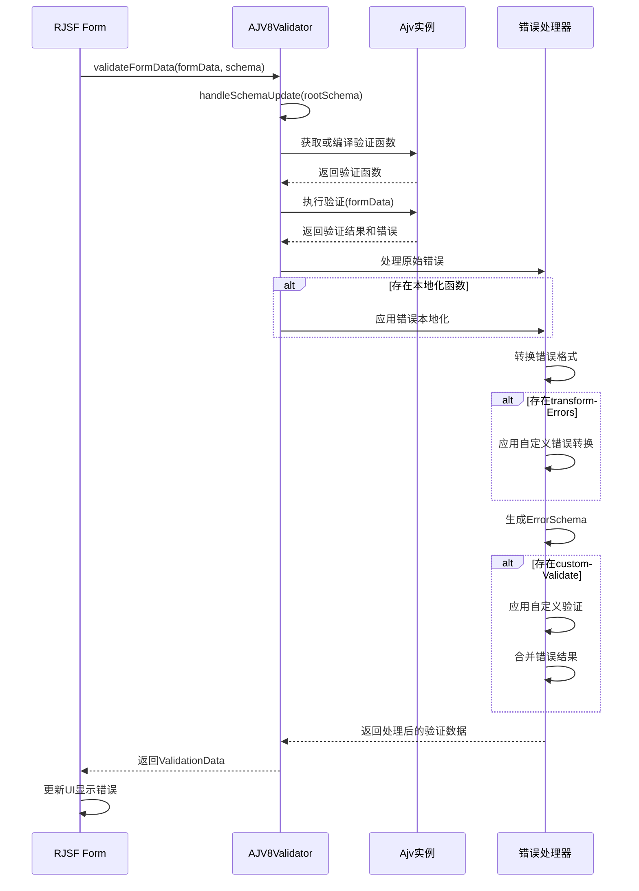

# React JSON Schema Form 验证器（validator-ajv8）解析

## 1. 概述

validator-ajv8 是 React JSON Schema Form (RJSF) 中用于表单验证的核心包，它基于 Ajv（Another JSON Schema Validator）8.x 版本实现了符合 JSON Schema 规范的表单数据验证。该包负责检查表单数据是否符合指定的 JSON Schema 规范，并生成人类可读的错误信息。

## 2. 核心架构设计

validator-ajv8 采用了面向对象的设计模式，通过 `AJV8Validator` 类实现了 RJSF 所需的 `ValidatorType` 接口。这种设计允许 RJSF 以一致的方式调用验证功能，同时隐藏了底层 Ajv 实现的复杂性。

## 3. 主要组件分析

### 3.1 AJV8Validator 类

AJV8Validator 是验证器的核心类，实现了 ValidatorType 接口，提供了以下关键功能：

1. **表单数据验证**：通过 Ajv 验证表单数据是否符合 JSON Schema
2. **错误处理与转换**：将 Ajv 的错误转换为 RJSF 友好的格式
3. **自定义验证支持**：允许通过自定义函数扩展验证逻辑
4. **Schema 缓存管理**：优化性能的 Schema 编译和缓存机制

### 3.2 错误处理流程

validator-ajv8 的一个关键功能是将 Ajv 的错误格式转换为更加用户友好的格式，并支持错误本地化和自定义错误转换。

关键步骤包括：
1. 将 Ajv 的 ErrorObject 数组转换为 RJSF 的 RJSFValidationError 数组
2. 应用可选的 transformErrors 函数进一步自定义错误
3. 将错误转换为层次化的 ErrorSchema 结构
4. 应用可选的 customValidate 函数添加自定义验证逻辑

### 3.3 Ajv 实例创建

validator-ajv8 通过 `createAjvInstance` 函数创建和配置 Ajv 实例，支持：

1. 添加额外的元 Schema
2. 注册自定义格式
3. 配置 Ajv 选项
4. 集成 ajv-formats 插件

默认支持的自定义格式包括：
- `color`: 用于验证颜色值
- `data-url`: 用于验证 Data URL

## 4. 自定义与扩展机制

validator-ajv8 提供了多种自定义和扩展机制：

### 4.1 自定义验证器创建

通过 `customizeValidator` 函数，可以创建定制化的验证器实例：

### 4.2 本地化支持

通过可选的 `localizer` 函数，支持错误消息的国际化和本地化：

### 4.3 预编译验证器

通过 `createPrecompiledValidator` 支持预编译验证函数，提高性能：

## 5. 与 RJSF 的集成

validator-ajv8 与 RJSF 的集成主要通过以下方式实现：

主要集成点包括：

1. **Form 组件**：Form 组件接收 validator 属性，用于验证表单数据
2. **错误显示**：验证结果用于生成错误提示和高亮显示无效字段
3. **自定义验证**：支持通过 customValidate 函数添加业务逻辑验证

## 6. 验证过程详解

完整的验证过程如下：

## 7. 关键性能优化

validator-ajv8 实现了多项性能优化措施：

1. **Schema 缓存**：使用 Ajv 的 schema 缓存机制避免重复编译
2. **增量更新**：只有当 rootSchema 发生变化时才重新编译
3. **预编译支持**：支持使用预编译的验证函数提高性能
4. **延迟验证**：可配置的验证时机，避免不必要的验证

## 8. 总结

validator-ajv8 包是 RJSF 的核心验证引擎，它通过 Ajv 8 提供了强大的 JSON Schema 验证能力。其设计围绕以下几个核心原则：

1. **符合标准**：完全支持 JSON Schema 验证规范
2. **可扩展性**：支持自定义格式、自定义验证和错误转换
3. **性能优化**：通过缓存和预编译提高验证性能
4. **用户体验**：生成友好的错误信息并支持国际化

通过这些特性，validator-ajv8 为 RJSF 提供了强大而灵活的表单验证能力，是整个库的关键组成部分。
