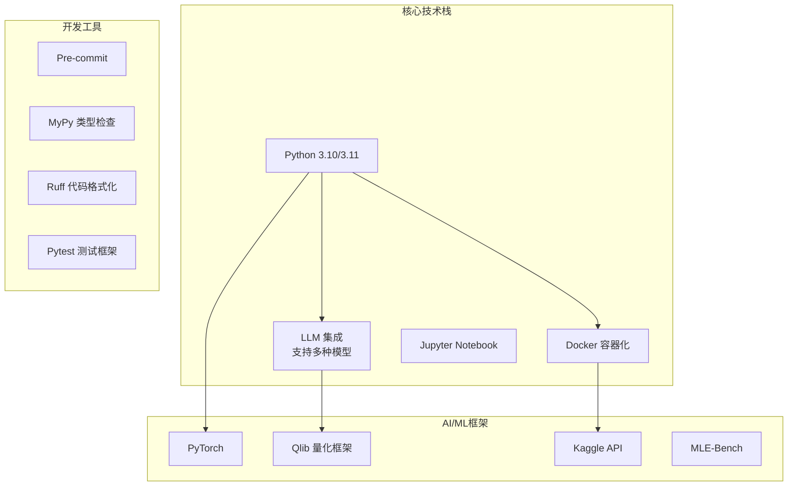
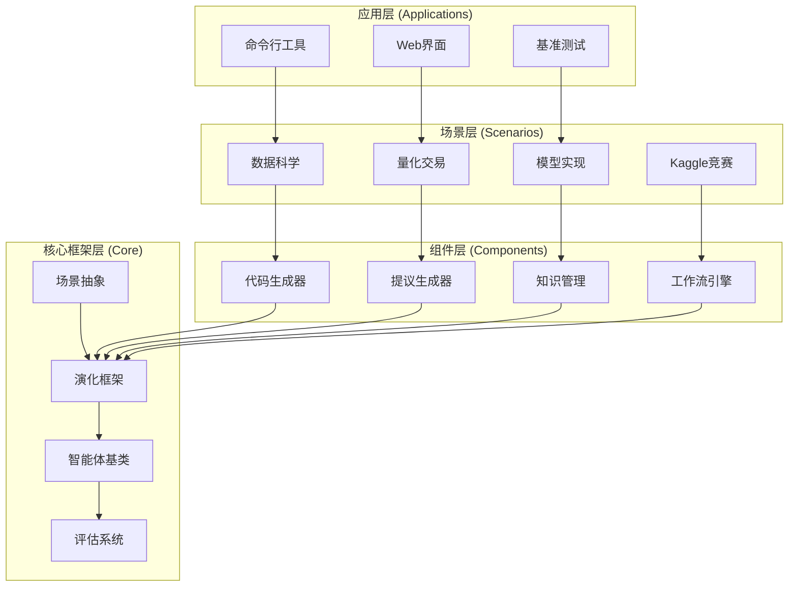
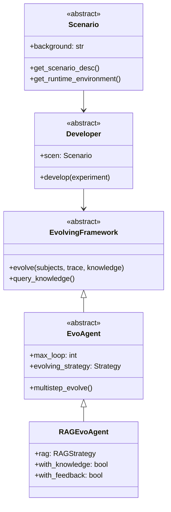
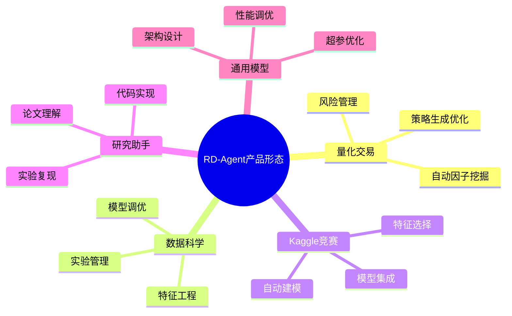

# RD-Agent 项目技术文档总览

## 项目简介

RD-Agent 是由微软亚洲研究院开发的自动化研究开发框架，专注于数据驱动场景下的模型和数据开发流程自动化。项目的核心理念是通过"R"（研究，提出新想法）和"D"（开发，实现想法）两个组件的协同工作，实现工业R&D流程的自动化。

## 技术栈



**核心技术栈特点：**
- **语言**: Python 3.10/3.11，确保现代Python特性支持
- **容器化**: Docker部署，保证环境一致性
- **LLM集成**: 支持OpenAI、Azure OpenAI、DeepSeek等多种大语言模型
- **AI框架**: 基于PyTorch的深度学习支持，集成Qlib量化交易框架

## 系统架构概览



**架构设计核心原则：**
- **分层架构**: Core → Components → Scenarios → Applications，层次清晰
- **抽象与实现分离**: 核心层提供抽象接口，组件层实现具体功能
- **可扩展性**: 支持新场景和组件的插拔式扩展
- **模块解耦**: 各模块间通过明确的接口交互，降低耦合度

## 核心设计模式



**设计模式应用：**
- **策略模式**: 不同场景使用不同的演化策略
- **模板方法**: 定义算法骨架，子类实现具体步骤
- **观察者模式**: 实验结果反馈机制
- **工厂模式**: 动态创建不同类型的组件

## 产品形态与应用场景



## 快速入门

### 环境准备
```bash
# 1. 创建conda环境
conda create -n rdagent python=3.10
conda activate rdagent

# 2. 安装RD-Agent
pip install rdagent

# 3. Docker环境检查
rdagent health_check --no-check-env
```

### 配置示例
```bash
# 配置OpenAI API
cat << EOF > .env
CHAT_MODEL=gpt-4o
EMBEDDING_MODEL=text-embedding-3-small
OPENAI_API_BASE=<your_api_base>
OPENAI_API_KEY=<your_api_key>
EOF
```

### 基本使用
```python
# 数据科学场景示例
from rdagent.scenarios.data_science import DataScienceScenario
from rdagent.app.data_science import run_data_science_loop

scenario = DataScienceScenario()
result = run_data_science_loop(
    competition="titanic",
    max_loops=5
)
```

## 性能与成就

- **MLE-Bench榜首**: 在机器学习工程基准测试中排名第一
- **成本效益**: 量化交易场景下，成本不到10美元实现2倍收益率
- **资源优化**: 相比基准因子库使用70%更少的因子数量
- **多场景支持**: 覆盖数据科学、量化交易、Kaggle竞赛等多个领域

## 文档结构

本技术文档包含以下部分：
1. **项目概览** (当前文档) - 技术栈、架构总览
2. **核心架构文档** - 详细的类图和设计模式分析
3. **组件关系文档** - 组件依赖图和数据流分析
4. **应用场景文档** - 具体场景和用例分析
5. **工作流程文档** - 系统工作流程和状态机分析

---

*最后更新: 2024年10月29日*