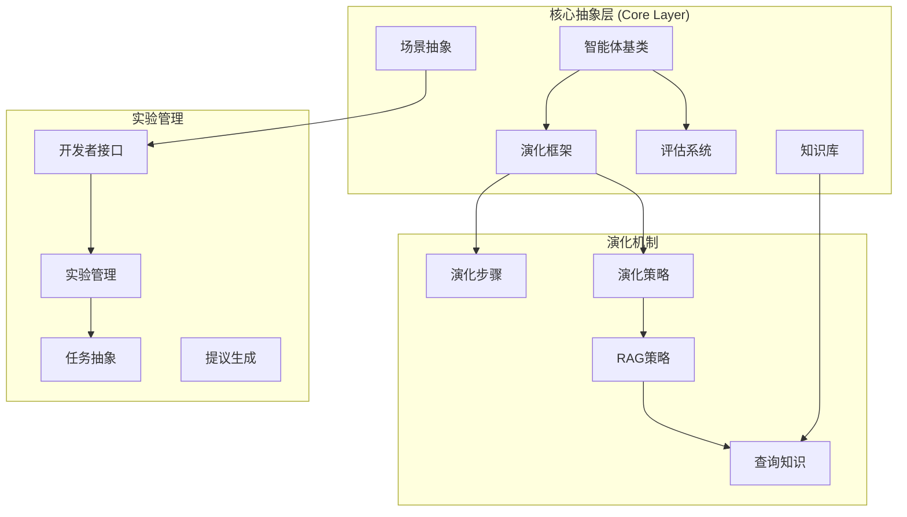
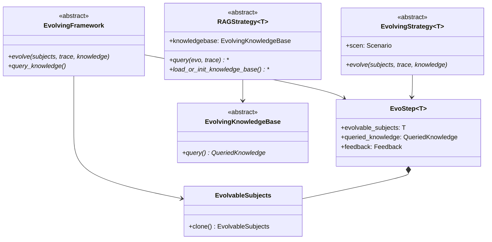
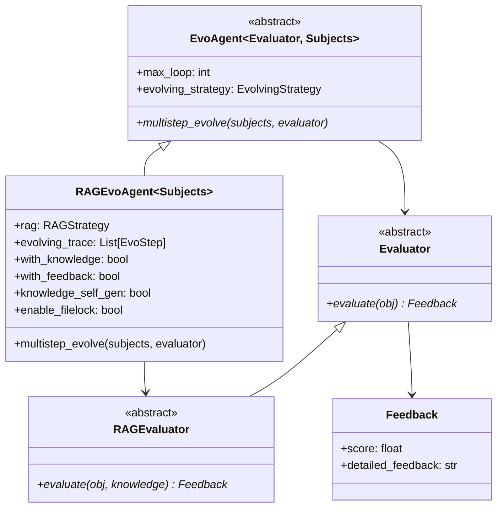
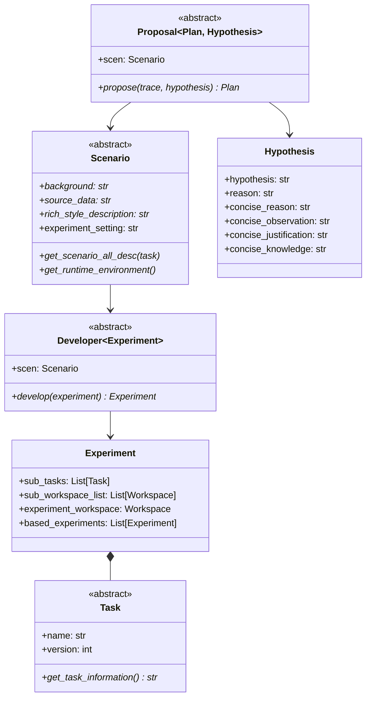
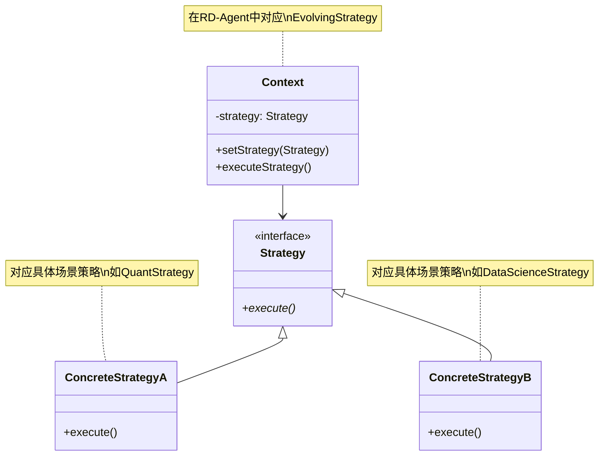
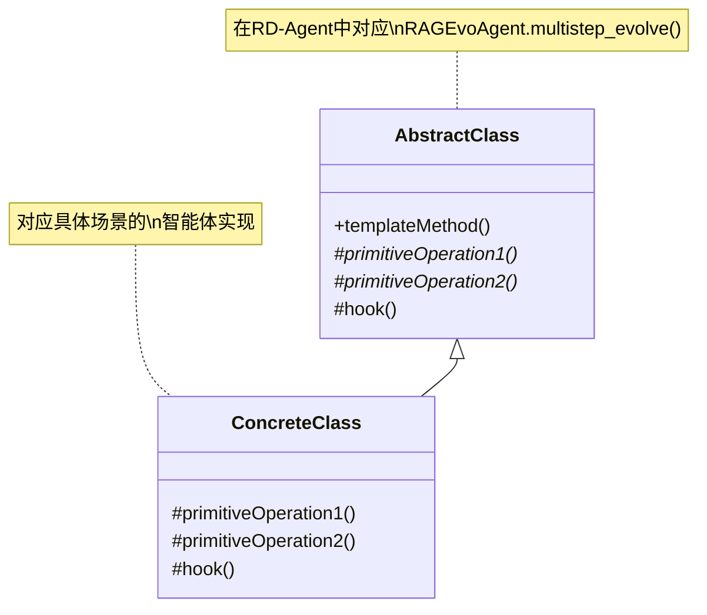
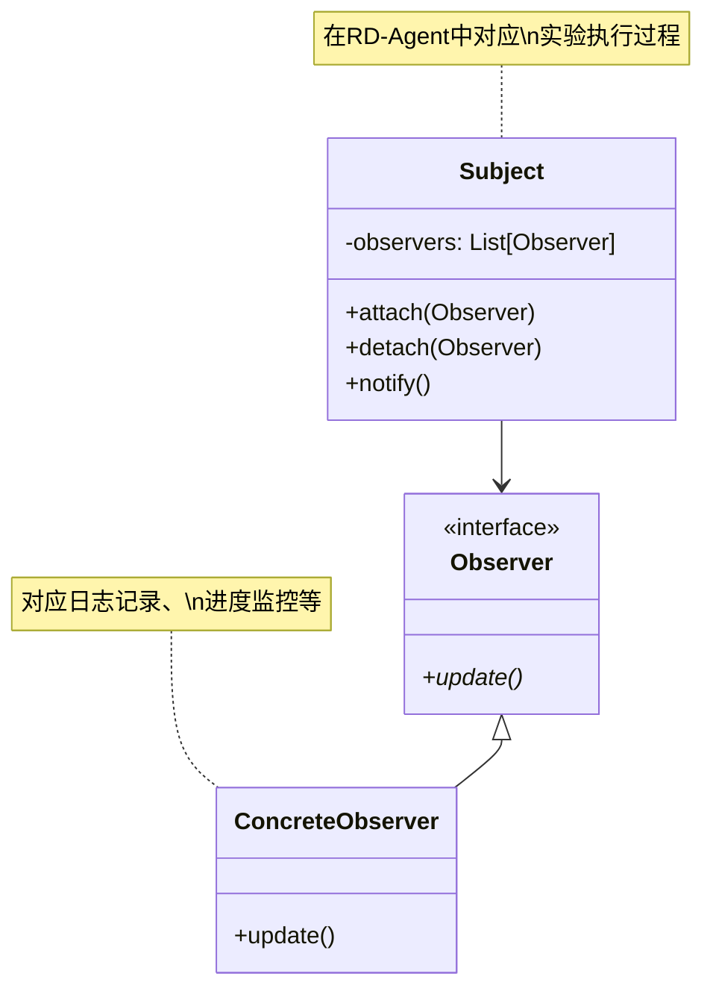
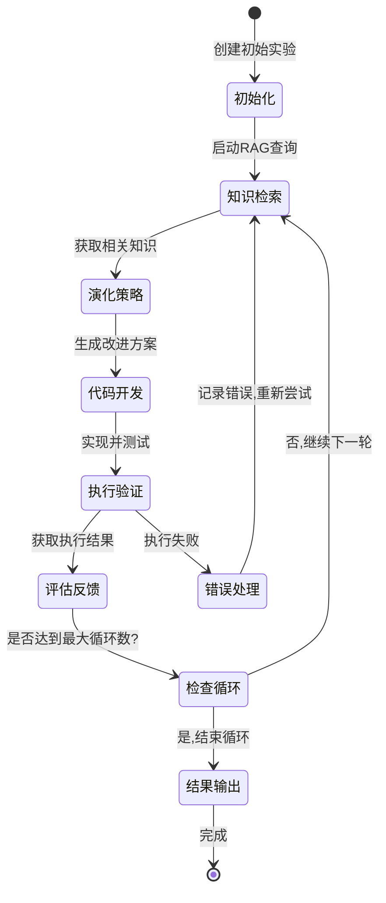

# RD-Agent 核心架构设计

## 总体架构设计

RD-Agent采用分层架构设计，从底层抽象到上层应用逐层构建，确保系统的可扩展性和维护性。

**核心架构特点：**
- **演化驱动**: 基于演化算法的持续改进机制
- **知识增强**: RAG(检索增强生成)模式集成领域知识
- **场景抽象**: 支持多种应用场景的统一抽象
- **反馈循环**: 完整的评估反馈机制

## 核心类设计

### 1. 演化框架类图

**演化框架设计特点：**
- **泛型设计**: 使用TypeVar支持不同类型的演化主体
- **步骤记录**: EvoStep记录每次演化的完整信息
- **知识集成**: RAGStrategy提供知识检索能力
- **策略模式**: 不同场景可使用不同的演化策略

### 2. 智能体架构类图

**智能体架构特点：**
- **多步演化**: 支持迭代式的持续改进
- **知识增强**: RAG模式提供上下文相关的知识支持
- **反馈机制**: 完整的评估和反馈循环
- **并发控制**: 支持文件锁机制防止冲突

### 3. 场景与开发者架构

**场景架构特点：**
- **场景抽象**: 统一不同领域的场景描述接口
- **任务分解**: 将复杂实验分解为可管理的子任务
- **工作空间管理**: 每个实验和任务都有独立的工作空间
- **假设驱动**: 基于科学假设的研究方法

## 设计模式应用

### 1. 策略模式 (Strategy Pattern)

**策略模式在RD-Agent中的应用：**
- **演化策略**: 不同场景使用不同的演化算法
- **评估策略**: 不同任务使用不同的评估方法
- **代码生成策略**: 支持多种代码生成方式

### 2. 模板方法模式 (Template Method Pattern)

**模板方法在RD-Agent中的应用：**
- **多步演化流程**: 定义标准的演化步骤骨架
- **实验执行流程**: 统一的实验执行模板
- **评估流程**: 标准化的评估步骤

### 3. 观察者模式 (Observer Pattern)

**观察者模式在RD-Agent中的应用：**
- **实验监控**: 监控实验执行进度和状态
- **日志记录**: 自动记录关键事件和结果
- **反馈收集**: 收集各阶段的反馈信息

## 核心工作流程

### 演化循环状态机

**工作流程特点：**
- **迭代优化**: 通过多轮循环持续改进
- **知识驱动**: 每轮都会检索相关知识
- **错误恢复**: 具备错误处理和恢复机制
- **反馈学习**: 基于反馈调整后续策略

## 扩展性设计

RD-Agent的核心架构设计充分考虑了扩展性：

1. **插件化架构**: 新场景只需实现核心接口即可集成
2. **策略可替换**: 演化策略、评估策略等都可独立替换
3. **知识库可扩展**: 支持多种知识源的集成
4. **组件松耦合**: 各组件通过接口交互，降低依赖

这种设计使得RD-Agent能够轻松适应新的研究领域和应用场景，同时保持系统的稳定性和可维护性。

---

*该文档详细阐述了RD-Agent的核心架构设计，包括类图、设计模式和工作流程。这些设计确保了系统的可扩展性、可维护性和高性能。*