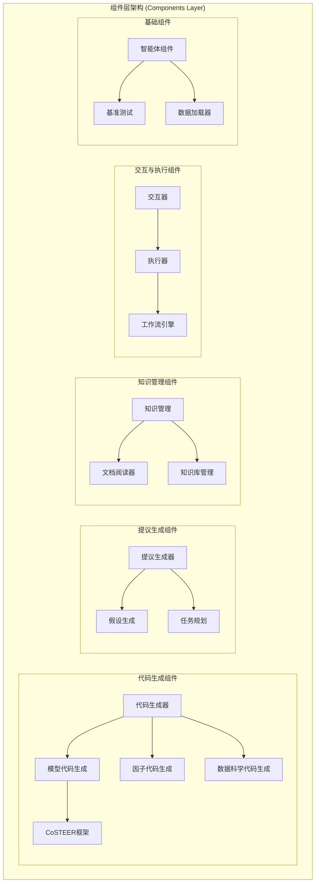
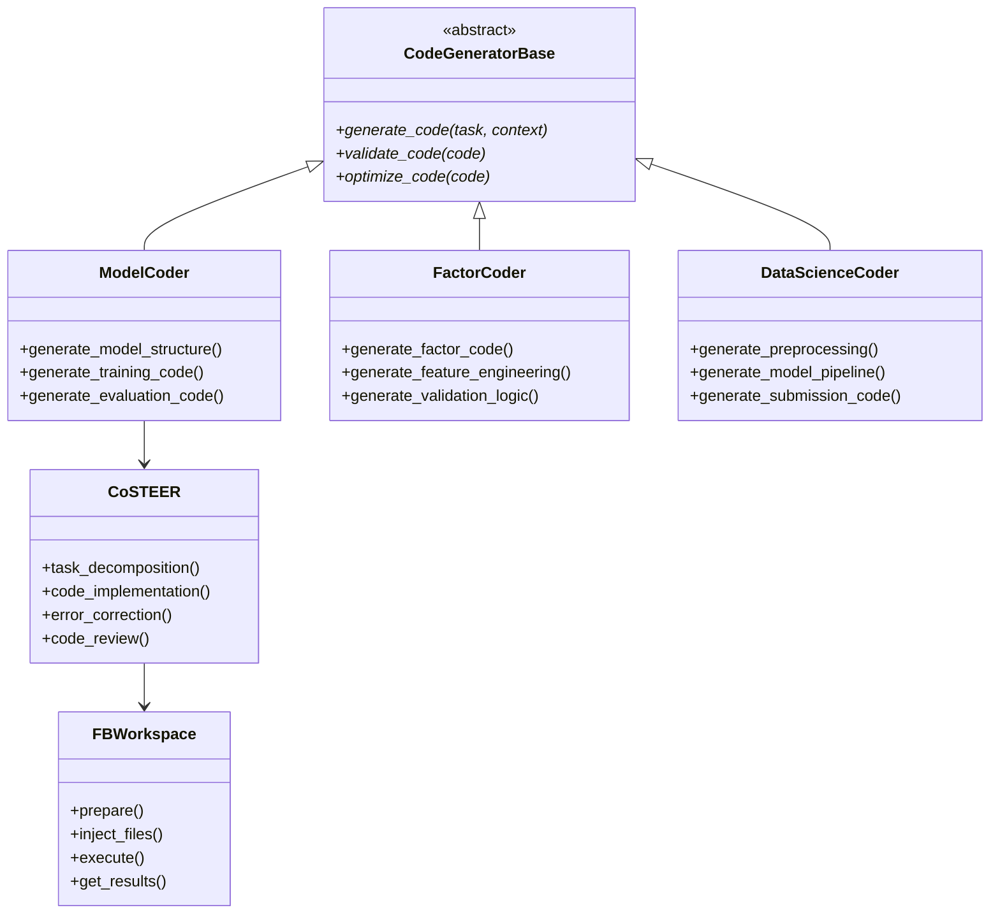
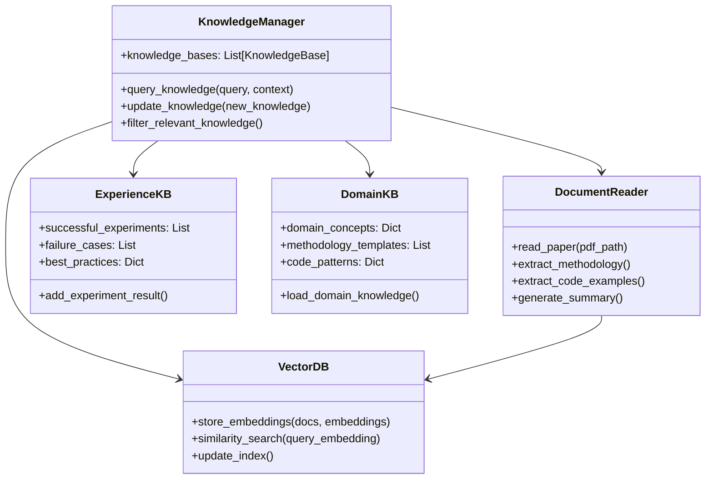
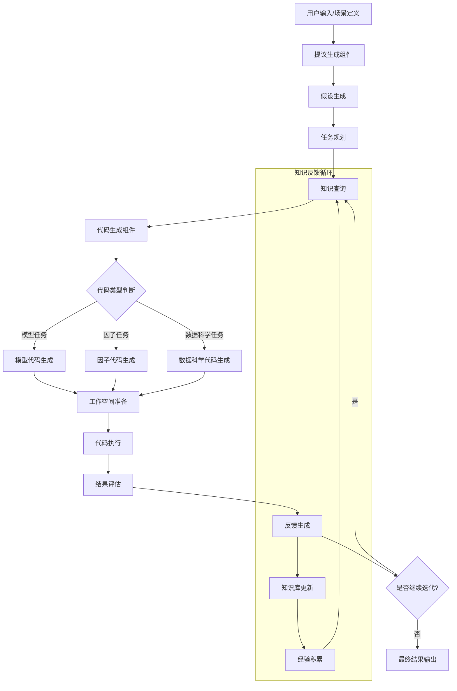
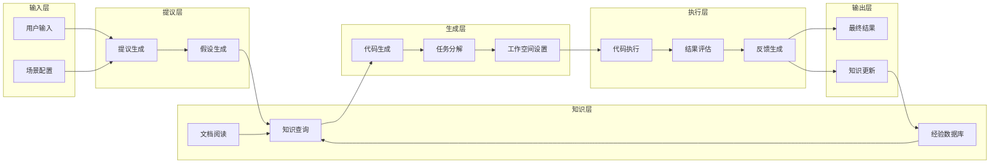
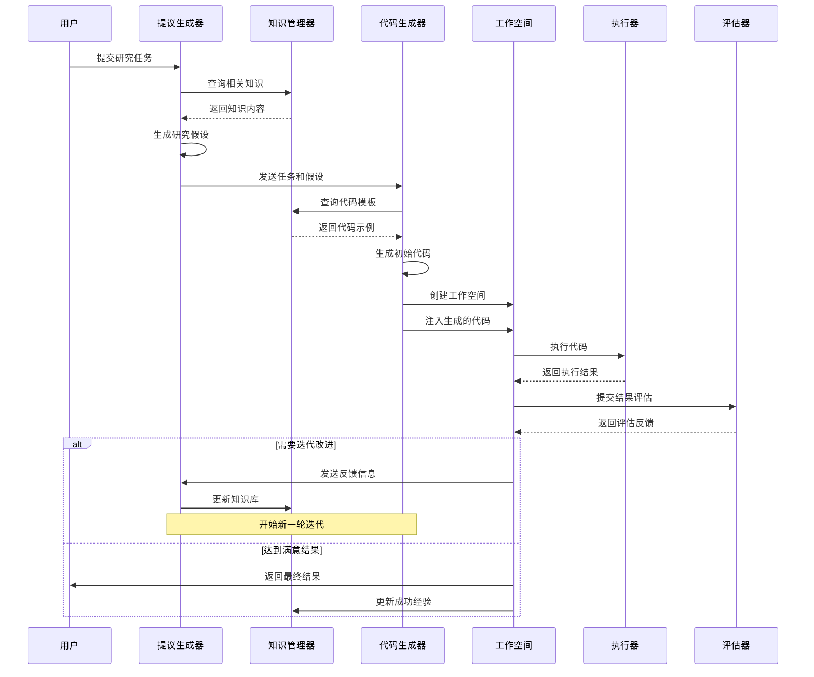
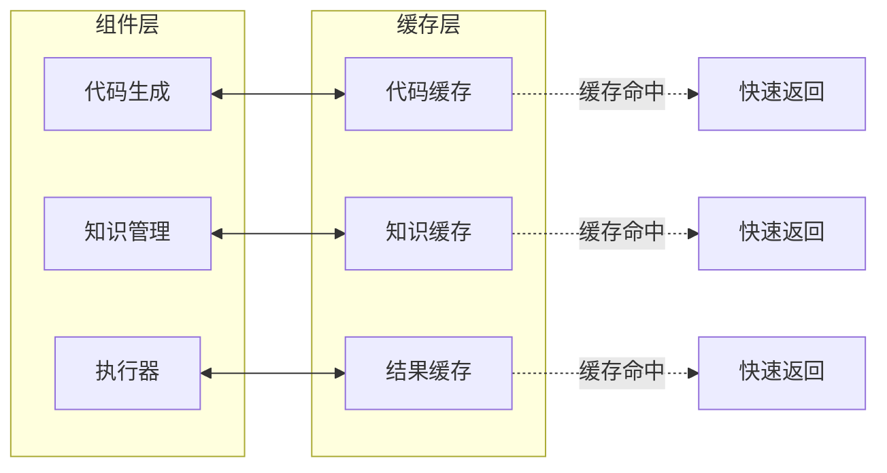

# RD-Agent 组件架构与数据流分析

## 组件层次架构

RD-Agent的组件层位于核心框架层之上，提供了可复用的功能模块，支撑不同场景的应用需求。



**组件架构特点：**
- **专业化分工**: 每个组件专注于特定功能领域
- **可复用性**: 组件可在不同场景间复用
- **模块化设计**: 组件间通过标准接口交互
- **分层抽象**: 从通用组件到专用组件的层次结构

## 核心组件详细分析

### 1. 代码生成组件架构



**代码生成组件特点：**
- **任务特化**: 针对不同任务类型提供专门的代码生成器
- **工作空间管理**: FBWorkspace提供隔离的执行环境
- **错误恢复**: 具备代码错误检测和自动修复能力
- **质量保证**: 包含代码验证和优化机制

### 2. 知识管理组件架构



**知识管理组件特点：**
- **多源知识**: 整合文档、经验、领域知识等多种知识源
- **向量检索**: 基于语义相似度的知识检索
- **经验积累**: 持续积累实验经验和最佳实践
- **动态更新**: 支持知识库的实时更新和扩展

## 组件间数据流分析

### 主要数据流路径



**数据流特点：**
- **闭环设计**: 从输入到输出形成完整的数据闭环
- **知识驱动**: 每个环节都有知识库的支持
- **迭代优化**: 通过反馈循环实现持续改进
- **多路径分发**: 根据任务类型选择不同的处理路径

### 组件依赖关系图



**依赖关系特点：**
- **分层依赖**: 上层组件依赖下层组件的服务
- **横向协作**: 同层组件间存在数据交换和协作
- **反馈更新**: 执行结果会反馈到知识层更新
- **配置驱动**: 场景配置影响整个处理流程

## 关键组件交互序列

### 实验执行时序图



**交互特点：**
- **协作式执行**: 多个组件协同完成复杂任务
- **知识驱动**: 知识管理器贯穿整个执行过程
- **反馈学习**: 执行结果用于更新知识和经验
- **迭代改进**: 支持多轮迭代优化

## 组件扩展性设计

### 插件化架构

```mermaid
graph TB
    subgraph "核心接口层"
        ICodeGenerator[ICodeGenerator接口]
        IKnowledgeManager[IKnowledgeManager接口]
        IExecutor[IExecutor接口]
    end
    
    subgraph "默认实现"
        DefaultCodeGen[默认代码生成器]
        DefaultKM[默认知识管理]
        DefaultExec[默认执行器]
    end
    
    subgraph "扩展实现"
        CustomCodeGen[自定义代码生成器]
        ExternalKM[外部知识管理]
        CloudExec[云端执行器]
    end
    
    subgraph "配置管理"
        ComponentRegistry[组件注册表]
        ConfigManager[配置管理器]
    end
    
    ICodeGenerator <|.. DefaultCodeGen
    ICodeGenerator <|.. CustomCodeGen
    IKnowledgeManager <|.. DefaultKM
    IKnowledgeManager <|.. ExternalKM
    IExecutor <|.. DefaultExec
    IExecutor <|.. CloudExec
    
    ComponentRegistry --> ConfigManager
    ConfigManager --> DefaultCodeGen
    ConfigManager --> DefaultKM
    ConfigManager --> DefaultExec
```

**扩展性特点：**
- **接口标准化**: 所有组件都遵循标准接口规范
- **插件化部署**: 新组件可以通过插件方式集成
- **配置化管理**: 通过配置文件控制组件的选择和参数
- **向后兼容**: 新版本保持对旧接口的兼容性

## 性能优化策略

### 组件级缓存机制



**性能优化特点：**
- **多级缓存**: 在不同组件层面实现缓存机制
- **智能失效**: 基于内容变化的智能缓存失效策略
- **预加载**: 预测性加载常用知识和代码模板
- **并行处理**: 支持组件间的并行执行

RD-Agent的组件架构通过清晰的分层设计、标准化的接口和灵活的扩展机制，为不同应用场景提供了强大而灵活的基础设施支持。

---

*该文档详细分析了RD-Agent的组件架构、数据流路径和组件间的交互关系，为理解系统的内部工作机制提供了全面的视角。*