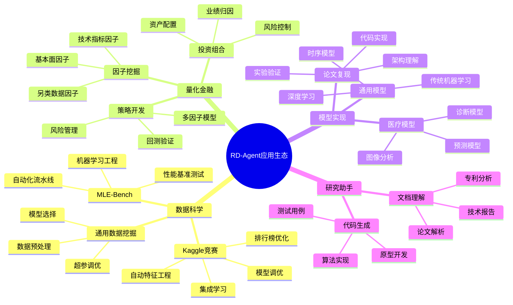
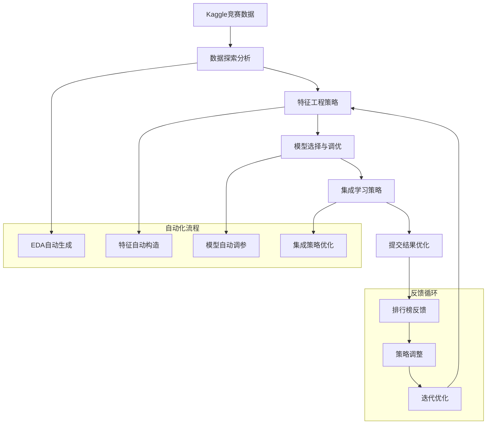
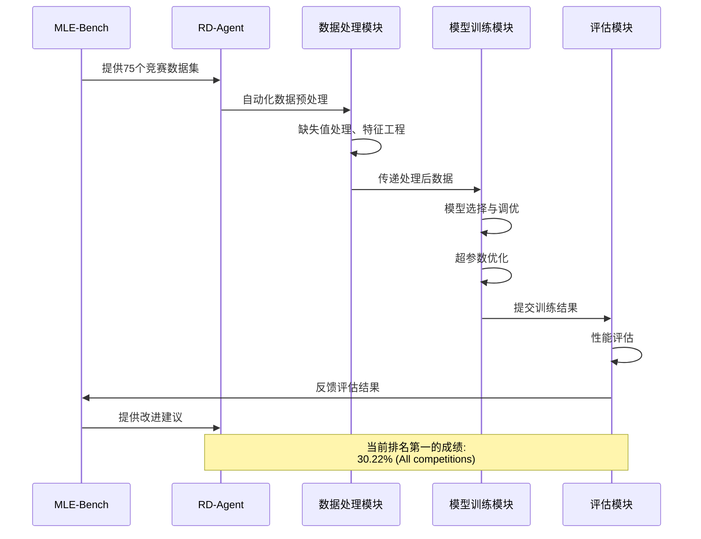
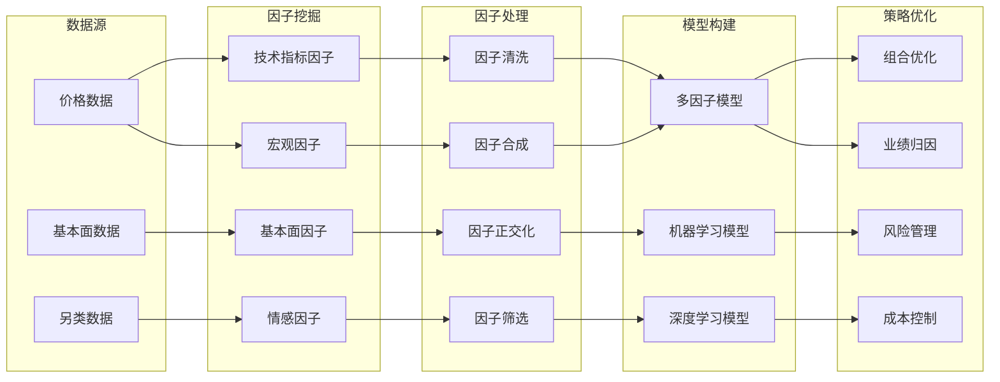
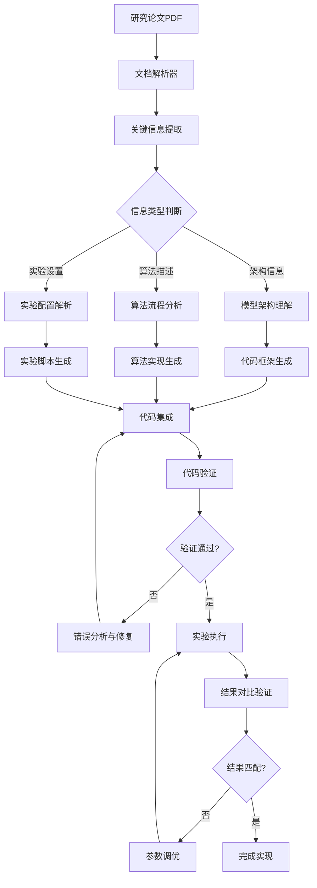
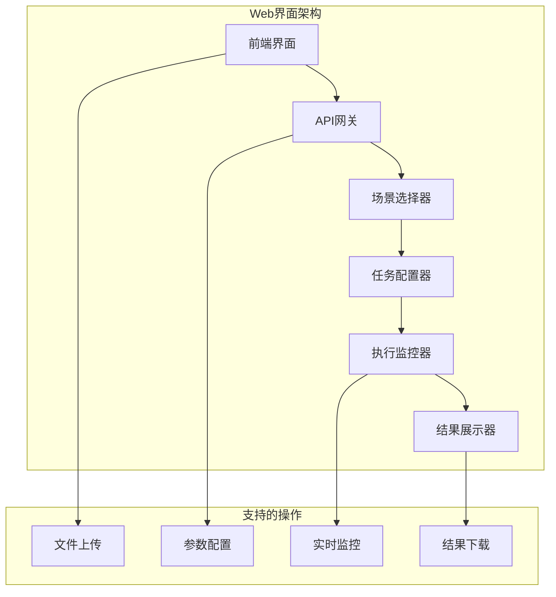
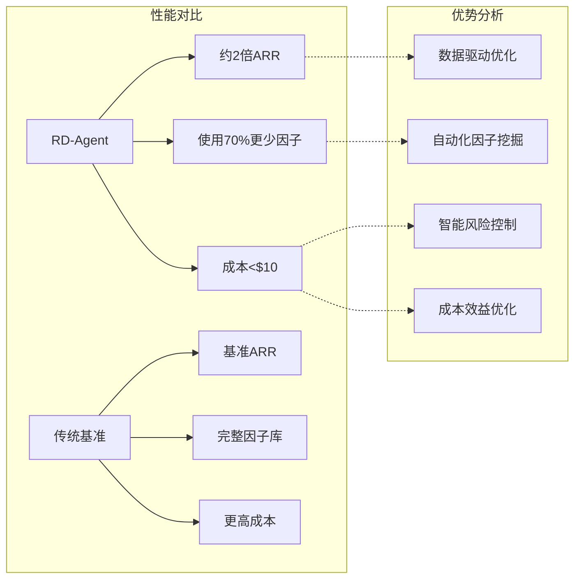
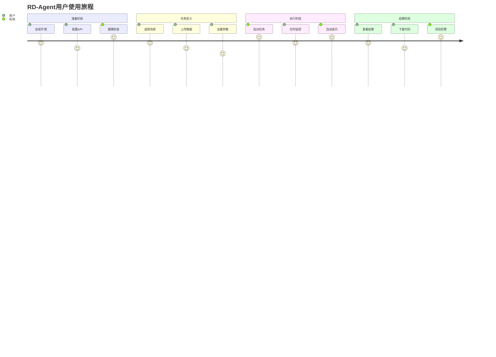
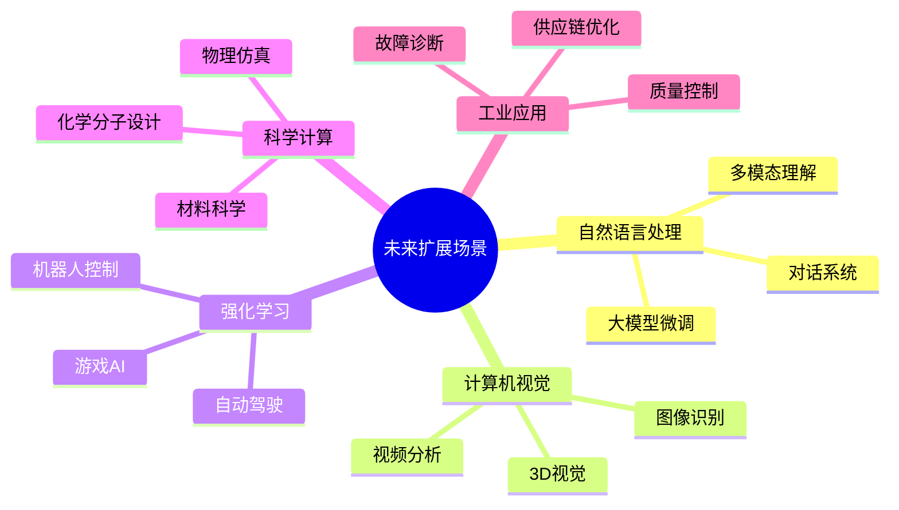

# RD-Agent 应用场景与产品形态

## 应用场景总览

RD-Agent作为一个通用的研发自动化框架，目前已在多个重要领域实现了深度应用，形成了差异化的产品形态。



## 核心应用场景深度分析

### 1. 数据科学场景

#### Kaggle竞赛自动化



**Kaggle场景特点：**
- **竞争导向**: 以排行榜表现为最终目标
- **快速迭代**: 支持快速实验和策略调整
- **集成优化**: 自动化的模型集成和参数调优
- **经验积累**: 从历史竞赛中学习最佳实践

#### MLE-Bench基准测试



**MLE-Bench特点：**
- **标准化评估**: 统一的75个竞赛数据集
- **工程导向**: 注重机器学习工程实践
- **性能领先**: 目前在该基准测试中排名第一
- **可复现性**: 完整的实验记录和结果复现

### 2. 量化金融场景

#### 因子挖掘与策略开发



**量化金融特点：**
- **数据驱动**: 基于多源金融数据的因子挖掘
- **风险控制**: 集成完整的风险管理模块
- **成本效益**: 实现2倍收益率，使用70%更少因子
- **实战验证**: 在真实股票市场中得到验证

### 3. 模型实现场景

#### 从论文到代码的自动化实现



**模型实现特点：**
- **多领域支持**: 涵盖通用模型、医疗模型等多个领域
- **自动化程度高**: 从论文理解到代码实现全程自动化
- **验证机制**: 包含结果验证和参数调优机制
- **可扩展性**: 支持新领域和新模型类型的扩展

## 产品形态分析

### 1. 命令行工具 (CLI)

```bash
# 数据科学场景
rdagent data-science --competition titanic --max-loops 5

# 量化交易场景  
rdagent qlib --factor-mode --start-date 2020-01-01 --end-date 2023-12-31

# 模型实现场景
rdagent model-impl --paper-path ./paper.pdf --model-type transformer

# 健康检查
rdagent health_check --no-check-env
```

### 2. Web界面 (UI)



### 3. API服务

```yaml
场景支持:
  数据科学:
    - competition: 竞赛名称
    - loops: 循环次数
    - duration: 运行时长
  
  金融建模:
    - files: PDF报告文件
    - factor_mode: 因子模式
  
  模型实现:
    - files: 论文PDF或链接
    - model_type: 模型类型
  
  通用配置:
    - max_loops: 最大循环数
    - timeout: 超时设置
    - llm_config: LLM配置
```

## 成功案例与性能指标

### MLE-Bench基准测试成绩

| 智能体 | Low/Lite (%) | Medium (%) | High (%) | All (%) |
|--------|--------------|------------|----------|---------|
| **RD-Agent o3(R)+GPT-4.1(D)** | **51.52 ± 6.9** | **19.3 ± 5.5** | **26.67 ± 0** | **30.22 ± 1.5** |
| RD-Agent o1-preview | 48.18 ± 2.49 | 8.95 ± 2.36 | 18.67 ± 2.98 | 22.4 ± 1.1 |
| AIDE o1-preview | 34.3 ± 2.4 | 8.8 ± 1.1 | 10.0 ± 1.9 | 16.9 ± 1.1 |

### 量化交易性能



## 用户使用流程

### 典型使用场景工作流



## 扩展场景规划

### 新兴应用领域



RD-Agent通过其灵活的架构设计和强大的自动化能力，已经在多个重要领域实现了成功应用，并持续向更多新兴领域扩展，为自动化研发开辟了新的可能性。

---

*该文档全面分析了RD-Agent在不同应用场景中的产品形态、成功案例和未来发展方向，展示了其作为通用研发自动化平台的强大潜力。*