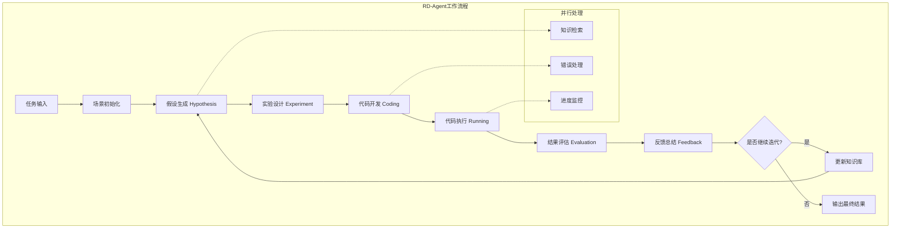
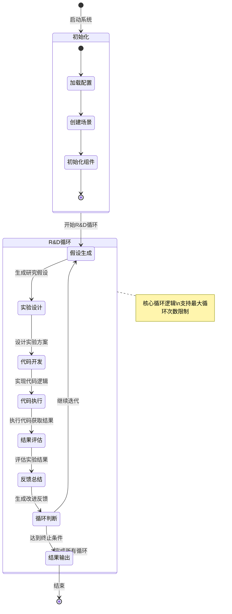
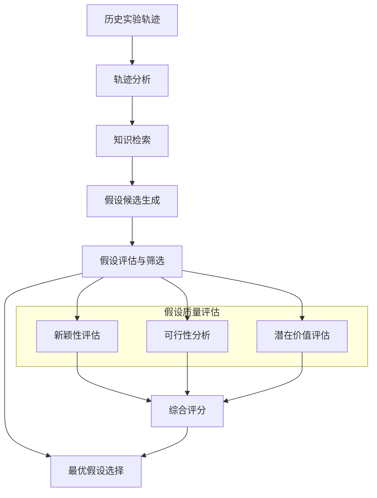
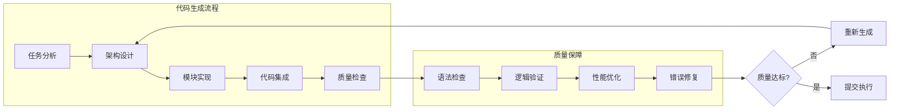
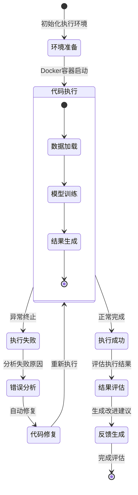
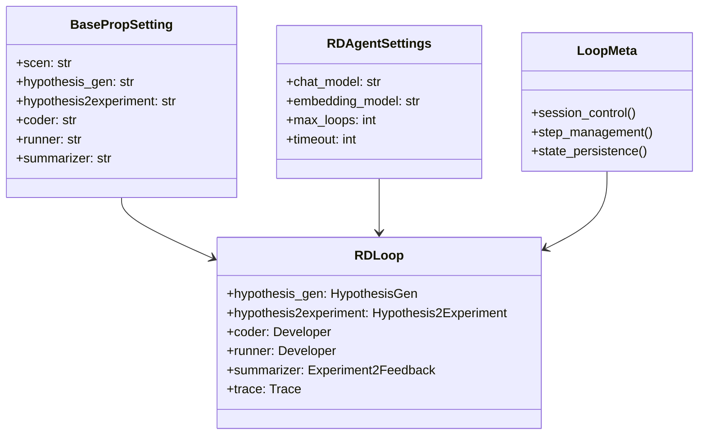
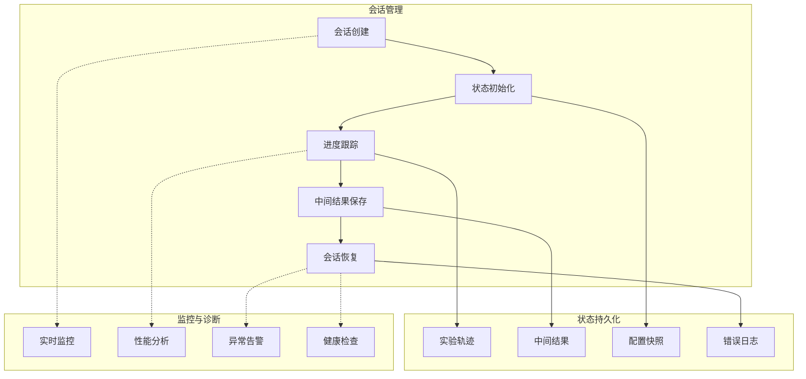
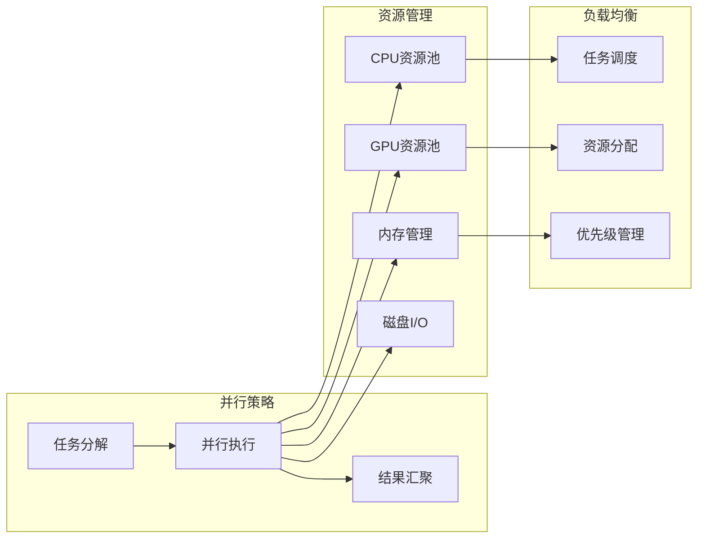
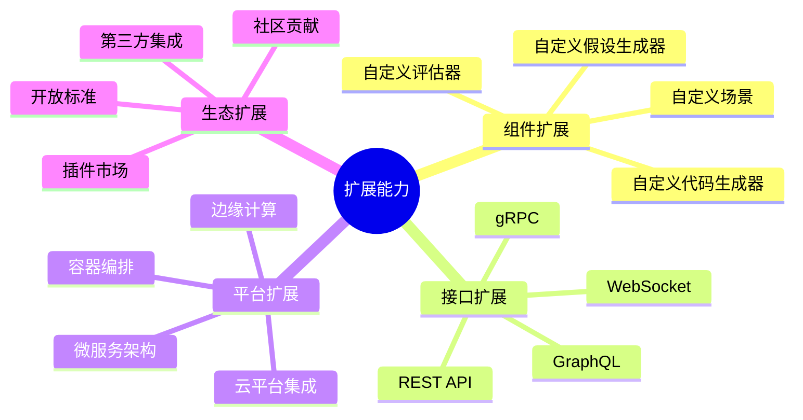

# RD-Agent 系统工作流程与状态管理

## 系统工作流程总览

RD-Agent的核心工作流程基于"研究-开发"循环（R&D Loop），通过假设生成、实验设计、代码实现、执行评估等步骤形成完整的自动化研发闭环。



**工作流程特点：**
- **闭环设计**: 从假设到反馈形成完整闭环
- **迭代优化**: 支持多轮迭代持续改进
- **知识驱动**: 每个环节都有知识支持
- **错误恢复**: 具备完善的错误处理机制

## 核心状态机设计

### RD-Loop状态转换



**状态机特点：**
- **状态清晰**: 每个状态都有明确的职责和输出
- **转换条件**: 基于评估结果和循环次数的智能转换
- **错误恢复**: 每个状态都支持错误处理和重试
- **可监控**: 状态转换过程完全可视化监控

### 详细工作流程时序图

```mermaid
sequenceDiagram
    participant U as 用户
    participant L as RD-Loop主控制器
    participant H as 假设生成器
    participant E as 实验设计器
    participant C as 代码开发器
    participant R as 代码执行器
    participant S as 结果评估器
    participant K as 知识库
    
    U->>L: 提交研究任务
    L->>L: 初始化场景和组件
    
    loop R&D循环 (最大循环次数)
        L->>H: 请求生成假设
        H->>K: 查询相关知识
        K-->>H: 返回知识内容
        H->>H: 生成研究假设
        H-->>L: 返回假设
        
        L->>E: 基于假设设计实验
        E->>E: 分解实验任务
        E-->>L: 返回实验方案
        
        L->>C: 开发实验代码
        C->>K: 查询代码模板
        K-->>C: 返回代码示例
        C->>C: 生成实现代码
        C-->>L: 返回代码实现
        
        L->>R: 执行实验代码
        R->>R: 运行代码获取结果
        R-->>L: 返回执行结果
        
        L->>S: 评估实验结果
        S->>S: 分析结果质量
        S-->>L: 返回评估反馈
        
        alt 需要继续迭代
            L->>K: 更新知识库
            K-->>L: 确认更新
            Note over L: 准备下一轮迭代
        else 达到终止条件
            L->>U: 返回最终结果
            break 结束循环
        end
    end
```

**时序特点：**
- **组件协调**: 多个组件有序协作完成复杂任务
- **知识集成**: 知识库贯穿整个执行过程
- **反馈学习**: 每轮结果都会更新知识库
- **智能终止**: 基于多种条件的智能终止机制

## 关键工作流程详解

### 1. 假设生成流程



**假设生成特点：**
- **历史驱动**: 基于历史实验轨迹生成新假设
- **知识增强**: 利用领域知识提升假设质量
- **多维评估**: 从新颖性、可行性、价值等多维度评估
- **智能筛选**: 自动选择最有潜力的假设

### 2. 代码开发流程



**代码开发特点：**
- **任务驱动**: 根据实验任务自动生成相应代码
- **模块化设计**: 支持复杂系统的模块化实现
- **质量保证**: 多层次的代码质量检查机制
- **自动修复**: 具备错误检测和自动修复能力

### 3. 执行与评估流程



**执行评估特点：**
- **容器化执行**: 基于Docker的隔离执行环境
- **错误恢复**: 自动错误检测和修复机制
- **多维评估**: 从准确性、效率等多个维度评估结果
- **反馈生成**: 自动生成针对性的改进建议

## 系统配置与管理

### 配置管理架构



**配置管理特点：**
- **分层配置**: 系统级和场景级的分层配置管理
- **动态加载**: 支持运行时动态加载和切换配置
- **类型安全**: 基于Pydantic的类型安全配置验证
- **扩展友好**: 支持自定义配置项和扩展

### 会话与状态管理



**状态管理特点：**
- **会话持久化**: 支持长时间运行任务的状态保存
- **断点续传**: 支持从任意断点恢复执行
- **全程监控**: 实时监控执行状态和性能指标
- **异常处理**: 完善的异常检测和恢复机制

## 性能优化与扩展

### 并行执行优化



**性能优化特点：**
- **任务并行**: 支持多任务并行执行提升效率
- **资源优化**: 智能的资源分配和管理策略
- **负载均衡**: 动态负载均衡确保资源最优利用
- **弹性扩展**: 支持根据负载动态扩展资源

### 扩展能力设计



RD-Agent的工作流程设计充分体现了现代软件系统的最佳实践，通过清晰的状态管理、完善的错误处理和灵活的扩展机制，为自动化研发提供了可靠的基础平台。

---

*该文档详细阐述了RD-Agent的核心工作流程、状态管理机制和系统扩展能力，为理解和使用该系统提供了完整的技术参考。*