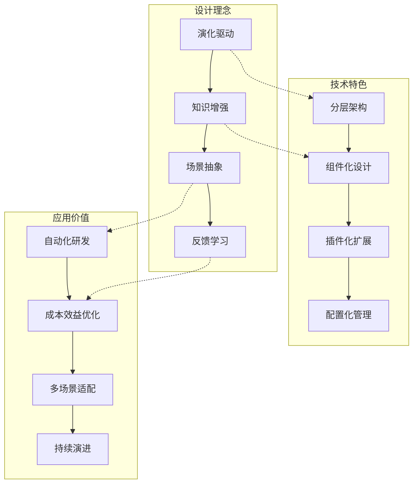

# RD-Agent 技术文档汇总

本文档集全面分析了微软亚洲研究院开发的RD-Agent自动化研发框架，从多个维度深入解析了其技术架构、组件设计和应用实践。

## 📚 文档结构

### [01-项目概览](./01-项目概览.md)
**核心内容：** 项目简介、技术栈、系统架构概览、设计模式、产品形态、快速入门
- 🎯 **重点关注：** RD-Agent的"R&D"双组件协同机制
- 📊 **关键图表：** 技术栈架构图、系统分层架构图
- 🏆 **成就亮点：** MLE-Bench榜首、量化交易2倍收益率

### [02-核心架构设计](./02-核心架构设计.md)
**核心内容：** 分层架构、核心类设计、设计模式应用、工作流程、扩展性设计
- 🔧 **技术重点：** 演化框架、智能体架构、场景抽象
- 📋 **设计模式：** 策略模式、模板方法、观察者模式
- 🔄 **关键流程：** 演化循环状态机、反馈学习机制

### [03-组件架构与数据流](./03-组件架构与数据流.md)
**核心内容：** 组件层次架构、数据流分析、组件交互、扩展性设计
- 🧩 **组件分类：** 代码生成、知识管理、交互执行、基础组件
- 🔄 **数据流路径：** 从输入到输出的完整数据闭环
- ⚡ **性能优化：** 多级缓存、并行处理、智能调度

### [04-应用场景与产品形态](./04-应用场景与产品形态.md)
**核心内容：** 应用场景总览、深度分析、产品形态、成功案例、扩展规划
- 🎯 **主要场景：** 数据科学、量化金融、模型实现、研究助手
- 📈 **性能指标：** MLE-Bench 30.22%、量化交易2倍ARR
- 🔮 **未来规划：** NLP、CV、强化学习、科学计算等新兴领域

### [05-系统工作流程与状态管理](./05-系统工作流程与状态管理.md)
**核心内容：** R&D循环、状态机设计、工作流程详解、配置管理、性能优化
- 🔄 **核心循环：** 假设→实验→开发→执行→评估→反馈
- 📊 **状态管理：** 会话持久化、断点续传、实时监控
- 🚀 **扩展能力：** 组件扩展、接口扩展、平台扩展

## 🔍 技术要点总结

### 架构设计精髓


### 核心技术优势

1. **演化驱动的研发模式**
   - 基于科学假设的研究方法
   - 多轮迭代的持续改进机制
   - 知识积累与经验学习

2. **模块化可扩展架构**
   - 清晰的分层设计
   - 标准化的组件接口
   - 灵活的插件机制

3. **智能化自动处理**
   - 从文档理解到代码生成
   - 自动错误检测与修复
   - 智能参数调优与策略选择

4. **多场景深度应用**
   - 数据科学：MLE-Bench排名第一
   - 量化交易：2倍收益率，70%更少因子
   - 模型实现：从论文到代码的全自动化

## 📊 关键性能指标

| 指标类别 | 具体指标 | 性能表现 |
|---------|---------|---------|
| **基准测试** | MLE-Bench All | **30.22% ± 1.5%** (第一名) |
| **量化交易** | 年化收益率 | **约2倍** 基准表现 |
| **资源效率** | 因子使用量 | 减少 **70%** 因子数量 |
| **成本控制** | 单次成本 | **< $10** 美元 |
| **技术支持** | LLM模型 | 支持 **多种** 主流模型 |

## 🛠️ 核心设计模式

### 1. 策略模式 (Strategy Pattern)
- **应用场景**: 不同场景的演化策略、评估策略
- **核心价值**: 算法与实现解耦，支持动态切换

### 2. 模板方法模式 (Template Method)
- **应用场景**: 多步演化流程、实验执行流程
- **核心价值**: 定义算法骨架，子类实现具体步骤

### 3. 观察者模式 (Observer Pattern)
- **应用场景**: 实验监控、日志记录、反馈收集
- **核心价值**: 松耦合的事件通知机制

## 🔧 技术栈特点

```yaml
核心技术:
  语言: Python 3.10/3.11
  容器: Docker (必需)
  AI框架: PyTorch, Qlib
  
LLM集成:
  支持模型: OpenAI, Azure OpenAI, DeepSeek
  后端框架: LiteLLM (默认)
  接口标准: ChatCompletion, Embedding
  
开发工具:
  代码质量: Pre-commit, MyPy, Ruff
  测试框架: Pytest
  文档系统: Sphinx, ReadTheDocs
```

## 🚀 快速上手指南

### 环境准备
```bash
# 1. 环境创建
conda create -n rdagent python=3.10
conda activate rdagent

# 2. 安装RD-Agent
pip install rdagent

# 3. 环境检查
rdagent health_check --no-check-env
```

### 配置示例
```bash
# 配置LLM API
cat << EOF > .env
CHAT_MODEL=gpt-4o
EMBEDDING_MODEL=text-embedding-3-small
OPENAI_API_KEY=your_api_key
EOF
```

### 典型用例
```bash
# 数据科学场景
rdagent data-science --competition titanic

# 量化交易场景
rdagent qlib --factor-mode

# 模型实现场景
rdagent model-impl --paper-path paper.pdf
```

## 🎯 适用场景推荐

### 高度推荐场景
- ✅ **Kaggle竞赛**: 自动化特征工程和模型调优
- ✅ **量化研究**: 因子挖掘和策略开发
- ✅ **论文复现**: 从PDF到代码的自动实现
- ✅ **数据挖掘**: 端到端的数据科学流水线

### 扩展潜力场景
- 🔄 **NLP任务**: 大模型微调和多模态理解
- 🔄 **计算机视觉**: 图像识别和视频分析
- 🔄 **强化学习**: 游戏AI和机器人控制
- 🔄 **科学计算**: 物理仿真和材料设计

## 📈 发展趋势与展望

RD-Agent作为自动化研发的先锋框架，正在引领以下技术趋势：

1. **AI驱动的研发自动化**: 从假设生成到实验验证的全流程自动化
2. **知识增强的智能系统**: 结合领域知识和经验学习的智能决策
3. **多模态研究能力**: 支持文本、代码、数据的多模态理解和生成
4. **可解释的研发过程**: 提供完整的研发轨迹和决策依据

---

## 🤝 社区与支持

- **官方文档**: [ReadTheDocs](https://rdagent.readthedocs.io/)
- **源码仓库**: [GitHub](https://github.com/microsoft/RD-Agent)
- **在线演示**: [Live Demo](https://rdagent.azurewebsites.net/)
- **技术报告**: [Tech Report](https://aka.ms/RD-Agent-Tech-Report)

*本文档集深入分析了RD-Agent的技术架构和应用实践，为理解和使用这一先进的自动化研发框架提供了全面的技术参考。*

---

**最后更新**: 2024年10月29日