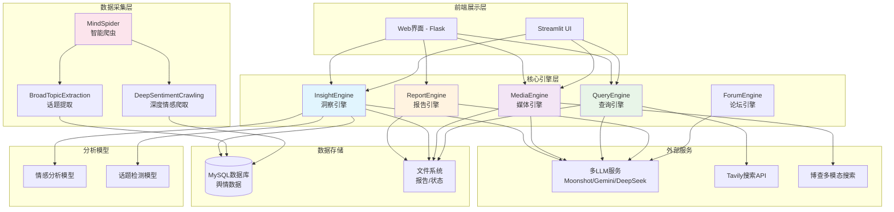
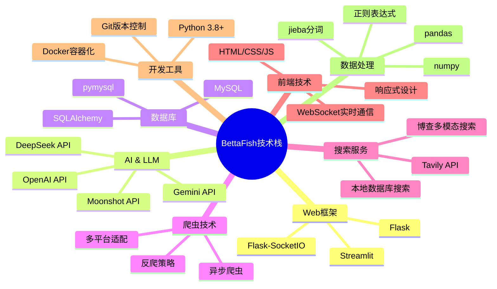
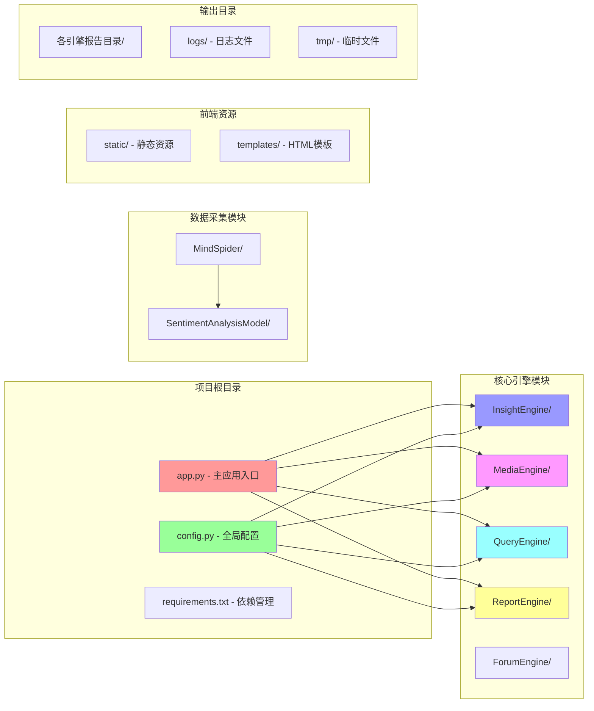
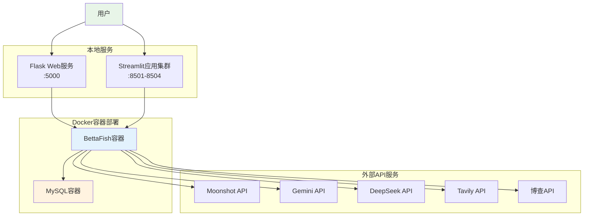

# BettaFish 项目架构概览

## 项目简介

BettaFish是一个基于多智能体（Multi-Agent）架构的舆情分析平台，集成了数据爬取、多维度搜索、情感分析和报告生成等功能。项目采用微服务架构，通过多个专业化的Engine模块协同工作，提供全面的舆情监控和分析服务。

## 系统架构图

**系统架构说明：**
该架构图展示了BettaFish项目的分层设计。前端层提供用户交互界面，核心引擎层包含5个专业化的智能体模块，分别处理不同的业务场景。数据采集层负责从各种平台获取舆情数据，外部服务层集成多个AI和搜索服务，数据存储层管理结构化数据和文件，分析模型层提供AI能力支持。各层之间通过清晰的接口进行协作。

## 技术栈

**技术栈说明：**
该技术栈图以思维导图形式展示了项目使用的各种技术。Web框架层采用Flask作为后端服务，Streamlit提供交互式界面。AI层集成了多个大语言模型API，实现多样化的智能分析能力。数据层使用MySQL存储结构化数据。爬虫技术支持多平台数据采集，搜索服务提供多元化的信息检索能力。

## 核心模块概述

### 1. InsightEngine（洞察引擎）
- **功能**：基于本地数据库的深度洞察分析
- **特点**：智能热度计算、多维度搜索、情感分析
- **数据源**：本地MySQL舆情数据库

### 2. MediaEngine（媒体引擎）
- **功能**：基于博查API的多模态媒体内容搜索
- **特点**：图文视频全媒体分析、实时媒体监控
- **数据源**：博查多模态搜索API

### 3. QueryEngine（查询引擎）
- **功能**：基于Tavily的实时网络搜索
- **特点**：全网实时搜索、新闻热点追踪
- **数据源**：Tavily搜索API

### 4. ReportEngine（报告引擎）
- **功能**：智能报告生成和格式化
- **特点**：模板化报告、HTML格式输出、文件管理
- **输出**：结构化HTML报告

### 5. MindSpider（智能爬虫）
- **功能**：多平台数据采集和话题提取
- **特点**：AI驱动的智能爬虫、情感标注
- **覆盖平台**：微博、B站、知乎等主流社交媒体

## 项目文件结构

**文件结构说明：**
该图展示了项目的模块化组织结构。app.py作为主入口统一管理所有引擎模块，config.py提供全局配置支持。各个Engine目录包含独立的智能体实现，MindSpider负责数据采集，前端资源目录支持Web界面，输出目录管理运行时产生的报告和日志文件。

## 系统特性

### 🚀 **多智能体协同**
- 5个专业化AI Agent各司其职
- 支持并行处理和任务协调
- 统一的状态管理和通信机制

### 🎯 **多模态数据处理** 
- 文本、图片、视频全媒体分析
- 跨平台数据整合能力
- 智能情感识别和话题检测

### 🔍 **多维度搜索引擎**
- 本地数据库深度搜索
- 实时网络信息检索  
- 多模态媒体内容搜索

### 📊 **智能报告生成**
- 自动化报告生成
- 可视化数据展示
- 多格式输出支持

### 🛡️ **高可扩展架构**
- 模块化设计便于扩展
- 容器化部署支持
- 多LLM服务集成

## 部署架构

**部署架构说明：**
系统支持Docker容器化部署，通过容器编排实现服务隔离和资源管理。Flask提供统一的Web入口，多个Streamlit应用提供专业化界面。系统通过API网关模式集成多个外部AI服务，确保高可用性和负载均衡。数据库采用独立容器部署，保障数据安全和性能。