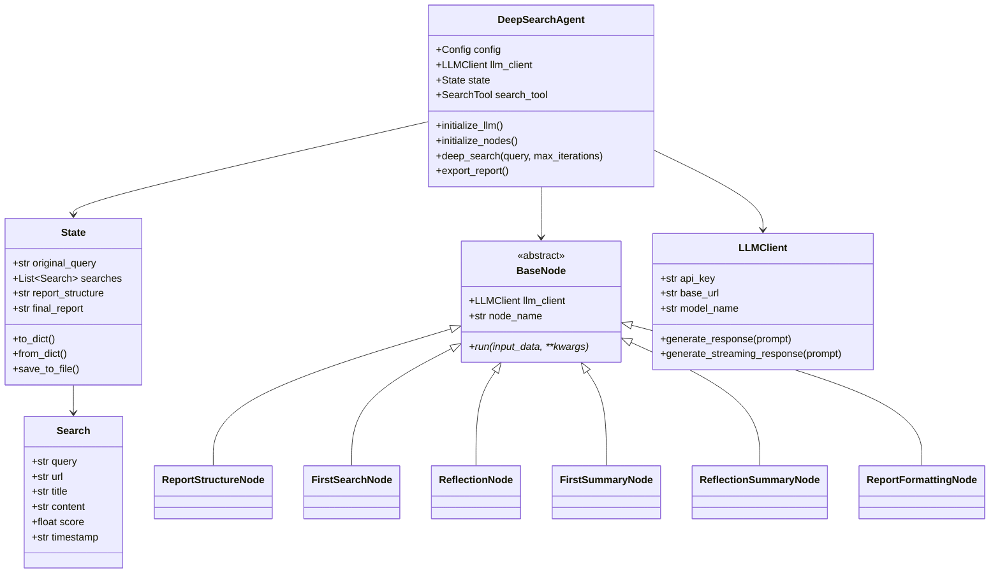
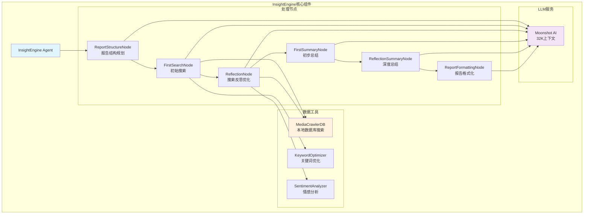
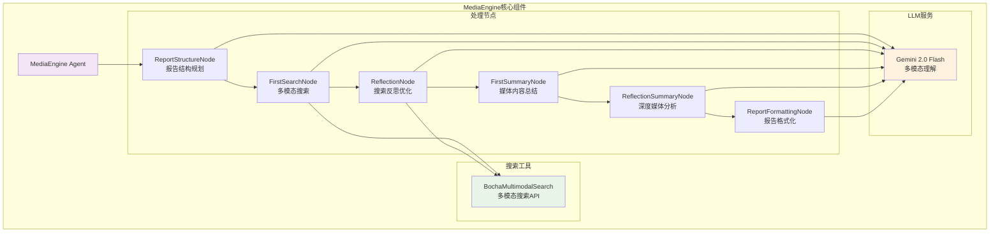
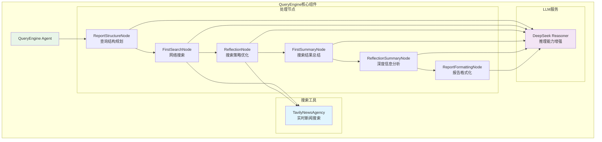
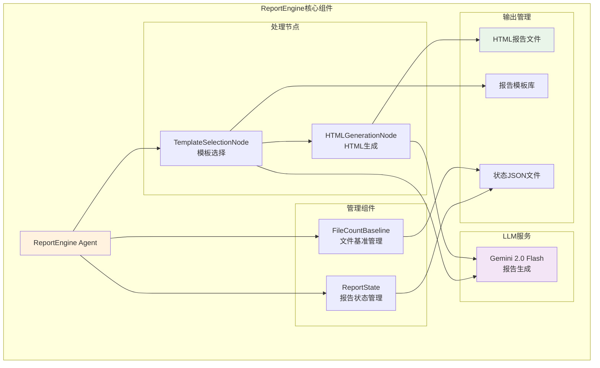
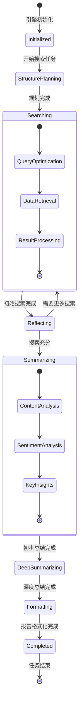
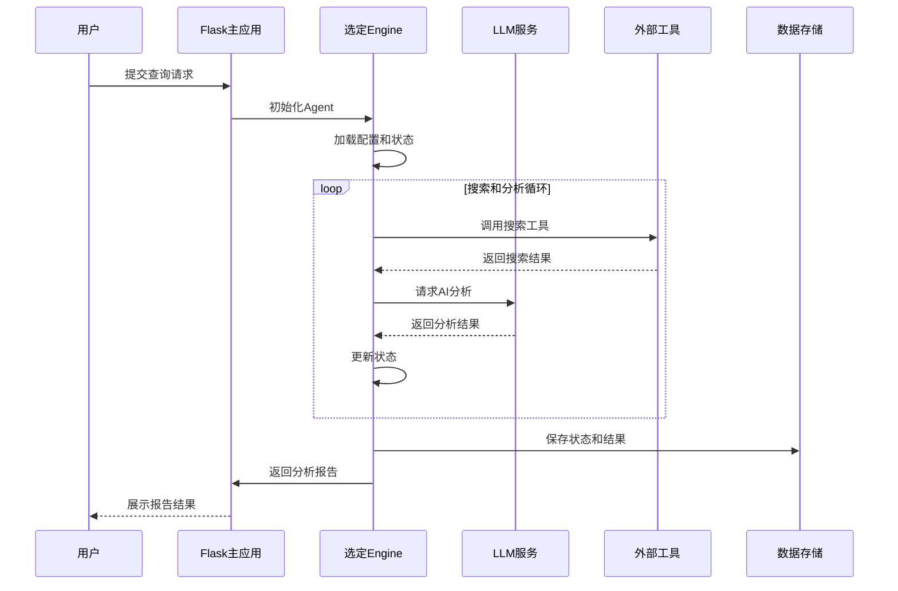

# BettaFish 核心引擎模块详解

## 模块概述

BettaFish项目的核心由5个专业化的AI Agent引擎组成，每个引擎都采用相似的架构模式但针对不同的业务场景进行了优化。

## Engine模块通用架构

**通用架构说明：**
所有Engine都遵循相同的设计模式：DeepSearchAgent作为主控制器，管理State状态对象，通过LLMClient与AI服务交互，使用多个专业化的Node节点执行具体任务。BaseNode定义了节点的统一接口，各个具体Node实现特定的处理逻辑。State对象管理整个搜索和分析过程的状态数据。

## InsightEngine（洞察引擎）

### 功能架构

**InsightEngine架构说明：**
InsightEngine专注于本地数据库的深度洞察分析。工作流程从报告结构规划开始，通过初始搜索获取相关数据，经过反思优化改进搜索策略，然后进行多层次总结，最终生成格式化报告。核心依赖MediaCrawlerDB进行数据检索，使用关键词优化和情感分析提升分析质量。

### 核心特性
- **智能热度计算**：综合点赞、评论、分享等指标计算内容热度
- **多维度搜索**：支持话题搜索、时间范围搜索、平台特定搜索
- **情感分析**：集成多语言情感分析模型
- **反思机制**：通过反思节点优化搜索策略和结果质量

## MediaEngine（媒体引擎）

### 功能架构

**MediaEngine架构说明：**
MediaEngine专门处理多模态媒体内容分析，通过博查API获取图文视频等全媒体数据。采用Gemini 2.0作为LLM服务，利用其强大的多模态理解能力分析各种媒体内容。工作流程与其他Engine相似，但针对多媒体数据进行了优化。

### 核心特性
- **多模态搜索**：支持文本、图片、视频内容的统一搜索
- **实时媒体监控**：基于博查API的实时媒体内容追踪
- **跨平台整合**：整合多个媒体平台的内容数据
- **视觉内容理解**：利用AI模型理解图片和视频内容

## QueryEngine（查询引擎）

### 功能架构

**QueryEngine架构说明：**
QueryEngine专注于实时网络搜索和信息检索，通过Tavily API获取最新的网络资讯。使用DeepSeek Reasoner作为LLM服务，利用其强大的推理能力对搜索结果进行深度分析和推理。特别适合处理需要实时信息和逻辑推理的查询任务。

### 核心特性
- **实时搜索**：基于Tavily API的全网实时搜索能力
- **新闻热点追踪**：专门针对新闻和热点事件的追踪分析
- **逻辑推理**：利用DeepSeek的推理能力进行深度分析
- **信息验证**：通过多源信息交叉验证提升结果可信度

## ReportEngine（报告引擎）

### 功能架构

**ReportEngine架构说明：**
ReportEngine专门负责报告的生成和格式化工作。通过模板选择节点选择合适的报告模板，HTML生成节点负责将分析结果转换为结构化的HTML报告。FileCountBaseline组件管理文件版本和基准，ReportState管理报告生成过程的状态。支持多种报告模板和自定义格式。

### 核心特性
- **模板化生成**：支持多种预定义报告模板
- **HTML格式输出**：生成结构化的HTML报告文件
- **版本管理**：自动管理报告版本和文件基准
- **状态追踪**：完整记录报告生成过程和状态

## 状态管理系统

**状态管理说明：**
系统采用状态机模式管理整个分析流程。从初始化开始，经过结构规划、搜索、反思、总结、深度总结和格式化等阶段，每个阶段都有明确的状态转换条件。搜索和总结阶段内部还有子状态，确保处理过程的完整性和可追溯性。

## 通信与协作机制

**通信协作说明：**
系统采用事件驱动的通信模式。用户请求通过Flask主应用路由到对应的Engine，Engine内部通过状态管理协调各个Node的执行，与外部LLM服务和搜索工具进行异步通信，最终将结果返回给用户。整个过程支持实时状态更新和进度追踪。