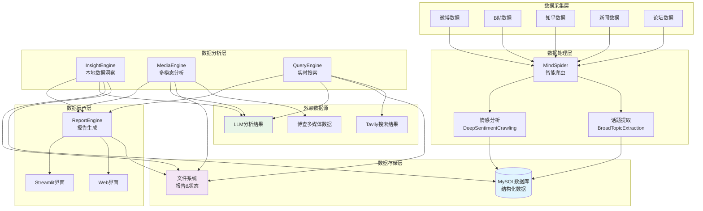
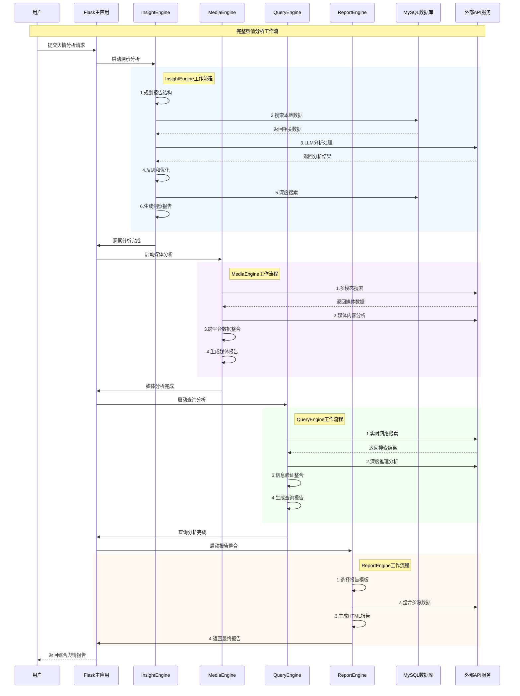
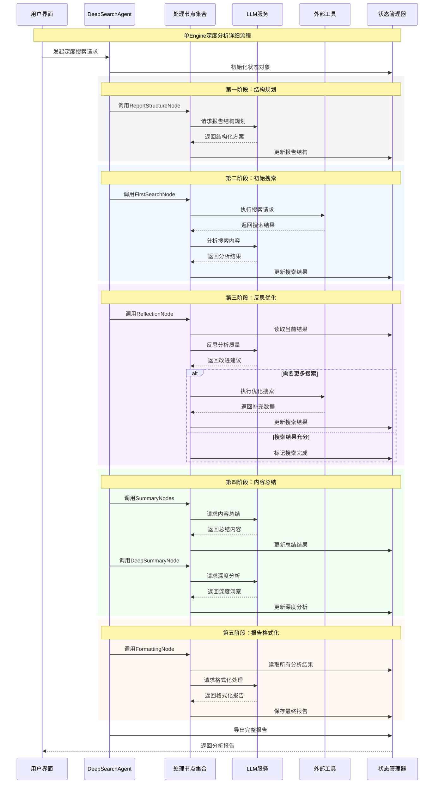
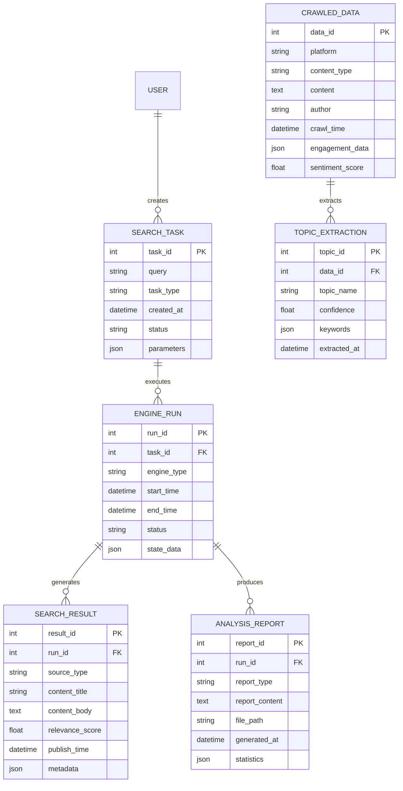
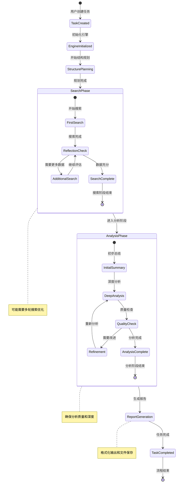
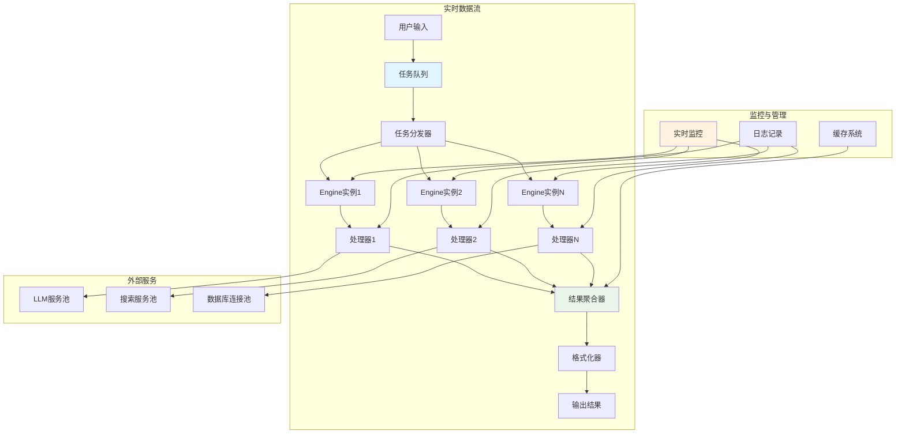
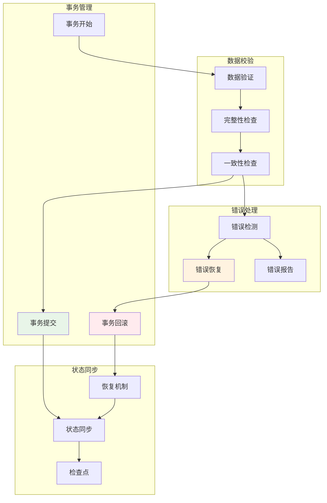

# BettaFish 数据流与业务时序分析

## 系统数据流概览

**数据流说明：**
系统数据流分为五个层次：数据采集层收集各平台原始数据，数据处理层通过智能爬虫进行话题提取和情感分析，数据存储层管理结构化数据和文件，数据分析层通过三个Engine进行不同维度的分析，数据展示层生成报告并提供用户界面。整个流程支持实时数据处理和批量数据分析。

## 核心业务时序图

### 1. 完整舆情分析流程

**完整流程说明：**
该时序图展示了BettaFish系统进行完整舆情分析的全流程。用户请求通过Flask应用依次调用四个核心Engine，每个Engine专注不同的数据源和分析维度，最终由ReportEngine整合生成综合报告。整个过程采用顺序执行模式，确保数据的完整性和一致性。

### 2. 单Engine深度分析时序

**单Engine流程说明：**
该图详细展示了单个Engine内部的工作时序。每个阶段都有明确的职责：结构规划确定分析框架，初始搜索获取基础数据，反思优化提升分析质量，内容总结提取关键信息，报告格式化生成最终输出。整个过程通过State对象管理状态，支持断点续传和错误恢复。

## 数据存储与状态管理

### 数据存储架构

**数据存储说明：**
系统采用关系型数据库设计，支持用户任务管理、引擎执行跟踪、搜索结果存储和分析报告管理。同时维护爬取数据和话题提取的历史记录，实现数据的完整性和可追溯性。各表通过外键关联，支持复杂的数据查询和分析。

### 状态流转图

**状态流转说明：**
系统采用状态机模式管理任务执行流程。从任务创建开始，经过引擎初始化、结构规划、搜索阶段、分析阶段和报告生成等步骤。搜索和分析阶段内部有子状态循环，支持迭代优化和质量控制。每个状态转换都有明确的条件和检查点。

## 实时数据流处理

**实时处理说明：**
系统支持实时数据流处理，通过任务队列和分发器实现负载均衡。多个Engine实例并行处理任务，结果通过聚合器统一收集。监控系统实时跟踪处理状态，日志记录支持问题诊断，缓存系统提升响应性能。外部服务池确保高并发处理能力。

## 数据一致性保障

**数据一致性说明：**
系统通过事务管理确保数据一致性，包含完整的验证、检查和错误处理机制。支持自动错误恢复和状态同步，通过检查点机制实现断点续传。在异常情况下能够自动回滚并恢复到安全状态，保障数据的完整性和系统的稳定性。