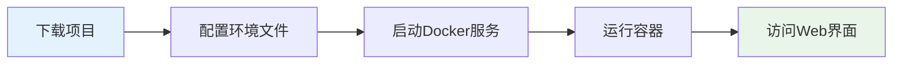
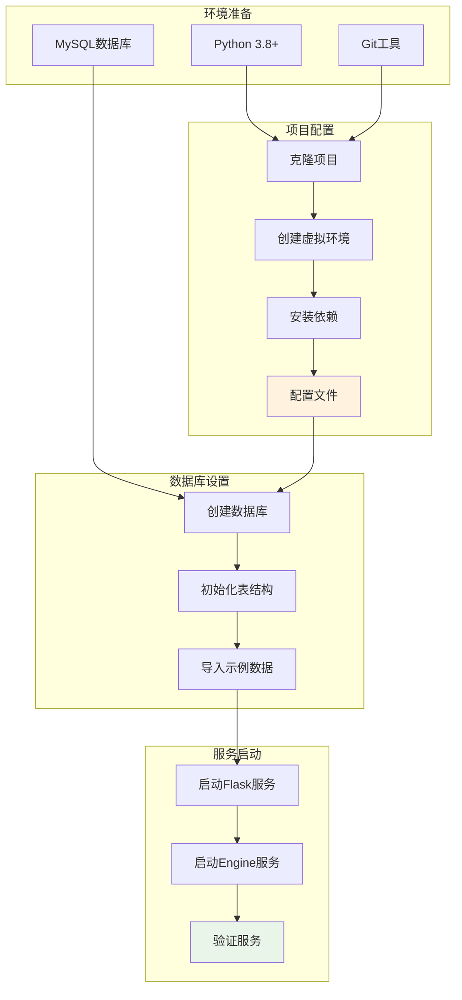
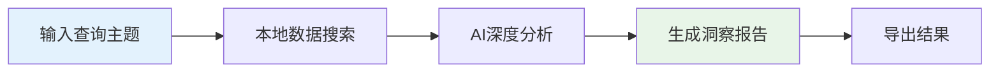
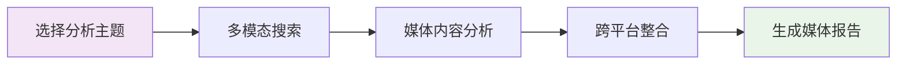
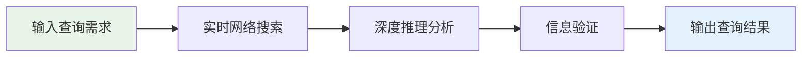
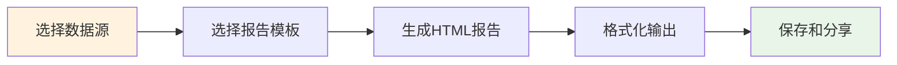
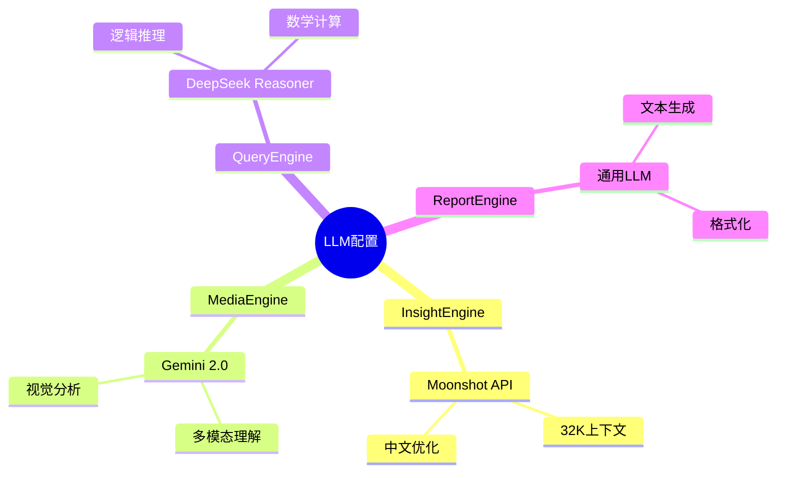
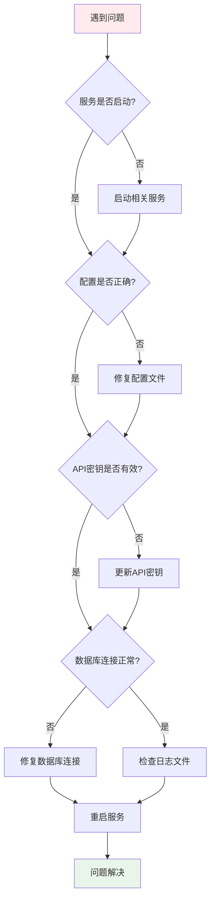

# BettaFish 快速入门指南

## 项目简介

BettaFish是一个AI驱动的多智能体舆情分析平台，通过集成多个专业化的分析引擎，提供全方位的舆情监控、分析和报告生成服务。

## 环境要求

### 系统要求
- **操作系统**: Windows 10+ / macOS 10.15+ / Ubuntu 18.04+
- **Python版本**: 3.8+
- **内存**: 8GB以上推荐
- **存储**: 至少10GB可用空间

### 核心依赖
- MySQL数据库服务
- Docker（可选，用于容器化部署）
- Git版本控制

## 快速安装部署

### 方式一：Docker容器部署（推荐）



**Docker部署流程说明：**
这是推荐的部署方式，通过Docker容器化技术实现一键部署。整个流程包括下载项目、配置环境、启动Docker服务、运行容器和访问界面五个步骤，简化了复杂的环境配置过程。

#### 1. 克隆项目
```bash
git clone https://github.com/666ghj/BettaFish.git
cd BettaFish
```

#### 2. 配置环境文件
```bash
# 复制配置模板
cp config.py.example config.py

# 编辑配置文件，填入你的API密钥和数据库信息
vim config.py
```

#### 3. 启动服务
```bash
# 构建并启动所有服务
docker-compose up -d

# 查看服务状态
docker-compose ps
```

#### 4. 访问服务
- **主Web界面**: http://localhost:5000
- **InsightEngine**: http://localhost:8501
- **MediaEngine**: http://localhost:8502  
- **QueryEngine**: http://localhost:8503
- **ReportEngine**: http://localhost:8504

### 方式二：本地环境部署



**本地部署流程说明：**
本地部署适合开发和定制需求，需要手动配置各个环境组件。流程包括环境准备、项目配置、数据库设置和服务启动四个主要阶段，每个阶段都有具体的操作步骤。

#### 1. 环境准备
```bash
# 安装Python虚拟环境
python3 -m venv venv
source venv/bin/activate  # Linux/macOS
# venv\Scripts\activate    # Windows

# 克隆项目
git clone https://github.com/666ghj/BettaFish.git
cd BettaFish

# 安装依赖
pip install -r requirements.txt
```

#### 2. 数据库配置
```sql
-- 创建数据库
CREATE DATABASE `betta-fish` CHARACTER SET utf8mb4 COLLATE utf8mb4_unicode_ci;

-- 创建用户（可选）
CREATE USER 'bettafish'@'localhost' IDENTIFIED BY 'your_password';
GRANT ALL PRIVILEGES ON `betta-fish`.* TO 'bettafish'@'localhost';
FLUSH PRIVILEGES;
```

#### 3. 配置文件设置
```python
# config.py - 主要配置项
DB_HOST = "127.0.0.1"
DB_PORT = 3306
DB_USER = "your_username"
DB_PASSWORD = "your_password"
DB_NAME = "betta-fish"

# LLM API配置（根据需要选择配置）
INSIGHT_ENGINE_API_KEY = "your_moonshot_api_key"
MEDIA_ENGINE_API_KEY = "your_gemini_api_key"
QUERY_ENGINE_API_KEY = "your_deepseek_api_key"
REPORT_ENGINE_API_KEY = "your_gemini_api_key"
```

#### 4. 启动服务
```bash
# 启动主Flask应用
python app.py

# 在新终端启动各个Engine（可选）
streamlit run InsightEngine/app.py --server.port 8501
streamlit run MediaEngine/app.py --server.port 8502
streamlit run QueryEngine/app.py --server.port 8503
```

## 核心功能使用指南

### 1. 洞察分析（InsightEngine）



**使用场景**: 基于本地舆情数据库的深度洞察分析
**操作步骤**:
1. 访问 http://localhost:8501
2. 在查询框输入分析主题（如"武汉大学舆情"）
3. 选择时间范围和搜索参数
4. 点击"开始深度搜索"
5. 等待分析完成，查看生成的洞察报告

### 2. 媒体分析（MediaEngine）



**使用场景**: 多模态媒体内容的跨平台分析
**操作步骤**:
1. 访问 http://localhost:8502
2. 输入媒体分析主题
3. 配置搜索范围（文本、图片、视频）
4. 执行多模态搜索分析
5. 查看跨平台媒体内容报告

### 3. 实时查询（QueryEngine）



**使用场景**: 实时网络信息搜索和智能推理分析
**操作步骤**:
1. 访问 http://localhost:8503  
2. 输入实时查询问题
3. 选择搜索深度和范围
4. 启动智能搜索分析
5. 获取实时分析结果

### 4. 报告生成（ReportEngine）



**使用场景**: 专业化报告生成和格式化输出
**操作步骤**:
1. 访问 http://localhost:8504
2. 选择要整合的分析结果
3. 选择报告模板和样式
4. 配置报告参数
5. 生成和下载HTML格式报告

## API接口使用

### RESTful API

系统提供标准的RESTful API接口，支持程序化调用：

```python
import requests

# 启动洞察分析
response = requests.post('http://localhost:5000/api/insight/analyze', json={
    'query': '武汉大学舆情',
    'time_range': '7days',
    'max_iterations': 3
})

# 获取分析结果
result = response.json()
print(result['report_url'])

# 生成综合报告
report_response = requests.post('http://localhost:5000/api/report/generate', json={
    'sources': ['insight_result', 'media_result', 'query_result'],
    'template': 'comprehensive',
    'format': 'html'
})
```

### WebSocket实时通信

支持WebSocket实时获取分析进度：

```javascript
const socket = io('http://localhost:5000');

socket.on('analysis_progress', (data) => {
    console.log(`分析进度: ${data.progress}%`);
    console.log(`当前阶段: ${data.stage}`);
});

socket.on('analysis_complete', (data) => {
    console.log('分析完成', data.report_url);
});
```

## 配置说明

### LLM服务配置



**LLM配置说明：**
系统支持多种LLM服务的灵活配置。每个Engine可以配置不同的LLM服务，充分发挥各模型的特长。InsightEngine使用Moonshot的大上下文能力，MediaEngine利用Gemini的多模态理解，QueryEngine发挥DeepSeek的推理优势，ReportEngine使用通用模型进行文本生成。

### 数据源配置

不同Engine支持不同的数据源：

| Engine | 主要数据源 | 配置项 |
|--------|-----------|--------|
| InsightEngine | 本地MySQL数据库 | DB_HOST, DB_USER, DB_PASSWORD |
| MediaEngine | 博查多模态API | BOCHA_API_KEY |
| QueryEngine | Tavily搜索API | TAVILY_API_KEY |
| ReportEngine | 文件系统 | 报告模板路径 |

## 故障排除

### 常见问题解决



**故障排除流程说明：**
系统采用分层诊断的方法解决问题。从服务状态开始检查，逐步排查配置、API密钥、数据库连接等可能的问题点，最后通过日志分析定位具体原因。每个步骤都有明确的解决方案，确保快速恢复服务。

### 日志查看

```bash
# 查看主应用日志
tail -f logs/app.log

# 查看特定Engine日志
tail -f insight_engine_streamlit_reports/logs/

# 查看Docker容器日志
docker-compose logs -f bettafish
```

### 性能优化

1. **数据库优化**
   - 为常用查询字段添加索引
   - 定期清理过期数据
   - 使用连接池管理数据库连接

2. **缓存策略**
   - 启用LLM响应缓存
   - 缓存常用搜索结果
   - 使用Redis提升缓存性能

3. **并发处理**
   - 配置合适的工作进程数
   - 使用异步处理长时间任务
   - 实现负载均衡

## 扩展开发

### 添加新Engine

```python
# 1. 创建新Engine目录结构
mkdir NewEngine
mkdir NewEngine/{llms,nodes,tools,utils,state}

# 2. 实现Agent主类
class NewSearchAgent(DeepSearchAgent):
    def __init__(self, config=None):
        super().__init__(config)
        # 自定义初始化逻辑
        
    def custom_search_method(self):
        # 实现专门的搜索逻辑
        pass

# 3. 注册到主应用
app.register_blueprint(new_engine_bp, url_prefix='/api/new_engine')
```

### 自定义节点

```python
from InsightEngine.nodes.base_node import BaseNode

class CustomProcessingNode(BaseNode):
    def run(self, input_data, **kwargs):
        # 实现自定义处理逻辑
        processed_data = self.custom_processing(input_data)
        return processed_data
    
    def custom_processing(self, data):
        # 具体处理算法
        return processed_data
```

### API接口扩展

```python
from flask import Blueprint, request, jsonify

custom_bp = Blueprint('custom', __name__)

@custom_bp.route('/analyze', methods=['POST'])
def custom_analyze():
    data = request.get_json()
    # 自定义分析逻辑
    result = perform_custom_analysis(data)
    return jsonify(result)

app.register_blueprint(custom_bp, url_prefix='/api/custom')
```

## 下一步

1. **熟悉界面**: 浏览各个Engine的Web界面，了解功能特性
2. **试运行**: 使用示例数据进行试运行，验证系统功能
3. **配置优化**: 根据实际需求调整配置参数
4. **数据导入**: 导入自己的舆情数据进行分析
5. **定制开发**: 根据业务需求进行功能扩展

## 技术支持

- **项目主页**: https://github.com/666ghj/BettaFish
- **问题反馈**: 通过GitHub Issues提交问题
- **技术讨论**: 加入项目讨论群
- **文档更新**: 查看最新版本的使用文档

通过本快速入门指南，你应该能够成功部署和使用BettaFish舆情分析平台。如有问题，请参考故障排除部分或寻求技术支持。